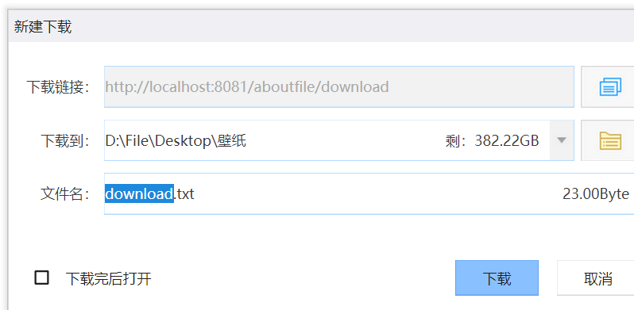
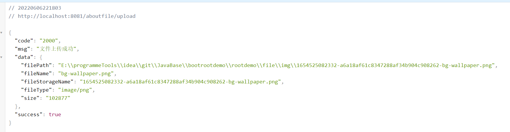
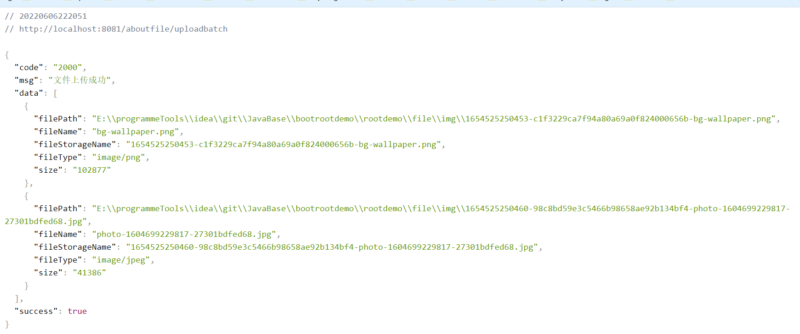

#### 文件下载

> 文件下载将服务器上的文件下载到本地。

就是通过Response将文件流输出到网页。

请求参数：也就是如何定位到一个文件？

路径+文件名

定义抽象方法：

```java
void downloadFile(String filePath, String fileName, HttpServletResponse resp);
```

实现：

```java
@Override
public void downloadFile(String filePath, String fileName, HttpServletResponse resp) {
    File file = new File(filePath, fileName);
    if (!file.exists()) {
        log.info("文件资源不存在,{path:{}，filename:{}}", filePath, fileName);
        throw new GlobalCustomException("5000", "资源不存在");
    }
    //2、 读取文件--输入流
    InputStream input;
    //3、 写出文件--输出流
    OutputStream out;
    try {
        //1、设置resp 响应头
        resp.reset(); //设置页面不缓存,清空buffer
        resp.setCharacterEncoding("UTF-8"); //字符编码
        resp.setContentType("multipart/form-data"); //二进制传输数据
        //设置响应头 解决弹出框中文乱码问题
        resp.setHeader("Content-Disposition",
                "attachment;fileName=" + URLEncoder.encode(fileName, "UTF-8"));

        input = new FileInputStream(file);
        //3、 写出文件--输出流
        out = resp.getOutputStream();
        byte[] buff = new byte[1024];
        int index;
        //4、执行 写出操作
        while ((index = input.read(buff)) != -1) {
            out.write(buff, 0, index);
            out.flush();
        }
        out.close();
        input.close();
    } catch (IOException e) {
        log.info("文件传输出现异常:{}", e.getMessage());
        throw new GlobalCustomException("5000", "文件传输出现异常");
    }
}
```


定义控制器：

```java
@Slf4j
@RestController
public class FileDownload {

    @Resource
    FileInterface fileInterface;

    @RequestMapping(value = "/download", method = RequestMethod.GET)
    public void download(HttpServletResponse resp) {

        String filePath = System.getProperty("user.dir") + "/file";
        String filename = "download.txt";
        log.info("文件路径：{},文件名称：{}", filePath, filename);
        fileInterface.downloadFile(filePath, filename, resp);
    }


}
```

测试：



#### 文件上传&结果回传

> 写一个简单的html页面

```html
<!DOCTYPE html>
<html lang="en" xmlns:th="http://www.thymeleaf.org">
<head>
    <meta charset="UTF-8">
    <title>文件上传</title>
</head>
<body>
<p>单文件上传</p>
<form method="post" action="/aboutfile/upload" enctype="multipart/form-data">
    <p><input type="file" name="file"></p>
    <!--    <p><span th:text="${msg}"></span></p>-->
    <input type="submit" value="提交">
</form>

<hr/>
<p>多文件上传</p>
<form method="post" enctype="multipart/form-data" action="/aboutfile/uploadbatch">
    <p>文件1：<input type="file" name="file"/></p>
    <p>文件2：<input type="file" name="file"/></p>
    <p><input type="submit" value="上传"/></p>
</form>

</body>
</html>
```

> 写一个跳转到上传文件页面的Controller

```java
@Slf4j
@Controller
public class CommonPageController {


    @RequestMapping(value = "/toupload", method = RequestMethod.GET)
    public String toUpload() {
        return "upload";
    }

}
```

> 关于配置最好写一下

```yml
server:
  servlet:
    context-path: /aboutfile
  port: 8081
spring:
  thymeleaf:
    prefix: classpath:/templates/
    suffix: .html
```

> 文件上传控制器

```java
@RestController
@Slf4j
public class FileUpload {
    @Resource
    FileInterface fileInterface;

    @RequestMapping("/upload")
    @ResponseBody
    public ResultVo<FileRespVo> upload(MultipartFile file) {
        return fileInterface.uploadFile(file);

    }
}
```

> service

ResultVo这个是一个全局的通用返回结果。

MultipartFile是SpringMVC提供简化文件上传操作的工具类。

```java
@Override
public ResultVo<FileRespVo> uploadFile(MultipartFile file) {

    if (file.isEmpty()) {
        return ResultVo.error("上传为空，请重试！", null);
    }
    //获取文件名
    String originalFilename = file.getOriginalFilename();
    log.info("文件名：{}", originalFilename);
    //文件类型
    String contentType = file.getContentType();
    log.info("文件类型：{}", contentType);
    //文件大小
    Long size = file.getSize();
    log.info("文件大小：{}", size.toString());
    //获取当前项目  父级目录
    String root = System.getProperty("user.dir");
    File fileRoot = new File(root, "/file/img");
    if (!fileRoot.exists()) {
        fileRoot.mkdirs();
    }
    //唯一性处理 这里简单 （雪花算法。。。。）
    long time = new Date().getTime();
    String uuid = UUID.randomUUID().toString().replace("-", "");
    String fileName = time + "-" + uuid + "-" + originalFilename;
    log.info("文件按存储名：{}", fileName);
    try {
        File target = new File(fileRoot.getPath() + File.separator , fileName);
        //File.separator  文件分割符 =>  '/'
        file.transferTo(target);
        log.info("真实存储路径：{}", root + File.separator  + File.separator + fileName);
    } catch (IOException e){

    }
    //throw new GlobalCustomException("5000", "文件上传异常！");
    FileRespVo fileRespVo = new FileRespVo()
            .setFileName(originalFilename)
            .setFilePath(fileRoot.getPath() + File.separator + fileName)
            .setFileStorageName(fileName)
            .setFileType(contentType)
            .setSize(size.toString());

    return ResultVo.success("文件上传成功", fileRespVo);
}
```

> 测试




##### 多文件上传也是一样的

只不过接收参数的方式不一样：

MultipartHttpServletRequest是MultipartRequest的子类可以利用

```java
@RequestMapping("/uploadbatch")
@ResponseBody
public ResultVo<List<FileRespVo>> uploadBatch(MultipartHttpServletRequest files) {
    List<MultipartFile> file = files.getFiles("file");
    assert file.size() > 0;
    return fileInterface.uploadFiles(file);
}
```

> 这里就可以借助单文件上传来实现

```java
@Override
public ResultVo<List<FileRespVo>> uploadFiles(List<MultipartFile> files) {

    List<FileRespVo> list = new ArrayList<>();
    files.forEach(file -> {
        ResultVo<FileRespVo> resultVo = this.uploadFile(file);
        if (resultVo.isSuccess()) {
            list.add(resultVo.getData());
        }
    });

    return ResultVo.success("文件上传成功", list);
}
```

> 测试：




#### 总结

> 这篇文章基于多模块的Maven项目，各位在处理异常和返回结果的时候，可以用日志代替。后面总结一下如何构建一个多模块的maven项目。