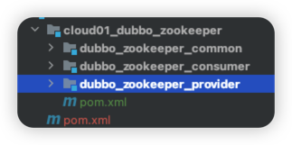
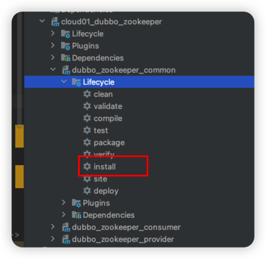
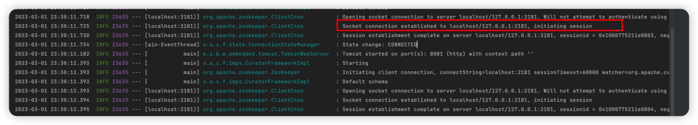
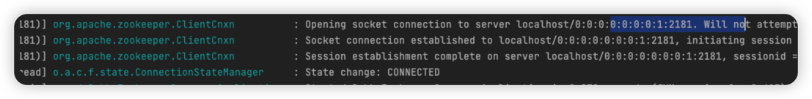
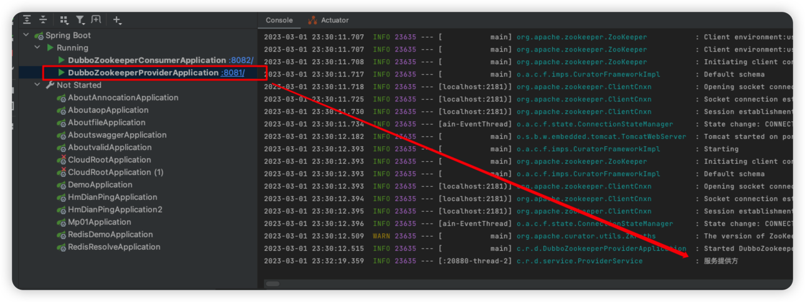

# Cloud-DEmo


## Double + Zookeeper


### Zookeeper安装

#### 下载

[zookeeper下载地址](https://dlcdn.apache.org/zookeeper/zookeeper-3.7.1/apache-zookeeper-3.7.1-bin.tar.gz)

安装路径：

```bash
/Users/rolyfish/Desktop/software/zookeeper
```

### 配置

- 创建data文件夹：

```bash
mkdir data
```

- 拷贝配置文件

```bash
➜  zookeeper cd conf
➜  conf cp zoo_sample.cfg zoo.cfg
```

- 修改配置文件

```bash
## zookeeper默认配置文件为zoo.cfg
➜  conf vim zoo.cfg
## 修改路径
dataDir=/Users/rolyfish/Desktop/software/zookeeper/data

## 修改zookeeper工作端口，默认为8080，影响我们常用接口
admin.serverPort=2182
```


### 启动Zookeeper

```bash
➜  conf cd ../bin
# 查看zookeeper状态
➜  bin ./zkServer.sh status
ZooKeeper JMX enabled by default
Using config: /Users/rolyfish/Desktop/software/zookeeper/bin/../conf/zoo.cfg
Client port found: 2181. Client address: localhost. Client SSL: false.
Mode: standalone
# 停止zookeeper
➜  bin ./zkServer.sh stop
ZooKeeper JMX enabled by default
Using config: /Users/rolyfish/Desktop/software/zookeeper/bin/../conf/zoo.cfg
Stopping zookeeper ... STOPPED
# 启动Zookeeper 这里可以看见 使用的默认配置文件，当然我们也可以指定
➜  bin ./zkServer.sh start
ZooKeeper JMX enabled by default
Using config: /Users/rolyfish/Desktop/software/zookeeper/bin/../conf/zoo.cfg
Starting zookeeper ... STARTED
```


### zcli查看

```bash
## ls命令 - 查看节点
[zk: localhost:2181(CONNECTED) 19] ls /
[dubbo, services, zookeeper]
## 我们注册的节点都会放在services下
[zk: localhost:2181(CONNECTED) 20] ls /services
[]
```


### demo

> 三个模块
>
> - 一个模块提供，接口，并作为jar包被其他两个模块引入
> - 一个服务提供者
> - 一个服务消费者

#### 整体结构：



#### 安装common模块到本地



#### 添加依赖

> 其他比如spring-boot-starter-web、lombok自行添加
>
> 这里主要添加dubbo-spring-boot-starter、dubbo-registry-zookeeper这两个依赖
>
> dubbo-registry-zookeeper使得注册服务更加容易了

```java
<dependency>
    <groupId>org.apache.dubbo</groupId>
    <artifactId>dubbo-spring-boot-starter</artifactId>
    <version>3.1.7</version>
</dependency>

<!-- https://mvnrepository.com/artifact/org.apache.dubbo/dubbo-registry-zookeeper -->
<dependency>
    <groupId>org.apache.dubbo</groupId>
    <artifactId>dubbo-registry-zookeeper</artifactId>
    <version>3.1.7</version>
</dependency>
```


#### 创建服务提供、消费模块

> 作为父项目的子模块创建

启动类加上@EnableDubbo注解

```java
@EnableDubbo
```

common模块只有一个接口：

```java
public interface ServiceProvider {
    String msg();
}
```

provider模块提供服务：

```java
@DubboService
@Slf4j
@Data
public class ProviderService implements ServiceProvider {
    @Override
    public String msg() {
        log.info("服务提供方");
        return "服务提供方返回数据";
    }
}
```

consumer模块消费服务：

```java
@Controller
public class ServiceConsumer {
    @DubboReference
    ServiceProvider serviceProvider;
    @PostMapping("/consumer")
    public String consumer(){
        return serviceProvider.msg();
    }
}
```


#### 配置

> 现在provider和consumer都有dubbo和dubbo-registry依赖了

provider:

```yml
server:
  port: 8081

dubbo:
  application:
    name: dubbo-provider
  registry:
    address: zookeeper://localhost:2181
```

Consumer:

```yml
server:
  port: 8082

dubbo:
  application:
    name: dubbo-consumer
  registry:
    address: zookeeper://localhost:2181
```


#### 启动服务

服务正确注册：



服务成功获取：



请求接口：



zkcli查看服务是否注册：

> dubbo-provider就是我们注册进zookeeper的节点服务名称：

```bash
[zk: localhost:2181(CONNECTED) 2] ls /services
[dubbo-provider]
```


