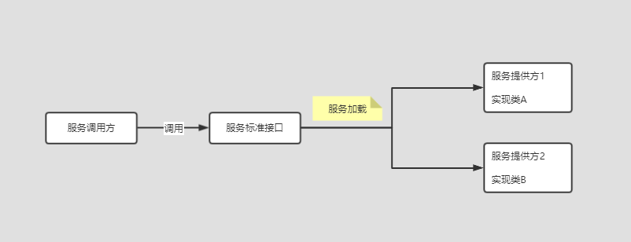
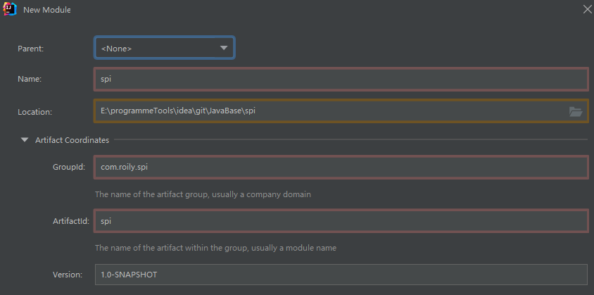
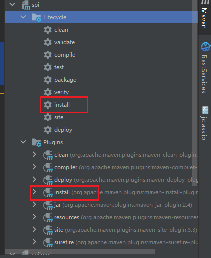
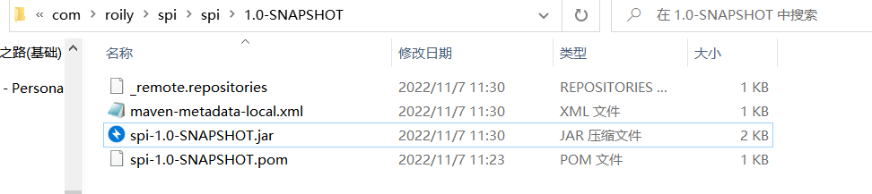
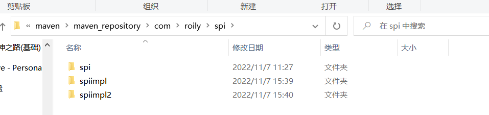
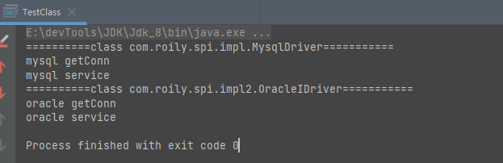

## Pdai


###  Java8特性


#### Optional

> NPE空指针异常不可避免，那么如何处理呢？
>
> Java8引入Optional类，这是一个容器对象，容器内可存储null值，通过Optional的IsPresent()方法可判断内部元素是否为null。且内部丰富api可灵活操作

##### Optional的创建

> Optional的两个构造方法都是私有的，也就是不供外部使用，也就是我们不可正常通过构造方法来创建Optional对象。但是还好Optional为我们提供了三个静态方法来创建Optional对象。

```java
private Optional() {
    this.value = null;
}
private Optional(T value) {
  this.value = Objects.requireNonNull(value);
}
```

> 如下三个静态方法

```java
public static<T> Optional<T> empty() {
    @SuppressWarnings("unchecked")
    Optional<T> t = (Optional<T>) EMPTY;
    return t;
}
public static <T> Optional<T> of(T value) {
  return new Optional<>(value);
}
public static <T> Optional<T> ofNullable(T value) {
  return value == null ? empty() : of(value);
}
```


##### 基本方法

- empty

  > 创建一个内部元素==为null==的Optional对象

  ```java
  /**
   * 创建一个内部元素为null的Optional对象
   */
  @Test
  public void testEmpty() {
      final Optional<Object> empty = Optional.empty();
  }
  ```

- of

  > 创建一个内部元素==不可为null==的Optional对象
  >
  > 如果传入nul值则会抛出NPE异常。

  ```java
  final Optional<String> optional = Optional.of("str");
  ```

- ofNullable

  > 与of()方法相似，只不过optional内部元素==允许为null==

  ```java
  final Optional<String> optionalOfNullable = Optional.ofNullable(null);
  ```

- isPresent

  > 判断Optional容器内的对象是否为null。不为null返回true，为null返回false

  ```java
  final boolean present = optionalOfNullable.isPresent();
  ```

- get

  > 返回Optional容器中的值。
  >
  > 元素对象不为null则返回，为null则抛异常：  NoSuchElementException。
  
  ```java
  final String s = optional.get();
  ```

- ifPresent

  > 如果内部元素为null则执行消费方法，如果不为null则跳过消费方法。
  
  ```java
  optional.ifPresent(System.out::println);
  ```

- orElse

  > Optional容器中元素不为null则返回对应值，如果为null则返回默认值(即orElse指定的值)
  
  ```java
  optionalOfNullable.orElse("other");
  ```

- orElseGet

  > 与orElse相似，不同的是此方法执行`Supplier`实现类的`get()`方法返回的值
  
  ```java
  optionalOfNullable.orElseGet(String::new);
  ```

- orElseThrow

  > 内部元素不为null返回，为null则抛出异常
  
  ```java
  optionalOfNullable.orElseThrow(NullPointerException::new);
  ```

- Map

  > 映射为一个新的Optional。
  >
  > Optional容器中值为null则返回空Optional(即执行empty()方法，内部元素为null)，否则映射为一个==可存null值==的新的Optional。即执行Optional.ofNullable(mapper.apply(value));

  ```java
  final Optional<String> optionalS = optional.map(ele -> "map");
  ```

- FlatMap

  > 映射为一个新的Optional。
  >
  > Optional容器中值为null则返回空Optional(即执行empty()方法，内部元素为null)，否则映射为一个新的Optional。

  ```java
  final Optional<String> optionalFlatMap = optional.flatMap(ele -> Optional.of("map"));
  ```

- filter

  > 过滤，符合条件返回this，不符合返回empty

  ```java
  //过滤，符合条件返回this，不符合返回empty
  final Optional<String> optionalS1 = optional.filter(ele -> ele.equals(""));
  ```

##### 使用

> 多层次的null值判断

bean：

```java
@Data
class Element1 {
    Element2 element2;
    @Data
    static class Element2 {
        Element3 element3;

        @Data
        static class Element3 {
            String str;
        }
    }
}
```

一般处理：

```java
final Element1 element1 = new Element1();
if (null != element1 && null != element1.getElement2() && null != element1.getElement2().getElement3()) {
    System.out.println(element1.getElement2().getElement3().getStr());
}
```

使用Optional：

```java
final Element1 element1 = new Element1();
Optional.ofNullable(element1).map(Element1::getElement2).map(Element1.Element2::getElement3).ifPresent(System.out::println);
```


**Optional+Supplier实现**

```java
class OptionalUtil {
    public static <T> Optional<T> resolve(Supplier<T> supplier) {
        try {
            T t = supplier.get();
            return Optional.ofNullable(t);
        } catch (NullPointerException e) {
            return Optional.empty();
        }
    }
}
```

```java
final Element1 element1 = new Element1();

OptionalUtil.resolve(() -> element1.getElement2().getElement3()).ifPresent(ele -> {
    System.out.println(ele.getStr());
});
```


#### 接口可定义default方法

> java接口中可定义默认方法。

##### 什么是默认方法 为何有默认方法

> 接口中的默认方法指的是实现类无需强制实现的方法。
>
> 默认方法是为了解决接口是固定的，修改的成本很大。解决了接口的修改与现有的实现不兼容的问题。

例子：

如下写法是可以通过编译的

```java
interface IDemo {
    default void m1() {
        System.out.println("默认方法");
    }
}
class IDemoImpl implements IDemo {
    public static void main(String[] args) {
        final IDemo iDemo = new IDemoImpl();
        iDemo.m1();
    }
}
```

##### 多继承问题

> 可以实现多个接口，从不同接口中引入相同方法则会有冲突。且接口可以继承，那么调用规则是很么样的？

- 实现类中的方法优先于任意默认方法
- 否则优先选择唯一且路径最短的

> 例一：
>
> 直接编译报错
>
> 实现类ICaseImpl1同时从ICaseA1和ICaseA2中继承了相同的方法，且路径一样长，调用时分不清，编译器直接阻止。

```java
interface ICaseA1 {
    default void m() {
        System.out.println("ICaseA1");
    }
}
interface ICaseA2 {
    default void m() {
        System.out.println("ICaseA2");
    }
}
class ICaseImpl1 implements ICaseA1, ICaseA2 {
    public static void main(String[] args) {

    }
}
```

> 例二：
>
> 如上解决方法就是参考第一条准则，实现类中的方法最优先，也就是在实现类中再定义一个同名方法

```java
class ICaseImpA2 implements ICaseA1, ICaseA2 {
    @Override
    public void m() {
        //ICaseA1.super代表 接口 ICaseA1
        ICaseA1.super.m();
    }
}
```

> 例三：
>
> 输出ICaseB3,优先选取唯一且路径最短的

```java
interface ICaseB1 {
    default void m() {
        System.out.println("ICaseB1");
    }
}
interface ICaseB2 {
    default void m() {
        System.out.println("ICaseB2");
    }
}
interface ICaseB3 extends ICaseB1 {
    @Override
    default void m() {
        System.out.println("ICaseB3");
    }
}
class ICaseImpB1 implements /* 可有可无，B3继承了B1和B2所有抽象接口，ICaseB1, ICaseB2,*/ ICaseB3 {
    public static void main(String[] args) {
        final ICaseImpB1 iCaseImpB1 = new ICaseImpB1();
        iCaseImpB1.m();
    }
}
```


> 例四：
>
> 调用接口的默认方法，实现存在默认方法的接口，调用语法： 接口.super.xxx()。
>
> 不可在静态方法中调用，default方法不可声明为static
>
> A.super.xxx() 调用的就是A接口的默认方法，而不是A接口的父接口的默认方法

```java
interface ICaseC1 {
    default void m() {
        System.out.println("ICaseC1");
    }
}
interface ICaseC2 extends ICaseC1{
    @Override
    default void m() {
        ICaseC1.super.m();
    }
}
class ICaseImpC1 implements ICaseC1{
    @Override
    public void m() {
        ICaseC1.super.m();
    }
  	public /* 不可 static*/ void m2() {
        ICaseC1.super.m();
    }
}
```


##### 小结

> 默认方法使得对接口进行修改，以兼容原有类实现提供便利。
>
> 接口默认方法调用规则：最短路径且唯一，如果不唯一则报错
>
> Java8中集合框架使用了大量默认方法对其进行改进。比如Iterable的foreach，迭代器的foreach方法是Java8引入的，而此接口是Java5引入的。

##### 类型注解

> 类型注解只是语法不是语义，不会影响编译。
>
> 比如说`String str  = null; str.length()`,运行期间会抛出NPE，如果使用类型注解，配合第三方工具即可在编译期间检查出来。


#### 重复注解

> Java8之前不可定义重复注解，但也可以实现重复注解的作用

- java8之前实现重复注解的作用

  ```java
  /**
   * java8之前
   */
  @interface Job {
      String value();
  }
  @interface Jobs {
      Job[] value();
  }
  class JobC {
      @Jobs(value = {@Job(value = "1"), @Job(value = "2")})
      String job;
  }
  ```

- java8重复注解

  ```java
  @Repeatable(Jobs8.class)
  @interface Job8 {
      String value();
  }
  @interface Jobs8 {
      Job8[] value();
  } 
  class JobC8 {
      @Job8(value = "1")
      @Job8(value = "2")
      String job;
  }
  ```


#### 类型推断优化

例子：

Jdk1.7对类型推断有限制，只有在泛型在上下文中显著声明才可以推断

Jdk1.8进行了优化

```java
//jdk 1.7 即以前
final List<String> strings = new ArrayList<String>();
strings.add("a");
strings.addAll(new ArrayList<>());//jdk7中报错
//jdk 1.8，进行类型推断
final List<String> stringsNew = new ArrayList<>();
```

> new ArrayList<>()中的`<>`不可省略，省略了就不会进行类型推断，就是原始类型


类型推断主要两种方式：

- 通过方法上下文推断
- 方法调用链路中，类型推断

```java
//通过目标参数类型，上下文推断
final List<String> init = Demo01.init();
//无需指定
final List<String> init2 = Demo01.<String>init();

//方法调用链路中推断
m(1, Demo01.init());
//无需指定
m(1, Demo01.<Integer>init());

static <T> List<T> init() {
    return new ArrayList<>();
}

static <T> void m(T t, List<T> list) {
}
```


#### 移除永久代

- 永久代

  > PermGen space ,内存永久保护区,这是一块内存空间，用于保存加载器加载的类信息和元数据，当一个项目类较多时，申请的永久代空间不足的话，就会出现OutofMearyError错误。往往出现在web程序加载Jsp的过程中。
  >
  > 可通过 -XX：MaxPermsSize=XXXm指定永久代空间大小

- 元空间

  > 移出永久代使用元空间代替。
  >
  > 移出永久代，  JVM参数 -XX：MaxPermsSize=XXXm 会被忽略，设置了会提出警告
  >
  > 元空间：
  >
  > - MaxMetaspaceSize参数设置元空间大小，如果不设置元空间大小受限于内存，可动态调整
  > - 元空间垃圾回收：达到MaxMetaspaceSize峰值或检测到僵死的类时，会进行垃圾回收，频繁的垃圾回收，说明存在内存泄露的类


对比：

永久代内存申请固定，小了会内存泄露，打了浪费内存资源。调整为元空间因为可以动态调整和GC的机制，便可不必担心永久代的问题


### Java基础

#### SPI机制

> Service Provider interface，是JDK内置的一种服务提供发现机制，可以为某个接口寻找服务实现，将装配的控制权移程序之外达到解耦的目的。

SPI机制流程：



当服务提供方提供了一种接口的实现，需要在classpath下的 `META-INF/services`下新建以接口全限定名称命名的文件，里面填写接口实现的全限定名称。当服务调用者需要调用此服务的时候，就搜索对应jar包的spi配置文件，读取解析配置文件，通过反射创建实例并存放入一个map结构体，key为实现类全限定名称，value为实现类实例对象。

JDK查找服务的实现工具是`java.util.ServiceLoader`


##### jdk  Spi应用

> 比如`java.sql.Driver`接口，这是JDK官方提供的标准数据库驱动接口，各大厂商(mysql、oracle)去实现这个接口。

引入两个驱动;

```xml
<dependency>
    <groupId>mysql</groupId>
    <artifactId>mysql-connector-java</artifactId>
    <version>8.0.28</version>
</dependency>
<!-- https://mvnrepository.com/artifact/com.oracle.database.jdbc/ojdbc8 -->
<dependency>
    <groupId>com.oracle.database.jdbc</groupId>
    <artifactId>ojdbc8</artifactId>
    <version>21.7.0.0</version>
</dependency>
```

测试

```java
public static void test6() throws SQLException {
    final ServiceLoader<Driver> load = ServiceLoader.load(Driver.class);
    final Iterator<Driver> iterator = load.iterator();
    while (iterator.hasNext()) {
        final Driver next = iterator.next();
        String url = "jdbc:mysql://localhost:3306/xtest?useUnicode=true&charactEncoding=utf8&useSSL=true&serverTimezone=GMT%2B8";
        String user = "root";
        String pass = "123456";
        final Properties properties = new Properties();
        properties.put("user", user);
        properties.put("password", pass);
        if (next instanceof com.mysql.cj.jdbc.Driver) {
            final Connection connect = next.connect(url, properties);
            final PreparedStatement prst = connect.prepareStatement("select * from user limit ?");
            prst.setInt(1, 10);
            final ResultSet resultSet = prst.executeQuery();
            while (resultSet.next()) {
                System.out.println(resultSet.getObject(2));
            }
            resultSet.close();
            prst.close();
            connect.close();
        }
    }
}
```


##### 例子

> 使用Spi机制写一个例子：
>
> idea + maven 即可

- 标准接口
  - 首先创建一个普通maven模块，这里面放标准接口，给调用方调用给服务方实现。

    

  - 写一个标准接口

    ```java
    public interface IDriver {
    
        void getConn();
    
        void service();
    }
    ```

  - 使用maven插件安装到本地

    

  - 查看安装

    

- 接口实现方

  - 引入标准接口模块

    ```xml
    <dependencies>
        <dependency>
            <groupId>com.roily.spi</groupId>
            <artifactId>spi</artifactId>
            <version>1.0-SNAPSHOT</version>
        </dependency>
    </dependencies>
    ```

  - 实现标准接口

    ```java
    public class MysqlDriver implements IDriver {
        @Override
        public void getConn() {
            System.out.println("mysql getConn");
        }
        @Override
        public void service() {
            System.out.println("mysql service");
    
        }
    }
    ```

  - 添加spi配置文件

    > 路径：classpath下的META-INF\services   即resoureces下的 META-INF\services 
    >
    > 文件名称  标准接口的全限定名称，内容实现类的全限定名称

    ```properties
    com.roily.spi.impl.MysqlDriver
    ```

  - 重复如上步骤，再添加一个

  - instaiil安装到本地

    

- 接口调用方

  - 创建模块

  - 引入依赖

    ```xml
    <dependencies>
        <dependency>
            <groupId>com.roily.spi</groupId>
            <artifactId>spi</artifactId>
            <version>1.0-SNAPSHOT</version>
        </dependency>
        <dependency>
            <groupId>com.roily.spi</groupId>
            <artifactId>spiimpl</artifactId>
            <version>1.0</version>
        </dependency>
        <dependency>
            <groupId>com.roily.spi</groupId>
            <artifactId>spiimpl2</artifactId>
            <version>1.0-SNAPSHOT</version>
        </dependency>
    </dependencies>
    ```

  - 测试

    ```java
    public static void main(String[] args) throws ClassNotFoundException {
        final ServiceLoader<IDriver> load = ServiceLoader.load(IDriver.class);
        final Iterator<IDriver> iterator = load.iterator();
        while (iterator.hasNext()) {
            final IDriver next = iterator.next();
            System.out.println("==========" + next.getClass() + "===========");
            next.getConn();
            next.service();
        }
    }
    ```

    


#### SpringBoot中的SPI

> SpringBoot的自动装配过程中，由SpringFactoriesLoader去加载META-INF/spring.factories文件，。他会寻找ClassPath下的每个META-INF/spring.factories配置文件，并解析为Properties对象，将信息放入一个`Map<String,List<>>`结构里面

```java
protected List<String> getAutoConfigurations() {
   if (this.autoConfigurations == null) {
      this.autoConfigurations = SpringFactoriesLoader.loadFactoryNames(EnableAutoConfiguration.class,
            this.beanClassLoader);
   }
   return this.autoConfigurations;
}

public static List<String> loadFactoryNames(Class<?> factoryType, @Nullable ClassLoader classLoader) {
    ClassLoader classLoaderToUse = classLoader;
    if (classLoaderToUse == null) {
        classLoaderToUse = SpringFactoriesLoader.class.getClassLoader();
    }
    String factoryTypeName = factoryType.getName();
    return loadSpringFactories(classLoaderToUse).getOrDefault(factoryTypeName, Collections.emptyList());
}
private static Map<String, List<String>> loadSpringFactories(ClassLoader classLoader) {
    Map<String, List<String>> result = cache.get(classLoader);
    if (result != null) {
        return result;
    }

    result = new HashMap<>();
    try {
        //获取类路径下所有spring.factories文件
        Enumeration<URL> urls = classLoader.getResources(FACTORIES_RESOURCE_LOCATION);
        while (urls.hasMoreElements()) {
            URL url = urls.nextElement();
            UrlResource resource = new UrlResource(url);
            //解析为Properties
            Properties properties = PropertiesLoaderUtils.loadProperties(resource);
            for (Map.Entry<?, ?> entry : properties.entrySet()) {
                //接口名称
                String factoryTypeName = ((String) entry.getKey()).trim();
                //实现类集合。以逗号分割
                String[] factoryImplementationNames =
                    StringUtils.commaDelimitedListToStringArray((String) entry.getValue());
                for (String factoryImplementationName : factoryImplementationNames) {
                    result.computeIfAbsent(factoryTypeName, key -> new ArrayList<>())
                        .add(factoryImplementationName.trim());
                }
            }
        }

        // Replace all lists with unmodifiable lists containing unique elements
        result.replaceAll((factoryType, implementations) -> implementations.stream().distinct()
                          .collect(Collectors.collectingAndThen(Collectors.toList(), Collections::unmodifiableList)));
        cache.put(classLoader, result);
    }
    catch (IOException ex) {
        throw new IllegalArgumentException("Unable to load factories from location [" +
                                           FACTORIES_RESOURCE_LOCATION + "]", ex);
    }
    return result;
}
```


