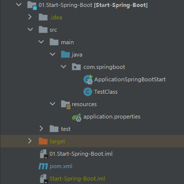
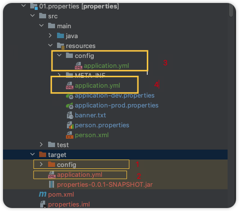
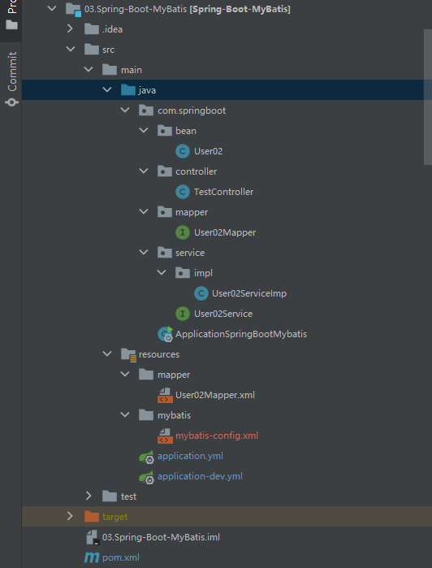
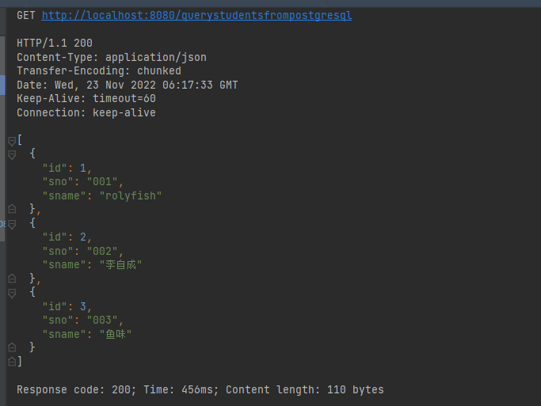
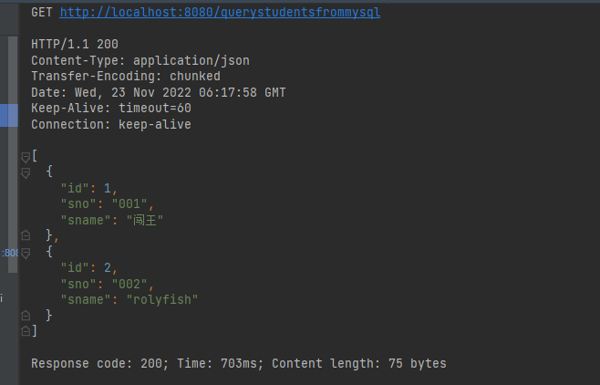
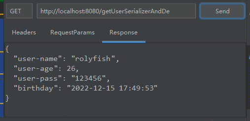
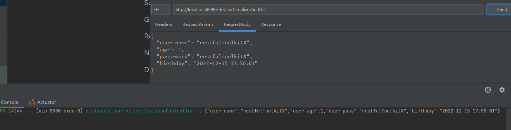
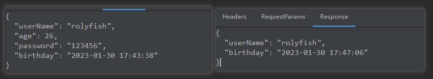

# SpringBoot-Demo


## Start-Spring-boot

> 构建SpringBoot项目，打印其自动装配的BeanDefinition信息。

### 结构



### 类别

#### 简单SpringBoot应用

##### pom文件

> pom文件只需要引入SpringBoot启动器和test启动器。

```xml
<dependencies>
    <dependency>
        <groupId>org.springframework.boot</groupId>
        <artifactId>spring-boot-starter-web</artifactId>
    </dependency>

    <dependency>
        <groupId>org.springframework.boot</groupId>
        <artifactId>spring-boot-starter-test</artifactId>
        <scope>test</scope>
    </dependency>

    <dependency>
        <groupId>junit</groupId>
        <artifactId>junit</artifactId>
        <scope>test</scope>
    </dependency>

    <dependency>
        <groupId>org.projectlombok</groupId>
        <artifactId>lombok</artifactId>
    </dependency>
</dependencies>
```

##### 启动类

> SpringBoot启动类为标注了`@SpringBootApplication`注解的类，主动装配扫描规则为：启动类同级目录及其子目录都会被扫描，启动类也是一个组件同样会被扫描，且启动类注解`@SpringBootApplication`具有继承性。

```java
@RestController
@SpringBootApplication
public class ApplicationSpringBootStart implements ApplicationContextAware {

   @RequestMapping("/")
   String index() {
      return "hello spring boot";
   }

   public static void main(String[] args) {
      SpringApplication.run(ApplicationSpringBootStart.class, args);
   }

   @Override
   public void setApplicationContext(ApplicationContext applicationContext) throws BeansException {
     	//class org.springframework.boot.web.servlet.context.AnnotationConfigServletWebServerApplicationContext
      System.err.println(applicationContext.getClass());
      final String[] beanDefinitionNames = applicationContext.getBeanDefinitionNames();
      for (String beanDefinitionName : beanDefinitionNames) {
         System.out.println(beanDefinitionName);
      }
   }
}
```

##### 其他 类

> 我们引入`spring-boot-starter-web`在程序启动时会初始化一个`WebApplicationContext`。

```java
@Component
public class TestClass {

    static {
        System.out.println(TestClass.class.getSimpleName() + "初始化");
    }
    @Autowired
    ApplicationContext applicationContext;
}
```

##### 测试

##### 问题

##### 小结


## SpringBoot-Config

> SpringBoot配置相关。


### 类别

#### 配置文件

> SpringBoot支持以下几种配置文件
>
> - .properties
> - .yaml
> - .yml
>
> 其中yaml和yml属于同一种会使用同一种解析器解析。
>
> yml文件相较于properties文件较为简洁，也常用。

##### 作为配置文件

> 可作为配置文件统一管理某些bean的默认值，这样通过修改配置文件即可管理bean的属性。

- 配置文件

```properties
properties.person.name=rolyfish
properties.person.hobby=ctrl
```

```yml
properties:
  person:
    name: rolyfish
    hobby: ctrl
```

- bean

```java
@Data
@Component
public class PersonProperties {
    @Value("${properties.person.name}")
    private String name;
    @Value("${properties.person.hobby}")
    private String hobby;
}
```

- 测试

```java
@SpringBootApplication
public class ApplicationSpringBootConfig implements ApplicationContextAware {
    public static void main(String[] args) {
        SpringApplication.run(ApplicationSpringBootConfig.class,args);
    }
    @Override
    public void setApplicationContext(ApplicationContext applicationContext) throws BeansException {
        final PersonProperties personProperties = applicationContext.getBean("personProperties", PersonProperties.class);
        System.out.println(personProperties);//PersonProperties(name=rolyfis, hobby=ctrl)
    }
}
```

> 作为配置文件的另一种方式，结合注解`@ConfigurationProperties`，也是可以的

```java
@Data
@Component
@ConfigurationProperties(prefix = "properties.person")
public class ConfigPerson {
    private String name;
    private String hobby;
}
```

> 引入外部配置文件，外部配置文件只能是properties或xml的。

```properties
person.name=rolyfish
person.hobby=ctrl
```

```java
@ConfigurationProperties(prefix = "person")
@PropertySource("classpath:person.properties")
//@PropertySource("classpath:person.xml")
@Component
@Data
public class PersonPropertiesOutSide {
    private String name;
    private String hobby;
}
```


#### 配置文件优先级

##### 优先级

> SpringBoot会读取以下路径配置文件，加载顺序由上至下依次互补读取。
>
> 也可以通过指定配置spring.config.location来改变默认配置，一般在项目已经打包后，我们可以通过指令 　java -jar xxxx.jar --spring.config.location=~/application.yml来加载外部的配置

- 工程根目录:./config/
- 工程根目录：./

- classpath:/config/
- classpath:/



##### 互补读取

> SpringBoot会依次按照如优先级依次读取配置文件，并不会忽略某个配置文件，并且依次进行互补，最终得到一个汇总的配置文件，application如此，Bootstarp也是。

- 优先级高的配置文件中没有某个配置项，则会到优先级低的配置文件中找该配置项，即具有互补功能。
- 优先级高的和优先级低的配置文件都存在某个配置，则保留优先级高的，也就是不会被覆盖

- 需要注意的是，文件名相同才会互补。比如application会互补，Bootstarp互补。


##### 激活

> 可以使用如下配置激活某个指定环境配置。
>
> 被激活的配置和默认配置也会进行互补读取，但是存在相同配置则优先保留被激活的配置（被激活的配置被认为为需要）

```yml
spring:
  profiles:
    active: dev
```


##### resource目录各文件夹作用

> resource目录下存放资源文件，包括配置文件，静态资源文件以及一些模板文件。
>
> resource目录下的文件编译后存放在classpath路径下。
>
> SpringBoot资源路径集合：出自WebProperties.Resources类 `{ "classpath:/META-INF/resources/",
> 				"classpath:/resources/", "classpath:/static/", "classpath:/public/" }`

- public

  > 放一些公共资源

- static

  > 放静态资源，图片，单体项目的话放一些css、js文件。

- resources

  > 放一些上传的文件

- META-INF/resources

  > 作用和resource一样，可通过url直接访问

以上存放静态资源，作用相似，存在优先级区别

- template

  > 动态页面放在Templates下, **只能通过controller才能访问到该目录!(和原来的WEB-INF差不多)**, 里面放Thymeleaf的一些页面

###### 自定义静态资源路径

- mvc.static-path-pattern

  > 静态资源过滤模式，以下定义含义为，只有包含test路径的url才可访问静态资源

- web.resources.static-locations

  > 静态资源路径，classpath下新增一个名为test的静态资源文件夹

```yaml
spring:
  mvc:
    static-path-pattern: /test/**
  web:
    resources:
      static-locations: classpath:/test/
```


## SpringBoot-mybatis

> SpringBoot集成mybatis。

### 例一

#### 结构



#### 编码

##### 脚本

```sql
-- 创建数据库
create database if not exists spring_all;
use spring_all;

create table user_02
(
    `id`    int not null auto_increment comment '主键',
    `name`  varchar(20) comment '姓名',
    `email` varchar(20) comment '邮件',
    primary key (`id`)
) engine = innodb
  charset = utf8mb3;

insert into user_02(name, email)
VALUES ('rolyfish', '105@qq.com'),
       ('rolyfish2', '105@qq.com'),
       ('李自成', '105@qq.com');
```

##### 依赖

> mysql连接、druid数据源、和SpringBoot-Mybatis启动器。

```xml
<dependency>
    <groupId>org.springframework.boot</groupId>
    <artifactId>spring-boot-starter-test</artifactId>
    <scope>test</scope>
</dependency>
<dependency>
    <groupId>org.springframework.boot</groupId>
    <artifactId>spring-boot-starter-web</artifactId>
</dependency>
<dependency>
    <groupId>org.mybatis.spring.boot</groupId>
    <artifactId>mybatis-spring-boot-starter</artifactId>
</dependency>
<dependency>
    <groupId>mysql</groupId>
    <artifactId>mysql-connector-java</artifactId>
</dependency>
<dependency>
    <groupId>com.alibaba</groupId>
    <artifactId>druid-spring-boot-starter</artifactId>
</dependency>
```

##### 配置

> mybatis的配置完全可以写在主配置文件中，也可以写在外部，再通过配置引入外部配置。

```xml
<?xml version="1.0" encoding="UTF-8" ?>
<!DOCTYPE configuration
        PUBLIC "-//mybatis.org//DTD Config 3.0//EN"
        "http://mybatis.org/dtd/mybatis-3-config.dtd">
<configuration>
    <settings>
        <setting name="logImpl" value="STDOUT_LOGGING"/>
    </settings>
    <!--   自动取别名  默认首字母小写  -->
    <typeAliases>
        <package name="com.springboot.bean"/>
    </typeAliases>
    <!--   配置mapper文件位置 -->
    <mappers>
        <mapper resource="mapper/User02Mapper.xml"/>
    </mappers>
</configuration>
```

> yml配置，主要配置druid数据源。

```yml
server:
  servlet:
    context-path: /mybatis

spring:
  profiles:
    active: dev
```

```yml
spring:
  datasource:
    # 数据库访问配置, 使用druid数据源
    name: user_02
    url: jdbc:mysql://localhost:3306/spring_all?serverTimezone=UTC&useUnicode=true&characterEncoding=utf8&characterSetResults=utf8&useSSL=false
    username: root
    password: 123456
    type: com.alibaba.druid.pool.DruidDataSource
    driver-class-name: com.mysql.cj.jdbc.Driver
    druid:
      # 连接池配置
      initial-size: 5
      min-idle: 5
      max-active: 20
      # 连接等待超时时间
      max-wait: 30000
      # 配置检测可以关闭的空闲连接间隔时间
      time-between-eviction-runs-millis: 60000
      # 配置连接在池中的最小生存时间
      min-evictable-idle-time-millis: 300000
      validation-query: select '1' from dual
      test-while-idle: true
      test-on-borrow: false
      test-on-return: false
      # 打开PSCache，并且指定每个连接上PSCache的大小
      pool-prepared-statements: true
      max-open-prepared-statements: 20
      max-pool-prepared-statement-per-connection-size: 20
      # 配置监控统计拦截的filters, 去掉后监控界面sql无法统计, 'wall'用于防火墙
      filters: stat,wall
      # Spring监控AOP切入点，如x.y.z.service.*,配置多个英文逗号分隔
      aop-patterns: com.springboot.servie.*


      # WebStatFilter配置
      web-stat-filter:
        enabled: true
        # 添加过滤规则
        url-pattern: /*
        # 忽略过滤的格式
        exclusions: '*.js,*.gif,*.jpg,*.png,*.css,*.ico,/druid/*'

      # StatViewServlet配置 
      stat-view-servlet:
        enabled: true
        # 访问路径为/druid时，跳转到StatViewServlet
        url-pattern: /druid/*
        # 是否能够重置数据
        reset-enable: false
        # 需要账号密码才能访问控制台
        login-username: druid
        login-password: druid123
        # IP白名单
        # allow: 127.0.0.1
        #　IP黑名单（共同存在时，deny优先于allow）
        # deny: 192.168.1.218

      # 配置StatFilter
      filter:
        stat:
          log-slow-sql: true
mybatis:
#  mapperLocations: classpath:mapper/*.xml
# 外部mybatis配置
  config-location: classpath:mybatis/mybatis-config.xml
#  typeAliasesPackage: com.springboot.bean

server:
  servlet:
    context-path: /mb
```


##### 类

> 实体类

```java
@AllArgsConstructor
@Data
public class User02 implements Serializable {
    private static final long serialVersionUID = -1;

    private Integer id;
    private String name;
    private String email;

    public User02(String name, String email) {
        this.name = name;
        this.email = email;
    }
}
```

> mapper.java  &  mapper.xml。
>
> mapper可以通过注解配置也可以通过xml文件配置。

```java
@Component
@Mapper
public interface User02Mapper {

    //@Insert("insert into user_02(name,email) values(#{name},#{email})")
    int add(@Param("user02") User02 user02);

    @Update("update user_02 " +
            "set name=#{user02.name,jdbcType=VARCHAR}," +
            "email=#{user02.email,jdbcType=VARCHAR} " +
            "where id=#{user02.id,jdbcType=INTEGER}")
    int update(@Param("user02") User02 user02);

    @Delete("delete from user_02 where id=#{id}")
    int deleteById(@Param("id") Integer id);

    //@Select("select * from user_02 where id=#{id}")
    //@Results(id = "user_02",value= {
    //        @Result(property = "id", column = "id", javaType = Integer.class),
    //        @Result(property = "name", column = "name", javaType = String.class),
    //        @Result(property = "email", column = "email", javaType = String.class)
    //})
    User02 queryUserById(@Param("id") Integer id);

}
```

```xml
<?xml version="1.0" encoding="UTF-8" ?>
<!DOCTYPE mapper
        PUBLIC "-//mybatis.org//DTD Mapper 3.0//EN"
        "http://mybatis.org/dtd/mybatis-3-mapper.dtd">
<mapper namespace="com.springboot.mapper.User02Mapper">
    <resultMap id="user02Map" type="user02">
        <result column="id" property="id" javaType="INTEGER"/>
        <result column="name" property="name" javaType="String"/>
        <result column="email" property="email" javaType="String"/>
    </resultMap>
    <select id="queryUserById" resultMap="user02Map">
        select id,
               name,
               email
        from user_02
        where id = #{id,jdbcType=INTEGER}
    </select>
    <insert id="add" parameterType="user02">
        insert into user_02(name, email)
        values (#{user02.name,jdbcType=VARCHAR}, #{user02.email,jdbcType=VARCHAR})
    </insert>
</mapper>
```

> service层

```java
public interface User02Service {
   int add(User02 user02);
    int update(User02 user02);
    int deleteById(Integer id);
    User02 queryUserById(Integer id);
}
```

```java
@Service
public class User02ServiceImp implements User02Service {
    @Autowired
    private User02Mapper user02Mapper;
    @Override
    public int add(User02 user02) {
        return this.user02Mapper.add(user02);
    }
    @Override
    public int update(User02 user02) {
        return this.user02Mapper.update(user02);
    }
    @Override
    public int deleteById(Integer id) {
        return this.user02Mapper.deleteById(id);
    }
    @Override
    public User02 queryUserById(Integer id) {
        return this.user02Mapper.queryUserById(id);
    }
}
```

> controller层测试

```java
@RestController
public class TestController {

    @Autowired
    private User02Service user02Service;

    @RequestMapping(value = "/query", method = RequestMethod.GET)
    public User02 queryById(Integer id) {
        return this.user02Service.queryUserById(id);
    }
}
```


#### 小结


##### mapper配置

> mapper的配置除了可以在mapper接口上添加@Mapper注解外，还可以使用`@MapperScan(value = {"com.springboot.mapper"})`标注在启动类上。这两种方式达到的效果是一样的。


## Mybatis-MultiDataSource

> SpringBoot配置多数据源。
>
> 这个例子配置两个数据源，mysql和postgresql。

在未使用SpringBoot自动装配前普通的的spring-mybatis配置流程为

- 编写mybatis配置文件
- 借助SqlSessionFactoryBuilder，注入SqlSessionFactoryBean，DataSource的配置在构建SqlSessionFactoryBuilder时完成

SpringBoot配置多数据源，此例放弃SpringBoot-Mybatis的自动装配，采用手动注入多个SqlSessionFactory的方式配置多数据源。

### 依赖

- mysql连接
- postgresql连接
- druid
- mybatis-springbootstart

```xml
<dependencies>
   <dependency>
      <groupId>org.springframework.boot</groupId>
      <artifactId>spring-boot-starter-web</artifactId>
   </dependency>
   
   <dependency>
       <groupId>org.mybatis.spring.boot</groupId>
       <artifactId>mybatis-spring-boot-starter</artifactId>
   </dependency>
   
   <dependency>
      <groupId>org.springframework.boot</groupId>
      <artifactId>spring-boot-starter-test</artifactId>
      <scope>test</scope>
   </dependency>

   <dependency>
      <groupId>org.postgresql</groupId>
      <artifactId>postgresql</artifactId>
   </dependency>
   
   <!-- mysql驱动 -->
   <dependency>
       <groupId>mysql</groupId>
       <artifactId>mysql-connector-java</artifactId>
   </dependency>

   <!-- druid数据源驱动 -->
   <dependency>
      <groupId>com.alibaba</groupId>
      <artifactId>druid-spring-boot-starter</artifactId>
   </dependency>
   
</dependencies>
```

### pom配置

> 这里路径自定义，后面通过@ConfigurationProperties注解引入数据源配置即可。

```yml
spring:
  datasource:
    druid:
      # 数据库访问配置, 使用druid数据源
      # 数据源1 mysql
      mysql:
        url: jdbc:mysql://localhost:3306/spring_all?serverTimezone=UTC&useUnicode=true&characterEncoding=utf8&characterSetResults=utf8&useSSL=false
        username: root
        password: 123456
        type: com.alibaba.druid.pool.DruidDataSource
        driver-class-name: com.mysql.cj.jdbc.Driver
      # 数据源2 postgresql
      postgresql:
        url: jdbc:postgresql://127.0.0.1:5432/springall?serverTimezone=Asia/Shanghai&useUnicode=true&characterEncoding=utf8&characterSetResults=utf8&useSSL=false&allowMultiQueries=true
        username: rolyfish
        password: Xiaochuang6
        driver-class-name: org.postgresql.Driver
        type: com.alibaba.druid.pool.DruidDataSource
```


### mybatis配置

> 如果需要进行精细的区别管理可为每一个数据源写一个mybatis配置，这里只是配置日志输出配置，可共用。

```xml
<?xml version="1.0" encoding="UTF-8" ?>
<!DOCTYPE configuration
        PUBLIC "-//mybatis.org//DTD Config 3.0//EN"
        "http://mybatis.org/dtd/mybatis-3-config.dtd">
<configuration>
    <settings>
        <setting name="logImpl" value="STDOUT_LOGGING"/>
    </settings>
</configuration>
```


### 数据库脚本

> 简单初始化测试表结构

- mysql

```sql
-- -- 05.Spring-Boot-MyBatis-MultiDataSource 多数据源创建表
drop table if exists `student`;
create table if not exists `student`(
    `id` int not null  auto_increment comment '主键',
    `sno` varchar(100),
    `sname` varchar(100),
    primary key (id)
)engine=innodb,charset=utf8mb3;

alter table student modify column sno varchar(100) comment '学号';
alter table student modify column sname varchar(100) comment '姓名';

insert into spring_all.student( sno, sname)
values('001','闯王'),
('002','rolyfish');
```

- postgresql

```sql
create sequence if not exists seq_student start 1 minvalue 1 maxvalue 999999999 no cycle;

create table if not exists springall.student
(
    id    int4 not null,
    sno   varchar(100),
    sname varchar(100),
    primary key (id)
    );
comment on column springall.student.id is '主键';
comment on column springall.student.sno is '学号';
comment on column springall.student.sname is '姓名';

alter table springall.student
    alter column id set default nextval('seq_student'::regclass);

insert into springall.student(sno, sname)
values ('001','rolyfish'),
       ('002','李自成'),
       ('003','鱼味');
```


### 多数据源配置

> 这里放弃了mybatis的自动配置，选择通过JavaConfig的方式手动注入SqlSessionFactory。

#### Mysql

> @MapperScan(basePackages = MysqlDatasourceConfig.PACKAGE, sqlSessionFactoryRef = "mysqlSqlSessionFactory")

此注解 - 指定此数据源mapper扫描路径  - 上下文中存在多个数据源通过sqlSessionFactoryRef 属性指定数据源（值为数据源beanname）。

>  @ConfigurationProperties("spring.datasource.druid.mysql")

通过ConfigrationProperties将yml中数据源的配置引入，配置其前缀属性即可。这个注解工作原理他会找到方法返回Bean的setter方法，匹配引入配置，将属性注入。比如`DruidAbstractDataSource.setUrl`方法就会匹配 `spring.datasource.druid.mysql.url`。

>  mysqlSqlSessionFactory(@Qualifier("mysqldatasource") DataSource dataSource)

此处的@Qualifier是必须的，因为存在多个数据源。并且此处的@Autowired被省略了。

```java
@Configuration
/**
 * 指定mapper扫描路径    
 * 只有当spring上下文中存在多个数据源时指定sqlSessionFactory
 */
@MapperScan(basePackages = MysqlDatasourceConfig.PACKAGE, sqlSessionFactoryRef = "mysqlSqlSessionFactory")
public class MysqlDatasourceConfig {

    // mysqldao扫描路径
    static final String PACKAGE = "com.springboot.mysqlmapper";
    // mybatis mapper扫描路径
    static final String MAPPER_LOCATION = "classpath:mapper/mysql/*.xml";
    static final String MYBATIS_CONFIG = "classpath:mybatis/mybatis-config.xml";

    @Primary
    @Bean(name = "mysqldatasource")
    @ConfigurationProperties("spring.datasource.druid.mysql")
    public DataSource mysqlDataSource() {
        final DruidDataSource dataSource = DruidDataSourceBuilder.create().build();
        return dataSource;
    }

    @Bean(name = "mysqlTransactionManager")
    @Primary
    public DataSourceTransactionManager mysqlTransactionManager() {
        return new DataSourceTransactionManager(mysqlDataSource());
    }

    @Bean(name = "mysqlSqlSessionFactory")
    @Primary
    public SqlSessionFactory mysqlSqlSessionFactory(@Qualifier("mysqldatasource") DataSource dataSource)
            throws Exception {
        final SqlSessionFactoryBean sessionFactory = new SqlSessionFactoryBean();
        sessionFactory.setDataSource(dataSource);
        //如果不使用xml的方式配置mapper，则可以省去下面这行mapper location的配置。
        sessionFactory.setMapperLocations(
                new PathMatchingResourcePatternResolver().getResources(MysqlDatasourceConfig.MAPPER_LOCATION));
        sessionFactory.setTypeAliasesPackage("com.springboot.entity");
        sessionFactory.setConfigLocation(new PathMatchingResourcePatternResolver().getResource(MysqlDatasourceConfig.MYBATIS_CONFIG));
        return sessionFactory.getObject();
    }
}
```


#### postgresql

> 同理，只是改个名字。

```java
@Configuration
@MapperScan(basePackages = PostgresqlDatasourceConfig.PACKAGE,
        sqlSessionFactoryRef = "postgresqlSqlSessionFactory")
public class PostgresqlDatasourceConfig {

    // postgresqldao扫描路径
    static final String PACKAGE = "com.springboot.postgresqlmapper";
    // mybatis mapper扫描路径
    static final String MAPPER_LOCATION = "classpath:mapper/postgresql/*.xml";

    @Bean(name = "postgresqldatasource")
    @ConfigurationProperties("spring.datasource.druid.postgresql")
    public DataSource postgresqlDataSource() {
        return DruidDataSourceBuilder.create().build();
    }

    @Bean(name = "postgresqlTransactionManager")
    public DataSourceTransactionManager postgresqlTransactionManager() {
        return new DataSourceTransactionManager(postgresqlDataSource());
    }

    @Bean(name = "postgresqlSqlSessionFactory")
    public SqlSessionFactory postgresqlSqlSessionFactory(@Qualifier("postgresqldatasource") DataSource dataSource) throws Exception {
        final SqlSessionFactoryBean sessionFactory = new SqlSessionFactoryBean();
        sessionFactory.setDataSource(dataSource);
        //配置mapperLocation
        sessionFactory.setMapperLocations(new PathMatchingResourcePatternResolver()
                .getResources(PostgresqlDatasourceConfig.MAPPER_LOCATION));
        sessionFactory.setTypeAliasesPackage("com.springboot.entity");
        //引入外部配置，例如日志配置
        sessionFactory.setConfigLocation(new PathMatchingResourcePatternResolver().getResource(MysqlDatasourceConfig.MYBATIS_CONFIG));
        return sessionFactory.getObject();
    }
}
```


### 其余编码

#### 实体

> 此例为多模块项目，lombok依赖继承自父模块。

```java
@Data
public class Student {
    Integer id;
    String sno;
    String sname;
}
```

#### mapper & mapper.xml

- mysql

```java
@Mapper
public interface MysqlStudentMapper {
   List<Student> getAllStudents();
}
```

```xml
<?xml version="1.0" encoding="UTF-8" ?>    
    <!DOCTYPE mapper PUBLIC "-//mybatis.org//DTD Mapper 3.0//EN"   
"http://mybatis.org/dtd/mybatis-3-mapper.dtd">     
<mapper namespace="com.springboot.mysqlmapper.MysqlStudentMapper">
    <select id="getAllStudents" resultType="student">
        select * from student
    </select>
</mapper>
```

- postgresql

```java
@Mapper
public interface PostgresqlStudentMapper {
   List<Student> getAllStudents();
}
```

```xml
<?xml version="1.0" encoding="UTF-8" ?>    
    <!DOCTYPE mapper PUBLIC "-//mybatis.org//DTD Mapper 3.0//EN"   
"http://mybatis.org/dtd/mybatis-3-mapper.dtd">     
<mapper namespace="com.springboot.postgresqlmapper.PostgresqlStudentMapper">
    <select id="getAllStudents" resultType="student">
        select * from springall.student
    </select>
</mapper>
```

#### service

```java
public interface StudentService {
   List<Student> getAllStudentsFromOralce();
   List<Student> getAllStudentsFromMysql();
}
```

```java
@Service
public class StudentServiceImp implements StudentService{
   @Autowired
   private PostgresqlStudentMapper postgresqlStudentMapper;
   @Autowired
   private MysqlStudentMapper mysqlStudentMapper;
   @Override
   public List<Student> getAllStudentsFromOralce() {
      return this.postgresqlStudentMapper.getAllStudents();
   }
   @Override
   public List<Student> getAllStudentsFromMysql() {
      return this.mysqlStudentMapper.getAllStudents();
   }
}
```

#### controller

```java
@RestController
public class StudentController {
   @Autowired
   private StudentService studentService;
   @RequestMapping("querystudentsfrompostgresql")
   public List<Student> queryStudentsFromPostgresql(){
      return this.studentService.getAllStudentsFromPostgresql();
   }
   @RequestMapping("querystudentsfrommysql")
   public List<Student> queryStudentsFromMysql(){
      return this.studentService.getAllStudentsFromMysql();
   }
}
```


### 测试

> 启动测试。

- postgresql



- mysql




## Mybatis-plus-MultiDataSource

> Mybatis-plus配置多数据源。[Mybatis-plus官网](https://baomidou.com/pages/a61e1b/#dynamic-datasource)

### 引入依赖

```xml
<dependency>
    <groupId>com.baomidou</groupId>
    <artifactId>dynamic-datasource-spring-boot-starter</artifactId>
    <version>${mp.dynamic-datasource.version}</version>
</dependency>
```

### 配置

```yml
spring:
  datasource:
    dynamic:
      primary: master #设置默认的数据源或者数据源组,默认值即为master
      strict: false #严格匹配数据源,默认false. true未匹配到指定数据源时抛异常,false使用默认数据源
      datasource:
        master:
          type: com.alibaba.druid.pool.DruidDataSource
          driver-class-name: com.mysql.jdbc.Driver
          url: jdbc:mysql://localhost:3306/springall?useUnicode=true&characterEncoding=UTF-8&rewriteBatchedStatements=true&autoReconnect=true&failOverReadOnly=false&zeroDateTimeBehavior=convertToNull
          username: root
          password: 123456

        slave_1:
          url: jdbc:postgresql://127.0.0.1:5432/springall?serverTimezone=Asia/Shanghai&useUnicode=true&characterEncoding=utf8&characterSetResults=utf8&useSSL=false&allowMultiQueries=true
          username: rolyfish
          password: Xiaochuang6
          driver-class-name: org.postgresql.Driver
          type: com.alibaba.druid.pool.DruidDataSource # 3.2.0开始支持SPI可省略此配置
          
## druid 配置。。。。
mybatis-plus:
  type-aliases-package: com.roily.demo.multidatasource.multidatasource.entity
  mapper-locations: classpath*:/mapper/**/*.xml
  configuration:
    log-impl: org.apache.ibatis.logging.stdout.StdOutImpl
```

### 编码

> 和普通mp没有太大区别,只在调用时添加注解即可。

> 如果不指定@DS,默认主节点。、
>
> @DS可以放在类和方法上,采用就近原则,方法上的配置可以覆盖类上的配置。

```java
@Service
// 默认主节点
@DS("master")
public class StudentServiceImp extends ServiceImpl<StudentMapper, Student> implements StudentService {
    @DS("master")
    @Override
    public List<Student> getAllMaster() {
        return list();
    }
    @DS("slave_1")
    @Override
    public List<Student> getAllSlave() {
        return list();
    }
}
```


## Spring-Boot-AOP


## Spring-swagger

`D:\File\Desktop\blogXX\foot\tools(编程工具)`


## SpringTest


## Spring-boot-Jackson


### Serializer && DeSerializer

> 序列化和反序列化

#### 序列化&反

```java
public class UserSerializer extends JsonSerializer<UserSerializerAndDe> {
	@Override
	public void serialize(UserSerializerAndDe user, JsonGenerator generator, SerializerProvider provider)
			throws IOException, JsonProcessingException {
		generator.writeStartObject();
		generator.writeStringField("user-name", user.getUserName());
		generator.writeNumberField("user-age", user.getAge());
		generator.writeStringField("user-pass", user.getPassword());
		generator.writeObjectField("birthday", user.getBirthday());
		generator.writeEndObject();
	}
}
public class UserDeserializer extends JsonDeserializer<UserSerializerAndDe> {
    final SimpleDateFormat simpleDateFormat = new SimpleDateFormat("yyyy-MM-dd HH:mm:ss");
    @Override
    public UserSerializerAndDe deserialize(JsonParser parser, DeserializationContext context)
            throws IOException, JsonProcessingException {
        JsonNode node = parser.getCodec().readTree(parser);
        String userName = node.get("user-name").asText();
        int age = node.get("age").asInt();
        String password = node.get("pass-word").asText();
        Date birthday = null;
        try {
            birthday = simpleDateFormat.parse(node.get("birthday").asText());
        } catch (ParseException e) {
            throw new RuntimeException(e);
        }
        UserSerializerAndDe user = new UserSerializerAndDe()
                .setUserName(userName)
                .setAge(age)
                .setPassword(password)
                .setBirthday(birthday);
        return user;
    }
}
```


#### 实体配置

> `@JsonSerialize & @JsonDeserialize`使用这两个注解配置。

```java
@JsonSerialize(using = UserSerializer.class)
@JsonDeserialize(using = UserDeserializer.class)
@Data
@Accessors(chain = true)
public class UserSerializerAndDe implements Serializable {

    private static final long serialVersionUID = 6222176558369919436L;

    private String userName;

    private int age;

    private String password;

    @JsonFormat(pattern = "yyyy-MM-dd HH:mm:ss")
    private Date birthday;

}
```

#### 配置ObjectMapper

```java
@Configuration
public class JacksonConfig {
   @Bean
   public ObjectMapper getObjectMapper(){
      ObjectMapper mapper = new ObjectMapper();
      mapper.setDateFormat(new SimpleDateFormat("yyyy-MM-dd HH:mm:ss"));
      return mapper;
   }
}
```


#### 测试

```java
private static Log log = LogFactory.getLog(TestJsonController.class);
@Autowired
ObjectMapper mapper;

@RequestMapping("getUserSerializerAndDe")
@ResponseBody
public UserSerializerAndDe getUserSerializerAndDe() {

    UserSerializerAndDe user = new UserSerializerAndDe();
    user.setUserName("rolyfish");
    user.setAge(26);
    user.setPassword("123456");
    user.setBirthday(Calendar.getInstance().getTime());
    return user;

}

@RequestMapping("deUserSerializerAndDe")
@ResponseBody
public void deUserSerializerAndDe(@RequestBody UserSerializerAndDe user) throws JsonProcessingException {
    String str = mapper.writeValueAsString(user);
    log.info(str);
}
```






### JsonView

> 视图，用于控制输出字段，比如一些铭感字段不输出。
>
> 未约束视图的属性不受影响

```java
@Data
public class UserJsonView implements Serializable {

   private static final long serialVersionUID = 6222176558369919436L;

   public interface UserNameView {
   };

   public interface AllUserFieldView extends UserNameView {
   };

   @JsonView(UserNameView.class)
   private String userName;
   
   @JsonView(AllUserFieldView.class)
   private int age;

   // @JsonIgnore
   @JsonView(AllUserFieldView.class)
   private String password;
   //
   // @JsonProperty("bth")
   // @JsonFormat(pattern = "yyyy-MM-dd HH:mm:ss")
   // @JsonView(AllUserFieldView.class)
   private Date birthday;
   
}
```

```java
@JsonView(UserJsonView.AllUserFieldView.class)
//@JsonView(UserJsonView.UserNameView.class)
@RequestMapping("userjsonview")
@ResponseBody
public UserJsonView userJsonView() {
    UserJsonView user = new UserJsonView();
    user.setUserName("rolyfish");
    user.setAge(26);
    user.setPassword("123456");
    user.setBirthday(Calendar.getInstance().getTime());
    return user;
}
```





### ObjectMapper

> 常用API

```java
@RunWith(SpringRunner.class)
@SpringBootTest
public class DemoApplicationTests {
   private static Log log = LogFactory.getLog(DemoApplicationTests.class);
   @Autowired
   ObjectMapper mapper;
   @Test
   public void userJsonView() throws IOException {

      UserJsonView user = new UserJsonView();
      user.setUserName("rolyfish");
      user.setAge(26);
      user.setPassword("123456");
      user.setBirthday(Calendar.getInstance().getTime());

      /**
       * writeValueAsString
       * writerWithView
       */
      log.info(mapper.writeValueAsString(user));
      log.info(mapper.writerWithView(UserJsonView.UserNameView.class).writeValueAsString(user));

      /**
       * mapper.readTree
       * mapper.readValue
       * mapper.readerWithView
       */
      String jsonStr = "{\"userName\":\"rolyfish\",\"age\":26,\"password\":\"123456\",\"birthday\":\"2023-01-30 18:02:14\"}";
      JsonNode node = mapper.readTree(jsonStr);
      log.info(node.get("userName"));

      UserJsonView userJsonView = mapper.readValue(jsonStr,UserJsonView.class);
      log.info(userJsonView);

      final UserJsonView readerWithView = mapper.readerWithView(UserJsonView.UserNameView.class).readValue(jsonStr, UserJsonView.class);
      log.info(readerWithView);
       
       String jsonList = "[{\"userName\":\"rolyfish\",\"age\":26,\"password\":\"123456\",\"birthday\":\"2023-01-30 18:02:14\"},{\"userName\":\"rolyfish\",\"age\":26,\"password\":\"123456\",\"birthday\":\"2023-01-30 18:02:14\"}]";
	  JavaType type = mapper.getTypeFactory().constructParametricType(List.class, UserJsonView.class);
	  List<UserJsonView> list = mapper.readValue(jsonList, type);
	  String value = "";
	  for (UserJsonView temp : list) {
	      value += temp.getUserName();
	  }
	  log.info(value);
   }
}
```


### 其他注解

```java
@JsonIgnoreProperties({ "password", "age" })  //忽略属性
@JsonNaming(PropertyNamingStrategy.LowerCaseWithUnderscoresStrategy.class)//属性 驼峰转下划线
```


## Spring-boot-Mybatis-plus


### PageHelper

> 分页插件
>
> [官方例子](https://github.com/abel533/MyBatis-Spring-Boot)

#### 使用

##### 引入依赖

```xml
<dependency>
  <groupId>com.baomidou</groupId>
  <artifactId>mybatis-plus-boot-starter</artifactId>
  <version>${mybatis.plus.version}</version>
</dependency>
<dependency>
  <groupId>com.github.pagehelper</groupId>
  <artifactId>pagehelper-spring-boot-starter</artifactId>
  <version>${pagehelper.version}</version>
</dependency>
```

##### 配置

```yaml
pagehelper:
  helperDialect: mysql
  reasonable: true
  supportMethodsArguments: true
  params: count=countSql
```

- helperDialect ：数据库
- resonable ：分页合理化参数默认false，当该参数设置为true 时，pageNum <= 0 时，默认显示第一页，pageNum 超过 pageSize 时，显示最后一页。
- params ：用于从对象中根据属性名取值，可以配置pageNum，pageSize，count 不用配置映射的默认值
- supportMethodsArguments ：分页插件会根据查询方法的参数中，自动根据params 配置的字段中取值，找到合适的值会自动分页。　

##### 使用

```java
@Test
public void testPageHelper() {
    PageHelper.startPage(1, 2);
    UserMapper userMapper = (UserMapper) userService.getBaseMapper();
    List<User> users = userMapper.selectList(null);
    log.info(users.toString());
}
```


## Spring-boot-async

> Spring Boot 使用原生提供的异步任务支持，实现异步执行任务。

### 依赖

> SpringBoot原生提供异步任务支持, 所以只需要引入基本的启动器即可。

```xml
<dependencies>
    <dependency>
        <groupId>org.springframework.boot</groupId>
        <artifactId>spring-boot-starter</artifactId>
    </dependency>

    <dependency>
        <groupId>org.springframework.boot</groupId>
        <artifactId>spring-boot-starter-test</artifactId>
        <scope>test</scope>
    </dependency>

    <dependency>
        <groupId>org.projectlombok</groupId>
        <artifactId>lombok</artifactId>
        <optional>true</optional>
    </dependency>
</dependencies>
```


### 配置

> 配置连接池

> 对应`TaskExecutionProperties`这个配置类。
>
> 对应`TaskExecutionAutoConfiguration`这个自动装配了。

```yaml
spring:
  task:
    execution:
      pool:
        # 最大线程数
        max-size: 16
        # 核心线程数
        core-size: 16
        # 存活时间
        keep-alive: 10s
        # 队列大小
        queue-capacity: 100
        # 是否允许核心线程超时
        allow-core-thread-timeout: true
      # 线程名称前缀
      thread-name-prefix: async-task-
```

### 测试

> 定义异步方法

```java
@Component
@Slf4j
public class TaskFactory {

    /**
     * 模拟5秒的异步任务
     */
    @Async
    public Future<Boolean> asyncTask1() throws InterruptedException {
        doTask("asyncTask1", 5);
        return new AsyncResult<>(Boolean.TRUE);
    }

    /**
     * 模拟2秒的异步任务
     */
    @Async
    public Future<Boolean> asyncTask2() throws InterruptedException {
        doTask("asyncTask2", 2);
        return new AsyncResult<>(Boolean.TRUE);
    }

    /**
     * 模拟3秒的异步任务
     */
    @Async
    public Future<Boolean> asyncTask3() throws InterruptedException {
        doTask("asyncTask3", 3);
        return new AsyncResult<>(Boolean.TRUE);
    }

    /**
     * 模拟5秒的同步任务
     */
    public void task1() throws InterruptedException {
        doTask("task1", 5);
    }

    /**
     * 模拟2秒的同步任务
     */
    public void task2() throws InterruptedException {
        doTask("task2", 2);
    }

    /**
     * 模拟3秒的同步任务
     */
    public void task3() throws InterruptedException {
        doTask("task3", 3);
    }

    private void doTask(String taskName, Integer time) throws InterruptedException {
        log.info("{}开始执行，当前线程名称【{}】", taskName, Thread.currentThread().getName());
        TimeUnit.SECONDS.sleep(time);
        log.info("{}执行成功，当前线程名称【{}】", taskName, Thread.currentThread().getName());
    }
}
```

> 测试

```java
@Slf4j
@RunWith(SpringRunner.class)
@SpringBootTest
public class TaskFactoryTest /*extends SpringBootDemoAsyncApplicationTests*/ {
    @Autowired
    private TaskFactory task;

    /**
     * 测试异步任务
     */
    @Test
    public void asyncTaskTest() throws InterruptedException, ExecutionException {
        long start = System.currentTimeMillis();
        Future<Boolean> asyncTask1 = task.asyncTask1();
        Future<Boolean> asyncTask2 = task.asyncTask2();
        Future<Boolean> asyncTask3 = task.asyncTask3();

        // 调用 get() 阻塞主线程
        asyncTask1.get();
        asyncTask2.get();
        asyncTask3.get();
        long end = System.currentTimeMillis();

        log.info("异步任务全部执行结束，总耗时：{} 毫秒", (end - start));
    }

    /**
     * 测试同步任务
     */
    @Test
    public void taskTest() throws InterruptedException {
        long start = System.currentTimeMillis();
        task.task1();
        task.task2();
        task.task3();
        long end = System.currentTimeMillis();

        log.info("同步任务全部执行结束，总耗时：{} 毫秒", (end - start));
    }
}
```

> 同步任务全部由主线程执行, 阻塞式调用。
>
> 异步任务会使用线程池, 开启子线程执行。


## Spring-boot-cache-ehcache

> EhCache是一款高性能的本地缓存框架，能够显著提高应用的响应速度。
>
> 一般不持久化。不用于分布式系统, 避免缓存多份数据， 可通过负载均衡策略解决。

### 依赖

> SpringBot提供对Ehcache整合支持。
>
> 支持的缓存类型在`CacheType`枚举中。

```xml
<dependency>
    <groupId>org.springframework.boot</groupId>
    <artifactId>spring-boot-starter-cache</artifactId>
</dependency>
<dependency>
    <groupId>net.sf.ehcache</groupId>
    <artifactId>ehcache</artifactId>
</dependency>
```

### 配置

> Spring缓存配置`CacheProperties`
>
> echcache配置类`EhCacheCacheConfiguration`

> Spring配置

```yaml
spring:
  cache:
    type: ehcache
    ehcache:
      config: classpath:ehcache.xml
```

> ehcache配置

```xml
<!-- ehcache配置 -->
<ehcache
  xmlns:xsi="http://www.w3.org/2001/XMLSchema-instance"
  xsi:noNamespaceSchemaLocation="http://ehcache.org/ehcache.xsd"
  updateCheck="false">
  <?xml version="1.0" encoding="UTF-8"?>
  <cache name="user"
         maxElementsInMemory="20000"
         overflowToDisk="false"
         diskPersistent="false"
         timeToLiveSeconds="180"/>
</ehcache>
```

### 使用

> 缓存名称常量

```java
public class EhcacheConstant {
  public static final String USER = "user";
}
```

> 使用默认的EhCacheCacheManager即可

```java
@Bean
public EhCacheCacheManager cacheManager(CacheManager ehCacheCacheManager) {
    return this.customizers.customize(new EhCacheCacheManager(ehCacheCacheManager));
}
```

> 非注解形式使用

```java
@Configuration
public class EhcacheConfig {
  @Resource
  private EhCacheCacheManager ehCacheCacheManager;
  @Bean
  public Cache userCache() {
    return ehCacheCacheManager.getCache("user");
  }
}

@Resource
Cache userCache;
@Test
public void testEcache2(){
    User user = new User(1L, "test");
    userCache.put(user.getId(),user);
    User userGet = userCache.get(1L,User.class);
    log.info(userGet.toString());
}
```

> 注解形式使用
>
> 启动类添加支持缓存注解 @EnableCaching

> 编写业务

```java
// 存或更新数据库前首先放入缓存
@CachePut(value = EhcacheConstant.USER, key = "#user.id")
@Override
public User saveOrUpdate(User user) {
    DATABASES.put(user.getId(), user);
    log.info("保存用户【user】= {}", user);
    return user;
}
// 先去缓存读取
@Cacheable(value = EhcacheConstant.USER, key = "#id")
@Override
public User get(Long id) {
    // 我们假设从数据库读取
    log.info("查询用户【id】= {}", id);
    return DATABASES.get(id);
}
// 首先删除缓存，再删除数据库
@CacheEvict(value = EhcacheConstant.USER, key = "#id")
@Override
public void delete(Long id) {
    DATABASES.remove(id);
    log.info("删除用户【id】= {}", id);
}
```


## Spring-Boot-cache-Caffeine

> Caffeine是一个进程内部缓存框架，使用了Java 8最新的[StampedLock](https://www.altitude.xin/code/home/#/java/util/concurrent/locks/StampedLock)乐观锁技术，极大提高缓存并发吞吐量，一个高性能的 Java 缓存库，被称为最快缓存。
>
> Java领域可用的缓存框架非常多，`Caffeine`不属于分布式缓存，但不影响其在本地缓存场景出色的表现。开发者在进行缓存架构设计时需要综合考虑各类缓存的优缺点，依据具体场景选配相应缓存。

### 依赖

```xml
<dependency>
    <groupId>com.github.ben-manes.caffeine</groupId>
    <artifactId>caffeine</artifactId>
</dependency>
```

### 配置

```yaml
spring:
  cache:
    type: caffeine
```

### 使用

> Caffeine 配置类：CaffeineCacheConfiguration。
>
> 注入了一个缓存管理器。

```java
@Bean
public CaffeineCacheManager cacheManager() {
    CaffeineCacheManager cacheManager = createCacheManager();
    List<String> cacheNames = this.cacheProperties.getCacheNames();
    if (!CollectionUtils.isEmpty(cacheNames)) {
        cacheManager.setCacheNames(cacheNames);
    }
    return this.customizers.customize(cacheManager);
}
```

> 非注解方式

```java
@Configuration
public class CaffeineConfig {
  @Resource
  CaffeineCacheManager caffeineCacheManager;
  @Bean
  public Cache userCache() {
    return caffeineCacheManager.getCache("user");
  }
}
@Resource
Cache userCache;
@Test
public void testCaffeine(){
    User user = new User(1L, "test");
    userCache.put(user.getId(),user);
    User userGet = userCache.get(1L,User.class);
    log.info(userGet.toString());
}
```

> 注解使用方式：
>
> 开启缓存支持：@EnableCaching
>
> 和ehcache一样

## SpringBoot-cache-redis


### 依赖

```xml
<dependency>
    <groupId>org.springframework.boot</groupId>
    <artifactId>spring-boot-starter-data-redis</artifactId>
</dependency>
<!-- 对象池，使用redis时必须引入 , jdk默认http客户端不支持池化技术-->
<dependency>
    <groupId>org.apache.commons</groupId>
    <artifactId>commons-pool2</artifactId>
</dependency>
<!-- 序列化工具，默认使用jdk序列化会导致占用内存 -->
<dependency>
    <groupId>org.springframework.boot</groupId>
    <artifactId>spring-boot-starter-json</artifactId>
</dependency>
```


### 配置

> 这里以单机redis为例。

- docker启动redis
  - 拉取镜像
  - 创建本地数据卷
  - 启动redis

#### yaml

```yaml
spring:
  redis:
    host: 192.168.111.128
    password: 123456
    port: 6380
    # 连接超时时间（记得添加单位，Duration）
    timeout: 10000ms
    # Redis默认情况下有16个分片，这里配置具体使用的分片
    database: 0
    lettuce:
      pool:
        # 连接池最大连接数（使用负值表示没有限制） 默认 8
        max-active: 8
        # 连接池最大阻塞等待时间（使用负值表示没有限制） 默认 -1
        max-wait: -1ms
        # 连接池中的最大空闲连接 默认 8
        max-idle: 8
        # 连接池中的最小空闲连接 默认 0
        min-idle: 0
  cache:
    # 一般来说是不用配置的，Spring Cache 会根据依赖的包自行装配
    type: redis
```

#### 注解 + javaconfig

> 配置序列化。
>
> redisTemplate序列化默认使用Jdk序列化工具， 可读性差、内存浪费。

```java
@Bean
public RedisTemplate<String, Serializable> redisCacheTemplate(@Autowired LettuceConnectionFactory redisConnectionFactory) {
    RedisTemplate<String, Serializable> template = new RedisTemplate<>();
    GenericJackson2JsonRedisSerializer genericJackson2JsonRedisSerializer = new GenericJackson2JsonRedisSerializer();
    template.setKeySerializer(RedisSerializer.string());
    template.setValueSerializer(genericJackson2JsonRedisSerializer);
    template.setHashValueSerializer(genericJackson2JsonRedisSerializer);
    template.setConnectionFactory(redisConnectionFactory);
    return template;
}
```

> 配置CacheManager

```java
/**
   * 配置使用注解的时候缓存配置，默认是序列化反序列化的形式，加上此配置则为 json 形式
   */
@Bean
public CacheManager cacheManager(@Autowired RedisConnectionFactory factory) {
    // 配置序列化
    RedisCacheConfiguration config = RedisCacheConfiguration.defaultCacheConfig();
    RedisCacheConfiguration redisCacheConfiguration = config
        // ::  -->  :
        .computePrefixWith(name -> name + ":")
        // 设置缓存过期时间
        .entryTtl(Duration.ofSeconds(60L))
        .serializeKeysWith(RedisSerializationContext.SerializationPair.fromSerializer(new StringRedisSerializer()))
        .serializeValuesWith(RedisSerializationContext.SerializationPair.fromSerializer(new GenericJackson2JsonRedisSerializer()));
    return RedisCacheManager.builder(factory).cacheDefaults(redisCacheConfiguration).build();
}
```

> 自定义缓存key生成策略

```java
@Component
public class UserKeyGenerator implements KeyGenerator {
  @Override
  public Object generate(Object target, Method method, Object... params) {
    return String.format("cache:%s)", params[0]);
  }
}
	/**
     * 获取用户
     * key生成策略么欧人： value::key
     * 自定义key生成策略:userKeyGenerator  value::keyGenerator
     * @param id key值
     * @return 返回结果
     */
@Cacheable(value = "user", /*key = "#id",*/ keyGenerator = "userKeyGenerator")
@Override
public User get(Long id) {
    // 我们假设从数据库读取
    log.info("查询用户【id】= {}", id);
    return DATABASES.get(id);
}
```

> 不缓存空值

表达式`unless = "#result==null”`用于标示，如果方法返回值为`null`则不缓存，适用于查询注解`@Cacheable`、更新注解`@CachePut`。删除注解`@CacheEvict`不需要考虑此种场景。


## Springboot-RabbitMQ

### docker启动RabbitMQ

1. 拉取镜像

   ```shell
   docker pull rabbitmq:3.11-management
   ```

2. 启动mq容器

   ```shell
   docker run \
    -e RABBITMQ_DEFAULT_USER=rolyfish \
    -e RABBITMQ_DEFAULT_PASS=123456 \
    --name mq-standalone \
    --hostname mq-standalone \
    -p 15672:15672 \
    -p 5672:5672 \
    -d \
   rabbitmq:3.11-management
   ```

3. 拷贝默认配置

   ```shell
   mkdir data
   mkdir conf
   mkdir log
   mkdir plugins
   
   docker cp mq-standalone:/var/lib/rabbitmq ./data
   docker cp mq-standalone:/etc/rabbitmq/conf.d ./conf
   docker cp mq-standalone:/var/log/rabbitmq  ./log
   docker cp mq-standalone:/opt/rabbitmq/plugins  ./plugins
   ```

4. 启动并挂载数据卷

   ```shell
   docker run \
    -e RABBITMQ_DEFAULT_USER=rolyfish \
    -e RABBITMQ_DEFAULT_PASS=123456 \
    -v /home/rolyfish/home/rabbitmq/data:/var/lib/rabbitmq \
    -v /home/rolyfish/home/rabbitmq/plugins:/plugins \
    -v /home/rolyfish/home/rabbitmq/conf:/etc/rabbitmq/conf.d \
    --name mq-standalone \
    --hostname mq-standalone \
    -p 15672:15672 \
    -p 5672:5672 \
    -d \
    --privileged=true \
   rabbitmq:3.11-management
   ```

5. 使用上面的账户密码登录RabbitMQ管理页面

   > `http://192.168.111.128:15672`

### 依赖

#### AMQP

> AMQP(高级队列协议), Spring基于AMQP实现了一个项目, 将Spring与AMQP结合, 并提供抽象template用于消息发送和接收。

```xml
<dependency>
    <groupId>org.springframework.boot</groupId>
    <artifactId>spring-boot-starter-amqp</artifactId>
</dependency>
```

### 配置

```yaml
server:
  port: 8080
  servlet:
    context-path: /demo
spring:
  rabbitmq:
    host: 192.168.111.128
    port: 5672
    username: rolyfish
    password: 123456
    ## 虚拟主机， 一般每个租户一个虚拟注解
    virtual-host: /
    # 手动提交消息
    listener:
      simple:
        acknowledge-mode: manual
        prefetch: 1 # 消息预取机制
```

### 基本使用

> 队列模型

- 简单队列
- 工作队列
- pub/sub 模型
  - fanout  --- 广播
  - topic   ---- 主题
  - direct  --- 扇出  和 topic类似，支持占位符匹配

> 原生demo

- 消息生产者

  ```java
  @Test
  public void publisher() throws IOException, TimeoutException {
      // 1. 建立连接
      ConnectionFactory connFactory = new ConnectionFactory();
      connFactory.setHost("192.168.111.128");
      connFactory.setPort(5672);
      connFactory.setUsername("rolyfish");
      connFactory.setPassword("123456");
      connFactory.setVirtualHost("/");
      Connection conn = connFactory.newConnection();
      Channel channel = conn.createChannel();
  
      // 2 创建队列
      AMQP.Queue.DeclareOk declareOk = channel.queueDeclare("simple.queue", true, false, false, null);
  
      // 3. 发送消息
      channel.basicPublish("", declareOk.getQueue(), null, "hello".getBytes());
      channel.close();
      conn.close();
  }
  ```

- 消费消息

  ```java
  @Test
  public void consumer() throws Exception {
      // 1. 建立连接
      ConnectionFactory connFactory = new ConnectionFactory();
      connFactory.setHost("192.168.111.128");
      connFactory.setPort(5672);
      connFactory.setUsername("rolyfish");
      connFactory.setPassword("123456");
      connFactory.setVirtualHost("/");
      Connection conn = connFactory.newConnection();
      Channel channel = conn.createChannel();
  
      // 2 订阅消息
      channel.basicConsume("simple.queue", true, new DefaultConsumer(channel) {
          @Override
          public void handleDelivery(String consumerTag, Envelope envelope,
                                     AMQP.BasicProperties properties, byte[] body) {
              String msg = new String(body);
              log.info("consumer accept msg : {}", msg);
          }
      });
  }
  ```

  

#### 简单队列

> 简单队列只有三个角色
>
> - publisher
> - consumer
> - queue

##### 消息生产者

> 直接发送消息到队列。不再使用原生的amqp连接，而是使用SpringAMQP提供的RabbitTemplate来发送消息

```java
@Autowired
private RabbitTemplate rabbitTemplate;
@Test
public void simpleQueue() {
    rabbitTemplate.convertAndSend("simple.queue", "hello mq");
}
```

##### 消息消费者

> 方式一

```java
@Test
public void simpleQueueConsumer() {
    Object o = rabbitTemplate.receiveAndConvert("simple.queue");
    log.info(o.toString());
}
```

> 基于注解

- 自动创建队列

  ```java
  @Slf4j
  @Configuration
  public class SimpleQueueConfig {
      // 创建队列
      public @Bean Queue simpleQueue(){
          // 队列持久化，默认就是持久化的
          return new Queue(RabbitConsts.SIMPLE_QUEUE, true);
      }
  }
  ```

- 消费者

  ```java
  @Slf4j
  @Component
  @RabbitListener(queues = RabbitConsts.SIMPLE_QUEUE)
  public class SimpleQueueHandler {
      @RabbitHandler
      public void simpleQueueHandler(String str, Message message, Channel channel) {
          final long deliveryTag = message.getMessageProperties().getDeliveryTag();
          try {
              log.info("接受到消息: {}", str);
              // 手动确认消息, 只确认收到的消息
              channel.basicAck(deliveryTag, false);
          } catch (IOException e) {
              try {
                  // 处理失败,重新压入MQ
                  channel.basicRecover();
              } catch (IOException e1) {
                  e1.printStackTrace();
              }
          }
      }
  }
  ```

> 基于注解
>
> @RabbitListener 可以放在方法上。
>
> 会自动创建队列, 无需在网页和配置类中创建。 

```java
@Slf4j
@Component
public class RabbitMQListener {
    @RabbitListener
            (
                queues = RabbitConsts.SIMPLE_QUEUE
            )
    public void simpleQueueListener(String str, Message message, Channel channel){
        final long deliveryTag = message.getMessageProperties().getDeliveryTag();
        try {
            log.info("接受到消息: {}", str);
            // 手动确认消息, 只确认收到的消息
            channel.basicAck(deliveryTag, false);
        } catch (IOException e) {
            try {
                // 处理失败,重新压入MQ
                channel.basicRecover();
            } catch (IOException e1) {
                e1.printStackTrace();
            }
        }
    }
}
```


#### 工作队列

> 多个消费者订阅同一个队列, 可以达到加快队列消费速度的目的, 前提是限制消息预取数量。

```yaml
spring:
  rabbitmq:
    listener:
      simple:
        prefetch: 1 # 消息预取机制
```

> 工作队列模型, 创建两个listener监听同一个队列。

#### pub/sub模型

> 涉及四个角色
>
> - publisher
> - consumer
> - exchange
> - queue

##### fanout(广播)模式

> publisher 生产消息 到交换机, 交换机路由消息到 所有绑定了交换机的队列。

###### publisher

```java
/**
* 测试fanout
*/
@Test
public void exchangeQueuePublisher() throws InterruptedException {
    for (int i = 0; i < 10; i++) {
        Thread.sleep(200);
        rabbitTemplate.convertAndSend("pubsub.fanout.exchange","", "hello mq" );
    }
}
```

###### consumer

```java
/**
     * 次注解声明  Queue  Exchange 和 consumer
     * @param str
     */
@RabbitListener(bindings = {
    @QueueBinding(
        value = @Queue(RabbitConsts.FANOUT_EXCHANGE_QUEUE),
        exchange = @Exchange(value = "pubsub.fanout.exchange", type = ExchangeTypes.FANOUT, durable = "true"))}
               )
public void FanoutExchangeListener(String str) {
    // 这里开启了Spring自动ack， 不再手动ack
    log.info(str);
}
```


##### direct模式

> 和广播模式一样涉及交换机， 多了一个概念,叫做routing-key,  队列 和交换机通过一个routing-key绑定。

###### publisher

```java
/**
     * 测试direct
     */
@Test
public void directQueuePublisher() throws InterruptedException {
    for (int i = 0; i < 10; i++) {
        Thread.sleep(200);
        rabbitTemplate.convertAndSend("pubsub.direct.exchange", "direct.queue.rk1", "hello mq 1");
        rabbitTemplate.convertAndSend("pubsub.direct.exchange", "direct.queue.rk2", "hello mq 2");
    }
}

```

###### consumer

```java
/**
     * 此注解声明  Queue  Exchange 和 consumer
     * @param str
     */
@RabbitListener(bindings = {
    @QueueBinding(
        value = @Queue(RabbitConsts.DIRECT_EXCHANGE_QUEUE),
        exchange = @Exchange(value = RabbitConsts.PUBSUB_DIRECT_EXCHANGE, type = ExchangeTypes.DIRECT, durable = "true"),
        key = {"direct.queue.rk1","direct.queue.rk2"}
    )
}
               )
public void directExchangeListener(String str) {
    // 这里开启了Spring自动ack， 不再手动ack
    log.info(str);
}
```

##### topic模式

> topic模式和direct模式差不多，支持routingkey占位符匹配。

###### publish

```java
/**
* 测试topic
*/
@Test
public void topicQueuePublisher() throws InterruptedException {
    for (int i = 0; i < 10; i++) {
        Thread.sleep(200);
        rabbitTemplate.convertAndSend("pubsub.topic.exchange", "topic.queue.k1", "hello mq k1");
        rabbitTemplate.convertAndSend("pubsub.topic.exchange", "topic.queue.k2", "hello mq k2");
    }
}
```

###### consumer

```java
/**
     * 此注解声明  Queue  Exchange 和 consumer
     * @param str
     */
@RabbitListener(bindings = {
    @QueueBinding(
        value = @Queue(RabbitConsts.TOPIC_EXCHANGE_QUEUE),
        exchange = @Exchange(value = RabbitConsts.PUBSUB_TOPIC_EXCHANGE, type = ExchangeTypes.TOPIC, durable = "true"),
        key = {"topic.queue.*"} // # - 匹配一个  * - 匹配多个
    )
}
               )
public void topicExchangeListener(String str) {
    // 这里开启了Spring自动ack， 不再手动ack
    log.info(str);
}
```

### 消息转换器

> RabbitMQTemplate 封装了发送消息到mq的api， Object类型接受所有类型的数据， 但是MQ有自己的通讯协议， 消息必须转化成 Message 再发送到MQ。

#### 默认消息转化器

> 会根具传入的Object类型选择不同的方式将 object转化成 字节数据 作为 Message的草书。

```java
MessageConverter messageConverter = new SimpleMessageConverter();
```

#### 自定义消息转化器

RabbitMQ自动装配类, RabbitAutoConfiguration 会注入RabbitTemplate到Spring容器。

通过ObjectProvider实现优雅注入，我们只需要提供一个 MessageConverter 到Spring容器中即可。

```java
MessageConverter messageConverter = this.messageConverter.getIfUnique();
```

```java
@Configuration
public class MQMessageConverter implements MessageConverter {
    @Override
    public Message toMessage(Object object, MessageProperties messageProperties) throws MessageConversionException {
        return new Message(JSON.toJSONString(object).getBytes(), messageProperties);

    }
    @Override
    public Object fromMessage(Message message) throws MessageConversionException {
        final String s = new String(message.getBody());
        return JSON.toJSON(s);
    }
}
```

#### 使用现成的消息转化器

> amqp 提供了消息转化器， 借助 Jackson实现。

```java
@Bean
public Jackson2JsonMessageConverter jackson2JsonMessageConverter(){
    return new Jackson2JsonMessageConverter();
}
```


### 消息可靠性

#### 持久化

- 交换机持久化
- 队列持久化
- 消息持久化

> 使用SpringAMQP创建的队列、交换机、以及消息默认都是开启持久化。

```java
// 交换机
new FanoutExchange(RabbitConsts.FANOUT_MODE_QUEUE,true,false);
// 队列
new Queue(RabbitConsts.QUEUE_TWO,true,false,false);

// 消息 默认是开启持久化的
MessageDeliveryMode DEFAULT_DELIVERY_MODE = MessageDeliveryMode.PERSISTENT;
// 也可以手动设置
// 1.准备消息
Message message = MessageBuilder
    .withBody("hello, spring".getBytes(StandardCharsets.UTF_8))
    .setDeliveryMode(MessageDeliveryMode.PERSISTENT)
    .build();
// 2.发送消息
rabbitTemplate.convertAndSend("simple.queue", message);
```


#### 消息确认机制

> 两个方面
>
> - 发送消息确认
>   - 到达交换机
>   - 到达队列
> - 消费者消费确认，保证至少消费一次

##### publisher  确认

> 分两步
>
> - publisher-confirm
> - publisher-returen
>
> 两步分别对应消息到达交换机和队列, mq会发送回执给到生产者, 生产者通过回执判断消息是否送达。

###### confirm-rollback

> - 开启 confirm-rollback
> - 设置回调函数

第一种方式：每次发送消息绑定一个CorrelationData

```yaml
spring:
  rabbitmq:
    publisher-confirms: true
```

```java
// 1.准备消息
String message = "hello, spring amqp!";
// 2.准备CorrelationData
// 2.1.消息ID
CorrelationData correlationData = new CorrelationData(UUID.randomUUID().toString());
// 2.2.准备ConfirmCallback
correlationData.getFuture().addCallback(result -> {
    // 判断结果
    if (Boolean.TRUE.equals(result.isAck())) {
        // ACK
        log.debug("消息成功投递到交换机！消息ID: {}", correlationData.getId());
    } else {
        // NACK
        log.error("消息投递到交换机失败！消息ID：{}", correlationData.getId());
        // 重发消息
    }
}, ex -> {
    // 记录日志
    log.error("消息发送失败！", ex);
    // 重发消息
});
// 3.发送消息
rabbitTemplate.convertAndSend("pubsub.topic.exchange", "topic.queue.k1", message,correlationData);
```

第二种方式：设置全局的confirmRollback

```java
@Slf4j
@Configuration
public class CommonConfig implements ApplicationContextAware {
    @Override
    public void setApplicationContext(ApplicationContext applicationContext) {
        // 获取RabbitTemplate对象
        RabbitTemplate rabbitTemplate = applicationContext.getBean(RabbitTemplate.class);
        // 配置全局 confirmrollback
        rabbitTemplate.setConfirmCallback((correlationData, ack, cause) -> {
            if (Boolean.TRUE.equals(ack)) {
                log.info("消息到达交换机");
            } else {
                log.info("消息到达交换机失败:{}", cause);
            }
        }
        );
    }
}
```


###### return-rollback

> - 开启return-rollback
> - 设置回调

```yaml
spring:
  rabbitmq:
    publisher-returns: true
```

```java

@Slf4j
@Configuration
public class CommonConfig implements ApplicationContextAware {
    @Override
    public void setApplicationContext(ApplicationContext applicationContext) {
        // 获取RabbitTemplate对象
        RabbitTemplate rabbitTemplate = applicationContext.getBean(RabbitTemplate.class);
        // 配置ReturnCallback
        rabbitTemplate.setReturnCallback((message, replyCode, replyText, exchange, routingKey) -> {
            // 判断是否是延迟消息
            Integer receivedDelay = message.getMessageProperties().getReceivedDelay();
            if (receivedDelay != null && receivedDelay > 0) {
                // 是一个延迟消息，忽略这个错误提示
                return;
            }
            // 记录日志
            log.error("消息发送到队列失败，响应码：{}, 失败原因：{}, 交换机: {}, 路由key：{}, 消息: {}",
                    replyCode, replyText, exchange, routingKey, message);
            // 如果有需要的话，重发消息
        });
    }
}
```

##### Consumer确认

消费者确认有三种模式：

- none  关闭ack,MQ假定消费者获取消息后会成功处理,因此消息投递后立即被删除
- manual：手动ack,需要在业务代码结束后,调用api发送ack给mq。
- auto：自动ack,由spring监测listener代码是否出现异常,没有异常则返回ack；抛出异常则返回nack

> 配置方式：

```yaml
spring:
  rabbitmq:
    listener:
      simple:
#        acknowledge-mode: manual
#        acknowledge-mode: auto # 由Spring自动确认
        acknowledge-mode: none
```

###### none

```java
/**
     * 由mq自动确认, 消费者拿到消息mq直接将消息移除, 消息是否被消费成功 都会被移除
     */
@RabbitListener(
    queues = RabbitConsts.SIMPLE_QUEUE
)
public void testNone(String msg) {
    // 模拟消息消费异常, 消息也会被移除
    int i = 1 / 0;
    log.info("msg:{}", msg);
}
```

###### manual

```java
@RabbitListener(
    queues = RabbitConsts.SIMPLE_QUEUE
)
public void simpleQueueListener(String str, Message message, Channel channel) {
    final long deliveryTag = message.getMessageProperties().getDeliveryTag();
    try {
        log.info("接受到消息: {}", str);
        int i = 1 / 0;
        // 手动确认消息, 只确认收到的消息
        channel.basicAck(deliveryTag, false);
    } catch (Exception e) {
        try {
            // 处理失败,重新压入MQ
            channel.basicRecover();
        } catch (IOException e1) {
            e1.printStackTrace();
        }
    }
}
```


###### auto

```java
/**
* Spring自动确认
*/
@RabbitListener(
    queues = RabbitConsts.SIMPLE_QUEUE
)
public void testAuto(String str) {
    log.info("接受到消息: {}", str);
    int i = 1 / 0;
}
```

缺陷就是负载太高了


#### 重试机制

> 无论是手动确认还是Spring自动确认, 返回unack给MQ, MQ会立刻将消息重新入队, 就会导致无限循环重试, 增加MQ负载。

已Spring自动重试为例：

##### 配置

```yaml
spring:
  rabbitmq:
    host: 192.168.111.128
    port: 5672
    username: rolyfish
    password: 123456
    ## 虚拟主机， 一般每个租户一个虚拟注解
    virtual-host: /
    # 手动提交消息
    listener:
      simple:
        acknowledge-mode: auto # 由Spring自动确认
        prefetch: 1 # 消息预取机制
        retry:
          enabled: true # 开启本地重试
          initial-interval: 1000 # 初次失败等待时长
          multiplier: 1  # 失败等待时长倍数
          max-attempts: 3 # 最大重试次数
          max-interval: 10000 # 最大等待时长
          stateless: true # 业务包含事务改为 false
```


##### 测试重试

重试三次后返回unack, 跳出本地重试


##### 失败策略

> 重试耗尽后失败策略
>
> 本地重试解决了,消息确认机制auto模式无线循环requeue问题,但是默认的失败策略会丢弃消息。这是不友好的。
>
> Spring提供了以下三种失败策略：MessageRecovery的子类
>
> - RejectAndDontRequeueRecoverer：重试耗尽后，直接reject，丢弃消息。默认就是这种方式
> - ImmediateRequeueMessageRecoverer：重试耗尽后，返回nack，消息重新入队
>
> - RepublishMessageRecoverer：重试耗尽后，将失败消息投递到指定的交换机

`RabbitAutoConfiguration` 将`RabbitAnnotationDrivenConfiguration` `Import`进来,  `RabbitAnnotationDrivenConfiguration`这个配置类会注入`SimpleRabbitListenerContainerFactoryConfigurer`, 会通过如下方式初始化:

```java
private final ObjectProvider<MessageRecoverer> messageRecoverer;
configurer.setMessageRecoverer(this.messageRecoverer.getIfUnique());
```

为何默认失策略为拒绝呢？

  `RabbitAnnotationDrivenConfiguration`有一个`config()`方法, 内部会调用父类`AbstractRabbitListenerContainerFactoryConfigurer.config()`方法。

```java
MessageRecoverer recoverer = (this.messageRecoverer != null)
					? this.messageRecoverer : new RejectAndDontRequeueRecoverer();
```

所以想要自定义消息失败机制, 只需要注入对应Bean即可。ObjectProvider可实现宽松注入。

ImmediateRequeueMessageRecoverer

```java
@Slf4j
@Configuration
public class MessageRecoverConfig {
    /**
     * 消费失败重新入队
     * @return
     */
    public @Bean MessageRecoverer messageRecover() {
        return new ImmediateRequeueMessageRecoverer();
    }
}
```

RepublishMessageRecoverer

```java
@Slf4j
@Configuration
public class ErrorMessageConfig {

    private static final String ERROR_EXCHANGE = "error.exchange";
    private static final String ERROR_ROUTING_KEK = "error.rk";
    private static final String ERROR_QUEUE = "error.queue";


    /**
     * 错误交换机
     * @return
     */
    public @Bean TopicExchange errorExchange() {
        return new TopicExchange(ERROR_EXCHANGE, true, false);
    }

    /**
     * 错误队列
     * @return
     */
    public @Bean Queue errorQueue() {
        return new Queue(ERROR_QUEUE, true, false, false);
    }

    /**
     * 绑定关系
     * @return
     */
    public @Bean Binding binding(TopicExchange errorExchange, Queue errorQueue) {
        return BindingBuilder.bind(errorQueue).to(errorExchange).with(ERROR_ROUTING_KEK);
    }

    /**
     * 失败策略
     * @param rabbitTemplate
     * @return
     */
    public @Bean MessageRecoverer messageRecoverer(@Autowired RabbitTemplate rabbitTemplate) {
        return new RepublishMessageRecoverer(rabbitTemplate, ERROR_EXCHANGE, ERROR_ROUTING_KEK);
    }

}
```


### 死信交换机

死信：MQ中不可用的消息

- 未ack且未requeue(也就是reject)的消息
- 超时未消费, 队列可以定义超时时间
- 队列满了

 #### 定义死信交换机和队列

```java
@Slf4j
@Configuration
public class DieMsgConfig {
    private static final String DIE_MSG_EXCHANGE = "die.msg.exchange";
    private static final String DIE_MSG_ROUTING_KEK = "die.msg.rk";
    private static final String DIE_MSG_QUEUE = "die.msg.queue";

    /**
     * 死信交换机
     */
    public @Bean TopicExchange dieMsgExchange() {
        return new TopicExchange(DIE_MSG_EXCHANGE, true, false);
    }

    /**
     * 死信队列
     */
    public @Bean Queue dieMsgQueue() {
        return new Queue(DIE_MSG_QUEUE, true, false,false);
    }
    /**
     * 绑定
     */
    public @Bean Binding dieMsgBinding(TopicExchange dieMsgExchange, Queue dieMsgQueue) {
        return BindingBuilder.bind(dieMsgQueue).to(dieMsgExchange).with(DIE_MSG_ROUTING_KEK);
    }
}

```

#### 队列绑定死信交换机

> 设置超时队列, 并绑定 交换机和 routing key。

```java
public static final String DEMO_DIE_MSG_EXCHANGE = "demo.die.msg.exchange";
public static final String DEMO_DIE_MSG_ROUTING_KEK = "demo.die.msg.rk";
public static final String DEMO_DIE_MSG_QUEUE = "demo.die.msg.queue";

public @Bean TopicExchanage demoDieMsgExchange() {
    return new TopicExchange(DEMO_DIE_MSG_EXCHANGE, true, false);
}
public @Bean Queue demoDieMsgQueue() {
    return QueueBuilder
        .durable(DEMO_DIE_MSG_QUEUE)
        .ttl(5000) // 5 秒后消息超时 ， 加入死信队列
        .deadLetterExchange(DIE_MSG_EXCHANGE)
        .deadLetterRoutingKey(DIE_MSG_ROUTING_KEK)
        .build();
}

public @Bean Binding demoDieMsgBinding(TopicExchange demoDieMsgExchange, Queue demoDieMsgQueue) {
    return BindingBuilder.bind(demoDieMsgQueue).to(demoDieMsgExchange).with(DEMO_DIE_MSG_ROUTING_KEK);
}

```

#### 发送消息

> 由于没有consumer消费消息, 达到超时时间后变为死信, 队列将消息路由到死信交换机。

```java
@Test
public void deadLetterDDL() {
    String str = "超时死信 加入死信队列";
    rabbitTemplate.convertAndSend(DieMsgConfig.DEMO_DIE_MSG_EXCHANGE,DieMsgConfig.DEMO_DIE_MSG_ROUTING_KEK, str);
}
```


### 延时队列

> 设置ttl + 死信交换机可以实现延时队列, 但不够优雅。

#### 插件

> RabbitMQ官方给出延时交换机插件。

[RabbitMQ的插件列表](https://www.rabbitmq.com/community-plugins.html)

[延时队列插件delayed-message-exchange](https://github.com/rabbitmq/rabbitmq-delayed-message-exchange)


##### 安装

1. [下载插件](https://github.com/rabbitmq/rabbitmq-delayed-message-exchange/releases)

2. 将差价压缩包复制到插件挂载目录

3. 交互式进入mq容器, 开启插件

   > 执行`rabbitmq-plugins enable rabbitmq_delayed_message_exchange`

   


#### DelayExchange原理

> DelayExchange对官方的交换机做了一层包装, mq自带的交换机没有存储消息的功能, 而DelayExchange具备暂存消息的功能, 延时时间过了以后, DelayExchange会将消息发送到指定队列。

#### DelayExchange使用

##### dashbord

1. 创建延时交换机


2. 创建队列并绑定

   

3. 发布消息

   


##### SpringAMQP

> SpringAMQP使用DelayExchange

- javabean方式

  ```java
  /**
  * 创建延时交换机
  */
  public @Bean TopicExchange delayExchange() {
      return ExchangeBuilder
          .topicExchange("delay.exchange")
          .durable(true)
          .delayed()  // 申明延时交换机
          .build();
  }
  /**
  * 创建队列
  */
  public @Bean Queue delayQueue() {
      return QueueBuilder
          .durable("delay.queue")
          .build();
  }
  /**
  * 绑定
  */
  public @Bean Binding delayBinding(TopicExchange delayExchange, Queue delayQueue) {
      return BindingBuilder.bind(delayQueue).to(delayExchange).with("delay.*");
  }
  
  ```

- 声明试注解方式

  ```java
  @RabbitListener(
      bindings = @QueueBinding(
          value = @Queue(value = "delay.queue", durable = "true"),
          exchange = @Exchange(value = "delay.exchange", type = "topic", delayed = "true", durable = "true",
                               arguments = @Argument(name = "x-delayed-type", value = "direct")),
          key = "delay.*"
      )
  )
  public void delayMsgListener(String msg) {
      log.info("收到的延时消息:{}", msg);
  }
  ```

- 发送延时消息

  ```java
  Message message = MessageBuilder
      .withBody("发送消息到延时交换机延时交换机".getBytes(StandardCharsets.UTF_8))
      .setDeliveryMode(MessageDeliveryMode.PERSISTENT) // 持久化
      .setHeader("x-delay", 5000) // 设置延时时间
      .build();
  // 3.发送消息
  rabbitTemplate.convertAndSend("delay.exchange", "delay.d", message);
  log.info("消息发送成功");
  ```

  

### 消息堆积

消息堆积原因

- consumer 少  --- 采用workqueue模式增加consumer个数 
- consumer消费慢, 优化代码
- mq容量太小

#### 惰性队列

> 从RabbitMQ的3.6.0版本开始，就增加了Lazy Queues的概念，也就是惰性队列。惰性队列的特征如下：

- 接收到消息后直接存入磁盘而非内存
- 消费者要消费消息时才会从磁盘中读取并加载到内存
- 支持数百万条的消息存储

##### 创建惰性队列

>  设置惰性队列规则,

```shell
rabbitmqctl set_policy Lazy "^lazy-queue$" '{"queue-mode":"lazy"}' --apply-to queues  
```

命令解读：

- `rabbitmqctl` ：RabbitMQ的命令行工具
- `set_policy` ：添加一个策略
- `Lazy` ：策略名称，可以自定义
- `"^lazy-queue$"` ：用正则表达式匹配队列的名字
- `'{"queue-mode":"lazy"}'` ：设置队列模式为lazy模式
- `--apply-to queues  `：策略的作用对象，是所有的队列

1. javabean方式

   ```java
   public @Bean Queue lazyQueue(){
       return QueueBuilder.durable("lazy.queue").lazy().build();
   }
   ```

2. 注解方式

   ```java
   @RabbitListener(
       bindings = @QueueBinding(
           value = @Queue(value = "lazy.queue", arguments = @Argument(name = "x-queue-mode", value = "lazy")),
           exchange = @Exchange(name = "lazy.exchange", type = "topic"),
           key = "lazy.*"
       )
   )
   public void lazyQueue(String str) {
       log.info("惰性队列,消息:{}", str);
   }
   ```

#### 惰性队列问题

> mq普通队列基于内存存储, 消息容量受限于机器内存上限, 而惰性队列基于磁盘存储, 理论上没有上限, 但是性能受限于磁盘io,需要综合考虑使用。


### 高可用(MQ集群)

- 普通集群
- 镜像集群
- 仲裁队列

#### 普通集群

> 普通集群, 每个mq节点内数据可看作两部分, 真实队列、消息、交换机信息 以及队列引用, 引用会在集群内各个节点共享, 但是队列消息信息不会共享, 当存储真实队列消息节点宕机后 消息就会丢失。 

- 会在集群的各个节点间共享部分数据，包括：交换机、队列元信息(队列引用)。不包含队列中的消息。
- 当访问集群某节点时，如果队列不在该节点，会从数据所在节点传递到当前节点并返回
- 队列所在节点宕机，队列中的消息就会丢失

##### 搭建普通集群

1. 准备挂载目录.

   ```shell
   mkdir mq1 mq2 mq3 
   ```

2. 创建网络

   ```shell
   docker network create mq-simple
   ```

3. 拷贝插件

   ```shell
   printf "%s\n" mq1 mq2 mq3 | xargs -t -I {} cp -r /home/rolyfish/home/rabbitmq/plugins /home/rolyfish/home/mqcluster/{}/plugins
   ```

4. 准备配置文件拷贝到指定目录

   ```shell
   docker cp mq-standalone:/etc/rabbitmq/conf.d conf
   
   # 看情况
   vim 10-defaults.conf
   
   ## 插入如下配置 
   loopback_users.guest = false
   listeners.tcp.default = 5672
   cluster_formation.peer_discovery_backend = rabbit_peer_discovery_classic_config
   cluster_formation.classic_config.nodes.1 = rabbit@mq1
   cluster_formation.classic_config.nodes.2 = rabbit@mq2
   cluster_formation.classic_config.nodes.3 = rabbit@mq3
   
   printf "%s\n" mq1 mq2 mq3 | xargs -t -I {} mkdir /home/rolyfish/home/mqcluster/{}/conf /home/rolyfish/home/mqcluster/{}/data
   printf "%s\n" mq1 mq2 mq3 | xargs -t -I {} cp -r  /home/rolyfish/home/mqcluster/conf/rabbitmq/conf.d/10-defaults.conf /home/rolyfish/home/mqcluster/{}/conf/10-defaults.conf 
   ```

5. 启动容器

   ```shell
   docker rm -f mq1
   sudo docker run \
    -e RABBITMQ_DEFAULT_USER=rolyfish \
    -e RABBITMQ_DEFAULT_PASS=123456 \
    -v /home/rolyfish/home/mqcluster/mq1/conf/.erlang.cookie:/var/lib/rabbitmq/.erlang.cookie \
    -v /home/rolyfish/home/mqcluster/mq1/plugins:/plugins \
    -v /home/rolyfish/home/mqcluster/mq1/data:/var/lib/rabbitmq \
    -v /home/rolyfish/home/mqcluster/mq1/conf:/etc/rabbitmq/conf.d \
    --name mq1  \
    --hostname mq1 \
     --net mq-simple \
    -p 15673:15672 \
    -p 5673:5672 \
    -d \
    --privileged=true \
   rabbitmq:3.11-management
   
   docker rm -f mq2
   sudo docker run \
    -e RABBITMQ_DEFAULT_USER=rolyfish \
    -e RABBITMQ_DEFAULT_PASS=123456 \
    -v /home/rolyfish/home/mqcluster/mq2/conf/.erlang.cookie:/var/lib/rabbitmq/.erlang.cookie \
    -v /home/rolyfish/home/mqcluster/mq2/plugins:/plugins \
    -v /home/rolyfish/home/mqcluster/mq2/data:/var/lib/rabbitmq \
    -v /home/rolyfish/home/mqcluster/mq2/conf:/etc/rabbitmq/conf.d \
    --name mq2 \
    --hostname mq2 \
    --net mq-simple \
    -p 15674:15672 \
    -p 5674:5672 \
    -d \
    --privileged=true \
   rabbitmq:3.11-management
   
   docker rm -f mq3
   sudo docker run \
    -e RABBITMQ_DEFAULT_USER=rolyfish \
    -e RABBITMQ_DEFAULT_PASS=123456 \
    -v /home/rolyfish/home/mqcluster/mq3/conf/.erlang.cookie:/var/lib/rabbitmq/.erlang.cookie \
    -v /home/rolyfish/home/mqcluster/mq3/plugins:/plugins \
    -v /home/rolyfish/home/mqcluster/mq3/data:/var/lib/rabbitmq \
    -v /home/rolyfish/home/mqcluster/mq3/conf:/etc/rabbitmq/conf.d \
    --name mq3 \
    --hostname mq3 \
    --net mq-simple \
    -p 15675:15672 \
    -p 5675:5672 \
    -d \
    --privileged=true \
   rabbitmq:3.11-management
   ```

6. 准备cookie

   > 发现集群连接失败, 各个节点相互独立

   

   

   > mq集群之间需要通过cookie进行通讯
   >
   > 

7. 重新构建

   > 挂载cookie
   >
   > ` -v /home/rolyfish/home/mqcluster/mq3/conf/.erlang.cookie:/var/lib/rabbitmq/.erlang.cookie \`

   

##### 测试

> - 在节点mq1 上创建队列 `mq1.queue`, 此队列属于节点mq1, 并且在节点mq2、mq3存储着`mq1.queue`队列的引用。 当有一个消费消息的请求到达节点 mq2 mq3 时, 会根据引用转发到队列拥有者的节点上。
>
> - 当队列拥有者节点宕机后, 队列就不可访问
>
>   


#### 镜像集群

> 镜像集群基于普通集群,本质是主从模式, 既然是主从就有主从同步问题, 就有数据不一致可能性存在。
>
> - 交换机、队列、队列中的消息会在各个mq的镜像节点之间同步备份。
> - 创建队列的节点被称为该队列的**主节点，**备份到的其它节点叫做该队列的**镜像**节点。
> - 一个队列的主节点可能是另一个队列的镜像节点
> - 所有操作都是主节点完成，然后同步给镜像节点
> - 主宕机后，镜像节点会替代成新的主节点

##### 搭建

> 只需要进行配置即可。

**准确模式配置**

```shell
rabbitmqctl set_policy ha-two "^queue\." '{"ha-mode":"exactly","ha-params":2,"ha-sync-mode":"automatic"}'
```

- `rabbitmqctl set_policy`：固定写法
- `ha-two`：策略名称，自定义
- `"^queue\."`：匹配队列的正则表达式，符合命名规则的队列才生效，这里是任何以`queue.`开头的队列名称
- `'{"ha-mode":"exactly","ha-params":2,"ha-sync-mode":"automatic"}'`: 策略内容
  - `"ha-mode":"exactly"`：策略模式，此处是exactly模式，指定副本数量
  - `"ha-params":2`：策略参数，这里是2，就是副本数量为2，1主1镜像
  - `"ha-sync-mode":"automatic"`：同步策略，默认是manual，即新加入的镜像节点不会同步旧的消息。如果设置为automatic，则新加入的镜像节点会把主节点中所有消息都同步，会带来额外的网络开销


在dashbord -> admin -> policies下可以看见配置


##### 测试

> 如果创建一个以`queue`开头名命的队列, 此队列会有一个同步镜像节点, 如果主节点宕机了镜像节点就会替代主节点( 主节点、镜像节点是相对于队列来说的)


#### 仲裁队列

> RabbitMQ3.0引入仲裁队列,  作用和镜像集群类似, 但使用起来更加方便。

仲裁队列：仲裁队列是3.8版本以后才有的新功能，用来替代镜像队列，具备下列特征：

- 与镜像队列一样，都是主从模式，支持主从数据同步
- 使用非常简单，没有复杂的配置
- 主从同步基于Raft协议，强一致


##### 添加仲裁队列

> 仲裁队列默认 count为5 ,也就是一主4镜像。

###### danshbord


###### AMQP

```yaml
spring:
  rabbitmq:
    addresses: 192.168.111.128:5673, 192.168.111.128:5674, 192.168.111.128:5675
```

```java
@Configuration
public class QuorumQueueConfig {
    @Bean
    public Queue queue() {
        return QueueBuilder.durable("quorum.queue").quorum().build();
    }
}
```


## 动态数据源


## Spring -Security

> 


## SpringBoot + redis 做限流 重复提交

### 限流

> - 策略
>
>   - 全局限流
>   - ip限流
>
> - key的选择
>
>   > prefix:类名:方法名:{ip}
>   >
>   > 需要考虑同一局域网下的请求是否区分
>
> - redis数据格式选择
>
>   - string  通过设置ttl判断限流（首次set设置ttl）
>   - zset    添加访问时间戳, 统计超时时间内请求个数(移除0 ~ 超时时间)


### 重复提交

> 防止重复提交是简单限流
>
> redis设置值时添加超时时间,
>
> 使用拦截器实现不用aop代理

## MapStruct 

> 通过注解自动生成代码, 高性能属性映射器。

### 特点

- 自动生成字节码
- 通过普通set方法, 而不是反射
- 编译时类型安全


### 使用

[官网](https://github.com/mapstruct/mapstruct#what-is-mapstruct)

#### 引入依赖

```xml
<properties>
    <java.version>8</java.version>
    <org.mapstruct.version>1.5.5.Final</org.mapstruct.version>
    <lombok.version>1.18.24</lombok.version>
</properties>

<dependency>
    <groupId>org.mapstruct</groupId>
    <artifactId>mapstruct</artifactId>
    <version>${org.mapstruct.version}</version>
</dependency>
<dependency>
  <groupId>org.projectlombok</groupId>
  <artifactId>lombok</artifactId>
  <version>${lombok.version}</version>
</dependency>


<build>
    <plugins>
      <plugin>
        <groupId>org.apache.maven.plugins</groupId>
        <artifactId>maven-compiler-plugin</artifactId>
        <version>3.8.1</version>
        <configuration>
          <source>1.8</source>
          <target>1.8</target>
          <annotationProcessorPaths>
            <!-- Lombok 在编译时会通过这个插件生成代码 -->
            <path>
              <groupId>org.projectlombok</groupId>
              <artifactId>lombok</artifactId>
              <version>${lombok.version}</version>
            </path>
            <!-- MapStruct 在编译时会通过这个插件生成代码 -->
            <path>
              <groupId>org.mapstruct</groupId>
              <artifactId>mapstruct-processor</artifactId>
              <version>${org.mapstruct.version}</version>
            </path>
          </annotationProcessorPaths>
        </configuration>
      </plugin>
    </plugins>
</build>
```


#### 创建两个实体类

```java
@Getter
@Setter
@Data
public class User {
  private String name;
  private Integer age;
  private String email;
}
@Getter
@Setter
@Data
public class UserDTO {
  private String name;
  private Integer age;
  private String email;
}
```


#### 创建转换工具

```java
/**
 * @author: rolyfish
 */
@Mapper
public interface UserConverter {

  UserConverter INSTANCE = Mappers.getMapper(UserConverter.class);

  User dto2Entry(UserDTO userDTO);

  List<User> listDto2Entry(List<UserDTO> userDTOs);

  UserDTO entry2Dto(User user);

  List<UserDTO> listEntry2Dto(List<User> users);

}
```


#### 测试

```java
@Test
void contextLoads() {
    UserDTO userDTO = new UserDTO();
    userDTO.setAge(1);
    userDTO.setName("yyc");
    userDTO.setEmail("yyc@qq.com");
    final User user = UserConverter.INSTANCE.dto2Entry(userDTO);
    log.info(user.toString());
}
```


## jetcache

> Mapper 缓存


## Validate

> 参数校验

学习一下，参数校验，及异常处理。


### 依赖

> `@Validated`属于org.springframework下，只要是SpringBoot项目都包含。
>
> `@Valid`属于javax下，版本不同，可能有区别，如果缺少依赖就添加如下依赖，版本选择本文2.6.6。

```xml
<dependency>
    <groupId>org.springframework.boot</groupId>
    <artifactId>spring-boot-starter-validation</artifactId>
</dependency>
```


### 注解

#### 空检查

- @Null 只允许传null

- @NotNull 不允许传null，不会检查空字符串

- @NotBlank 不允许传null，且trim后不允许为空字符串

- @NotEmpty 不允许传null，且empty返回false

#### Booelan检查

- @AssertTrue Boolean类型，只允许传true

- @AssertFalse Boolean类型，只允许传 false

#### 长度检查

- @Size(min=, max=)  验证存在Size()api的集合长度

- @Length(min=, max=) 验证存在length()api的类  String）

#### 日期检查

- @Past 过去的时间

- @Future 未来的时间

- @Pattern 格式检查

#### 数值检查

- @Min   最小

- @Max  最大

#### 其他

- @CreitCardNumber信用卡验证

- @Email 验证是否是邮件地址，如果为null,不进行验证，算通过验证。


### 嵌套校验

> 很多情况下，往往一个校验的参数中，嵌套着其他的对象。

#### 对于继承关系来说

> 子类继承父类，父类的校验也会被扫描到，都可以参与校验。


#### 对于聚合关系来说

##### 测试

>  UserQueryReqDTO

```java
public class Param01 {
    @NotBlank(message = "不可为空")
    private String name;

    @Min(value = 0, message = "年龄不合法")
    @Max(value = 999, message = "年龄不合法")
    private Integer age;

    @Email(message = "邮箱格式错误")
    private String email;

    @Size(min = 1, max = 3, message = "元素个数错误")
    private List<String> hobbies;
    
    private BirthDay birthDay;
}

@Data
public class BirthDay {
    @NotNull
    @Past(message = "请填入之前时间")
    LocalDate start;

    @NotNull
    LocalDate end;
}
```


> controller

```java
@PostMapping("/list")
List<UserDTO> userDTOList(@Valid @RequestBody UserQueryReqDTO reqDTO) {
    log.info("参数合法,{}", reqDTO);
    return Collections.emptyList();
}
```


##### 解决

> 添加@Valid

```java
@Valid
private BirthDay birthDay;
```

##### 最佳实践

> 使用@Validated在控制器参数校验，@Valid进行嵌套校验。


### 异常处理


> 第一步：在springBoot启动器同级目录下创建一个common.exception包，并在此目录下创建一个自定义全局异常处理类。

```java
public class GlobalCustomException extends RuntimeException {
    private static final long serialVersionUID = -7278881947512853935L;
    @ApiModelProperty("异常代码")
    private String code;
    @ApiModelProperty("异常描述")
    private String msg;
}
```

> 第二步：在该目录下，创建一个异常处理器。

一般来说会有一个`最后的屏障`来处理未知异常RuntimeException，以便友好显示。

parse()方法是对BindResult的解析，显示具体哪个参数不符合校验规则，其实大可不必，上线了一般不会出现参数问题，主要方便联调。

```java
@RestControllerAdvice
@Slf4j
public class GlobalCustomExceptionHandler {
    /**
     * 未知异常
     *
     * @param e 异常
     * @return ResultVo<String>
     */
    @ExceptionHandler(value = RuntimeException.class)
    public ResultVo<String> unKnownException(RuntimeException e) {
        log.error("系统出现异常:{}", e.getMessage());
        return ResultVo.error(e.getMessage());
    }
    /**
     * 请求参数不合法
     *
     * @param notValid 请求参数不合法异常
     * @return ResultVo<String>
     */
    @ExceptionHandler(value = MethodArgumentNotValidException.class)
    public ResultVo<Map<String, Object>> methodArgumentNotValidException(MethodArgumentNotValidException notValid) {
        Map<String, Object> errorDesc = parse(notValid);
        log.error("请求参数不合法:{}", JSON.toJSONString(errorDesc));
        return ResultVo.error(errorDesc);
    }
    
    /**
     * 解析异常
     *
     * @param notValid 异常
     * @return Map<String, String>
     */
    private Map<String, Object> parse(MethodArgumentNotValidException notValid) {
        //方法名
        String methodName = Objects.requireNonNull(notValid.getParameter().getMethod()).getName();
        //异常信息保存于BindingResult
        BindingResult exceptions = notValid.getBindingResult();
        List<ObjectError> allErrors = exceptions.getAllErrors();
        //返回结果
        Map<String, Object> result = new HashMap<>();
        //参数错误
        Properties fieldErrorProp = new Properties();
        allErrors.forEach((error) -> {
            //转化为fieldError
            FieldError fieldError = (FieldError) error;
            //放入prop
            fieldErrorProp.setProperty(fieldError.getField(), fieldError.getDefaultMessage());
        });

        result.put("methodName", methodName);
        result.put("fieldErrorProp", fieldErrorProp);
        return result;
    }
}
```


## spring-batch

> 批处理


