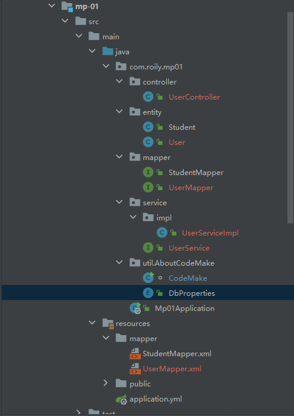

# SpringBoot-Demo


## Start-Spring-boot

> 构建SpringBoot项目，打印其自动装配的BeanDefinition信息。

### 结构


### 类别

#### 简单SpringBoot应用

##### pom文件

> pom文件只需要引入SpringBoot启动器和test启动器。

```xml
<dependencies>
    <dependency>
        <groupId>org.springframework.boot</groupId>
        <artifactId>spring-boot-starter-web</artifactId>
    </dependency>

    <dependency>
        <groupId>org.springframework.boot</groupId>
        <artifactId>spring-boot-starter-test</artifactId>
        <scope>test</scope>
    </dependency>

    <dependency>
        <groupId>junit</groupId>
        <artifactId>junit</artifactId>
        <scope>test</scope>
    </dependency>

    <dependency>
        <groupId>org.projectlombok</groupId>
        <artifactId>lombok</artifactId>
    </dependency>
</dependencies>
```

##### 启动类

> SpringBoot启动类为标注了`@SpringBootApplication`注解的类，主动装配扫描规则为：启动类同级目录及其子目录都会被扫描，启动类也是一个组件同样会被扫描，且启动类注解`@SpringBootApplication`具有继承性。

```java
@RestController
@SpringBootApplication
public class ApplicationSpringBootStart implements ApplicationContextAware {

   @RequestMapping("/")
   String index() {
      return "hello spring boot";
   }

   public static void main(String[] args) {
      SpringApplication.run(ApplicationSpringBootStart.class, args);
   }

   @Override
   public void setApplicationContext(ApplicationContext applicationContext) throws BeansException {
     	//class org.springframework.boot.web.servlet.context.AnnotationConfigServletWebServerApplicationContext
      System.err.println(applicationContext.getClass());
      final String[] beanDefinitionNames = applicationContext.getBeanDefinitionNames();
      for (String beanDefinitionName : beanDefinitionNames) {
         System.out.println(beanDefinitionName);
      }
   }
}
```

##### 其他 类

> 我们引入`spring-boot-starter-web`在程序启动时会初始化一个`WebApplicationContext`。

```java
@Component
public class TestClass {

    static {
        System.out.println(TestClass.class.getSimpleName() + "初始化");
    }
    @Autowired
    ApplicationContext applicationContext;
}
```

##### 测试

##### 问题

##### 小结


## SpringBoot-Config

> SpringBoot配置相关。


### 类别

#### 配置文件

> SpringBoot支持以下几种配置文件
>
> - .properties
> - .yaml
> - .yml
>
> 其中yaml和yml属于同一种会使用同一种解析器解析。
>
> yml文件相较于properties文件较为简洁，也常用。

##### 作为配置文件

> 可作为配置文件统一管理某些bean的默认值，这样通过修改配置文件即可管理bean的属性。

- 配置文件

```properties
properties.person.name=rolyfish
properties.person.hobby=ctrl
```

```yml
properties:
  person:
    name: rolyfish
    hobby: ctrl
```

- bean

```java
@Data
@Component
public class PersonProperties {
    @Value("${properties.person.name}")
    private String name;
    @Value("${properties.person.hobby}")
    private String hobby;
}
```

- 测试

```java
@SpringBootApplication
public class ApplicationSpringBootConfig implements ApplicationContextAware {
    public static void main(String[] args) {
        SpringApplication.run(ApplicationSpringBootConfig.class,args);
    }
    @Override
    public void setApplicationContext(ApplicationContext applicationContext) throws BeansException {
        final PersonProperties personProperties = applicationContext.getBean("personProperties", PersonProperties.class);
        System.out.println(personProperties);//PersonProperties(name=rolyfis, hobby=ctrl)
    }
}
```

> 作为配置文件的另一种方式，结合注解`@ConfigurationProperties`，也是可以的

```java
@Data
@Component
@ConfigurationProperties(prefix = "properties.person")
public class ConfigPerson {
    private String name;
    private String hobby;
}
```

> 引入外部配置文件，外部配置文件只能是properties或xml的。

```properties
person.name=rolyfish
person.hobby=ctrl
```

```java
@ConfigurationProperties(prefix = "person")
@PropertySource("classpath:person.properties")
//@PropertySource("classpath:person.xml")
@Component
@Data
public class PersonPropertiesOutSide {
    private String name;
    private String hobby;
}
```


#### 配置文件优先级

##### 优先级

> SpringBoot会读取以下路径配置文件，加载顺序由上至下依次互补读取。
>
> 也可以通过指定配置spring.config.location来改变默认配置，一般在项目已经打包后，我们可以通过指令 　java -jar xxxx.jar --spring.config.location=~/application.yml来加载外部的配置

- 工程根目录:./config/
- 工程根目录：./

- classpath:/config/
- classpath:/


##### 互补读取

> SpringBoot会依次按照如优先级依次读取配置文件，并不会忽略某个配置文件，并且依次进行互补，最终得到一个汇总的配置文件，application如此，Bootstarp也是。

- 优先级高的配置文件中没有某个配置项，则会到优先级低的配置文件中找该配置项，即具有互补功能。
- 优先级高的和优先级低的配置文件都存在某个配置，则保留优先级高的，也就是不会被覆盖

- 需要注意的是，文件名相同才会互补。比如application会互补，Bootstarp互补。


##### 激活

> 可以使用如下配置激活某个指定环境配置。
>
> 被激活的配置和默认配置也会进行互补读取，但是存在相同配置则优先保留被激活的配置（被激活的配置被认为为需要）

```yml
spring:
  profiles:
    active: dev
```


##### resource目录各文件夹作用

> resource目录下存放资源文件，包括配置文件，静态资源文件以及一些模板文件。
>
> resource目录下的文件编译后存放在classpath路径下。
>
> SpringBoot资源路径集合：出自WebProperties.Resources类 `{ "classpath:/META-INF/resources/",
> 				"classpath:/resources/", "classpath:/static/", "classpath:/public/" }`

- public

  > 放一些公共资源

- static

  > 放静态资源，图片，单体项目的话放一些css、js文件。

- resources

  > 放一些上传的文件

- META-INF/resources

  > 作用和resource一样，可通过url直接访问

以上存放静态资源，作用相似，存在优先级区别

- template

  > 动态页面放在Templates下, **只能通过controller才能访问到该目录!(和原来的WEB-INF差不多)**, 里面放Thymeleaf的一些页面

###### 自定义静态资源路径

- mvc.static-path-pattern

  > 静态资源过滤模式，以下定义含义为，只有包含test路径的url才可访问静态资源

- web.resources.static-locations

  > 静态资源路径，classpath下新增一个名为test的静态资源文件夹

```yaml
spring:
  mvc:
    static-path-pattern: /test/**
  web:
    resources:
      static-locations: classpath:/test/
```


## SpringBoot-mybatis

> SpringBoot集成mybatis。

### 例一

#### 结构


#### 编码

##### 脚本

```sql
-- 创建数据库
create database if not exists spring_all;
use spring_all;

create table user_02
(
    `id`    int not null auto_increment comment '主键',
    `name`  varchar(20) comment '姓名',
    `email` varchar(20) comment '邮件',
    primary key (`id`)
) engine = innodb
  charset = utf8mb3;

insert into user_02(name, email)
VALUES ('rolyfish', '105@qq.com'),
       ('rolyfish2', '105@qq.com'),
       ('李自成', '105@qq.com');
```

##### 依赖

> mysql连接、druid数据源、和SpringBoot-Mybatis启动器。

```xml
<dependency>
    <groupId>org.springframework.boot</groupId>
    <artifactId>spring-boot-starter-test</artifactId>
    <scope>test</scope>
</dependency>
<dependency>
    <groupId>org.springframework.boot</groupId>
    <artifactId>spring-boot-starter-web</artifactId>
</dependency>
<dependency>
    <groupId>org.mybatis.spring.boot</groupId>
    <artifactId>mybatis-spring-boot-starter</artifactId>
</dependency>
<dependency>
    <groupId>mysql</groupId>
    <artifactId>mysql-connector-java</artifactId>
</dependency>
<dependency>
    <groupId>com.alibaba</groupId>
    <artifactId>druid-spring-boot-starter</artifactId>
</dependency>
```

##### 配置

> mybatis的配置完全可以写在主配置文件中，也可以写在外部，再通过配置引入外部配置。

```xml
<?xml version="1.0" encoding="UTF-8" ?>
<!DOCTYPE configuration
        PUBLIC "-//mybatis.org//DTD Config 3.0//EN"
        "http://mybatis.org/dtd/mybatis-3-config.dtd">
<configuration>
    <settings>
        <setting name="logImpl" value="STDOUT_LOGGING"/>
    </settings>
    <!--   自动取别名  默认首字母小写  -->
    <typeAliases>
        <package name="com.springboot.bean"/>
    </typeAliases>
    <!--   配置mapper文件位置 -->
    <mappers>
        <mapper resource="mapper/User02Mapper.xml"/>
    </mappers>
</configuration>
```

> yml配置，主要配置druid数据源。

```yml
server:
  servlet:
    context-path: /mybatis

spring:
  profiles:
    active: dev
```

```yml
spring:
  datasource:
    # 数据库访问配置, 使用druid数据源
    name: user_02
    url: jdbc:mysql://localhost:3306/spring_all?serverTimezone=UTC&useUnicode=true&characterEncoding=utf8&characterSetResults=utf8&useSSL=false
    username: root
    password: 123456
    type: com.alibaba.druid.pool.DruidDataSource
    driver-class-name: com.mysql.cj.jdbc.Driver
    druid:
      # 连接池配置
      initial-size: 5
      min-idle: 5
      max-active: 20
      # 连接等待超时时间
      max-wait: 30000
      # 配置检测可以关闭的空闲连接间隔时间
      time-between-eviction-runs-millis: 60000
      # 配置连接在池中的最小生存时间
      min-evictable-idle-time-millis: 300000
      validation-query: select '1' from dual
      test-while-idle: true
      test-on-borrow: false
      test-on-return: false
      # 打开PSCache，并且指定每个连接上PSCache的大小
      pool-prepared-statements: true
      max-open-prepared-statements: 20
      max-pool-prepared-statement-per-connection-size: 20
      # 配置监控统计拦截的filters, 去掉后监控界面sql无法统计, 'wall'用于防火墙
      filters: stat,wall
      # Spring监控AOP切入点，如x.y.z.service.*,配置多个英文逗号分隔
      aop-patterns: com.springboot.servie.*


      # WebStatFilter配置
      web-stat-filter:
        enabled: true
        # 添加过滤规则
        url-pattern: /*
        # 忽略过滤的格式
        exclusions: '*.js,*.gif,*.jpg,*.png,*.css,*.ico,/druid/*'

      # StatViewServlet配置 
      stat-view-servlet:
        enabled: true
        # 访问路径为/druid时，跳转到StatViewServlet
        url-pattern: /druid/*
        # 是否能够重置数据
        reset-enable: false
        # 需要账号密码才能访问控制台
        login-username: druid
        login-password: druid123
        # IP白名单
        # allow: 127.0.0.1
        #　IP黑名单（共同存在时，deny优先于allow）
        # deny: 192.168.1.218

      # 配置StatFilter
      filter:
        stat:
          log-slow-sql: true
mybatis:
#  mapperLocations: classpath:mapper/*.xml
# 外部mybatis配置
  config-location: classpath:mybatis/mybatis-config.xml
#  typeAliasesPackage: com.springboot.bean

server:
  servlet:
    context-path: /mb
```


##### 类

> 实体类

```java
@AllArgsConstructor
@Data
public class User02 implements Serializable {
    private static final long serialVersionUID = -1;

    private Integer id;
    private String name;
    private String email;

    public User02(String name, String email) {
        this.name = name;
        this.email = email;
    }
}
```

> mapper.java  &  mapper.xml。
>
> mapper可以通过注解配置也可以通过xml文件配置。

```java
@Component
@Mapper
public interface User02Mapper {

    //@Insert("insert into user_02(name,email) values(#{name},#{email})")
    int add(@Param("user02") User02 user02);

    @Update("update user_02 " +
            "set name=#{user02.name,jdbcType=VARCHAR}," +
            "email=#{user02.email,jdbcType=VARCHAR} " +
            "where id=#{user02.id,jdbcType=INTEGER}")
    int update(@Param("user02") User02 user02);

    @Delete("delete from user_02 where id=#{id}")
    int deleteById(@Param("id") Integer id);

    //@Select("select * from user_02 where id=#{id}")
    //@Results(id = "user_02",value= {
    //        @Result(property = "id", column = "id", javaType = Integer.class),
    //        @Result(property = "name", column = "name", javaType = String.class),
    //        @Result(property = "email", column = "email", javaType = String.class)
    //})
    User02 queryUserById(@Param("id") Integer id);

}
```

```xml
<?xml version="1.0" encoding="UTF-8" ?>
<!DOCTYPE mapper
        PUBLIC "-//mybatis.org//DTD Mapper 3.0//EN"
        "http://mybatis.org/dtd/mybatis-3-mapper.dtd">
<mapper namespace="com.springboot.mapper.User02Mapper">
    <resultMap id="user02Map" type="user02">
        <result column="id" property="id" javaType="INTEGER"/>
        <result column="name" property="name" javaType="String"/>
        <result column="email" property="email" javaType="String"/>
    </resultMap>
    <select id="queryUserById" resultMap="user02Map">
        select id,
               name,
               email
        from user_02
        where id = #{id,jdbcType=INTEGER}
    </select>
    <insert id="add" parameterType="user02">
        insert into user_02(name, email)
        values (#{user02.name,jdbcType=VARCHAR}, #{user02.email,jdbcType=VARCHAR})
    </insert>
</mapper>
```

> service层

```java
public interface User02Service {
   int add(User02 user02);
    int update(User02 user02);
    int deleteById(Integer id);
    User02 queryUserById(Integer id);
}
```

```java
@Service
public class User02ServiceImp implements User02Service {
    @Autowired
    private User02Mapper user02Mapper;
    @Override
    public int add(User02 user02) {
        return this.user02Mapper.add(user02);
    }
    @Override
    public int update(User02 user02) {
        return this.user02Mapper.update(user02);
    }
    @Override
    public int deleteById(Integer id) {
        return this.user02Mapper.deleteById(id);
    }
    @Override
    public User02 queryUserById(Integer id) {
        return this.user02Mapper.queryUserById(id);
    }
}
```

> controller层测试

```java
@RestController
public class TestController {

    @Autowired
    private User02Service user02Service;

    @RequestMapping(value = "/query", method = RequestMethod.GET)
    public User02 queryById(Integer id) {
        return this.user02Service.queryUserById(id);
    }
}
```


#### 小结


##### mapper配置

> mapper的配置除了可以在mapper接口上添加@Mapper注解外，还可以使用`@MapperScan(value = {"com.springboot.mapper"})`标注在启动类上。这两种方式达到的效果是一样的。


## Mybatis-MultiDataSource

> SpringBoot配置多数据源。
>
> 这个例子配置两个数据源，mysql和postgresql。

在未使用SpringBoot自动装配前普通的的spring-mybatis配置流程为

- 编写mybatis配置文件
- 借助SqlSessionFactoryBuilder，注入SqlSessionFactoryBean，DataSource的配置在构建SqlSessionFactoryBuilder时完成

SpringBoot配置多数据源，此例放弃SpringBoot-Mybatis的自动装配，采用手动注入多个SqlSessionFactory的方式配置多数据源。

### 依赖

- mysql连接
- postgresql连接
- druid
- mybatis-springbootstart

```xml
<dependencies>
   <dependency>
      <groupId>org.springframework.boot</groupId>
      <artifactId>spring-boot-starter-web</artifactId>
   </dependency>
   
   <dependency>
       <groupId>org.mybatis.spring.boot</groupId>
       <artifactId>mybatis-spring-boot-starter</artifactId>
   </dependency>
   
   <dependency>
      <groupId>org.springframework.boot</groupId>
      <artifactId>spring-boot-starter-test</artifactId>
      <scope>test</scope>
   </dependency>

   <dependency>
      <groupId>org.postgresql</groupId>
      <artifactId>postgresql</artifactId>
   </dependency>
   
   <!-- mysql驱动 -->
   <dependency>
       <groupId>mysql</groupId>
       <artifactId>mysql-connector-java</artifactId>
   </dependency>

   <!-- druid数据源驱动 -->
   <dependency>
      <groupId>com.alibaba</groupId>
      <artifactId>druid-spring-boot-starter</artifactId>
   </dependency>
   
</dependencies>
```

### pom配置

> 这里路径自定义，后面通过@ConfigurationProperties注解引入数据源配置即可。

```yml
spring:
  datasource:
    druid:
      # 数据库访问配置, 使用druid数据源
      # 数据源1 mysql
      mysql:
        url: jdbc:mysql://localhost:3306/spring_all?serverTimezone=UTC&useUnicode=true&characterEncoding=utf8&characterSetResults=utf8&useSSL=false
        username: root
        password: 123456
        type: com.alibaba.druid.pool.DruidDataSource
        driver-class-name: com.mysql.cj.jdbc.Driver
      # 数据源2 postgresql
      postgresql:
        url: jdbc:postgresql://127.0.0.1:5432/springall?serverTimezone=Asia/Shanghai&useUnicode=true&characterEncoding=utf8&characterSetResults=utf8&useSSL=false&allowMultiQueries=true
        username: rolyfish
        password: Xiaochuang6
        driver-class-name: org.postgresql.Driver
        type: com.alibaba.druid.pool.DruidDataSource
```


### mybatis配置

> 如果需要进行精细的区别管理可为每一个数据源写一个mybatis配置，这里只是配置日志输出配置，可共用。

```xml
<?xml version="1.0" encoding="UTF-8" ?>
<!DOCTYPE configuration
        PUBLIC "-//mybatis.org//DTD Config 3.0//EN"
        "http://mybatis.org/dtd/mybatis-3-config.dtd">
<configuration>
    <settings>
        <setting name="logImpl" value="STDOUT_LOGGING"/>
    </settings>
</configuration>
```


### 数据库脚本

> 简单初始化测试表结构

- mysql

```sql
-- -- 05.Spring-Boot-MyBatis-MultiDataSource 多数据源创建表
drop table if exists `student`;
create table if not exists `student`(
    `id` int not null  auto_increment comment '主键',
    `sno` varchar(100),
    `sname` varchar(100),
    primary key (id)
)engine=innodb,charset=utf8mb3;

alter table student modify column sno varchar(100) comment '学号';
alter table student modify column sname varchar(100) comment '姓名';

insert into spring_all.student( sno, sname)
values('001','闯王'),
('002','rolyfish');
```

- postgresql

```sql
create sequence if not exists seq_student start 1 minvalue 1 maxvalue 999999999 no cycle;

create table if not exists springall.student
(
    id    int4 not null,
    sno   varchar(100),
    sname varchar(100),
    primary key (id)
    );
comment on column springall.student.id is '主键';
comment on column springall.student.sno is '学号';
comment on column springall.student.sname is '姓名';

alter table springall.student
    alter column id set default nextval('seq_student'::regclass);

insert into springall.student(sno, sname)
values ('001','rolyfish'),
       ('002','李自成'),
       ('003','鱼味');
```


### 多数据源配置

> 这里放弃了mybatis的自动配置，选择通过JavaConfig的方式手动注入SqlSessionFactory。

#### Mysql

> @MapperScan(basePackages = MysqlDatasourceConfig.PACKAGE, sqlSessionFactoryRef = "mysqlSqlSessionFactory")

此注解 - 指定此数据源mapper扫描路径  - 上下文中存在多个数据源通过sqlSessionFactoryRef 属性指定数据源（值为数据源beanname）。

>  @ConfigurationProperties("spring.datasource.druid.mysql")

通过ConfigrationProperties将yml中数据源的配置引入，配置其前缀属性即可。这个注解工作原理他会找到方法返回Bean的setter方法，匹配引入配置，将属性注入。比如`DruidAbstractDataSource.setUrl`方法就会匹配 `spring.datasource.druid.mysql.url`。

>  mysqlSqlSessionFactory(@Qualifier("mysqldatasource") DataSource dataSource)

此处的@Qualifier是必须的，因为存在多个数据源。并且此处的@Autowired被省略了。

```java
@Configuration
/**
 * 指定mapper扫描路径    
 * 只有当spring上下文中存在多个数据源时指定sqlSessionFactory
 */
@MapperScan(basePackages = MysqlDatasourceConfig.PACKAGE, sqlSessionFactoryRef = "mysqlSqlSessionFactory")
public class MysqlDatasourceConfig {

    // mysqldao扫描路径
    static final String PACKAGE = "com.springboot.mysqlmapper";
    // mybatis mapper扫描路径
    static final String MAPPER_LOCATION = "classpath:mapper/mysql/*.xml";
    static final String MYBATIS_CONFIG = "classpath:mybatis/mybatis-config.xml";

    @Primary
    @Bean(name = "mysqldatasource")
    @ConfigurationProperties("spring.datasource.druid.mysql")
    public DataSource mysqlDataSource() {
        final DruidDataSource dataSource = DruidDataSourceBuilder.create().build();
        return dataSource;
    }

    @Bean(name = "mysqlTransactionManager")
    @Primary
    public DataSourceTransactionManager mysqlTransactionManager() {
        return new DataSourceTransactionManager(mysqlDataSource());
    }

    @Bean(name = "mysqlSqlSessionFactory")
    @Primary
    public SqlSessionFactory mysqlSqlSessionFactory(@Qualifier("mysqldatasource") DataSource dataSource)
            throws Exception {
        final SqlSessionFactoryBean sessionFactory = new SqlSessionFactoryBean();
        sessionFactory.setDataSource(dataSource);
        //如果不使用xml的方式配置mapper，则可以省去下面这行mapper location的配置。
        sessionFactory.setMapperLocations(
                new PathMatchingResourcePatternResolver().getResources(MysqlDatasourceConfig.MAPPER_LOCATION));
        sessionFactory.setTypeAliasesPackage("com.springboot.entity");
        sessionFactory.setConfigLocation(new PathMatchingResourcePatternResolver().getResource(MysqlDatasourceConfig.MYBATIS_CONFIG));
        return sessionFactory.getObject();
    }
}
```


#### postgresql

> 同理，只是改个名字。

```java
@Configuration
@MapperScan(basePackages = PostgresqlDatasourceConfig.PACKAGE,
        sqlSessionFactoryRef = "postgresqlSqlSessionFactory")
public class PostgresqlDatasourceConfig {

    // postgresqldao扫描路径
    static final String PACKAGE = "com.springboot.postgresqlmapper";
    // mybatis mapper扫描路径
    static final String MAPPER_LOCATION = "classpath:mapper/postgresql/*.xml";

    @Bean(name = "postgresqldatasource")
    @ConfigurationProperties("spring.datasource.druid.postgresql")
    public DataSource postgresqlDataSource() {
        return DruidDataSourceBuilder.create().build();
    }

    @Bean(name = "postgresqlTransactionManager")
    public DataSourceTransactionManager postgresqlTransactionManager() {
        return new DataSourceTransactionManager(postgresqlDataSource());
    }

    @Bean(name = "postgresqlSqlSessionFactory")
    public SqlSessionFactory postgresqlSqlSessionFactory(@Qualifier("postgresqldatasource") DataSource dataSource) throws Exception {
        final SqlSessionFactoryBean sessionFactory = new SqlSessionFactoryBean();
        sessionFactory.setDataSource(dataSource);
        //配置mapperLocation
        sessionFactory.setMapperLocations(new PathMatchingResourcePatternResolver()
                .getResources(PostgresqlDatasourceConfig.MAPPER_LOCATION));
        sessionFactory.setTypeAliasesPackage("com.springboot.entity");
        //引入外部配置，例如日志配置
        sessionFactory.setConfigLocation(new PathMatchingResourcePatternResolver().getResource(MysqlDatasourceConfig.MYBATIS_CONFIG));
        return sessionFactory.getObject();
    }
}
```


### 其余编码

#### 实体

> 此例为多模块项目，lombok依赖继承自父模块。

```java
@Data
public class Student {
    Integer id;
    String sno;
    String sname;
}
```

#### mapper & mapper.xml

- mysql

```java
@Mapper
public interface MysqlStudentMapper {
   List<Student> getAllStudents();
}
```

```xml
<?xml version="1.0" encoding="UTF-8" ?>    
    <!DOCTYPE mapper PUBLIC "-//mybatis.org//DTD Mapper 3.0//EN"   
"http://mybatis.org/dtd/mybatis-3-mapper.dtd">     
<mapper namespace="com.springboot.mysqlmapper.MysqlStudentMapper">
    <select id="getAllStudents" resultType="student">
        select * from student
    </select>
</mapper>
```

- postgresql

```java
@Mapper
public interface PostgresqlStudentMapper {
   List<Student> getAllStudents();
}
```

```xml
<?xml version="1.0" encoding="UTF-8" ?>    
    <!DOCTYPE mapper PUBLIC "-//mybatis.org//DTD Mapper 3.0//EN"   
"http://mybatis.org/dtd/mybatis-3-mapper.dtd">     
<mapper namespace="com.springboot.postgresqlmapper.PostgresqlStudentMapper">
    <select id="getAllStudents" resultType="student">
        select * from springall.student
    </select>
</mapper>
```

#### service

```java
public interface StudentService {
   List<Student> getAllStudentsFromOralce();
   List<Student> getAllStudentsFromMysql();
}
```

```java
@Service
public class StudentServiceImp implements StudentService{
   @Autowired
   private PostgresqlStudentMapper postgresqlStudentMapper;
   @Autowired
   private MysqlStudentMapper mysqlStudentMapper;
   @Override
   public List<Student> getAllStudentsFromOralce() {
      return this.postgresqlStudentMapper.getAllStudents();
   }
   @Override
   public List<Student> getAllStudentsFromMysql() {
      return this.mysqlStudentMapper.getAllStudents();
   }
}
```

#### controller

```java
@RestController
public class StudentController {
   @Autowired
   private StudentService studentService;
   @RequestMapping("querystudentsfrompostgresql")
   public List<Student> queryStudentsFromPostgresql(){
      return this.studentService.getAllStudentsFromPostgresql();
   }
   @RequestMapping("querystudentsfrommysql")
   public List<Student> queryStudentsFromMysql(){
      return this.studentService.getAllStudentsFromMysql();
   }
}
```


### 测试

> 启动测试。

- postgresql


- mysql


## Mybatis-plus-MultiDataSource

> Mybatis-plus配置多数据源。[Mybatis-plus官网](https://baomidou.com/pages/a61e1b/#dynamic-datasource)

### 引入依赖

```xml
<dependency>
    <groupId>com.baomidou</groupId>
    <artifactId>dynamic-datasource-spring-boot-starter</artifactId>
    <version>${mp.dynamic-datasource.version}</version>
</dependency>
```

### 配置

```yml
spring:
  datasource:
    dynamic:
      primary: master #设置默认的数据源或者数据源组,默认值即为master
      strict: false #严格匹配数据源,默认false. true未匹配到指定数据源时抛异常,false使用默认数据源
      datasource:
        master:
          type: com.alibaba.druid.pool.DruidDataSource
          driver-class-name: com.mysql.jdbc.Driver
          url: jdbc:mysql://localhost:3306/springall?useUnicode=true&characterEncoding=UTF-8&rewriteBatchedStatements=true&autoReconnect=true&failOverReadOnly=false&zeroDateTimeBehavior=convertToNull
          username: root
          password: 123456

        slave_1:
          url: jdbc:postgresql://127.0.0.1:5432/springall?serverTimezone=Asia/Shanghai&useUnicode=true&characterEncoding=utf8&characterSetResults=utf8&useSSL=false&allowMultiQueries=true
          username: rolyfish
          password: Xiaochuang6
          driver-class-name: org.postgresql.Driver
          type: com.alibaba.druid.pool.DruidDataSource # 3.2.0开始支持SPI可省略此配置
          
## druid 配置。。。。
mybatis-plus:
  type-aliases-package: com.roily.demo.multidatasource.multidatasource.entity
  mapper-locations: classpath*:/mapper/**/*.xml
  configuration:
    log-impl: org.apache.ibatis.logging.stdout.StdOutImpl
```

### 编码

> 和普通mp没有太大区别,只在调用时添加注解即可。

> 如果不指定@DS,默认主节点。、
>
> @DS可以放在类和方法上,采用就近原则,方法上的配置可以覆盖类上的配置。

```java
@Service
// 默认主节点
@DS("master")
public class StudentServiceImp extends ServiceImpl<StudentMapper, Student> implements StudentService {
    @DS("master")
    @Override
    public List<Student> getAllMaster() {
        return list();
    }
    @DS("slave_1")
    @Override
    public List<Student> getAllSlave() {
        return list();
    }
}
```


## Spring-Boot-AOP


## Spring-swagger

`D:\File\Desktop\blogXX\foot\tools(编程工具)`


## SpringTest


## Spring-boot-Jackson


### Serializer && DeSerializer

> '序列化和反序列化'

#### 序列化&反

```java
public class UserSerializer extends JsonSerializer<UserSerializerAndDe> {
	@Override
	public void serialize(UserSerializerAndDe user, JsonGenerator generator, SerializerProvider provider)
			throws IOException, JsonProcessingException {
		generator.writeStartObject();
		generator.writeStringField("user-name", user.getUserName());
		generator.writeNumberField("user-age", user.getAge());
		generator.writeStringField("user-pass", user.getPassword());
		generator.writeObjectField("birthday", user.getBirthday());
		generator.writeEndObject();
	}
}
public class UserDeserializer extends JsonDeserializer<UserSerializerAndDe> {
    final SimpleDateFormat simpleDateFormat = new SimpleDateFormat("yyyy-MM-dd HH:mm:ss");
    @Override
    public UserSerializerAndDe deserialize(JsonParser parser, DeserializationContext context)
            throws IOException, JsonProcessingException {
        JsonNode node = parser.getCodec().readTree(parser);
        String userName = node.get("user-name").asText();
        int age = node.get("age").asInt();
        String password = node.get("pass-word").asText();
        Date birthday = null;
        try {
            birthday = simpleDateFormat.parse(node.get("birthday").asText());
        } catch (ParseException e) {
            throw new RuntimeException(e);
        }
        UserSerializerAndDe user = new UserSerializerAndDe()
                .setUserName(userName)
                .setAge(age)
                .setPassword(password)
                .setBirthday(birthday);
        return user;
    }
}
```


#### 实体配置

> `@JsonSerialize & @JsonDeserialize`使用这两个注解配置。

```java
@JsonSerialize(using = UserSerializer.class)
@JsonDeserialize(using = UserDeserializer.class)
@Data
@Accessors(chain = true)
public class UserSerializerAndDe implements Serializable {

    private static final long serialVersionUID = 6222176558369919436L;

    private String userName;

    private int age;

    private String password;

    @JsonFormat(pattern = "yyyy-MM-dd HH:mm:ss")
    private Date birthday;

}
```

#### 配置ObjectMapper

```java
@Configuration
public class JacksonConfig {
   @Bean
   public ObjectMapper getObjectMapper(){
      ObjectMapper mapper = new ObjectMapper();
      mapper.setDateFormat(new SimpleDateFormat("yyyy-MM-dd HH:mm:ss"));
      return mapper;
   }
}
```


#### 测试

```java
private static Log log = LogFactory.getLog(TestJsonController.class);
@Autowired
ObjectMapper mapper;

@RequestMapping("getUserSerializerAndDe")
@ResponseBody
public UserSerializerAndDe getUserSerializerAndDe() {

    UserSerializerAndDe user = new UserSerializerAndDe();
    user.setUserName("rolyfish");
    user.setAge(26);
    user.setPassword("123456");
    user.setBirthday(Calendar.getInstance().getTime());
    return user;

}

@RequestMapping("deUserSerializerAndDe")
@ResponseBody
public void deUserSerializerAndDe(@RequestBody UserSerializerAndDe user) throws JsonProcessingException {
    String str = mapper.writeValueAsString(user);
    log.info(str);
}
```


### JsonView

> 视图，用于控制输出字段，比如一些铭感字段不输出。
>
> 未约束视图的属性不受影响

```java
@Data
public class UserJsonView implements Serializable {

   private static final long serialVersionUID = 6222176558369919436L;

   public interface UserNameView {
   };

   public interface AllUserFieldView extends UserNameView {
   };

   @JsonView(UserNameView.class)
   private String userName;
   
   @JsonView(AllUserFieldView.class)
   private int age;

   // @JsonIgnore
   @JsonView(AllUserFieldView.class)
   private String password;
   //
   // @JsonProperty("bth")
   // @JsonFormat(pattern = "yyyy-MM-dd HH:mm:ss")
   // @JsonView(AllUserFieldView.class)
   private Date birthday;
   
}
```

```java
@JsonView(UserJsonView.AllUserFieldView.class)
//@JsonView(UserJsonView.UserNameView.class)
@RequestMapping("userjsonview")
@ResponseBody
public UserJsonView userJsonView() {
    UserJsonView user = new UserJsonView();
    user.setUserName("rolyfish");
    user.setAge(26);
    user.setPassword("123456");
    user.setBirthday(Calendar.getInstance().getTime());
    return user;
}
```


### ObjectMapper

> 常用API

```java
@RunWith(SpringRunner.class)
@SpringBootTest
public class DemoApplicationTests {
   private static Log log = LogFactory.getLog(DemoApplicationTests.class);
   @Autowired
   ObjectMapper mapper;
   @Test
   public void userJsonView() throws IOException {

      UserJsonView user = new UserJsonView();
      user.setUserName("rolyfish");
      user.setAge(26);
      user.setPassword("123456");
      user.setBirthday(Calendar.getInstance().getTime());

      /**
       * writeValueAsString
       * writerWithView
       */
      log.info(mapper.writeValueAsString(user));
      log.info(mapper.writerWithView(UserJsonView.UserNameView.class).writeValueAsString(user));

      /**
       * mapper.readTree
       * mapper.readValue
       * mapper.readerWithView
       */
      String jsonStr = "{\"userName\":\"rolyfish\",\"age\":26,\"password\":\"123456\",\"birthday\":\"2023-01-30 18:02:14\"}";
      JsonNode node = mapper.readTree(jsonStr);
      log.info(node.get("userName"));

      UserJsonView userJsonView = mapper.readValue(jsonStr,UserJsonView.class);
      log.info(userJsonView);

      final UserJsonView readerWithView = mapper.readerWithView(UserJsonView.UserNameView.class).readValue(jsonStr, UserJsonView.class);
      log.info(readerWithView);
       
       String jsonList = "[{\"userName\":\"rolyfish\",\"age\":26,\"password\":\"123456\",\"birthday\":\"2023-01-30 18:02:14\"},{\"userName\":\"rolyfish\",\"age\":26,\"password\":\"123456\",\"birthday\":\"2023-01-30 18:02:14\"}]";
	  JavaType type = mapper.getTypeFactory().constructParametricType(List.class, UserJsonView.class);
	  List<UserJsonView> list = mapper.readValue(jsonList, type);
	  String value = "";
	  for (UserJsonView temp : list) {
	      value += temp.getUserName();
	  }
	  log.info(value);
   }
}
```


### 其他注解

```java
@JsonIgnoreProperties({ "password", "age" })  //忽略属性
@JsonNaming(PropertyNamingStrategy.LowerCaseWithUnderscoresStrategy.class)//属性 驼峰转下划线
```


## Spring-boot-Mybatis-plus


### 代码生成器

#### 创建表

```sql
CREATE TABLE `user` (
    `id` int(11) NOT NULL AUTO_INCREMENT COMMENT '主键',
    `name` varchar(20) DEFAULT NULL COMMENT '姓名',
    `email` varchar(20) DEFAULT NULL COMMENT '邮件',
    `delete` varchar(10) DEFAULT NULL COMMENT '逻辑删除',
    `version` varchar(10) DEFAULT NULL COMMENT '乐观锁',
    `create_time` datetime DEFAULT NULL COMMENT '创建时间',
    `update_time` datetime DEFAULT NULL COMMENT '删除时间',
    PRIMARY KEY (`id`)
) ENGINE=InnoDB AUTO_INCREMENT=11 DEFAULT CHARSET=utf8
```


#### 代码生成器工具

```java
@Getter
public enum DbProperties {

    URL("url", "jdbc:mysql://localhost:3306/spring_all?useUnicode=true&charactEncoding=utf8&useSSL=true&serverTimezone=GMT%2B8"),
    USER("user", "root"),
    PASSWORD("pass", "123456");

    private String property;
    private String value;

    DbProperties(String prop, String value) {
        this.property = prop;
        this.value = value;
    }
}
```

```java
class CodeMake {
    static {
        InputStream in = ClassLoader.getSystemResourceAsStream("public/db.properties");
        Properties prop = new Properties();
        try {
            prop.load(in);
        } catch (IOException e) {
            e.printStackTrace();
        }
        System.out.println(prop);
    }

    public static void main(String[] args) {

        DataSourceConfig.Builder dataSourceConfigBuilder =
                new DataSourceConfig.Builder(
                        DbProperties.URL.getValue(),
                        DbProperties.USER.getValue(),
                        DbProperties.PASSWORD.getValue());

        //配置 entity service xml impl 等文件输出路径
        Map<OutputFile, String> outputFileStringMap =
                Collections.singletonMap(OutputFile.xml, "d:xxx");
        FastAutoGenerator
                .create(dataSourceConfigBuilder)
                //.create(DbProperties.URL.getValue(),DbProperties.PASSWORD.getValue(),DbProperties.USER.getValue())
                .globalConfig(builder -> {
                    builder.author("roilyFish") // 设置作者
                            .dateType(DateType.TIME_PACK)//实体日期属性类型
                            .commentDate("yyyy-MM-dd")
                            .enableSwagger() // 开启 swagger 模式
                            .fileOverride() // 覆盖已生成文件
                            .disableOpenDir()//生成文件后、不要打开目录
                            .outputDir("d:xxx"); // 指定输出目录
                })
                //包路径配置
                .packageConfig(builder -> {
                    builder
                            .parent("com.roily.mp01") // 设置父包名 会影响package
                            // .moduleName("backstage") // 设置父包模块名
                            .entity("entity")//实体类包名
                            .service("service")//service包名
                            .serviceImpl("service.impl")//impl包名
                            .mapper("mapper")//mapper接口包名
                            .controller("controller")//controller包名
                            .other("other")
                            //.xml("mp-01\\src\\main\\resources\\mapper")//mapper.xml 输出路径
                            //以上配置都基于父包路径
                            .pathInfo(outputFileStringMap); // 设置mapperXml生成路径
                })
                //模板配置
                .templateConfig(builder -> {
                    builder
                            //.disable()//禁用所有模板
                            //.disable(TemplateType.ENTITY)//禁用模板  不生成Entity
                            .entity("/templates/entity.java")
                            //.service("/templates/service.java")
                            //.serviceImpl("/templates/serviceImpl.java")
                            //.mapper("/templates/mapper.java")
                            ////.mapperXml("/templates/mapper.xml")
                            //.com.roily.controller("/templates/com.roily.controller.java")
                            .build();
                })
                .injectionConfig(builder -> {
                    builder
                            .beforeOutputFile((tableInfo, objectMap) -> {
                                    System.out.println("tableInfo: " + tableInfo.getEntityName() + " objectMap: " + objectMap.size());
                                    System.out.println(objectMap);
                                }
                            )
                            .customMap(Collections.singletonMap("test", "baomidou"))
                            //.customFile(Collections.singletonMap("test.txt", "/templates/entity.vm"))
                            .build();
                })
                .strategyConfig(builder -> {
                    builder.addInclude("user")// 设置需要生成的表名
                            .addTablePrefix("t_", "c_") // 设置过滤表前缀
                            .addTableSuffix("_info")// 设置过滤表后缀
                            //.addFieldPrefix("") // 设置过滤字段前缀
                            //.addFieldSuffix("") // 设置过滤字段后缀
                            .entityBuilder()
                                //.disableSerialVersionUID()//禁用生成serialVersionUID
                                .enableLombok()//允许启用lombok  没有get set  简洁
                                .enableRemoveIsPrefix()//允许去除bollean类型is前缀
                                .enableTableFieldAnnotation()// 开启生成实体时,生成字段注解 即 @TableField
                                .enableActiveRecord()//ActiveRecord 模式 crud更简洁
                                //.versionColumnName("version")//设置乐观锁字段
                                .versionPropertyName("version")//设置乐观锁属性
                                //.logicDeleteColumnName("deleted")//逻辑删除字段
                                .logicDeletePropertyName("deleted")//逻辑删除属性
                                .naming(NamingStrategy.underline_to_camel)//数据库名  驼峰命名
                                .columnNaming(NamingStrategy.underline_to_camel)//数据库字段 驼峰命名
                                //.addSuperEntityColumns("id")
                                //.addIgnoreColumns("deleted")//忽略字段
                                .addTableFills(new Column("create_time", FieldFill.INSERT), new Column("update_time", FieldFill.INSERT_UPDATE))
                                .idType(IdType.AUTO)//主键生成策略
                                .fileOverride()//覆盖已有文件
                                //.formatFileName("%s")
                            .build()
                                .controllerBuilder()
                                //.superClass(BaseController.class)//设置父类
                                .enableRestStyle()//@RestController
                                //.formatFileName("%sAction")//格式化文件名称
                            .build()

                            .serviceBuilder()
                                //.superServiceClass()//父类
                                .formatServiceFileName("%sService")
                                .formatServiceImplFileName("%sServiceImpl")
                            .build()

                            .mapperBuilder()
                                //.superClass()//父类
                                //.enableMapperAnnotation()//开启@Mapper 一般都会的配置扫描包
                                .enableBaseResultMap()
                                //.formatMapperFileName("%sMapper")
                                //.formatXmlFileName("%sMapper")
                            .build();
                })
                .templateEngine(new FreemarkerTemplateEngine()) // 使用Freemarker引擎模板，默认的是Velocity引擎模板
                .execute();
    }
}
```


#### 执行做稍微调整



## Spring-boot-async

> Spring Boot 使用原生提供的异步任务支持，实现异步执行任务。

### 依赖

> SpringBoot原生提供异步任务支持, 所以只需要引入基本的启动器即可。

```xml
<dependencies>
    <dependency>
        <groupId>org.springframework.boot</groupId>
        <artifactId>spring-boot-starter</artifactId>
    </dependency>

    <dependency>
        <groupId>org.springframework.boot</groupId>
        <artifactId>spring-boot-starter-test</artifactId>
        <scope>test</scope>
    </dependency>

    <dependency>
        <groupId>org.projectlombok</groupId>
        <artifactId>lombok</artifactId>
        <optional>true</optional>
    </dependency>
</dependencies>
```


### 配置

> 配置连接池

> 对应`TaskExecutionProperties`这个配置类。
>
> 对应`TaskExecutionAutoConfiguration`这个自动装配了。

```yaml
spring:
  task:
    execution:
      pool:
        # 最大线程数
        max-size: 16
        # 核心线程数
        core-size: 16
        # 存活时间
        keep-alive: 10s
        # 队列大小
        queue-capacity: 100
        # 是否允许核心线程超时
        allow-core-thread-timeout: true
      # 线程名称前缀
      thread-name-prefix: async-task-
```

### 测试

> 定义异步方法

```java
@Component
@Slf4j
public class TaskFactory {

    /**
     * 模拟5秒的异步任务
     */
    @Async
    public Future<Boolean> asyncTask1() throws InterruptedException {
        doTask("asyncTask1", 5);
        return new AsyncResult<>(Boolean.TRUE);
    }

    /**
     * 模拟2秒的异步任务
     */
    @Async
    public Future<Boolean> asyncTask2() throws InterruptedException {
        doTask("asyncTask2", 2);
        return new AsyncResult<>(Boolean.TRUE);
    }

    /**
     * 模拟3秒的异步任务
     */
    @Async
    public Future<Boolean> asyncTask3() throws InterruptedException {
        doTask("asyncTask3", 3);
        return new AsyncResult<>(Boolean.TRUE);
    }

    /**
     * 模拟5秒的同步任务
     */
    public void task1() throws InterruptedException {
        doTask("task1", 5);
    }

    /**
     * 模拟2秒的同步任务
     */
    public void task2() throws InterruptedException {
        doTask("task2", 2);
    }

    /**
     * 模拟3秒的同步任务
     */
    public void task3() throws InterruptedException {
        doTask("task3", 3);
    }

    private void doTask(String taskName, Integer time) throws InterruptedException {
        log.info("{}开始执行，当前线程名称【{}】", taskName, Thread.currentThread().getName());
        TimeUnit.SECONDS.sleep(time);
        log.info("{}执行成功，当前线程名称【{}】", taskName, Thread.currentThread().getName());
    }
}
```

> 测试

```java
@Slf4j
@RunWith(SpringRunner.class)
@SpringBootTest
public class TaskFactoryTest /*extends SpringBootDemoAsyncApplicationTests*/ {
    @Autowired
    private TaskFactory task;

    /**
     * 测试异步任务
     */
    @Test
    public void asyncTaskTest() throws InterruptedException, ExecutionException {
        long start = System.currentTimeMillis();
        Future<Boolean> asyncTask1 = task.asyncTask1();
        Future<Boolean> asyncTask2 = task.asyncTask2();
        Future<Boolean> asyncTask3 = task.asyncTask3();

        // 调用 get() 阻塞主线程
        asyncTask1.get();
        asyncTask2.get();
        asyncTask3.get();
        long end = System.currentTimeMillis();

        log.info("异步任务全部执行结束，总耗时：{} 毫秒", (end - start));
    }

    /**
     * 测试同步任务
     */
    @Test
    public void taskTest() throws InterruptedException {
        long start = System.currentTimeMillis();
        task.task1();
        task.task2();
        task.task3();
        long end = System.currentTimeMillis();

        log.info("同步任务全部执行结束，总耗时：{} 毫秒", (end - start));
    }
}
```

> 同步任务全部由主线程执行, 阻塞式调用。
>
> 异步任务会使用线程池, 开启子线程执行。


## Spring-boot-cache-ehcache

> EhCache是一款高性能的本地缓存框架，能够显著提高应用的响应速度。
>
> 一般不持久化。不用于分布式系统, 避免缓存多份数据， 可通过负载均衡策略解决。

### 依赖

> SpringBot提供对Ehcache整合支持。
>
> 支持的缓存类型在`CacheType`枚举中。

```xml
<dependency>
    <groupId>org.springframework.boot</groupId>
    <artifactId>spring-boot-starter-cache</artifactId>
</dependency>
<dependency>
    <groupId>net.sf.ehcache</groupId>
    <artifactId>ehcache</artifactId>
</dependency>
```

### 配置

> Spring缓存配置`CacheProperties`
>
> echcache配置类`EhCacheCacheConfiguration`

> Spring配置

```yaml
spring:
  cache:
    type: ehcache
    ehcache:
      config: classpath:ehcache.xml
```

> ehcache配置

```xml
<!-- ehcache配置 -->
<ehcache
  xmlns:xsi="http://www.w3.org/2001/XMLSchema-instance"
  xsi:noNamespaceSchemaLocation="http://ehcache.org/ehcache.xsd"
  updateCheck="false">
  <?xml version="1.0" encoding="UTF-8"?>
  <cache name="user"
         maxElementsInMemory="20000"
         overflowToDisk="false"
         diskPersistent="false"
         timeToLiveSeconds="180"/>
</ehcache>
```

### 使用

> 缓存名称常量

```java
public class EhcacheConstant {
  public static final String USER = "user";
}
```

> 使用默认的EhCacheCacheManager即可

```java
@Bean
public EhCacheCacheManager cacheManager(CacheManager ehCacheCacheManager) {
    return this.customizers.customize(new EhCacheCacheManager(ehCacheCacheManager));
}
```

> 非注解形式使用

```java
@Configuration
public class EhcacheConfig {
  @Resource
  private EhCacheCacheManager ehCacheCacheManager;
  @Bean
  public Cache userCache() {
    return ehCacheCacheManager.getCache("user");
  }
}

@Resource
Cache userCache;
@Test
public void testEcache2(){
    User user = new User(1L, "test");
    userCache.put(user.getId(),user);
    User userGet = userCache.get(1L,User.class);
    log.info(userGet.toString());
}
```

> 注解形式使用
>
> 启动类添加支持缓存注解 @EnableCaching

> 编写业务

```java
// 存或更新数据库前首先放入缓存
@CachePut(value = EhcacheConstant.USER, key = "#user.id")
@Override
public User saveOrUpdate(User user) {
    DATABASES.put(user.getId(), user);
    log.info("保存用户【user】= {}", user);
    return user;
}
// 先去缓存读取
@Cacheable(value = EhcacheConstant.USER, key = "#id")
@Override
public User get(Long id) {
    // 我们假设从数据库读取
    log.info("查询用户【id】= {}", id);
    return DATABASES.get(id);
}
// 首先删除缓存，再删除数据库
@CacheEvict(value = EhcacheConstant.USER, key = "#id")
@Override
public void delete(Long id) {
    DATABASES.remove(id);
    log.info("删除用户【id】= {}", id);
}
```


## Spring-Boot-cache-Caffeine

> Caffeine是一个进程内部缓存框架，使用了Java 8最新的[StampedLock](https://www.altitude.xin/code/home/#/java/util/concurrent/locks/StampedLock)乐观锁技术，极大提高缓存并发吞吐量，一个高性能的 Java 缓存库，被称为最快缓存。
>
> Java领域可用的缓存框架非常多，`Caffeine`不属于分布式缓存，但不影响其在本地缓存场景出色的表现。开发者在进行缓存架构设计时需要综合考虑各类缓存的优缺点，依据具体场景选配相应缓存。

### 依赖

```xml
<dependency>
    <groupId>com.github.ben-manes.caffeine</groupId>
    <artifactId>caffeine</artifactId>
</dependency>
```

### 配置

```yaml
spring:
  cache:
    type: caffeine
```

### 使用

> Caffeine 配置类：CaffeineCacheConfiguration。
>
> 注入了一个缓存管理器。

```java
@Bean
public CaffeineCacheManager cacheManager() {
    CaffeineCacheManager cacheManager = createCacheManager();
    List<String> cacheNames = this.cacheProperties.getCacheNames();
    if (!CollectionUtils.isEmpty(cacheNames)) {
        cacheManager.setCacheNames(cacheNames);
    }
    return this.customizers.customize(cacheManager);
}
```

> 非注解方式

```java
@Configuration
public class CaffeineConfig {
  @Resource
  CaffeineCacheManager caffeineCacheManager;
  @Bean
  public Cache userCache() {
    return caffeineCacheManager.getCache("user");
  }
}
@Resource
Cache userCache;
@Test
public void testCaffeine(){
    User user = new User(1L, "test");
    userCache.put(user.getId(),user);
    User userGet = userCache.get(1L,User.class);
    log.info(userGet.toString());
}
```

> 注解使用方式：
>
> 开启缓存支持：@EnableCaching
>
> 和ehcache一样

## SpringBoot-cache-redis


