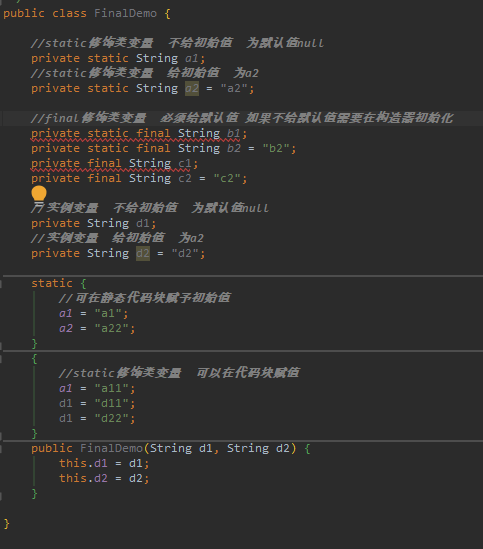
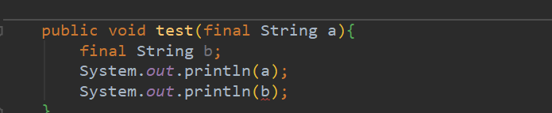
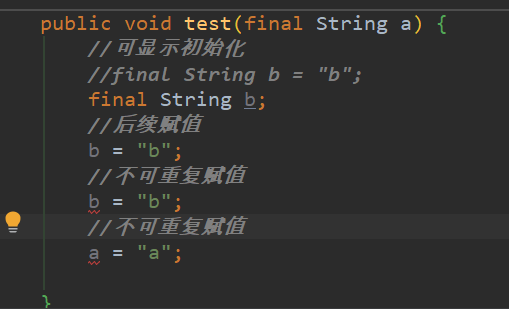
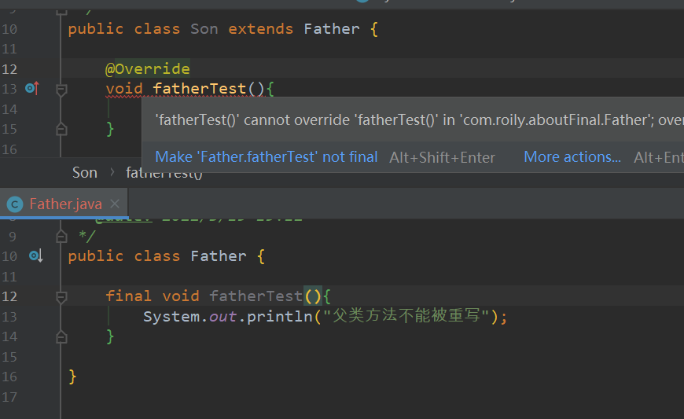
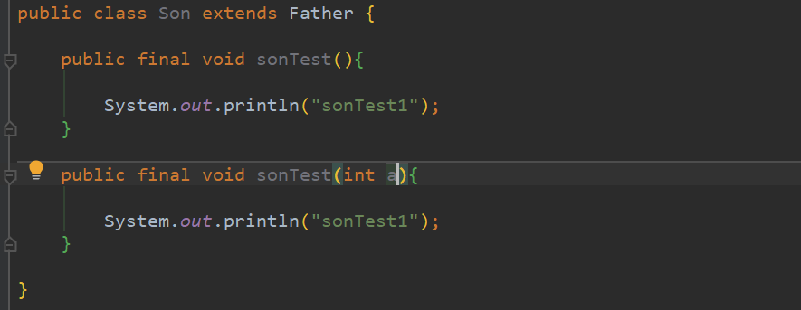
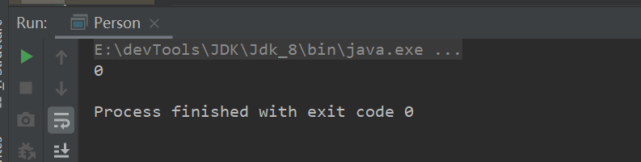

本文学习`final`关键字。


> [上一章]()   ||||    [下一章]()   


#### final简介

final可以修饰**变量，方法和类**，用于表示所修饰的内容一旦赋值之后就不会再被改变，比如String类就是一个final类型的类。即使能够知道final具体的使用方法，我想对**final在多线程中存在的重排序问题**也很容易忽略，希望能够一起做下探讨。

<hr>

#### 修饰变量

表示该变量的值不可改变 。对于基本数据类型，只有数值就是不可变。对于引用数据类型，其引用地址值不可变，所指向的内存地址的对象可变。

##### 成员变量

成员变量分为**类变量（static修饰的变量属于类）和实例变量**。

成员变量允许为空（也就是有初始值）。

成员变量在哪赋值：

类变量：

​		①声明类变量时给予初始值或者默认值（基本数据类型对应默认值，引用类型为null）

​		②声明后在代码（静态、非静态）块赋值

实例变量：

​		①声明类变量时给予初始值或者默认值

​		②在代码块里赋值

​		③在构造器里赋值

被final修饰的成员变量不会隐式初始化，也就是必须显示赋予初始值。



​	类的初始化分为cinit<>()方法和init<>()方法，cinit方法会将所有被static修饰的语句和代码块封装起来先执行，init会将未被static修饰的语句和代码块封装一起执行。

​	类变量可以在代码块（静态、非静态）里初始化，会覆盖之前的所有赋值结果，普通代码块覆盖静态代码块的赋值结果。

​	实例变量可以在构造器里初始化，会覆盖之前的所有赋值结果。

​	final修饰的变量，如果是类变量必须赋予初始值。如果是实例变量则需要在代码块或构造器中声明该变量。

<hr>

##### 局部变量

final局部变量必须显式赋值，可初始化，可后续赋值。

a是由调用者显示传入参数，未报错。

b为显示赋值所以报错。



final修饰的局部变量只能赋值一次。




#### 修饰方法

> 被final修饰的方法不能够被重写。Objec的getClass方法不能重写，而hashCode可以被重写。



> 被fianl修饰的方法可以被重载。



可以将定义方法理解为给方法赋值，而子类拥有父类的所有属性和方法（包括私有属性和方法），重写相当于二次赋值了。而重载的话是属于不同方法（方法签名不同）。

<hr>

#### 修饰类

​	当一个类被final修饰时，表名该类是不能被子类继承。子类继承往往可以重写父类的方法和改变父类属性，会带来一定的安全隐患，因此，当一个类不希望被继承时就可以使用final修饰。

​	我们如何定义一个不变类？

​	1、使用private和final修饰符来修饰该类的成员变量

​	2、有参构造初始化成员变量

​	3、不提供set方法，仅提供get方法

​	4、重写equals和hashcode方法

基本数据类型的包装类，和string类都是不可变类。

<hr>

#### final在多线程中的使用

```java
class Person{
    //普通域
    private static int age;
    private static Person person;
    public Person() {
        this.age = 20;
    }
    public static void getP() {
        System.out.println(age);
    }
    public static void setP() {
        person = new Person();
    }
    public static void main(String[] args) {
        Runnable runnable1 = () -> Person.getP();
        Runnable runnable2 = () -> Person.setP();
        ExecutorService service = Executors.newFixedThreadPool(3);
        Future<?> submit1 = service.submit(runnable2);
        Future<?> submit = service.submit(runnable1);
        service.shutdown();
    }
}
```



我试了很多次才这个结果，也就是非final域的成员变量初始化时被重排序到构造器外了。

写final域的重排序规则**禁止对final域的写重排序到构造函数之外**，这个规则的实现主要包含了两个方面：

1. JMM禁止编译器把final域的写重排序到构造函数之外；
2. 编译器会在final域写之后，构造函数return之前，插入一个storestore屏障。这个屏障可以禁止处理器把final域的写重排序到构造函数之外。

因此，写final域的重排序规则可以确保：**在对象引用为任意线程可见之前，对象的final域已经被正确初始化过了，而普通域就不具有这个保障**。比如在上例，线程B有可能就是一个未正确初始化的对象person。