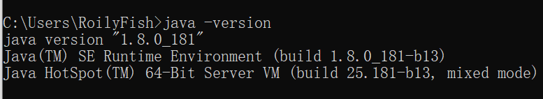
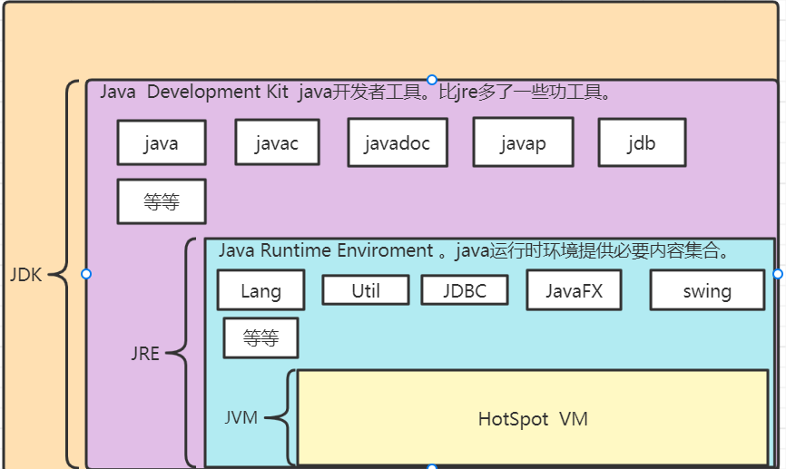
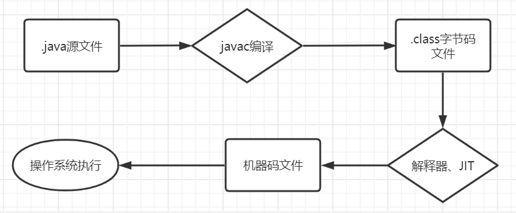
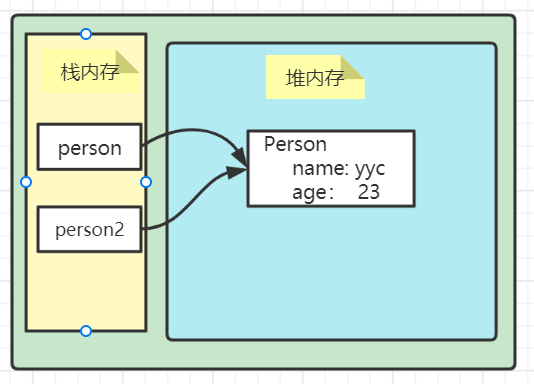
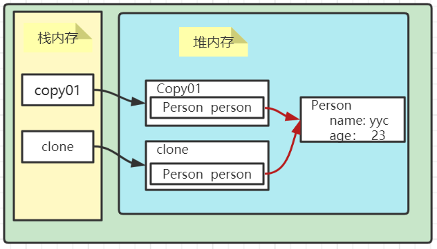
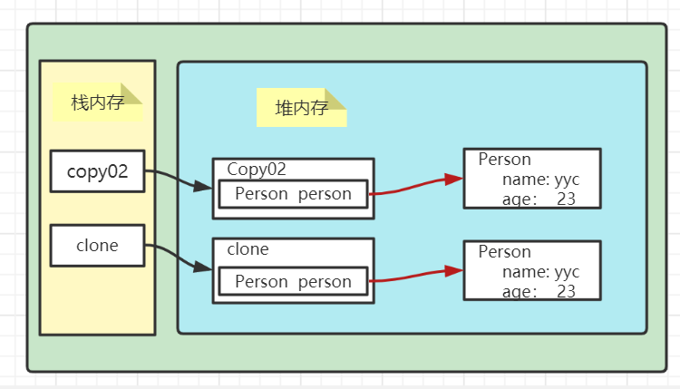

Java语言特点及其表现、JDK\JRE\JVM、JIT编译器、字节码文件、以及一个java程序运行的具体流程。


> [xxxxxx]()


#### Java语言特点

- 面向对象（封装，继承，多态）；
- 跨平台性、或平台无关性
- 支持多线程
- 编译与解释并存
- 可靠性、高新能、安全性


##### 跨平台性

​	“Write Once, Run Anywhere（一次编写，随处运行）”这句宣传口号，就是跨平台性的表现，JVM作为中间商很好的平衡了Java程序和操作系统。


##### 支持多线程

​	java支持多线程，concurrent包下提供了丰富的同步组件(lock锁)和并发容器，供程序员使用，并且具有可扩展性。


##### 编译与解释并存

> 编译型语言与解释型语言

- 编译型语言

编译型语言就是将代码一次性编译成机器认识的代码。开发效率慢、执行效率高。代表的有c、c++、GO。

- 解释型语言

解释型语言就是逐行解释（interpret），逐行运行。开发效率高、执行效率慢。Python、JavaScript、PHP。

>java编译与解释并存

Java 语言既具有编译型语言的特征，也具有解释型语言的特征。
Java 程序要经过先编译，后解释两个步骤，由 Java 编写的程序需要先经过编译步骤，生成字节码（.class 文件），这种字节码必须由 Java 解释器来解释执行。


#### JDK、JRE、JVM

##### JDK

java开发者工具(Java Development Kit )，其包含功能齐全的java sdk ，相对于jre多了一些工具（javac javadoc jdb）

- javac  编译的
- javadoc 生成文档的
- jdb 调试工具（打断点的）


##### JRE

java运行时环境(Java Runtime Enviroment)。运行已编译 Java 程序也就是字节码所需的所有内容的集合，包括 Java 虚拟机（JVM），Java 类库，java 命令和其他的一些基础构件。--rt.jar但是，它不能用于创建新程序。


##### JVM

java虚拟机(Java Virtual Machine)。是运行 Java 字节码的虚拟机。JVM 有针对不同系统的特定实现（Windows，Linux，macOS），目的是使用相同的字节码，它们都会给出相同的结果。字节码和不同系统的 JVM 实现是 Java 语言“一次编译，随处可以运行”的关键所在。满足JVM规范的虚拟机都叫java虚拟机。

我们一般用的是HotSpot，可以使用Java-version查看。




##### 需要了解

> 我们知道java程序运行只依赖于JRE，那么对于一个使用了JSP的java程序只安装JRE是否能成功运行呢？

答案是否定的：

jap本质上是Servlet。当我们首次访问Jsp时他会将.jsp文件转换成.java文件最后编译成.class文件执行，也就是说首次访问Jsp是需要Java-c的，而java-c存在于Jdk。


> 字节码文件

字节码文件指的是Jvm认识的文件，它不面向任何操作系统，它只认Jvm。字节码文件是由java编译器一次性编译而来的，这也是为啥java具有编译型语言特点。


> JDK、JRE、JVM图

jdk>jre>jvm



#### java程序执行流程



①首先编译器一次性将.java源文件编译成.class文件，这里具有编译型语言特点

②字节码文件(.class)交由解释器逐行解释，逐行运行，需要使用JIT编译器放入内存的就放入内存。这里具备解释型语言热点。

③JVM根据不同操作系统生成不同机器码，保证同一份字节码在不同的操作系统上可以得到相同结果。


#### JIT编译器

​	Just In Time (jit)即时编译器。

我们知道字节码文件(.class)编程机器码文件(01文件),这一步java是通过逐行解释、逐行运行的，这就导致效率低下，所以说后面引入了JIT编译器。JIT编译器会作用在哪呢？作用于常用代码，也就是热点代码。JIT会将常用的热点代码第一次编译后，会将对应的机器码保存放入内存，下次调用时直接使用。这样一定程度上提升了代码性能。而且这也是很有必要的，对于一个系统，根据二八定律，其20%的代码会占用80%的资源。同时这也是`java编译与解释并存的表现`。


#### 重载 & 重写

> 重载：①发生在一个类中 ②方法名相同，方法签名不同。

方法签名：方法名+参数列表。


> 重写：发生在存在父子关系的两个类中。

1. 方法名、参数列表必须相同，子类方法返回值类型应比父类方法返回值类型更小或相等，抛出的异常范围小于等于父类，访问修饰符范围大于等于父类。
2. 如果父类方法访问修饰符为 `private/final/static` 则子类就不能重写该方法，但是被 `static` 修饰的方法能够被再次声明。
3. 构造方法无法被重写

**方法的重写要遵循“两同两小一大”**

- “两同”即方法名相同、形参列表相同；
- “两小”指的是子类方法返回值类型应比父类方法返回值类型更小或相等，子类方法声明抛出的异常类应比父类方法声明抛出的异常类更小或相等；
- “一大”指的是子类方法的访问权限应比父类方法的访问权限更大或相等。


#### == & equals

> ==

- 对于基本数据类型，其只有值，`==`比较的是指。

- 对于引用类型， `== `比较的是对象的内存地址。

> equals

- equals只能用于引用类型的判断，不能用于基本数据类型。
- equals是object类的一个方法，所以所有对象都可以重写它。
- 如果一个类没有重写equals方法，调用equals方法进行比较时，就是调用的object的equals方法，等同于`==`


#### hashCode() & equals

首先这两个方法都属于Object类，也就是所有类都可以重写这两个方法，不同点在于hashCode()被native修饰，也就是它是一个本地方法，而本地方法有c或c++编写，相对于java方法执行效率相对较高。

> hashCode()

获取哈希值，这个哈希值的作用是确定该对象在哈希表中的索引位置。根据索引值可以快速从散列表中检索出对象对应的内存地址。总之：hash值可以简单和对象内存地址映射。


##### 哈希碰撞

哈希碰撞是指，不同的对象，获取的哈希值相等。哈希碰撞出现的频率和哈希算法相关，越糟糕的哈希算法出现哈希碰撞的可能性就越高。

##### hashCode()作用

前面我们说了，哈希值可以简单代表对象的内存地址，也就是我们可以用哈希值来判断两个对象是否相等。

在`HashSet`中如何剔除重复项？

- 欲加入hashSet的对象，如果哈希值和Set列表内的对象不同，那么就代表这个对象和set列表中的对象不存在重复，则直接加入set列表。
- 如果哈希值相等，存在两种情况  ①哈希碰撞 ②两个对象真的相等
- 调用equals判断  ①相等不让加入set ②不相等出现了哈希碰撞加入set。

小结：

- 两个对象哈希值相等，两个对象不一定相等。
- 两个对线哈希值不等，那么两个对象一定不相等。

- 两个对象equals返回false那么两个对象哈希值一定不相等。


##### 为什么重写equals方法一定要重写hashCode()方法

​	重写equals方法，改变的是内部的比较逻辑，如果不重写hashCode()方法，会出现equals返回true的情况下，hashCode()却不相等，因为此刻还是使用的父类的哈希算法。


<hr>

#### 成员变量  & 局部变量

- 从语法结构上来看：成员变量属于类，局部变量属于方法或代码块。成员变量可以被private、public、static修饰符修饰，而局部变量不能。但是他们都可以被final修饰。
- 从内存角度来看：成员变量如果使用static修饰，那么他属于类，如果没有被static修饰，那么这个成员变量属于实例。成员变量存储于对内存地址。而局部变量存储于栈内存。
- 从生命周期角度来看：被static修饰的成员变量随类的加载而初始化。未被static修饰的成员变量属于实例，它随着实例对象的创建而创建，消亡而消亡。局部变量随着方法的调用结束而自动消失。
- 是否有默认值：成员变量存在默认值，基本数据类型对应默认值，引用数据类型默认值为null。成员变量没有默认值必须显示赋值或初始化。


#### 封装、继承、多态

> 封装

将对象信息封装在对象内部，不允许直接访问对象的信息，可以提供获取属性的方法。也就是属性私有、提供接口。


> 继承

1. 子类拥有父类对象所有的属性和方法（包括私有属性和私有方法），但是父类中的私有属性和方法子类是无法访问，**只是拥有**。
2. 子类可以拥有自己属性和方法，即子类可以对父类进行扩展。
3. 子类可以用自己的方式实现父类的方法。（重写）。

> 多态

多态表现为父类的引用指向子类的实例。

**多态的特点:**

- 对象类型和引用类型之间具有继承（类）/实现（接口）的关系；
- 引用类型变量发出的方法调用的到底是哪个类中的方法，必须在程序运行期间才能确定；
- 多态不能调用“只在子类存在但在父类不存在”的方法；
- 如果子类重写了父类的方法，真正执行的是子类覆盖的方法，如果子类没有覆盖父类的方法，执行的是父类的方法


#### 接口和抽象类

**相同点**

- 都不能被实例化。
- 都可以包含抽象方法。
- 都可以有默认实现的方法（Java 8 可以用 `default` 关键在接口中定义默认方法）。

**区别** ：

- 一个类只能继承一个类，但是可以实现多个接口。
- 接口中的成员变量只能是 `public static final` 类型的，不能被修改且必须有初始值，而抽象类的成员变量默认 default，可在子类中被重新定义，也可被重新赋值。

例：

```java
public class AboutAbstract {
}
interface testInterface{
    //接口中不可以有(静态)代码块
    //接口不可以被初始化且没有代码块，而final修饰的成员变量要么在代码块中初始化，要么在构造器初始化
    public final int a = 1;

    //可以定义抽象方法
    abstract public void test();
    //可以用default定义默认方法，注意这是java8的特性
    default  void testDefault(){
        System.out.println("testDefault");
    }
}

abstract class testAbstract{
    //可以定义fianl成员变量，且可以初始化也可以在代码块初始化（抽象类不可以实例化，也就是没有构造方法）
    private final int a;
    
    static {
        System.out.println("static 代码块");
    }
    {
        a = 1;
        System.out.println("代码块");
    }
    
    //可以定义具体方法
    public void testAbs(){
        System.out.println("testAbs");
    }
    //可以定义抽象方法
    abstract public void test();
}
```


#### 深拷贝&浅拷贝&引用拷贝

> 引用拷贝

也就是两个引用指向同一块内存地址。

```java
public class AboutCopy {
    public static void main(String[] args) {
        Person person = new Person("yyc",23);
        //这就是引用拷贝
        Person person2 = person;
        System.out.println(person == person2);//返回true
    }
}
@Data
@AllArgsConstructor
class Person{
    private String name;
    private Integer age;
}
```



> clone()方法是Object类的一个本地方法

```java
protected native Object clone() throws CloneNotSupportedException;
```

> 浅拷贝

对于需要被拷贝的对象内存在其他对象，只拷贝其他对象的引用。

```java
@Data
@AllArgsConstructor
class Person{
    private String name;
    private Integer age;
}

@Data
@AllArgsConstructor
class Copy01 implements Cloneable{
    private Person person;
    @Override
    protected Copy01 clone() throws CloneNotSupportedException {
        return (Copy01)super.clone();
    }
    public static void main(String[] args) throws CloneNotSupportedException {
        //copy01
        Copy01 copy01 = new Copy01(new Person("yyc",23));
        Copy01 clone = copy01.clone();
        //两个对象不相等
        System.out.println(copy01 == clone);//false
        //但是其内部对象相等
        System.out.println(copy01.person == clone.person);//true
    }
}
```



> 深拷贝

全部拷贝，包括内部属性。拷贝两份完全不同的东西。

```java
@Data
@AllArgsConstructor
class Person implements Cloneable {
    private String name;
    private Integer age;
    @Override
    protected Person clone() throws CloneNotSupportedException {
        return (Person) super.clone();
    }
}

@Data
@AllArgsConstructor
class Copy02 implements Cloneable {
    private Person person;
    @Override
    protected Copy02 clone() throws CloneNotSupportedException {
        Copy02 copy02 = (Copy02) super.clone();
        copy02.setPerson(person.clone());
        return copy02;
    }
    public static void main(String[] args) throws CloneNotSupportedException {
        //copy02
        Copy02 copy02 = new Copy02(new Person("yyc", 23));
        Copy02 clone = copy02.clone();
        //两个对象不相等
        System.out.println(copy02 == clone);//false
        //但是其内部对象也不相等
        System.out.println(copy02.person == clone.person);//false
    }
}
```

