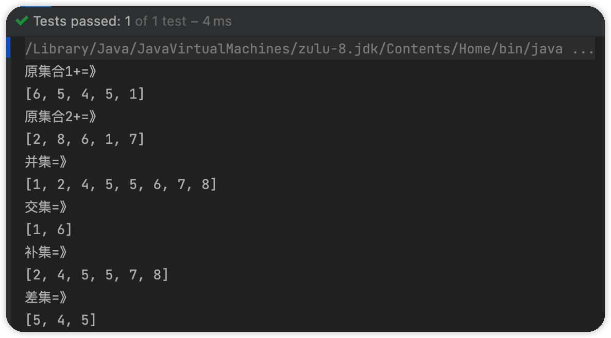

### java常用工具类

> 熟练使用工具类，避免重复造轮子


#### Collections

> `java.util`包下的``Collections`类,该类主要用于操作集合。和`Collection`接口不同，`Collections`类一般用来操作实现`Collection`接口的类。

##### 排序

> `Collections`类提供了对`List<>`集合进行排序的api。

- 可自定义比较器Comparator。默认升序排序
- reverse会将集合倒置，配合升序排序，可以实现降序排序

底层使用的`Arrays.sort(a, (Comparator) c)`方法，会多申请一个数组空间。

```java
/**
* 生成10个随机数在 start到end之前的数字
*
* @param count
* @param start
* @param end
* @return
*/
public List<Integer> createRandomCollection(int count, int start, int end) {
  //检查count大于0
  Assert.check(count > 0);
  List<Integer> list = new ArrayList<>();
  for (int i = 0; i < count; i++) {
    list.add((int) (Math.random() * (end - start)) + start);
  }
  return list;
}
/**
 * 使用CollectionS对List进行排序
 */
@Test
public void collectionsSort() {

    List<Integer> integerList = createRandomCollection(20, 5, 20);
    System.out.println("原集合：=》\n" + integerList);
    //升序
    Collections.sort(integerList);
    System.out.println("降序排序后：=》\n" + integerList);
    //可自定义比较器
    Collections.sort(integerList, (val1, val2) -> {
        if (val1 > val2) {
            return -1;
        } else {
            return 1;
        }
    });
    System.out.println("自定义比较器实现升序：=》\n" + integerList);

    //将集合倒过来
    final List<Integer> randomCollection = createRandomCollection(20, 5, 20);
    System.out.println("愿集合：=》\n"+randomCollection);
    Collections.reverse(randomCollection);
    System.out.println("倒置后：=》\n"+randomCollection);

}
```


##### 获取极值

> 可以使用`Collections`获取集合的最大最小值。同样可以自定义比较器。

```java
/**
 * 使用Collections获取集合的最大最小值
 */
@Test
public void getMaxAndMin() {
    List<Integer> integerList = createRandomCollection(20, 5, 20);
    System.out.println("集合：" + integerList);
    //最大值
    System.out.println("最大值：" + Collections.max(integerList));
    //最小值
    System.out.println("最小值：" + Collections.min(integerList));
}
```


##### 转换线程安全集合

> `java`中除了`Concurrent`包下的集合，其余的大多数是非线程安全的，`Collectios`提供了可以将非线程安全的集合转化为线程安全的集合。

可以使用`synchronizedXXXX`方法转化为线程安全的集合，返回的集合是`Collectios`的静态内部类。但是不推荐，因为使用`Collections`转化的线程安全的集合都是使用`Synchronized`加锁实现的，性能不乐观。

```java
/**
 * 将非线程安全的集合转化为线程安全的集合
 */
@Test
public void toConcurrentList() {
    final List<Integer> randomCollection = createRandomCollection(20, 5, 20);
    Collection<Integer> integers = Collections.synchronizedCollection(randomCollection);
}
```


##### 判空后返回空集合而不是null

> 返回的集合是一个范型，不用手动转换

```java
/**
 * 在判空后，需要返回空集合而不是null。可以借助Collections.emptyList()方法
 */
@Test
public void returnEmpty() {
    final List<Object> objects = Collections.emptyList();
}
```


##### 二分查找

```java
/**
 * 二分查找。给定集合，返回下标
 */
@Test
public void binarySearch() {
    final List<Integer> randomCollection = createRandomCollection(20, 5, 20);
    System.out.println(randomCollection);
    final int target = Collections.binarySearch(randomCollection, 10);
    System.out.println(target);
}
```


##### 转化为不可修改集合

> 如果某个流程不允许后续程序修改集合，可以使用此方法返回不可修改集合。

```java
/**
 * 转化为不可修改集合
 */
@Test
public void toUnModify() {
    final List<Integer> randomCollection = createRandomCollection(20, 5, 20);
    final List<Integer> integerList = Collections.unmodifiableList(randomCollection);
    integerList.add(1);
}
```


#### CollectionUtils

> 对集合操作，除了`Collections`工具类以外，`CollectionUtils`也很常用。
>
> 常用的两个分别是`Spring.framework.util`和`org.apache.commons.collections`下的`CollectionUtils`。两者差不多，但是`apache`下的工具类功能更全。

我们以Spring框架为我们提供的工具类为例。

引入依赖：引入Spring上下文依赖

```xml
<dependency>
    <groupId>org.springframework</groupId>
    <artifactId>spring-context</artifactId>
    <version>5.3.18</version>
</dependency>
```


##### 集合判空

spring为我们提供了isEmpty方法，而apache提供了isempty() 和isNotEmpty()方法。

```java
/**
 * 集合判空，集合为null，或元素个数为0
 */
@Test
public void testCollectionIsEmpty() {
    final List<Integer> randomCollection = createRandomCollection(20, 5, 15);
    if (CollectionUtils.isEmpty(randomCollection)) {
        System.out.println("集合为空");
    }else {
        System.out.println("集合不为空");
    }
}
```


##### 集合合并

> 对两个集合进行合并操作。比如取交集、并集。此方法spring未提供，需要引入apache包依赖

```xml
<dependency>
    <groupId>org.apache.commons</groupId>
    <artifactId>commons-collections4</artifactId>
    <version>4.4</version>
</dependency>
```

```java
/**
 * 集合合并
 * - 获取并集
 * - 获取交集
 * - 交集的补集
 * - 差集
 */
@Test
public void testCollectionMerge() {
    final List<Integer> randomCollection1 = createRandomCollection(5, 0, 9);
    final List<Integer> randomCollection2 = createRandomCollection(5, 0, 9);
    System.out.println("原集合1+=》\n" + randomCollection1);
    System.out.println("原集合2+=》\n" + randomCollection2);
    //并集
    final Collection<Integer> union = org.apache.commons.collections4.CollectionUtils.union(randomCollection1, randomCollection2);
    System.out.println("并集=》\n" + union);
    //交集
    final Collection<Integer> intersection = org.apache.commons.collections4.CollectionUtils.intersection(randomCollection1, randomCollection2);
    System.out.println("交集=》\n" + intersection);
    //交集的补集
    final Collection<Integer> disjunction = org.apache.commons.collections4.CollectionUtils.disjunction(randomCollection1, randomCollection2);
    System.out.println("补集=》\n" + disjunction);
    //差集
    final Collection<Integer> subtract = org.apache.commons.collections4.CollectionUtils.subtract(randomCollection1, randomCollection2);
    System.out.println("差集=》\n" + subtract);
}
```




#### Lists

> 该工具类由Guaua工程提供，由Google工程师开发且广泛使用，使用轮子可以使得我们代码简洁。

依赖：

```xml
<!-- https://mvnrepository.com/artifact/com.google.guava/guava -->
<dependency>
    <groupId>com.google.guava</groupId>
    <artifactId>guava</artifactId>
    <version>31.1-jre</version>
</dependency>
```

##### 创建空集合

```java
/**
 * Lists创建空集合
 */
@Test
public void createEmptyList() {
    //空的LinkedList
    LinkedList<String> linkedList = Lists.newLinkedList();
    //空的ArrayList
    ArrayList<String> arrayList = Lists.newArrayList();
    //空的copyOnWriteArrayList，arrayList的线程安全版本
    CopyOnWriteArrayList<String> copyOnWriteArrayList = Lists.newCopyOnWriteArrayList();
}
```


##### 快速初始化一个集合

> 借助可变长参数，快速初始化一个集合

```java
/**
 * 可变长参数快速初始化集合
 * 可以是可变长参数
 * 可以是Iterable
 */
@Test
public void quickInitList() {
    ArrayList<Integer> arrayList = Lists.newArrayList(1, 2, 3, 4, 5);
    System.out.println(arrayList);
}
```


##### 笛卡尔积

```java
/**
 * 笛卡尔积
 * 这是一个可变长参数
 */
@Test
public void cartesianProduct() {
    List<Integer> randomCollection1 = CollectionUtilsTest.createRandomCollection(3, 0, 9);
    List<Integer> randomCollection2 = CollectionUtilsTest.createRandomCollection(3, 0, 9);
    System.out.println(Lists.cartesianProduct(randomCollection1, randomCollection2));
}
```


##### 集合拆分

> 将一个大集合拆分为多个小集合，需要指定原集合和拆分后集合的大小

```java
/**
 * 拆分
 * <p>
 * 将一个大集合分割成落干个小集合,只需要制定集合和拆分集合大小即可
 */
@Test
public void splitList() {
    List<Integer> randomCollection1 = CollectionUtilsTest.createRandomCollection(10, 0, 9);
    System.out.println(randomCollection1);
    List<List<Integer>> lists = Lists.partition(randomCollection1, 3);
    System.out.println("拆分后：");
    for (List<Integer> list : lists) {
        System.out.println(list);
    }
}
```


##### 以流的形式转化

> 以流的形式将一个集合转化成另一个集合

```java
/**
 * 以流的形式讲一个集合转化成另一个集合
 */
@Test
public void transForm() {
    List<Integer> randomCollection1 = CollectionUtilsTest.createRandomCollection(10, 0, 9);
    final List<Integer> transform = Lists.transform(randomCollection1, element -> --element);
    System.out.println(randomCollection1);
    System.out.println(transform);

    System.out.println("当然Collection接口也提供了");
    List<Integer> collect = randomCollection1.stream().map(element -> --element).collect(Collectors.toList());
    System.out.println(collect);
}
```


##### 颠倒集合

```java
/**
 * 将集合颠倒
 */
@Test
public void reverse() {
    List<Integer> randomCollection1 = CollectionUtilsTest.createRandomCollection(10, 0, 9);
    System.out.println("原集合：=》" + randomCollection1);

    List<Integer> reverse = Lists.reverse(randomCollection1);
    System.out.println("颠倒后：=》" + reverse);

}
```


#### Objects

> `Java.util`包下的`Objects`类为我们提供了操作对象的工具类


##### 判空

> 由于`Objects`只有当对象为`NULL`时才会判空，一般来说我们就用`Spring`提供的工具类`BeanUtils`来判空。

```java
/**
 * 判空
 * 只有当对象为null时返回true
 */
@Test
public void isNull() {
    String string = new String();
    System.out.println(Objects.isNull(string));
}
/**
 * spring提供的判空
 */
@Test
public void springBeanUtils() {
    System.out.println(ObjectUtils.isEmpty(""));
}
```


##### 为空抛异常

> 当对象为空时抛出异常，`Assert`也可以实现。

```java
/**
 * 为空抛出异常
 */
@Test
public void ifNullThrow() {
    Object obj = null;
    //自定义异常信息
    Objects.requireNonNull(obj, "参数为空");
    //使用函数式接口，自定义异常
    Objects.requireNonNull(obj, () -> {
        return "参数为空";
    });
}
```


##### 判断两个对象是否相等

- equals
- deepEquals（可以判断数组）

```java
/**
 * 判断两个对象是否相等
 * 判断逻辑：两个对象完全相等，或equals方法返回true
 */
@Test
public void isEquals() {
    String str1 = "abc";
    String str2 = "abc";
    String str3 = "123";
    System.out.println(Objects.equals(str1, str2));
    System.out.println(Objects.equals(str1, str3));
}
```


好处：

> 避免空指针异常

```java
/**
 * 使用Objects工具类，如果前者为null，是否抛出空指针异常
 * 
 * 不会
 */
@Test
public void shouldNullException() {

    Object obj1 = null;
    Object obj2 = new Object();
    //会抛出空指针异常
    obj1.equals(obj2);
    //使用Objects工具类则不会抛出异常
    Objects.equals(obj1, obj2);

}
```


比较的坑：

- 基本数据类型自动拆箱空指针问题
- 不同数据类型会装箱后再调用equals比较，数据类型不匹配直接返回false

```java
/**
 * 对于基本数据类型比较的坑
 * 如果是基本数据类型的包装类型和基本数据类型比较的话，需要注意自动拆箱的空指针异常
 */
@Test
public void testSimpleType() {
    Integer i1 = null;
    int i2 = 0;
    //抛出空指针异常
    System.out.println(i1 == i2);
}
@Test
public void testSimpleType2() {
    long i1 = 1L;
    Integer i2 = 1;
    //true
    System.out.println(1 == 1L);
    //true
    System.out.println(i1 == i2);
    //false  这里是自动装箱的问题。long会装箱成Long 而不同类型的equals方法会返回false
    System.out.println(Objects.equals(i1, i2));
}
```


##### 获取hashCode

> 使用`Object`的`HashCode()`方法存在空指针危险，`Objects`则不会，当对象为空返回0.

```java
/**
 * 获取对象的hashCode
 */
@Test
public void getHashCode() {
    String str = "1223";
    //重写Object的hashCode方法，如多str为空会报空指针异常
    System.out.println(str.hashCode());
    //这里处理的好，为空返回0，不为空再调用hashCode方法
    System.out.println(Objects.hashCode(str));
}
```


#### BooleanUtils

> 布尔值工具类，同样的可以避免空指针异常。在Apache.common包下

可以返回非true，也就是false或者null

某些场景会对布尔值做转化，true - 1 false-0

int类型或String类型可以转化为Boolean类型

```java
@Test
public void booleanUtils() {
  Boolean b = false;
  //将int转化为boolean
  System.out.println(BooleanUtils.toBoolean(1));
  System.out.println(BooleanUtils.toBoolean(1, 1, 0));
  //将String转化为boolean
  System.out.println(BooleanUtils.toBoolean("true"));
  System.out.println(BooleanUtils.toBoolean("abc","abc","123"));

  //将boolean转化为int或integer
  System.out.println(BooleanUtils.toInteger(b, 1, 0));
  //转化为String，可以制定 "true/"false"、"off"/"on"等等
  System.out.println(BooleanUtils.toStringOnOff(b));

  //判断某个布尔值是否为true或false即便为null也没事
  System.out.println(BooleanUtils.isFalse(b));
  System.out.println(BooleanUtils.isTrue(null));
  System.out.println(BooleanUtils.isNotTrue(null));
}
```


#### StringUtils

> 字符串工具类，在apache.common包下

对于字符串的处理时很频繁的，判空、截取、转换大小写等等

##### 判空

> 一般使用isBlank方法，因为此方法会将 “  ”空行考虑进去

```java
@Test
public void isEmpty() {
    //字符串对象为null或没有字符串长度为0
    System.out.println(StringUtils.isEmpty(""));
    System.out.println(StringUtils.isEmpty(" "));
    //判断字符串是否为空行
    System.out.println(StringUtils.isBlank(" "));
}
```


##### 分隔字符串

```java
/**
 * 分隔字符串
 */
@Test
public void split() {
    String str = "1。2。3。4。5。6。7。8。9";
    //使用String的Split当字符串对象为空时会抛出空指针异常
    System.out.println(Arrays.toString(str.split("。", 4)));

    //使用StringUtils避免空指针异常
    System.out.println(Arrays.toString(StringUtils.split(str, "。", 3)));
}
```


##### 判断字符串是否为纯数字

我们使用Integer.valueOf()方法之前可以使用，isNumeric(String)判断字符串是否为纯数字

```java
/**
 * 判断给定的字符串是否为纯数字
 */
@Test
public void testIsNumeric() {

    String str1 = "123";
    String str2 = "0.123";
    String str3 = "0.123f";
    String str4 = "123L";

    System.out.println(str1+"=>"+StringUtils.isNumeric(str1));
    System.out.println(str2+"=>"+StringUtils.isNumeric(str2));
    System.out.println(str3+"=>"+StringUtils.isNumeric(str3));
    System.out.println(str4+"=>"+StringUtils.isNumeric(str4));

}
```


##### 将集合拼接成字符串

首先会截取我们的数组，然后循环调用集合内对象的toString方法，用StringBuffer拼接起来返回。

```java
/**
 * 将集合拼接成字符串，并自定义分隔符
 */
@Test
public void join() {
    ArrayList<Integer> list = Lists.newArrayList(1, 2, 3, 4, 5);
    final String join = StringUtils.join(list, ",", 0, list.size());
    System.out.println(join);
}
```


<hr>


#### Assert

> `Assert`为断言的意思，很多情况下可以用于判段参数是否符合条件，否则抛出异常，且可以统一处理

参数不符合条件，会抛出`java.lang.IllegalArgumentException`异常

这里使用的是`springframework.util`下的工具类

##### 判空

```java
/**
* 断言为空或不为空
* - 对象
* - 集合
* - map
*/
@Test
public void testIsNull() {
  String str= null;
  Assert.notNull(str,"参数不可以为空");
  Assert.isNull(str,"参数必须为空");

  Lists.newArrayList(1,2,3,4);
  Assert.notEmpty((Object[]) null,"不可以为空");
}
```


##### 布尔值及其他


```java
/**
 * 断言布尔值
 */
@Test
public void assertBoolean() {
    final List<Object> list = Lists.newArrayList();
    Assert.isTrue(!list.isEmpty(), "集合不可以为空");
}

/**
 * 断言是否符合类型
 */
@Test
public void assertInstance() {
    Assert.isInstanceOf(Integer.class, "abc", "类型不匹配");
    Assert.isAssignable(String.class, Object.class);
}

/**
 * 断言类型是否可以强转
 * - 存在父子关系
 * - 接口和其实现类
 */
@Test
public void assertAssignable() {
    //通过
    Assert.isAssignable(List.class, ArrayList.class);
    //通过
    Assert.isAssignable(Object.class, ArrayList.class);
    //可以
    Assert.isAssignable(Collection.class, List.class);
    //可以
    Assert.isAssignable(Collection.class, ArrayList.class);
    //不通过
    Assert.isAssignable(List.class, Object.class);
}
```


#### IOUtils

> 简化IO操作

- 提供关闭资源的方法
- 灵活的读写文件操作，且对各种流的支持（文件流、字符流、字节流、管道流）

引入依赖`commons-io`

```xml
<!-- https://mvnrepository.com/artifact/commons-io/commons-io -->
<dependency>
    <groupId>commons-io</groupId>
    <artifactId>commons-io</artifactId>
    <version>2.11.0</version>
</dependency>
```


##### 将文件读出字符串

```java
/**
     * 将某一文件以字符串的形式读出
     *
     * @throws IOException
     */
@Test
public void readToString() throws IOException {
  String fileName = "test.txt";
  FileReader fileReader = new FileReader(new File(rootPath, fileName));
  String s = IOUtils.toString(fileReader);
  System.out.println(s);
  //关闭资源
  IOUtils.close(fileReader);
}
```


##### 写入文件

```java
/**
 * 将字符串写入文件，一次性写完
 */
@Test
public void writeToFile() throws IOException {
  String fileName = "testwrite.txt";
  String str = "写入文件";
  FileOutputStream fileOutputStream = new FileOutputStream(new File(rootPath, fileName), true);
  //以追加的形式写入文件
  IOUtils.write(str, fileOutputStream, StandardCharsets.UTF_8);
  IOUtils.close(fileOutputStream);
}
@Test
public void writeToFile2() throws IOException {
  String fileName = "testwrite2.txt";
  String str = "dasdasd撒大大叔";
  //以追加的形式写入文件
  FileWriter fileWriter = new FileWriter(new File(rootPath, fileName), true);
  IOUtils.write(str, fileWriter);
  IOUtils.close(fileWriter);
}
```


##### 文件拷贝

> 将一个文件内容拷贝到另一个文件

```java
/**
 * 复制文件
 */
@Test
public void fileCopy() throws IOException {
    //源文件
    String sourceFile = "test.txt";
    //目标文件
    String targetFile = "target.txt";
    FileReader fileReader = new FileReader(new File(rootPath, sourceFile));
    FileWriter fileWriter = new FileWriter(new File(rootPath, targetFile), true);

    final int copy = IOUtils.copy(fileReader, fileWriter);
    System.out.println(copy);
    IOUtils.close(fileReader, fileWriter);
}
```

##### 一行一行读

> IOUtils提供了ReadLine方法，将文件读出来以字符串数组的形式返回。这样更方便灵活操作

比如以下例子就是剔除文件中的空行

```java
/**
 * 如果想一行一行读呢
 * 可以使用readLines 获取每一行的字符串
 *
 * 且可以使用CollectionUtils的filter过滤掉不需要的
 */
@Test
public void readOneLine() throws IOException {

    FileInputStream fileInputStream = new FileInputStream(new File(rootPath, "test.txt"));
    List<String> strings = IOUtils.readLines(fileInputStream, StandardCharsets.UTF_8);
    System.out.println(strings);
    System.out.println("==================");
    CollectionUtils.filter(strings,(str)-> !StringUtils.isEmpty(str));
    System.out.println(strings);
    //关闭资源
    IOUtils.close(fileInputStream);
}
```


<hr>

#### ClassUtils

> `org.springframewok.util`包下的`ClassUtils`a为我们提供了获取一个对象的类信息，包括接口信息、是否内部类、是否代理对象


##### 获取接口列表

> 获取一个对象的接口列表可以使用`ClassUtils`来获取

```java
/**
 * 获取一个对象的接口列表
 */
@Test
public void test() {
    List<Object> list = new ArrayList<>();
	  Arrays.asList(ClassUtils.getAllInterfaces(list)).forEach(System.out::println);

    //得到Class就可以得到一切，只不过我们不确定给的对象是否实现了接口，而ClassUtils没有这个问题
    System.out.println(Arrays.toString(list.getClass().getInterfaces()));
}
```


##### 获取包名

```java
/**
 * 获取包名
 */
@Test
public void getPackageName() {
    List<Object> list = new ArrayList<>();
    //获取包名
    System.out.println(ClassUtils.getPackageName(list.getClass()));
    //用package对象也可以
    System.out.println(list.getClass().getPackage().getName());
}
```


##### 判段是否是内部类

```java
/**
 * 判断一个类是否是内部类
 */
@Test
public void isInnerClass() {
    List<Object> list = new ArrayList<>();
    System.out.println(ClassUtils.isInnerClass(list.getClass()));

    HashMap<Object, Object> map = new HashMap<>(10);
    System.out.println(ClassUtils.isInnerClass(map.keySet().getClass()));
}
```


<hr>


#### BeanUtils

> `Spring`为我们提供的`JavaBean`工具。


##### 拷贝属性

> 将对象属性拷贝简化赋值操作

存在两个类Person为实体类，PersonDTO为业务需要的实体类对应类

- 想要实现拷贝，需要拷贝的属性名需要相同
- 可以忽略某些属性

```java
@Data
@Accessors(chain = true)
public class Person {
    Long id;
    String name;
    Integer age;
    String address;
    Date birth;

    public static Person getDefault() {
        return new Person()
                .setId(1L)
                .setName("yyc")
                .setAge(22)
                .setAddress("大套")
                .setBirth(Calendar.getInstance().getTime());
    }
}
@ToString
@Data
public class PersonDTO {

    String name;

    Integer age;
}
```

```java
/**
 * 拷贝
 */
@Test
public void copyPropertiesEquals() {
    Person person = Person.getDefault();
    Person personCopy = new Person();
    System.out.println("原对象");
    System.out.println(person);
    System.out.println(personCopy);
    BeanUtils.copyProperties(person, personCopy,"name");
    System.out.println("拷贝后");
    System.out.println(person);
    System.out.println(personCopy);
}

/**
 * 支持不同对象的属性拷贝，只要属性名称相同，也就是setter相同
 * 将person 转化 成personDTO
 */
@Test
public void copyProperties() {
    Person person = Person.getDefault();
    PersonDTO personDTO = new PersonDTO();

    System.out.println("原对象");
    System.out.println(person);
    System.out.println(personDTO);
    BeanUtils.copyProperties(person, personDTO);
    System.out.println("拷贝后");
    System.out.println(person);
    System.out.println(personDTO);
}
```


##### 实例化某个类

- 实例化一个类
- 实例化一个类，并指定引用类型
- 通过构造器实例化一个类，可以设置初始值

```java
/**
 * 实例化某个类
 */
@Test
public void instant() throws NoSuchMethodException {
    //实例化一个空属性类
    System.out.println(BeanUtils.instantiateClass(Person.class));
    //实例化一个类并指定其引用类型，前提是可转化（也就是是父子关系，或接口实现类关系）
    System.out.println(BeanUtils.instantiateClass(Person.class, Object.class));
    System.out.println(BeanUtils.instantiateClass(ArrayList.class, Collection.class));
    //构造器实例化一个类，可以初始化属性
  System.out.println(BeanUtils.instantiateClass(Person.class.getDeclaredConstructor(String.class), "yyc"));
}
```


##### 获取指定方法

> 当然可以使用反射实现，使用工具类会使得代码可读性更好

```java
/**
     * 获取指定类的指定方法
     */
@Test
public void getMethod() throws NoSuchMethodException, InvocationTargetException, IllegalAccessException {

  //通过反射实现
  final Method method = Person.class.getDeclaredMethod("getName");
  //当方法是私有的化，可以使用此方法破坏私有
  method.setAccessible(true);
  final Object name = method.invoke(Person.getDefault());
  System.out.println("通过反射实现：" + name);

  //使用工具类实现，底层也是反射
  Method getName = BeanUtils.findDeclaredMethod(Person.class, "getName");
  assert getName != null;
  System.out.println("通过工具类实现：" +getName.invoke(Person.getDefault()));

}
```


##### 获取属性的名称

```java
/**
     * 获取属性的名称（属性的setter getter）
     */
@Test
public void getMethodParams() {
  Method testMethodParams = BeanUtils.findDeclaredMethod(Person.class, "setName",
                                                         String.class);
  final PropertyDescriptor setName = BeanUtils.findPropertyForMethod(testMethodParams);
  System.out.println(setName);
}
```


<hr>

#### ReflectionUtils

> 反射工具类，原声反射需要处理很多异常，`Spring`为我们提供了反射工具类，在`org.springframework.util`包下。

基本用不到，只是对原生反射做封装，可以自己处理异常，不用我们手动抛出

```java
public class ReflectionUtilsTest {

    public void testXx(String param1, String param2) {

    }

    @Test
    public void testSimple() throws NoSuchMethodException, NoSuchFieldException, InvocationTargetException, IllegalAccessException {

        //1、获取构造器,底层也是反射
        Constructor<Person> personConstructor = ReflectionUtils.accessibleConstructor(Person.class);
        //反射也行
        Person.class.getConstructor();

        //2、获取方法
        ReflectionUtils.findMethod(ReflectionUtilsTest.class, "testXx", String.class, String.class);
        //反射也行
        ReflectionUtilsTest.class.getMethod("testXx", String.class, String.class);

        //3、获取字段,这里就不用管这个属性是否私有了
        ReflectionUtils.findField(Person.class, "name");
        //这个需要考虑全限制
        //Person.class.getField("name");
        Person.class.getDeclaredField("name");

        //4、执行方法
        final Method testXx = ReflectionUtils.findMethod(ReflectionUtilsTest.class, "testXx", String.class, String.class);
        ReflectionUtils.invokeMethod(testXx, new ReflectionUtilsTest(), "param1", "param2");
        //反射也行,只不过需要抛出异常
        testXx.invoke(new ReflectionUtilsTest(), "param1", "param2");

        //判断某个字段是否为常量

        //判断某个方法是否为 equals hashCode等等

    }
}
```

<hr>


#### Base64Utils

> 当我们有对数据进行加密解密需求时，可以使用此工具实现。包含了`decode`和`encode`方法。

```java
@Test
public void testEncodeAndDecode() {
    String str = "abc哈哈哈";
    String strEncode = new String(Base64Utils.encode(str.getBytes(StandardCharsets.UTF_8)));
    System.out.println("加密后：=》" + strEncode);
    String strDeCode = new String(Base64Utils.decode(strEncode.getBytes(StandardCharsets.UTF_8)));
    System.out.println("解密后：=》" + strDeCode);
}
```


#### StandardCharsets

> `java.nio.charset`下的`StandardCharsets`可以很方便的获取字符编码。比如我们在流中会指定字符编码。

```java
@Test
public void standardCharsetTest() throws IOException {
    //指定字符集
    IOUtils.readLines(new FileInputStream("1.xtx"), StandardCharsets.UTF_8);

    new String(new byte[]{1, 23}, StandardCharsets.UTF_8);
}
```


#### DigestUtils

> 对数据进行加密，比如`MD5`、`Sha256`

依赖：`org.apache.commons.codec.digest`

```xml
<dependency>
  <groupId>commons-codec</groupId>
  <artifactId>commons-codec</artifactId>
  <version>1.15</version>
</dependency>
```

```java
@Test
public void hex() throws UnsupportedEncodingException {
    String str = "加密";
    final String strHex = DigestUtils.md5Hex(str);
    System.out.println(strHex);
    
    final String sha256Hex = DigestUtils.sha256Hex(str);
    System.out.println(sha256Hex);
}
```


<hr>


#### SerializationUtils

> 序列化反序列化工具，现在基本都支持自动反序列化。

实现序列化功能，一般是实现`Serializable`接口，重写`writeObject`和`readObject`方法。

如果使用`org.springframework.util`包下的`SerializationUtils`工具类可以轻松实现序列化反序列化。

```java
@Test
public void serializationUtilsTest() {
    ArrayList<String> arrayList = Lists.newArrayList("a", "b", "c");
    System.out.println("原对象：=>" + arrayList);
    final byte[] bytes = SerializationUtils.serialize(arrayList);
    System.out.println("序列化后：=>" + Arrays.toString(bytes));
    Object result = SerializationUtils.deserialize(bytes);
    System.out.println("反序列化：=>" + result);
}
```


<hr>

#### HttpStatus

> `org.springframework.http`提供的`HttpStatus`

属于spring-web，需要引入对应依赖

```java
@Test
public void httpStatusTest() {
    final HttpStatus httpStatus = HttpStatus.valueOf(404);
    System.out.println(httpStatus);
    HttpStatus httpStatus2 = HttpStatus.valueOf(500);
    System.out.println(httpStatus2);
}
```

> 这是一个枚举类，给定了很多状态，当然我们也可以自定义，没毛病。

