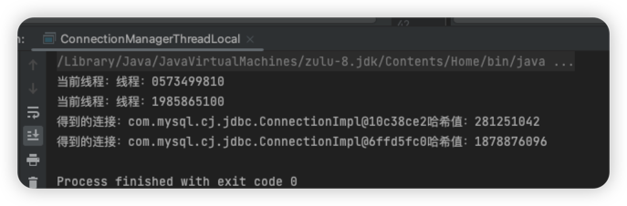

## ThreadLocal


### 简介

ThreadLocal是通过==线程隔离==的方式防止任务在共享资源上产生冲突, 线程本地存储是一种自动化机制，可以为使用相同变量的每个不同线程都创建不同的存储。

> This class provides thread-local variables. These variables differ from their normal counterparts in that each thread that accesses one (via its {@code get} or {@code set} method) has its own, independently initialized copy of the variable. {@code ThreadLocal} instances are typically private static fields in classes that wish to associate state with a thread (e.g., a user ID or Transaction ID) 该类提供了线程局部 (thread-local) 变量。这些变量不同于它们的普通对应物，因为访问某个变量(通过其 get 或 set 方法)的每个线程都有自己的局部变量，它独立于变量的初始化副本。ThreadLocal 实例通常是类中的 private static 字段，它们希望将状态与某一个线程(例如，用户 ID 或事务 ID)相关联。

总结而言：ThreadLocal是一个将在多线程中为每一个线程创建单独的变量副本的类; 当使用ThreadLocal来维护变量时, ThreadLocal会为每个线程创建单独的变量副本, 避免因多线程操作共享变量而导致的数据不一致的情况。


### ThreadLocal理解


#### ThreadLocal应用场景

- Session管理
- 数据库链接管理

#### 以数据链接管理为例

> 以下例子存在问题：
>
> - 在多线程环境下有线程安全问题
>   - 在创建线程链接时，可能会重复创建链接
>   - 在关闭链接时，可能其他线程正在使用链接
> - 解决方案
>   - 阻塞同步  使用Synchronized Lock等
> - 数据库链接其实并不需要共享
>   - 我们希望每个线程都有自己独立的数据库链接，而并不希望此链接是一个共享资源
> - 可不可以在需要链接时创建，使用完关闭
>   - 在一个线程中，往往我们不会只使用一次链接，频繁创建和关闭浪费资源

```java
public class ConnectionManager {
    private static Connection connect = null;
    public static Connection openConnection() throws SQLException {
        if (connect == null) {
            connect = DriverManager.getConnection("", "", "");
        }
        return connect;
    }
    public static void closeConnection() throws SQLException {
        if (connect != null) {
            connect.close();
        }
    }
}
```

并发环境下存在问题：

`java.sql.SQLNonTransientConnectionException: No operations allowed after connection closed.`

```java
@Test
public void test() throws Exception {

    Runnable r1 = () -> {
        final Connection connection = openConnection();
        // 关闭链接， 下面报异常
        closeConnection();
        try {
            for (int i = 0; i < 100; i++) {
                final PreparedStatement preparedStatement = connection.prepareStatement("select  * from tb_user");
                final ResultSet resultSet = preparedStatement.executeQuery();
                while (resultSet.next()) {
                    System.out.println(resultSet.getString(2));
                }
            }
        } catch (Exception e) {
            e.printStackTrace();
        }
    };
    Runnable r2 = () -> {
        while (true) {
            closeConnection();
        }
    };
    ExecutorService executorService = new ThreadPoolExecutor(10, 10, 60L, TimeUnit.SECONDS,
            new ArrayBlockingQueue<Runnable>(10), (r) -> {
        //线程名前缀
        String namePrefix = "线程：";
        Thread t = new Thread(null, r, namePrefix + Thread.currentThread(), 0);
        //设置为费守护线程
        t.setDaemon(false);
        return t;
    });
    executorService.execute(r1);
    executorService.execute(r2);
    Thread.sleep(6000);
    executorService.shutdown();

}
```

如果同时获取数据库链接可能会重复创建数据库链接

一个线程正在使用数据库链接另一个线程关闭了该链接

> 以上存在的问题我们可以通过
>
> ① 作为局部变量，每个方法都new出来
>
> ②使用本地变量ThreadLocal 在线程内任何地方都可以共享链接


##### 方式一

```java
public class ConnectionManagerLocal {
    private Connection connect = null;

    public Connection openConnection() {
        if (connect == null) {
            try {
                connect = DriverManager.getConnection("jdbc:mysql://127.0.0.1:3306/hmdp?useSSL=false&serverTimezone=UTC", "root", "123456");
            } catch (SQLException e) {
                throw new RuntimeException(e);
            }
        }
        return connect;
    }
    public void closeConnection() {
        if (connect != null) {
            try {
                connect.close();
            } catch (SQLException e) {
                throw new RuntimeException(e);
            }
        }
    }
    public static void main(String[] args) throws Exception {
        final ConnectionManagerLocal connectionManagerLocal = new ConnectionManagerLocal();
        connectionManagerLocal.openConnection();
        connectionManagerLocal.closeConnection();
    }
}
```


##### 方式二 ThreadLocal

```java
public class ConnectionManagerThreadLocal {

    private static final ThreadLocal<Connection> CONNECTION_LOCAL = ThreadLocal.withInitial(() -> {
        try {
            return DriverManager.getConnection("jdbc:mysql://127.0.0.1:3306/hmdp?useSSL=false&serverTimezone=UTC", "root", "123456");
        } catch (SQLException e) {
            throw new RuntimeException(e);
        }
    });

    public static Connection openConnection() {
        return CONNECTION_LOCAL.get();
    }


    public static void main(String[] args) {
        AtomicInteger no = new AtomicInteger();
        ExecutorService executorService = new ThreadPoolExecutor(10, 10, 60L, TimeUnit.SECONDS,
                new ArrayBlockingQueue<>(10), (r) -> {
            //线程名前缀
            String namePrefix = "线程：";
            Thread t = new Thread(null, r, namePrefix + no.getAndIncrement(), 0);
            //设置为费守护线程
            t.setDaemon(false);
            //设置线程优先级为5
            t.setPriority(Thread.NORM_PRIORITY);
            return t;
        });
        executorService.execute(() -> {
            System.out.println("当前线程：" + Thread.currentThread().getName() + Thread.currentThread().hashCode());
            final Connection connection = ConnectionManagerThreadLocal.openConnection();
            System.out.println("得到的连接：" + connection + "哈希值：" + connection.hashCode());
        });
        executorService.execute(() -> {
            System.out.println("当前线程：" + Thread.currentThread().getName() + Thread.currentThread().hashCode());
            final Connection connection = ConnectionManagerThreadLocal.openConnection();
            System.out.println("得到的连接：" + connection + "哈希值：" + connection.hashCode());
        });
        executorService.shutdown();
    }
}
```

得到的结果：每个线程都会创建一个Connection放在当前线程的ThreadLocalMap中，这个线程的任意时间点都可以获取这个Connection：



### ThreadLocal原理

主要是用到了Thread对象中的一个ThreadLocal.ThreadLocalMap类型的变量threadLocals, 负责存储当前线程的关于Connection的对象, Key为ThreadLocal实例也就是上面的CONNECTION_LOCAL，value为Connection实例。

#### get()方法

```java
public T get() {
    Thread t = Thread.currentThread();
  	// 获取当前线程的ThreadLocal.ThreadLocalMap实例
    ThreadLocalMap map = getMap(t);
  	// map 不为空且 map中存在以this为key的Entry 则返回。否则调用初始化方法
    if (map != null) {
        ThreadLocalMap.Entry e = map.getEntry(this);
        if (e != null) {
            @SuppressWarnings("unchecked")
            T result = (T)e.value;
            return result;
        }
    }
    return setInitialValue();
}
```

- 获取当前线程
- 获取当前线程的ThreadLocal.ThreadLocalMap实例
- ThreadLocal.ThreadLocalMap实例不为空且可以获取得到以this为key的Entry，则返回对应value
- 否则调用初始化方法，并将结果放入当前线程的ThreadLocal.ThreadLocalMap中


#### set方法

```java
public void set(T value) {
    Thread t = Thread.currentThread();
    ThreadLocalMap map = getMap(t);
    if (map != null) {
        map.set(this, value);
    } else {
        createMap(t, value);
    }
}
```

- 获取当前线程
- 获取当前线程的ThreadLocal.ThreadLocalMap实例
- 如果当前线程的ThreadLocal.ThreadLocalMap实例不为空，则将value放入
- 如果当前线程的ThreadLocal.ThreadLocalMap实例为空，则初始化当前线程的ThreadLocal.ThreadLocalMap实例并将value放进去

> 放置的时候
>
> 如果对应的ThreadLocal散列下标Entry为空的话创建Entry并放入数组
>
> 如果对应的ThreadLocal散列下标Entry不为空且key相等的话直接替换value
>
> 如果对应的ThreadLocal散列下标Entry不为空且key为null的话，需要清理附近Entry的key为空的Entry


#### 小结

ThreadLocal能够实现变量的多线程隔离的原因： 其实就是用了Map的数据结构给当前线程缓存了, 要使用的时候就从本线程的threadLocals对象中获取, key就是对应的ThreadLocal实例;

当然了在当前线程下获取当前线程里面的Map里面的对象并操作肯定没有线程并发问题了, 当然能做到变量的线程间隔离了;


### ThreadLcaolMap对象

> 这个类和Map很相似，借鉴了相似实现。
>
> - 初始容量16
> - 每次扩容两倍，容量都是2的幂次方
> - 散列方式都是通过  哈希值和 容量-1按位与
>
> 不同之处在于：
>
> - ThreadLocalMap的Entry继承了WeakReference<ThreadLocal<?>>
> - ThreadLocalMap使用了一个Entry数组来存储·Key, Value·; Entry并不是链表形式, 而是每个bucket里面仅仅放一个Entry;


### ThreadLocal内存泄露

> 使用线程池操作ThreadLocal可能会造成内存泄露，如果保存的Value较小的话，造成内存泄露的可能性较小。
>
> 因为线程池里的线程都不会被回收，那么Thread对象是其ThreadLocalMap对象的强引用，也不会被回收，虽然ThreadLocalMap 对于 Key (ThreadLocal)虽然是弱引用,但是ThreadLocal是final  static修饰的强引用不会被回收，弱引用当然也一定会有值，同时ThreadLocalMap对应的Value也不会被回收，就会造成内存泄漏。


#### remove方法

ThreadLocal的remove方法：

清除当前线程的ThreadLocalMap的 key和value

```java
public void remove() {
    ThreadLocalMap m = getMap(Thread.currentThread());
    if (m != null) {
        m.remove(this);
    }
}
```

ThreadLocalMap的remove方法：

```java
private void remove(ThreadLocal<?> key) {
    Entry[] tab = table;
    int len = tab.length;
    int i = key.threadLocalHashCode & (len-1);
    for (Entry e = tab[i];
         e != null;
         e = tab[i = nextIndex(i, len)]) {
        if (e.get() == key) {
            e.clear();
            expungeStaleEntry(i);
            return;
        }
    }
}
```

expungeStaleEntry方法：

staleSlot：这个为ThreadLocal对应的Entry下标

- 设置staleSlot下表处的Entry的value为null   ，  这个Entry的key在之前就已经置为null了

- 重新hash直到遇到 null节点

  > 当前ThreadLcoal对应的Entry的key和value都置为null了，那么这个entry之后的所有Entry都需要重新计算哈希。如果对应Entry对应的ThreadLocal的散列下标和Entry的下标相等则不做处理，否则需要将此Entry放置在第一个为null的地方

```java
private int expungeStaleEntry(int staleSlot) {
    Entry[] tab = table;
    int len = tab.length;

    // expunge entry at staleSlot
    tab[staleSlot].value = null;
    tab[staleSlot] = null;
    size--;

    // Rehash until we encounter null
    Entry e;
    int i;
    for (i = nextIndex(staleSlot, len);
         (e = tab[i]) != null;
         i = nextIndex(i, len)) {
        ThreadLocal<?> k = e.get();
        if (k == null) {
            e.value = null;
            tab[i] = null;
            size--;
        } else {
            int h = k.threadLocalHashCode & (len - 1);
            if (h != i) {
                tab[i] = null;

                // Unlike Knuth 6.4 Algorithm R, we must scan until
                // null because multiple entries could have been stale.
                while (tab[h] != null)
                    h = nextIndex(h, len);
                tab[h] = e;
            }
        }
    }
    return i;
}
```


### ThreadLocal应用


#### 每个线程维护一个序列号

```java
public class SerialNum {
    // The next serial number to be assigned
    private static int nextSerialNum = 0;
    private static ThreadLocal<Integer> serialNum = ThreadLocal.withInitial(() ->
            {
                synchronized (SerialNum.class) {
                    return nextSerialNum++;
                }
            }
    );

    public static int get() {
}   
```


#### SimpleDateFormat

> SimpleDateFormat是一个非线程安全的类，如果使用它作为全局共享的时间格式化工具，可能出现线程安全问题。
> 线程一：调用format方法时，还没有返回
>
> 线程二：也调用了format方法，线程二更新的SimpleDateFormat的calendar属性，导致线程一得到的结果是其他线程的结果，造成线程安全问题

造成SimpleDateFormate线程安全性重要代码：

```java
private StringBuffer format(Date date, StringBuffer toAppendTo,
                            FieldDelegate delegate) {
    // Convert input date to time field list
    calendar.setTime(date);
  ....
}
```

使用ThreadLocal：

```java
public class DateUtils {
    public static final ThreadLocal<DateFormat> df = new ThreadLocal<DateFormat>() {
        @Override
        protected DateFormat initialValue() {
            return new SimpleDateFormat("yyyy-MM-dd");
        }
    };

    public static void main(String[] args) {
        for (int i = 0; i < 1000; i++) {

            new Thread(()->{
                final String currentStr = df.get().format(Calendar.getInstance().getTime());
                try {
                    Date parseDate = df.get().parse(currentStr);
                    String dateStrCheck = df.get().format(parseDate);
                    boolean equals = currentStr.equals(dateStrCheck);
                    if (!equals) {
                        System.out.println(equals + " " + currentStr + " " + dateStrCheck);
                    } else {
                        System.out.println(equals);
                    }
                } catch (ParseException e) {
                    System.out.println(e.getMessage());
                }
            }).start();

        }

    }
}
```