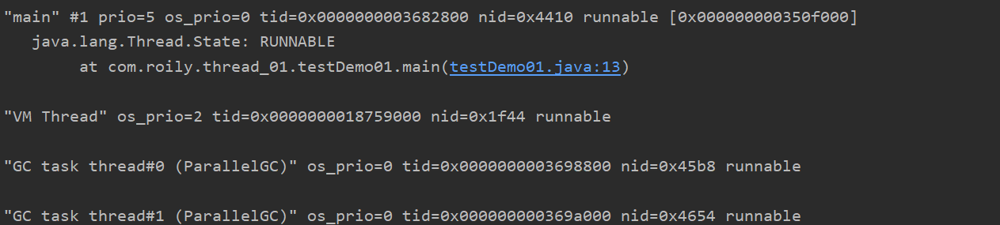
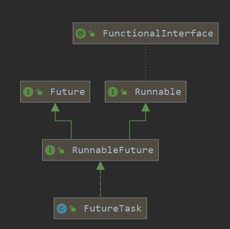
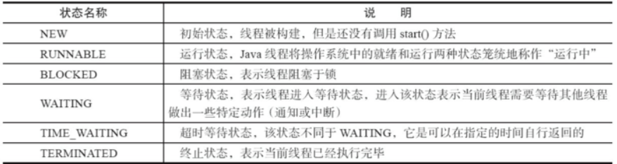
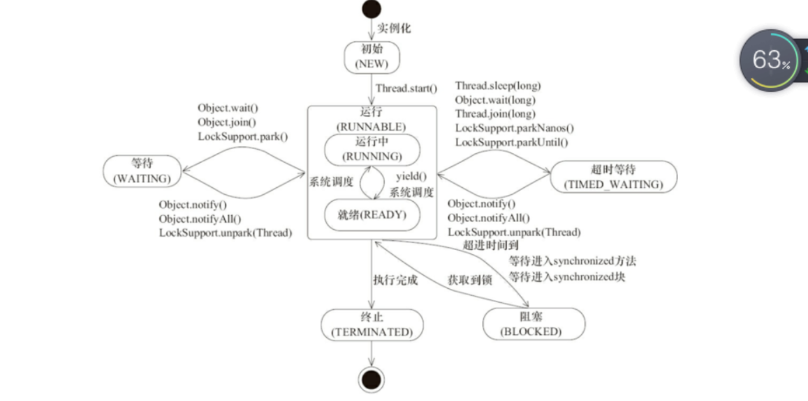

上一章介绍并发编程的相关概念，本文学习创建线程的方法及线程状态相关概念。


> &nbsp;&nbsp;&nbsp;&nbsp;[上一篇并发编程相关概念](<https://juejin.cn/post/7077197608598863902>)&nbsp;&nbsp;&nbsp;&nbsp;←||→&nbsp;&nbsp;&nbsp;&nbsp;[下一篇](<https://juejin.cn/post/7072035040271532045>)<br>


一个java程序从main()方法开始执行，然后按照既定的代码逻辑执行，看似没有其他线程参与，但实际上java程序天生就是一个多线程程序，包含了：1、JVM相关的线程；2、GC相关的线程；3、main线程

可以通过以下命令查看

```bash
jps
jstack  pid
```




### 如何创建线程

- 继承`Thread`类
- 实现`runable`接口
  - 实现`callable`接口
  - `lambda`表达式
  - futureTask

#### 继承Thread类

```java
public class MyThread extends Thread {
    @Override
    public void run() {
        //业务
        for (int i = 0; i < 10; i++) {        System.out.println(Thread.currentThread().getName()+"=>"+i);
        }
    }

}
```

#### 实现Runable接口

```java
public class MybRunable implements Runnable {

    public void run() {
        //业务
        for (int i = 0; i < 10; i++) {
            System.out.println(Thread.currentThread().getName()+"=>"+i);
        }
    }
}
```

#### 实现Callable接口

> `callable`<T>接口是一个泛型接口，可以指定泛型

```java
public class MyCallable implements Callable<String> {

    public String call() throws Exception {
        //业务
        for (int i = 0; i < 10; i++) {
            System.out.println(Thread.currentThread().getName()+"=>"+i);
        }
       return "执行完毕";
    }
}
```

#### 线程执行

```java
public class testStart {

    @Test
    public void testThread() {

        MyThread myThread = new MyThread();
        myThread.start();
    }

    @Test
    public void testRunable() {

        Thread thread = new Thread(new MybRunable());
        thread.start();
    }

    @Test
    public void testCallable() {

        MyCallable myCallable = new MyCallable();
        ExecutorService service = Executors.newFixedThreadPool(3);
        Future<String> submit = service.submit(myCallable);
      	System.out.println(submit);

    }
}
```

#### 其他

> 对于`Runable`接口，还有其他简单实现，比如说使用匿名内部类和`lambda`表达式。

阅读：[外部类、静态内部类、内部类、局部内部类、匿名内部类、`lambda`表达式实现接口]()

`runable`接口属于函数式接口，只需实现一个方法`run()`所以可以使用`lambda`表达式实现接口。

```java
@Test
public void testRunableNoName() {
    new Thread(new Runnable() {
        @Override
        public void run() {
            System.out.println("匿名内部类实现runable接口");
        }
    }).start();
}
@Test
public void testRunableLambda() {
    new Thread(()->{
        System.out.println("lambda表达式实现runable接口");
    }).start();
}
```

> 可以使用`Executor`将`Runable`转成`Callable`执行再交由线程池执行。

```java
@Test
public void testRunToCall() throws ExecutionException, InterruptedException {
    Runnable runnable = () -> System.out.println("lambda");
    Callable<String> callable = Executors.callable(runnable,"result");
    ExecutorService service = Executors.newCachedThreadPool();
    Future<String> submit = service.submit(callable);
    System.out.println(submit.get());
}
```

> 也可以直接将`Runable`交由线程池执行。但需要设置返回值

```java
@Test
public void testRunToPoll() throws ExecutionException, InterruptedException {
    Runnable runnable = () -> System.out.println("lambda");
    ExecutorService service = Executors.newCachedThreadPool();
    Future<String> submit = service.submit(runnable, "result");
    System.out.println(submit.get());
}
```

#### FutureTask

实现callable接口，提交给ExecutorService返回的是异步执行的结果，另外，通常也可以利用FutureTask(Callable<V> callable)将callable进行包装然后FeatureTask提交给ExecutorsService。



相关方法：

`ExecutorService`类：

```java
Future<?> submit(Runnable task);
<T> Future<T> submit(Runnable task, T result);
```

`FutureTask`类:

```java
public FutureTask(Runnable runnable, V result);
public FutureTask(Callable<V> callable);
```

##### 测试

```java
//Runnable设置返回值包装成FutureTask
@Test
public void testFutureTask_() throws ExecutionException, InterruptedException {

    FutureTask futureTask = null;
    futureTask = new FutureTask<String>(new Runnable() {
        public void run() {
            System.out.println(1);
        }
    }, "result");
    ExecutorService service = Executors.newCachedThreadPool();
    Future<?> submit = service.submit(futureTask);
    System.out.println(futureTask.get());
}
//Callable包装成FutureTask
@Test
public void testFutureTask2() throws ExecutionException, InterruptedException {

    FutureTask<String> futureTask = null;
    new Thread(futureTask = new FutureTask<String>(new Callable<String>() {
        public String call() throws Exception {
            return "result";
        }
    })).start();

    Object o = futureTask.get();

    System.out.println(o);
}
```


### 线程状态及操作

#### 线程状态



线程是会在不同的状态间进行转换的，java线程线程转换图如上图所示。

线程创建之后调用start()方法开始运行，当调用wait(),join(),LockSupport.lock()方法线程会进入到**WAITING**状态。

而同样的wait(long timeout)，sleep(long),join(long),LockSupport.parkNanos(),LockSupport.parkUtil()增加了超时等待的功能，也就是调用这些方法后线程会进入**TIMED_WAITING**状态，当超时等待时间到达后，线程会切换到Runable的状态，另外当WAITING和TIMED _WAITING状态时可以通过Object.notify(),Object.notifyAll()方法使线程转换到Runable状态。

当线程出现资源竞争时，即等待获取锁的时候，线程会进入到**BLOCKED**阻塞状态，当线程获取锁时，线程进入到Runable状态。线程运行结束后，线程进入到**TERMINATED**状态，状态转换可以说是线程的生命周期。

如下图总结线程生命周期：




另外需要注意的是：

- 当线程进入到synchronized方法或者synchronized代码块时，线程切换到的是BLOCKED状态，而使用java.util.concurrent.locks下lock进行加锁的时候线程切换的是WAITING或者TIMED_WAITING状态，因为lock会调用LockSupport的方法。

#### 线程操作

##### 线程中断 (interrupted)

调用interrupted()对当前线程进行中断操作，该方法会清除中断标志位。

调用isInterrupted（）来感知其他线程对其自身的中断操作，从而做出响应。

**需要注意的是，当抛出InterruptedException时候，会清除中断标志位，也就是说在调用isInterrupted会返回false。**

```java

//sleepThread睡眠1000ms
Thread sleepThread = new Thread(() -> {
    try {
        Thread.sleep(1000);
    } catch (InterruptedException e) {
        e.printStackTrace();
    }
});

//busyThread一直执行死循环
Thread busyThread = new Thread(() -> {
    while (true) ;
});

sleepThread.start();
busyThread.start();

sleepThread.interrupt();
busyThread.interrupt();

while (sleepThread.isInterrupted()) ;
System.out.println("sleepThread isInterrupted: " + sleepThread.isInterrupted());
System.out.println("busyThread isInterrupted: " + busyThread.isInterrupted());
```

另外，同样可以通过中断的方式实现线程间的简单交互， while (sleepThread.isInterrupted()) 表示在Main中会持续监测sleepThread，一旦sleepThread的中断标志位清零，即sleepThread.isInterrupted()返回为false时才会继续Main线程才会继续往下执行。因此，中断操作可以看做线程间一种简便的交互方式。一般在**结束线程时通过中断标志位的方式可以有机会去清理资源，相对于武断而直接的结束线程，这种方式要优雅和安全。**


##### 加入（join）

如果一个线程实例A执行了threadB.join(),其含义是：当前线程A会等待threadB线程终止后threadA才会继续执行。

关键逻辑是:

```java
 while (isAlive()) {
    wait(0);
 }
```

即如果当前线程(也就是`join`进来的线程),还活着,其他线程就等待，当当前线程执行完毕会`notify()`或`notifyAll()`来唤醒其他线程。

```java
public static void main(String[] args) {
    //之前线程
    Thread previousThread = Thread.currentThread();
    for (int i = 0; i < 10; i++) {
        //当前线程
        MyThread currentThread = new MyThread(previousThread);
        currentThread.start();
        previousThread = currentThread;
    }
    System.out.println(Thread.currentThread().getName()+"执行结束");
}

class MyThread extends Thread {
    //需要Join的线程
    private Thread thread;

    public MyThread(Thread joinThread) {
        this.thread = joinThread;
    }
    @Override
    public void run() {
        try {
            thread.join();
            System.out.println(thread.getName() + "执行");
        } catch (InterruptedException e) {
            e.printStackTrace();
        }
        super.run();
    }
}
```

每一个线程进来都会等待前一个线程执行完毕才会执行当前线程。

##### 睡眠sleep

`sleep()`方法是`Thread`类的本地静态方法。 

```java
public static native void sleep(long millis);
```

会按照给定的时间休眠，需要注意的是如果当前线程获得了锁，==sleep方法并不会失去锁==。

sleep方法经常拿来与Object.wait()方法进行比较，这也是面试经常被问的地方。

- sleep()方法是Thread的静态方法，而wait是Object实例方法

- wait()方法必须要在同步方法或者同步块中调用，也就是必须已经获得对象锁。而sleep()方法没有这个限制可以在任何地方种使用。另外，wait()方法会释放占有的对象锁，使得该线程进入等待池中，等待下一次获取资源。而sleep()方法只是会让出CPU并不会释放掉对象锁；

- sleep()方法在休眠时间达到后如果再次获得CPU时间片就会继续执行，而wait()方法必须等待Object.notift/Object.notifyAll通知后，才会离开等待池，并且再次获得CPU时间片才会继续执行。


##### 礼让yield

public static native void yield();这是一个静态方法，一旦执行，它会是当前线程让出CPU，但是，需要注意的是，让出的CPU并不是代表当前线程不再运行了，如果在下一次竞争中，又获得了CPU时间片当前线程依然会继续运行。另外，让出的时间片只会分配**给当前线程相同优先级**的线程。什么是线程优先级了？下面就来具体聊一聊。

现代操作系统基本采用时分的形式调度运行的线程，操作系统会分出一个个时间片，线程会分配到若干时间片，当前时间片用完后就会发生线程调度，并等待这下次分配。线程分配到的时间多少也就决定了线程使用处理器资源的多少，而线程优先级就是决定线程需要或多或少分配一些处理器资源的线程属性。

在Java程序中，通过一个**整型成员变量Priority**来控制优先级，优先级的范围从1~10.在构建线程的时候可以通过**setPriority(int)**方法进行设置，默认优先级为5，优先级高的线程相较于优先级低的线程优先获得处理器时间片。需要注意的是在不同JVM以及操作系统上，线程规划存在差异，有些操作系统甚至会忽略线程优先级的设定。

另外需要注意的是，sleep()和yield()方法，同样都是当前线程会交出处理器资源，而它们不同的是，sleep()交出来的时间片其他线程都可以去竞争，也就是说都有机会获得当前线程让出的时间片。而yield()方法只允许与当前线程具有相同优先级的线程能够获得释放出来的CPU时间片。

##### 守护线程（daemon）

守护线程是一种特殊的线程，就和它的名字一样，它是系统的守护者，在后台默默地守护一些系统服务，比如垃圾回收线程，JIT线程就可以理解守护线程。与之对应的就是用户线程，用户线程就可以认为是系统的工作线程，它会完成整个系统的业务操作。用户线程完全结束后就意味着整个系统的业务任务全部结束了，因此系统就没有对象需要守护的了，守护线程自然而然就会退。当一个Java应用，只有守护线程的时候，虚拟机就会自然退出。下面以一个简单的例子来表述Daemon线程的使用。

> 虚拟机需要确保用户进程执行完毕
>
> 虚拟机不管守护进程状态（用户进程执行完毕虚拟机该停停）

> 用于后台日志操作，内存监控，垃圾回收

```java
package com.roily.thread_03;

public class Daemon {
    public static void main(String[] args) {
        Thread gad = new Thread(new gad(), "守护线程");
        //设置为守护线程
        gad.setDaemon(true);
        Thread you = new Thread(new you(), "用户线程");

        gad.start();
        you.start();
    }
}
class you implements Runnable{
    @Override
    public void run() {
        for (int i = 0; i < 365; i++) {
            System.out.println("用户线程执行业务");
        }
        System.out.println("用户线程执行结束");
    }
}
class gad implements Runnable{
    @Override
    public void run() {
        while (true){
            System.out.println("守护线程执行任务【监控、日志、gc。。】");
        }
    }
}
```

上面的例子中daemodThread run方法中是一个while死循环，会一直打印,但是当main线程结束后daemonThread就会退出所以不会出现死循环的情况。main线程先睡眠800ms保证daemonThread能够拥有一次时间片的机会，也就是说可以正常执行一次打印“i am alive”操作和一次finally块中"finally block"操作。紧接着main 线程结束后，daemonThread退出，这个时候只打印了"i am alive"并没有打印finnal块中的。因此，这里需要注意的是**守护线程在退出的时候并不会执行finnaly块中的代码，所以将释放资源等操作不要放在finnaly块中执行，这种操作是不安全的**

线程可以通过setDaemon(true)的方法将线程设置为守护线程。并且需要注意的是设置守护线程要先于start()方法，否则会报

> Exception in thread "main" java.lang.IllegalThreadStateException
> 	at java.lang.Thread.setDaemon(Thread.java:1365)
> 	at learn.DaemonDemo.main(DaemonDemo.java:19)

这样的异常，但是该线程还是会执行，只不过会当做正常的用户线程执行。