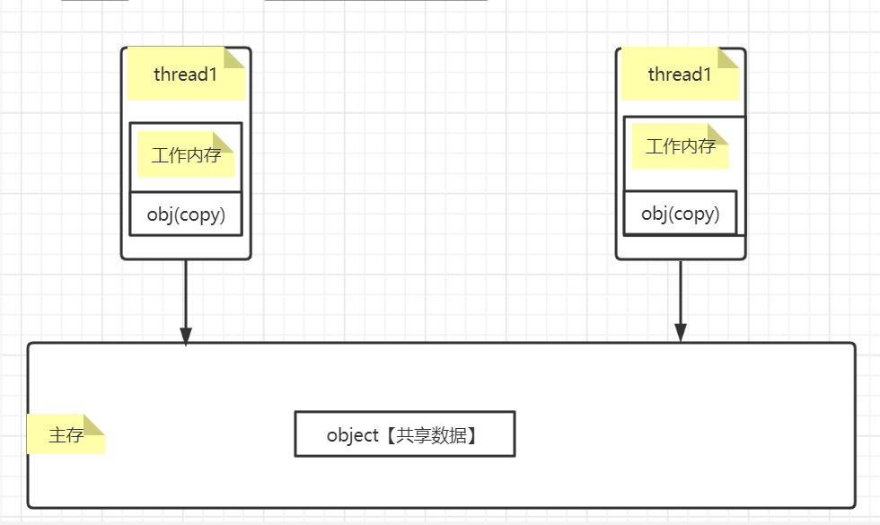

本文学习。多线程出现的原因、java内存模型（JMM（Java Memory Model））、指令重排、sa-if-serial和happens-before规则。


> [上一章]() |||| [下一章]()


#### 为何需要多线程

当下主存的读取速度远远低于CPU的处理速度，因此每个CPU都会有缓存，而每个线程都会拥有CPU分配的工作空间，并且工作空间之间不能进行数据通信。通过多线程进行并发编程可以充分发挥CPU的算力。

<hr/>

#### 线程安全&非线程安全

​	只有多线程情况下才会出现线程安全问题，如果可以获取预期正确结果那么就是线程安全的，否则是非线程安全的。出现线程安全问题一般是由于工作内存和主存数据不一致和重排序造成的。

**当多个线程访问同一个对象时，如果不用考虑这些线程在运行时环境下的调度和交替运行，也不需要进行额外的同步，或者在调用方进行任何其他的协调操作，调用这个对象的行为都可以获取正确的结果，那这个对象是线程安全的。**

<hr/>

#### 哪些数据会出现线程安全问题

在java程序中所有**实例域，静态域和数组元素**都是放在堆内存中（所有线程均可访问到，是可以共享的），而局部变量，方法定义参数和异常处理器参数不会在线程间共享。共享数据会出现线程安全的问题，而非共享数据不会出现线程安全的问题。

<hr/>

#### JMM内存模型

java内存模型是**共享内存的并发模型**

由于CPU和主存处理数据差异，JAVA抽象出来的内存模型如下：

每个线程都有自己的工作空间，当线程读取数据的时候，会先去主存中将共享数据复制一份副本到工作空间中，之后的修改操作都在工作空间中完成，在某个特点的时间点将工作空间中的数据同步到主存中。



线程1和线程2之间要完成通信的话，要经历如下两步：

1. 线程1从主内存中将共享变量读入线程A的工作内存后并进行操作，之后将数据重新写回到主内存中；
2. 线程2从主存中读取最新的共享变量

从横向去看看，线程1和线程2就好像通过共享变量在进行隐式通信。这其中有很有意思的问题，如果线程1更新后数据并没有及时写回到主存，而此时线程B读到的是过期的数据，这就出现了“脏读”现象。可以通过同步机制（控制不同线程间操作发生的相对顺序）来解决或者通过volatile关键字使得每次volatile变量都能够强制刷新到主存，从而对每个线程都是可见的。

<hr/>

#### 重排序

在执行程序时，**为了提高性能，编译器和处理器常常会对指令进行重排序**，这样也就可能会造成程序执行结果不是预期所需的结果。一般重排序可以分为如下三种：

1. 编译器优化的重排序。编译器在不改变单线程程序语义的前提下，可以重新安排语句的执行顺序；
2. 指令级并行的重排序。现代处理器采用了指令级并行技术来将多条指令重叠执行。如果**不存在数据依赖性**，处理器可以改变语句对应机器指令的执行顺序；
3. 内存系统的重排序。由于处理器使用缓存和读/写缓冲区，这使得加载和存储操作看上去可能是在乱序执行的。

针对编译器重排序，JMM的编译器重排序规则会禁止一些特定类型的编译器重排序；

针对处理器重排序，编译器在生成指令序列的时候会通过插入内存屏障指令来禁止某些特殊的处理器重排序。

<hr/>

##### 什么叫数据依赖性

```java
int a = 10;  //A
int b = 5;	 //B
int c = a+b; //C
```

如上：由于A,B之间没有任何关系，对最终结果也不会存在关系，它们之间执行顺序可以重排序，即A和B之间没有数据依赖性。

具体的定义为：**如果两个操作访问同一个变量，且这两个操作有一个为写操作，此时这两个操作就存在数据依赖性**这里就存在三种情况：1. 读后写；2.写后写；3. 写后读，者三种操作都是存在数据依赖性的，如果重排序会对最终执行结果会存在影响。**编译器和处理器在重排序时，会遵守数据依赖性，编译器和处理器不会改变存在数据依赖性关系的两个操作的执行顺序**

也就是JMM对于没有数据依赖性的执行不会约束底层编译器和处理器对指令重排进行优化操作，而对于存在数据依赖性的指令JMM会禁止重排序。

<hr/>

#### 内存可见性

简单理解就是一个线程对于共享数据进行修改时，对其他线程是可见的，也就是其他线程可以感知共享数据的修改，进而进行反应(刷新工作空间)。

<hr/>

#### as-if-serial

保证了单线程程序执行结果的正确性。

as-if-serial语义的意思是：不管怎么重排序（编译器和处理器为了提供并行度），（单线程）程序的执行结果不能被改变。编译器，runtime和处理器都必须遵守as-if-serial语义。

<hr/>

#### happens-before规则

JMM为程序员在上层提供了六条规则，根据规则去推论跨线程的内存可见性问题，而不用再去理解底层重排序的规则。

##### happens-before定义

JSR-133使用happens-before的概念来指定两个操作之间的执行顺序。由于这两个操作可以在一个线程之内，也可以是在不同线程之间。因此，**JMM可以通过happens-before关系向程序员提供跨线程的内存可见性保证**（如果A线程的写操作a与B线程的读操作b之间存在happens-before关系，尽管a操作和b操作在不同的线程中执行，但JMM向程序员保证a操作将对b操作内存可见）。具体的定义为：

1）如果一个操作happens-before另一个操作，那么第一个操作的执行结果将对第二个操作可见，而且第一个操作的执行顺序排在第二个操作之前。

2）两个操作之间存在happens-before关系，并不意味着Java平台的具体实现必须要按照happens-before关系指定的顺序来执行。如果重排序之后的执行结果，与按happens-before关系来执行的结果一致，那么这种重排序并不非法（也就是说，JMM允许这种重排序）。

上面的**1）是JMM对程序员的承诺**。从程序员的角度来说，可以这样理解happens-before关系：如果A happens-before B，那么Java内存模型将向程序员保证——A操作的结果将对B可见，且A的执行顺序排在B之前。注意，这只是Java内存模型向程序员做出的保证！

上面的**2）是JMM对编译器和处理器重排序的约束原则**。正如前面所言，JMM其实是在遵循一个基本原则：只要不改变程序的执行结果（指的是单线程程序和正确同步的多线程程序），编译器和处理器怎么优化都行。JMM这么做的原因是：程序员对于这两个操作是否真的被重排序并不关心，程序员关心的是程序执行时的语义不能被改变（即执行结果不能被改变）。因此，happens-before关系本质上和as-if-serial语义是一回事。

下面来比较一下as-if-serial和happens-before:

> **as-if-serial   VS   happens-before**

1. as-if-serial语义保证单线程内程序的执行结果不被改变，happens-before关系保证正确同步的多线程程序的执行结果不被改变。
2. as-if-serial语义给编写单线程程序的程序员创造了一个幻境：单线程程序是按程序的顺序来执行的。happens-before关系给编写正确同步的多线程程序的程序员创造了一个幻境：正确同步的多线程程序是按happens-before指定的顺序来执行的。
3. as-if-serial语义和happens-before这么做的目的，都是为了在不改变程序执行结果的前提下，尽可能地提高程序执行的并行度。

#####  具体规则

具体的一共有六项规则：

1. 程序顺序规则：一个线程中的每个操作，happens-before于该线程中的任意后续操作。as-if-serial规则（单线程）

2. 监视器锁规则：对一个锁的解锁，happens-before于随后对这个锁的加锁。

   ​		也就是不同的线程获取相同的锁需要等待前一个线程释放锁。

3. volatile变量规则：对一个volatile域的写，happens-before于任意后续对这个volatile域的读。

   ​		对volatile变量执行写操作时，会在写操作后加入一条store屏障指令；

   ​		对其进行读操作时，会在读操作前加入一条load屏障指令。

4. 传递性：如果A happens-before B，且B happens-before C，那么A happens-before C。

5. start()规则：如果线程A执行操作ThreadB.start()（启动线程B），那么A线程的ThreadB.start()操作happens-before于线程B中的任意操作。

6. join()规则：如果线程A执行操作ThreadB.join()并成功返回，那么线程B中的任意操作happens-before于线程A从ThreadB.join()操作成功返回。

7. 程序中断规则：对线程interrupted()方法的调用先行于被中断线程的代码检测到中断时间的发生。

8. 对象finalize规则：一个对象的初始化完成（构造函数执行结束）先行于发生它的finalize()方法的开始。

##### 总结

Happens-Before规则保证的是数据可见性和逻辑顺序执行，但不代表指令重排后的真正执行顺序。

<hr/>

#### JMM设计考虑

- 对于程序员，希望程序符合逻辑思维，需要可靠的强内存模型
- 对于编译器和处理器，他们认为重排序后对于程序执行效率和速度有益，需要弱内存模型

​       JMM对于这两者进行平衡，在不改变程序执行结果的情况下会随意让编译器和处理器进行指令重排，然而对于可能会修改程序执行结果的情况下JMM会禁止这样的指令重排。


http://29.23.26.56:5050/login?next=%2F
lf22nbil/lf22nbilpass