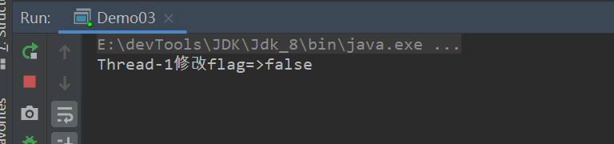
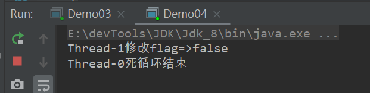

本文学习。volatile关键字。

> [上一章]() |||| [下一章]()


#### volatile简介

​	synchronized是阻塞式同步，在线程竞争激烈的情况下会升级为重量级锁，它保证了内存可见性和操作的原子性。而volatile是java虚拟机提供的最轻量级的同步机制，保证单个变量的读操作的可见性，但不能保证所有操作的原子性。

​	我们知道java内存模型为了发挥CPU的可用性能，将内存拆分为主内存和工作内存，真正操作的是工作内存(也就是CPU缓存)。想要保证线程间内存可见性，就必须①及时的将工作内存修改过的数据及时的写回主内存②并通知其他线程的工作内存重新读取新值到各自的工作内存。那么volatile是如何做的呢？

针对volatile修饰的变量java虚拟机给出了特殊的约定，线程对volatile变量的修改会立刻被其他线程所感知，即不会出现数据脏读的现象，从而保证数据的“可见性”。

<hr>

#### volatile原理

​	前面我们说了想要保证内存可见性，就得及时的将工作内存修改的数据写回主存，并及时通知其他线程重新读取最新数据。synchronized使用线程阻塞的方式实现。而volatile会在写操作时，jvm会添加一条Lock前缀指令，主要做一下两件事情：①及时地将修改的数据写回主存②通知其他线程的工作内存中的该数据标志为无效 ③其他线程感知自己的工作内存数据失效后，会去读取最新的。

​	我们都知道，为了性能优化，JMM在不改变正确语义的前提下，会允许编译器和处理器对指令序列进行重排序，那如果想阻止重排序要怎么办了？答案是可以添加内存屏障。

<hr>

#### volatile的happens-before关系

​	happens-before是jmm对内存可见性的保证。一个线程对volatile变量的写操作，happens-before其他线程对该volatile变量的读操作。也就是写操作对读操作的内存可见性。

<hr>

#### 使用一个例子说明

##### 不使用volatile

```java
public class Demo01 {
    //共享数据
    private static boolean flag = true;
    public static void main(String[] args) throws InterruptedException {
         new Thread(() -> {
            while (flag) {
            }
            System.out.println(Thread.currentThread().getName() + "死循环结束");
        }).start();
        new Thread(() -> {
                Thread.sleep(2000);
                flag = false;
                System.out.println(Thread.currentThread().getName() + "修改flag=>" + flag);
        }).start();
        //保证主线程一直运行，不会强制刷新缓存
        while (true) ;
        //Thread.sleep(Integer.MAX_VALUE);
    }
}
```



这会是一个死循环。

##### 使用volatile

```java
public class Demo01 {
    //共享数据
    private static volatile boolean flag = true;
    public static void main(String[] args) throws InterruptedException {
         new Thread(() -> {
            while (flag) {
            }
            System.out.println(Thread.currentThread().getName() + "死循环结束");
        }).start();
        new Thread(() -> {
                Thread.sleep(2000);
                flag = false;
                System.out.println(Thread.currentThread().getName() + "修改flag=>" + flag);
        }).start();
        //保证主线程一直运行，不会强制刷新缓存
        while (true) ;
        //Thread.sleep(Integer.MAX_VALUE);
    }
}
```

结果：



死循环打开，及时通知线程volatile变量被修改

从结果就可以看出被volatile修饰的变量被修改时就会及时的通知其他线程更新该变量。


