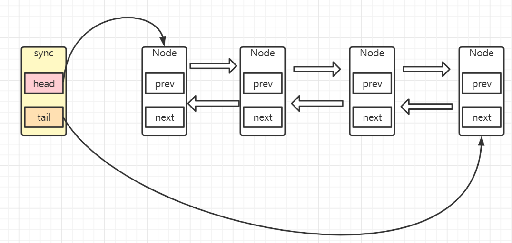
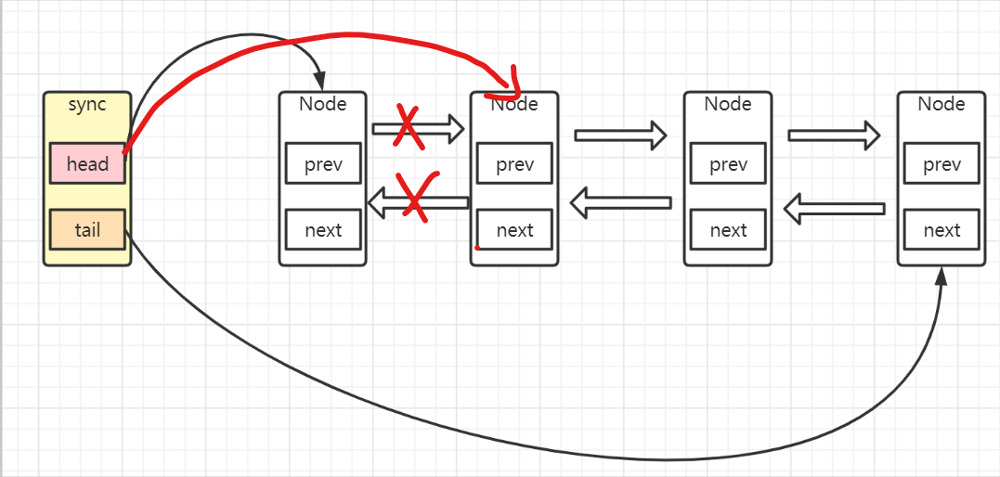

aqs源码解读

> 上一


**独占式锁：**

> void acquire(int arg)：独占式获取同步状态，如果获取失败则插入同步队列进行等待；
> void acquireInterruptibly(int arg)：与acquire方法相同，但在同步队列中进行等待的时候可以检测中断；
> boolean tryAcquireNanos(int arg, long nanosTimeout)：在acquireInterruptibly基础上增加了超时等待功能，在超时时间内没有获得同步状态返回false;
> boolean release(int arg)：释放同步状态，该方法会唤醒在同步队列中的下一个节点


#### 独占锁获取过程

使用ReentrantLock.lock()方式获取锁，以debug方式查看，实际上是调用AQS的**acquire()**方法。获取锁失败就会进入同步队列。

#####  acquire(int arg)方法：

```java
//独占式获取锁，如果获取同步状态成功直接返回。如果获取同步状态失败
①加入同步队列自旋获取同步状态
②自旋过程中可响应中断，中断则跳出自旋。注意中断不会阻止线程继续执行。       
public final void acquire(int arg) {
    if (!tryAcquire(arg) &&
        acquireQueued(addWaiter(Node.EXCLUSIVE), arg))
        selfInterrupt();
}
```

1、如果同步状态获取成功(得到锁),返回true，执行线程

2、获取锁失败调用acquireQueued(addWaiter(Node.EXCLUSIVE), arg))方法。addWaiter方法会将线程封装成一个node节点使用尾插法的方式插入同步队列，addWaiter方法内部调用enq方法实现①尾结点为空时会初始化头结点和尾结点②cas操作失败会不断尝试使用尾插法将当前节点插入同步队列

##### tryAcquire(int arg)方法：

```java
//AQS提供的模板方法   arg = 1
protected boolean tryAcquire(int arg) {
    throw new UnsupportedOperationException();
}
//NonfairSync重写  acquires = 1
protected final boolean tryAcquire(int acquires) {
    return nonfairTryAcquire(acquires);
}

final boolean nonfairTryAcquire(int acquires) {
    //获取当前线程
    final Thread current = Thread.currentThread();
    //获取同步状态  默认为0
    int c = getState();
    //默认值，也就是当前锁未被任何线程占有，当前线程首次尝试获取锁
    if (c == 0) {
        //这是一个cas操作改变同步状态state            old值  0    新值  acquires=1
        if (compareAndSetState(0, acquires)) {
            //如果改变成功当前线程为同步状态的拥有者
            setExclusiveOwnerThread(current);
            return true;
        }
    }
    //如果当前线程已经获取过该锁
    else if (current == getExclusiveOwnerThread()) {
        //支持重入加一
        int nextc = c + acquires;
        if (nextc < 0) // overflow
            throw new Error("Maximum lock count exceeded");
        //更新同步状态
        setState(nextc);
        return true;
    }
    //同步状态已经被获取（锁已经被占有）且不是重入操作，返回false
    return false;
}
```

小结：这个方法分三种情况：

①如果同步状态是首次被获取，通过cas操作来改变同步状态的值。cas成功：设置当前线程为同步状态的拥有者，返回true 。 cas失败：已经有其他线程修改了同步状态，返回false，准备加入同步队列。

②重入式的获取同步状态，同步状态加一，返回true。

③返回false准备加入同步队列操作


<hr>
 ***=================接下来是线程加入同步队列相关操作================***


##### addWaiter()& enq()方法

获取同步状态失败才会调用。

```java
// mode = Node.EXCLUSIVE = null
private Node addWaiter(Node mode) {
    //构建一个新节点
    Node node = new Node(Thread.currentThread(), mode);
    // Try the fast path of enq; backup to full enq on failure
    //引用拷贝，获取同步队列尾结点引用
    Node pred = tail;
    if (pred != null) {
        //尾结点不为空则 尾插法插入当前节点
        node.prev = pred;
        //cas操作将当前节点设置为尾结点
        if (compareAndSetTail(pred, node)) {
            pred.next = node;
            return node;
        }
    }
	//cas失败或头尾节点未初始化调用
    enq(node);
    return node;
}

Node(Thread thread, Node mode) {     // Used by addWaiter
    this.nextWaiter = mode;
    this.thread = thread;
}
```


enq方法

```java
private Node enq(final Node node) {
    //自旋  初始化
    for (;;) {
        Node t = tail;
        //尾结点未初始化，首次获取同步状态
        if (t == null) { // Must initialize
            //CAS操作，初始化头结点   头结点尾结点指向同一个node
            if (compareAndSetHead(new Node()))
                tail = head;
        } else {
			//尾插法插入同步队列。设置当前节点的前驱结点为tail(尾结点)  
            node.prev = t;
            //cas设置当前节点为 尾结点
            if (compareAndSetTail(t, node)) {
                t.next = node;
                return t;
            }
        }
    }
}
```

addwaiter大致分三步：

①将线程包装成node

②如果尾结点(tail)不为空，说明同步队列已经初始化过了，那么使用尾插法插入当前节点

③如果尾结点为空，则调用enq方法，初始化头结点和尾结点,然后以尾插法插入当前节点。


<hr>

 ***=================接下来是线程自旋尝试获取锁相关操作================*** 


##### acquireQueued方法和shouldParkAfterFailedAcquire方法

```java
final boolean acquireQueued(final Node node, int arg) {
    boolean failed = true;
    try {
        boolean interrupted = false;
        //自旋
        for (;;) {
            //获取当前节点的前驱节点
            final Node p = node.predecessor();
            //前驱节点为头结点，且可以获取同步状态（同步状态被释放）//准备出队
            if (p == head && tryAcquire(arg)) {
                //当前节点设置为头结点，Thread和prev设为null  断的前驱节点联系
                setHead(node);
                //断的后驱节点联系
                p.next = null; // help GC
                failed = false;
                //返回false直接获取锁
                return interrupted;
            }
            //如果前驱节点等待状态不是SIGNAL  返回false  自旋直到前驱节点的状态为signal
            if (shouldParkAfterFailedAcquire(p, node) &&
                parkAndCheckInterrupt())
                interrupted = true;
        }
    } finally {
        if (failed)
            cancelAcquire(node);
    }
}
```

①当前节点前驱节点为头结点并可以获取同步状态

②cas操作修改当前节点的前驱节点状态为-1 并 用LockSuport.park()方法阻塞当前节点包装的线程


如果当前节点的前驱节点为头结点并可以获取同步状态，则会进行出队操作，出队逻辑是：

```java
private void setHead(Node node) {
    head = node;
    node.thread = null;
    node.prev = null;
}
//断的后驱节点联系
p.next = null; // help GC
failed = false;
//返回false直接获取锁
return interrupted;
```

原同步队列情况：




出队逻辑执行完后：



shouldParkAfterFailedAcquire方法

```java
private static boolean shouldParkAfterFailedAcquire(Node pred, Node node) {
    //获取前驱节点等待状态
    int ws = pred.waitStatus;
    //如果为-1直接返回
    if (ws == Node.SIGNAL)
        /*
         * This node has already set status asking a release
         * to signal it, so it can safely park.
         */
        return true;
    if (ws > 0) {
        /*
         * Predecessor was cancelled. Skip over predecessors and
         * indicate retry.
         */
        //找到等待状态小于0的前驱节点
        do {
            node.prev = pred = pred.prev;
        } while (pred.waitStatus > 0);
        //断开中间等待状态大于0的前驱结点
        pred.next = node;
    } else {
        /*
         * waitStatus must be 0 or PROPAGATE.  Indicate that we
         * need a signal, but don't park yet.  Caller will need to
         * retry to make sure it cannot acquire before parking.
         */
        //否则 等于0  小于-1(PROPAGATE-3)   cas设置前驱结点等待状态为-1
        compareAndSetWaitStatus(pred, ws, Node.SIGNAL);
    }
    return false;
}
```

①当前节点前驱节点状态为-1时，返回true

②当前节点前驱节点大于0(CANCELLED)也就是线程被取消。向前遍历找到节点状态<=0的节点，过滤中间节点状态大于0的线程。

③CAS修改前驱节点的状态为-1


```java
private final boolean parkAndCheckInterrupt() {
    LockSupport.park(this);
    return Thread.interrupted();
}
```

小结：

acquireQueued方法是一个自旋逻辑，如果当前节点的前驱节点为头节点（head）并且可以获取同步状态，那么会执行出队操作并跳出自旋，获取同步状态(得到锁)。否则会阻塞等待其他线程释放锁。shouldParkAfterFailedAcquire(p, node) 方法：①剔除当前节点的前驱节点等待状态(wautStatus)大于0(CANCELLED  1)的节点 ②不断尝试将前驱节点状态修改为-1③使用lockSuport中断线程


<hr>


#### 独占锁释放过程

##### release&tryRelease方法

从unlock()  开始点

```java
public final boolean release(int arg) {
    if (tryRelease(arg)) {
        Node h = head;
        if (h != null && h.waitStatus != 0)
            unparkSuccessor(h);
        return true;
    }
    return false;
}
```

①同步队列状态为0返回true，②头结点不为空状态不为0               才会执行unparkSuccessor()方法。

```java
protected final boolean tryRelease(int releases) {
    int c = getState() - releases;
    if (Thread.currentThread() != getExclusiveOwnerThread())
        throw new IllegalMonitorStateException();
    boolean free = false;
    if (c == 0) {
        free = true;
        setExclusiveOwnerThread(null);
    }
    setState(c);
    return free;
}
```

当前节点内的线程是同步状态的拥有者，状态值减一，当同步队列状态为0时，同步状态拥有者赋为null，返回true。

#####  unparkSuccessor

```java
private void unparkSuccessor(Node node) {
    /*
     * If status is negative (i.e., possibly needing signal) try
     * to clear in anticipation of signalling.  It is OK if this
     * fails or if status is changed by waiting thread.
     */
    //获取当前节点的等待状态
    int ws = node.waitStatus;
    //等待状态小于0，设置等待状态为0
    if (ws < 0)
        compareAndSetWaitStatus(node, ws, 0);

    /*
     * Thread to unpark is held in successor, which is normally
     * just the next node.  But if cancelled or apparently null,
     * traverse backwards from tail to find the actual
     * non-cancelled successor.
     */
    //获取当前节点的后驱节点
    Node s = node.next;
    //如果当前节点后驱节点为空或状态大于0（即被中断）时从尾节点开始遍历得到当前节点最近后驱节点
    if (s == null || s.waitStatus > 0) {
        s = null;
        for (Node t = tail; t != null && t != node; t = t.prev)
            if (t.waitStatus <= 0)
                s = t;
    }
    //当前节点不为空，且状态小于0  唤醒该节点包装线程
    if (s != null)
        LockSupport.unpark(s.thread);
}
```


首先获取头节点的后继节点，当后继节点不为空的时候会调用LookSupport.unpark()方法，该方法会唤醒该节点的后继节点所包装的线程。因此，**每一次锁释放后就会唤醒队列中该节点的后继节点所引用的线程，从而进一步可以佐证获得锁的过程是一个FIFO（先进先出）的过程。**

独享式锁获取释放总结：

①获取锁成功，即tryAquire返回true

②获取锁失败，即tryAquire返回false

1. **线程获取锁失败，线程被封装成Node进行入队操作，核心方法在于addWaiter()和enq()，同时enq()完成对同步队列的头结点初始化工作以及CAS操作失败的重试**;
2. **线程获取锁是一个自旋的过程，当且仅当 当前节点的前驱节点是头结点并且成功获得同步状态时，节点出队即该节点引用的线程获得锁，否则，当不满足条件时就会调用LookSupport.park()方法使得线程阻塞**；
3. **释放锁的时候会唤醒后继节点；**

总体来说：**在获取同步状态时，AQS维护一个同步队列，获取同步状态失败的线程会加入到队列中进行自旋；移除队列（或停止自旋）的条件是前驱节点是头结点并且成功获得了同步状态。在释放同步状态时，同步器会调用unparkSuccessor()方法唤醒后继节点。**


<hr>


#### 可中断式获取锁

如果没有被中断的话和lock没区别，也会加入同步队列也会自旋检测自己有没有获取同步状态。

只不过可中断式锁可以响应中断而抛出异常。

```java
public final void acquireInterruptibly(int arg)
        throws InterruptedException {
    //如果当前线程被中断，抛出中断异常
    if (Thread.interrupted())
        throw new InterruptedException();
    if (!tryAcquire(arg))
      	//获取锁失败
        doAcquireInterruptibly(arg);
}
```

```java
private void doAcquireInterruptibly(int arg)
    throws InterruptedException {
    //线程包装成node，加入同步队列
    final Node node = addWaiter(Node.EXCLUSIVE);
    boolean failed = true;
    try {
        //自旋
        for (;;) {
            final Node p = node.predecessor();
            if (p == head && tryAcquire(arg)) {
                setHead(node);
                p.next = null; // help GC
                failed = false;
                return;
            }
            if (shouldParkAfterFailedAcquire(p, node) &&
                parkAndCheckInterrupt())
                //线程被中断抛出中断异常
                throw new InterruptedException();
        }
    } finally {
        if (failed)
            cancelAcquire(node);
    }
}
```

和acquireQueued差不多，只不过线程被中断 parkAndCheckInterrupt()会返回true抛出中断异常。

并且会调用cancelAcquire方法来将抛出中断异常的节点状态设为1。

```java
private void cancelAcquire(Node node) {
    // Ignore if node doesn't exist
    if (node == null)
        return;

    node.thread = null;

    // Skip cancelled predecessors
    //忽略配取消的前驱节点
    Node pred = node.prev;
    while (pred.waitStatus > 0)
        node.prev = pred = pred.prev;

    // predNext is the apparent node to unsplice. CASes below will
    // fail if not, in which case, we lost race vs another cancel
    // or signal, so no further action is necessary.
    //
    Node predNext = pred.next;

    // Can use unconditional write instead of CAS here.
    // After this atomic step, other Nodes can skip past us.
    // Before, we are free of interference from other threads.
    //将node节点状态设置为  1
    node.waitStatus = Node.CANCELLED;

    // If we are the tail, remove ourselves.
    if (node == tail && compareAndSetTail(node, pred)) {
        compareAndSetNext(pred, predNext, null);
    } else {
        // If successor needs signal, try to set pred's next-link
        // so it will get one. Otherwise wake it up to propagate.
        int ws;
        if (pred != head &&
            ((ws = pred.waitStatus) == Node.SIGNAL ||
             (ws <= 0 && compareAndSetWaitStatus(pred, ws, Node.SIGNAL))) &&
            pred.thread != null) {
            Node next = node.next;
            if (next != null && next.waitStatus <= 0)
                compareAndSetNext(pred, predNext, next);
        } else {
            unparkSuccessor(node);
        }

        node.next = node; // help GC
    }
}
```


<hr>


#### 立刻  tryLock()

```java
//tryAcquire就是调用此方法返回是否获取锁的
final boolean nonfairTryAcquire(int acquires) {
    final Thread current = Thread.currentThread();
    int c = getState();
    if (c == 0) {
        if (compareAndSetState(0, acquires)) {
            setExclusiveOwnerThread(current);
            return true;
        }
    }
    else if (current == getExclusiveOwnerThread()) {
        int nextc = c + acquires;
        if (nextc < 0) // overflow
            throw new Error("Maximum lock count exceeded");
        setState(nextc);
        return true;
    }
    return false;
}
```


#### 超时等待锁

tryAcquireNanos

```java
public final boolean tryAcquireNanos(int arg, long nanosTimeout)
        throws InterruptedException {
    if (Thread.interrupted())
        throw new InterruptedException();
    return tryAcquire(arg) ||
        doAcquireNanos(arg, nanosTimeout);
}
```

首先尝试使用普通方式获取锁，可以获取到直接返回true。


```java
private boolean doAcquireNanos(int arg, long nanosTimeout)
        throws InterruptedException {
    //时间大于0
    if (nanosTimeout <= 0L)
        return false;
    //死去时间
    final long deadline = System.nanoTime() + nanosTimeout;
    //将线程封装成node放入同步队列
    final Node node = addWaiter(Node.EXCLUSIVE);
    boolean failed = true;
    try {
        //自旋
        for (;;) {
            final Node p = node.predecessor();
            if (p == head && tryAcquire(arg)) {
                setHead(node);
                p.next = null; // help GC
                failed = false;
                return true;
            }
            //计算超时时间 
            nanosTimeout = deadline - System.nanoTime();
            //时间到了返回false
            if (nanosTimeout <= 0L)
                return false;
            //时间没到，阻塞
            if (shouldParkAfterFailedAcquire(p, node) &&
                nanosTimeout > spinForTimeoutThreshold)
                LockSupport.parkNanos(this, nanosTimeout);
            //同时也可响应中断
            if (Thread.interrupted())
                throw new InterruptedException();
        }
    } finally {
        if (failed)
            //抛出异常或超时，都会设置当前节点状态为1
            cancelAcquire(node);
    }
}
```

这个锁，可以①设置超时时间，超时时间内自旋尝试获取同步状态②可响应中断


**共享式锁：**

> void acquireShared(int arg)：共享式获取同步状态，与独占式的区别在于同一时刻有多个线程获取同步状态；
> void acquireSharedInterruptibly(int arg)：在acquireShared方法基础上增加了能响应中断的功能；
> boolean tryAcquireSharedNanos(int arg, long nanosTimeout)：在acquireSharedInterruptibly基础上增加了超时等待的功能；
> boolean releaseShared(int arg)：共享式释放同步状态

#### 共享式锁获取

acquireShared

```java
public final void acquireShared(int arg) {
    //尝试获取共享式锁，成功则返回，失败则doAcquireShared（）
    if (tryAcquireShared(arg) < 0)
        doAcquireShared(arg);
}
```

如果获取同步状态成功则doAcquireShared(arg);

```java
private void doAcquireShared(int arg) {
    //添加到同步队列
    final Node node = addWaiter(Node.SHARED);
    boolean failed = true;
    try {
        boolean interrupted = false;
        for (;;) {
            //获取当前节点的前驱节点
            final Node p = node.predecessor();
            if (p == head) {
                //如果前驱结点为头结点，且可以获取同步状态
                int r = tryAcquireShared(arg);
                if (r >= 0) {
                    //设置当前节点为头节点
                    setHeadAndPropagate(node, r);
                    //断开
                    p.next = null; // help GC
                    if (interrupted)
                        selfInterrupt();
                    failed = false;
                    //跳出自旋
                    return;
                }
            }
            if (shouldParkAfterFailedAcquire(p, node) &&
                parkAndCheckInterrupt())
                interrupted = true;
        }
    } finally {
        if (failed)
            cancelAcquire(node);
    }
}
```

逻辑几乎和独占式锁的获取一模一样，这里的自旋过程中能够退出的条件**是当前节点的前驱节点是头结点并且tryAcquireShared(arg)返回值大于等于0即能成功获得同步状态**。