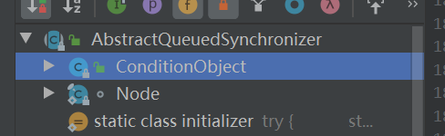
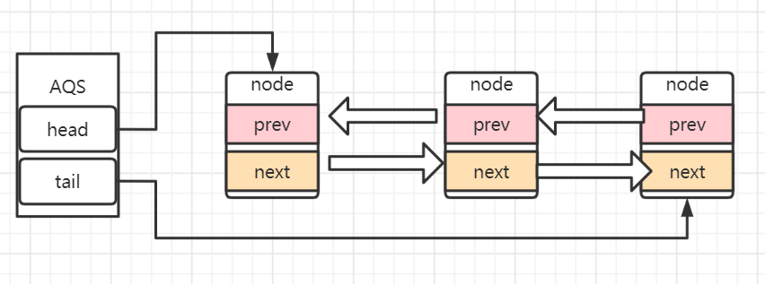
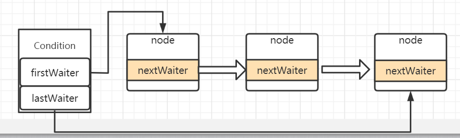

本文学习AbstractQueuedSynchronizer（AQS）

> 上一章


之前我们学习使用Lock进行线程通信，我们说过lock是语言级别的也就是供程序员使用的，不像synchronized接触底层，使用对象监视器(monitor、monitorenter和moniterexit)来实现线程同步。原因就是AbstractQueuedSynchronizer(AQS)同步器它作为同步组件(lock)的中介替代了我们与底层打交道。

<hr>


#### 同步器简介

同步器是用来构建锁和其他同步组件的基础框架，它的实现主要依赖一个int成员变量来表示同步状态以及通过一个FIFO队列构成等待队列。它的**子类必须重写AQS的几个protected修饰的用来改变同步状态的方法**，其他方法主要是实现了排队和阻塞机制。**状态的更新使用getState,setState以及compareAndSetState这三个方法**。

同步器的子类被**推荐定义为自定义同步组件的静态内部类**，同步器自身没有实现任何同步接口，它仅仅是定义了若干同步状态的获取和释放方法来供自定义同步组件的使用，同步器既支持独占式获取同步状态，也可以支持共享式获取同步状态，这样就可以方便的实现不同类型的同步组件。

同步器是实现锁（也可以是任意同步组件）的关键，在锁的实现中聚合同步器，利用同步器实现锁的语义。可以这样理解二者的关系：**锁是面向使用者，它定义了使用者与锁交互的接口，隐藏了实现细节；同步器是面向锁的实现者，它简化了锁的实现方式，屏蔽了同步状态的管理，线程的排队，等待和唤醒等底层操作**。锁和同步器很好的隔离了使用者和实现者所需关注的领域。


<hr>


#### 查看AQS类结构




- ConditionObject为即将与lock绑定的通知组件，用于线程等待和唤醒

- node为同步队列的节点类，保存着节点的信息
- 其他控制线程状态的方法

<hr>


#### Node-Api

> volatile int waitStatus //节点状态
> volatile Node prev //当前节点/线程的前驱节点
> volatile Node next; //当前节点/线程的后继节点
> volatile Thread thread;//加入同步队列的线程引用
> Node nextWaiter;//等待队列中的下一个节点

- int CANCELLED =  1

  > 由于超时或中断，节点从同步队列中取消。节点一旦被取消了就不会再改变状态。特别是，取消节点的线程不会再阻塞。

- int SIGNAL    = -1

  > 后继节点的线程处于等待状态，如果当前节点释放同步状态会通知后继节点，使得后继节点的线程能够运行；

- int CONDITION = -2

  > 当前节点进入等待队列中
  >

- int PROPAGATE = -3

  > 表示下一次共享式同步状态获取将会无条件传播下去


- int INITIAL = 0;

  >初始状态


#### 同步队列

当共享资源被某个线程占有，其他请求该资源的线程将会阻塞，从而进入同步队列。AQS中的同步队列是**通过链式方式**进行实现。

**同步队列是一个双向队列，AQS通过持有头尾指针管理同步队列**；

AQS中的两个重要属性：

```java
private transient volatile Node head;//同步队列的头结点尾结点指针。
private transient volatile Node tail;
private volatile int state;//同步状态
```




#### 等待队列

```java
Node nextWaiter
```

在AQS的Node中有一个netWaiter属性，即每一个节点都会记录当前节点的下一个等待节点。

```java
/** First node of condition queue. */
private transient Node firstWaiter;
/** Last node of condition queue. */
private transient Node lastWaiter;
```

且Condition有着该等待队列（或条件队列）的首个和最后一个节点的引用。




