本文讲述`String`、`StringBuffer`和`StringBuilder`区别，以及`String`的不可变性。

> [源码]()
>
> [上一章]()  || [下一章]()


#### String类

基本：

​	`String`类底层是使用字符数组的形式保存字符串,字符数组的引用`value`被`final`修饰

​	重写了`equals()`和`hashCode()`方法==(重写`equals()`一定重写`hashCode()`)==

##### 说明：

###### 变量被`final`修饰会怎样？

1、`final`修饰基本数据类型

作为局部变量：

```java
public  void test() {
    final int i = 10;
    i = 20;
}
```


> `final`修饰基本类型，其值不可变。

作为成员变量：

```java
public class FinalDescripteBaseType {
    final int i = 5;
    
    public static void main(String[] args) {
        FinalDescripteBaseType finalDescripteBaseType = new FinalDescripteBaseType();
        finalDescripteBaseType.i = 10;
    }
}
```

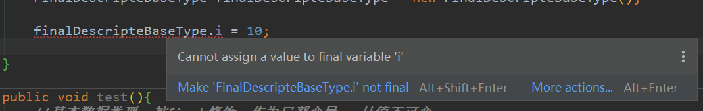

> 也是一样其值不可变


2、`final`修饰引用数据类型

作为成员变量：

```java
public class FinalDescripteQuoteType {
    
    //作为成员变量
    final User user = User.builder().userName("defaultName").age(20).birthDay(new Date()).build();
    
    public static void main(String[] args) {
        FinalDescripteQuoteType finalDescripteQuoteType = new FinalDescripteQuoteType();
        finalDescripteQuoteType.user = null;
    }
    
}
```

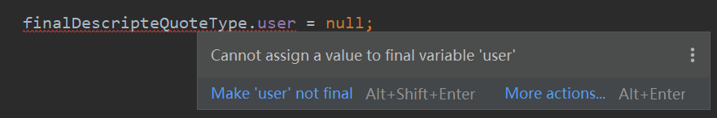

> 作为引用类型，所引用的内存地址不变。

简单内存图：

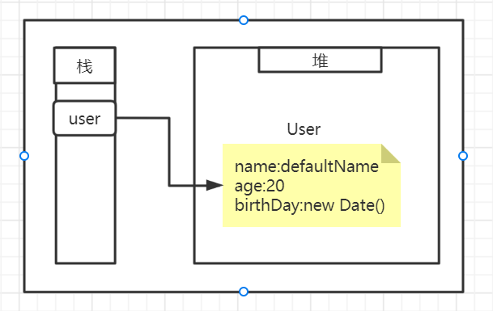

> 对象真正存储的位置是堆内存，栈内存只存储了，该对象的引用（内存地址。）
>
> 也就是说  栈(stack)内存中的`user`引用的值不可变，但是堆内存中的对象是可变的。

测试：

```java
public class FinalDescripteQuoteType {
    //作为成员变量
    final User user = User.builder().userName("defaultName").age(20).birthDay(new Date()).build();

    public static void main(String[] args) {

        FinalDescripteQuoteType finalDescripteQuoteType = new FinalDescripteQuoteType();
        System.out.println(finalDescripteQuoteType.user);
        finalDescripteQuoteType.user.setAge(1000);
        System.out.println(finalDescripteQuoteType.user);
        
    }
```

结果：

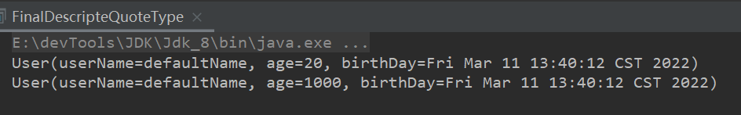

引用类型作为局部变量也是一样的。


####### 总结

> 被`final`修饰的变量其值不可变。
>
> 对于基本数据类，因为基本数据类型只有数值，所以我们说他不可变。
>
> 对于引用数据类型，其引用地址不可变，也就是引用不能指向其他的对象，但是它所指向的对象是可以改变的。


###### 为什么重写`equals()`一定要重写`hashCode()`方法

> 首先`equals()和hashCode()`方法属于`Object`类，所有类都可以重写实现它们。
>
> 只有引用数据类型才可以调用方法

`hashCode()`和`equals()`方法都是用于判断对象是否相等的。

`hashCode()`被`native`修饰表明他是一个本地方法，也就是是使用`C|C++`写的，执行效率高，可以通过哈希表快速检索出对象的内存地址最后返回哈希值来唯一标识对象的内存地址，只不过会出现哈希碰撞，所以还是需要`equals()`在进行过滤。

而`equals()`是`java`的普通方法，`object`中`equals()`实现的底层原理还是通过`==`号判断的。

结论：

​	通过`equals()`判断返回`true`我们就认为这两个对象相等，那么他们的`hashCode`值一定也相等，如果不重写`hashCode()`方法，那么他就会去找其父类的`hashCode()`方法。


##### String类不可变性的原因

##### 案列测试

1、被`final`修饰的引用类型的属性可以修改。

提供修改接口。

```java
public class FatherEntity {
    //被final修饰的属性
    final  StringBuffer stringBuffer;

    public FatherEntity(StringBuffer sb) {
        this.stringBuffer = sb;
    }
    //提供修改方法
    public void modifySb(String append){
        stringBuffer.append(append);
    }
}
```

测试：

```java
@Test
public void test1(){
    FatherEntity fatherEntity = new FatherEntity(new StringBuffer("123"));
    System.out.println("1.=>"+fatherEntity.toString());
    System.out.println("修改");
    fatherEntity.modifySb("abc");
    System.out.println("2.=>"+fatherEntity.toString());
}
```

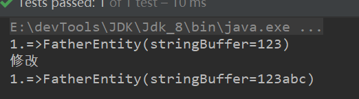

2、尝试使用反射改变被`final`修饰的属性

从上面可以看出，想要修改被`final`修饰的字段，需要获取引用通过引用改变堆内存中的对象。但是反射好像更强大，似乎修改了内存地址。

```java
@Test
public void test2(){

    FatherEntity fatherEntity = new FatherEntity(new StringBuffer("123"));
    System.out.println(fatherEntity.toString());
    System.out.println(fatherEntity.stringBuffer.hashCode());
    try {
        Field sbField = fatherEntity.getClass().getDeclaredField("stringBuffer");
        sbField.setAccessible(true);
        StringBuffer stringBuffer = new StringBuffer("aaaaa");

        sbField.set(fatherEntity,stringBuffer);

    } catch (NoSuchFieldException e) {
        e.printStackTrace();
    } catch (IllegalAccessException e) {
        e.printStackTrace();
    }
    System.out.println(fatherEntity.toString());
    System.out.println(fatherEntity.stringBuffer.hashCode());
}
```

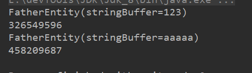

> 第一个例子给出的`hash`值是相等的。


3、子类破坏父类`final`修饰的属性

子类拥有父类对象所有的属性和方法（包括私有属性和私有方法），但是父类中的私有属性和方法子类是无法访问，**只是拥有**。

子类可以访问父类的非私有属性。

父类：

```java
public class FatherEntity {
    //被final修饰的属性
    final  StringBuffer stringBuffer;
    
    public FatherEntity(StringBuffer sb) {
        this.stringBuffer = sb;
    }
}
```

子类：

父类构造方法默认在子类的构造方法的第一句代码。

也就是创建子类的实例时首先创建了父类实例，且拿到的`final`属性的引用指向同一块内存空间，也就是子类拿到了父类的`fianl`属性的引用。

所以即便父类未提供修改`final`属性的方法和接口，但是子类提供的话也可以修改父类`final`属性。

```java
public class SonEntity extends FatherEntity {
    
    public SonEntity(StringBuffer sb) {
        super(sb);
        sb.append("子类append");
    }

    @Override
    public String toString() {
        return "SonEntity{" +
                "stringBuffer=" + stringBuffer +
                '}';
    }
}
```

```java
@Test
public void test02(){

    SonEntity sonEntity = new SonEntity(new StringBuffer("123"));

    System.out.println(sonEntity.stringBuffer);
    
    System.out.println(sonEntity.toString());

}
```

结果：

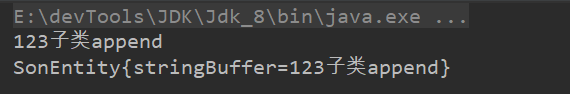


##### 解释说明

> 那我们平时所做的对`str`赋值是为什么？

比如：

```java
@Test
public void test01() {
    String str1 = "abc";
    System.out.println(str1);
    str1 = "123";
    System.out.println(str1);
}
```

结果： `abc`     `123`

值是改变的。

尝试打印`hash`值。

```java
String str1 = "abc";
System.out.println("str修改前哈希值==>"+str1.hashCode()+"|||"+str1);
str1 = "123";
System.out.println("str修改后哈希值==>"+str1.hashCode()+"|||"+str1);
```

结果：

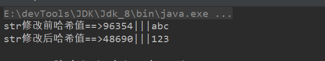

哈希值不同也就是我们改变了`str1`的引用地址。

当我们做为`String`类型赋值时，内存分析：

```java
//1、堆内存创建`abc`字符串对象，将引用给`str1`
String str1 = "abc";
//2、创建`123`字符串对象，将引用给`str1`
str1 = "123";
```

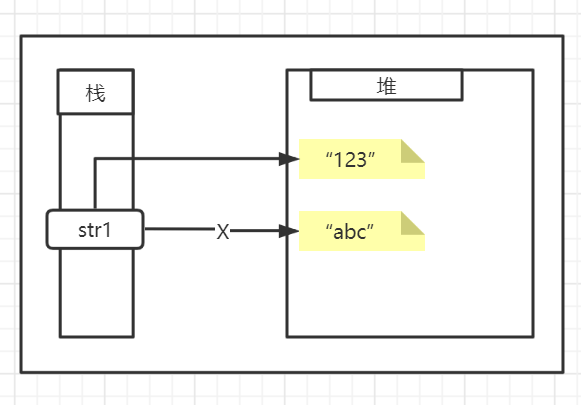

> `string`作为参数传递，在方法内修改他的值。

```java
@Test
public void test02(){

    String str = "abc";
    modifyStr(str);
    System.out.println("str结果");
    System.out.println("str值=>"+str+"||||"+"str哈希值=>"+str.hashCode());

}
public void modifyStr(String str){
    str = "123";
    System.out.println("在方法内修改str");
    System.out.println("str值=>"+str+"||||"+"str哈希值=>"+str.hashCode());
}
```

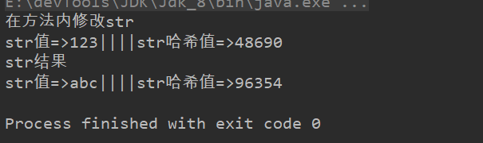

> 这里有[java只有值传递]()的相关知识。这里不做说明，对比`StringBuilder`

```java
@Test
public void test03(){

    StringBuilder stringBuilder = new StringBuilder("abc");

    modifySb(stringBuilder);

    System.out.println("str结果");
    System.out.println("str值=>"+stringBuilder.toString()+"||||"+"str哈希值=>"+stringBuilder.hashCode());

}

public void modifySb(StringBuilder sb){

    sb.append("123");
    System.out.println("在方法内修改sb");
    System.out.println("str值=>"+sb.toString()+"||||"+"str哈希值=>"+sb.hashCode());
}
```

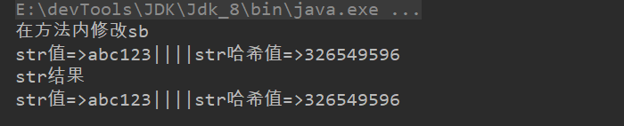


#### 总结

1、`String`类被`final`修饰，没有任何类可以继承它，也就是没有子类破坏他的不可变性。

2、`String`底层是以字符数组`Value`来存储数据，字符数组被`private`修饰，也就是`value`属性私有，外部类无法访问和修改

3、`value`被`final`修饰，引用地址不可变。

4、`String`类内部未提供任何方法去修改它。