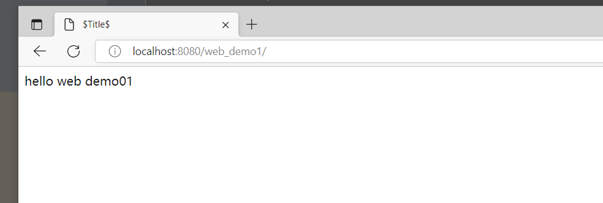
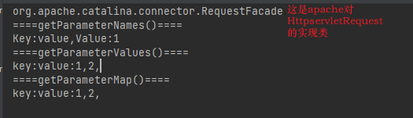
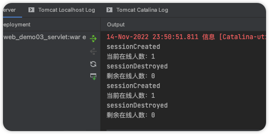
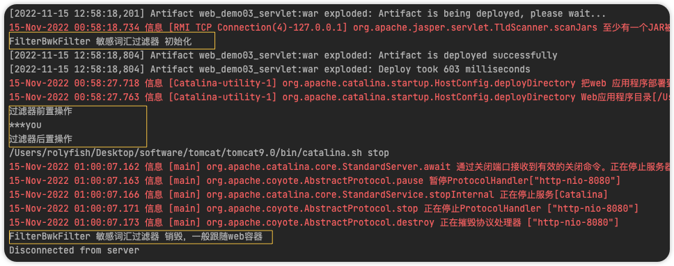

## WEB


### 基础

#### Tomcat下载


- 地址

[Tomcat下载地址](https://tomcat.apache.org/download-10.cgi)


- 解压

- 进入bin目录

..\apache-tomcat-10.0.27-windows-x64\apache-tomcat-10.0.27\bin

windows系统直接双击 startup.bat文件即可

mac系统进入目录命令行输入 sudo .\startup.sh

- 乱码问题

> 此刻windows系统控制台可能存在乱码问题。
>
> 问题在于tomcat日志输出到cmd默认是utf-8格式，而cmd默认编码集是GBK的。
>
> 解决：只需要修改日志配置即可，进入logging.properties,按如下将utf-8 ---->  GBK


- 验证

> 启动完成后，cmd


> tomcat默认地址和端口为
>
> localhost(127.0.1)  端口为8080


#### tomcat运行web程序

> web程序需要在服务器上才可以运行，tomcat就是一个免费且性能不错的服务器，那么我们如何将web程序放在服务器上运行呢？

##### 如何创建web项目

> 这里编译器选择idea，使用maven构建项目，有两种方式。

###### 方式一：

- 首先创建模块

  > 首先创建一个空的maven模块，或创建一个空的maven项目


- 添加web支持

> 此刻这个maven项目是一个空的maven项目，想要让其变为web项目，需要添加web支持

右击项目 ---> 点击 Add Franework Support ---> 勾选web即可

此刻就会多出来如下红色方框内的文件：

- index.jsp     网站首页
- web.xml       web项目的配置文件


- 配置

**修改打包方式并引入插件**

指定web.xml   资源文件路径   resource打包

```xml
<?xml version="1.0" encoding="UTF-8"?>
<project xmlns="http://maven.apache.org/POM/4.0.0"
         xmlns:xsi="http://www.w3.org/2001/XMLSchema-instance"
         xsi:schemaLocation="http://maven.apache.org/POM/4.0.0 http://maven.apache.org/xsd/maven-4.0.0.xsd">
    <modelVersion>4.0.0</modelVersion>

    <groupId>com.roily</groupId>
    <artifactId>web_demo01</artifactId>
    <version>1.0-SNAPSHOT</version>

    <!--  修改打包方式  -->
    <packaging>war</packaging>

    <properties>
        <maven.compiler.source>8</maven.compiler.source>
        <maven.compiler.target>8</maven.compiler.target>
    </properties>

    <build>
        <!--    打包后的war包名称    -->
        <finalName>web_demo1</finalName>
        <plugins>
            <!--     引入插件，以及及配置打包资源文件       -->
            <plugin>
                <groupId>org.apache.maven.plugins</groupId>
                <artifactId>maven-war-plugin</artifactId>
                <version>3.0.0</version>
                <configuration>
                    <webXml>web/WEB-INF/web.xml</webXml>
                    <warSourceDirectory>web</warSourceDirectory>
                </configuration>
            </plugin>
        </plugins>
        <resources>
            <resource>
                <directory>src/main/java</directory>
                <includes>
                    <include>**/*.properties</include>
                    <include>**/*.xml</include>
                </includes>
                <filtering>false</filtering>
            </resource>
            <resource>
                <directory>src/main/resources</directory>
                <includes>
                    <include>**/*.properties</include>
                    <include>**/*.xml</include>
                </includes>
                <filtering>false</filtering>
            </resource>
        </resources>
    </build>
</project>
```


**配置一下Artifacts**

> 路径的配置只是为了输出到指定目录


- 打包

> 点击package


- 放入tomcat运行

> 将war包放入tomcat ，执行startup.bat ，会自动解压成同名的文件夹。访问https:localhost:8080/项目名。




###### 方式二：

> maven为我们呢提供创建web项目的模板，我们只需选择对应模板就行。

- 选择web项目模板,

  > 填写好基本信息，会为我们生成基础的pom  web.xml  和一个index.jsp


- 直接打吧即可


- 运行


#### idea集成tomcat

> idea可集成tomcat，无需将项目打包然后再运行，而是一键启动式运行。

##### 配置

> 简单配置即可运行，web程序我们使用以上两个现成的即可。


##### 运行

> 如上配置即可点击启动按钮，即可启动web项目。

启动完成后可在，tomcat webapps下看见demo01文件夹


##### 乱码

> 可能会存在乱码问题，一样的道理，日志是tomcat输出到idea控制台的，输出的什么格式，idea控制台设置的什么格式？


#### http

[维基百科，http](https://wiki.mbalib.com/wiki/HTTP)、[百度百科，http](https://baike.baidu.com/item/http/243074)

> HTTP协议（Hypertext Transfer Protocol，超文本传输协议）是用于从[WWW服务器](https://wiki.mbalib.com/wiki/WWW服务器)传输超文本到本地[浏览器](https://wiki.mbalib.com/wiki/浏览器)的[传送协议](https://wiki.mbalib.com/wiki/传送协议)。它可以使浏览器更加高效，使网络传输减少。

- 超文本？

文本是什么？html、字符串。 超文本：视频、图片、其他复杂信息。

- 端口

默认80端口，80端口可以忽略不写

- url

我们在浏览器的地址栏里输入的网站地址叫做[URL](https://wiki.mbalib.com/wiki/URL)(UniformResourceLocator，统一资源定位符)。就像每家每户都有一个门牌地址一样，每个网页也都有一个Internet地址。当你在浏览器的地址框中输入一个URL或是单击一个超级链接时，URL就确定了要浏览的地址。浏览器通过超文本传输协议(HTTP)，将Web服务器上站点的网页代码提取出来，并翻译成漂亮的网页。因此，在我们认识HTTP之前，有必要先弄清楚URL的组成, 例如：http://www.mbalib.com/china/index.htm 它的含义如下：

　　1.**http://：**代表超文本传输协议，通知microsoft.com服务器显示Web页，通常不用输入；

　　2.**www：**代表一个Web([万维网](https://wiki.mbalib.com/wiki/万维网))服务器；

　　3.**mbalib.com/：**这是装有网页的服务器的[域名](https://wiki.mbalib.com/wiki/域名)，或站点服务器的名称；

　　4.**China/：**为该服务器上的子目录，就好像我们的文件夹；

　　5.**Index.htm:**是文件夹中的一个[HTML](https://wiki.mbalib.com/wiki/HTML)文件(网页)。

##### 一次Http请求的过程

一次http请求响应过程一般从客户输入完整url开始，到浏览器展示渲染信息结束。

- 解析url

url的组成如上，第一步便是解析这个，解析完后将各个部分封装进请求报文

- 域名服务器解析域名

万维网上，每个网站都有对应ip地址，但ip地址不好记，所以就有了域名。我们一般透过域名访问网站，那么就得解析域名，解析域名为了得到IP地址。

首先查询浏览器DNS缓存，是否有此域名对应ip缓存。

如果没有命中，则查询操作系统DNS缓存。

如果没有命中，则发送请求至本地域名服务器，查询本地域名服务器DNS缓存

如果没有命中，则发送请求至远程域名服务器，此过程通过迭代的方式寻址查询，[根域名服务器]  ---》[权限域名服务器]

查询到IP地址，原路返回，并走一步缓存一步，最终浏览器得到域名对应的ip地址

- 建立TCP连接

http协议是建立在TCP协议基础上的。

浏览器获取到ip地址后，请求报文发送给谁就明确了，那么此刻便会与服务器进行三次握手建立TCP连接。

- 发送请求

TCP三次握手完成后，便可发送请求了。请求和响应的数据传输在一个通道上，这个传输过程为了避免报文较大的问题，会将报文进行分段传输，收到所有报文后再进行报文重组。

- 服务器处理
- 发送响应报文

服务器处理完成后会发送响应报文给客户端

- 断开TCP连接

http协议是基于请求、响应范式的，每一次请求都会建立单独的连接。因此某个请求周期结束后便会进行四次挥手断开连接。

- 浏览器渲染


### Servlet

Servlet  +   JSP是sun公司提出的B\S架构，纯jiava代码实现，现在主流的也不用了，了解一下，但Servlcet是需要主要了解的。

#### 什么是Servlcet

> 实现`javax.servlet.Servlet`接口规范、部署在web容器内的web程序叫做Servlcet。
>
> Servlet负责读取请求信息，将请求信息放入req域，封装响应信息放入Resp域。

看一下Servlet的设计。

如果我们需要实现自己的Servlet只需要继承Httpservlet，并重写方法即可。


> Servlet接口

```java
public interface Servlet {
    //初始化
    public void init(ServletConfig config) throws ServletException;
    public ServletConfig getServletConfig();
    //此方法会在HttpServlet中进行重写，进行求分发
    public void service(ServletRequest req, ServletResponse res) throws ServletException, IOException;
    public String getServletInfo();
    //销毁
    public void destroy();
}
```

> GenericServlet，此类是一个抽象类，基本上是对Servlet接口方法做声明，并未实现，其中最重要的service方法就是如此。

> HttpServlet，实现了具体的service方法.，逻辑便是根据不同的请求方式走不同的方法

```java
doGet();
doPost();
doHead();
doPut();
doDelete();
doOptions();
doTrace();
service(){
    if(get){
        doGet();
    }if(post){
        doPost();
    }......
}
```


#### Servlet生命周期


- 初始化，Servlet调用init()方法，完成初始化

  > init()方法只在首次调用创建Servlet时调用一次

- 业务，Servlet调用Service()方法处理浏览器请求

  > servlce方法由HttpServlet实现，根据不同请求调用不同方法

- 销毁，Servlet调用destroy()方法销毁当前servlet

  > destroy()方法只会调用一次，用于一些善后操作（关闭数据库连接、持久化Cookies等等）。

- GC，销毁后由GC进行回收


#### 写一个servlet

> 自己写一个Servlet，并将其配置到web.xml中。

注：Tomcat10需要升级Servlet，这边先回退到Tomcat9

```java
public class ServletDemo extends HttpServlet {
    @Override
    protected void doGet(HttpServletRequest req, HttpServletResponse resp) throws ServletException, IOException {
        //不同的请求方式走不同的方法，但是业务逻辑是一样的
        this.doPost(req, resp);
    }
    @Override
    protected void doPost(HttpServletRequest req, HttpServletResponse resp) throws ServletException, IOException {

        final String name = req.getParameter("name");
        final String age = req.getParameter("age");
        System.out.println("name:" + name + "  age:" + age);
        //直接输出到网页上
        final PrintWriter writer = resp.getWriter();
        writer.println(name);
        writer.println(age);
        writer.close();
    }
    @Override
    public void destroy() {
        System.err.println(this.getClass().getSimpleName() + "销毁");
    }
    @Override
    public void init() throws ServletException {
        System.err.println(this.getClass().getSimpleName() + "初始化");
    }
}
```

```xml
<!DOCTYPE web-app PUBLIC
        "-//Sun Microsystems, Inc.//DTD Web Application 2.3//EN"
        "http://java.sun.com/dtd/web-app_2_3.dtd" >
<web-app>

    <servlet>
        <servlet-name>demo</servlet-name>
        <servlet-class>com.roily.servlet.ServletDemo</servlet-class>
    </servlet>

    <servlet-mapping>
        <servlet-name>demo</servlet-name>
        <url-pattern>/demo</url-pattern>
    </servlet-mapping>

</web-app>
```

> 启动tomcat并测试。


> 如果输入中文会乱码

方式一：

设置编码格式

```java
req.setCharacterEncoding("utf-8");
resp.setContentType("text/html");
resp.setCharacterEncoding("utf-8");
```

方式二：

配置拦截器

```xml
<filter>
    <filter-name>encoding</filter-name>
    <filter-class>org.springframework.web.filter.CharacterEncodingFilter</filter-class>
    <init-param>
        <param-name>encoding</param-name>
        <param-value>utf-8</param-value>
    </init-param>
    <!--        <init-param>-->
    <!--            <param-name>forceRequestEncoding</param-name>-->
    <!--            <param-value>true</param-value>-->
    <!--        </init-param>-->
    <init-param>
        <param-name>forceResponseEncoding</param-name>
        <param-value>true</param-value>
    </init-param>
</filter>
<filter-mapping>
    <filter-name>encoding</filter-name>
    <url-pattern>/*</url-pattern>
</filter-mapping>
```


#### 几个域

> 了解Web中的几个域及其作用

##### Request

> Request请求对象，封装了信息，包括参数、属性以及一些附加信息。

###### 获取请求参数

```java
/**
 * req 获取请求参数
 * - 获取所有请求参数
 * - 根据请求参数key获取value，存在同名返回第一个
 * - 根据请求参数key获取所有请求参数的value  这是一个集合，请求参数的key允许重复
 * - 将请求参数作为map，value为一个集合对象
 * @param req
 */
private void reqParam(HttpServletRequest req) {
    System.out.println("====getParameterNames()====");
    final Enumeration parameterNames = req.getParameterNames();
    while (parameterNames.hasMoreElements()) {
        final String paramKey = (String) parameterNames.nextElement();
        final String paramValue = req.getParameter(paramKey);
        System.out.println("Key:" + paramKey + "," + "Value:" + paramValue);
    }
    System.out.println("====getParameterValues()====");

    //可以存在同名的key，通过此方法可以获取所有此key的value
    final String[] values = req.getParameterValues("value");
    final StringBuilder sb = new StringBuilder("key:value:");
    for (String value : values) {
        sb.append(value + ",");
    }
    System.out.println(sb.toString());

    System.out.println("====getParameterMap()====");
    final Map<String, Object> parameterMap = req.getParameterMap();
    parameterMap.entrySet().forEach(entity -> {
        final Object value = entity.getValue();
        if (String[].class.isInstance(value)) {
            String[] strings = (String[]) value;
            final StringBuilder sb2 = new StringBuilder("key:" + entity.getKey() + ":");
            for (String string : strings) {
                sb2.append(string + ",");
            }
            System.out.println(sb2.toString());
        }
    });
}
```




###### 获取设置属性

> req是一个容器可以放置属性，

```java
private void reqAttribute(HttpServletRequest req, HttpServletResponse resp) throws ServletException, IOException {
    //手动设置attribute，请求转发传递request，因为req生命周期只在一个请求期间
    req.setAttribute("key1", "value1");
    req.setAttribute("key1", "value1X");
    req.setAttribute("key2", "value2");
    req.setAttribute("key3", "value3");
    req.getRequestDispatcher("/reqAcceptReqParamAndAttributeForWard").forward(req, resp);
}
```

```java
/**
 * req是一个容器，可以往里面放置属性
 *
 * @param req
 */
private void reqAttribute(HttpServletRequest req, HttpServletResponse resp) throws ServletException, IOException {
        final Enumeration attributeNames = req.getAttributeNames();
        while (attributeNames.hasMoreElements()) {
            final String attributeName = (String) attributeNames.nextElement();
            final Object attribute = req.getAttribute(attributeName);
            if (String.class.isInstance(attribute))
                System.out.println("attributeName:" + attributeName + ", attributeValue:" + attribute);
            else
                System.out.println("attributeName:" + attributeName + ", attributeValue:" + attribute.toString());

        }
        req.removeAttribute("value1");
    }
```


###### 附加信息

>req封装请求信息，不止于请求参数和属性，还包括协议、端口、编码等。

```java
private void otherValue(HttpServletRequest req, HttpServletResponse resp) {

    System.out.println("编码方式：" + req.getCharacterEncoding());
    System.out.println("请求内容类型：" + req.getContentType());
    System.out.println("本机ip地址：" + req.getLocalAddr());
    System.out.println("本机name：" + req.getLocalName());
    System.out.println("本机端口：" + req.getLocalPort());
    System.out.println("远程ip地址：" + req.getRemoteAddr());
    System.out.println("远程name：" + req.getRemoteUser());
    System.out.println("远程端口：" + req.getRemotePort());

    System.out.println("请求参数（跟在？后的字符串）：" + req.getQueryString());
    //指定路径用于请求转发
    final RequestDispatcher requestDispatcher = req.getRequestDispatcher("");
    //获取所有的Cookies，cookies存在于客户端（也就是浏览器）
    final Cookie[] cookies = req.getCookies();
    //获取session，session存在于服务端，所有客户端共享
    final HttpSession session = req.getSession(true);
}
```


###### 请求转发

> req的生命周期在一次请求后就g了，而请求转发可以延长req的生命周期。请求转发可以访问到网站内部资源（WEb-INF下的资源）。

```java
@Override
protected void doGet(HttpServletRequest req, HttpServletResponse resp) throws ServletException, IOException {
    this.doPost(req, resp);
}

@Override
protected void doPost(HttpServletRequest req, HttpServletResponse resp) throws ServletException, IOException {
    final String flag = req.getParameter("flag");
    System.out.println(flag);
    if ("1".equals(flag)) {
        dispatcherServlet(req, resp);
    } else {
        dispatcherStatic(req, resp);
    }
}

/**
 * 请求转发到静态页面
 *
 * @param req
 * @param resp
 */
private void dispatcherStatic(HttpServletRequest req, HttpServletResponse resp) throws ServletException, IOException {

    req.getRequestDispatcher("/WEB-INF/jsp/reqDispatcher.jsp").forward(req, resp);
}

/**
 * 请求转发到Servlet
 *
 * @param req
 * @param resp
 */
private void dispatcherServlet(HttpServletRequest req, HttpServletResponse resp) throws ServletException, IOException {

    req.getRequestDispatcher("/reqDispatcherServlet").forward(req, resp);

}
```

```xml
<servlet>
    <servlet-name>reqDispatcher</servlet-name>
    <servlet-class>com.roily.servlet.request.ReqDispatcher</servlet-class>
</servlet>
<servlet-mapping>
    <servlet-name>reqDispatcher</servlet-name>
    <url-pattern>/reqDispatcher</url-pattern>
</servlet-mapping>

<servlet>
    <servlet-name>reqDispatcherServlet</servlet-name>
    <servlet-class>com.roily.servlet.request.ReqDispatcherServlet</servlet-class>
</servlet>
<servlet-mapping>
    <servlet-name>reqDispatcherServlet</servlet-name>
    <url-pattern>/reqDispatcherServlet</url-pattern>
</servlet-mapping>
```

```java
@Override
protected void doPost(HttpServletRequest req, HttpServletResponse resp) throws ServletException, IOException {

    try (final PrintWriter writer = resp.getWriter()) {
        writer.write("ReqDispatcher Servlet");
        writer.flush();
    }
}
```


##### Respones

> 响应对象，可以获取输出流，往页面输出数据。

###### 输出数据到网页

> 可通过字符流PrintWriter或字节流ServletOutputStream输出内容到网页。
>
> 这两个方式不可同时使用

```java
try (final PrintWriter writer = resp.getWriter();) {
    writer.write("resp Writer");
    writer.write(97);
    writer.println();
    writer.println("resp Print");
    writer.println(97);
    writer.flush();
}
```

```java
req.setCharacterEncoding("utf-8");
resp.setContentType("text/html;charset=utf-8");
resp.setCharacterEncoding("utf-8");
try (final ServletOutputStream outputStream = resp.getOutputStream();) {
    String str = "起飞!!!起飞!!!起飞!!!起飞!!!起飞!!!";
    final byte[] bytes = str.getBytes(StandardCharsets.UTF_8);
    outputStream.write(bytes);
    outputStream.flush();
}
```

输出中文存在乱码问题：

- 设置请求响应编码

  - 如上

- 配置Spring提供的过滤器

  ```xml
  try (final ServletOutputStream outputStream = resp.getOutputStream();) {
      String str = "起飞!!!起飞!!!起飞!!!起飞!!!起飞!!!";
      final byte[] bytes = str.getBytes();
      outputStream.write(bytes);
      outputStream.flush();
  }
  <filter>
      <filter-name>encoding</filter-name>
      <filter-class>org.springframework.web.filter.CharacterEncodingFilter</filter-class>
      <init-param>
          <param-name>encoding</param-name>
          <param-value>utf-8</param-value>
      </init-param>
  </filter>
  <filter-mapping>
      <filter-name>encoding</filter-name>
      <url-pattern>/*</url-pattern>
  </filter-mapping>
  ```

- 自定义过滤器，并配置


###### 响应错误

- 设置响应状态

  > 如果是500或其他错误状态显示浏览器错误页面

  ```java
  //设置响应状态码
  resp.setStatus(HttpServletResponse.SC_OK);
  //设置响应状态码
  resp.setStatus(HttpServletResponse.SC_INTERNAL_SERVER_ERROR);
  ```

- 发送错误

  > 发送错误信息，此时响应状态为500，如果没有设置错误页面，则跳转到tomcat默认错误页面，如果设置错误页面则跳转到指定页面。

  ```java
  //使用指定的状态向客户端发送错误响应，包含错误消息，跳转到tomcat默认错误页面
  resp.sendError(HttpServletResponse.SC_INTERNAL_SERVER_ERROR, "错误");
  //在web,xml设置默认错误页面
  <error-page>
      <location>
      /WEB-INF/jsp/500.jsp
      </location>
  </error-page>
  ```


###### 发送cookie到客户端

> cookie甜点的意思，web的会话技术。可以作为浏览器客户端缓存。

```java
private static void respSendCookie(HttpServletRequest req, HttpServletResponse resp) throws IOException, ServletException {
    resp.addCookie(new Cookie("cookie1", "value1"));
    resp.addCookie(new Cookie("cookie2", "value2"));
    String reqp = "/WEB-INF/jsp/cookiesTest.jsp";
    req.getRequestDispatcher(reqp).forward(req, resp);
}
```

> Jsp获取Cookie方式
>
> - el表达式
> - Jsp内置对象获取cookie

```jsp
<%@ page import="java.net.URLDecoder" %>
<%@ page contentType="text/html;charset=UTF-8" language="java" %>
<html>
<head>
    <title>Title</title>
</head>
<body>
<%
    Cookie cookie = null;
    Cookie[] cookies = request.getCookies();
    out.println("java代码片段，内置对象获取session" + "<br>");
    if (cookies != null) {
        for (int i = 0; i < cookies.length; i++) {
            cookie = cookies[i];
            out.print("参数名 : " + cookie.getName());
            out.print("<br>");
            out.print("参数值: " + URLDecoder.decode(cookie.getValue(), "utf-8") + " <br>");
        }
    }
%>
<hr>
<span>el表达式</span>
<ol>
    <li>
        <p>cookie1: ${cookie.cookie1.name}, ${cookie.cookie1.value}</p>
    </li>
    <li>
        <p>cookie2: ${cookie.cookie2.name}, ${cookie.cookie2.value}</p>
    </li>
</ol>
</body>
</html>
```


###### 重定向

> 重定向可重定向到互联网上任意可访问资源。重定向会改变url，可认为是通过url直接访问资源，所以对于网站内部不可直接通过url访问的资源不可重定向访问(WEB-INF下的静态资源)。

- 重定向到任意可访问的网络资源

  ```java
  @Override
  protected void doPost(HttpServletRequest req, HttpServletResponse resp) throws ServletException, IOException {
  
      resp.sendRedirect("https://www.baidu.com/");
  
  }
  ```

- 重定向不可直接访问网站内部资源，可直接访问web-inf之外的静态资源

  ```java
  //不可直接重定向访问web-inf下静态资源,爆出404
  // resp.sendRedirect(this.getServletContext().getContextPath() + "/WEB-INF/jsp/reqDispatcher.jsp");
  
  //可直接访问
  resp.sendRedirect(this.getServletContext().getContextPath() + "/index.jsp");
  ```

- 要是实在想通过重定向访问web-inf下的资源，可在web.xml中配置servlet，再通过重定向访问


#####  会话

> 前面提到过的session和cookie

###### cookie

> cookie存在于客户端(浏览器端)的文本文件，并保留了各种跟踪信息。
>
> 对于可达的服务器和路径，请求时会携带上cookie信息，response发送cookie到页面并保存在浏览器，通过设置maxAge为0删除cookie。

| 1    | **public void setDomain(String pattern)**  | s设置可见域名，本地为localhost                               |
| ---- | ------------------------------------------ | ------------------------------------------------------------ |
| 2    | **public void setMaxAge(int expiry)**      | 设置 cookie 过期的时间（以秒为单位）。默认-1为session会话期间 |
| 3    | **public String getName()**                | 返回 cookie 的名称。名称在创建后不能改变。                   |
| 4    | **public void setValue(String newValue)**  | 设置或更新cookie值                                           |
| 5    | **public void setPath(String uri)**        | 设置 cookie 可见的路径。如果您不指定路径，与当前页面相同目录下的（包括子目录下的）所有 URL 都会返回 cookie。 |
| 6    | **public void setComment(String purpose)** | cookie描述信息                                               |
|      |                                            |                                                              |

例子：

```java
//获取所有的cookie
//首次获取浏览器缓存的cookies
final Cookie[] cookies = req.getCookies();
System.out.println("===================");
for (Cookie cookie : cookies) {
    System.out.println("-----------");
    System.out.println("cookie name:" + cookie.getName());
    System.out.println("cookie value:" + URLDecoder.decode(cookie.getValue(), "utf-8"));
    System.out.println("-----------");
}
System.out.println("===================");
//创建cookie，cookie的name一旦设置就不可变
Cookie cookie = new Cookie("name", "value");
//setValue()设置cookie或更新cookie值，如果是中文的话需要进行编码
cookie.setValue(URLEncoder.encode("值", "utf-8"));
//对cookie进行描述
cookie.setComment("cookie描述字段");
//设置可见域名，默认情况下cookie只对发送他们的服务器可见。本地测试就是localhost
// cookie.setDomain("");
//设置cookie的过期时间(以秒为单位)，如果不设置此cookie只在session会话中有效,删除cookie设置masage为0
cookie.setMaxAge(60 * 60 * 24);
//设置cookie对当前服务器那些路径可见，默认当前页
cookie.setPath(req.getContextPath());
resp.addCookie(cookie);
```

浏览器端查看cookie：

> 右击网页=>检查=>application=>cookie。
>
> - 会发现cookie的创建依赖于Session
> - 设置中文需要编码，取值需要解码


> 当Response往网页发送cookie的时候，cookie的信息会包含在响应报文内。
>
> cookie存在于客户端浏览器，对于可见的服务器和路径，发送请求的时候会携带上cookie信息。


> jsp获取session，jsp就是Servlet，SessionScop

```jsp
<%@ page import="java.net.URLDecoder" %>
<html>
<body>

<%
    final Cookie[] cookies = request.getCookies();
    for (Cookie cookie : cookies) {
        out.write("cookie name   " + URLDecoder.decode(cookie.getName(), "utf-8"));
        out.write("cookie value  " + URLDecoder.decode(cookie.getValue(), "utf-8") + "<br>");
        out.flush();
    }
    //关闭jspWriter内置对象，下面内容输出不了
    // out.close();
    // request javax.servlet.http.HttpServletRequest  获取用户请求信息
    // response    javax.servlet.http.HttpServletResponse 响应客户端请求，并将处理信息返回到客户端
    // out javax.servlet.jsp.JspWriter    输出内容到 HTML 中
    // session javax.servlet.http.HttpSession 用来保存用户信息
    // application javax.servlet.ServletContext   所有用户共享信息
    // config  javax.servlet.ServletConfig    这是一个 Servlet 配置对象，用于 Servlet 和页面的初始化参数
    // pageContext javax.servlet.jsp.PageContext  JSP 的页面容器，用于访问 page、request、application 和 session 的属性
    // page    javax.servlet.jsp.HttpJspPage  类似于 Java 类的 this 关键字，表示当前 JSP 页面
    // exception   java.lang.Throwable    该对象用于处理 JSP 文件执行时发生的错误和异常；只有在 JSP 页面的 page 指令中指定 isErrorPage 的取值 true 时，才可以在本页面使用 exception 对象。

%>

${cookie.name.name}
<br>
${cookie.name.value}
</body>
</html>
```


###### session

> HTTP 是一种"无状态"协议，这意味着每次客户端检索网页时，客户端打开一个单独的连接到 Web 服务器，服务器会自动不保留之前客户端请求的任何记录。
>
> session存在于服务器端，用于记录客户端和服务端连接记录，保存重要信息。
>
> 每个session都会被分配唯一的id。
>
> chrome和MicroSoft不同的浏览器会被分配两个不同的session。

| 序号 | 方法 & 描述                                                  |
| :--- | :----------------------------------------------------------- |
| 1    | **public Object getAttribute(String name)** 该方法返回在该 session 会话中具有指定名称的对象，如果没有指定名称的对象，则返回 null。 |
| 2    | **public Enumeration getAttributeNames()** 该方法返回 String 对象的枚举，String 对象包含所有绑定到该 session 会话的对象的名称。 |
| 3    | **public long getCreationTime()** 该方法返回该 session 会话被创建的时间，自格林尼治标准时间 1970 年 1 月 1 日午夜算起，以毫秒为单位。 |
| 4    | **public String getId()** 该方法返回一个包含分配给该 session 会话的唯一标识符的字符串。 |
| 5    | **public long getLastAccessedTime()** 该方法返回客户端最后一次发送与该 session 会话相关的请求的时间自格林尼治标准时间 1970 年 1 月 1 日午夜算起，以毫秒为单位。 |
| 6    | **public int getMaxInactiveInterval()** 该方法返回 Servlet 容器在客户端访问时保持 session 会话打开的最大时间间隔，以秒为单位。 |
| 7    | **public void invalidate()** 该方法指示该 session 会话无效，并解除绑定到它上面的任何对象。 |
| 8    | **public boolean isNew()** 如果客户端还不知道该 session 会话，或者如果客户选择不参入该 session 会话，则该方法返回 true。 |
| 9    | **public void removeAttribute(String name)** 该方法将从该 session 会话移除指定名称的对象。 |
| 10   | **public void setAttribute(String name, Object value)**  该方法使用指定的名称绑定一个对象到该 session 会话。 |
| 11   | **public void setMaxInactiveInterval(int interval)** session失效时间，超过失效时间，会重新生成session，默认30分支 |


例子：

> 验证服务器会为每一个客户端分配一个Session

jsp页面输入浏览器名称

```jsp
<form action="${pageContext.request.contextPath}/sessionApi" id="form" method="post">
    浏览器名称：<input type="text" name="browser" id="browser"/>
    <input type="submit" value="提交">
    <input type="button" onclick="submit()" value="提交">
</form>
<script>
    function submit() {
        document.getElementById("form").submit();
    }
</script>
```

两个servlet一个设置Session，一个取Session

```java
@Override
protected void doPost(HttpServletRequest req, HttpServletResponse resp) throws ServletException, IOException {
    System.out.println("设置session");
    final String browser = req.getParameter("browser");
    final HttpSession session = req.getSession();
    session.setAttribute("browser", browser);
}
@Override
protected void doPost(HttpServletRequest req, HttpServletResponse resp) throws ServletException, IOException {
    System.out.println("取session属性");
    final HttpSession session = req.getSession();
    System.out.println(session.getAttribute("browser"));
}
```

配置servlet：

```xml
<servlet>
    <servlet-name>sessionApi</servlet-name>
    <servlet-class>com.roily.servlet.session.SessionApi</servlet-class>
</servlet>
<servlet-mapping>
    <servlet-name>sessionApi</servlet-name>
    <url-pattern>/sessionApi</url-pattern>
</servlet-mapping>

<servlet>
    <servlet-name>sessionApiBrowserName</servlet-name>
    <servlet-class>com.roily.servlet.session.SessionApiBrowserName</servlet-class>
</servlet>
<servlet-mapping>
    <servlet-name>sessionApiBrowserName</servlet-name>
    <url-pattern>/sessionApiBrowserName</url-pattern>
</servlet-mapping>
```


##### servletContext

> 代表web容器。

```java
@Override
protected void doPost(HttpServletRequest req, HttpServletResponse resp) throws ServletException, IOException {

    final ServletContext servletContext = getServletContext();

    //获取根目录下资源文件
    // servletContext.getResourceAsStream()

    //程序根路径
    final String contextPath = servletContext.getContextPath();
    System.out.println("servletContext.getContextPath():" + contextPath);

    //web容器初始化参数
    final String s = servletContext.getInitParameter("");
    final Enumeration initParameterNames = servletContext.getInitParameterNames();
    while (initParameterNames.hasMoreElements()) {
        final String initParam = (String) initParameterNames.nextElement();
        System.out.println(initParam + " :" + servletContext.getInitParameter(initParam));
    }

    //返回一个字符串，其中包含给定虚拟路径的真实路径。
    //E:\programmeTools\idea\git\JavaBase\web\web01\web_demo03_servlet\target\web_demo03_servlet\index.jsp
    final String realPath = servletContext.getRealPath("/index.jsp");
    System.out.println("servletContext.getRealPath(\"/index.jsp\"):" + realPath);

    //获取servlet 总是返回null 会被弃用
    // final ServletName servlet = (ServletName) servletContext.getServlet("servletName");
    // servlet.doPost(req, resp);

}
```

> web.xml设置初始化参数

```xml
<context-param>
    <param-name>initparam1</param-name>
    <param-value>initvalue1</param-value>
</context-param>

<context-param>
    <param-name>initparam2</param-name>
    <param-value>initvalue2</param-value>
</context-param>
```


#### 监听器

> 监听器(listening)就是一个**实现特定接口的普通java程序**，这个程序专门用于**监听另一个java对象的方法调用或属性改变**，当被监听对象发生上述事件后，监听器某个方法将立即被执行。
>
> 在web程序中一般用于监听整个web程序的状态。

- 监听session的创建与销毁，可大致了解网站在线人数
- 监听web容器的创建、属性的变化等

##### 监听网站在线人数

> 当我们首次访问一个网站的时候，服务器会为每一个客户端创建一个唯一的session，在最大超时时间内、且session为未被销毁则可获得同一个session，用这个做一个网站在线人数的统计。

- 实现session的创建与销毁的监听接口：

```java
public class SessionListening implements HttpSessionListener {
    @Override
    public void sessionCreated(HttpSessionEvent se) {
        System.out.println("sessionCreated");
        // 上下文对象
        final ServletContext servletContext = se.getSession().getServletContext();
        //取出session注册个数
        AtomicInteger onlineNum = (AtomicInteger) servletContext.getAttribute("onlineNum");
        //为null则设置属性
        if (null == onlineNum) {
            onlineNum = new AtomicInteger(0);
            onlineNum.incrementAndGet();
            servletContext.setAttribute("onlineNum", onlineNum);
        } else {
            onlineNum.incrementAndGet();
        }
        System.out.println("当前在线人数：" + onlineNum.get());

    }
    @Override
    public void sessionDestroyed(HttpSessionEvent se) {
        System.out.println("sessionDestroyed");
        // 上下文对象
        final ServletContext servletContext = se.getSession().getServletContext();
        final AtomicInteger onlineNum = (AtomicInteger) servletContext.getAttribute("onlineNum");
        System.out.println("剩余在线人数：" + onlineNum.decrementAndGet());
    }

}
```

- 在web.xml中配置此监听器

```xml
<!--   监听器  -->
<listener>
    <listener-class>com.roily.servlet.listening.SessionListening</listener-class>
</listener>
```

- 访问测试查看控制台

> 使用不同浏览器访问index页面

> 使用session.invalidate();设置session失效



##### 其他监听器

> javax.servlet下定义了许多监听器接口规范，只需要去实现接口并在web.xml中配置即可。

- HttpSessionAttributeListener session属性监听
-  ServletContextListener  web容器创建销毁监听


#### 过滤器

> Servlet Filter 又称 Servlet 过滤器， request 对象和 response 对象进行检查和修改，过滤器可设置多个，当然过滤器需要放行才可以完成完整的请求。
>
> Filter 不是 Servlet，不能直接访问，它本身也不能生成 request 对象和 response 对象，它只能为 Web 资源提供以下过滤功能：
>
> - 在 Web 资源被访问前，检查 request 对象，修改请求头和请求正文，或对请求进行预处理操作。
> - 将请求传递到下一个过滤器或目标资源。
> - 在 Web 资源被访问后，检查 response 对象，修改响应头和响应正文。

##### Filter接口

| 描述             | api                                                          | 说明 |
| ---------------- | ------------------------------------------------------------ | ---- |
| 过滤器初始化方法 | init(FilterConfig filterConfig) throws ServletException {}   |      |
| 过滤             | doFilter(ServletRequest request, ServletResponse response,  FilterChain chain) |      |
| 销毁             | destroy()                                                    |      |

##### 例子

> 之前我们在web.xml中配置的一个编码过滤器，这就是一个过滤器，当一个请求达到servlet之前对请求对象进行编码，当响应对象返回后对响应对象进行编码处理。

> 我们这里做一个敏感词汇的过滤功能。

- from表单

```jsp
<form action="${pageContext.request.contextPath}/filterServlet" id="form" method="post">
    测试过滤器：<input type="text" name="keyWorld" id="keyWorld"/>
    <input type="submit" value="提交">
</form>
```

- 编写过滤器

```java
public class FilterBwkFilter implements Filter {

    private final List<String> keyWorlds = Arrays.asList("草", "fuck", "鸡");

    private String replaceChar = "*";

    @Override
    public void init(FilterConfig filterConfig) throws ServletException {
        System.out.println("FilterBwkFilter 敏感词汇过滤器 初始化");
    }

    /**
     * @param request  拦截得到的请求对象
     * @param response 拦截servlet返回的响应对象
     * @param chain    调用 chain.doFilter(request, response);进行放行，给下一个过滤器或给到servlet
     * @throws IOException
     * @throws ServletException
     */
    @lombok.SneakyThrows
    @Override
    public void doFilter(ServletRequest request, ServletResponse response, FilterChain chain) throws IOException, ServletException {
        System.out.println("过滤器前置操作");
        String keyWorld = request.getParameter("keyWorld");
        if (!StringUtils.isEmpty(keyWorld)) {
            for (String world : keyWorlds) {
                String xx = keyWorld.replace(world, "***");
                final Field value = keyWorld.getClass().getDeclaredField("value");
                value.setAccessible(true);
                value.set(keyWorld, xx.toCharArray());
            }
        }
        chain.doFilter(request, response);
        System.out.println("过滤器后置操作");
    }

    @Override
    public void destroy() {
        System.out.println("FilterBwkFilter 敏感词汇过滤器 销毁，一般跟随web容器");

    }
}
```

- 编写servlet

```java
public class FilterServlet extends HttpServlet {


    @Override
    protected void doGet(HttpServletRequest req, HttpServletResponse resp) throws ServletException, IOException {
        this.doPost(req, resp);
    }

    @Override
    protected void doPost(HttpServletRequest req, HttpServletResponse resp) throws ServletException, IOException {

        final String keyWorld =  req.getParameter("keyWorld");
        System.out.println(keyWorld);
    }
}
```

- 配置过滤器和servlet

```xml
<!--   过滤器  -->
<filter>
    <filter-name>fuckWorldFilter</filter-name>
    <filter-class>com.roily.servlet.filtert.FilterBwkFilter</filter-class>
</filter>
<filter-mapping>
    <filter-name>fuckWorldFilter</filter-name>
    <url-pattern>/*</url-pattern>
</filter-mapping>

<servlet>
    <servlet-name>filterServlet</servlet-name>
    <servlet-class>com.roily.servlet.filtert.FilterServlet</servlet-class>
</servlet>
<servlet-mapping>
    <servlet-name>filterServlet</servlet-name>
    <url-pattern>/filterServlet</url-pattern>
</servlet-mapping>
```

- 测试




