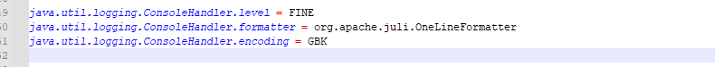
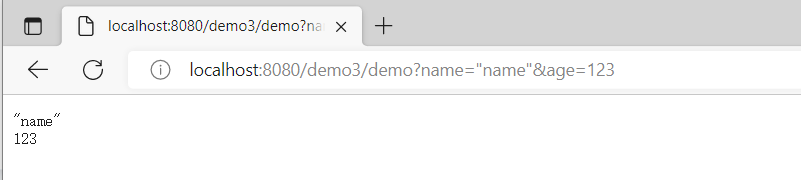

## WEB


### 基础

#### Tomcat下载


- 地址

[Tomcat下载地址](https://tomcat.apache.org/download-10.cgi)


- 解压

- 进入bin目录

..\apache-tomcat-10.0.27-windows-x64\apache-tomcat-10.0.27\bin

windows系统直接双击 startup.bat文件即可

mac系统进入目录命令行输入 sudo .\startup.sh

- 乱码问题

> 此刻windows系统控制台可能存在乱码问题。
>
> 问题在于tomcat日志输出到cmd默认是utf-8格式，而cmd默认编码集是GBK的。
>
> 解决：只需要修改日志配置即可，进入logging.properties,按如下将utf-8 ---->  GBK



- 验证

> 启动完成后，cmd


> tomcat默认地址和端口为
>
> localhost(127.0.1)  端口为8080


#### tomcat运行web程序

> web程序需要在服务器上才可以运行，tomcat就是一个免费且性能不错的服务器，那么我们如何将web程序放在服务器上运行呢？

##### 如何创建web项目

> 这里编译器选择idea，使用maven构建项目，有两种方式。

###### 方式一：

- 首先创建模块

  > 首先创建一个空的maven模块，或创建一个空的maven项目


- 添加web支持

> 此刻这个maven项目是一个空的maven项目，想要让其变为web项目，需要添加web支持

右击项目 ---> 点击 Add Franework Support ---> 勾选web即可

此刻就会多出来如下红色方框内的文件：

- index.jsp     网站首页
- web.xml       web项目的配置文件


- 配置

**修改打包方式并引入插件**

指定web.xml   资源文件路径   resource打包

```xml
<?xml version="1.0" encoding="UTF-8"?>
<project xmlns="http://maven.apache.org/POM/4.0.0"
         xmlns:xsi="http://www.w3.org/2001/XMLSchema-instance"
         xsi:schemaLocation="http://maven.apache.org/POM/4.0.0 http://maven.apache.org/xsd/maven-4.0.0.xsd">
    <modelVersion>4.0.0</modelVersion>

    <groupId>com.roily</groupId>
    <artifactId>web_demo01</artifactId>
    <version>1.0-SNAPSHOT</version>

    <!--  修改打包方式  -->
    <packaging>war</packaging>

    <properties>
        <maven.compiler.source>8</maven.compiler.source>
        <maven.compiler.target>8</maven.compiler.target>
    </properties>

    <build>
        <!--    打包后的war包名称    -->
        <finalName>web_demo1</finalName>
        <plugins>
            <!--     引入插件，以及及配置打包资源文件       -->
            <plugin>
                <groupId>org.apache.maven.plugins</groupId>
                <artifactId>maven-war-plugin</artifactId>
                <version>3.0.0</version>
                <configuration>
                    <webXml>web/WEB-INF/web.xml</webXml>
                    <warSourceDirectory>web</warSourceDirectory>
                </configuration>
            </plugin>
        </plugins>
        <resources>
            <resource>
                <directory>src/main/java</directory>
                <includes>
                    <include>**/*.properties</include>
                    <include>**/*.xml</include>
                </includes>
                <filtering>false</filtering>
            </resource>
            <resource>
                <directory>src/main/resources</directory>
                <includes>
                    <include>**/*.properties</include>
                    <include>**/*.xml</include>
                </includes>
                <filtering>false</filtering>
            </resource>
        </resources>
    </build>
</project>
```


**配置一下Artifacts**

> 路径的配置只是为了输出到指定目录


- 打包

> 点击package


- 放入tomcat运行

> 将war包放入tomcat ，执行startup.bat ，会自动解压成同名的文件夹。访问https:localhost:8080/项目名。


###### 方式二：

> maven为我们呢提供创建web项目的模板，我们只需选择对应模板就行。

- 选择web项目模板,

  > 填写好基本信息，会为我们生成基础的pom  web.xml  和一个index.jsp


- 直接打吧即可


- 运行


#### idea集成tomcat

> idea可集成tomcat，无需将项目打包然后再运行，而是一键启动式运行。

##### 配置

> 简单配置即可运行，web程序我们使用以上两个现成的即可。


##### 运行

> 如上配置即可点击启动按钮，即可启动web项目。

启动完成后可在，tomcat webapps下看见demo01文件夹


##### 乱码

> 可能会存在乱码问题，一样的道理，日志是tomcat输出到idea控制台的，输出的什么格式，idea控制台设置的什么格式？


#### http

[维基百科，http](https://wiki.mbalib.com/wiki/HTTP)、[百度百科，http](https://baike.baidu.com/item/http/243074)

> HTTP协议（Hypertext Transfer Protocol，超文本传输协议）是用于从[WWW服务器](https://wiki.mbalib.com/wiki/WWW服务器)传输超文本到本地[浏览器](https://wiki.mbalib.com/wiki/浏览器)的[传送协议](https://wiki.mbalib.com/wiki/传送协议)。它可以使浏览器更加高效，使网络传输减少。

- 超文本？

文本是什么？html、字符串。 超文本：视频、图片、其他复杂信息。

- 端口

默认80端口，80端口可以忽略不写

- url

我们在浏览器的地址栏里输入的网站地址叫做[URL](https://wiki.mbalib.com/wiki/URL)(UniformResourceLocator，统一资源定位符)。就像每家每户都有一个门牌地址一样，每个网页也都有一个Internet地址。当你在浏览器的地址框中输入一个URL或是单击一个超级链接时，URL就确定了要浏览的地址。浏览器通过超文本传输协议(HTTP)，将Web服务器上站点的网页代码提取出来，并翻译成漂亮的网页。因此，在我们认识HTTP之前，有必要先弄清楚URL的组成, 例如：http://www.mbalib.com/china/index.htm 它的含义如下：

　　1.**http://：**代表超文本传输协议，通知microsoft.com服务器显示Web页，通常不用输入；

　　2.**www：**代表一个Web([万维网](https://wiki.mbalib.com/wiki/万维网))服务器；

　　3.**mbalib.com/：**这是装有网页的服务器的[域名](https://wiki.mbalib.com/wiki/域名)，或站点服务器的名称；

　　4.**China/：**为该服务器上的子目录，就好像我们的文件夹；

　　5.**Index.htm:**是文件夹中的一个[HTML](https://wiki.mbalib.com/wiki/HTML)文件(网页)。

##### 一次Http请求的过程

一次http请求响应过程一般从客户输入完整url开始，到浏览器展示渲染信息结束。

- 解析url

url的组成如上，第一步便是解析这个，解析完后将各个部分封装进请求报文

- 域名服务器解析域名

万维网上，每个网站都有对应ip地址，但ip地址不好记，所以就有了域名。我们一般透过域名访问网站，那么就得解析域名，解析域名为了得到IP地址。

首先查询浏览器DNS缓存，是否有此域名对应ip缓存。

如果没有命中，则查询操作系统DNS缓存。

如果没有命中，则发送请求至本地域名服务器，查询本地域名服务器DNS缓存

如果没有命中，则发送请求至远程域名服务器，此过程通过迭代的方式寻址查询，[根域名服务器]  ---》[权限域名服务器]

查询到IP地址，原路返回，并走一步缓存一步，最终浏览器得到域名对应的ip地址

- 建立TCP连接

http协议是建立在TCP协议基础上的。

浏览器获取到ip地址后，请求报文发送给谁就明确了，那么此刻便会与服务器进行三次握手建立TCP连接。

- 发送请求

TCP三次握手完成后，便可发送请求了。请求和响应的数据传输在一个通道上，这个传输过程为了避免报文较大的问题，会将报文进行分段传输，收到所有报文后再进行报文重组。

- 服务器处理
- 发送响应报文

服务器处理完成后会发送响应报文给客户端

- 断开TCP连接

http协议是基于请求、响应范式的，每一次请求都会建立单独的连接。因此某个请求周期结束后便会进行四次挥手断开连接。

- 浏览器渲染


### Servlet

Servlet  +   JSP是sun公司提出的B\S架构，纯jiava代码实现，现在主流的也不用了，了解一下，但Servlcet是需要主要了解的。

#### 什么是Servlcet

> 实现`javax.servlet.Servlet`接口的web程序叫做Servlcet。
>
> Servlet将请求信息放入req域，响应信息放入Resp域。

看一下Servlet的设计。

如果我们需要实现自己的Servlet只需要继承Httpservlet，并重写方法即可。


> Servlet接口

```java
public interface Servlet {
    //初始化
    public void init(ServletConfig config) throws ServletException;
    public ServletConfig getServletConfig();
    //此方法会在HttpServlet中进行重写，进行求分发
    public void service(ServletRequest req, ServletResponse res) throws ServletException, IOException;
    public String getServletInfo();
    //销毁
    public void destroy();
}
```

> GenericServlet，此类是一个抽象类，基本上是对Servlet接口方法做声明，并未实现，其中最重要的service方法就是如此。

> HttpServlet，实现了具体的service方法.，逻辑便是根据不同的请求方式走不同的方法

```java
doGet();
doPost();
doHead();
doPut();
doDelete();
doOptions();
doTrace();
service(){
    if(get){
        doGet();
    }if(post){
        doPost();
    }......
}
```


#### 写一个servlet

> 自己写一个Servlet，并将其配置到web.xml中。

注：Tomcat10需要升级Servlet，这边先回退到Tomcat9

```java
public class ServletDemo extends HttpServlet {
    @Override
    protected void doGet(HttpServletRequest req, HttpServletResponse resp) throws ServletException, IOException {
        //不同的请求方式走不同的方法，但是业务逻辑是一样的
        this.doPost(req, resp);
    }
    @Override
    protected void doPost(HttpServletRequest req, HttpServletResponse resp) throws ServletException, IOException {

        final String name = req.getParameter("name");
        final String age = req.getParameter("age");
        System.out.println("name:" + name + "  age:" + age);
        //直接输出到网页上
        final PrintWriter writer = resp.getWriter();
        writer.println(name);
        writer.println(age);
        writer.close();
    }
    @Override
    public void destroy() {
        System.err.println(this.getClass().getSimpleName() + "销毁");
    }
    @Override
    public void init() throws ServletException {
        System.err.println(this.getClass().getSimpleName() + "初始化");
    }
}
```

```xml
<!DOCTYPE web-app PUBLIC
        "-//Sun Microsystems, Inc.//DTD Web Application 2.3//EN"
        "http://java.sun.com/dtd/web-app_2_3.dtd" >
<web-app>

    <servlet>
        <servlet-name>demo</servlet-name>
        <servlet-class>com.roily.servlet.ServletDemo</servlet-class>
    </servlet>

    <servlet-mapping>
        <servlet-name>demo</servlet-name>
        <url-pattern>/demo</url-pattern>
    </servlet-mapping>

</web-app>
```

> 启动tomcat并测试。



> 如果输入中文会乱码

方式一：

设置编码格式

```java
req.setCharacterEncoding("utf-8");
resp.setContentType("text/html");
resp.setCharacterEncoding("utf-8");
```

方式二：

配置拦截器

```xml
<filter>
    <filter-name>encoding</filter-name>
    <filter-class>org.springframework.web.filter.CharacterEncodingFilter</filter-class>
    <init-param>
        <param-name>encoding</param-name>
        <param-value>utf-8</param-value>
    </init-param>
    <!--        <init-param>-->
    <!--            <param-name>forceRequestEncoding</param-name>-->
    <!--            <param-value>true</param-value>-->
    <!--        </init-param>-->
    <init-param>
        <param-name>forceResponseEncoding</param-name>
        <param-value>true</param-value>
    </init-param>
</filter>
<filter-mapping>
    <filter-name>encoding</filter-name>
    <url-pattern>/*</url-pattern>
</filter-mapping>
```


#### 几个域

> 了解Web中的几个域及其作用

##### Request

> request生命周期，一次请求。
>
> 每一次请求都会有一个全新的request

通过`req.getParamer()`获取请求参数

通过

```java
final Object name1 = req.getAttribute("name");
req.setAttribute("name", "name");
```

获取属性和设置属性，可用于请求转发，延长Request生命周期


##### Respones


