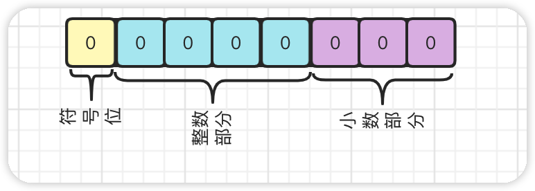
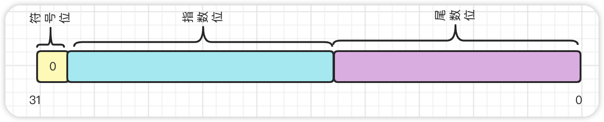
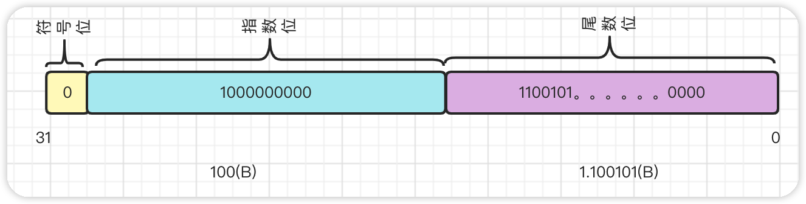
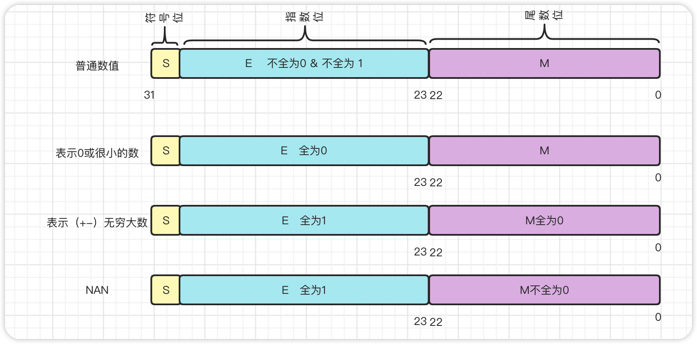
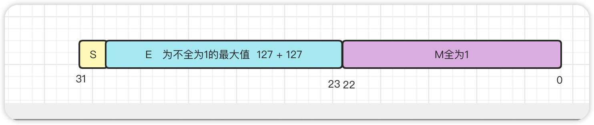

#### 十进制转二进制

> 十进制和二进制之间如何互相转化。（D）表示十进制、(B)表示二进制

一个数字由整数部分和小数部分组成，对于整数部分采用`除二取余`，对于小数部分采用`乘二取整`。

举例：

125(D)

| 十进制 | 除二后的值 | 余数 |
| ------ | ---------- | ---- |
| 125    | 62         | 1    |
| 62     | 31         | 0    |
| 31     | 15         | 1    |
| 15     | 7          | 1    |
| 7      | 3          | 1    |
| 3      | 1          | 1    |
| 1      | 0          | 1    |

那么 125(D) = 1111 1101(B)

0.125(D)

| 十进制 | 乘二后的值 | 取整 |
| ------ | ---------- | ---- |
| 0.125  | 0.250      | 0    |
| 0.250  | 0.500      | 0    |
| 0.500  | 1.0        | 1    |
|        |            |      |

那么 0.125（D） = 0.0010（B）

> 计算机中小数存在精度问题

以0.2为例

| 十进制     | 乘二后的值  | 取整         |
| ---------- | ----------- | ------------ |
| 0.2        | 0.4         | 0            |
| 0.4        | 0.8         | 0            |
| 0.8        | 1.6         | 1            |
| 0.6        | 1.2         | 1            |
| 0.2        | 0.4         | 0            |
| 0.4        | 0.8         | 0            |
| 0.8        | 1.6         | 1            |
| 0.6        | 1.2         | 1            |
| .......... | ........... | ............ |

无限循环：0.2（D） = 0.0011 0011......（B）

所以说在计算机中小数可能只表示为一个近似值

#### 定点数

> 一个数由整数和小数组成，定点的意思就是固定小数点，以小数点为界将一个数拆分为整数部分和小数部分，然后约定整数占多少位，小数占多少位，分别计算小数和整数的值，最后使用小数点拼接起来。

以1bit也就是8位举例，约定第一位是符号位，2-5位为整数位，6-8位位小数位

那么2.25可表示为

2.25(D) = 0 0010 010(B)

> 那么就可以总结一下如何使用定点数表示一个数字

- 针对不同位数的数据类型宽度，约定符号位、整数部分、小数部分分别占多少位
- 整数部分与小数部分分别转化为二进制数
- 计算的时候，分别计算，最后组合起来就是结果

##### 问题

> 在上面的例子中我们约定一个1字节8位的宽度的数

那么整数部分的表示范围为 0000 - 1111 即 0-15，小数部分000 111

对于整数部分表示范围太小，对于小数部分精度不够。

- 小数点后移，范围变大，那么精度将降低
- 小数点前移，精度提升，范围减小

所以说对于只有整数部分的数来说可以使用定点数来表示，那么对于存在小数的数，一般采用浮点数来表示。

#### 浮点数

浮点数指的是小数点的位置是不固定，由指数决定。

计算机中的浮点数采用的是科学计数法的方式来表示的。

对于十进制数25.25来说，如何使用科学技术法来表示：

25.25 = 25.25 * 10^0^

25.25 = 2.525 * 10^1^

25.25 = 0.2525 * 10^2^

25.25 = 252.5 * 10^-1^

.......

> 严格的来说科学计数法规定尾数的表示为一个小数，小数点出现的位置为首次不为0的位数的后面。

也就是25.25 = 2.525 * 10^1^

##### 如何使用浮点数来表示数字

> 一个数的浮点数表示法，由几个变量决定

- S    代表符号位， 0 表示正数，-1表示负数
- M   尾数，是一个小数  25.25 = 2.525 * 10^1^  其中 2.525就是尾数
- R    基数， 表示进制， 10进制就是10，二进制就是2
- E    指数， 是一个整数， 25.25 = 0.2525 * 10^2^  其中2就是指数

公式表示为：

V = (-1)^S^  *  M  *  R^E^

在计算机中我们只需要确定这几个数的位数及位置即可，计算的时候使用一定规律即可。

> 比如对于一个32位的数据类型我们约定，第一位为符号位，后十位为指数，剩余部分为尾数

那么25.25就可以表示为：

25.25 = 11001. 01(B) = (-1)^0^  *  1.100101  *  2^4^

> ​	那么就又会有一些问题了，指数位表示的是一个无符号整数，且指数可以是正数也可以是负数，我们可以将指数设置一个初始值，将指数与初始值相加得出的数为需要存入的数。即0111111111 + 100 = 1000000011。如此指数为将再无符号之分。
>
> 且对于二进制来说，尾数1.xxxxxxxxx其首位都是1，那么这个1就可以省略，在计算的时候再默认加上就行，同等条件下，科表示的精度就提升了。

##### java中的浮点数

> java为我们提供了两个浮点数类型 `float`和`double`，分别为单精度和双精度。这两种浮点数遵守了IEEE组织推出的浮点数标准，即IEEE754标准，定义如下：

- 单精度浮点数`float`:32位，符号位S占1位，指数占8位，位数占23位
- 双精度浮点数`double`：64位，符号位S占1位，指数占11位，位数占52位

> 为了使其表示的数字范围、精度最大化，浮点数标准还对指数和尾数进行了规定：

- 尾数 M 的第一位总是 1（因为 1 <= M < 2），那么这一位可以省略，省略出来的一位可以扩大浮点数的精度，单精度位数实际有效位数24位，双精度实际有效位数为53位。

- 指数 E 是个无符号整数，而指数是存在正负的，所以需要给指数一个初始值，无论指数是正是负，都与初始值相加，得出的结果再存入。避免正负之分。指数范围：以float为例，8位，无符号，那么范围为： [0,255]，但是为了负数考虑，初始值设为 0111 1111 （127），那么指数的的范围就修正为:[-127,128]

> 除了以上规定，对于一些特殊的数值，也有如下规定：

##### 浮点数精度和范围

> 了解一下浮点数的范围和精度，以float为例

float能表示的最大二进制数为：

****

科学计数法表示：1.111...(小数点后23个1)  * 2^127^ ≈ 2^128^ ≈ 3.4 * 10^38^。则flaot的表示范围为

【-3.4 * 10^38^，3.4 * 10^38^】

float 能表示的最小二进制数为 0.0000....1（小数点后22个0，1个1），用十进制数表示就是 1/2^23。

> 虽然浮点数的范围和精度也有限，但其范围和精度已经够用，有特殊需求再用其他的。

