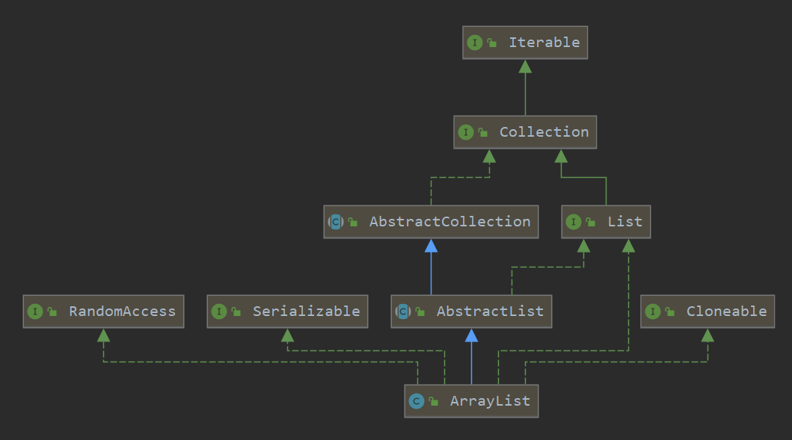
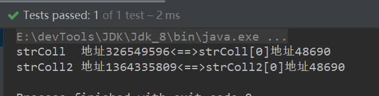
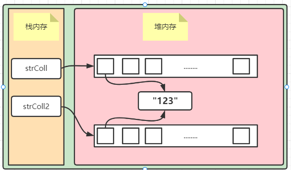

本文学习ArrayList。


#### ArrayList类图

先看一下ArrayList的类图：

ArrayList是AbstractList的一个子类，AabstractList是List的一个实现类。

ArrayList实现了RandomAccess、Cloneable、Serializable接口。

- `RandomAccess` 是一个标志接口，表明ArrayList可以被快速随机访问。arrayList底层是一个对象数组。
- `ArrayList` 实现了 **`Cloneable` 接口** ，即覆盖了函数`clone()`，能被克隆。
- `ArrayList` 实现了 `java.io.Serializable`接口，这意味着`ArrayList`支持序列化，能通过序列化去传输。




#### ArrayList重要属性

```java
//序列号
private static final long serialVersionUID = 8683452581122892189L;
//默认初始容量
private static final int DEFAULT_CAPACITY = 10;
//空对象数组，初始化ArrayList如果size等于0的话，则初始化为该空数组
private static final Object[] EMPTY_ELEMENTDATA = {};
//默认空对象数组，ArrayList无参构造初锁始化的空数组
private static final Object[] DEFAULTCAPACITY_EMPTY_ELEMENTDATA = {};
//对象数组，数组所存放的数组
transient Object[] elementData; // non-private to simplify nested class access
//元素个数、注意不是数组长度
private int size;
```


#### ArrayList构造器

```java
public ArrayList(int initialCapacity) {
    if (initialCapacity > 0) {
        this.elementData = new Object[initialCapacity];
    } else if (initialCapacity == 0) {
        this.elementData = EMPTY_ELEMENTDATA;
    }
}
public ArrayList() {
    this.elementData = DEFAULTCAPACITY_EMPTY_ELEMENTDATA;
}
public ArrayList(Collection<? extends E> c) {
    elementData = c.toArray();
    if ((size = elementData.length) != 0) {
        // c.toArray might (incorrectly) not return Object[] (see 6260652)
        if (elementData.getClass() != Object[].class)
            elementData = Arrays.copyOf(elementData, size, Object[].class);
    } else {
        // replace with empty array.
        this.elementData = EMPTY_ELEMENTDATA;
    }
}
```

> ArrayList()

初始化为一个默认空对象数组。

> ArrayList(int initialCapacity)

- 初始化容量等于0：初始化为空对象数组。
- 初始化容量大于0：new一个固定长度数组。

> ArrayList(Collection<? extends E> c)

将集合元素拷贝到对象数组。


#### 源码解读


##### add方法

> add方法很简单，首先会判断数组容量是否够用，然后往数组插入数据

```java
public boolean add(E e) {
    ensureCapacityInternal(size + 1);  // Increments modCount!!
    elementData[size++] = e;
    return true;
}
```

##### ensureCapacityInternal

> 确保对象数组容量够用的方法，这里涉及四个方法。

- ensureCapacityInternal  

这个方法不重要重要的是下面三个。

```java
private void ensureCapacityInternal(int minCapacity) {
    ensureExplicitCapacity(calculateCapacity(elementData, minCapacity));
}
```

- calculateCapacity

计算容量。

①如果对象数组为默认空数组，则返回的容量为10或所需最小容量。

②如果不是空数组则返回所需最小容量。

```java
private static int calculateCapacity(Object[] elementData, int minCapacity) {
    if (elementData == DEFAULTCAPACITY_EMPTY_ELEMENTDATA) {
        return Math.max(DEFAULT_CAPACITY, minCapacity);
    }
    return minCapacity;
}
```

- ensureExplicitCapacity

判断对象数组是否需要扩容的方法。

①模数加一，每次修改数组模数都会加一。

②判断数组是否需要扩容

```java
private void ensureExplicitCapacity(int minCapacity) {
    modCount++;

    // overflow-conscious code
    if (minCapacity - elementData.length > 0)
        grow(minCapacity);
}
```

- grow

Arrays.copyof()通过获取一个原始数组的副本，被截断或用null填充以返回指定的长度。底层会调用System.arraycopy方法。这是一个浅拷贝。

```java
private void grow(int minCapacity) {
    //获取旧数组容量
    int oldCapacity = elementData.length;
    //先扩容1.5倍。
    int newCapacity = oldCapacity + (oldCapacity >> 1);
    //如果扩容不够，则扩容为minCapacity
    if (newCapacity - minCapacity < 0)
        newCapacity = minCapacity;
    //容量不超过int范围
    if (newCapacity - MAX_ARRAY_SIZE > 0)
        newCapacity = hugeCapacity(minCapacity);
    // minCapacity is usually close to size, so this is a win:
    elementData = Arrays.copyOf(elementData, newCapacity);
}
```

可以写个例子简单佐证一下：

```java
@Test
public void test01(){
    String[] strColl = new String[10];
    strColl[0] = "123";
    String[] strColl2 = Arrays.copyOf(strColl, 10);
    System.out.println("strColl  地址"+strColl.hashCode()+"<==>"+"strColl[0]地址"+strColl[0].hashCode());
    System.out.println("strColl2 地址"+strColl2.hashCode()+"<==>"+"strColl2[0]地址"+strColl2[0].hashCode());  
}
```



示意图：



<hr>

#### 其他方法

> add方法以说明arrayList的扩容机制。

##### size方法

> size()获取elementData元素个数，注意这不是数组长度。

```java
public int size() {
    return size;
}
```

##### isEmpty方法

```java
public boolean isEmpty() {
    return size == 0;
}
```

##### indexofO

> 获取元素所在数组下标

- 元素为null则返回数组首个为null的下标
- 不为null则返回首个匹配下标
- 不存在则返回-1

```java
public int indexOf(Object o) {
    if (o == null) {
        for (int i = 0; i < size; i++)
            if (elementData[i]==null)
                return i;
    } else {
        for (int i = 0; i < size; i++)
            if (o.equals(elementData[i]))
                return i;
    }
    return -1;
}
```

##### contains

> 元素是否存在于对象数组。

```java
public boolean contains(Object o) {
    return indexOf(o) >= 0;
}
```

##### lastIndexOf

> 最后出现下标，与indexOf()对应

```java
public int lastIndexOf(Object o) {
    if (o == null) {
        for (int i = size-1; i >= 0; i--)
            if (elementData[i]==null)
                return i;
    } else {
        for (int i = size-1; i >= 0; i--)
            if (o.equals(elementData[i]))
                return i;
    }
    return -1;
}
```

##### clone

> 拷贝方法。总体来说是一个浅拷贝，会将模数置位0。

```java
public Object clone() {
    try {
        ArrayList<?> v = (ArrayList<?>) super.clone();
        //属于引用拷贝
        v.elementData = Arrays.copyOf(elementData, size);
        v.modCount = 0;
        return v;
    } catch (CloneNotSupportedException e) {
        // this shouldn't happen, since we are Cloneable
        throw new InternalError(e);
    }
}
```

##### get（int index）

> 获取对应下标元素。

```java
public E get(int index) {
    //范围检查
    rangeCheck(index);

    return elementData(index);
}
```

##### set（E e）

> 与add有所不同这是一个替换操作，返回旧值

```java
public E set(int index, E element) {
    rangeCheck(index);

    E oldValue = elementData(index);
    elementData[index] = element;
    return oldValue;
}
```

##### add(int index, E element)

> 指定下标添加元素。

```java
public void add(int index, E element) {
    //下标检查
    rangeCheckForAdd(index);
	//是否需要扩容
    ensureCapacityInternal(size + 1);  // Increments modCount!!
    //拷贝，index下标开始后移一为
    System.arraycopy(elementData, index, elementData, index + 1,
                     size - index);
    //覆盖index
    elementData[index] = element;
    size++;
}
```

##### remove(int idnex)

> 移除指定下标元素，并返回被移除元素。

- 拷贝数组覆盖 下标为index的元素
- 将最后一个元素置为null

```java
public E remove(int index) {
    //下标检查
    rangeCheck(index);
	
    modCount++;
    E oldValue = elementData(index);
	//获取需要移动的元素个数
    int numMoved = size - index - 1;
    //覆盖下标为index的元素
    if (numMoved > 0)
        System.arraycopy(elementData, index+1, elementData, index,
                         numMoved);
    //最后一个元素，重复，置为null
    elementData[--size] = null; // clear to let GC do its work

    return oldValue;
}
```

##### remove(Object obj)

> 移除首次出现的元素，fastremove和remove一样只不过不返回被移除的元素

```java
public boolean remove(Object o) {
    if (o == null) {
        for (int index = 0; index < size; index++)
            if (elementData[index] == null) {
                fastRemove(index);
                return true;
            }
    } else {
        for (int index = 0; index < size; index++)
            if (o.equals(elementData[index])) {
                fastRemove(index);
                return true;
            }
    }
    return false;
}
```

##### clear

> 清除数组元素。

```java
public void clear() {
    modCount++;

    // clear to let GC do its work
    for (int i = 0; i < size; i++)
        elementData[i] = null;

    size = 0;
}
```

##### addAll

> 差不多

```java
public boolean addAll(Collection<? extends E> c) {
    Object[] a = c.toArray();
    int numNew = a.length;
    ensureCapacityInternal(size + numNew);  // Increments modCount
    System.arraycopy(a, 0, elementData, size, numNew);
    size += numNew;
    return numNew != 0;
}
```

##### ensureCapacity

> 这个方法在ArrayList内部没有任何调用，所以说这个方法肯定是给程序员用的。用来干嘛嘞？一次性扩容到自己需要的容量，省却添加时扩容资源消耗以及内存空间消耗。什么场景下使用呢？当你晓得这个数组需要多大时使用。

```java
public void ensureCapacity(int minCapacity) {
    int minExpand = (elementData != DEFAULTCAPACITY_EMPTY_ELEMENTDATA)
        // any size if not default element table
        ? 0
        // larger than default for default empty table. It's already
        // supposed to be at default size.
        : DEFAULT_CAPACITY;

    if (minCapacity > minExpand) {
        ensureExplicitCapacity(minCapacity);
    }
}
```


#### ArrayList遍历

接下来介绍几个遍历ArrayList的方法。

- for循环（普通、增强）

- 迭代器
- Iterable接口的  forEach

- Stream Api的forEach

```java
@Test
public void test() {

    List<String> list = new ArrayList<String>();

    //添加10个元素
    for (int i = 1; i <= 5; i++) {
        list.add("str" + i);
    }

    //for循环
    System.out.println("============普通for循环=============");
    for (int i = 0; i < list.size(); i++) {
        System.out.println(list.get(i));
    }
    System.out.println("===================================");

    System.out.println("============增强for循环=============");
    for (String temp : list) {
        System.out.println(temp);
    }
    System.out.println("===================================");

    //迭代器
    System.out.println("============迭代器=============");

    Iterator<String> iterator = list.iterator();
    while (iterator.hasNext()){
        System.out.println(iterator.next());
    }
    System.out.println("===================================");

    //iterator接口
    System.out.println("============iterator接口=============");

    list.forEach(System.out::println);

    System.out.println("===================================");

    //Stream  Api
    System.out.println("============Stream  Api=============");

    list.stream().forEach(System.out::println);

    System.out.println("===================================");

}
```


#### 总结

- ArrayList底层是对象数组
- ArrayList默认Size为10，在首次add元素时初始化
- ArrayList的拷贝为浅拷贝，利用Arrays.copyOf & System.arraycopy()
- ArrayList扩容机制，一次扩1.5倍，不够就扩为传入参数(minCapacity)，不超过int最大值
- 一次性扩够  ensureCapacity(int capacity)