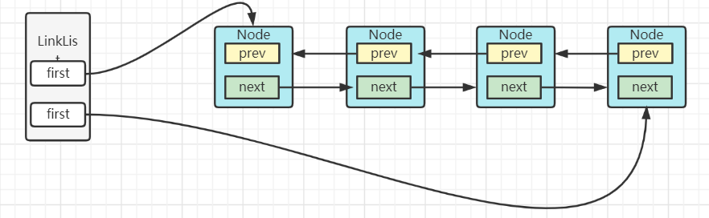

本文学习LinkedList。


#### 类图


- List  实现list接口
- cloneable   实现拷贝接口。
- Serializable  序列化接口
- Deque  使用Deque提供的接口，简化入链出链操作语义


#### 简介

链表（Linked list）是一种常见的基础数据结构，分为单向链表和双向链表，这里的linkedList为双向链表。不支持随机访问。

结构为：




#### 属性

```java
transient int size = 0;
transient Node<E> first;
transient Node<E> last;
```

- size  链表大小

- first 头结点

- last 尾结点

  

#### Node

LinkedList内部类，为链表节点对象。

- item  数据
- prev前驱节点
- next后驱节点

```java
private static class Node<E> {
    E item;
    Node<E> next;
    Node<E> prev;

    Node(Node<E> prev, E element, Node<E> next) {
        this.item = element;
        this.next = next;
        this.prev = prev;
    }
}
```


#### Construct

- 无参构造，构造一个空链表

```java
public LinkedList() {
}
```

- 先构造空链表，尾插法插入节点

```java
public LinkedList(Collection<? extends E> c) {
    this();
    addAll(c);
}
```


#### 入链&出链方法

##### linkFirst(E e)

作为头节点插入。

```java
private void linkFirst(E e) {
    final Node<E> f = first;
    final Node<E> newNode = new Node<>(null, e, f);
    first = newNode;
    if (f == null)
        last = newNode;
    else
        f.prev = newNode;
    size++;
    modCount++;
}
```


#####  linkLast(E e)

作为尾结点插入。

```java
void linkLast(E e) {
    final Node<E> l = last;
    final Node<E> newNode = new Node<>(l, e, null);
    last = newNode;
    if (l == null)
        first = newNode;
    else
        l.next = newNode;
    size++;
    modCount++;
}
```


##### linkBefore(E e, Node<E> succ)

插入到某个节点之前

```java
void linkBefore(E e, Node<E> succ) {
    // assert succ != null;
    final Node<E> pred = succ.prev;
    final Node<E> newNode = new Node<>(pred, e, succ);
    succ.prev = newNode;
    if (pred == null)
        first = newNode;
    else
        pred.next = newNode;
    size++;
    modCount++;
}
```


##### unlinkFirst(Node  f)

将某节点之前的所有节点都断开。

```java
private E unlinkFirst(Node<E> f) {
    // assert f == first && f != null;
    final E element = f.item;
    final Node<E> next = f.next;
    f.item = null;
    f.next = null; // help GC
    first = next;
    if (next == null)
        last = null;
    else
        next.prev = null;
    size--;
    modCount++;
    return element;
}
```


##### unlinkLast(Node l)

将该节点及之后所有节点从链表断开。

```java
private E unlinkLast(Node<E> l) {
    // assert l == last && l != null;
    final E element = l.item;
    final Node<E> prev = l.prev;
    l.item = null;
    l.prev = null; // help GC
    last = prev;
    if (prev == null)
        first = null;
    else
        prev.next = null;
    size--;
    modCount++;
    return element;
}
```


##### unlink(Node x)

将某节点重链表中断开。

```java
E unlink(Node<E> x) {
    // assert x != null;
    final E element = x.item;
    final Node<E> next = x.next;
    final Node<E> prev = x.prev;

    if (prev == null) {
        first = next;
    } else {
        prev.next = next;
        x.prev = null;
    }

    if (next == null) {
        last = prev;
    } else {
        next.prev = prev;
        x.next = null;
    }

    x.item = null;
    size--;
    modCount++;
    return element;
}
```


##### getFirst & getLast

获取首尾结点数据。

```java
public E getFirst() {
    final Node<E> f = first;
    if (f == null)
        throw new NoSuchElementException();
    return f.item;
}
public E getLast() {
    final Node<E> l = last;
    if (l == null)
        throw new NoSuchElementException();
    return l.item;
}
```


##### indexOf & lastIndexOf

获取某个元素的下标，回去遍历链表。

```java
public int indexOf(Object o) {
    int index = 0;
    if (o == null) {
        for (Node<E> x = first; x != null; x = x.next) {
            if (x.item == null)
                return index;
            index++;
        }
    } else {
        for (Node<E> x = first; x != null; x = x.next) {
            if (o.equals(x.item))
                return index;
            index++;
        }
    }
    return -1;
}
```


#### 遍历

- for循环   普通  增强
- 迭代器
- iterrator  api    其实也是曾倩for循环
- Stream 的 foreach

```java
@Test
public void test(){

    List<String> list = new LinkedList<>();

    for (int i = 1; i <= 5; i++) {
        list.add("str"+i);
    }
    //for循环
    System.out.println("============for循环=============");
    //每次get都会从头结点遍历
    for (int i = 0; i < list.size(); i++) {
        System.out.println(list.get(i));
    }
    System.out.println("===================================");
    System.out.println("============增强for循环=============");
    //每次get都会从头结点遍历
    for (String temp : list) {
        System.out.println(temp);
    }
    System.out.println("===================================");

    //迭代器
    System.out.println("============迭代器=============");

    Iterator<String> iterator = list.iterator();
    while (iterator.hasNext()){
        System.out.println(iterator.next());
        //System.out.println(iterator.next());
    }
    System.out.println("===================================");

    //iterator api  其实也是增强for循环
    System.out.println("============迭代器=============");

    list.forEach((temp)->{
        System.out.println(temp);
    });
    System.out.println("===================================");

    //stream foreach
    System.out.println("============迭代器=============");

    list.stream().forEach((temp)->{
        System.out.println(temp);
    });
    System.out.println("===================================");

}
```