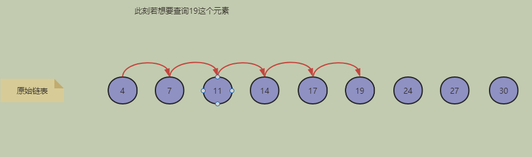
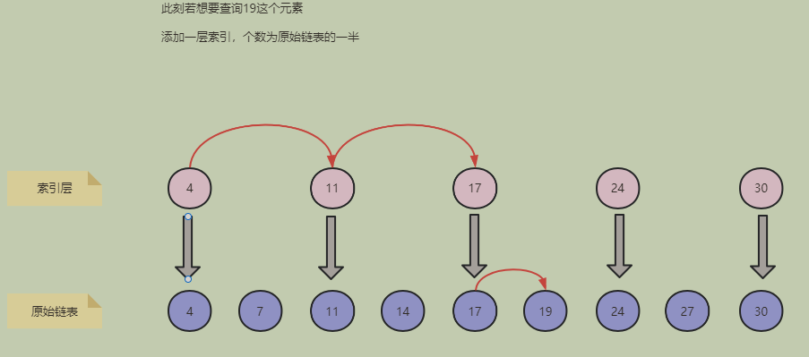
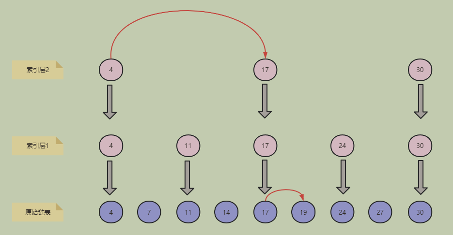
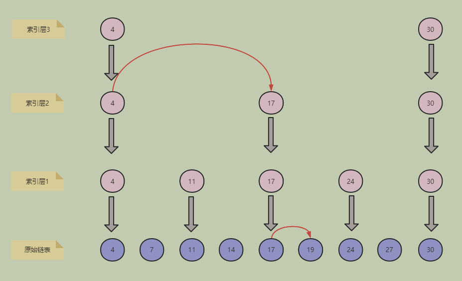
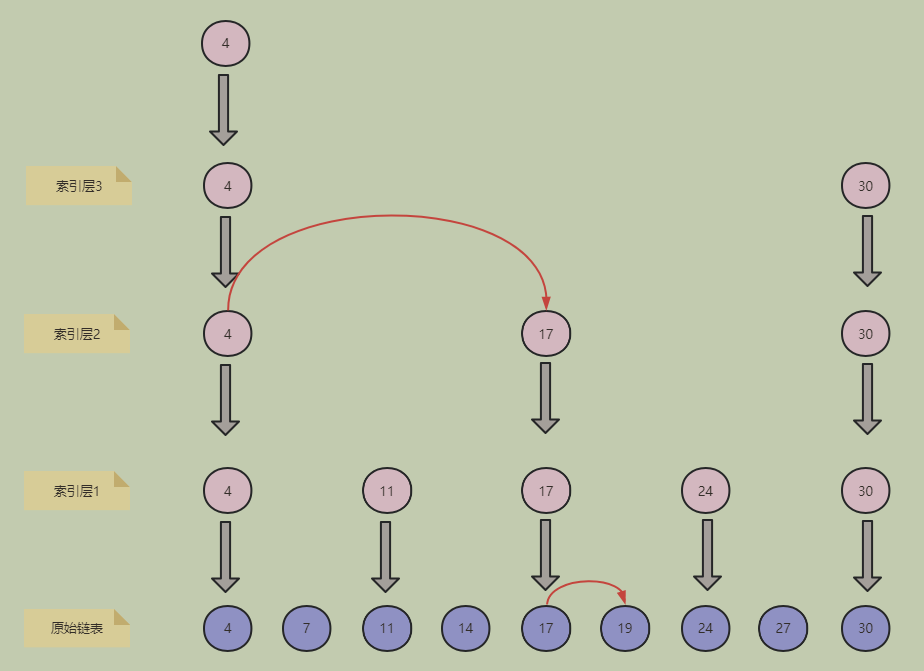

## 调表

### 原理

> 跳表是基于链表实现的有序列表，跳表通过维护一个多层级的链表实现了快速查询效果,通过空间换时间的方式。
>
> 一级索引层存储着真实节点，其他索引层存储着真实节点的索引，所以空间并不会浪费太多。
>
> - 查询效率逼近二分查找
> - 插入效率和双向链表一样

### 常用提高查询效率的算法

- 有序数组：二分查找
- 二叉查找树： 有退化成链表的可能，查询效率一般
- 二叉平衡查找树：查找效率逼近二分查找，插入时存在旋转操作效率较低
- 红黑树： 查找效率逼近二分查找，减少了旋转次数提高插入效率

### 查询原理

链表不支持随机访问，所以不能采用二分查找。只能一个个遍历：

此刻添加一层索引，个数为原始链表一半

此刻添加一层索引，个数为第一层索引的一半

### 插入原理

