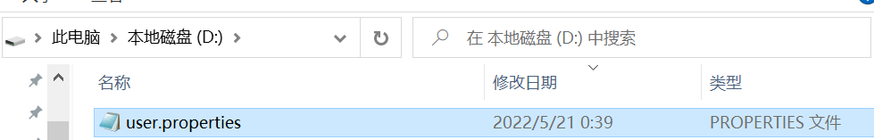

本文介绍map下的一个key-value的类，Properties 。


### 简介

Properties 继承于 Hashtable，可以作为一个map使用。其内部扩展了一些方法，只允许添加String的key-value，不过都是基于hashTable实现的。其使用最多的是作为配置工具类使用。


### 使用

>properties作为map使用

```java
/**
 * properties作为map使用
 */
@Test
public void propertiesUseAsMap() {
    Properties prop = new Properties();
    prop.put(1, "a");
    prop.put(2, 2);
    prop.put("3", new Object());
    System.out.println(prop.get(1));
    System.out.println(prop.get(2));
    System.out.println(prop.get("3"));
}
```


> 其扩展方法，只能添加字符串的key-value

```java
@Test
public void useAsProp() {
    Properties prop = new Properties();
    prop.setProperty("name","name");
    prop.setProperty("age","23");
    prop.setProperty("email","123@qq.com");
    System.out.println(prop);
    prop.forEach((key, value) -> {
        System.out.println("{key" + key + "," + "value" + value + "}");
    });
}
```


> 有一些类自带properties属性

```java
/**
 * 有一些类自带properties
 */
@Test
public void test01() {
    Properties properties = System.getProperties();
    System.out.println(properties);
}
```


> 我们也可以自定义配置类

```java
/**
 * 也可以自己写一个配置类
 */
@Test
public void testMyCP() {
    Properties prop = MyPropClass.getProperties();

    System.out.println(prop);
    prop.forEach((key, value) -> {
        System.out.println("{key" + key + "," + "value" + value + "}");
    });

}

class MyPropClass {
    private static Properties props;
    private static final String name;
    private static final String age;
    private static final String email;

    static {
        props = new Properties();
        name = "yyc";
        age = "23";
        email = "123@qq.com";
        initProperties();
    }

    private static void initProperties() {
        props.setProperty("name", name);
        props.setProperty("age", age);
        props.setProperty("email", email);
    }


    public void setProperties(String key, String value) {
        props.setProperty(key, value);
    }

    public String getProperties(String key) {
        return props.getProperty(key);
    }

    public void setProperties(Properties properties) {

        MyPropClass.props = properties;
    }

    public static Properties getProperties() {
        return props;
    }

```


> 为了防止一些硬编码，可以使用配置文件的形式配置信息，一般用于数据库链接或一些配置的类信息。

user.properties:

```properties
name=yyc
age=23
hobby=ball
```

```java
/**
 * 为了防止一些硬编码，可以配合properties配置文件使用
 * @throws IOException
 */
@Test
public void readProp() throws IOException {

    InputStream in = PropertiesTest.class.getClassLoader().getResourceAsStream("user.properties");
    Properties prop = new Properties();
    prop.load(in);
    String name = prop.getProperty("name");
    String age = prop.getProperty("age");
    String hobby = prop.getProperty("hobby");
    System.out.println("{name:" + name + "," + "age:" + age + "," + "hobby" + hobby + "}");

}
```


> 同时也可以将Properties作为文件输出

```java

/**
 * 也可以输出为properties  或  xml
 * @throws IOException
 */
@Test
public void writeProp() throws IOException {

    //创建配置
    Properties prop = new Properties();
    prop.setProperty("name","name");
    prop.setProperty("age","23");
    prop.setProperty("email","123@qq.com");
    System.out.println(prop);
    prop.forEach((key, value) -> {
        System.out.println("{key" + key + "," + "value" + value + "}");
    });
    //创建  outputStream
    FileWriter fileWriter = new FileWriter(new File("D:\\user.properties"));
    //写入文件
    prop.store(fileWriter,"user信息");

}
```

