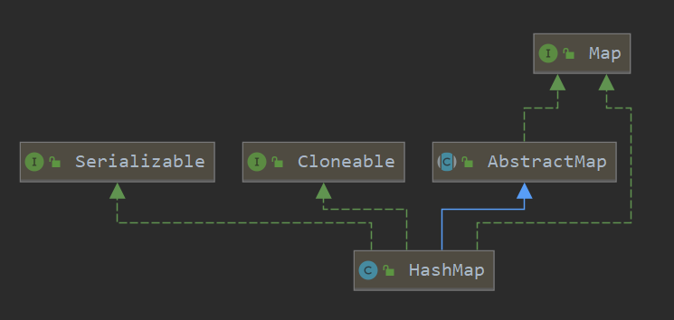
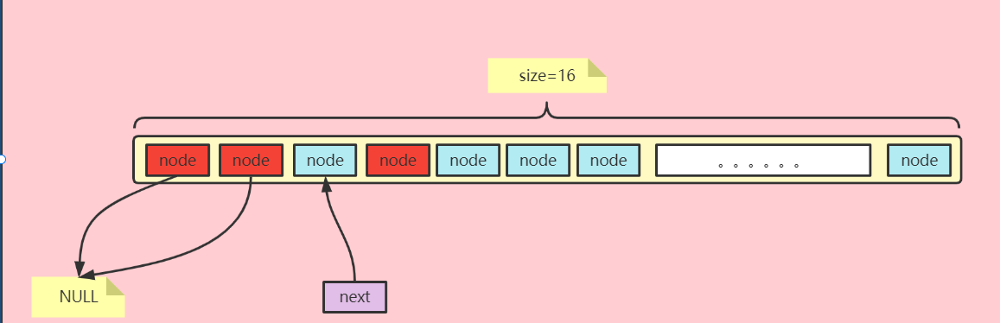
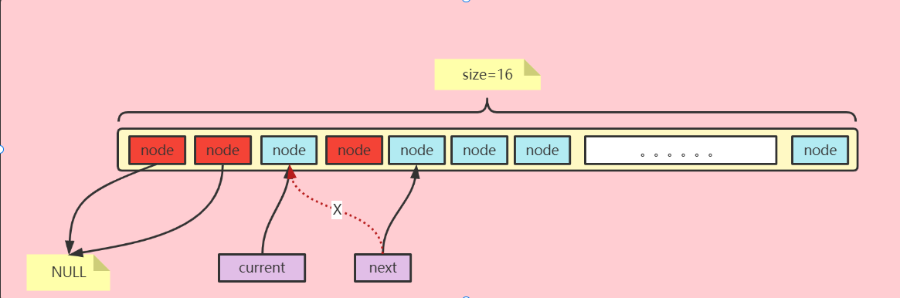
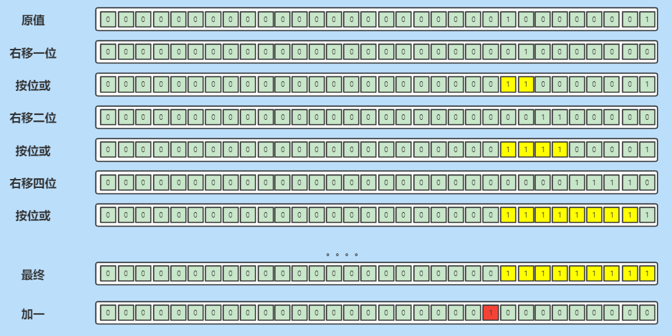
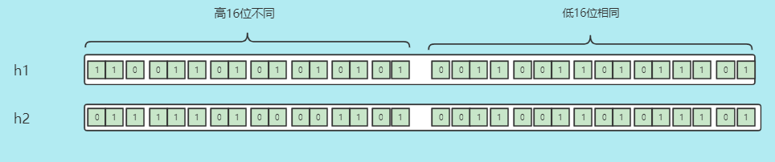
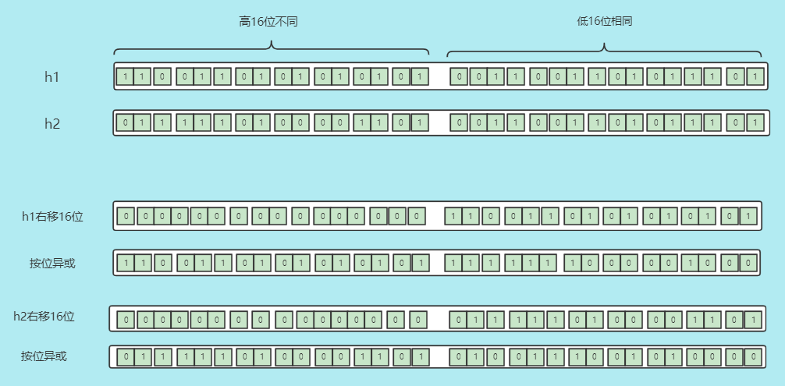
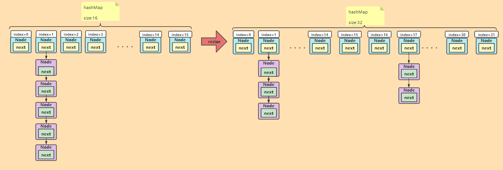

本文学习hashMap，包括结构、源码解读、使用。


> [xxx]()

### 类图



- Map  实现了map接口。
- Serializable  可序列化
- Cloneable   可拷贝
- AbstractMap  的子类

### 内部类

#### Node

> 节点数组节点、单向链表节点。

- hash     该节点哈希值（key对应哈希值）
- key        该节点key值
- value     该节点value值
- next       该节点后驱节点

```java
static class Node<K,V> implements Map.Entry<K,V> {
    final int hash;
    final K key;
    V value;
    Node<K,V> next;
}
```

<hr>

#### keySet

- 是AbstractSet的一个子类
- set集合不可重复
- 存的是hashmap的key值。

```java
final class KeySet extends AbstractSet<K> {}
```

可用于遍历key。

<hr>

#### Values

- 是抽象集合的一个子类
- 可重复
- 存的是hashmap的value值

```java
final class Values extends AbstractCollection<V>
```

可用于遍历value。

<hr>


#### EntrySet

- 也是AbstractSet的一个子类只不过，泛型为Map.Entry<K,V>

```java
final class EntrySet extends AbstractSet<Map.Entry<K,V>>
```

遍历hashMap。

<hr>


#### 迭代器 HashIterator

> hashMap迭代器。其迭代方式，与节点数组的散列方式有关。

建议先看完hashMap结构，再回头看这个。

##### 属性

- next    后驱节点
- current  当前节点
- 预期模数
- index  下标

##### 构造器

重要的就是，next会跳过空节点，指向第一个不为空的节点。

初始状态：

> 这里不考虑“拉链”

这就是do{}while的作用。



##### 向下迭代

> 同样地会跳过空节点



源码：

```java
abstract class HashIterator {
    Node<K,V> next;        // next entry to return
    Node<K,V> current;     // current entry
    int expectedModCount;  // for fast-fail
    int index;             // current slot

    HashIterator() {
        expectedModCount = modCount;
        Node<K,V>[] t = table;
        current = next = null;
        index = 0;
        if (t != null && size > 0) { // advance to first entry
            do {} while (index < t.length && (next = t[index++]) == null);
        }
    }

    public final boolean hasNext() {
        return next != null;
    }

    final Node<K,V> nextNode() {
        Node<K,V>[] t;
        Node<K,V> e = next;
        if (modCount != expectedModCount)
            throw new ConcurrentModificationException();
        if (e == null)
            throw new NoSuchElementException();
        if ((next = (current = e).next) == null && (t = table) != null) {
            do {} while (index < t.length && (next = t[index++]) == null);
        }
        return e;
    }

    public final void remove() {
        Node<K,V> p = current;
        if (p == null)
            throw new IllegalStateException();
        if (modCount != expectedModCount)
            throw new ConcurrentModificationException();
        current = null;
        K key = p.key;
        removeNode(hash(key), key, null, false, false);
        expectedModCount = modCount;
    }
}
```


##### 三个迭代器 

> key、value、entity

HashIterator的三个子类，调用HashIterator的nextNode()方法，获取Node extents Entity，再获取对应属性。

```java
final class KeyIterator extends HashIterator
    implements Iterator<K> {
    public final K next() { return nextNode().key; }
}

final class ValueIterator extends HashIterator
    implements Iterator<V> {
    public final V next() { return nextNode().value; }
}

final class EntryIterator extends HashIterator
    implements Iterator<Map.Entry<K,V>> {
    public final Map.Entry<K,V> next() { return nextNode(); }
}
```

<hr>

#### 分离器  Spliterator

##### 属性

- map   hashMap

- current  当前节点
- index 当前节点下标
- fence  节点数组长度
- est       hashMap节点个数
- expectedModCount  预估的模数

##### 构造器

> 初始化属性

```java
static class HashMapSpliterator<K,V> {
    final HashMap<K,V> map;
    Node<K,V> current;          // current node
    int index;                  // current index, modified on advance/split
    int fence;                  // one past last index
    int est;                    // size estimate
    int expectedModCount;       // for comodification checks

    HashMapSpliterator(HashMap<K,V> m, int origin,
                       int fence, int est,
                       int expectedModCount) {
        this.map = m;
        this.index = origin;
        this.fence = fence;
        this.est = est;
        this.expectedModCount = expectedModCount;
    }

    final int getFence() { // initialize fence and size on first use
        int hi;
        if ((hi = fence) < 0) {
            HashMap<K,V> m = map;
            est = m.size;
            expectedModCount = m.modCount;
            Node<K,V>[] tab = m.table;
            hi = fence = (tab == null) ? 0 : tab.length;
        }
        return hi;
    }

    public final long estimateSize() {
        getFence(); // force init
        return (long) est;
    }
}
```

##### 三个分离器

- KeySpliterator
- ValueSpliterator
- EntrySpliterator

> 这里只对EntrySpliterator做理解，其他两个基于它实现。

同样滴，得先理解HashMap数据结构。

从以下几点去理解：

- 如何获取
- 构造函数（也就是初始状态，包括getFence()方法）
- Consumer<? super Map.Entry<K,V>>  消费函数
- 两个遍历方法，异同

###### 如何获取

> 通过entrySet的成员方法获取。被final修饰不可重写。

```java
Spliterator<Map.Entry<String, Object>> spliterator = map.entrySet().spliterator();

####
public final Spliterator<Map.Entry<K,V>> spliterator() {
    return new EntrySpliterator<>(HashMap.this, 0, -1, 0, 0);
}
```

###### 构造函数

> 只是调用父类的构造器初始化状态

```java
EntrySpliterator(HashMap<K,V> m, int origin, int fence, int est,
                 int expectedModCount) {
    super(m, origin, fence, est, expectedModCount);
}
```

###### Consumer接口

> 这是一个函数式接口，也就是可以使用Lambad表达式实现。

这个接口其实很简单，我们写一个类去实现它，重写accept方法，只做一个打印操作。

```java
class myClass<T> implements Consumer<T>{
    @Override
    public void accept(T t) {
        System.out.println(t);
    }
}
```

然后我们定义一个方法，参数使用myClass的实例，泛型使用String。

```java
public void mmtest(myClass<String> action){
    String abc = "abc";
    action.accept(abc);
}
```

会打印`abc`。

和普通接口没区别。

由于他是函数式接口我们使用lambad表达式实现。

```java
public void mtest(Consumer<String> action){
    String abc = "abc";
    action.accept(abc);
}

@Test
public void test(){

    mtest((str)->{
        System.out.println(str);
    });
}
```

其实是一样的。

###### 两个遍历方法

- tryAdvance

> 获取首个下标最小的节点

源码：

```java
public boolean tryAdvance(Consumer<? super Map.Entry<K,V>> action) {
    int hi;
    if (action == null)
        throw new NullPointerException();
    Node<K,V>[] tab = map.table;
    //fence是数组长度
    if (tab != null && tab.length >= (hi = getFence()) && index >= 0) {
        //这里index < hi 为了防止下标越界。
        while (current != null || index < hi) {
            if (current == null)
                //直到，指向不为空的节点
                current = tab[index++];
            else {
                //current指向next，方便遍历单向链表
                Node<K,V> e = current;
                current = current.next;
                action.accept(e);
                //这个异常是为了防止多线程情况下，同时修改HashMap
                if (map.modCount != expectedModCount)
                    throw new ConcurrentModificationException();
                //获取首个节点，就返回
                return true;
            }
        }
    }
    return false;
}
```

使用：

说明标注于源码，这个如何使用？

```java
@Test
public void test01() {
    Map<String, Object> map = new HashMap<String, Object>();
    map.put(null, null);
    map.put(null, null);
    map.put("3", 3);
    map.put("4", 4);
    map.put("5", 5);
    map.put("6", 6);
    map.put("7", 7);
    map.put("8", 8);
    Spliterator<Map.Entry<String, Object>> spliterator = map.entrySet().spliterator();
    while (spliterator.tryAdvance((a) -> {
        System.err.println(a.getValue());
    })) ;
}
```

- forEachRemaining方法

> 遍历hashMap

源码：

```java
public void forEachRemaining(Consumer<? super Map.Entry<K,V>> action) {
    int i, hi, mc;
    if (action == null)
        throw new NullPointerException();
    HashMap<K,V> m = map;
    Node<K,V>[] tab = m.table;
    if ((hi = fence) < 0) {
        mc = expectedModCount = m.modCount;
        hi = fence = (tab == null) ? 0 : tab.length;
    }
    else
        mc = expectedModCount;
    if (tab != null && tab.length >= hi &&
        (i = index) >= 0 && (i < (index = hi) || current != null)) {
        Node<K,V> p = current;
        current = null;
        do {
            if (p == null)
                p = tab[i++];
            else {
                action.accept(p);
                p = p.next;
            }
        } while (p != null || i < hi);
        if (m.modCount != mc)
            throw new ConcurrentModificationException();
    }
}
```

使用：

```java
@Test
public void test03() {
    Map<String, Object> map = new HashMap<String, Object>();
    map.put(null, null);
    map.put(null, null);
    map.put("3", 3);
    map.put("4", 4);
    map.put("5", 5);
    map.put("6", 6);
    map.put("7", 7);
    map.put("8", 8);
    Spliterator<Map.Entry<String, Object>> spliterator = map.entrySet().spliterator();
    spliterator.forEachRemaining((node)->{
        System.err.println(node.getValue());
    });
}
```

很简单就是一个遍历。


#### treeNode


<hr>


### 重要属性

```java
//默认初始化容量
static final int DEFAULT_INITIAL_CAPACITY = 1 << 4; // aka 16
//最大容量
static final int MAXIMUM_CAPACITY = 1 << 30;
//默认加载因子，减少hash冲突的出现
static final float DEFAULT_LOAD_FACTOR = 0.75f;
//当链表长度大于8时  尝试转化为红黑树
static final int TREEIFY_THRESHOLD = 8;
/**
 * The bin count threshold for untreeifying a (split) bin during a
 * resize operation. Should be less than TREEIFY_THRESHOLD, and at
 * most 6 to mesh with shrinkage detection under removal.
 */
static final int UNTREEIFY_THRESHOLD = 6;
//节点数组长度大于64时满足转化红黑树条件，否则加长数组
static final int MIN_TREEIFY_CAPACITY = 64;
//节点数组
transient Node<K,V>[] table;
//
transient Set<Map.Entry<K,V>> entrySet;
//map中拥有的节点数
transient int size;
//模数  map被修改次数
transient int modCount;
//(capacity * load factor)  临界值 达到就要扩容
int threshold;
//加载因子
final float loadFactor;
```


### 构造函数

```java
//构造一个自定义容量和加载因子的hashMap
//初始化加载因子  和  临界值
public HashMap(int initialCapacity, float loadFactor) {
    if (initialCapacity < 0)
        throw new IllegalArgumentException("Illegal initial capacity: " +
                                           initialCapacity);
    if (initialCapacity > MAXIMUM_CAPACITY)
        initialCapacity = MAXIMUM_CAPACITY;
    if (loadFactor <= 0 || Float.isNaN(loadFactor))
        throw new IllegalArgumentException("Illegal load factor: " +
                                           loadFactor);
    this.loadFactor = loadFactor;
    //这个值在首次put时会重置
    this.threshold = tableSizeFor(initialCapacity);
}
//构造一个自定义容量  默认加载因子  的hashmap
public HashMap(int initialCapacity) {
    this(initialCapacity, DEFAULT_LOAD_FACTOR);
}
//构造一个默认容量的hashmap  threshold和loadFactor会在首次put值时resize
public HashMap() {
    this.loadFactor = DEFAULT_LOAD_FACTOR; // all other fields defaulted
}
//使用默认加载因子  批量设置值
public HashMap(Map<? extends K, ? extends V> m) {
    this.loadFactor = DEFAULT_LOAD_FACTOR;
    putMapEntries(m, false);
}
```

### 获取hashMap状态方法

```java
//获取HashMap节点数量
//注意不是节点数组长度
public int size() {
    return size;
}
//判断hashnMap是否为空
public boolean isEmpty() {
    return size == 0;
}
//获取加载因子
final float loadFactor() { return loadFactor; }
//获取节点数组容量（也就是数组长度）
final int capacity() {
    return (table != null) ? table.length :
    (threshold > 0) ? threshold :
    DEFAULT_INITIAL_CAPACITY;
}
```

### 源码解读

##### tableSizeFor(int)

> 首先我们看构造函数（自定义容量和加载因子）涉及的这个方法，目的是为了调整hashMap的容量为2的幂次方。

```java
static final int tableSizeFor(int cap) {
    int n = cap - 1;
    n |= n >>> 1;
    n |= n >>> 2;
    n |= n >>> 4;
    n |= n >>> 8;
    n |= n >>> 16;
    return (n < 0) ? 1 : (n >= MAXIMUM_CAPACITY) ? MAXIMUM_CAPACITY : n + 1;
}
```

> 我们上面介绍过了这个方法的目的是为了设置节点数组的容量为离自定义容量最近、且大于自定义容量的2的幂次方数。

​	使用数学公式怎么算？使用换底公式，java只有对自然数取对数
$$
log_2n = log_en/Log_e2
$$
使用Math工具类实现：

```java
public static int tableSizeForTest(int n) {
    //对自然数e求对数。结合换底公式
    double m = Math.log(n) / Math.log(2);
    //没有小数返回，有小数向上进一
    int m2 = (int) Math.ceil(m);
    //2的m2幂次方
    return (int) Math.pow(2, m2);
}
```

> 那hashMap提供的方法咋做的？

- 这个方法主要涉及cap的右移和按位或运算。

- 位运算比数学运算效率要高，且契合计算机逻辑


**从二进制角度如何将一个数变为最近且大于他的2得幂次方数？**

说明：以下高位0填充

| 十进制 | 二进制   | 最终      |
| ------ | -------- | --------- |
| 10     | 1010     | 1 0000    |
| 33     | 10  0001 | 100 0000  |
| 68     | 100 0100 | 1000 0000 |

其实就是将最高位前一位变为1  后面低位都变为0。也就是低位全为1 最终加一。

图解：例子129:1+128 



小结:

总之这个方法就是调整自定义容量（通常我们也不会自定义），便于后面节点散列到随机节点以及便于访问。


<hr>

#### hash()

##### 简介

> 哈希扰动函数，这个方法在后面用到很多，得先了解。

这个方法在jdk1.8做了优化

```java
static final int hash(Object key) {
    int h;
    return (key == null) ? 0 : (h = key.hashCode()) ^ (h >>> 16);
}
```

jdk1.7的hash方法

```java
static int hash(int h) {
    h ^= (h >>> 20) ^ (h >>> 12);
    return h ^ (h >>> 7) ^ (h >>> 4);
}
```

可以发现位运算次数少了很多，且原理和效果不变。

> 这个方法的目的是什么：

降低比较差的哈希算法出现哈希碰撞的概率

> 在hashMap中哈希碰撞指的是什么？

①不同的对象产生相同的哈希值

②不同的哈希值，散列到节点数组同一节点上

以上两种情况经过扰动函数概率都会大大下降。


##### hashMap节点散列方式

> 通过(n - 1) & hash 判断当前元素存放的位置（这里的 n 指的是数组的长度），如果当前位置不为null则判断哈希值是否相等，如果相等就覆盖，如果哈希值不相等则通过拉链法解决冲突。


##### 不经过hash扰动处理

比如说节点数组长度为默认16，这里有两个节点，两个节点的key生成的哈希值为h1、h2。



h1、h2高位不同，低位相同，那么这两个节点散列到节点数组里会怎样？

h1散列位置：1111  & 1101 =》1101

h2散列位置：1111  & 1101 =》1101

​	可以发现两个节点出现冲突，那么就得拉链法解决冲突，我们知道对于链表是不支持随机访问的，也就是查询效率会低下。


##### 那么经过hash扰动呢

相同的例子。



那么这两个节点散列到节点数组里会怎样？

h1散列位置：1111  & 1000=》1000

h2散列位置：1111  & 0000=》0000

会发现散列位置不同了，这就是扰动函数的作用，它将低16位和高16位进行异或，高位不变，低16位变为高16位与低16位异或的结果，即扰动后的哈希值保存了原低16位特征也结合了高16位的特征，这样即便哈希值低位相等也会大大降低冲突出现的概率。


<hr>


#### resize

> 初始化容量或者扩容为两倍，并调整节点。

```java
final Node<K,V>[] resize() {
    Node<K,V>[] oldTab = table;
    int oldCap = (oldTab == null) ? 0 : oldTab.length;
    int oldThr = threshold;
    int newCap, newThr = 0;
    //容量大于0，也就是初始化过了，那么扩容为两倍。
    if (oldCap > 0) {
        if (oldCap >= MAXIMUM_CAPACITY) {
            threshold = Integer.MAX_VALUE;
            return oldTab;
        }
        else if ((newCap = oldCap << 1) < MAXIMUM_CAPACITY &&
                 oldCap >= DEFAULT_INITIAL_CAPACITY)
            //临界值也扩容为两倍
            newThr = oldThr << 1; // double threshold
    }
    //临界值大于0，即是存在容量的有参构造首次put值，临界值就是容量大小
    else if (oldThr > 0) // initial capacity was placed in threshold
        newCap = oldThr;
    //容量和临界值都没有初始化过，也就是无参构造首次put值
    //初始化容量 和 临界值
    else {               // zero initial threshold signifies using defaults
        newCap = DEFAULT_INITIAL_CAPACITY;
        newThr = (int)(DEFAULT_LOAD_FACTOR * DEFAULT_INITIAL_CAPACITY);
    }
    //不是无参构造首次put值 或 oldCap >= MAXIMUM_CAPACITY
    //更新 初始化newThr
    if (newThr == 0) {
        float ft = (float)newCap * loadFactor;
        newThr = (newCap < MAXIMUM_CAPACITY && ft < (float)MAXIMUM_CAPACITY ?
                  (int)ft : Integer.MAX_VALUE);
    }
    //更新临界值
    threshold = newThr;
    @SuppressWarnings({"rawtypes","unchecked"})
    //新建新节点数组
        Node<K,V>[] newTab = (Node<K,V>[])new Node[newCap];
    //节点数组引用指向新的节点数组
    table = newTab;
    if (oldTab != null) {
        //遍历旧节点数组
        for (int j = 0; j < oldCap; ++j) {
            Node<K,V> e;
            if ((e = oldTab[j]) != null) {
                //help  GC
                oldTab[j] = null;
                //该节点下 单向链表只有一个节点
                if (e.next == null)
                    //则直接将该节点散列到新的节点数组里
                    newTab[e.hash & (newCap - 1)] = e;
                //如果该节点为树形节点
                else if (e instanceof TreeNode)
                    ((TreeNode<K,V>)e).split(this, newTab, j, oldCap);
                //该节点下 单向链表存在其他节点
                else { // preserve order
                    //low：低位头结点和尾结点
                    Node<K,V> loHead = null, loTail = null;
                    //high：高位头结点和尾结点
                    Node<K,V> hiHead = null, hiTail = null;
                    Node<K,V> next;
                    //遍历该单向链表，将单向链表拆分为两个单向链表
                    do {
                        next = e.next;
                        //这个判断是 百分之50的概率，也就是将单向链表长度缩短为一半左右
                        if ((e.hash & oldCap) == 0) {
                            if (loTail == null)
                                loHead = e;
                            else
                                loTail.next = e;
                            loTail = e;
                        }
                        else {
                            if (hiTail == null)
                                hiHead = e;
                            else
                                hiTail.next = e;
                            hiTail = e;
                        }
                    } while ((e = next) != null);
                    //断开各自单向链表尾结点后驱节点，并将头结点插入到对应下标
                    if (loTail != null) {
                        loTail.next = null;
                        newTab[j] = loHead;
                    }
                    if (hiTail != null) {
                        hiTail.next = null;
                        newTab[j + oldCap] = hiHead;
                    }
                }
            }
        }
    }
    return newTab;
}
```

这个方法不涉及链表转红黑数，涉及将链表变短，提高查询、遍历效率。

图解：



小结：

resize方法做了哪些？

- 初始化数组

- 扩容，扩为两倍（左移一位）
- 移动节点·.
  - 该节点单向链表只有一个节点，直接散列到新节点数组
  - 该节点为树形节点
  - 该节点所在单向链表存在其他节点，二分法(大体上平均)将链表一分为二 

#### put（key,value）

##### (n-1)&hash说明

> 首先理解hashMap节点如何散列到节点数组的。

前提：

- hashMap的节点数组长度为2的幂次方  【16  32  64 。。。。】
- 通过哈希扰动函数后的哈希值作为散列依据。

散列下标为：(n - 1) & hash   【n为数组长度】

例子如果 n 为32。hash随便：低8位  1101  0010

|     n     |    n-1    |    hash    | (n - 1) & hash |
| :-------: | :-------: | :--------: | :------------: |
| 0001 0000 | 0000 1111 | 1101  0010 |   0000 0010    |

也就是说可以得到hash数的低几位值，而hash扰动hash值低位包含了原hash值低位和高位特征，也就是经过哈希扰动的哈希值低位特征即代表整个原hash值的特征。


> 说明：这其实是取余的操作。只不过位运算相对于数学运算效率高。

上面的结果就是  (1101  0010) % 32


##### putval

> 将节点(Node)放入hashMap,会调用putval方法。

```java
public V put(K key, V value) {
    return putVal(hash(key), key, value, false, true);
}
```

```java
final V putVal(int hash, K key, V value, boolean onlyIfAbsent,
               boolean evict) {
    Node<K,V>[] tab; Node<K,V> p; int n, i;
    //如果节点数组为空，初始化节点数组
    if ((tab = table) == null || (n = tab.length) == 0)
        n = (tab = resize()).length;
    //如果hash对应下标数组节点没有数据，则新建节点，并将节点放入节点数组
    if ((p = tab[i = (n - 1) & hash]) == null)
        tab[i] = newNode(hash, key, value, null);
    //数组初始化过  且出现冲突
    else {
        Node<K,V> e; K k;
        //如果hash相等 记录节点
        if (p.hash == hash &&
            ((k = p.key) == key || (key != null && key.equals(k))))
            e = p;
        //如果该节点为树形节点
        else if (p instanceof TreeNode)
            e = ((TreeNode<K,V>)p).putTreeVal(this, tab, hash, key, value);
        //拉链法解决冲突  
        else {
            for (int binCount = 0; ; ++binCount) {
                if ((e = p.next) == null) {
                    //尾插法插入节点
                    p.next = newNode(hash, key, value, null);
                    //当链表长度大于等于8时 尝试转化为红黑数
                    if (binCount >= TREEIFY_THRESHOLD - 1) // -1 for 1st
                        treeifyBin(tab, hash);
                    break;
                }
                //如果hash相等
                if (e.hash == hash &&
                    ((k = e.key) == key || (key != null && key.equals(k))))
                    break;
                p = e;
            }
        }
        //将被记录节点 value替换
        if (e != null) { // existing mapping for key
            V oldValue = e.value;
            if (!onlyIfAbsent || oldValue == null)
                e.value = value;
            afterNodeAccess(e);
            return oldValue;
        }
    }
    //模数加一
    ++modCount;
    //hashmap容量超过临界值，则扩容
    if (++size > threshold)
        resize();
    afterNodeInsertion(evict);
    return null;
}
```

- 节点数组未初始化，则初始化节点数组  调用resize()方法
- hash值对应下标的节点数组元素为空，则直接插入节点数组
- 出现冲突
  - 节点key值重复，替换节点value值为新值 ，其单向链表没有改变
  - 使用拉链法解决冲突，尾插法插入单向链表
  - 如果链表中的节点与所插入节点key值重复，替换节点value值
- 单向链表长度等于8时，尝试转化为红黑树


##### putIfAbsent

对应put方法

>  如果缺省put成功

```java
public V putIfAbsent(K key, V value) {
    return putVal(hash(key), key, value, true, true);
}
```

以下两种情况插入成功

- put的节点key不重复
- put的节点key值重复，对应的节点value为null

可以简单测试一下

```java
@Test
public void putIfAbsent(){

    Map<String, Object> map = new HashMap<String, Object>();
    map.put(null, null);
    map.put("3", 3);

    System.out.println(map.put("3", "xxxx"));
    System.out.println(map.putIfAbsent("3", "xxxx"));

    System.out.println(map);

}
```


<hr>

##### putMapEntries

批量插入，在public HashMap(Map<? extends K, ? extends V> m) 构造函数中有调用。

- 批量插入默认是非缺省的(也就是会覆盖)

```java
final void putMapEntries(Map<? extends K, ? extends V> m, boolean evict) {
    //获取hashmap节点数量
    int s = m.size();
    if (s > 0) {
        if (table == null) { // pre-size
            //计算插入数据，所需要的容量
            float ft = ((float)s / loadFactor) + 1.0F;
            int t = ((ft < (float)MAXIMUM_CAPACITY) ?
                     (int)ft : MAXIMUM_CAPACITY);
            //所插入数据容量 超过临界值
            if (t > threshold)
                //修改 临界值
                threshold = tableSizeFor(t);
        }
        //所插入数据数量 超过临界值 扩容
        else if (s > threshold)
            resize();
        //循环插入值
        for (Map.Entry<? extends K, ? extends V> e : m.entrySet()) {
            K key = e.getKey();
            V value = e.getValue();
            putVal(hash(key), key, value, false, evict);
        }
    }
}
```

- 节点数组未初始化
  - 计算插入节点所需容量	
    - 如果容量大于临界值，初始化临界值（此刻临界值就是节点数组容量）

- 插入节点数量大于临界值
  - 扩容

- 循环插入节点


##### putAll

> 对应putMapEntries，默认非缺省（会覆盖）

```java
public void putAll(Map<? extends K, ? extends V> m) {
    putMapEntries(m, true);
}
```

#### get

##### get(Object key) 

> 根据key值获取节点value值。

```java
public V get(Object key) {
    Node<K,V> e;
    return (e = getNode(hash(key), key)) == null ? null : e.value;
}
```

##### Node<K,V> getNode(int hash, Object key)

> 根据key值以及对应哈希，获取Node节点对象

```java
final Node<K,V> getNode(int hash, Object key) {
    //$节点数组 
    //$ 单向链表首节点  
    //$ 缓存节点 用于返回  
    //$数组长度  
    //$ key的泛型
    Node<K,V>[] tab; Node<K,V> first, e; int n; K k;
    //节点数组不为空  且  key的哈希值对应下标数组节点不为空
    if ((tab = table) != null && (n = tab.length) > 0 &&
        (first = tab[(n - 1) & hash]) != null) {
        //如果key值和对应数组节点的key值哈希相等，且key值相等，返回节点
        if (first.hash == hash && // always check first node
            ((k = first.key) == key || (key != null && key.equals(k))))
            return first;
        //出现冲突
        if ((e = first.next) != null) {
            //如果是树形节点
            if (first instanceof TreeNode)
                return ((TreeNode<K,V>)first).getTreeNode(hash, key);
            //  往下遍历单向链表 直到匹配到符合条件的节点  返回
            do {
                if (e.hash == hash &&
                    ((k = e.key) == key || (key != null && key.equals(k))))
                    return e;
            } while ((e = e.next) != null);
        }
    }
    //如果节点数组为空，直接返回null
    return null;
}
```

- 如果节点数组为空，直接返回null
- 数组不为空
  - 查询条件key值，对应数组节点key值相等，直接返回【这里的节点为对应单向链表首节点】
  - 查询条件key值，对应数组节点key值不等  （出现冲突的情况）
    - 如果是树形节点，直接返回
    - 往下遍历单向链表，直到找到匹配的节点，返回


##### getOrDefault

> 对应get方法，如果节点不存在，返回默认值。

```java
public V getOrDefault(Object key, V defaultValue) {
    Node<K,V> e;
    return (e = getNode(hash(key), key)) == null ? defaultValue : e.value;
}
```


###  各种遍历


#### 遍历hashMap

```java
/**
 * 首先hashMap是Map接口下的实现，而不是collection接口下的实现
 * 也就是说对于collection适用的遍历方法对于hashMap可能并不适用。
 * 比如说
 * ①获取Stream api  遍历
 * ②Iterable接口的 forEach
 * ③自带的迭代器（实现迭代器接口），map接口并未继承迭代器
 * ④增强for循环
 */
```

##### 那么遍历hashMap有哪些方法呢？

>  EntrySet这个hashMap的内部类还记得吧，它是AbstratSet的一个子类，实现了Collection接口，获得这个对象，那么上述的遍历方法就都可与实现了。

```java 
@Test
public void test() {
    Map<String, Object> map = new HashMap<String, Object>();
    map.put(null, null);
    map.put("3", 3);
    map.put("4", 4);
    map.put("5", 5);
    map.put("6", 6);
    map.put("7", 7);
    map.put("8", 8);

    System.out.println("=======stream  api========");
    map.entrySet().stream().forEach((entry) -> {
        System.out.println(entry);
    });
    System.out.println("=======Iterable接口的foreach========");
    map.entrySet().forEach((entry) -> {
        System.out.println(entry);
    });
    System.out.println("=======迭代器========");
    Iterator<Map.Entry<String, Object>> iterator = map.entrySet().iterator();
    while (iterator.hasNext()) {
        System.out.println(iterator.next());
    }
    System.out.println("=======增强for循环========");
    for (Map.Entry entry : map.entrySet()) {

        System.out.println(entry);
    }
    System.out.println("=======for循环========");
    Set<Map.Entry<String, Object>> entries = map.entrySet();
    //获取map节点数组的容量方法不提供对外使用  意义不大
}
```

> 可以使用map提供的foreach方法，这个方法基于entrySet的foreach实现

```java
@Test
public void test2(){
    //map初始化 略
    System.out.println("============map接口提供的foreach方法==============");
    map.forEach((key,value)->{
        System.out.println("key:"+key+"value:"+value);
    });
}
```

> 还可以使用分离器的两个遍历方法

```java
System.out.println("============split分离器forEachRemaining==============");
Spliterator<Map.Entry<String, Object>> spliterator = map.entrySet().spliterator();
spliterator.forEachRemaining((entry)->{
    System.out.println(entry);
});

System.out.println("============split分离器forEachRemaining==============");
Spliterator<Map.Entry<String, Object>> spliterator2 = map.entrySet().spliterator();

while (spliterator2.tryAdvance((entry)->{
    System.out.println(entry);
}));
```


#### 遍历key

最简单的获取node得到key，很可惜HashMap的Node内部类修饰符为protected不供外部类使用。


> 但同样的HashMap提供了KeySet，也是AbstractSet的子类，实现了Collection接口。

```java
@Test
public void test() {
    Map<String, Object> map = new HashMap<String, Object>();
    map.put(null, null);
    map.put("3", 3);
    map.put("4", 4);
    map.put("5", 5);
    map.put("6", 6);
    map.put("7", 7);
    map.put("8", 8);
    Set<String> keySet = map.keySet();
    System.out.println("======stream  api======");
    keySet.stream().forEach((key) -> {
        System.out.println(key);
    });
    System.out.println("======Iterable 提供的foreach方法======");
    keySet.forEach((key) -> {
        System.out.println(key);
    });
    System.out.println("======迭代器======");
    Iterator<String> iterator = keySet.iterator();

    while (iterator.hasNext()) {
        System.out.println(iterator.next());
    }
    System.out.println("======for循环======");
    for (String key : keySet) {
        System.out.println(key);
    }
}
```

key的迭代器是基于entry的迭代器实现的。


> keySpliterator分离器

```java
Set<String> keySet = map.keySet();

Spliterator<String> spliterator1 = keySet.spliterator();
System.out.println("tryAdvance");
while (spliterator1.tryAdvance((key) -> {
    System.out.println(key);
})) ;
System.out.println("forEachRemaining");
Spliterator<String> spliterator2 = keySet.spliterator();
spliterator2.forEachRemaining((key)->{
    System.out.println(key);
});
```

#### 遍历value

> hashMap提供获取value的Collection对象方法。

```java
@Test
public void  test3(){

    Map<String, Object> map = new HashMap<String, Object>();
    map.put(null, null);
    map.put("3", 3);
    map.put("4", 4);
    map.put("5", 5);
    map.put("6", 6);
    map.put("7", 7);
    map.put("8", 8);
    Collection<Object> values = map.values();
    System.out.println("stream api");
    values.stream().forEach((entry)->{
        System.out.println(entry);
    });
    System.out.println("iterable foreach");
    values.forEach((entry)->{
        System.out.println(entry);
    });
    System.out.println("iterable");
    Iterator<Object> iterator = values.iterator();
    while (iterator.hasNext()){
        System.out.println(iterator.next());
    }
    System.out.println("for");
    for (int i = 0; i < values.toArray().length; i++) {
        //得判断是否存在冲突，没有必要
    }
    System.out.println("增强for");
    for (Object entry : values) {
        System.out.println(entry);
    }
}
```

> 分离器


```java
@Test
public void  test(){

    Map<String, Object> map = new HashMap<String, Object>();
    map.put(null, null);
    map.put("3", 3);
    map.put("4", 4);
    map.put("5", 5);
    map.put("6", 6);
    map.put("7", 7);
    map.put("8", 8);
    Collection<Object> values = map.values();
    Spliterator<Object> spliterator1 = values.spliterator();

    while (spliterator1.tryAdvance((value)->{
        System.out.println(value);
    }));

    Spliterator<Object> spliterator2 = values.spliterator();
    spliterator2.forEachRemaining((value)->{
        System.out.println(value);
    });

}
```


### 总结

ok，hashMap基本的总结到这里就结束了，对于红黑树我们后面再聊。

那么对于hashMap需要了解的有哪些呢？

- 基本属性：容量(capacity)、节点数量(size)、加载因子(loadFactor)、临界值(threshold)
- 内部类：(Node、TreeNode)

- 数据结构：节点数组+单向链表+红黑树
- put(缺省、非缺省)、get。（n-1）&hash理解
- 一些算法：哈希扰动函数、节点散列方式、调整数组容量
- 扩容方式
- 扩容时会对节点进行调整（散列、单向链表【二分法】变短）
- key(Set)、entry(set)、value(collection)。对应迭代器、分离器。
- 遍历

