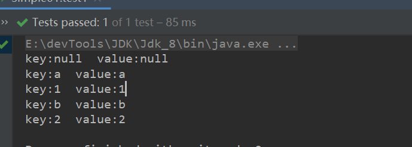
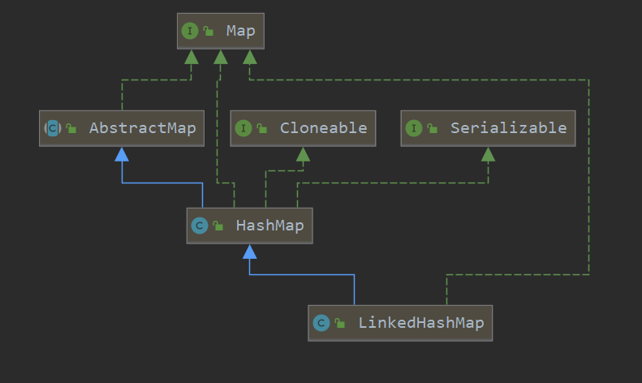
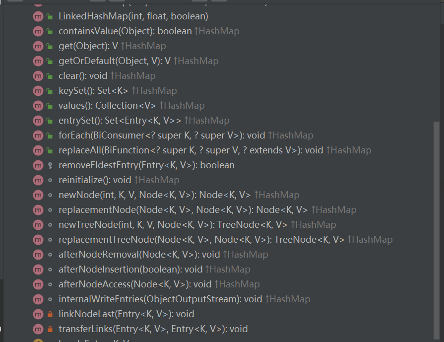
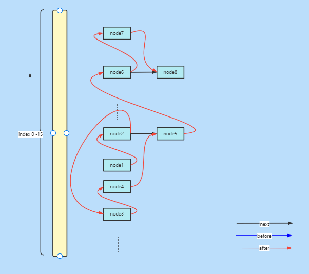
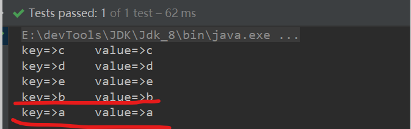

本文学习LinkedHashMap，原理、特点。加深对HashMap及LinkedList的理解。

> [xxx]()


### 简介

​	LinkedHashMap是一个有序的Map集合，它牺牲了时间与空间，通过使用HashMap来操作数据，双向链表来保证访问顺序，来实现有序访问。LinkedHashMap可以理解为HashMap+LinkedList。

​	理解LinkedHashMap的前提是，理解HashMap和多态，同样的理解了LinkedHashMap对HashMap的和多态的理解也会加深。

HashMap作为散列表，是不支持有序访问的，可以简单验证一下。

```java
@Test
public void test1() {
    Map<Object, Object> map = new HashMap<>();
    map.put("b", "b");
    map.put("a", "a");
    map.put(2, 2);
    map.put(1, 1);
    map.put(null, null);
    map.forEach((key,value)->{
        System.out.println("key:"+key+"  "+"value:"+value);
    });
}
```



可以发现HashMap的访问顺序是和插入顺序不一致的，但在实际应用中，有时是需要一个在访问时存在顺序的集合的，所以LinkedHashMap它来了。


<hr>


### 类图

其实LinkedHashMap就是HashMap的一个子类，所以说LinkedHashMap是基于HashMap实现的。



再看一下它的一些方法，除了少数自有的，基本上都是对HashMap中方法的重写，并且没有提供直接操作数据的方法，比如说（put）




<hr>


### 属性

```java
//序列号，支持序列化传输
private static final long serialVersionUID = 3801124242820219131L;
//双向链表头结点
transient LinkedHashMap.Entry<K,V> head;
//双向链表尾结点
transient LinkedHashMap.Entry<K,V> tail;
//访问顺序、默认false（按插入顺序访问）  true则为最近未使用顺序
final boolean accessOrder;
```


<hr>


### 内部类


#### Entry<K,V>

HashMap.Node<K,V>的子类，这里做了拓展，添加了前继节点和后继节点两个属性。

```java
static class Entry<K,V> extends HashMap.Node<K,V> {
    Entry<K,V> before, after;
    Entry(int hash, K key, V value, Node<K,V> next) {
        super(hash, key, value, next);
    }
}
```


#### LinkedKeySet

> LonkedHashMap的KeySet集合，可以发现，它的foreach方法不再是遍历数组了，而是以头尾节点引用的形势遍历。

```java
final class LinkedKeySet extends AbstractSet<K> {
    public final int size()                 { return size; }
    public final void clear()               { LinkedHashMap.this.clear(); }
    public final Iterator<K> iterator() {
        return new LinkedKeyIterator();
    }
    public final boolean contains(Object o) { return containsKey(o); }
    public final boolean remove(Object key) {
        return removeNode(hash(key), key, null, false, true) != null;
    }
    public final Spliterator<K> spliterator()  {
        return Spliterators.spliterator(this, Spliterator.SIZED |
                                        Spliterator.ORDERED |
                                        Spliterator.DISTINCT);
    }
    public final void forEach(Consumer<? super K> action) {
        if (action == null)
            throw new NullPointerException();
        int mc = modCount;
        for (LinkedHashMap.Entry<K,V> e = head; e != null; e = e.after)
            action.accept(e.key);
        if (modCount != mc)
            throw new ConcurrentModificationException();
    }
}
```


#### LinkedValues

> LonkedHashMap的ValueCollection集合。


#### LinkedEntrySet

> LonkedHashMap的EntrySet集合。


### 构造方法

> 这五个构造方法都会调用其父类HashMap对应的构造方法，

```java
public LinkedHashMap(int initialCapacity, float loadFactor) {
    super(initialCapacity, loadFactor);
    accessOrder = false;
}

public LinkedHashMap(int initialCapacity) {
    super(initialCapacity);
    accessOrder = false;
}

public LinkedHashMap() {
    super();
    accessOrder = false;
}

public LinkedHashMap(Map<? extends K, ? extends V> m) {
    super();
    accessOrder = false;
    putMapEntries(m, false);
}

public LinkedHashMap(int initialCapacity,
                     float loadFactor,
                     boolean accessOrder) {
    super(initialCapacity, loadFactor);
    this.accessOrder = accessOrder;
}
```


<hr>


### 基本方法

> 简单罗列一下LinkedHashMap提供的基本方法。


#### containsValue(Object value)

> 是否存在指定value。有序的遍历LinkedHashMap，存在符合节点返回true，反之返回false。

```java
public boolean containsValue(Object value) {
    for (LinkedHashMap.Entry<K,V> e = head; e != null; e = e.after) {
        V v = e.value;
        if (v == value || (value != null && value.equals(v)))
            return true;
    }
    return false;
}
```


#### clear()

> 清除数据。调用父类方法，将所有节点置位null(help  GC)，并将双向链表头尾节点置位null。

```java
public void clear() {
    super.clear();
    head = tail = null;
}
```


#### keySet()

> 获取keySet实例。

```java
public Set<K> keySet() {
    Set<K> ks = keySet;
    if (ks == null) {
        ks = new LinkedKeySet();
        keySet = ks;
    }
    return ks;
}
```


####  values()

> 获取value集合实例。

```java
public Collection<V> values() {
    Collection<V> vs = values;
    if (vs == null) {
        vs = new LinkedValues();
        values = vs;
    }
    return vs;
}
```


#### entrySet()

> 获取entrySet实例。

```java
public Set<Map.Entry<K,V>> entrySet() {
    Set<Map.Entry<K,V>> es;
    return (es = entrySet) == null ? (entrySet = new LinkedEntrySet()) : es;
}
```


#### replaceAll

> 替换所有符合条件的value值。

这是一个函数式接口，需要重写apply方法逻辑。

```java
public void replaceAll(BiFunction<? super K, ? super V, ? extends V> function) {
    if (function == null)
        throw new NullPointerException();
    int mc = modCount;
    for (LinkedHashMap.Entry<K,V> e = head; e != null; e = e.after)
        e.value = function.apply(e.key, e.value);
    if (modCount != mc)
        throw new ConcurrentModificationException();
}
```

例子：

> 替换所有value值为null的为"default"。

```java
@Test
public void testReplaceAll() {

    Map<Object, Object> map = new HashMap<>();
    map.put("b", "b");
    map.put("a", "a");
    map.put(2, null);
    map.put(1, null);
    map.put(null, null);
    //替换所有value值为null的节点，为字符串"defult"

    map.replaceAll((key, value) -> {
        Object obj = (value == null) ? "default" : value;
        return obj;
    });

    map.forEach((key,value)->{
        System.out.println("key:" + key + "  " + "value:" + value);
    });
}
```


####  reinitialize()

> 重新初始化。和Clear不同的是，这个方法会将模数清零。

```java
void reinitialize() {
    super.reinitialize();
    head = tail = null;
}
```


#### newNode

> 重写了HashMap的newNode方法，也是多态的表现之一。

添加了节点加入双向链表的操作。

```java
Node<K,V> newNode(int hash, K key, V value, Node<K,V> e) {
    LinkedHashMap.Entry<K,V> p =
        new LinkedHashMap.Entry<K,V>(hash, key, value, e);
    linkNodeLast(p);
    return p;
}
```

### 源码解读

> 对于源码的分析，就是对HashMap源码分析，以及对多态的理解。

因为LinkedHashMap是HashMap的子类，所以LinkedHashMap拥有父类的所有方法和属性，包括私有属性和方法，但是对于私有属性和方法不可访问（也就是不可以调用父类的私有属性和方法）。


#### put方法

> linkedHashMap没有直接提供存放数据的方法，会调用HashMap的put方法。对比着看LinkedHashMap做了哪些事。

主要看这个重载方法：newNode

```java
tab[i] = newNode(hash, key, value, null);
```

对比HashMap的newNode方法，LinkedHashMap多做了哪些事？

```java
Node<K,V> newNode(int hash, K key, V value, Node<K,V> e) {
    LinkedHashMap.Entry<K,V> p =
        new LinkedHashMap.Entry<K,V>(hash, key, value, e);
    linkNodeLast(p);
    return p;
}
```

新建节点的方式没有什么不同，只是多了一个linkNodeLast()操作，这也是LinkedHashMap有序的原因，它除了会将节点散列到节点数组外，还会维护一个双向链表，来保证有序性。

图示：before这条件就不画了，就是after掉个头。




#### get方法

> 在开头我们就说，LinkedHashMap牺牲时间与空间来保证节点的有序性，具体表现在插入节点和和插入节点的后续操作上，在get节点时，还是一样的，是通过key值的hash特征来匹配的。所以这个方法和hashMap没有区别。


不同之处，方法：getOrDefault

> 对于get的结果没有影响，不同之处在于accessOrder为true之后的操作，会影响遍历顺序。

```java
public V getOrDefault(Object key, V defaultValue) {
    Node<K,V> e;
    if ((e = getNode(hash(key), key)) == null)
        return defaultValue;
    if (accessOrder)
        afterNodeAccess(e);
    return e.value;
}
```


#### 操作节点的后续操作

> 在hashMap中存在这三个方法，出现在对节点数组进行操作的后续操作，hashMap中这三个方法，啥事没做，那么在LinkedHashMap中呢？

```java
void afterNodeAccess(Node<K,V> p) { }
void afterNodeInsertion(boolean evict) { }
void afterNodeRemoval(Node<K,V> p) { }
```


- afterNodeAccess

> 这个方法出现在get操作后，也就是访问节点后，目的是将节点移动到双向链表后，表示遍历顺序为最近最长未使用顺序遍历。

```java
void afterNodeAccess(Node<K,V> e) { // move node to last
    LinkedHashMap.Entry<K,V> last;
    //访问属性为最近最长时间未使用顺序遍历，且节点不是双向链表的尾结点
    if (accessOrder && (last = tail) != e) {
        //新建节点引用p   b、a分别为p节点前继节点后后继节点
        LinkedHashMap.Entry<K,V> p =
            (LinkedHashMap.Entry<K,V>)e, b = p.before, a = p.after;
        //将p后继节点置位null，准备将其移动到尾结点
        p.after = null;
        //b为null，表示p节点为头结点
        if (b == null)
            //p节点后继节点为头结点
            head = a;
        else
            b.after = a;
        if (a != null)
            a.before = b;
        //a为null，表示p节点为尾结点
        else
            last = b;
        if (last == null)
            head = p;
        //将p节点连接到双向链表尾部
        else {
            p.before = last;
            last.after = p;
        }
        tail = p;
        ++modCount;
    }
}
```

可以测试一下：

```java
@Test
public void testAfterAccess() {

    Map<String, Object> map = new LinkedHashMap<>(16, 0.75f, true);
    map.put("a", "a");
    map.put("b", "b");
    map.put("c", "c");
    map.put("d", "d");
    map.put("e", "e");

    //直接遍历是按插入顺序遍历的
    //map.forEach((key,value)->{
    //    System.out.println("key=>"+key+"    "+"value=>"+value);
    //});
    
    //执行访问操作，被访问节点会移动到，双向链表尾部。
    map.get("b");
    map.get("a");

    map.forEach((key,value)->{
        System.out.println("key=>"+key+"    "+"value=>"+value);
    });
}
```



- afterNodeInsertion 

> 这个方法在  HashMap 和LinkedHashMap 中不起作用。


- afterNodeRemoval

> 在移除节点时调用,unlink该节点。

```java
void afterNodeRemoval(Node<K,V> e) { // unlink
    LinkedHashMap.Entry<K,V> p =
        (LinkedHashMap.Entry<K,V>)e, b = p.before, a = p.after;
    //准备断开节点
    p.before = p.after = null;
    //当前节点为双向链表头结点，其后继节点置为头结点
    if (b == null)
        head = a;
    else
        b.after = a;
    if (a == null)
        tail = b;
    else
        a.before = b;
}
```


### 遍历

> 介绍一下linkedHashMap的遍历方式，和hashMap大同小异，只不过LinkedHashMap作为有序的Map集合，它的遍历是以双向链表的顺序遍历的。


#### LinkedHashMap提供的foreach方法

> 一个函数式接口。

```java
@Test
public void testAfterAccess() {
    Map<String, Object> map = new LinkedHashMap<>();
    map.put("a", "a");
    map.put("b", "b");
    map.put("c", "c");
    map.put("d", "d");
    map.put("e", "e");
    //直接遍历是按插入顺序遍历的
    map.forEach((key,value)->{
        System.out.println("key=>"+key+"    "+"value=>"+value);
    });
}
```


#### LinkedEntrySet

> 获取entry的set集合，进行遍历。

有四种遍历方式

```java
//实现 collection接口
Set<Map.Entry<String, Object>> entries = map.entrySet();
System.out.println("==========collection提供的Stream  api==========");
entries.stream().forEach((entry) -> {
    System.out.println("key=>" + entry.getKey() + "    " + "value=>" + entry.getValue());
});

System.out.println("==========iterable 提供的 foreach方法==========");
entries.forEach((entry) -> {
    System.out.println("key=>" + entry.getKey() + "    " + "value=>" + entry.getValue());
});

System.out.println("==========for循环==========");
for (Map.Entry<String, Object> entry : entries) {
    System.out.println("key=>" + entry.getKey() + "    " + "value=>" + entry.getValue());
}

System.out.println("==========迭代器==========");
Iterator<Map.Entry<String, Object>> iterator = entries.iterator();
while (iterator.hasNext()){
    System.out.println(iterator.next());
}
```

> 还有我们知道，hashMap存在分离器也是可以实现遍历的，LinkedHashMap作为HashMap的子类也可以实现。

```java
Spliterator<Map.Entry<String, Object>> spliterator = map.entrySet().spliterator();

System.out.println("//方式一");
while (spliterator.tryAdvance((entry)->{
    System.out.println(entry);
}));

System.out.println("//方式二");
spliterator.forEachRemaining((entry)->{
    System.out.println(entry);
});
```


### 总结

对于LinkedHashMap需要了解哪些呢？

- LinkedHashMap是Has和Map的子类，器实现基于HashMap
- LinkedHashMap是有序的，可以认为，LinkedHashMap是HashMap+LinkedList
- LinkedHashMap结构。
- 两种遍历顺序：①插入顺序②最近最长时间未使用
- 遍历方式
  - ①自提供的foreach方法
  - ②获取entrySet集合使用Collection接口提供的遍历方法
  - ③使用迭代器
  - ④使用hashMap提供的分离器