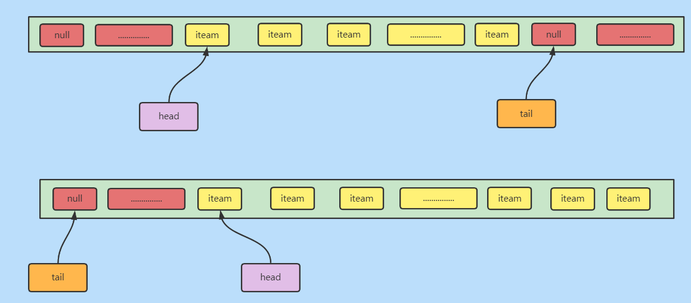
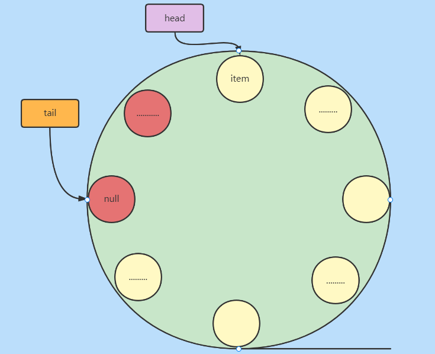

ArrayQueue 有界、单向循环队列。


### 简介

​	ArrayQueue是一个表现为先进先出(FIFO)的循环队列。底层以数组的形式保存数据。通过头尾指针来管理入队出队操作。

​	这是一个非常古老的类，学这个队列没啥用处，只有一点：它管理入队和出队操作的方案。


### 属性

```java
//容量【数组长度】，长度实际为自定义长度加1
private int capacity;
private T[] queue;
//头尾指针
private int head;
private int tail;
```


### 入队

> 元素会加入tail所对应数组下标处。
>
> 使用取余操作确定下一个下标。

无论是HashMap还是ArrayDeque都是以位运算来确认的，而这里使用的取余操作，可见这个类古老。

- ArrayDeque

```java
tail = (tail + 1) & (elements.length - 1)
```

- HashMap

```java
tab[i = (n - 1) & hash]
```

而ArrayQueue

```java
public boolean add(T o) {
    queue[tail] = o;
    int newtail = (tail + 1) % capacity;
    if (newtail == head)
        throw new IndexOutOfBoundsException("Queue full");
    tail = newtail;
    return true; // we did add something
}
```


### 出队

> 移除head所对应数组下标处元素。
>
> 同样的取余操作确定下一个需要被移除元素下标处。

```java
public T remove(int i) {
    if (i != 0)
        throw new IllegalArgumentException("Can only remove head of queue");
    if (head == tail)
        throw new IndexOutOfBoundsException("Queue empty");
    T removed = queue[head];
    queue[head] = null;
    head = (head + 1) % capacity;
    return removed;
}
```


### 结构





就可以想想成一个园。

