非阻塞、同步队列：ConcurrentLinkedQueue。使用cas保证线程安全。


### 简介

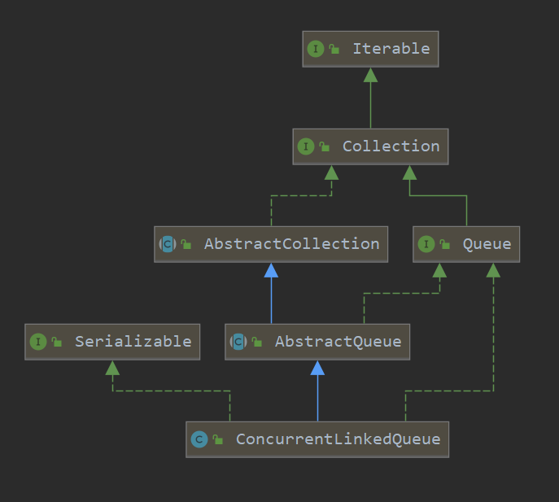

看一下它的类结构图，可以说这是最简单的非阻塞、同步队列。

实现了Queue接口，继承AbstractQueue，具体表现为一个非阻塞、同步、无界、单向、FIFO（先进先出）基于单向链表实现的单向队列，元素会以尾插法入队，出队则需要从队列头部出队。


head和tail具有一定的延时性，也就是head和tail节点并不一定是头尾节点，是否是尾节点的判断依据是其后继节点为空。

- 不允许添加null节点
- 尾节点的判断依据是其后继节点为空
- 队列中所有未删除的节点的item都不能为null且都能从head节点遍历到

- 删除节点是将item设置为null, 队列迭代时跳过item为null节点
- head节点跟tail不一定指向头节点或尾节点，可能存在滞后性


### 属性&内部类


#### Node

> 包含当前节点value值，以及后继节点的引用。
>
> 重要的是对其内部的cas操作理解。

```java
private static class Node<E> {
    volatile E item;
    volatile Node<E> next;
    
    Node(E item) {
        UNSAFE.putObject(this, itemOffset, item);
    }

    boolean casItem(E cmp, E val) {
        return UNSAFE.compareAndSwapObject(this, itemOffset, cmp, val);
    }

    void lazySetNext(Node<E> val) {
        UNSAFE.putOrderedObject(this, nextOffset, val);
    }

    boolean casNext(Node<E> cmp, Node<E> val) {
        return UNSAFE.compareAndSwapObject(this, nextOffset, cmp, val);
    }

    // Unsafe mechanics
    private static final sun.misc.Unsafe UNSAFE;
    private static final long itemOffset;
    private static final long nextOffset;

    static {
        try {
            UNSAFE = sun.misc.Unsafe.getUnsafe();
            Class<?> k = Node.class;
            itemOffset = UNSAFE.objectFieldOffset
                (k.getDeclaredField("item"));
            nextOffset = UNSAFE.objectFieldOffset
                (k.getDeclaredField("next"));
        } catch (Exception e) {
            throw new Error(e);
        }
    }
}
```

volatile+cas保证线程安全。

- casItem()  和casNex() 方法

  cas修改该节点的value值，保证内存可见性、有序性、原子性。

- lazySetNext() 方法

  延时设置尾节点，也就是尾节点存在延时。

  

​				Node类中的lazySetNext(Node<E> val)方法，可以理解为延迟设置Next，内部是使用UNSAFE类的putOrderedObject方法实现，putOrderedXXX方法是putXXXVolatile方法的延迟实现，不保证值的改变被其他线程立即看到。为什么要lazySetNext这个方法呢？其实它是一种低级别的优化手段，就是在不需要让共享变量的修改立刻让其他线程可见的时候，以设置普通变量的方式来修改共享状态，可以减少不必要的内存屏障，从而提高程序执行的效率。

　　　　《Java内存模型中》提到volatile变量可以实现可见性，其原理就是插入内存屏障以保证不会重排序指令，使用的是store-load内存屏障，开销较大。UNSAFE类的putOrderedXXX方法则是在指令中插入store-store内存屏障，避免发生写操作重排序，由于StoreStore屏障的性能损耗小于StoreLoad屏障，所以lazySetNext方法比直接写volatile变量的性能要高。需要注意的是，store-store屏障仅可以避免写写重排序，不保证内存可见性。

　　　

​				如此设计的目的是：在ConcurrentLinkedList中，对于节点是否是尾节点的判定是其后继节点是否为空，如果为空该节点是尾节点，不为空则不是尾节点。


<hr>


#### 属性

```java
//头结点
private transient volatile Node<E> head;
//尾结点
private transient volatile Node<E> tail;
//UNSAFE实例，提供操作内存方法
private static final sun.misc.Unsafe UNSAFE;
//头结点偏移量。可以理解为，用于快速检索head节点内存地址的长整型。
private static final long headOffset;
//尾结点偏移量。
private static final long tailOffset;
//静态代码块，对final变量初始化
static {
    try {
        UNSAFE = sun.misc.Unsafe.getUnsafe();
        Class<?> k = ConcurrentLinkedQueue.class;
        headOffset = UNSAFE.objectFieldOffset
            (k.getDeclaredField("head"));
        tailOffset = UNSAFE.objectFieldOffset
            (k.getDeclaredField("tail"));
    } catch (Exception e) {
        throw new Error(e);
    }
}
```


### 入队

```java
public boolean offer(E e) {
    //检查是否为空，不允许添加空元素
    checkNotNull(e);
    final Node<E> newNode = new Node<E>(e);
	//首次循环 p、t指向tail
    for (Node<E> t = tail, p = t;;) {
        //q是p的后继节点
        Node<E> q = p.next;
        //q为空，那么p为尾节点
        if (q == null) {
            //cas修改p（尾节点）的后继节点
            if (p.casNext(null, newNode)) {
                //首次添加时，p 等于t，不进行尾节点更新，所以所尾节点存在滞后性  
                //并发环境，可能存添加/删除，tail就更难保证正确指向最后节点。
                if (p != t) // hop two nodes at a time
                    casTail(t, newNode);  // Failure is OK.
                return true;
            }
            // Lost CAS race to another thread; re-read next
        }
        else if (p == q)
            p = (t != (t = tail)) ? t : head;
        else
            //通过q = p.next 推动tail尾节点往队尾移动
            p = (p != t && t != (t = tail)) ? t : q;
    }
}
```

图示梳理一下：

模拟添加三个节点A、B、C：

> 第一步初始化队列

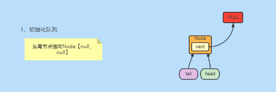

> 添加A节点，首次添加元素，P、T指向tail。

当(q = p.next ) == null时，也就是p是尾节点时，cas修改p的后继节点为ANode。

此刻尾节点tail并不是队列的最后一个节点，这也是为什么说ConcurrentLinkedQueue的tail节点具有滞后性。

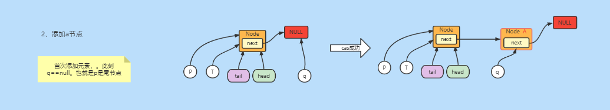


> 添加B节点。

首次循环时 ==(q = p.next ) ！= null==，会做 ==p = （q=p.next)==操作，也就是将p节点一点点往尾部移动。

第二次循环==(q = p.next ) == null==，此刻p是尾节点，cas修改p的后继节点为BNode。此时p和t没有指向同一个节点，也就是  ==p!=t==，cas设置尾节点。

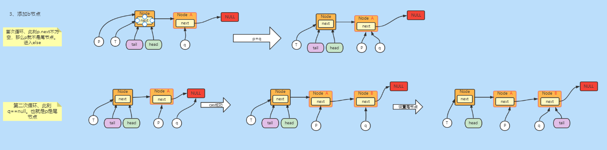


> 添加C节点。和添加A节点是一个道理。

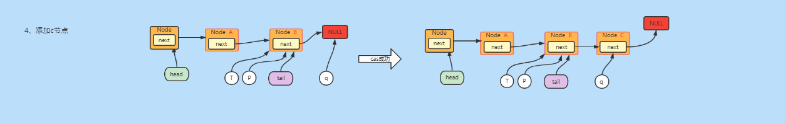


如上只是单线程环境下，想要深入理解，得结合多线程加深理解。


<hr>


### 出队

> 先看一下，queue定义的获取元素方法------peek()

- peek()方法，当队列为空返回null，否则返回队列首个节点item。
- 当p的后继引用为自引用时，需要重新获取头节点。（因为从头节点可以遍历到队列任何节点）

在我们映像里peek()方法不会对队列做任何修改，但这里会更新头节点。我的理解是安全吧，因为在p的item不为空或p为尾节点时，可以确认的当前p一定是队列的首个节点，那么就可以更新，同时这是一个cas操作，不会影响同步状态。


```java
public E peek() {
    restartFromHead:
    for (;;) {
        //p,h指向头节点
        for (Node<E> h = head, p = h, q;;) {
            E item = p.item;
            //获取元素条件为：item不为空  或 队列为空（p为尾节点）
            if (item != null || (q = p.next) == null) {
                //更新头节点
                updateHead(h, p);
                return item;
            }
            //当p的后继引用为自引用时，需要重新获取头节点
            else if (p == q)
                //这是一个带标签的continue
                continue restartFromHead;
            else
                //p节点后移
                p = q;
        }
    }
}
```


> poll()方法

出队操作，将队列首个节点item置为null，当p != h时，cas修改头节点，并将头节点next改为自引用。

```java
public E poll() {
    //continue标签
    restartFromHead:
    for (;;) {
        //首次循环p、h指向head
        for (Node<E> h = head, p = h, q;;) {
            E item = p.item;
            //p所指向的节点item不为空且cas成功
            if (item != null && p.casItem(item, null)) {
                if (p != h) // hop two nodes at a time
                    updateHead(h, ((q = p.next) != null) ? q : p);
                return item;
            }
            //p.next==null  p为尾节点，返回null
            else if ((q = p.next) == null) {
                updateHead(h, p);
                return null;
            }
            // p==q  说明落伍，重新获取头节点
            else if (p == q)
                continue restartFromHead;
            //否则后移
            else
                p = q;
        }
    }
}
```

图示梳理一下：

模拟移除三个节点A、B、C：

> poll()之前队列的状态

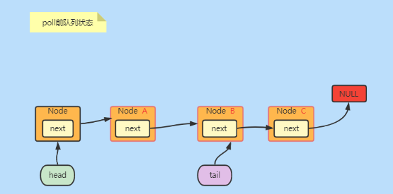


> A出队。

第一次循环：

p = h =head; 

首次循环时，p指向初始化的头节，其item为null。执行  p = q(q = p.next)，即后移。

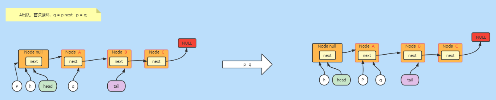

第二次循环：

p.item !=null 。cas设置p的item为null，此刻p!=h，跟新头节点。

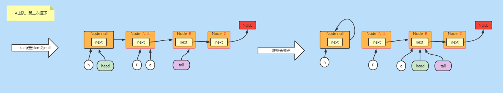


> B出队。

p.item ！=null  ，直接cas设置p的item为null，此刻p==h，直接返回，不用跟新头节点。

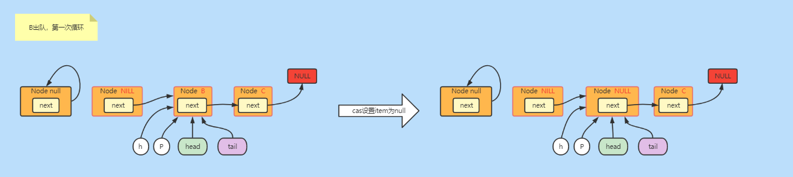


> C出队

第一次循环：

p = h =head; 

首次循环时，p 指向  item已被置为null的B节点。执行  p = q(q = p.next)，即后移。

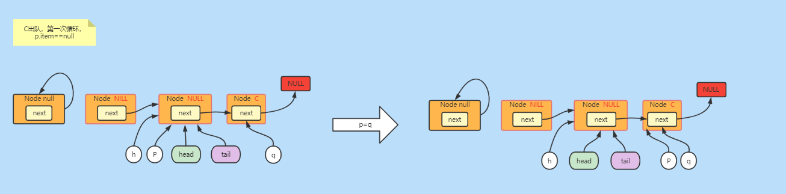

第二次循环：

p.item !=null 。cas设置p的item为null，此刻p!=h，跟新头节点。

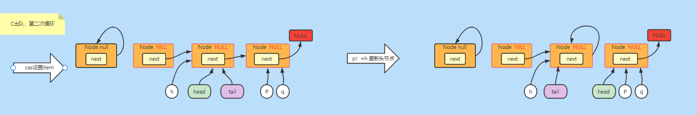


#### 尾节点被移除问题

上面图示操作，很明显的，移除c节点的时候，将tail也移除了。

此刻我们再添加一个新节点D。

> 添加D节点

首次循环：

p = t =tail。 此刻 q= p.next  。p q t指向同一个节点。  进入q==p分支 `p = (t != (t = tail)) ? t : head;`

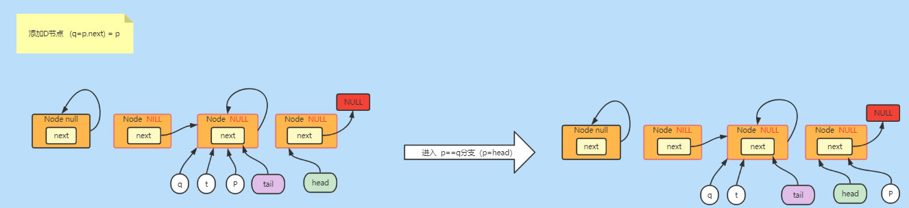

第二次循环：

p = q.next  为null。cas设置p节点后继节点为D节点。

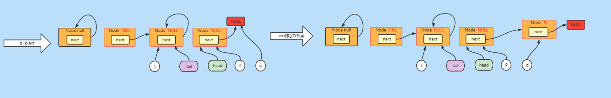

此刻p!=t，更新尾节点。

哎尾节点就又来了。

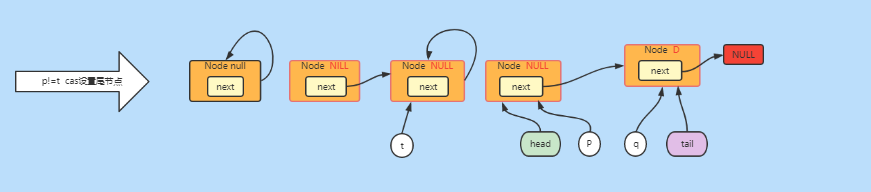