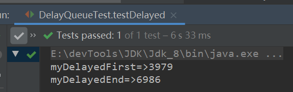

本文学习，DelayQueue


> [xxxxx]()


### 简介

​	DelayQueue是一个延时的、同步的、有序的、无界的阻塞队列。实现了BlockingQueue接口，基于PriorityQueue实现，使用PriorityQueue存储元素。只能存放实现了Delayed接口的对象，其中的对象只能在其延时时间才能从队列中取走。因为此队列基于PriorityQueue实现所以不可存放Null。


<hr>


### Delayed接口

> 延期的意思，获取延期剩余时间(这个时间可自定义单位)

实现它必须重写`getDelay(TimeUnit unit)`和`public int compareTo(T o);`方法。

```java
public interface Delayed extends Comparable<Delayed> {
    long getDelay(TimeUnit unit);
}
```

#### 简单使用

> 自定义一个`MyDelayed`实现`Delayed`接口。

```java
class MyDelayed implements Delayed {
    //延时时间
    long delayTime;
    //创建时间
    final long creatTime = System.currentTimeMillis();
    //时间单位, 默认Nanos
    TimeUnit timeUnit = TimeUnit.NANOSECONDS;
    public MyDelayed(long delayTime, TimeUnit timeUnit) {
        this.delayTime = delayTime;
        this.timeUnit = timeUnit;
    }
    public MyDelayed(long delayTime) {
        this.delayTime = delayTime;
    }
    @Override
    public int compareTo(Delayed o) {
        if (this.getDelay() < o.getDelay(timeUnit))
            return -1;
        else if (this.getDelay() > o.getDelay(timeUnit))
            return 1;
        else
            return 0;
    }
    @Override
    public long getDelay(TimeUnit unit) {
        return unit.convert(creatTime - System.currentTimeMillis() + delayTime, timeUnit);
    }
    public long getDelay() {
        return this.getDelay(timeUnit);
    }
}
```

#### 测试

> 定义两个`Mydelayed`延时时间都为10000(毫秒)。

```java
@Test
public void testDelayed() throws InterruptedException {
    MyDelayed myDelayedFirst = new MyDelayed(10000);
    Thread.sleep(3000);
    MyDelayed myDelayedEnd = new MyDelayed(10000);
    Thread.sleep(3000);
	System.out.println("myDelayedFirst=>" + myDelayedFirst.getDelay());
    System.out.println("myDelayedEnd=>" + myDelayedEnd.getDelay());
}
```



除去程序本身的运行时间，一个是4000一个是7000差不多。


<hr>


### 属性

```java
//锁
private final transient ReentrantLock lock = new ReentrantLock();
//基于PriorityQueue实现，使用其存储数据
private final PriorityQueue<E> q = new PriorityQueue<E>();
//指定等待队列头部元素的线程，以避免不必要的定时等待
private Thread leader = null;
//等待队列
private final Condition available = lock.newCondition();
```


说明：Condition的await()和awaitNanos()这两个等待方法区别

**线程状态区别：**

- await()方法，会使线程进入入WAITING状态。

- awaitNanos(Long long)方法，当超时时间未过会使线程进入TIMED_WAITING状态，当超时时间过了线程线程并未获取锁资源进入入WAITING状态。

**锁状态以及cpu时间片**

- 两个方法都会释放锁以及交出cpu分配的时间片。

**唤醒机制**

- await()方法必须等待其他线程调用signal()方法才可以被唤醒、并且竞争获取锁才可以继续执行。

- awaitNanos()方法

  ①在超时时间内其他线程调用signal()方法会立刻唤醒等待线程、并且竞争获取锁才可以继续执行。

  ②超过超时时间但其他线程未释放锁资源，该线程会继续等待，直到其他线程释放锁资源、且竞争获取锁才可以继续执行。

  ③其他线程可以无需调用signal()方法，当超时时间过了以后，只要锁资源完全释放，且竞争获取锁就可以继续执行。


<hr>


### 构造器

> 很简单的两个构造器，一个有初始值的、一个没有初始值的。

```java
public DelayQueue() {}
public DelayQueue(Collection<? extends E> c) {
    this.addAll(c);
}
```


<hr>


### 添加方法

> 主要看这个offer(E e)方法。

- add() 会调用 offer()。添加成功会返回true。
- put() 会调用offer()

```java
public boolean offer(E e) {
    final ReentrantLock lock = this.lock;
    lock.lock();
    try {
        //节点加入PriorityQueue队列，并调整顺序，延时时间最短的在数组首节点
        q.offer(e);
        //当前所添加节点，最小（延时时间最短）。通知leader线程唤醒（减少不必要等待），去拿取最新的。
        if (q.peek() == e) {
            leader = null;
            available.signal();
        }
        return true;
    } finally {
        lock.unlock();
    }
}
```


<hr>


### 获取方法

> 基本上顺序是：①q.peek()获取元素②判断是否达到延时时间。对于未达到超时时间的分为等待和直接返回null。

**不会等待的**

- peek()方法

  无视超时时间是否达到，直接返回队列首个节点（不会对队列做修改）

- poll()方法

  如果队列为空或未达到超时时间，返回null。

  否则调用PriorityQueue.poll()出队。

```java
public E peek() {
    final ReentrantLock lock = this.lock;
    lock.lock();
    try {
        return q.peek();
    } finally {
        lock.unlock();
    }
}

public E poll() {
    final ReentrantLock lock = this.lock;
    lock.lock();
    try {
        E first = q.peek();
        if (first == null || first.getDelay(NANOSECONDS) > 0)
            return null;
        else
            return q.poll();
    } finally {
        lock.unlock();
    }
}
```


**会等待的：**


```java
public E take() throws InterruptedException {
    final ReentrantLock lock = this.lock;
    lock.lockInterruptibly();
    try {
        for (;;) {
            //获取队列首个节点
            E first = q.peek();
            //队列为空就等待
            if (first == null)
                available.await();
            else {
                //获取该节点的延时时长
                long delay = first.getDelay(NANOSECONDS);
                //达到延时时长，出队
                if (delay <= 0)
                    return q.poll();
                //等待时不保留引用
                first = null; // don't retain ref while waiting
                //等待队列获取头部元素的线程不为空，等待。此等待必须被唤醒
                if (leader != null)
                    available.await();
                else {
                    //指定等待队列获取头部元素的线程为当前线程
                    Thread thisThread = Thread.currentThread();
                    leader = thisThread;
                    try {
                        //等待。达到超时时间且可以获取锁继续执行
                        available.awaitNanos(delay);
                    } finally {
                        //leader线程唤醒，设置leader为空
                        if (leader == thisThread)
                            leader = null;
                    }
                }
            }
        }
    } finally {
        //leader已经获取了节点，唤醒等待队列下的线程
        if (leader == null && q.peek() != null)
            available.signal();
        lock.unlock();
    }
}
```


<hr>


### 这个东西呢能做什么

> 可以有一些延时或超时的场景的使用

- 客户端空闲一段时间，服务器关闭连接
- 订单超时时间内之内未支付，取消订单

我们以订单超时为例：

同时可以使用remove()方法来模拟订单支付，跳出支付等待队列。

```java
package com.roily.queue.blockingqueue.delayQueue;

import lombok.Data;

import java.util.Objects;
import java.util.concurrent.DelayQueue;
import java.util.concurrent.Delayed;
import java.util.concurrent.TimeUnit;

/**
 * @version 1.0.0
 * @Description 订单超时自动取消连接
 * @ClassName DelayQueueDemo.java
 * @author: RoilyFish
 * @date: 2022/5/6 23:16
 */
public class DelayQueueDemo {

    //待取消订单队列
    static DelayQueue<Order> orderQueue = new DelayQueue<>();

    public static void main(String[] args) throws InterruptedException {
        Thread addT = new Thread(() -> {
            //不停生成订单
            String orderNo = "YYC" + System.currentTimeMillis();
            long delayTime = 0L;
            while (true) {
                //随机生成延时时间
                delayTime = (long) (Math.random() * 10) * 1000;
                //生成订单
                Order order = new Order(orderNo, delayTime);
                if (orderQueue.add(order)) {
                    try {
                        System.out.println(order.getOrderNo()+"号订单添加到队列，等待时长为=>"+order.getDelay());
                        Thread.sleep(100);
                    } catch (InterruptedException e) {
                        e.printStackTrace();
                    }
                }

                orderNo = "YYC" + System.currentTimeMillis();
            }


        }, "线程T1：");

        Thread takeT = new Thread(() -> {
            //不停取

            while (true) {
                try {
                    Order order = orderQueue.take();
                    System.out.println(order.getOrderNo() + "号订单被取消");
                } catch (InterruptedException e) {
                    e.printStackTrace();
                }

            }
        }, "线程T2：");

        takeT.start();

        addT.start();
        //主线程一直运行
        while (true);

    }

    //模拟支付完成 退出等待队列
    public static void removeOrder() {
        String hadPay = "线程T2：1";
        //线程T2：9
        orderQueue.remove(new Order(hadPay,0l));

        System.err.println(hadPay + "号订单已经完成支付、退出等待队列");
    }
}

@Data
class Order implements Delayed {

    //订单创建时间
    private final Long createTime = System.currentTimeMillis();

    //默认订单，默认时间单位
    private static TimeUnit overTimeUnit = TimeUnit.MILLISECONDS;

    //超时时间
    private Long delayedTime;

    //订单编号
    private String orderNo;

    public Order(String orderNo, Long delayedTime) {
        this.orderNo = orderNo;
        this.delayedTime = delayedTime;
    }

    @Override
    public long getDelay(TimeUnit unit) {

        long delayTime = unit.convert(delayedTime - (System.currentTimeMillis() - createTime), overTimeUnit);

        return delayTime;
    }

    public long getDelay() {
        return getDelay(overTimeUnit);
    }

    @Override
    public int compareTo(Delayed o) {

        return this.getDelay(overTimeUnit) >= o.getDelay(overTimeUnit) ? 1 : -1;

    }

}
```

