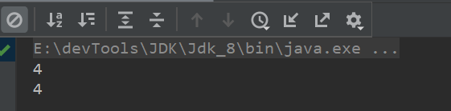
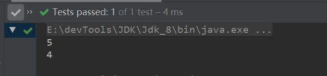
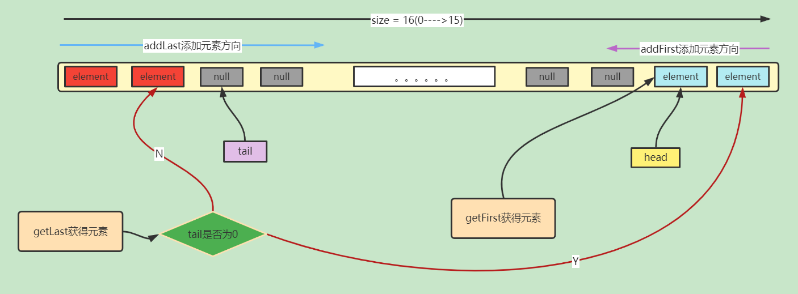
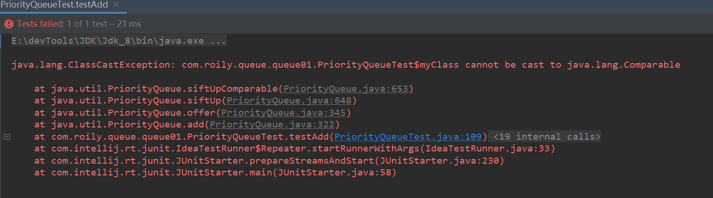
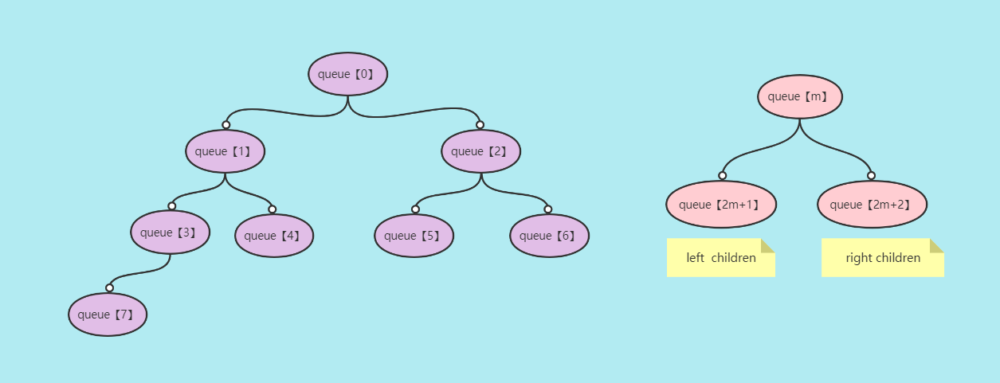
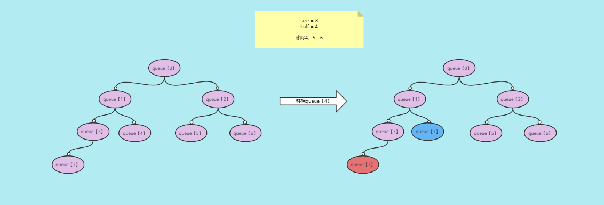
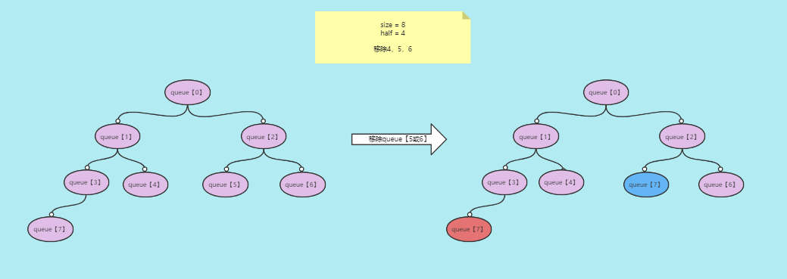
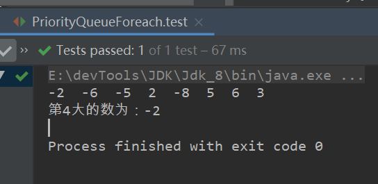

Java 集合，分为两大类，对应两个接口：一个是 `Collection`接口，用于存放单一节点元素；另一个是 `Map` 接口，用于存放键值对。对于`Collection` 接口，下面又有三个主要的子接口：`List`、`Set` 和 `Queue`。本文学习`Queue`--队列。


> [xxxx]()


### Queue与Dqueue

`Queue` 是单端队列，即只能从一端插入元素，另一端删除元素，实现上一般遵循 **先进先出（FIFO）** 规则。

`Queue` 继承`Collection` 接口，对其做了拓展，根据 **因为容量问题而导致操作失败后处理方式的不同** 可以分为两类方法: 一种在操作失败后会抛出异常，另一种则会返回特殊值。

-  add(E e)    会抛出IllegalStateException("Queue full");
- remove()和element()   会抛出NoSuchElementException();

|              |             抛出异常             |            返回特殊值             |
| :----------: | :------------------------------: | :-------------------------------: |
|   插入队尾   | boolean add(E e)  Queue full异常 | boolean offer(E e);    false/true |
|   删除队首   |            E remove()            |    E poll()   null/对应element    |
| 获取队首元素 |           E element();           |    E peek();  null/对应element    |


`Deque` 是双端队列，在队列的两端均可以插入或删除元素。

`Deque` 继承了 `Queue` 接口, 增加了在队首和队尾进行插入和删除的方法，同样根据失败后处理方式的不同分为两类。


### ArrayDqueue

> 实现了Deque接口 

- 这是一个双向队列
- 不允许添加null元素（原素数组内初始化的null不算）
- 不允许添加非Comparable对象

#### 属性

```java
//存放数据的对象数组
transient Object[] elements; 
//下一个需要被移除或弹出的对象对应的下标
transient int head;
//下一个即将加入Dqueue的对象的下标
transient int tail;
//数组最小容量。（数组的容量为2的幂次方数）
private static final int MIN_INITIAL_CAPACITY = 8;
```


<hr>


#### 构造器


```java
//数组默认容量为 16
public ArrayDeque() {
    elements = new Object[16];
}
//自定义数组容量
public ArrayDeque(int numElements) {
    allocateElements(numElements);
}
//Collection 放入 Dqueue
public ArrayDeque(Collection<? extends E> c) {
    allocateElements(c.size());
    addAll(c);
}
```

构造器有一个方法`allocateElements(int size)`调用的**calculateSize()**和HashMap的**tableSizeFor()**方法原理相似。

其目的是为了调整数组容量为大于自定义容量的最近的2的幂次方数。

```java
private static int calculateSize(int numElements) {
    int initialCapacity = MIN_INITIAL_CAPACITY;
    if (numElements >= initialCapacity) {
        initialCapacity = numElements;
        initialCapacity |= (initialCapacity >>>  1);
        initialCapacity |= (initialCapacity >>>  2);
        initialCapacity |= (initialCapacity >>>  4);
        initialCapacity |= (initialCapacity >>>  8);
        initialCapacity |= (initialCapacity >>> 16);
        initialCapacity++;
        if (initialCapacity < 0)   // Too many elements, must back off
            initialCapacity >>>= 1;// Good luck allocating 2 ^ 30 elements
    }
    return initialCapacity;
}
```

#### 添加元素


##### addFirst(E e)

> 添加元素到head-1对应下标处，特殊地当head为0时添加到元素数组最后下标处。

两个重要点：

- 元素添加位置对应下标怎么算的，存在一个按位与运算，也和Has和Map的散列方式相似。
- 扩容方法

```java
public void addFirst(E e) {
    if (e == null)
        throw new NullPointerException();
    elements[head = (head - 1) & (elements.length - 1)] = e;
    if (head == tail)
        doubleCapacity();
}
```

**(head - 1) & (elements.length - 1)**  

假设数组长度为16。

- 首次添加元素

也就是head = tail = 0 时 （-1） & 15 = 15，这里涉及原码、反码、补码。

- 不是首次添加元素

对应 head-1下标。

> 总结元素添加顺序对应下标为：【15,14,13,12,11.。。。。。0】
>
> 直到头尾下标相等时进行扩容。


**doubleCapacity();扩容方法**

> 断言头尾下标相等。

```java
private void doubleCapacity() {
    assert head == tail;
    int p = head;
    int n = elements.length;
    int r = n - p; // number of elements to the right of p
    int newCapacity = n << 1;
    if (newCapacity < 0)
        throw new IllegalStateException("Sorry, deque too big");
    Object[] a = new Object[newCapacity];
    System.arraycopy(elements, p, a, 0, r);
    System.arraycopy(elements, 0, a, r, p);
    elements = a;
    head = 0;
    tail = n;
}
```

- p为队列头元素下标
- n为对象数组长度
- r为：头元素到数组尾部元素个数
- newCapacity  新容量，扩容为两倍

将旧数组对象元素拷贝到新数组里，分两次拷贝，为什么分两次拷贝？

> 对象数组elements中间有很多null值，无需拷贝。


##### addLast(E e)

> 添加元素到tail处。

三件事：

	- 直接添加元素
	- 修改队列尾元素下标
	- 头尾元素下标相等，进行扩容

```java
public void addLast(E e) {
    if (e == null)
        throw new NullPointerException();
    elements[tail] = e;
    if ( (tail = (tail + 1) & (elements.length - 1)) == head)
        doubleCapacity();
}
```

添加顺序为：【0,1,2,3,4.。。。15】


#### 获取元素

##### getFirst()

> 获取head下标处对应的元素。使用抛出异常来表示获取元素获取失败。

```java
public E getFirst() {
    @SuppressWarnings("unchecked")
    E result = (E) elements[head];
    if (result == null)
        throw new NoSuchElementException();
    return result;
}
```

例子：

```java
@Test
public void getFirst(){
    //容量默认16
    Deque<String> strings = new ArrayDeque<>();
    strings.addFirst("1");
    strings.addFirst("2");
    strings.addFirst("3");
    strings.addFirst("4");
    //element 方法会调用getFirst方法
    System.out.println(strings.element());
    System.out.println(strings.getFirst());
}
```




#####  getLast() 

```java
public E getLast() {
    @SuppressWarnings("unchecked")
    E result = (E) elements[(tail - 1) & (elements.length - 1)];
    if (result == null)
        throw new NoSuchElementException();
    return result;
}
```

- 当tail为0时获取的是元素数组最后一个下标处的元素。
- 其余获取对应tail-1下标对应元素。

例子：

```java
@Test
public void getLaset(){
    //默认16
    ArrayDeque<String> strings = new ArrayDeque<>();
    strings.addFirst("1");
    strings.addFirst("2");
    strings.addFirst("3");
    strings.addFirst("4");

    strings.addLast("5");

    System.out.println(strings.getLast());
    System.out.println(strings.pop());
}
```




pop()方法是一个弹栈操作，在ArrayDeque中会调用pollFirst()方法，获取head下标对应元素，并且置位null。

```java
System.out.println(strings.pop());
//默认pollFirst()
System.out.println(strings.poll());
System.out.println(strings.pollFirst());
// tail-1下标对应元素
System.out.println(strings.pollLast());
```


#### 小结

这里就可以对ArrayDeque结构做一个小结。




我们就可以使用ArrayDeque实现自定义栈、队。

```java
public class QueueAndStack {

    @Test
    public void Queue() {
        ArrayDequeQueue arrayDequeQueue = new ArrayDequeQueue();
        arrayDequeQueue.add("1");
        arrayDequeQueue.add(2);
        arrayDequeQueue.add("3");
        Object o = null;
        while ((o = arrayDequeQueue.get()) != null)
            System.out.println(o);
    }
    @Test
    public void Stack() {
        ArrayDequeStack arrayDequeStack = new ArrayDequeStack();
        arrayDequeStack.add("1");
        arrayDequeStack.add(2);
        arrayDequeStack.add("3");
        Object o = null;
        while ((o = arrayDequeStack.get()) != null)
            System.out.println(o);
    }
}

//队就是一个先进先出数据结构
class ArrayDequeQueue {

    //构造器初始化
    Deque<Object> myQueue;

    public ArrayDequeQueue() {
        this.myQueue = new ArrayDeque<>();
    }

    public void add(Object obj) {
        myQueue.addFirst(obj);
    }

    public Object get() {
        return myQueue.pollLast();
    }
}

//栈就是一个先进后出、后进先出数据结构
class ArrayDequeStack {

    //构造器初始化
    Deque<Object> myQueue;

    public ArrayDequeStack() {
        this.myQueue = new ArrayDeque<>();
    }

    public void add(Object obj) {
        myQueue.addLast(obj);
    }

    public Object get() {
        return myQueue.pollLast();
    }
}
```


#### 其他方法

> 其他方法就是基于上述方法实现，对上述方法进行补充。


> 调用addFirst()、addLasy()，添加成功会返回true。

```java
public boolean offerFirst(E e) {
    addFirst(e);
    return true;
}
public boolean offerLast(E e) {
    addLast(e);
    return true;
}
```


> 调用pollFirst()、pollLast()。  弹出失败会报异常。

```java
public E removeFirst() {
    E x = pollFirst();
    if (x == null)
        throw new NoSuchElementException();
    return x;
}

public E removeLast() {
    E x = pollLast();
    if (x == null)
        throw new NoSuchElementException();
    return x;
}
```


> 这两个方法和element()方法对应。不会抛出异常，为找到会返回null值。

```java
public E peekFirst() {
    // elements[head] is null if deque empty
    return (E) elements[head];
}

public E peekLast() {
    return (E) elements[(tail - 1) & (elements.length - 1)];
}
```


> 可以使用这两个方法，移除第一个出现的对应元素。

- removeFirstOccurrence

从head下标开始往右遍历，移除第一个匹配元素

- removeLastOccurrence

先从tail下标开始往左遍历，移除第一个匹配元素

若未匹配到，则从最右边开始往左遍历，移除第一个匹配元素

```java
public boolean removeFirstOccurrence(Object o) {
    if (o == null)
        return false;
    int mask = elements.length - 1;
    int i = head;
    Object x;
    while ( (x = elements[i]) != null) {
        if (o.equals(x)) {
            delete(i);
            return true;
        }
        i = (i + 1) & mask;
    }
    return false;
}

public boolean removeLastOccurrence(Object o) {
    if (o == null)
        return false;
    int mask = elements.length - 1;
    int i = (tail - 1) & mask;
    Object x;
    while ( (x = elements[i]) != null) {
        if (o.equals(x)) {
            delete(i);
            return true;
        }
        i = (i - 1) & mask;
    }
    return false;
}
```


#### 遍历方法

- 增强for循环
- Collection接口继承Iterable接口api
- Stream  api
- 迭代器
- 转数组循环
- 弹栈

特别的就是弹栈。

```java
public class ArrayDequeForeach {


    @Test
    public void test() {

        Deque<Object> deque = new ArrayDeque<Object>();

        //默认调用  addLast方法
        for (Integer i = 0; i < 10; i++) {
            if ((i.hashCode() & 16) == 0) {
                deque.add(i.toString());
                continue;
            }
            deque.addFirst(i);
        }

        System.out.println("===========for循环=============");
        for (Object obj : deque) {
            System.out.println(obj);
        }
        System.out.println("===========Collection接口继承Iterable接口api=============");
        deque.forEach((obj) -> {
            System.out.println(obj);
        });
        System.out.println("===========Stream  api=============");
        deque.stream().forEach((obj) -> {
            System.out.println(obj);
        });
        System.out.println("===========迭代器=============");
        Iterator<Object> iterator = deque.iterator();
        while (iterator.hasNext()) {
            System.out.println(iterator.next());
        }

        System.out.println("===========转数组循环=============");
        Object[] objects = deque.toArray();
        for (int i = 0; i < objects.length; i++) {
            System.out.println(objects[i]);
        }

        System.out.println("===========弹栈=============");
        int size = deque.size();
        while (size-- > 0)
            System.out.println(deque.pop());

    }


}
```


<hr>


### PriorityQueue

> 翻译过来就是优先级队列，与 `Queue` 的区别在于元素出队顺序是与优先级相关的，即总是优先级最高的元素先出队。


#### 简介

- `PriorityQueue`只能添加可比较的实例，也就是必须事先`Comparable` 接口（基本数据类型包装类型都是可比较的）
- `PriorityQueue`是非线程安全的
- `PriorityQueue`不可添加null


```java
@Test
public void testAdd(){
    Queue<Object> queue = new PriorityQueue<>();
    queue.add(new myClass());
    queue.add(new myClass());
}
@Data
class myClass{
    String name;
}
```

报错：




#### 比较器

##### Comparable接口

> 这不是一个函数式接口。实现此接口需重写compareTo方法。

实现这个接口的类有

- 基本数据类型的包装类型
- String.class
- 等等、、、

```java
public interface Comparable<T> {
    public int compareTo(T o);
}
```

```java
//自定义一个class实现Comparable接口
@Data
@AllArgsConstructor
class MyClass implements Comparable<MyClass> {

    String name;
    Integer age;

    @Override
    public int compareTo(MyClass myClass) {
        int nameCompare = name.compareTo(myClass.name);
        int ageCompare = age.compareTo(myClass.age);

        //都大才大
        if (nameCompare > 0 && ageCompare == 1) {
            return 1;
        }
        //都小才小
        else if (nameCompare == -1 && ageCompare == -1) {
            return -1;
        }
        //否则都等于
        return 0;
    }
}

public class PriorityQueueTest {

    @Test
    public void testIntegerComparable() {

        //Integer i = 10;
        ////1  代表  大于
        //System.out.println(i.compareTo(5));
        ////0   代表  等于
        //System.out.println(i.compareTo(10));
        ////-1   代表  小于
        //System.out.println(i.compareTo(15));

        MyClass b = new MyClass("b", 2);
        MyClass a = new MyClass("a", 1);
        System.out.println(b.compareTo(a));

    }
}
```


#### Comprator接口

> 这是一个函数式接口。

接口中可以定义

- 抽象方法
- static或default修饰的非抽象方法（这是java8的新特性）

函数式接口，有且只有一个抽象方法，可以拥有多个非抽象方法。

```java
@FunctionalInterface
interface MyInterface {
    int cxff();
    static int getX() {
        return 1;
    }
    default int getD() {
        return 0;
    }
}
```

> 实现Comparator接口需重写compare方法。

```java
int compare(T o1, T o2);
```

> 使用lambda表达式实现。

```java
@Test
public void test() {

    Comparator comparator = (t1, t2) -> {
        if ((Integer) t1 > (Integer) t2)
            return 1;
        if ((Integer) t1 == (Integer) t2)
            return 0;
        return -1;
    };

    System.out.println(comparator.compare(1, 2));
}
```


#### 属性

```java
//序列号
private static final long serialVersionUID = -7720805057305804111L;
//默认初始化容量
private static final int DEFAULT_INITIAL_CAPACITY = 11;
//对象数组
transient Object[] queue; // non-private to simplify nested class access
//元素个数（不是数组长度）
private int size = 0;
//比较器
private final Comparator<? super E> comparator;
//模数
transient int modCount = 0; 
```


#### 构造器

```java
//初始化一个默认容量队列
public PriorityQueue() {
    this(DEFAULT_INITIAL_CAPACITY, null);
}
//初始化一个自定义容量队列
public PriorityQueue(int initialCapacity) {
    this(initialCapacity, null);
}
//初始化一个默认容量、自定义比较器队列
public PriorityQueue(Comparator<? super E> comparator) {
    this(DEFAULT_INITIAL_CAPACITY, comparator);
}
//初始化一个自定义容量、自定义比较器队列
public PriorityQueue(int initialCapacity,
                     Comparator<? super E> comparator) {
    // Note: This restriction of at least one is not actually needed,
    // but continues for 1.5 compatibility
    if (initialCapacity < 1)
        throw new IllegalArgumentException();
    this.queue = new Object[initialCapacity];
    this.comparator = comparator;
}
//
@SuppressWarnings("unchecked")
public PriorityQueue(Collection<? extends E> c) {
    if (c instanceof SortedSet<?>) {
        SortedSet<? extends E> ss = (SortedSet<? extends E>) c;
        this.comparator = (Comparator<? super E>) ss.comparator();
        initElementsFromCollection(ss);
    }
    else if (c instanceof PriorityQueue<?>) {
        PriorityQueue<? extends E> pq = (PriorityQueue<? extends E>) c;
        this.comparator = (Comparator<? super E>) pq.comparator();
        initFromPriorityQueue(pq);
    }
    else {
        this.comparator = null;
        initFromCollection(c);
    }
}

@SuppressWarnings("unchecked")
public PriorityQueue(PriorityQueue<? extends E> c) {
    this.comparator = (Comparator<? super E>) c.comparator();
    initFromPriorityQueue(c);
}

@SuppressWarnings("unchecked")
public PriorityQueue(SortedSet<? extends E> c) {
    this.comparator = (Comparator<? super E>) c.comparator();
    initElementsFromCollection(c);
}
```


#### 扩容方法

- 旧容量大于小于64，扩两倍加一  （不知道为啥加2）
- 旧容量小于小于64，扩为1.5倍

```java
private void grow(int minCapacity) {
    int oldCapacity = queue.length;
    // Double size if small; else grow by 50%
    int newCapacity = oldCapacity + ((oldCapacity < 64) ?
                                     (oldCapacity + 2) :
                                     (oldCapacity >> 1));
    // overflow-conscious code
    if (newCapacity - MAX_ARRAY_SIZE > 0)
        newCapacity = hugeCapacity(minCapacity);
    queue = Arrays.copyOf(queue, newCapacity);
}
```


#### 添加元素

```java
public boolean add(E e) {
    return offer(e);
}
```

```java
public boolean offer(E e) {
    if (e == null)
        throw new NullPointerException();
    //模数加一
    modCount++;
    int i = size;
    //判断是否需要扩容
    if (i >= queue.length)
        grow(i + 1);
    size = i + 1;
    if (i == 0)
        queue[0] = e;
    else
        siftUp(i, e);
    return true;
}
```

```java
private void siftUp(int k, E x) {
    //是否自定义比较器
    if (comparator != null)
        siftUpUsingComparator(k, x);
    else
        //使用默认比较方法
        siftUpComparable(k, x);
}
```


**默认比较方法**

①K为队列的size，也就是元素个数。x为添加进来的元素element

②添加进来的元素需要被转为可比较的，所以不可添加不可比较的对象。

③这里有一个奇怪的现象，添加进来的元素需要和哪个元素比较，如何确认下标的？

***(k - 1) >>> 1***：减一无符号右移一位，也就是除2。

- 为何减一？     数组是从0开始的，得减一

```java
private void siftUpComparable(int k, E x) {
    Comparable<? super E> key = (Comparable<? super E>) x;
    while (k > 0) {
        int parent = (k - 1) >>> 1;
        Object e = queue[parent];
        if (key.compareTo((E) e) >= 0)
            break;
        queue[k] = e;
        k = parent;
    }
    queue[k] = key;
}
```

这个规律自己笔画画看，主要一个规律：

| k            | parent |
| ------------ | ------ |
| 1、2         | 0      |
| 3、4         | 1      |
| 5、6         | 2      |
| ......       | ....   |
| 2*m+1、2*m+2 | m      |

这里有一个规律，每一个parent都有两个''儿子''，这就是二叉堆！

且每个父节点都小于等于其两个子节点。




#### 获取元素

> peek()方法获取对象数组第一个元素。

- element方法是abstractQueue中定义的，会调用peek方法
- peek()方法会返回对象数组首个元素queue[0]
- poll()  获取对象数组首个元素queue[0]，并且将其置位null

```java
@Test
public void testGet(){
    Queue<Integer> queue = new PriorityQueue<>();
    queue.add(11);
    queue.add(4);
    queue.add(5);
    queue.add(6);
    System.out.printf("{");
    queue.forEach((a) ->
            System.out.printf(a+","));
    System.out.println("}");

    System.out.println(queue.element());
    System.out.println(queue.peek());
    System.out.println(queue.poll());
}
```

```java
public E peek() {
    return (size == 0) ? null : (E) queue[0];
}
```


#### 移除元素

- remove(Object o) 
- poll()   移除对象数组首个元素queue[0]，调整对象数组，并返回。

> 移除首个匹配元素。会调用removeAt(index)方法。

```java
public boolean remove(Object o) {
    int i = indexOf(o);
    if (i == -1)
        return false;
    else {
        removeAt(i);
        return true;
    }
}
```

将需要移除的元素置位null，并且调整对象数组，保证其结构有序。

siftUp()方法上面我们介绍过了。

siftdown()方法又是一个有意思的方法。

```java
private E removeAt(int i) {
    // assert i >= 0 && i < size;
    modCount++;
    int s = --size;
    if (s == i) // removed last element
        queue[i] = null;
    else {
        E moved = (E) queue[s];
        queue[s] = null;
        siftDown(i, moved);
        if (queue[i] == moved) {
            siftUp(i, moved);
            if (queue[i] != moved)
                return moved;
        }
    }
    return null;
}
```


#### siftUp&siftdown

​	这两个方法都在对对象数组修改时起作用（插入元素、移除元素），目的是为了保证其特有的有序性（优先级）。

​	siftUp方法在上面介绍过了，它会调用`siftUpComparable`和`siftUpUsingComparator`这两个方法，分别是默认的和自定义的比较器。会在插入元素时调整顺序。

​	siftdown方法会调用，`siftDownComparable`和`siftDownUsingComparator`方法，会在移除元素时起作用，调整顺序。


> 这里看一下siftDown方法。以siftDownComparable举例。

前面的removeAt(index)方法的逻辑为：

- E moved = (E) queue[s]; 获取对象数组最后一个不为空的元素。

- queue[s] = null  将需要被移除的元素置位null。
- 调用siftDown(i, moved);调整顺序。

源码:

```java
private void siftDown(int k, E x) {
    if (comparator != null)
        siftDownUsingComparator(k, x);
    else
        siftDownComparable(k, x);
}
private void siftDownComparable(int k, E x) {
    Comparable<? super E> key = (Comparable<? super E>)x;
    //无符号右移，除2
    int half = size >>> 1;        // loop while a non-leaf
    //当被移除元素下标小于一半
    while (k < half) {
        //左子节点下标
        int child = (k << 1) + 1; // assume left child is least
        Object c = queue[child];
        //右子节点下标
        int right = child + 1;
        //找到较小的子节点，和x进行比较
        if (right < size &&
            ((Comparable<? super E>) c).compareTo((E) queue[right]) > 0)
            c = queue[child = right];
        if (key.compareTo((E) c) <= 0)
            break;
        //较小的作为父节点
        queue[k] = c;
        //记录k值
        k = child;
    }
    //当被移除元素下标大于一半
    queue[k] = key;
}
```

这个方法重要的两个逻辑：

- 当被移除元素下标大于等于一半时

​	我们知道PriorityQueue其数据结构的有序性表现为：父节点小于其任意子节点，假设父节点下标为m那么它的两个子节点下标分别为：2m+1和2m+2.

​	那么当被移除元素下标大于一半时代表什么？

​	代表它没有子节点，也就是这种情况我们只需要处理，该节点与其父节点的关系即可。

​	这里的处理方式为：

​	①将最后一个元素移到被移除元素下标处：queue[k] = queue[size-1]

​	②调整queue[size-1]与其父节点关系，调用siftUp(index,moved)方法

图示一：



queue[7] >= queue[3] >= queue[1]>=queue[0]

这种情况不需要再次调整。



queue[7]	>= queue[0]

queue[2]	>= queue[0]

queue[7]不一定大于queue[2]

这种情况就需要处理了，将queue[7]和queue[2]进行比较选出小的作为父节点。


- 当被移除元素下标小于一半时

  该节点存在子节点和父节点，都得处理。

  min(LeftChild，RightChild)z找到较小的子节点和queue[size-1]进行比较，如果queue[size-1]小，则跳出循环


> 总结来说：
>
> 移除元素时将被移除元素置为null，然后处理被移除元素子节点关系，找个合适的位置给queue[size-1]，再处理其与父节点关系。


#### 遍历

这里总结了九个

- Collection的Stream  api的foreach
- Collection接口toArray+size，转数组，普通for循环
- Iterable接口的foreach
- 迭代器
- 分离器  trayAdvance  & forEachRemaining
- 增强for循环
- poll，这个方法会调整对象数组，结果可能不是我们想要的，慎用。
- 利用remove()会返回被移除元素的特性来遍历

```java
@Test
public void testForeach() {

    Queue<Integer> queue = new PriorityQueue<Integer>();

    for (int i = 10; i > 0; i--) {
        queue.add(i);
    }

    System.out.println("=======遍历方法========");

    System.out.println("=======queue是Collection接口的子接口========");

    System.out.println("=======1、Collection接口stream  api 的foreach========");
    StringBuffer sb1 = new StringBuffer("[");
    queue.stream().forEach((i) -> sb1.append(i).append(","));
    sout(sb1);

    System.out.println("=======2、Collection接口toArray+size  for循环========");
    StringBuffer sb2 = new StringBuffer("[");
    Object[] objects = queue.toArray();
    for (int i = 0; i < queue.size(); i++) {
        sb2.append(objects[i]).append(",");
    }
    sout(sb2);

    System.out.println("=======3、Iterable接口的foreach========");
    StringBuffer sb3 = new StringBuffer("[");
    queue.forEach((i) -> sb3.append(i).append(","));
    sout(sb3);

    System.out.println("=======4、迭代器========");
    StringBuffer sb4 = new StringBuffer("[");
    Iterator<Integer> iterator = queue.iterator();
    while (iterator.hasNext()) sb4.append(iterator.next()).append(",");
    sout(sb4);

    System.out.println("===========5、分离器tryAdvance==============");
    StringBuffer sb5 = new StringBuffer("[");
    //记得Has和Map的分离器么，这个一样的
    Spliterator<Integer> spliterator1 = queue.spliterator();
    while (spliterator1.tryAdvance((i) -> sb5.append(i).append(","))) ;
    sout(sb5);

    System.out.println("===========6、分离器forEachRemaining==============");
    StringBuffer sb6 = new StringBuffer("[");
    //记得Has和Map的分离器么，这个一样的
    Spliterator<Integer> spliterator2 = queue.spliterator();
    spliterator2.forEachRemaining((i) -> sb6.append(i).append(","));
    sout(sb6);

    System.out.println("===========7、增强for循环==============");
    StringBuffer sb7 = new StringBuffer("[");
    for (Integer i : queue) sb7.append(i).append(",");
    sout(sb7);
    
    System.out.println("===========8、弹==============");
    StringBuffer sb8 = new StringBuffer("[");
    Integer i = null;
    while ((i = queue.poll()) != null) {
        System.out.println(queue);
        sb8.append(i).append(",");
    }
    sout(sb8);
    
    System.out.println("===========9、remove==============");
        StringBuffer sb9 = new StringBuffer("[");
        Integer i2 = null;
        try {
            while ((i2 = queue.remove()) != null) {
                System.out.println(queue);
                sb9.append(i2).append(",");
            }
        }catch (Exception e){
            sout(sb9);
            return;
        }
}
public void sout(StringBuffer sb1) {
    sb1.deleteCharAt(sb1.lastIndexOf(","));
    sb1.append("]");
    System.out.println(sb1.toString());
}
```


#### 补充

在上面遍历的例子里，使用poll遍历的结果各位有发现么，是有序的！！！

即：[1,2,3,4,5,6,7,8,9,10]

问：给一个集合，求第k大的数

```java
//生成一个 长度为 size  范围为[small ,big]的数组
public Integer[] random(int size, int small, int big) {
    //随机种子
    Random random = new Random(System.currentTimeMillis());

    Integer[] integers = new Integer[size];

    for (int i = 0; i < integers.length; i++) {

        integers[i] = random.nextInt(big - small) + small;
    }
    return integers;
}

//计算第k大的值
@SuppressWarnings("unchecked")
public <T> T getK(T[] pq, int k) throws MyException {

    if (pq.length < k || !(pq[0] instanceof Comparable)) {
        throw new MyException("不行");
    }

    PriorityQueue<T> tpq = new PriorityQueue<>(Arrays.asList(pq));

    T temp = null;
    while (--k >= 0){
       temp = tpq.poll();
    }

    return temp;
}

@Data
@AllArgsConstructor
class MyException extends Exception{
    String msg;
}


@Test
public void test() throws MyException {
    Integer[] random = random(8, -8, 8);

    Arrays.asList(random).forEach((temp)->{
        System.out.print(temp+"  ");
    });
    System.out.println();
    System.out.println("第4大的数为："+getK(random,4));

    // -8 -6 -5 -2 2 3 5 6  
}
```




