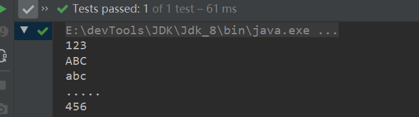
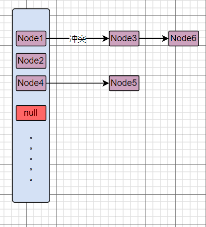
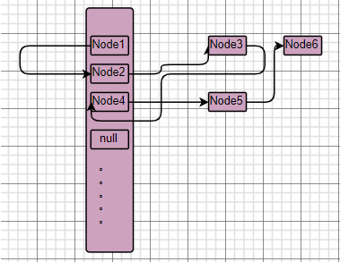

Set接口是Collection接口下的一个子接口，注重独一无二的性质,该体系集合可以知道某物是否已近存在于集合中,不会存储重复的元素。


### 简介

- Set接口是Collection的子接口，set接口没有提供额外的方法，只是对Collection接口抽象方法的再次声明。

- Set 集合不会添加重复的元素。

- Set 判断两个对象是否重复的算法是：hashCode和equals结合。
- Set的常用实现类有：HashSet、TreeSet、LinkedHashSet。


equals和hashCode方法都是object中的方法，不同的是hashCode被native修饰，使用c、c++实现，执行效率相对较高。

equals返回true则认为两个对象相等，对应hashCdoe也相等。

hashCode相等，两个对象不一定相等，可能出现哈希冲突。


<hr>

#### 对象相等

> 关于两个引用所指向的对象是否相等，我们可以分为`物理相等`和`逻辑相等`。

如果引用A、B指向堆内存空间上的同一个对象，那么A和B是相等，他们的hashCode相等，equals方法返回true。

如果引用 A1= obj(value = v)、A2= obj(value = v)，他们两个的`值`也就是代表的东西是一样的，也就是逻辑上是相等的。但是A1、A2指向的是堆内存中不同的两块内存空间，所以生成的hashCode是不同的，equals若没重写，返回的结果也为false。

想要实现，逻辑相等，就必须覆盖object中的equals和HashCode方法。


<hr>


### HashSet

> hashSet基于hashMap实现，hashMap的key是不重复的。

hashSet的每一个元素，对应hashMap中的key值，使用一个PRESENT对象来填充hashMap的value。

```java
private transient HashMap<E,Object> map;
private static final Object PRESENT = new Object();
public boolean add(E e) {
    return map.put(e, PRESENT)==null;
}
```

> 无序

hashMap节点元素的散列是无序的，所以在 hashSet中元素也是无序的(存入的顺序和拿出的顺序不一致)，其存取数据是哈希值的特征决定的。

> HashSet如何检查重复

当你执行将元素加入HashSet的操作时，HashSet会根据被插入元素对应的哈希值，来确定该元素加入的位置。如果该位置为空，那么直接加入。如果该位置不为空，且该位置元素的hashCdoe和插入元素对应hashCdoe相等  AND 对应equals返回true那么两个相等。


> 测试一下hashSet存取元素特性

可以得出的结论是：

- hashSet存取元素无序
- hashset不重复，重复会覆盖

```java
@Test
public void testHashSetAdd(){
    HashSet<String> set = new HashSet<>();
    set.add("123");
    set.add("123");
    set.add("abc");
    set.add("456");
    set.add("ABC");
    set.add(".....");
    set.forEach((obj)->{
        System.out.println(obj);
    });
}
```




> 结构图示，数据结构和hashMap没有区别，每个节点的value是固定PRESENT对象而已。




<hr>


### LinkedHashSet

> hashSet表现为一个无序、不重复的集合，那么如果我们需要一个有序的集合呢？LinkedHashSet就来了。

LinkedHashMap解决了HashMap无序的问题。

其实就是LinkedList+hashSet，牺牲时间和空间，来记录hashSet插入顺序和取数据顺序一致。




### TreeSet

> TreeSet基于TreeMap实现。TreeSet天然具有排序功能，可添加可排序的元素，或自定义集合比较器

```java
public class TreeSetTest {
    //treeSet添加可比较的元素
    @Test
    public void testAddComparable(){
        TreeSet<Integer> set = new TreeSet<>();
        set.add(1000);
        set.add(10);
        set.add(77);
        set.add(88);
        set.add(99);
        set.add(22);
        set.forEach(System.out::println);
    }
    //treeSet添加不可比较的元素
    //会报错
    @Test
    public void testAddNotComparable(){
        TreeSet<NotComparable> set = new TreeSet<>();
        set.add(new NotComparable("aa",11));
        set.add(new NotComparable("bb",22));
        set.forEach(System.out::println);
    }
    //treeSet添加不可比较的元素，自定义集合比较器
    @Test
    public void testAddNotComparableXXX(){
        TreeSet<NotComparable> set = new TreeSet<>((obj1,obj2)->{
            return obj1.yy.compareTo(obj2.yy);
        });
        set.add(new NotComparable("aa",11));
        set.add(new NotComparable("bb",22));
        set.forEach(System.out::println);
    }
}
@AllArgsConstructor
@Data
class NotComparable{
    String xx;
    Integer yy;
}
```


