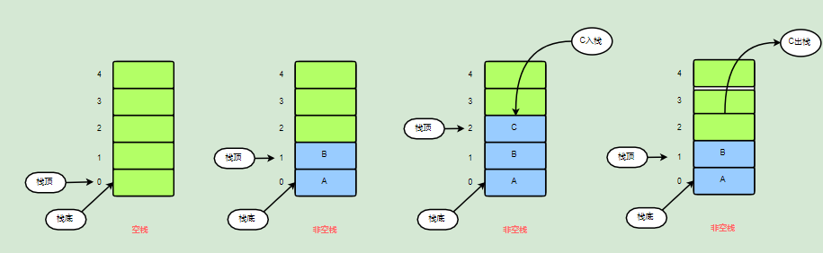
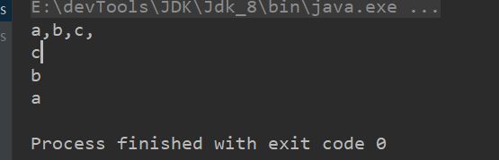
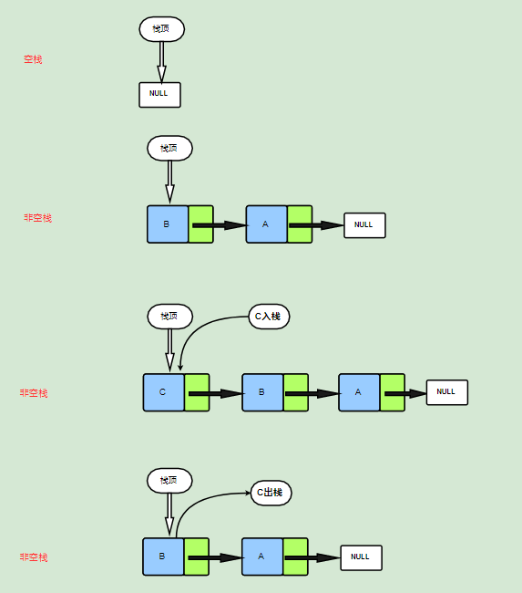
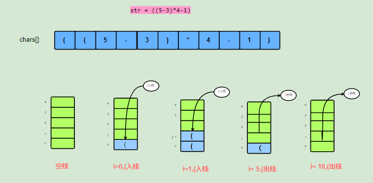
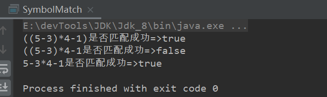
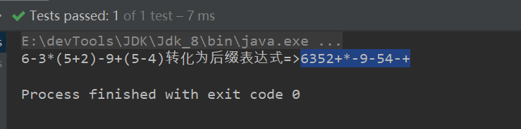
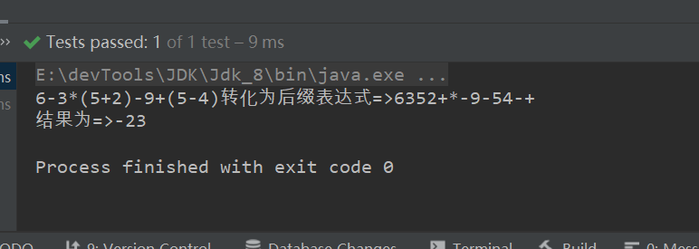
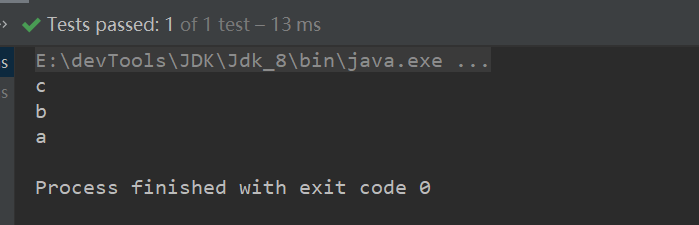
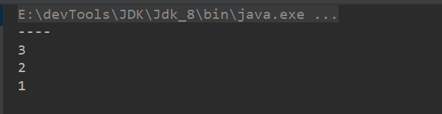

本文学习栈，数据结构、设计实现、基本使用。


### 栈


#### 简介

栈是一种用于存储数据的简单数据结构，只允许在一端进行插入和删除元素的线性表。整体表现为一个后进先出的数据结构(Last IN First Out 【LIFO】)。栈的基本操作包括初始化栈，栈判空，入栈，出栈，获取栈顶元素等，注意栈不支持对指定位置进行删除，插入。

##### 名词&概念

> 栈顶(Top)

允许进行插入和删除元素的一端称为栈顶。

> 栈底(Bottom)

不可操作的一端称为栈底

> 空栈

不包含任何元素的栈

> 入栈（Push）

元素加入栈的操作称为入栈。

> 出栈(Pop)

弹出栈顶元素的操作称为出栈。


栈的数据结构如下：




##### stack类

> java为我们提供的基于Vector实现的栈。

```java
package java.util;
public
class Stack<E> extends Vector<E> {
    public Stack() {
    }
    //入栈操作
    public E push(E item) {
        addElement(item);
        return item;
    }
    //出栈操作
    public synchronized E pop() {
        E obj;
        int len = size();
        obj = peek();
        removeElementAt(len - 1);
        return obj;
    }
	//获取元素操作，注意里不会对栈数据结构做修改
    public synchronized E peek() {
        int len = size();
        if (len == 0)
            throw new EmptyStackException();
        return elementAt(len - 1);
    }
	//栈判空
    public boolean empty() {
        return size() == 0;
    }
    //返回o对应下标
    public synchronized int search(Object o) {
        int i = lastIndexOf(o);
        if (i >= 0) {
            return size() - i;
        }
        return -1;
    }
}
```

- 首先，这个类也不太使用，基于Vector实现，synchronized保证同步
- 依赖Vector实现，主要逻辑都在Vector定义，stack相当于做一个封装
- 这是一个顺序栈


<hr>


#### 顺序栈的设计与实现

> 采用顺序表实现栈，这里使用数组是实现。先声明一个顺序栈接口其代码如下。

```java
public interface Stack<T> {
    /**
     * 栈判空
     *
     * @return boolean
     */
    boolean isEmpty();

    /**
     * 入栈
     *
     * @param t
     */
    void push(T t);

    /**
     * 获取栈顶元素,未出栈
     *
     * @return t
     */
    T peek();

    /**
     * 出栈
     *
     * @return t
     */
    T pop();

    /**
     * 返回栈元素个数
     *
     * @return int
     */
    int size();

    /**
     * 清除栈
     */
    void clear();
}
```

> 自定义顺序栈实现它和序列化接口

```java
package com.roily.stack.arraystack;

import com.roily.stack.Stack;

import java.io.Serializable;
import java.util.Arrays;
import java.util.EmptyStackException;
import java.util.function.Consumer;

/**
 * @version 1.0.0
 * @Description
 * @ClassName ArrayStack.java
 * @author: RoilyFish
 * @date: 2022/5/21 16:14
 */
public class ArrayStack<T> implements Stack<T>, Serializable {

    //序列号
    private static final long serialVersionUID = 6348894725654782270L;

    //栈元素个数
    private int size;

    // 容量大小默认为10
    private int capacity = 10;

    //栈顶指针,-1代表空栈
    private int top = -1;

    //存放元素的数组
    private T[] element;

    public ArrayStack() {
        element = (T[]) new Object[capacity];
    }

    public ArrayStack(int capacity) {
        this.capacity = capacity;
        element = (T[]) new Object[capacity];
    }

    @Override
    public boolean isEmpty() {
        return size() <= 0;
    }

    @Override
    public void push(T t) {
        //确保容量够
        ensureCapacity();
        element[++top] = t;
        size++;
    }

    @Override
    public T peek() {
        //栈判空
        if (isEmpty())
            throw new EmptyStackException();
        return element[top];
    }

    @Override
    public T pop() {
        //栈判空
        if (isEmpty())
            throw new EmptyStackException();
        size--;
        return element[top--];
    }

    @Override
    public int size() {
        return size;
    }

    @Override
    public void clear() {
        Arrays.fill(element, null);
        size = 0;
        top = -1;
    }

    //确保容量足够
    public void ensureCapacity() {
        final int oldCapacity = capacity;
        int newCapacity;
        if (oldCapacity > size())
            return;
        //扩容
        newCapacity = oldCapacity * 2 + 1;
        element = Arrays.copyOf(element, newCapacity);
    }

    public void foreach(Consumer<T> action) {
        for (int i = 0; i < size; i++) {
            action.accept(element[i]);
        }
    }
}
```

测试：

```java
@Test
public void test01() {
    ArrayStack<String> aStack = new ArrayStack<>();
    //入栈
    aStack.push("a");
    aStack.push("b");
    aStack.push("c");
    //遍历方法
    aStack.foreach((element)->{
        System.out.printf(element+",");
    });
    System.out.println();

    //出栈
    while (!aStack.isEmpty()){
        System.out.println(aStack.pop());
    }

}
```




#### 链式栈的设计与实现




```java
public class LinkedStack<T> implements Stack<T>, Serializable {
    @Data
    @AllArgsConstructor
    class Node {
        T value;
        Node next;
    }

    //序列号
    private static final long serialVersionUID = 6348894725654782270L;

    //栈元素个数
    private int size;

    //栈顶引用 为空代表 空栈
    private Node top = null;

    public LinkedStack() {

    }

    @Override
    public boolean isEmpty() {
        return size() <= 0;
    }

    @Override
    public void push(T t) {
        top = new Node(t, top);
        size++;
    }

    @Override
    public T peek() {
        //栈判空
        if (isEmpty())
            throw new EmptyStackException();
        return top.getValue();
    }

    @Override
    public T pop() {
        //栈判空
        if (isEmpty())
            throw new EmptyStackException();
        T value = top.getValue();
        top = top.next;
        size--;
        return value;
    }

    @Override
    public int size() {
        return size;
    }

    @Override
    public void clear() {
        //栈判空
        if (isEmpty()) return;
        top = null;
        size = 0;
    }

    public void foreach(Consumer<T> action) {
        Node topT = top;
        //栈判空
        if (isEmpty()) return;
        do {
            action.accept(topT.value);
        } while ((topT = topT.next) != null);
    }
}
```

测试：

```java
@Test
public void test(){

    LinkedStack<Object> lStack = new LinkedStack<>();

    lStack.push(1);
    lStack.push(2);
    lStack.push(3);

    lStack.foreach((element)->{
        System.out.println(element);
    });

    System.out.println("----");

    while (!lStack.isEmpty()){
        System.out.println(lStack.pop());
    }

}
```


#### 栈的应用

- 符号匹配
  - 括号成对出现
  - html和xml标签匹配

- 中缀表达式转后缀表达式
- 计算后缀表达式
- 函数嵌套引用


##### 符号匹配

> 在编写代码时，编译会检查语法格式，其中关于符号匹配的就是利用栈来实现的。

比如说：

```bash
((5-3)*4-1  ##这就是不符合规则的
((5-3)*4-1) ##这样才会通过校验
```

> 匹配思路

出现左括号则入栈，出现右括号则左括号出栈，检验结束，栈内存在元素则匹配失败，不存在元素则匹配成功。


图示：



代码实现：

```java
public class SymbolMatch {

    ArrayStack<Character> stack = new ArrayStack<>();

    /**
     * 符号匹配这里以()为例，比如 (1*2)
     *
     * 例子:((5-3)*4-1)
     */
    public boolean check(String expression){

        char[] chars = expression.toCharArray();

        for (Character aChar : chars) {

            if (aChar.equals('('))
                stack.push(aChar);

            if (aChar.equals(')'))
                stack.pop();
        }
        return stack.isEmpty();
    }

    public void clearStack(){
        stack.clear();
    }
    //测试
    public static void main(String[] args) {

        String expression01 = "((5-3)*4-1)";
        String expression02 = "((5-3)*4-1";
        String expression03 = "5-3*4-1";

        SymbolMatch symbolMatch = new SymbolMatch();

        System.out.println(expression01+"是否匹配成功=>"+symbolMatch.check(expression01));
        symbolMatch.clearStack();
        System.out.println(expression02+"是否匹配成功=>"+symbolMatch.check(expression02));
        symbolMatch.clearStack();
        System.out.println(expression03+"是否匹配成功=>"+symbolMatch.check(expression03));
        symbolMatch.clearStack();
    }

}
```



<hr>


##### 中缀表达式转后缀表达式

- 中缀表达式

  日常使用的表达式，如：9-3*(1+2)+9。

- 后缀表达式

  计算机认识的表达式，如：9 3 1 2 - \* + 9 +。


栈A用于管理运算符优先级、数组B用于存储转换后的后缀表达式：

- 如果遇到操作数，我们就直接将其放入数组B中。 
- 遇到运算符，如（`+`、`-`、`*`、`/`、`(`等），从栈中弹出元素存入数组B直到遇到发现更低优先级的元素为止，并将其压入栈A中。只有在遇到`)`时才弹出`(`，弹出的`(`不会加入数组B。
- 如果我们读到了末尾，则将栈中剩下的所有元素依次弹出并存入到数组B中。 
  

```java
public class ExpressionInfixToSuffix {
    //协助栈A
    ArrayStack<Character> aStack = new ArrayStack<>();

    public String infixToSuffix(String express) {
        //存放后缀表达式的数组B
        Character[] b;
        char[] chars = express.toCharArray();
        b = new Character[express.length()];
        //数组b下标
        int arrayBIndex = 0;
        for (Character aChar : chars) {
            //如果式操作数,直接加入数组
            if (aChar.compareTo('9') <= 0 && aChar.compareTo('0') >= 0){
                b[arrayBIndex++] = aChar;
                //进行下一次循环
                continue;
            }
            /**
             * + - 号优先级最低。
             * ①弹出（之前的所有 运算符
             * ②压栈
             */
            if(aChar.equals('+') || aChar.equals('-')){
                Character temp;
                //栈不为空、且不是 （
                while (!aStack.isEmpty() && !(temp = aStack.peek()).equals('(')){
                    //弹栈、加入数组B
                    aStack.pop();
                    b[arrayBIndex++] = temp;
                }
                //否则压栈
                aStack.push(aChar);
                //进行下一次循环
                continue;
            }
            /**
             * * / 号优先级比 + - 高。
             * ①弹出（之前的的所有 * / 运算符
             * ②压栈
             */
            if(aChar.equals('*') || aChar.equals('/')){
                Character temp;
                //栈不为空、且弹出的不是(、且是 * 或/
                while (!aStack.isEmpty() && !(temp = aStack.peek()).equals('(') && (temp.equals('*') || temp.equals('/'))){
                    //弹栈、加入数组B
                    aStack.pop();
                    b[arrayBIndex++] = temp;
                }
                //否则压栈
                aStack.push(aChar);
                //进行下一次循环
                continue;
            }
            //如果是（  直接入栈
            if(aChar.equals('(')){
                aStack.push(aChar);
                //进行下一次循环
                continue;
            }

            /**
             * 如果是）括号
             * 弹出所有（之前的
             */
            if(aChar.equals(')')) {
                Character temp;
                //栈不为空、且弹出的不是(
                while (!aStack.isEmpty() && !(temp = aStack.pop()).equals('(')){
                    //加入数组B
                    b[arrayBIndex++] = temp;
                }
                continue;
            }
        }
        //遍历结束，将A栈中剩余的，弹出来放入数组B

        //栈不为空、且弹出的不是(
        while (!aStack.isEmpty()){
            //加入数组B
            b[arrayBIndex++] = aStack.pop();
        }
        StringBuffer sb = new StringBuffer();
        for (Character character : b)
            sb.append(ObjectUtils.isEmpty(character)?"":character);

        return sb.toString();
    }
}
```

测试：

```java
@Test
public void test(){
    SymbolMatch symbolMatch = new SymbolMatch();
    ExpressionInfixToSuffix expressionInfixToSuffix = new ExpressionInfixToSuffix();
	String express = "6-3*(5+2)-9+(5-4)";
    //符号检验
    if (symbolMatch.check(express))
        System.out.println(express+"转化为后缀表达式=>"+expressionInfixToSuffix.infixToSuffix(express));
    else
        System.out.println("符号监测错误");
}
```



##### 计算后缀表达式

- 如果字符是数字，转换为数字再加入栈
- 如果是运算符（后缀表达式已经去除掉括号），则弹出栈前两个元素并与运算符计算，将计算后的结果入栈。
- 最终栈内元素即是表达式结果

```java
public class CalculateSuffix {
    ArrayStack<Integer> stack = new ArrayStack<>();

    public Integer calculate(String suffix) {
        char[] chars = suffix.toCharArray();
        Integer first;
        Integer second;
        Integer finalValue = null;
        for (Character aChar : chars) {

            //如果是数字，转化为数字，压栈
            if (aChar.compareTo('9') <= 0 && aChar.compareTo('0') >= 0) {
                stack.push(Integer.valueOf(aChar.toString()));
                continue;
            } else {
                first = stack.pop();
                second = stack.pop();

                switch (aChar) {
                    case '+':
                        finalValue = second + first;
                        break;
                    case '-':
                        finalValue = second - first;
                        break;
                    case '*':
                        finalValue = second * first;
                        break;
                    case '/':
                        finalValue = second / first;
                        break;
                    default:
                        break;
                }
                stack.push(finalValue);
            }
        }

        return stack.pop();
    }
}
```

测试：

```java
@Test
public void test() {
    SymbolMatch symbolMatch = new SymbolMatch();
    ExpressionInfixToSuffix expressionInfixToSuffix = new ExpressionInfixToSuffix();
    CalculateSuffix calculateSuffix = new CalculateSuffix();
    String express = "6-3*(5+2)-9+(5-4)";
    //符号检验
    if (symbolMatch.check(express)) {
        String suffix;
        System.out.println(express + "转化为后缀表达式=>" + (suffix = expressionInfixToSuffix.infixToSuffix(express)));

        System.out.println("结果为=>" + calculateSuffix.calculate(suffix));
    } else
        System.out.println("符号监测错误");
}
```



<hr>

#### 基于Stack类的思考

> 其实，上面我们的两种栈的实现，很多逻辑都是重新写的，但是java为我们提供的很多容器类可以帮我们实现。顺序栈就可以用ArrayQueue，链式栈就可以用LinkedList。


##### 借助ArrayList实现顺序栈

> 代码也很简洁

```java
public class ArrayStackByArrayList<T> extends ArrayList<T> implements Stack<T> {

    private static final long serialVersionUID = 893214352865117027L;

    @Override
    public void push(T t) {
        super.add(t);
    }

    @Override
    public T peek() {
        return get(size()-1);
    }

    @Override
    public T pop() {
        return remove(size()-1);
    }
}
```

测试：

```java
@Test
public void test02() {
    Stack<String> aStack = new ArrayStackByArrayList<>();
    //入栈
    aStack.push("a");
    aStack.push("b");
    aStack.push("c");

    //出栈
    while (!aStack.isEmpty()) {
        System.out.println(aStack.pop());
    }

}
```




##### 借助LinkedList实现链式栈

> 发现什么都不用做，相当于给LinkedList做封装

```java
public class LinkedStackByLinkedList<T> extends LinkedList<T> implements Stack<T> {

    private static final long serialVersionUID = 895807720383163370L;

}
```

测试：

```java
@Test
public void test2(){
    Stack<Object> lStack = new LinkedStackByLinkedList<>();
    lStack.push(1);
    lStack.push(2);
    lStack.push(3);
    while (!lStack.isEmpty()){
        System.out.println(lStack.pop());
    }
}
```

