### B树

#### 简介

​	B树又称B-树，中间是横杠隔开，不读'B减树'。B表示balance( 平衡的意思)，B树属于多叉树，是一种多路自平衡的查找树，它类似普通的平衡二叉树，不同的一点是B-树允许每个节点有更多的子节点，使得树整体体现‘’‘矮胖’的特点，减少查找次数。

​	B树的阶数：m阶B树表示这棵树结点至多存在m个子节点。

#### 特点

一颗m阶的B树有以下特点：

- 有序性，即按左小右大原则排序
- 根节点的子节点个数为   【2，m】
- 除根节点以外的非叶子节点的子节点个数为：【Math.ceil(m/2) ，m】
- 非叶子节点内值的个数为子节点个数-1。至少Math.ceil(m/2)-1、至多m-1个
- 所有叶子节点位于同一层

下图是一个3阶B树：

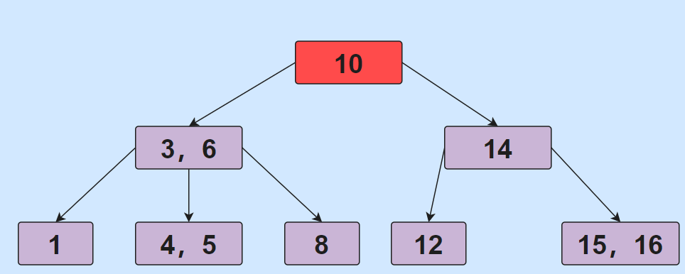

#### 查找过程

> 假设我们查找索引5对应的节点。

①第一次IO将，根节点10读入内存，5和10比较，小于走左边，大于走右边。

②第二次IO将，节点3，6读入内存，比较，走中间

③第三次IO将，节点4，5读入内存，比较，得到索引5对应节点

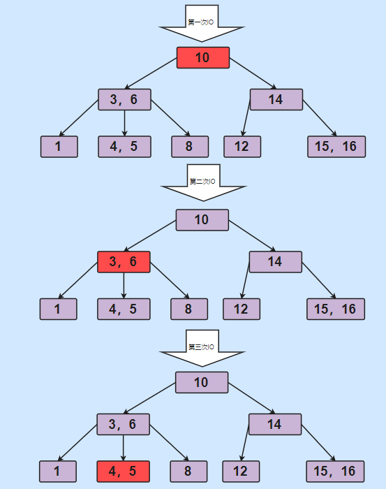

#### 节点添加过程

> B树节点的添加和节分裂过程

以5阶B树为例：每个节点最多插入4个索引

一)、插入30

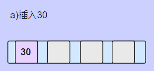

二）、插入10、40、50

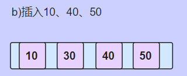

三）、插入35，以中心分裂

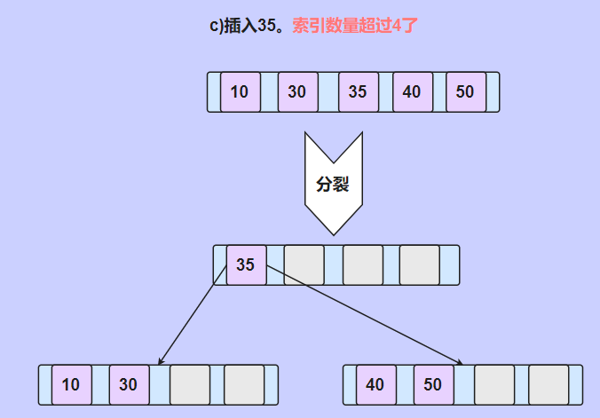

四）、插入8、16、32。左子树超过4个索引，分裂并将中间索引放入父节点。

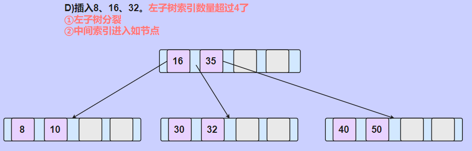

五)多插些数据

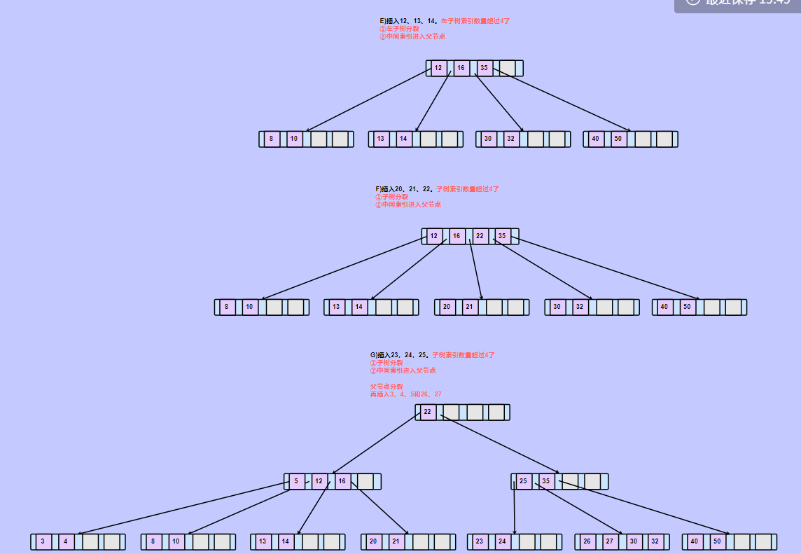

#### 节点删除过程

> 以上面最后的B树为例。

一）、删除索引32

删除后该节点剩余索引个数为3，任然大于Math.ceil(m/2)-1 = 2,所以不做任何处理。

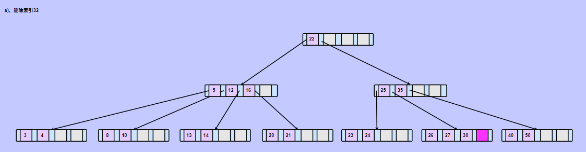

二）、删除索引12

由于删除的索引不存在于叶子节点，所以得找后继节点来替代，也就是13，我们①用13代替12，②再删除13。

删除后发现，原索引13对应节点，索引数量小于2。

第一步：检查是否有兄弟节点可以借  （不可以）

第二步：父节点下移，父节点对应索引，替换需要删除的索引

第三步：和兄弟节点合并

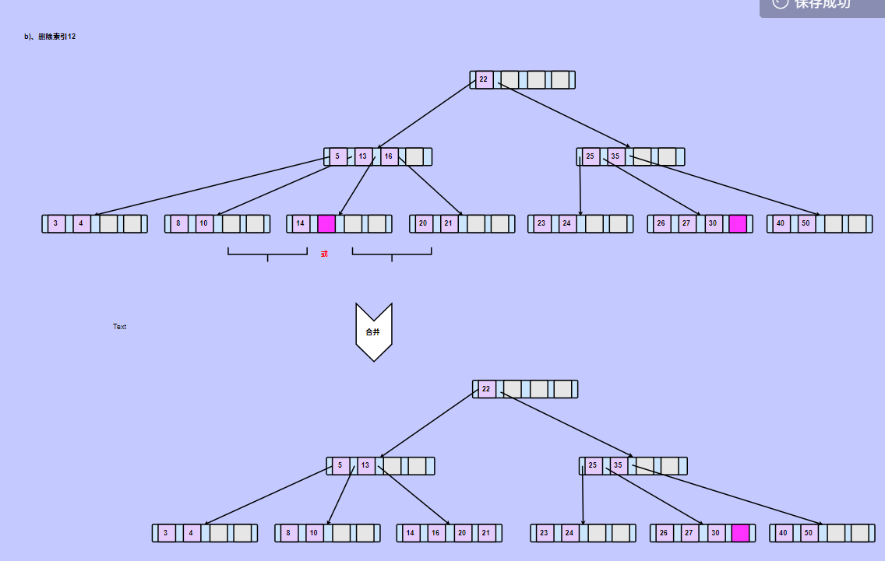

三）删除索引24

删除后索引个数不足2个，先找兄弟节点借，发现可以借到

第一步：检查是否有兄弟节点可以借  （可以）

第二步：父节点索引下移，父节点对应索引，替换需要删除得索引

第三步：兄弟节点索引，替换父节点索引

第四步：检查兄弟节点，索引值是否够

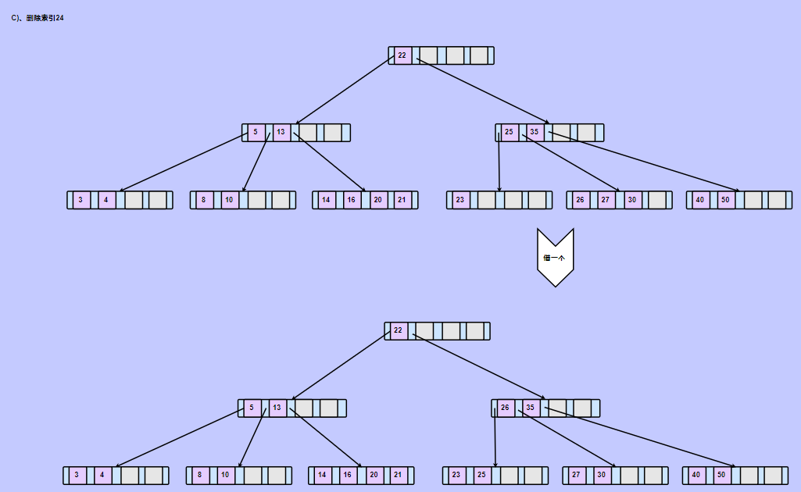

四）删除索引30

第一步：检查是否有兄弟节点可以借  （不可以）

第二步：父节点下移，父节点对应索引，替换需要删除的索引

第三步：和兄弟节点合并

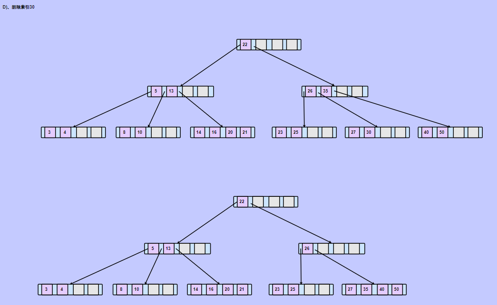

发现父节点索引数量不够

第一步：检查是否有兄弟节点可以借  （不可以）

第二步：父节点下移，父节点对应索引，替换需要删除的索引

第三步：和兄弟节点合并

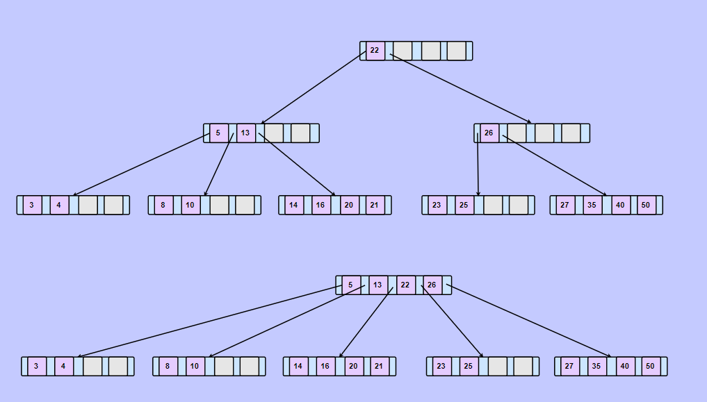

### B+树

> B+树是基于B树的基础提出的。

这是一颗五阶B+树：

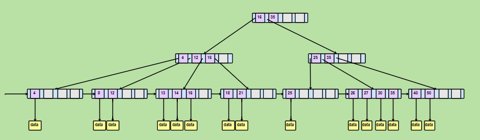

特点：

- 叶子节点存储所有数据，非叶子节点只存储索引不存储数据
- 所有非叶子节点，都会在叶子节点出现
- 使用一个链表将所有叶子节点链接，便于区间访问

#### B和B+树区别

> B+树的特点也是他们两个的区别

- B+树的索引结点并不会保存记录，只用于索引，所有的数据都保存在B+树的叶子结点中。而B树则是所有结点都会保存数据。
- B+树的叶子结点都会被连成一条链表。叶子本身按索引值的大小从小到大进行排序。即这条链表是 从小到大的。多了条链表方便范围查找数据。
- B树的所有索引值是不会重复的，而B+树 非叶子结点的索引值 最终一定会全部出现在 叶子结点中。
  