### 树

> 百度百科：

**树**是一种[数据结构](https://baike.baidu.com/item/数据结构/1450)，它是由*n(n≥0*)个有限节点组成一个具有层次关系的集合。把它叫做“树”是因为它看起来像一棵倒挂的树，也就是说它是根朝上，而叶朝下的。它具有以下的特点：

每个节点有零个或多个子节点；没有父节点的节点称为根节点；每一个非根节点有且只有一个父节点；除了根节点外，每个子节点可以分为多个不相交的子树。


#### 基本概念

> 节点【node】

每个元素称为节点

> 根节点【root】

特殊的节点，其没有父节点。

> 子节点

又称为孩子节点。

> 节点的度

一个节点含有的子节点的个数称为该节点的度；

> 叶子节点

特殊的子节点，其节点度为0

> 树的度

根节点的度

> 节点层次

根为第1层，根的子节点为第2层。。。。

> 节点深度和高度

深度：从根节点到该节点的路径长，这里没必要纠结是否从0开始

高度：从该节点到叶子节点的最大长度，这里没必要纠结是否从0开始

> 树的高度或深度

最大的节点层次。


#### 分类

根据一个节点最多有几个“叉”，即最多有几个子节点，我们可以对树进行分类。常用的是二叉树；超过“二叉”的树，一般统称为多叉树。


##### 二叉树

树的任意节点最多有两个子节点。


##### 满二叉树

> 树的任意一层非叶子节点都是满的，那么称为满二叉树。

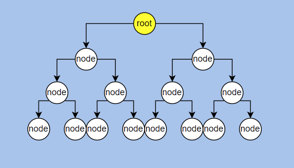

##### 完全二叉树

> 叶子节点都在最底下两层，最后一层的叶子节点都靠左排列，并且除了最后一层，其他层的节点个数都要达到最大，这种二叉树叫做完全二叉树。

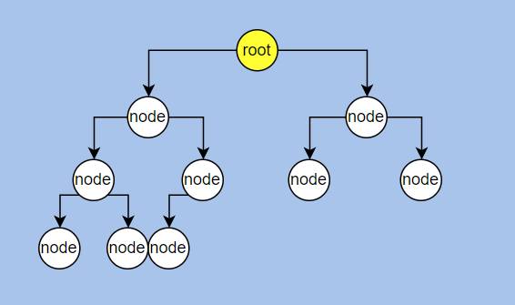

或

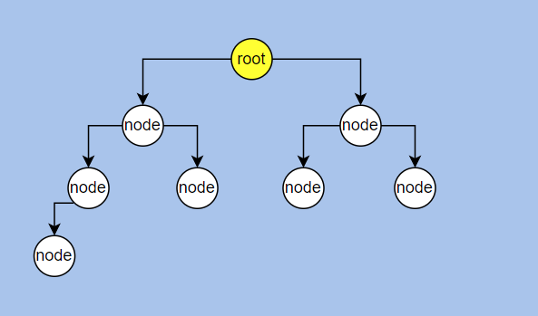

这样的不是完全二叉树：

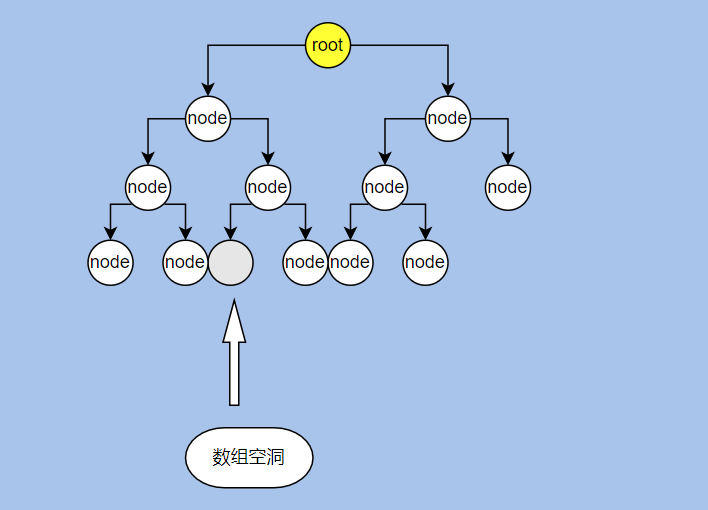


##### 堆

> 堆是一个完全二叉树。

由于其特别的排序规则，完全可以用数组的新式表现出来。比如说某个父节点下标为 n，那么它的两个子节点分别为2n+1和2n+2。

例子：比如PriorityQueue


##### 二叉查找树（BST）

>又叫二叉排序树。树中的任意一个节点，其左子树中的每个节点的值，都要小于这个节点的值，而右子树节点的值都大于这个节点的值。

其查找原理类似于有序数组中的二分查找。

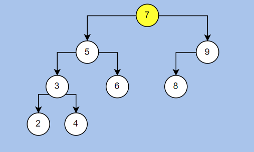

特别地：如果插入顺序是  9、8、7、6.。。。。时，二叉查找树会退化成链表：

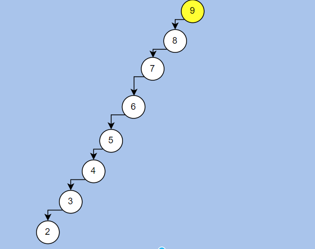


> java实现二叉查找树

```java
public class BST<T> {
    /**
     * 二叉查找树，是特殊的二叉树，任意父节点的值大于其左子节点，小于其右子节点
     */
    class BSTNode {
        //左右子节点
        BSTNode lChild;
        BSTNode rChild;
        //value值
        T value;

        public BSTNode(T value) {
            this.value = value;
        }
    }

    BSTNode root;
    public BST() {
        this.root = new BSTNode(null);
    }

    /**
     * 插入节点
     * @param t
     */
    void insert(T t) {
        Comparable<? super T> tTemp = (Comparable<? super T>) t;
        //可比较的对象
        assert t instanceof Comparable;
        BSTNode rootTemp = root;
        for (; ; ) {
            //头节点未初始化
            if (rootTemp.value == null) {
                rootTemp.value = t;
                return;
            } else if (tTemp.compareTo(rootTemp.value) > 0) {
                if ((rootTemp.rChild) == null) {
                    rootTemp.rChild = new BSTNode(t);
                    return;
                }
                rootTemp = rootTemp.rChild;
            } else {
                if ((rootTemp.lChild) == null) {
                    rootTemp.lChild = new BSTNode(t);
                    return;
                }
                rootTemp = rootTemp.lChild;
            }
        }
    }
    boolean search(T t) {
        Comparable<? super T> tTemp = (Comparable<? super T>) t;
        //可比较的对象
        assert t instanceof Comparable;
        BSTNode rootTemp = root;
        for (; ; ) {
            if (rootTemp == null) {
                return false;
            } else if (tTemp.compareTo(rootTemp.value) == 0) {
                return true;
            } else if (tTemp.compareTo(rootTemp.value) > 0) {
                rootTemp = rootTemp.rChild;
            } else if (tTemp.compareTo(rootTemp.value) < 0) {
                rootTemp = rootTemp.lChild;
            }
        }
    }
    @Test
    public void test() {
        BST<Integer> integerBST = new BST<>();
        integerBST.insert(6);
        integerBST.insert(2);
        integerBST.insert(3);
        integerBST.insert(1);
        integerBST.insert(5);
        integerBST.insert(9);
        integerBST.insert(10);
        integerBST.insert(120);

        System.out.println(integerBST.search(2));
        System.out.println(integerBST.search(10000));
        System.out.println(integerBST.search(10));
        System.out.println(integerBST.search(10));
        System.out.printlnt(integerBST.search(120));
        System.out.println(integerBST.search(5));
    }
}
```

添加节点时可以debug查看一下树结构。

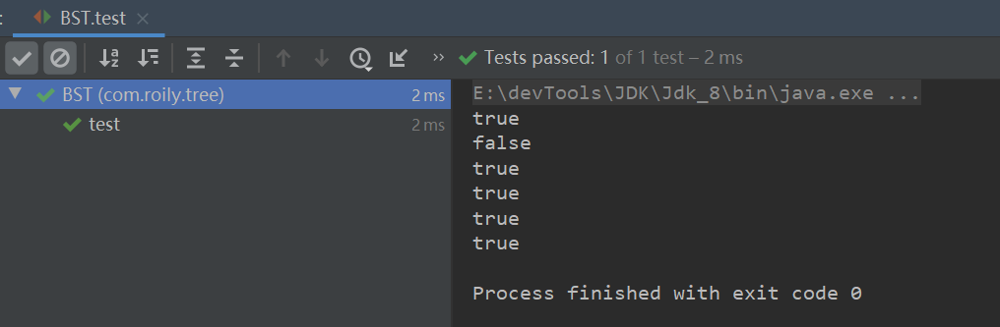


##### 平衡二叉树

>平衡二叉树的定义：二叉树中任意一个节点的左右子树的高度相差不能大于 1。


##### 平衡二叉查找树(AVL)

>其实在大部分情况下平衡二叉树就指的是平衡二叉查找树。
>
>为了防止二叉查找树退化为链表，导致查询的效率大幅下降，所以又发明了平衡二叉查找树。平衡二叉查找树在二叉查找树的定义上又增加了1点，规定二叉查找树中任意一个节点的左右子树的高度相差不能大于 1。

平衡二叉树实现的大部分过程和二叉查找树是一样的（学平衡二叉树之前一定要会二叉查找树），区别就在于插入和删除之后要写一个旋转算法去维持平衡，维持平衡需要借助一个节点高度的属性。


###### 例子

现在有一数组：a[10] = {3, 2, 1, 4, 5, 6, 7, 10, 9, 8}需要构建成一个二叉查找树，如左图，这是一个深度为8的二叉树，对于查找性能对比链表没有明显提升。因此需要构建为如右图所示高度为4的平衡二叉树。

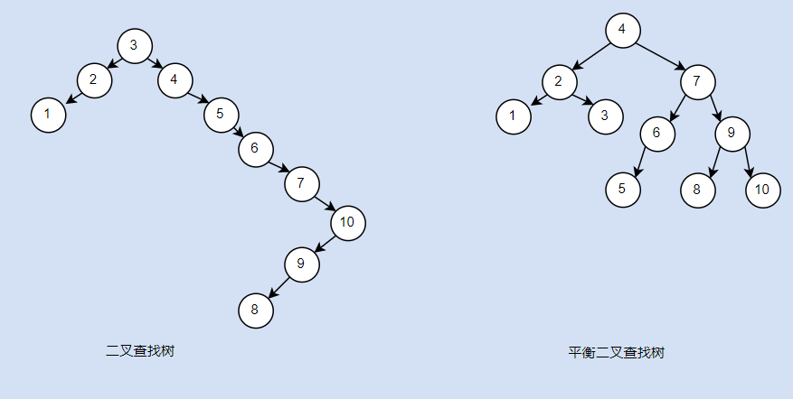


###### 名词

> 二叉树的平衡因子

将二叉树上结点的左子树深度减去右子树深度的值称为平衡因子BF

> 最小不平衡子树

距离插入结点最近的，且平衡因子的绝对值大于1的结点为根的子树，称为最小不平衡子树。如下图例子。

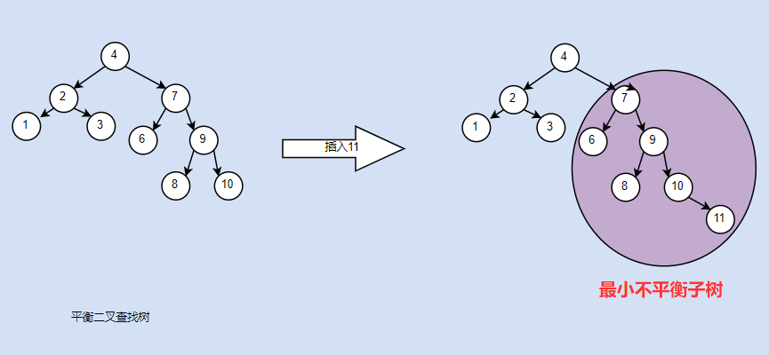


###### 平衡二叉查找树特点

- 平衡二叉树前提是一个二叉查找树
- 任意节点的平衡因子不超过1
- 任意节点的平衡因子大于1，那么该树不是平衡二叉查找树


###### 平衡二叉查找树插入原理

​	根据平衡二叉查找树的特点，在进行插入操作时，需要考虑节点深度问题，如果插入操作后不做处理，就会很容易破坏平衡性。

> 旋转问题

在首次出现`最小不平衡子树`的时候，这颗二叉树就已经不平衡了，并且只需要处理这颗`最小不平衡子树`即可解决该二叉树的平衡问题。根据高度特点，大概分为以下四种情况：

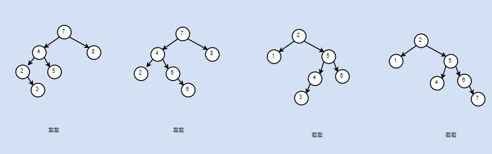

左左和右右这两种情况是对称的只需要进行一次旋转就可以。左右和右左也是对称的这两种情况需要旋转两次。

> 单旋转

单旋转是针对左左和右右这两种情况的。

首先找到最小不平衡子树，对应的根节点k1。为了使树恢复平衡，①我们把k2作为新的根节点②原先的根节点k1大于k2，我们可以把k1作为k2的右子树，③而Y大于k2但是小于k1，所以可以把Y作为k1的左子树。

右旋：原理就是左子树高度减一，右子树深度加一。这样一棵不平衡树，就转换成了一颗平衡树。

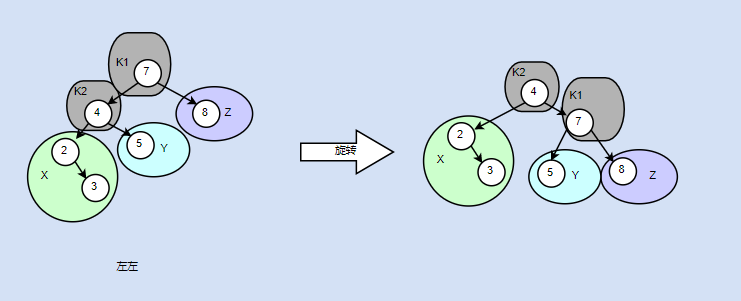

右右是同样的道理，进行左旋。

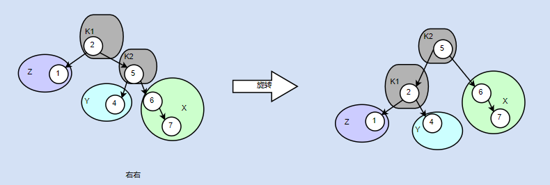


> 双旋转

对于左右和右左这两种情况，也是对应的，都需要旋转两次。先进行一次右旋转变为左左情况，再进行一次旋转变为平衡二叉树。

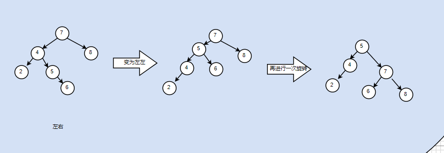

右左也是一样的道理

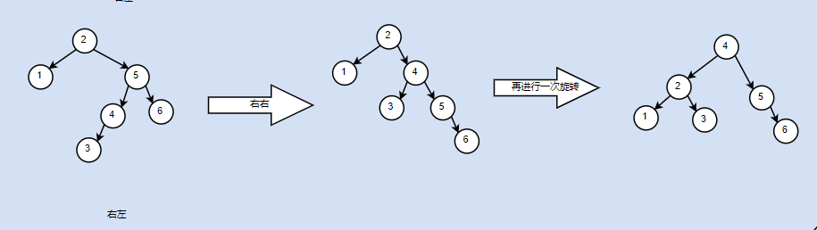

> 算法

```java
public class AVLTree<T> {

    @Data
    @AllArgsConstructor
    @NoArgsConstructor
    class AVLNode {
        //左右子节点
        AVLNode lChild;
        AVLNode rChild;
        //value值
        T value;
        //该节点节对应子树高度
        int height;

        public AVLNode(T value) {
            this.value = value;
        }
    }

    private AVLNode root;

    public AVLTree() {
    }

    /**
     * 插入节点
     * <p>
     * 节点的高度如何确定
     * <p>
     * -左边插入一个
     *
     * @param t
     */
    void insert(T t) {

        root = insert(root, t);
    }

    private AVLNode insert(AVLNode root, T t) {
        //可比较的对象
        assert t instanceof Comparable;
        Comparable<? super T> tTemp = (Comparable<? super T>) t;

        //节点未初始化，递归出口
        if (ObjectUtils.isEmpty(root)) {
            root = new AVLNode(t);
            return root;
        }
        //插入右子树
        else if (tTemp.compareTo(root.value) > 0) {
            root.rChild = insert(root.rChild, t);
            //右右情况
            if (bf(root.rChild) < -1) {
                root = rrRotate(root);

            }
            //右左情况
            else if (bf(root.rChild) > 1) {
                root = rlRotate(root);
            }
        }
        //插入左子树
        else {
            root.lChild = insert(root.lChild, t);
            //左左情况
            if (bf(root.lChild) > 1) {
                root = llRotate(root);
            }
            //左右情况
            else if (bf(root.lChild) < -1) {
                root = lrRotate(root);
            }
        }
        //插入新节点跟新子树高度
        root.height = height(root);
        return root;
    }

    private AVLNode element(AVLNode node, T t) {

        assert t instanceof Comparable;

        Comparable tTemp = (Comparable) t;

        if (tTemp.compareTo(node.value) == 0)
            return node;
        else if (tTemp.compareTo(node.value) > 0)
            return element(node.rChild, t);
        else
            return element(node.lChild, t);
    }

    public AVLNode element(T t) {
        return element(root, t);
    }

    //递归计算节点高度
    private int height(AVLNode node) {
        //当前节点为空，直接返回-1
        if (node == null) return -1;
        //当前节点左右节点为空，返回0
        if (node.lChild == null && node.rChild == null)
            return 0;
        else {
            return Math.max(height(node.lChild), height(node.rChild)) + 1;
        }

    }

    //判断树是否不平衡
    private Boolean isBalance(AVLNode root) {
        return Math.abs(height(root.lChild) - height(root.rChild)) <= 1;
    }

    //小于0，右子树高  大于0 左子树高
    private int bf(AVLNode root) {

        return height(root.lChild) - height(root.rChild);

    }


    //左左情况
    private AVLNode llRotate(AVLNode root) {

        AVLNode lChild = root.lChild;
        //左子树的右节点为，根节点的左节点
        root.lChild = lChild.rChild;
        root.height = height(root);
        //左子树的右节点，为根节点
        lChild.rChild = root;
        //左左情况，只需要跟新  k1  和 k2高度，其他节点的子树叶子节点没有变化
        lChild.height = height(lChild);
        //新的根节点
        return lChild;
    }

    //右右情况
    private AVLNode rrRotate(AVLNode root) {

        AVLNode rChild = root.rChild;
        //左子树的右节点为，根节点的左节点
        root.rChild = rChild.lChild;
        root.height = height(root);
        //左子树的右节点，为根节点
        rChild.lChild = root;
        rChild.height = height(rChild);
        //新的根节点
        return rChild;
    }

    //左右情况
    private AVLNode lrRotate(AVLNode root) {

        //先将左子树进行右旋，并跟新
        root.lChild = rrRotate(root.lChild);
        //再将原树进行左旋
        return llRotate(root);
    }

    //右左情况
    private AVLNode rlRotate(AVLNode root) {
        //先将右子树进行左旋，并跟新
        root.rChild = llRotate(root.rChild);
        //再将原树进行右旋
        return rrRotate(root);
    }


    public static void main(String[] args) {
        AVLTree<Integer> integerAVLTree = new AVLTree<Integer>();

        integerAVLTree.insert(8);
        integerAVLTree.insert(9);
        integerAVLTree.insert(10);
        integerAVLTree.insert(1);
        integerAVLTree.insert(2);
        integerAVLTree.insert(3);
        integerAVLTree.insert(4);
        integerAVLTree.insert(6);
        integerAVLTree.insert(5);
        //验证高度
        System.out.println(integerAVLTree.height(integerAVLTree.root));
        System.out.println(integerAVLTree.root.height);
        //查询节点
        System.out.println(integerAVLTree.element(8));
    }
}

```

同样的需要debug看一下树结构。

关键点在于

- 定位到失衡点，进行对应旋转
- 树高度更新时间点（插入新节点、旋转操作）


##### 红黑树

###### 简介

红黑树中的节点，一类被标记为黑色，一类被标记为红色，它是一种不严格的平衡二叉查找树。它要满足这样几个要求：

- ①节点是红色或者黑色（一般用boolean）

- ②根节点是黑色的

- ③每个叶子节点都是黑色的空节点（NIL）

  使用NIL填充叶子节点

- ④每个红色节点的两个子节点都是黑色的，也就是说没有连续的两个红色节点

- ⑤任意节点到其叶子节点的所有路径，包含黑色节点数量一致

> 这就是一个红黑树：

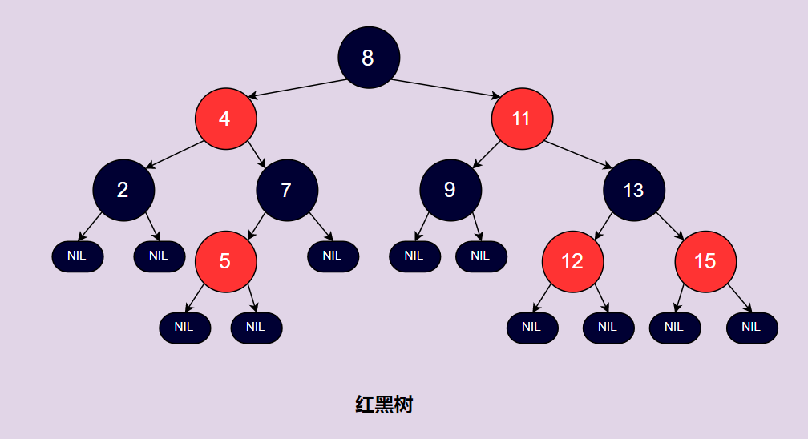

###### 左右旋

> 参考，平衡二叉查找树。


###### 插入原理

> 首先明确一点，插入节点的初始化状态一定是红色的。

如果插入的节点为黑色的话，需要大量的操作来维持红黑树的特性⑤。


> 情况一：插入位置为根节点

​	直接涂黑。

> 情况二：插入位置的父节点为黑色的

​	此刻不会破坏红黑树特性，不用做任何调整

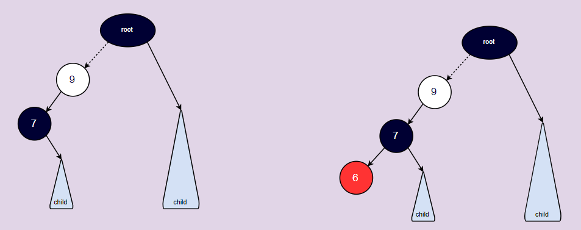


> 情况三：插入位置的父节点为红色的

​	 情况1：插入位置的父节点的兄弟节点为黑色

​			情况a:插入位置，为父节点左支

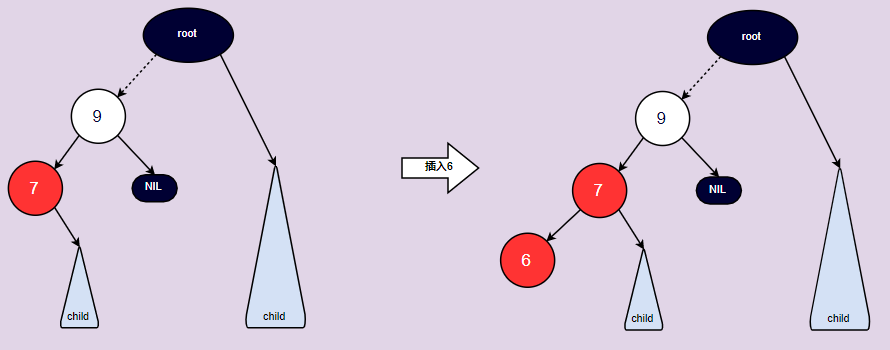

这样就违反了性质④。我们可以通过对节9点进行右旋同时将节点9和节点7的颜色进行互换，这样就变成了： 

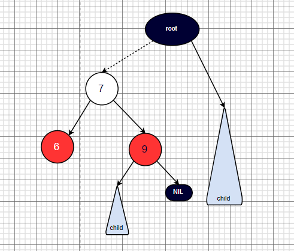


​			情况b:插入位置，为父节点右支

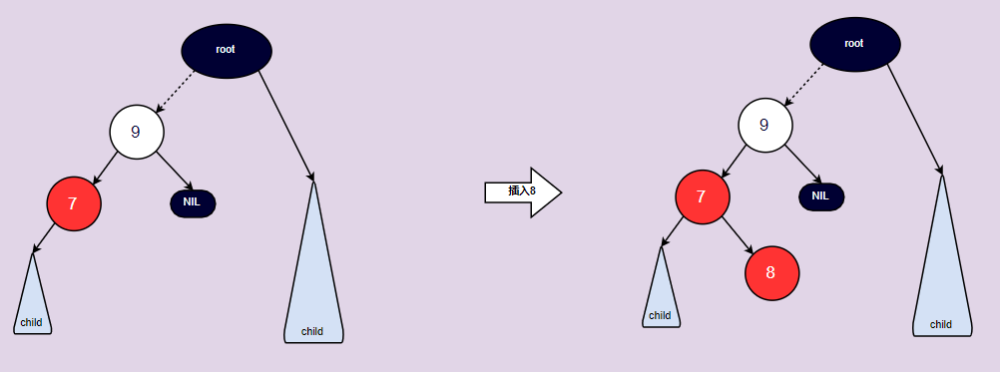

同样的违反了性质④。我们可以先对父节点进行左旋。

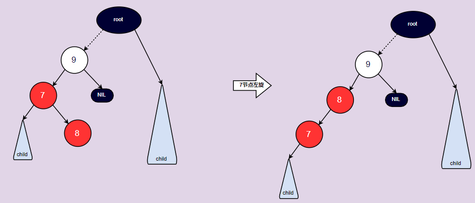

再进行右旋：

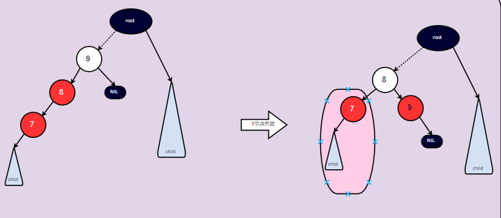

##### 多叉树

Trie树又叫**字典树**、**前缀树（Prefix Tree）**、**单词查找树** 或 **键树**

> Trie 树，也叫“字典树”。它是一种专门处理字符串匹配的数据结构，用来解决在一组字符串集合中快速查找某个字符串的问题。Trie 树的本质，就是利用字符串之间的公共前缀，将重复的前缀合并在一起。

用trie表示一个集合：{“a”, “to”, “tea”, “ted”, “ten”, “i”, “in”, “ind”,“ifd”}

有颜色的节点代表，该节点即其所有主先节点可以构成一个字符串。

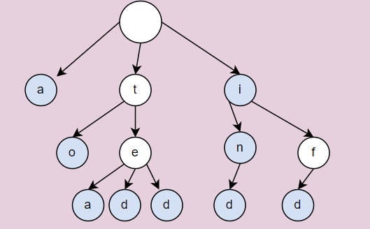


使用java实现字典树：

```java
public class TrieTest {

    /**
     * 字典树节点
     * <p>
     * 每个节点有多个子节点，且子节点互不重复
     */
    static class TrieNode {
        //子节点
        HashMap<Character, TrieNode> children = new HashMap<>();
        //字符串结束标志
        Boolean isEnd;
        public TrieNode() {
            this.children = new HashMap<Character, TrieNode>();
            this.isEnd = false;
        }
    }

    //字典树根节点
    private TrieNode root;
    public TrieTest() {
        this.root = new TrieNode();
    }

    //插入字典树
    void insert(String value) {
        TrieNode nodeTemp = root;
        for (int i = 0; i < value.length(); i++) {
            //获取字符
            Character c = value.charAt(i);
            //是否包含此节点
            if (!nodeTemp.children.containsKey(c)) {
                nodeTemp.children.put(c, new TrieNode());
            }
            nodeTemp = nodeTemp.children.get(c);
        }
        //最后一个插入的字符为叶子节点
        nodeTemp.isEnd = true;
    }

    //查找 也是从根节点开始搜索
    boolean search(String value) {

        TrieNode nodeTemp = root;

        for (int i = 0; i < value.length(); i++) {
            //获取字符
            Character c = value.charAt(i);
            //是否包含此节点
            if (!nodeTemp.children.containsKey(c)) {
                return false;
            }
            nodeTemp = nodeTemp.children.get(c);
        }
        return nodeTemp.isEnd;
    }

    @Test
    public void test() {

        TrieTest trieTest = new TrieTest();
        String[] values = new String[]{"a", "to", "tea", "ted", "ten", "i", "in", "ind", "ifd"};

        for (int i = 0; i < values.length; i++) {
            trieTest.insert(values[i]);
        }
        System.out.println("==是否包含ten==>" + trieTest.search("ten"));
        System.out.println("==是否包含xxxx==>" + trieTest.search("xxxx"));
    }

}
```

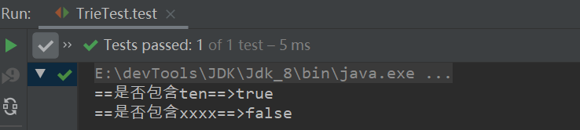


