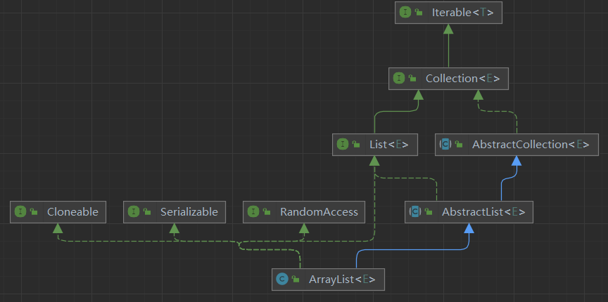
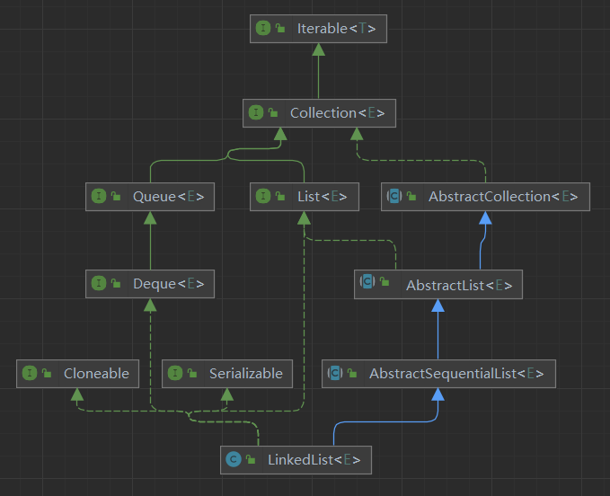
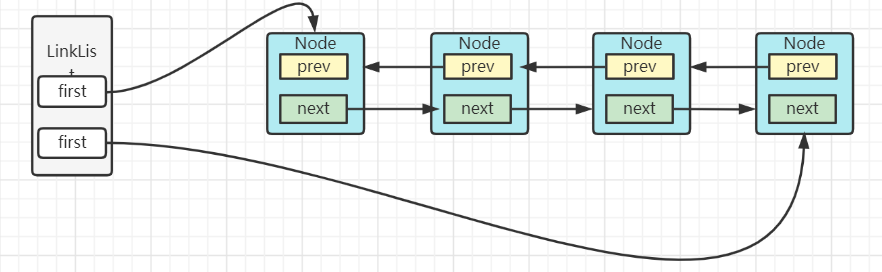
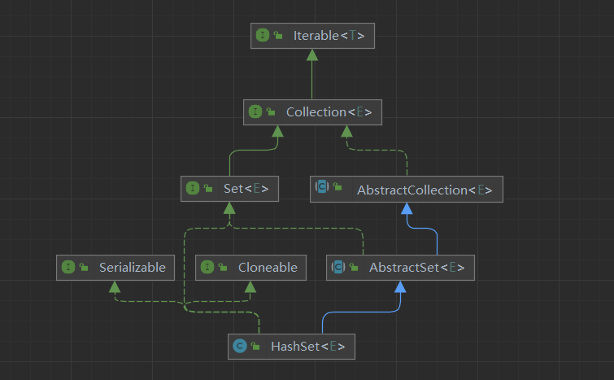

# 集合框架总结

## 概览

### 简介

图片说明：

- 虚线标识实现、实线标识继承
- 绿色背景是具体实现类,粉色背景是抽象接口
- 左上角`legacy`是遗留的,线程安全的集合
- ⭕圈圈颜色,标识集合底层实现。是数组、链表、二叉堆、哈希表还是红黑树


容器，就是可以容纳其他Java对象的对象。*Java Collections Framework(JCF)*为Java开发者提供了通用的容器，其始于JDK 1.2，优点是:

- 降低编程难度
- 提高程序性能
- 提高API间的互操作性
- 降低学习难度
- 降低设计和实现相关API的难度
- 增加程序的重用性

集合框架主要分为Collection接口和Map接口。

Java容器里只能放对象，对于基本类型(int, long, float, double等)，需要将其包装成对象类型后(Integer, Long, Float, Double等)才能放到容器里。很多时候拆包装和解包装能够自动完成。这虽然会导致额外的性能和空间开销，但简化了设计和编程。


### collection

- list接口
  - ArrayList基于动态数组实现,支持随机访问
  - LinkedList基于双向链表实现,只能顺序访问、不支持随机访问,但对插入友好
  - Vector  和ArayList相似,但是它线程安全(使用Synchronized保证)
- set接口
  - HashSet    基于HashMap实现
  - LnkedHashSet   基于双线链表+HashSet实现
  - TreeSet     基于红黑树实现
- queue接口
  - LinkedList   
  - PriorityQueue  优先级队列,基于二叉堆实现

### Map

- HashTable  和HashMap类似,但线程安全。遗留类,不应该被使用,没有线程安全的情况下使用HashMap,有线程安全的情况下使用ConcurrentHashMap。因为CHM引入了分段锁效率较高。

- HashMap  哈希表

- LinkedHashMap  双向链表+HashMap  牺牲空间保证Map节点的有序性。插入顺序和最近

- TreeMap 基于红黑树实现

  

## Iterable-Collection

### List

#### ArrayList

##### 继承关系



- Clonable

  > 实现此接口才可以重写Object的Clone()方法,利用Array.copy和System.ArrayCopy拷贝,这是个浅拷贝。
  >
  > 会将模数modCount置零,且拷贝时会忽略数组中的空对象

- Serializable

  > 实现此接口对象才可以序列化传输。JDK提供的ObjectOutputStream、ObjectInputStream。
  >
  > 序列化时会保存集合的size，并且忽略数组中的空对象,反序列化先读取size然后循环读取对象放到数组中

- RandomAccess

  > 标志性接口,没作用,表示支持随机访问。Vector也实现了此接口

- AbstractList

##### 底层及结构

> 对象数组Object[],可接受任意类型的对象。

##### 属性和方法

###### 属性：

> - 底层结构：对象数组，Object类型可接受任意类型元素
> - 对象数组使用transient修饰,不会参与序列化
> - size：数组元素个数,不是数组大小

```java
//序列号
private static final long serialVersionUID = 8683452581122892189L;
//默认初始容量
private static final int DEFAULT_CAPACITY = 10;
//空对象数组，初始化ArrayList如果size等于0的话，则初始化为该空数组
private static final Object[] EMPTY_ELEMENTDATA = {};
//默认空对象数组，ArrayList无参构造初锁始化的空数组
private static final Object[] DEFAULTCAPACITY_EMPTY_ELEMENTDATA = {};
//对象数组,ArrayList底层结构,集合成员都存储在此
transient Object[] elementData; 
//元素个数、注意不是数组长度
private int size;
```

###### 构造函数

可定义容量,可拷贝

```java
public ArrayList(int initialCapacity);
public ArrayList();
public ArrayList(Collection<? extends E> c);
```

> 常用操作：

```java
new ArrayList(Arrays.asList(1,2,3));
```

###### 扩容

- ensureCapacity(int minCapacity);是一个public方法,供程序员使用,当我们提前知道集合大小,则可以指定集合容量
- 自动扩容,使用集合容器,一般不需要指定,他会自动扩容,ArrayList默认容量10,每次扩容1.5倍
- 扩容会调用Array.copyof()方法对原数组对象做一个浅拷贝

```java
public void ensureCapacity(int minCapacity);
private Object[] grow(int minCapacity);
```

###### 添加元素

- add(E e)
- add(int index,E e)
- addAll(Collection<? extends E> coll)
- addAll(int  index, Collection<? extends E> coll)

> 添加一个或多个元素,插入元素之前判断容量是否充足,不充足则扩容。
>
> 底层是一个对象数组，添加一个元素时,直接在下标size处插入元素即可。添加多个元素时通过数组拷贝的方式。
>
> 指定下标插入元素,需要首先数组后移,再插入元素。

###### 更新集合

- set(int  index, E e)      

  > 替换元素并返回旧值

- remove(int  index)

  > 移除指定下标处元素。通过数组拷贝前移来覆盖移除元素,并将尾部元素置为null

- remove(Object o)

  > 通过循环equals来找到待移除元素下标。通过数组拷贝前移来覆盖移除元素,并将尾部元素置为null

- removeAll(Collection<? extends E> c)

  > 移除所有元素,通过数组拷贝来实现

##### 小结论

- ArrayList底层是一个对像数组,添加拿取基本数据类型,会进行自动装箱拆箱
- ArrayList初始化默认容量为10,每次扩容1.5倍。扩容需要数组拷贝,性能消耗大头,如果知道容量大小则可以预先指定,避免频繁扩容。扩容数组拷贝是一个浅拷贝
- ArrayList优化了clone(),ArrayList拷贝会忽略集合中的null元素。
- ArrayList优化了序列化,Arraylist序列化会忽略集合中的null元素。
- ArrayList支持随机访问,访问性能较高。对插入不友好,对查询友好。


#### LinkedList


##### 继承关系



- Clonable

  > 实现此接口才可以重写Object的Clone()方法,这是一个浅拷贝。
  >
  > 拷贝逻辑：LinkedList的所有属性都是transient的。首先拷贝LinkedList引用,再循环调用add(E e)方法加入链表尾部,add(E e) 方法会创建新的节点添加到链表尾部。

- Serializable

  > 实现此接口对象才可以序列化传输。JDK提供的ObjectOutputStream、ObjectInputStream。
  >
  > 序列化时会保存链表的size，以及所有Node的item。

- Deque

  > 双向队列接口,LinkedList底层是一个双向链表,实现Dequue标准,加入链表就是入队。
  >
  > 提供 pop-入队   poll() 出队等操作。

##### 底层及结构

> LinkedList底层是一个双向链表,内存维护者一个个Node节点,Node节点中存储着前期和后继节点指针和链表元素值。
>
> LinkedList实现了List和Deque接口,也就是说LinkedList既可以作为链表也可以作为队列和栈使用。关于栈或队列,首选的就是ArrayDeque,它拥有更好的性能。
>
> LinkedList的实现结构,决定了所有跟有关下标的操作都是线性时间。



##### 属性和方法

###### 属性

> 所有属性都不参与序列化,手动写入size和每个node的item。

```java
// 集合元素个数
transient int size = 0;
// 头节点指针
transient Node<E> first;
// 尾节点指针
transient Node<E> last;

private static class Node<E>
// 元素值
E item;
// 前驱节点
Node<E> next;
// 后继节点
Node<E> prev;
```


###### 构造函数

> LinkedList没有容量限制

```java
public LinkedList()；
public LinkedList(Collection<? extends E> c)
```

###### 添加元素

- add( E  e)
- add(int index, E e)
- addAll(Collection c)
- addAll(int index，Collection c)

> add(E e)方法默认尾插法插入元素。
>
> add(int index, E e)方法,首先通过线性查找到具体插入位置,然后插入元素。
>
> addAll(Collection c) ==> addAll(size ,  c)
>
> addAll(int index，Collection c)不会循环调用add(int index, E e)，来实现。而是先将c中的元素组成一个链表,然后将链表拼接上去


###### 更新元素

- removeFirst()
- removeLast()
- remove(E e)
- remove(int  index)
- set(int index, E e)

> 移除首尾节点消耗的是常数时间
>
> 移除指定下标消耗的是线性时间

###### 查找

- indexOf(Object o)
- get(int index)

###### 队列相关操作

- peek()   返回队首元素,队列不做修改
- element()    返回队首元素,队列不做修改
- poll()  出队
- remove()  出队
- offer(E  e)  入队


- offerFirst(E e)    入队,first之前
- offerLast(E  e)   入队,last之后
- peekFirst()
- peekLast()
- pollFirst()
- pollLast()
- push()    入队,(入栈),,first之前
- pop()      出队,(出栈)


##### 小结论

- LinkedList底层是一个双向链表,实现了Deque和List接口,它既可以作为链表使用也可以作为队列和栈使用。(使用队列和栈首选ArrayDeque)
- LinkedList是链表,内存不连续,不用提前申请内存,长度没有限制
- LinkedList优化了clone()方法,clone()方法只拷贝链表的大小(size)和各个Node的item,避免存储Node造成空间浪费
- LinkedList优化了序列化,首先LinkedList的所有属性都是Transient的,不参与序列化,序列化只存储链表的大小(Size)和Node节点的item避免存储Node造成空间浪费
- LinkedList对插入友好对查找不友好,因为其实现是链表，和下标有关的操作都是线性的。但是LinkedList也做了优化，比如查找下标index小于size的一半从头节点开始变量,如果大于一半则从尾节点开始遍历


#### Vector

> 和ArrayList类似,线程安全。

### Set

> 不重复集合

#### HashSet

> 基于HashMap实现

##### 继承关系




##### 底层结构

> 基于HashMap实现,HashMap的key为元素,value为固定的new Objject()对象。

##### 属性和方法

###### 属性

> map：HashSet底层使用HashMap实现
>
> PRESENT： HashSet的元素都作为HashMap的KEY,那么Hash Map的value使用present填充

```java
private transient HashMap<E,Object> map;

private static final Object PRESENT = new Object();
```


##### 小结


#### LinkedHashSet


#### TreeSet


