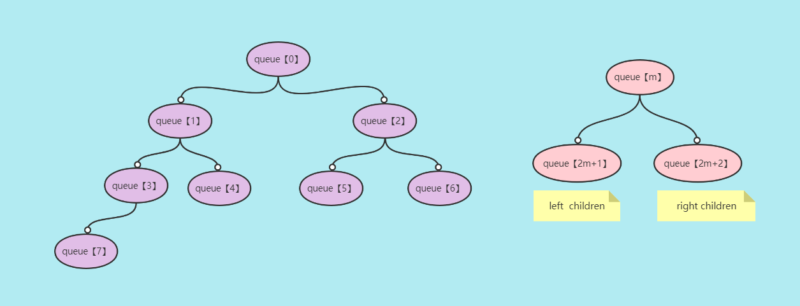
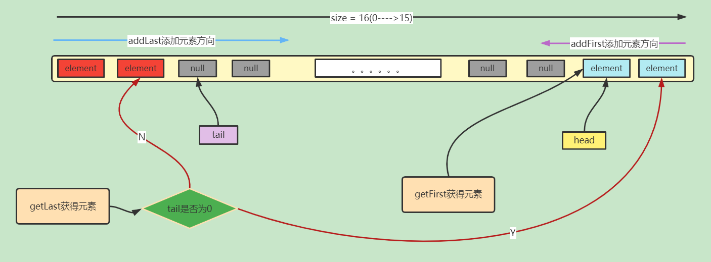
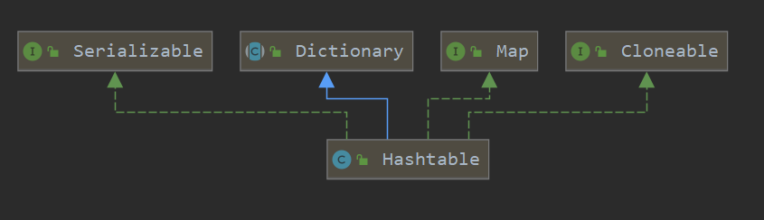
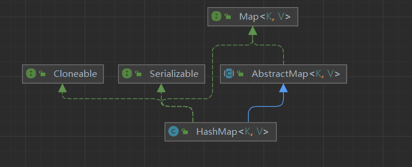
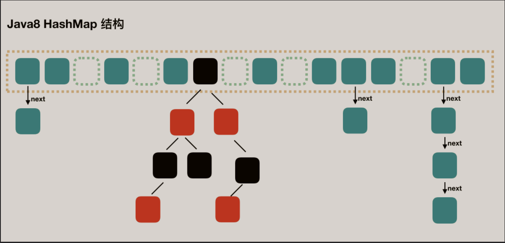
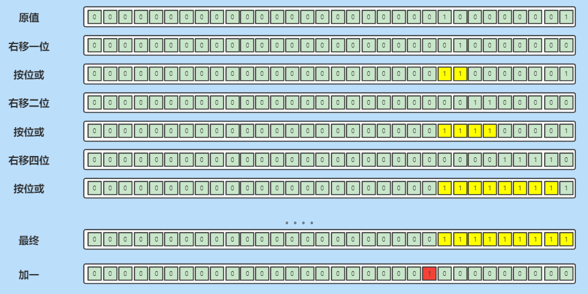
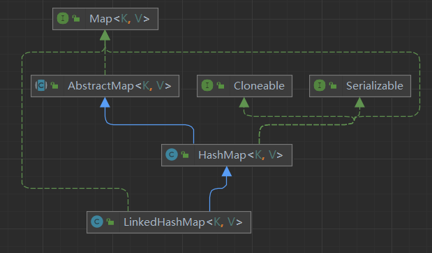
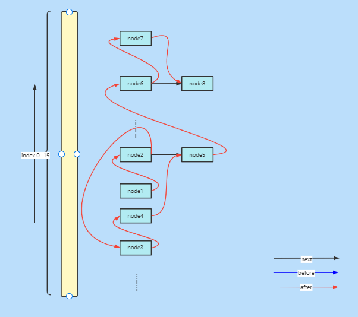
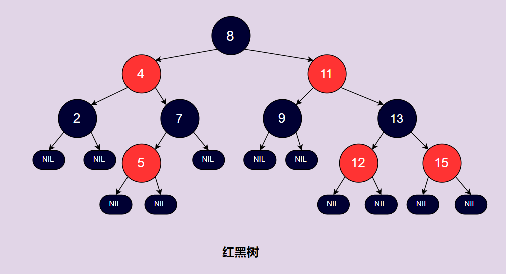

# 集合框架总结

## 概览

### 简介

图片说明：

- 虚线标识实现、实线标识继承
- 绿色背景是具体实现类,粉色背景是抽象接口
- 左上角`legacy`是遗留的,线程安全的集合
- ⭕圈圈颜色,标识集合底层实现。是数组、链表、二叉堆、哈希表还是红黑树


容器，就是可以容纳其他Java对象的对象。*Java Collections Framework(JCF)*为Java开发者提供了通用的容器，其始于JDK 1.2，优点是:

- 降低编程难度
- 提高程序性能
- 提高API间的互操作性
- 降低学习难度
- 降低设计和实现相关API的难度
- 增加程序的重用性

集合框架主要分为Collection接口和Map接口。

Java容器里只能放对象，对于基本类型(int, long, float, double等)，需要将其包装成对象类型后(Integer, Long, Float, Double等)才能放到容器里。很多时候拆包装和解包装能够自动完成。这虽然会导致额外的性能和空间开销，但简化了设计和编程。


### collection

- list接口
  - ArrayList基于动态数组实现,支持随机访问
  - LinkedList基于双向链表实现,只能顺序访问、不支持随机访问,但对插入友好
  - Vector  和ArayList相似,但是它线程安全(使用Synchronized保证)
- set接口
  - HashSet    基于HashMap实现
  - LnkedHashSet   基于双线链表+HashSet实现
  - TreeSet     基于红黑树实现
- queue接口
  - LinkedList   
  - PriorityQueue  优先级队列,基于二叉堆实现

### Map

- HashTable  和HashMap类似,但线程安全。遗留类,不应该被使用,没有线程安全的情况下使用HashMap,有线程安全的情况下使用ConcurrentHashMap。因为CHM引入了分段锁效率较高。

- HashMap  哈希表

- LinkedHashMap  双向链表+HashMap  牺牲空间保证Map节点的有序性。插入顺序和最近

- TreeMap 基于红黑树实现

  

## Iterable-Collection

### List

#### ArrayList

##### 继承关系


- Clonable

  > 实现此接口才可以重写Object的Clone()方法,利用Array.copy和System.ArrayCopy拷贝,这是个浅拷贝。
  >
  > 会将模数modCount置零,且拷贝时会忽略数组中的空对象

- Serializable

  > 实现此接口对象才可以序列化传输。JDK提供的ObjectOutputStream、ObjectInputStream。
  >
  > 序列化时会保存集合的size，并且忽略数组中的空对象,反序列化先读取size然后循环读取对象放到数组中

- RandomAccess

  > 标志性接口,没作用,表示支持随机访问。Vector也实现了此接口

- AbstractList

##### 底层及结构

> 对象数组Object[],可接受任意类型的对象。

##### 属性和方法

###### 属性：

> - 底层结构：对象数组，Object类型可接受任意类型元素
> - 对象数组使用transient修饰,不会参与序列化
> - size：数组元素个数,不是数组大小

```java
//序列号
private static final long serialVersionUID = 8683452581122892189L;
//默认初始容量
private static final int DEFAULT_CAPACITY = 10;
//空对象数组，初始化ArrayList如果size等于0的话，则初始化为该空数组
private static final Object[] EMPTY_ELEMENTDATA = {};
//默认空对象数组，ArrayList无参构造初锁始化的空数组
private static final Object[] DEFAULTCAPACITY_EMPTY_ELEMENTDATA = {};
//对象数组,ArrayList底层结构,集合成员都存储在此
transient Object[] elementData; 
//元素个数、注意不是数组长度
private int size;
```

###### 构造函数

可定义容量,可拷贝

```java
public ArrayList(int initialCapacity);
public ArrayList();
public ArrayList(Collection<? extends E> c);
```

> 常用操作：

```java
new ArrayList(Arrays.asList(1,2,3));
```

###### 扩容

- ensureCapacity(int minCapacity);是一个public方法,供程序员使用,当我们提前知道集合大小,则可以指定集合容量
- 自动扩容,使用集合容器,一般不需要指定,他会自动扩容,ArrayList默认容量10,每次扩容1.5倍
- 扩容会调用Array.copyof()方法对原数组对象做一个浅拷贝

```java
public void ensureCapacity(int minCapacity);
private Object[] grow(int minCapacity);
```

###### 添加元素

- add(E e)
- add(int index,E e)
- addAll(Collection<? extends E> coll)
- addAll(int  index, Collection<? extends E> coll)

> 添加一个或多个元素,插入元素之前判断容量是否充足,不充足则扩容。
>
> 底层是一个对象数组，添加一个元素时,直接在下标size处插入元素即可。添加多个元素时通过数组拷贝的方式。
>
> 指定下标插入元素,需要首先数组后移,再插入元素。

###### 更新集合

- set(int  index, E e)      

  > 替换元素并返回旧值

- remove(int  index)

  > 移除指定下标处元素。通过数组拷贝前移来覆盖移除元素,并将尾部元素置为null

- remove(Object o)

  > 通过循环equals来找到待移除元素下标。通过数组拷贝前移来覆盖移除元素,并将尾部元素置为null

- removeAll(Collection<? extends E> c)

  > 移除所有元素,通过数组拷贝来实现

##### 小结论

- ArrayList底层是一个对像数组,添加拿取基本数据类型,会进行自动装箱拆箱
- ArrayList初始化默认容量为10,每次扩容1.5倍。扩容需要数组拷贝,性能消耗大头,如果知道容量大小则可以预先指定,避免频繁扩容。扩容数组拷贝是一个浅拷贝
- ArrayList优化了clone(),ArrayList拷贝会忽略集合中的null元素。
- ArrayList优化了序列化,Arraylist序列化会忽略集合中的null元素。
- ArrayList支持随机访问,访问性能较高。对插入不友好,对查询友好。


#### LinkedList


##### 继承关系


- Clonable

  > 实现此接口才可以重写Object的Clone()方法,这是一个浅拷贝。
  >
  > 拷贝逻辑：LinkedList的所有属性都是transient的。首先拷贝LinkedList引用,再循环调用add(E e)方法加入链表尾部,add(E e) 方法会创建新的节点添加到链表尾部。

- Serializable

  > 实现此接口对象才可以序列化传输。JDK提供的ObjectOutputStream、ObjectInputStream。
  >
  > 序列化时会保存链表的size，以及所有Node的item。

- Deque

  > 双向队列接口,LinkedList底层是一个双向链表,实现Dequue标准,加入链表就是入队。
  >
  > 提供 pop-入队   poll() 出队等操作。

##### 底层及结构

> LinkedList底层是一个双向链表,内存维护者一个个Node节点,Node节点中存储着前期和后继节点指针和链表元素值。
>
> LinkedList实现了List和Deque接口,也就是说LinkedList既可以作为链表也可以作为队列和栈使用。关于栈或队列,首选的就是ArrayDeque,它拥有更好的性能。
>
> LinkedList的实现结构,决定了所有跟有关下标的操作都是线性时间。


##### 属性和方法

###### 属性

> 所有属性都不参与序列化,手动写入size和每个node的item。

```java
// 集合元素个数
transient int size = 0;
// 头节点指针
transient Node<E> first;
// 尾节点指针
transient Node<E> last;

private static class Node<E>
// 元素值
E item;
// 前驱节点
Node<E> next;
// 后继节点
Node<E> prev;
```


###### 构造函数

> LinkedList没有容量限制

```java
public LinkedList()；
public LinkedList(Collection<? extends E> c)
```

###### 添加元素

- add( E  e)
- add(int index, E e)
- addAll(Collection c)
- addAll(int index，Collection c)

> add(E e)方法默认尾插法插入元素。
>
> add(int index, E e)方法,首先通过线性查找到具体插入位置,然后插入元素。
>
> addAll(Collection c) ==> addAll(size ,  c)
>
> addAll(int index，Collection c)不会循环调用add(int index, E e)，来实现。而是先将c中的元素组成一个链表,然后将链表拼接上去


###### 更新元素

- removeFirst()
- removeLast()
- remove(E e)
- remove(int  index)
- set(int index, E e)

> 移除首尾节点消耗的是常数时间
>
> 移除指定下标消耗的是线性时间

###### 查找

- indexOf(Object o)
- get(int index)

###### 队列相关操作

- peek()   返回队首元素,队列不做修改
- element()    返回队首元素,队列不做修改
- poll()  出队
- remove()  出队
- offer(E  e)  入队


- offerFirst(E e)    入队,first之前
- offerLast(E  e)   入队,last之后
- peekFirst()
- peekLast()
- pollFirst()
- pollLast()
- push()    入队,(入栈),,first之前
- pop()      出队,(出栈)


##### 小结论

- LinkedList底层是一个双向链表,实现了Deque和List接口,它既可以作为链表使用也可以作为队列和栈使用。(使用队列和栈首选ArrayDeque)
- LinkedList是链表,内存不连续,不用提前申请内存,长度没有限制
- LinkedList优化了clone()方法,clone()方法只拷贝链表的大小(size)和各个Node的item,避免存储Node造成空间浪费
- LinkedList优化了序列化,首先LinkedList的所有属性都是Transient的,不参与序列化,序列化只存储链表的大小(Size)和Node节点的item避免存储Node造成空间浪费
- LinkedList对插入友好对查找不友好,因为其实现是链表，和下标有关的操作都是线性的。但是LinkedList也做了优化，比如查找下标index小于size的一半从头节点开始变量,如果大于一半则从尾节点开始遍历


#### Vector

> 和ArrayList类似,线程安全。

### Set

> 不重复集合

#### HashSet

> 基于HashMap实现，HashSet只是对HashMap进行一层封装。

##### 继承关系


##### 底层结构

> 基于HashMap实现,HashMap的key为元素,value为固定的new Objject()对象。

##### 属性和方法

###### 属性

> map：HashSet底层使用HashMap实现
>
> PRESENT： HashSet的元素都作为HashMap的KEY,那么Hash Map的value使用present填充

```java
private transient HashMap<E,Object> map;

private static final Object PRESENT = new Object();
```

###### 构造方法

> HashSet是基于HashMap实现的,HashSet的构造函数就是对HashMap的初始化。
>
> 其中HashSet(Collection<? extends E> c)这个构造函数有一个关于容量的计算:`(c.size()/.75f) + 1`,这是为了防止HaashMap频繁扩容。

```java
public HashSet() {
    map = new HashMap<>();
}
public HashSet(Collection<? extends E> c) {
    map = new HashMap<>(Math.max((int) (c.size()/.75f) + 1, 16));
    addAll(c);
}
public HashSet(int initialCapacity, float loadFactor) {
    map = new HashMap<>(initialCapacity, loadFactor);
}
```


###### 状态方法

- size()
- isEmpty()
- contains(Object o)

###### 添加元素

- add(E e)       调用的是 `map.put(e, PRESENT)`方法,set的元素值作为hashMap的key，hashmap的value则用PRESENT填充。

```java
public boolean add(E e) {
    return map.put(e, PRESENT)==null;
}
```

###### 更新集合

- remove(Object o)
- clear()

```java
public boolean remove(Object o) {
    return map.remove(o)==PRESENT;
}
```

##### 小结

- HashSet基于HashMap实现,HashMap的key作为HashSet的元素,HashMap的value使用固定对象填充
- HashSet的元素不允许重复可以为null。判重逻辑是首先判断hashCode是否相等,在使用equals进行安全校验
- 拷贝优化：不直接浅拷贝HashSet共享同一个hashMap,而是同时拷贝HashMap，这样拷贝对象不会影响到原型对象
- 序列化优化：序列化写入元素个数(size)、容量、加载因子、HashMap的Key。


#### LinkedHashSet

> LinkedHashSet  基于 LinkedHashMap实现，LinkedHashSet = HashSet + 双向链表。
>
> LinkedHashMap的节点(内部类Node是HashMap.Node的子类),比HashMap.Node的节点多了前后指针。

#### TreeSet

> TreeSet基于红黑树实现，内部维护一个TreeMap。TreeSet天然具有排序功能，可添加可排序的元素，或自定义集合比较器。

### Queue & Deque

> `Queue`是`Collection`的子类，除了具有集合相关方法外，还扩展了队列相关方法。
>
> `Queue` 是单端队列，即只能从一端插入元素，另一端删除元素，实现上一般遵循 **先进先出（FIFO）** 规则。
>
> `Deque` 是双端队列，在队列的两端均可以插入或删除元素,`Deque` 继承了 `Queue` 接口, 增加了在队首和队尾进行插入和删除的方法

#### queue

```java
boolean add(E e);//添加到队列尾部。 一般借助offer方法实现，在存在有容量限制的队列,当队列满了再插入元素可能会抛出IllegalStateException("Queue full")异常
boolean offer(E e); // 添加元素到队列尾部,此方法比add()方法好
E remove(); // 检索并删除此队列的头部。此方法与poll()的唯一不同之处在于，如果队列为空，则抛出异常。
E poll();// 检索并删除此队列的头部，如果此队列为空则返回null。
E element();//检索但不删除此队列的头。此方法与peek方法的唯一不同之处在于，如果队列为空，则抛出异常。
E peek();//检索但不删除此队列的头部，如果此队列为空则返回null。
```


##### ArrarQueue

> 遗留类，单向循环队列。
>
> 底层维护一个数组，两个指针`head`、`tail`分别对应队头、队尾，从tail入队，head出队，当head == tail时（也就是容量不足时），任然进行添加元素操作会报异常（full queue）。
>
> 它并没有实现Queue接口。

##### PriorityQueue

> 优先级队列，入队出队顺序和队列内元素优先级有关，高优先级的元素优先出队，PriorityQueue可添加实现了Comparable接口的元素或者自定义比较器。
>
> PriorityQueue是一个二叉堆，默认小顶堆，可自定义比较器变为大顶堆。

> PriorityQueue底层是一个数组:
>
> - 任意父节点 （下标为m），大于或小于其两个子节点(下标为2m+1,2m+2)
> - 堆顶元素为极值(最大值或最小值)，所以借助PriorityQueue可以找出第几大元素



> 添加元素逻辑：
>
> - 添加元素到数组尾部，记录下标为k
> - 找到下标为k的节点的父节点，(k-1)/2 
> - 父节点和此节点进行比较
>   - 大于父节点，父节点后移
>   - 小于父节点一切都不用做


#### deque

> 此接口是queue接口的子接口,是双向队列的抽象标准。双向链表LinkedList就实现了此接口。
>
> 因为是双向队列，提供了从头部入队、从尾部入队、头部出队、尾部出队等丰富方法。

##### LinkedList

> LinkedList双向链表实现了Deque接口。

##### ArrayDeque

> 双向循环队列，实现了Deque接口。
>
> 底层维护一个数组，数组长度为2的幂次方，两个指针(head、tail)分别对应队头、队尾。
>
> 容量不足时(tail == head)会自动扩容，扩2倍。

> 一些算法，和HashMap很相似

- 计算数组长度,也就是队列容量

  > 一步步移位或运算

- 计算入队元素下标

  > 由于队列容量为2的幂次方，可以使用与运算计算



#### 其他

> 其他的一些队列：
>
> - BlockingQueue  阻塞队列等

## map


### HashTable

> - 遗留类，实现Map接口，key-value数据结构。
> - 线程安全，synchronized保证
>
> 理解它有助于理解HashMap，HashMap是HashTable单线程环境下的优化。



> 缺点

- 没有扰动函数，当遇到糟糕的哈希算法时，容易发生哈希冲突
- 通过算数取余的方式确认散列下标，相较于位运算效率较低

> 好的地方:确认散列下标有一个于运算，是为了防止出现负数下标

`(hash & 0x7FFFFFFF) % tab.length;`

### Properties

> 作为配置工具类使用，不同版本的JDK实现存在差异。
>
> 使用Synchronized保证线程安全

JDK1.8：

> JDK1.8的Properties继承自HashTable，其存值取值逻辑都是基于HashTable。

JDK17：

> JDK17的Properties也继承自HashTable，但重写了大部分方法，多了一个内部属性ConcurrentHashMap  map，JDK17下的Properties的存取值都基于此map。

虽然不同版本实现不一样但是使用方式大同小异：

- 作为map使用
- 作为配置工具类使用
  - 可直接setProperties()，设置属性
  - 可读取配置文件，解析属性。可以是`.properties`或`.xml`类型的文件
  - 可输出配置文件，

> 作为map和配置工具使用

```java
final Properties properties = new Properties();
properties.setProperty("name","于延闯");
properties.put(1,"age");
System.out.println(properties.get(1));
System.out.println(properties.getProperty("name"));
```

> 可以读取和输出properties或xml文件

```java
@Test
public void loadFromXmlOrProperties() throws IOException {

    // loadFromProperties
    final Properties properties = new Properties();
    properties.load(this.getClass().getClassLoader().getResourceAsStream("test.properties"));
    System.out.println(properties);


    final Properties propertiesxml = new Properties();
    propertiesxml.loadFromXML(this.getClass().getClassLoader().getResourceAsStream("testxml.xml"));
    System.out.println(propertiesxml);


}
@Test
public void storeToXmlOrProperties() throws IOException {

    // loadFromProperties
    final Properties properties = new Properties();
    properties.load(this.getClass().getClassLoader().getResourceAsStream("test.properties"));
    System.out.println(properties);
    
    properties.storeToXML(new FileOutputStream("D:\\demo.xml"),"测试", StandardCharsets.UTF_8);

}
```


### HashMap

#### 继承关系



- Cloneable      浅拷贝
- Serializable  优化序列化反序列化（不序列化数组中的空元素）
- Map  实现map接口

#### 底层及结构

> 数组 + 链表 + 红黑树

下图是夸张去情况，在这之前早早就扩容了：




#### 属性和方法


##### 属性

```java
//默认容量，默认对象数组长度
static final int DEFAULT_INITIAL_CAPACITY = 1 << 4;
// 最大容量
static final int MAXIMUM_CAPACITY = 1 << 30;
// 默认加载因子（JDK官方给的，兼顾时间空间，哈希碰撞相对较少且空间利用率较高）
static final float DEFAULT_LOAD_FACTOR = 0.75f;
// 链表转红黑树临界值（当链表长度达到此临界值，就会尝试转化为红黑树）
static final int TREEIFY_THRESHOLD = 8;
// 红黑树转链表临界值
static final int UNTREEIFY_THRESHOLD = 6;
// 最小转红黑树容量（链表转红黑树还有一个条件：对象数组长度达到64）
static final int MIN_TREEIFY_CAPACITY = 64;
// 对象数组 节点散落在此数组上（不参与序列化，因为数组有空元素）
transient Node<K,V>[] table;
// 节点集合
transient Set<Map.Entry<K,V>> entrySet;
// key集合
transient Set<K>        keySet;
// value集合
transient Collection<V> values;
// HashMap成员个数
transient int size;
// 模数  hashmap被修改次数（fail-fast机制）
transient int modCount;
// 临界值（可自定义）
int threshold;
// 加载因子 （可自定义，且必须在构造器初始化）
final float loadFactor;
```


##### 构造方法

> loadFactor 被final需要在构造器中初始化。

在初始化HashMap时尽量指定其容量，避免频繁扩容造成不必要的性能损失。那么如何正确的指定HashMap的容量呢？公式就是`capacity = (s / loadFactor) + 1.0F` S为需要的容量，capacity 为实际容量。Guaua包和hutool包下都有类似实现。

```java
public HashMap(int initialCapacity, float loadFactor) {
    if (initialCapacity < 0)
        throw new IllegalArgumentException("Illegal initial capacity: " +
                                           initialCapacity);
    if (initialCapacity > MAXIMUM_CAPACITY)
        initialCapacity = MAXIMUM_CAPACITY;
    if (loadFactor <= 0 || Float.isNaN(loadFactor))
        throw new IllegalArgumentException("Illegal load factor: " +
                                           loadFactor);
    this.loadFactor = loadFactor;
    this.threshold = tableSizeFor(initialCapacity);
}

public HashMap(int initialCapacity) {
    this(initialCapacity, DEFAULT_LOAD_FACTOR);
}

public HashMap() {
    this.loadFactor = DEFAULT_LOAD_FACTOR; // all other fields defaulted
}
public HashMap(Map<? extends K, ? extends V> m) {
    this.loadFactor = DEFAULT_LOAD_FACTOR;
    putMapEntries(m, false);
}
```


##### 扰动函数

> HashTable中就没有扰动函数，这也可能导致HashTable频繁哈希碰撞。
>
> HashMap是通过key的哈希值除容量取余来决定节点散列位置，也就是低位决定散列位置，扰动函数的作用就是将高位与低位的特征结合放在低位，这样低位就代表整个哈希值的特征。

```java
static final int hash(Object key) {
    int h;
    return (key == null) ? 0 : (h = key.hashCode()) ^ (h >>> 16);
}
```


##### tableSizeFor(int  cap)

> 此方法在Java8中和java17中的实现不同，但原理大致相同。
>
> 在创建HashMap的时候我们有时需要指定HashMap的容量，而这个容量可能不是2的幂次方数，此方法的作用就是找到大于cap且离他最近的2的幂次方数。例：7  --> 8   13 --> 16.........

使用数学运算借助Math类下的方法也可以实现：

使用换底公式可以得到cap以2为底的幂，如果幂有小数则进位

$log_2n = log_en/Log_e2 $

```java
double m = Math.log(n) / Math.log(2);
//没有小数返回，有小数向上进一
int m2 = (int) Math.ceil(m);
//2的m2幂次方
return (int) Math.pow(2, m2);
```

###### jdk8的实现

> 逻辑就是，将自定义容量cap，低位全变成1，最后加一得到的就是想要的容量。
>
> 方法的第一行cap - 1的目的是防止自定义容量cap原本就是2的幂次方数。

例：

| 十进制 | 二进制 | 减一   | 低位转1 | 最后加一     |
| ------ | ------ | ------ | ------- | ------------ |
| 7      | 0111   | 0110   | 0111    | 1000（8）    |
| 13     | 01101  | 01100  | 01111   | 10000（16）  |
| 25     | 11001  | 11000  | 11111   | 100000（32） |
| 32     | 100000 | 011111 | 011111  | 100000（32） |

```java
static final int tableSizeFor(int cap) {
    int n = cap - 1;
    n |= n >>> 1;
    n |= n >>> 2;
    n |= n >>> 4;
    n |= n >>> 8;
    n |= n >>> 16;
    return (n < 0) ? 1 : (n >= MAXIMUM_CAPACITY) ? MAXIMUM_CAPACITY : n + 1;
}
```


图解：例   129



###### Jdk17实现

> `Integer.numberOfLeadingZeros(cap - 1);`方法的作用得到 `cap - 1`高位0的个数。例：1  =>32  2=>31  3=>31  4=>30
>
> `-1 >>>` -1无符号右移，将得到一个 类似于 000...111..11这样的数，还是一样的将自定义容量cap低位全变为1。
>
> cap - 1的目的也是为了防止cap就是2的幂次方。

```java
static final int tableSizeFor(int cap) {
    int n = -1 >>> Integer.numberOfLeadingZeros(cap - 1);
    return (n < 0) ? 1 : (n >= MAXIMUM_CAPACITY) ? MAXIMUM_CAPACITY : n + 1;
}
```

```java
@IntrinsicCandidate
public static int numberOfLeadingZeros(int i) {
    // HD, Count leading 0's
    if (i <= 0)
        return i == 0 ? 32 : 0;
    int n = 31;
    if (i >= 1 << 16) { n -= 16; i >>>= 16; }
    if (i >= 1 <<  8) { n -=  8; i >>>=  8; }
    if (i >= 1 <<  4) { n -=  4; i >>>=  4; }
    if (i >= 1 <<  2) { n -=  2; i >>>=  2; }
    return n - (i >>> 1);
}
```


##### put(key  value)方法

> 将一组键值对`<key,value>`放入HashMap。
>
> 这里涉及
>
> - 如何确定散列下标
> - 如何解决哈希冲突
> - 扩容

###### 如何确定散列下标

> HashTable使用除取余的方式。
>
> HashMap按理说也是，只不过采用的位运算，且前提是HashTable的Capacity为2的幂次方。

HashTable：

 (hash & 0x7FFFFFFF):目的是为了防止出现负数

```java
int index = (hash & 0x7FFFFFFF) % tab.length;
```

HashMap：

n为HashMap的容量，在n为2的幂次方的前提下，(n - 1) & hash等价于   (hash & 0x7FFFFFFF)  % n

```java
int i = (n - 1) & hash
```


###### 如何解决哈希冲突

> 在HashMap中哈希冲突指的是什么？

广义上的哈希冲突指的是不同对象的哈希值相同。在HashMap中哈希冲突指的是，不同的key散列到同一个数组下标处。

> HashMap中如何判断发生了哈希冲突？

key的哈希值相等，且equals返回true，则不发生哈希冲突，直接替换旧值

key的哈希值相等，且equals返回false，则发生哈希冲突

> HashMap如何解决哈希冲突？

拉链法解决哈希冲突。HashMap的每一个节点都存在一个next指针，如果发生哈希冲突则将此节点连接到单向链表尾部。

当链表长度达到8且数组长度达到64则将链表转化为红黑树，因为链表的查找效率低，红黑树的查找效率近似二分查找，好一些。


###### 扩容

> HashMap支持动态扩容，每次扩容2倍，保证HashMap的容量为2的幂次方。但最好优先指定容量，避免多次扩容。
>
> 缺点：扩容需要重新哈希，损耗的时间空间代价不小（一般选择String作为key，而String有哈希缓存，好一点）
>
> 优点：重哈希会缩短链表，降低红黑树层数和红黑树退化成链表，进而提示HashMap的搜索效率


### LinkedHashMap

> HashMap非常牛逼，但是有一个缺点就是无序。如果你需要一个有序的key-value结构的容器，那么LinkedHashMap再合适不过了。
>
> LinkedHashMap可以看作是LinkedList + HashMap，通过牺牲时间与空间来达到有序的目的（插入顺序或最近最久未使用）。

#### 继承关系

> LinkedHashMap是HashMap的一个子类



#### 底层及结构

> HashMap + LinkedList



#### 属性和方法

> LinkedHashMap是HashMap的子类，大部分属性和方法都继承自HashMap。一下列出LinkedHashMap独有的属性和方法。

##### 属性

```java
// 头节点
transient LinkedHashMap.Entry<K,V> head;
// 尾节点
transient LinkedHashMap.Entry<K,V> tail;
// 排序方式。  true：访问顺序  false：插入顺序（默认）
final boolean accessOrder;
```


##### 内部类

> LinkedHashMap的节点类继承了HashMap的节点类，并扩展了两个属性`before`、`after`。

```java
static class Entry<K,V> extends HashMap.Node<K,V> {
    Entry<K,V> before, after;
    Entry(int hash, K key, V value, Node<K,V> next) {
        super(hash, key, value, next);
    }
}
```

> LinkedHashMap重写了  newNode  方法，新建节点尾插法插入双向链表。

```java
// hashMap的newNode方法
Node<K,V> newNode(int hash, K key, V value, Node<K,V> next) {
    return new Node<>(hash, key, value, next);
}
// LinkedHashMap的newNode方法
Node<K,V> newNode(int hash, K key, V value, Node<K,V> e) {
    LinkedHashMap.Entry<K,V> p =
        new LinkedHashMap.Entry<>(hash, key, value, e);
    linkNodeLast(p);
    return p;
}
```

##### 方法

###### afterNodeAccess

> 节点被访问过后所作的操作，HashMap中此方法什么也不做。
>
> LinkedHashMap中当`accessOrder`为true，也就是按访问顺序（最近最久未访问），会将被访问的节点移动到双向链表尾部。

```java
// HashMap中什么也不做
void afterNodeAccess(Node<K,V> p) { }

// LinkedHashMap
void afterNodeAccess(Node<K,V> e) { // move node to last
    LinkedHashMap.Entry<K,V> last;
    if (accessOrder && (last = tail) != e) {
        LinkedHashMap.Entry<K,V> p =
            (LinkedHashMap.Entry<K,V>)e, b = p.before, a = p.after;
        p.after = null;
        if (b == null)
            head = a;
        else
            b.after = a;
        if (a != null)
            a.before = b;
        else
            last = b;
        if (last == null)
            head = p;
        else {
            p.before = last;
            last.after = p;
        }
        tail = p;
        ++modCount;
    }
}
```


###### afterNodeRemoval

> 同样的此方法在HashMap中什么都没做。
>
> LinkedHashMap中需要断双向链表。

```java
void afterNodeRemoval(Node<K,V> e) { // unlink
    LinkedHashMap.Entry<K,V> p =
        (LinkedHashMap.Entry<K,V>)e, b = p.before, a = p.after;
    p.before = p.after = null;
    if (b == null)
        head = a;
    else
        b.after = a;
    if (a == null)
        tail = b;
    else
        a.before = b;
}
```


#### 小结

- LinkedHashMap是HashMap的子类，基于HashMap实现
- LinkedHashMap的节点内部类Entry继承自HashMap的Node，对其做了扩展，多了两个属性 before、after，这是LinkedHashMap有序的基础
- LinkedHashMap牺牲时间与空间使得哈希表有顺序，对应标志为accessOrder，访问顺序(true)或者插入顺(false)，默认插入顺序。如果是访问顺序的话，当节点被访问则该节点会移动到双向链表尾部


### TreeMap

#### 基础

> TreeMap基于红黑树实现。实现了SortedMap接口，也就是TreeMap的节点会按照key的大小有序排列。

TreeMap是非同步的可以使用下面的方式包装成同步Map：

SortedMap m = Collections.synchronizedSortedMap(new TreeMap(...));

##### 红黑树

> 红黑树中的节点，一类被标记为黑色，一类被标记为红色，它是一种不严格的平衡二叉查找树，但是红黑树以较少的旋转从而在性能上优于平衡二叉查找树。
>
> 红黑树结构。




> 红黑树特点

- ①节点是红色或者黑色（一般用boolean）

- ②根节点是黑色的

- ③每个叶子节点都是黑色的空节点（NIL）使用NIL填充叶子节点

- ④每个红色节点的两个子节点都是黑色的，也就是说没有连续的两个红色节点

- ⑤任意节点到其叶子节点的所有路径，包含黑色节点数量一致

第四和第五条特点决定了节点到叶子节点的所有路径长度差不超过1倍，红黑树任意左右子树的高度差不会相差超过1倍。


#### 原理

> TreeMap查询原理：通过key一层一层比较，最终得到结果，效率近似于二分查找
>
> TreeMap的难点在于添加节点和删除节点改变了红黑树约束条件后，对红黑树的调整(1、改变颜色 2、旋转)

==首先红黑树插入的节点都是红色的==，因为如果插入节点是黑色的话，那么需要大量操作来保证红黑树的特点⑤。

#### 插入原理

##### 插入位置的父节点为黑色的

直接插入不会破坏红黑树的特征。


##### 插入位置的父节点为红色的

> 不满足特性④

则需改变节点颜色或旋转来恢复红黑树特性。


### WeakHashMap

> 弱引用的HashMap，WeakHashMap原理和HashMap基本相似，只不过WeakMap内部的节点是通过弱引用来管理的。也就是即便我们没有显示删除节点，节点也有可能会被GC回收。

Java中内存是通过GC自动管理的，GC会在程序运行过程中自动判断哪些对象是可以被回收的，并在合适的时机进行内存释放。GC判断某个对象是否可被回收的依据是，**是否有有效的引用指向该对象**。如果没有有效引用指向该对象(基本意味着不存在访问该对象的方式)，那么该对象就是可回收的。这里的**有效引用** 并不包括**弱引用**。也就是说，**虽然弱引用可以用来访问对象，但进行垃圾回收时弱引用并不会被考虑在内，仅有弱引用指向的对象仍然会被GC回收**。

*WeakHashMap* 内部是通过弱引用来管理`entry`的，弱引用的特性对应到 *WeakHashMap* 上意味着什么呢？**将一对`key, value`放入到 \*WeakHashMap\* 里并不能避免该`key`值被GC回收，除非在 \*WeakHashMap\* 之外还有对该`key`的强引用**。

关于强引用，弱引用等概念以后再具体讲解，这里只需要知道Java中引用也是分种类的，并且不同种类的引用对GC的影响不同就够了


