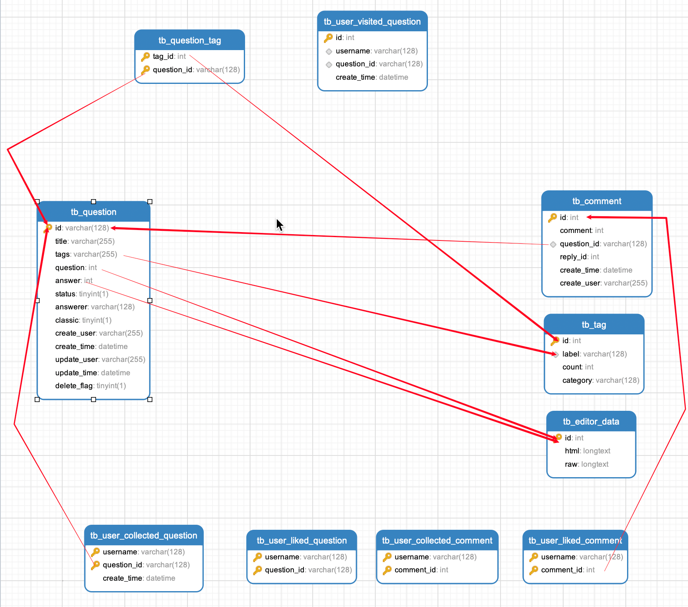
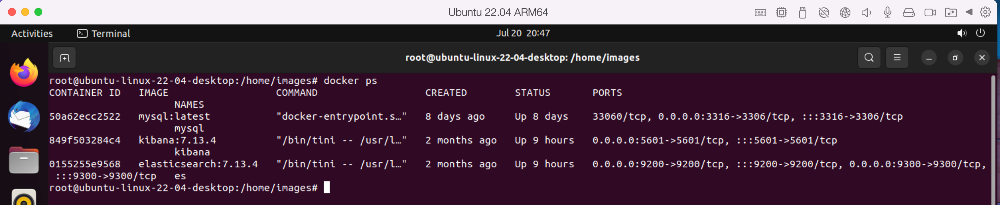
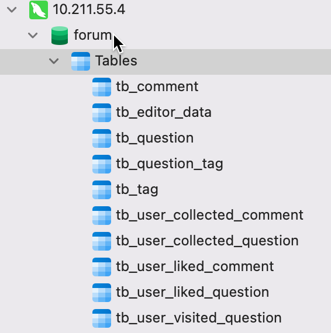
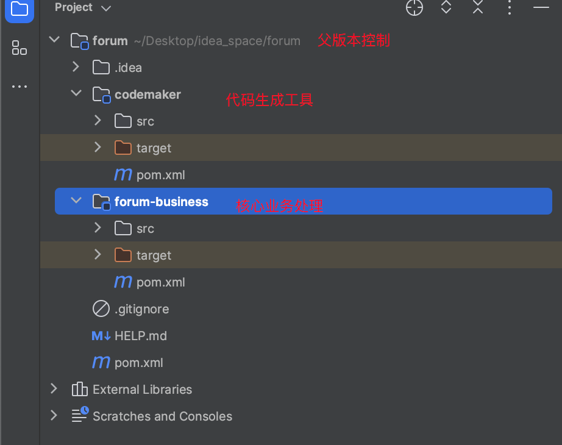

### 表结构梳理

### 技术选型

> - idea
>
> - Jdk17
>
> - maven
>
> - springboot
>
> - mysql
>
> - durid
>
> - mybatis-plus
>
> - es-highleavleclient
>
>   > 只有一个搜索框, 计划按照 标题、标签、问题、回答 模糊搜索。

### 环境搭建

#### 依赖

> 使用pd虚拟机客户端安装 Ubuntu虚拟机,安装docker 搭建环境

#### 项目搭建

##### 数据库初始化

> 数据库名称 `forum`

##### 项目结构

### 编码

- 初始化数据到es
  - 结构体
- 前端输入查询条件
  - es搜索问题
  - 根据问题查询其他信息
    - 评论
    - 点赞数等

#### 初始化数据到es

##### 结构体

> 同步TbQuestion到es, 并将TbQuestion中的逻辑外键替换为对应数据

