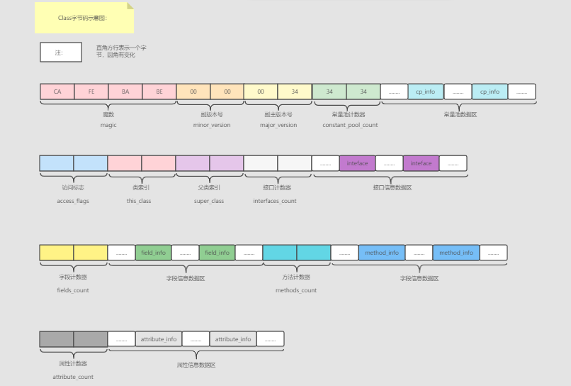

### java如何运行

> java文件由程序员编写，但是不能直接运行，需要经历如下阶段才可以运行。

`.java`文件  ----经历`java`编译器 ` javac`编译 ，此过程会对我们代码进行自动优化   ------------  》`.class`文件 (又叫`java`字节码文件) ---------`java`虚拟机解释----->机器码   ------》交给操作系统运行

> `.class`文件又叫字节码文件，它只面向`java`虚拟机，不面向任何操作系统。这里学习一下`.class`文件的组成结构


<hr>


###  如何查看.class文件信息

> `.class`文件是字节码文件，一字节八位，我们采用16进制查看，每两个数字（0  - F）组成一字节。使用`NotePad++`或其他支持工具。

#### 查看字节码

- 写一个java类，编译一下生成class文件

> 简单的Person类加两个属性

```java
public class Person {
    private String name;
    private int age;
    //getter and setter
}
```

> 编译生成的class文件没什么大的区别，只不过会给我们自动生成无参构造函数

```java
public class Person {
    private String name;
    private int age;
    public Person() {
    }
}
```

- 使用`NotePad++`打开

> 这是16进制的形式，可确定每2个数字代表一个字节，并且内存连续。


####  javap

> `javap`是`java  class`文件的分离器，可以对`class`文件进行简单解释，使得程序员不用直接面对字节码。

> 基本上使用  javap  -v    classpath\classname.class 来查看
>
> 当然如果`class`文件过大，终端显示不友好，可以将信息输出到文件查看。
>
> 使用命令：javap   -v   classpath\classname.class   >  filename

 会输出如图所示的内容,相对于字节码令人更有食欲一些.


<hr>


### class文件内容


#### class文件字节码结构

示意图：



##### 魔数

> 魔数(magic)，是`JVM`用于识别是否是`JVM`认可的字节码文件。
>
> 所有由`java`编译器生成的class字节码文件的首四个字节码都是CA FE BA BE。

当`JVM`准备加载某个`class`文件到内存的时候，会首先读取该字节码文件的首四位字节码，判断是否是CA FE BA BE,如果是则JVM认可，如果不是JVM则会拒绝加载该字节码文件。

> Class文件不一定都是由`.java`文件编译而来的，`Kotlin`以及其他java虚拟机支持的都可以。

比如：

使用Kotlin写一个类：


编译过后查看其字节码：

也是cafebabe开头的


##### 版本号

> 版本号包括主版本号(major_version)和副版本号(minor_version)。
>
> 我们一般只需要关注主版本号，平常所说的java8其实是java1.8。副版本号主要是对主版本的一个优化和bug修复。目前java版本都来到了18了。
>
> 主版本号占用7、8两个字节，副版本号占用5、6两个字节。JDK1.0的主版本号为45，以后版本每升级一个版本就在此基础上加一，那么JDK1.8对应的版本号为52，对应16进制码为0x34。
>
> 一个版本的JVM只可以加载一定范围内的`Class`文件版本号，一般来说高版本的`JVM`支持加载低版本号的`Class`文件，反之不行。`JVM`在首次加载`class`文件的时候会去读取`class`文件的版本号，将读取到的版本号和`JVM`的版本号进行对比，如果`JVM`版本号低于`class`文件版本号，将会抛出`java.lang.UnsupportedClassVersionError`错误。

我们修改一下`Person.class`关于版本号的数据，提高`class`文件的版本号为0x39 ,为10进制57，jvm版本为java1.13。

通过`java <classpath>.classname`运行一下：


> 说我们的jvm只支持运行`java`版本最高为52的`class`文件，也就是`java1.8`。

> 同时也可以通过`javap`命令查看当前`class`文件支持的最低`jvm`版本。


