### java如何运行

> java文件由程序员编写，但是不能直接运行，需要经历如下阶段才可以运行。

`.java`文件  ----经历`java`编译器 ` javac`编译 ，此过程会对我们代码进行自动优化   ------------  》`.class`文件 (又叫`java`字节码文件) ---------`java`虚拟机解释----->机器码   ------》交给操作系统运行

> `.class`文件又叫字节码文件，它只面向`java`虚拟机，不面向任何操作系统。这里学习一下`.class`文件的组成结构


<hr>


###  如何查看.class文件信息

> `.class`文件是字节码文件，一字节八位，我们采用16进制查看。使用`NotePad++`、`UltraEdit`或其他支持工具。

#### 查看字节码

- 写一个java类，编译一下生成class文件

> 简单的Person类加两个属性

```java
public class Person {
    private String name;
    private int age;
    //getter and setter
}
```

> 编译生成的class文件没什么大的区别，只不过会给我们自动生成无参构造函数

```java
public class Person {
    private String name;
    private int age;
    public Person() {
    }
}
```

- 使用`NotePad++`打开

> 这是16进制的形式，可确定每2个数字代表一个字节，并且内存连续。

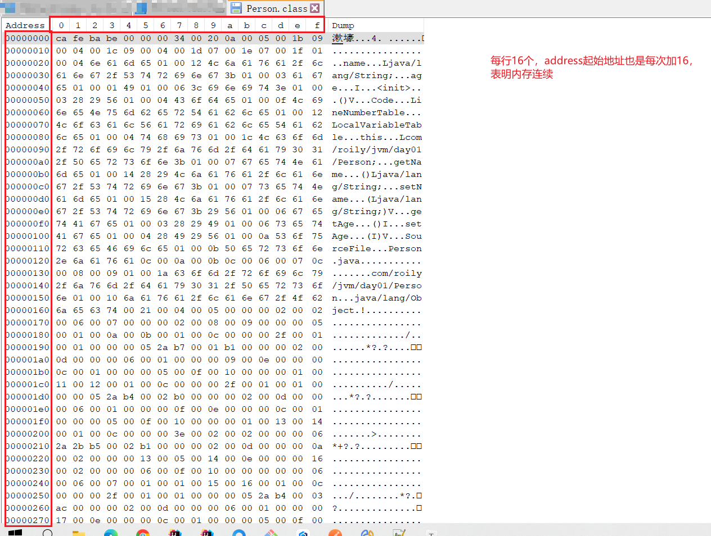

####  javap

> `javap`是`java  class`文件的分离器，可以对`class`文件进行简单解释，使得程序员不用直接面对字节码。

> 基本上使用  javap  -v    classpath\classname.class 来查看
>
> 当然如果`class`文件过大，终端显示不友好，可以将信息输出到文件查看。
>
> 使用命令：javap   -v   classpath\classname.class   >  filename

 会输出如图所示的内容,相对于字节码令人更有食欲一些.

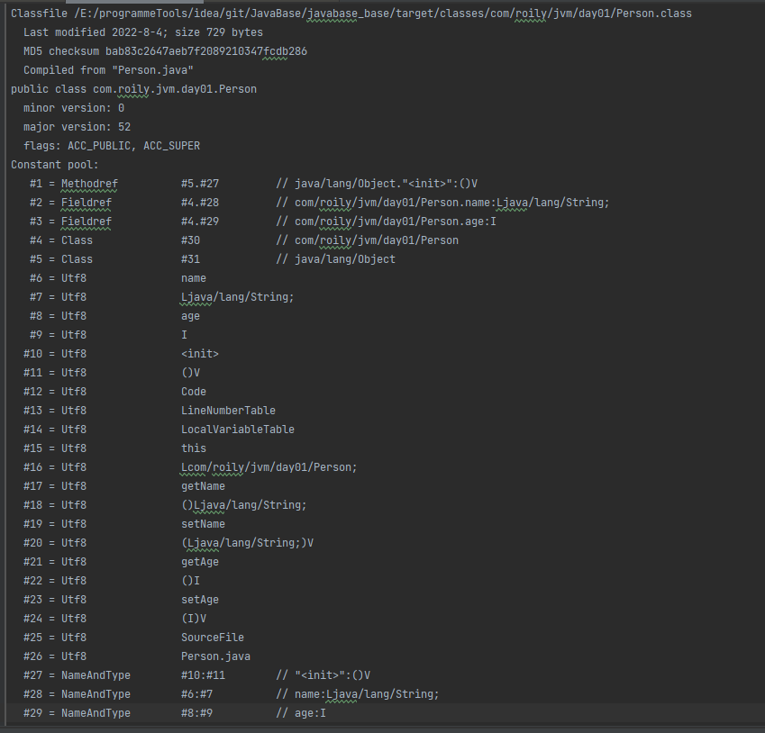

#### jclasslib

> 使用`idea`插件`jclasslib`分析class文件。

安装：

设置 -->Plugins->到Marketplcae搜索下载

使用：

view ->首位 bytecode with JclassLib

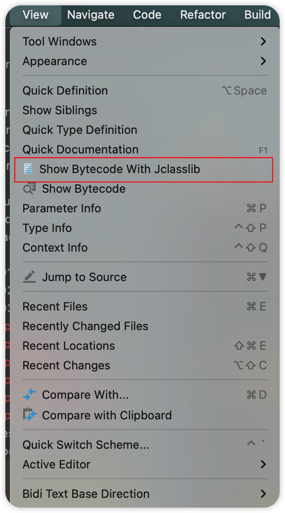


jclasslib为我们友好的分了类：

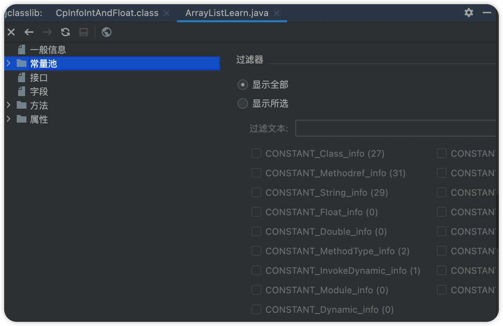


<hr>


### class文件内容


#### class文件字节码结构

示意图：

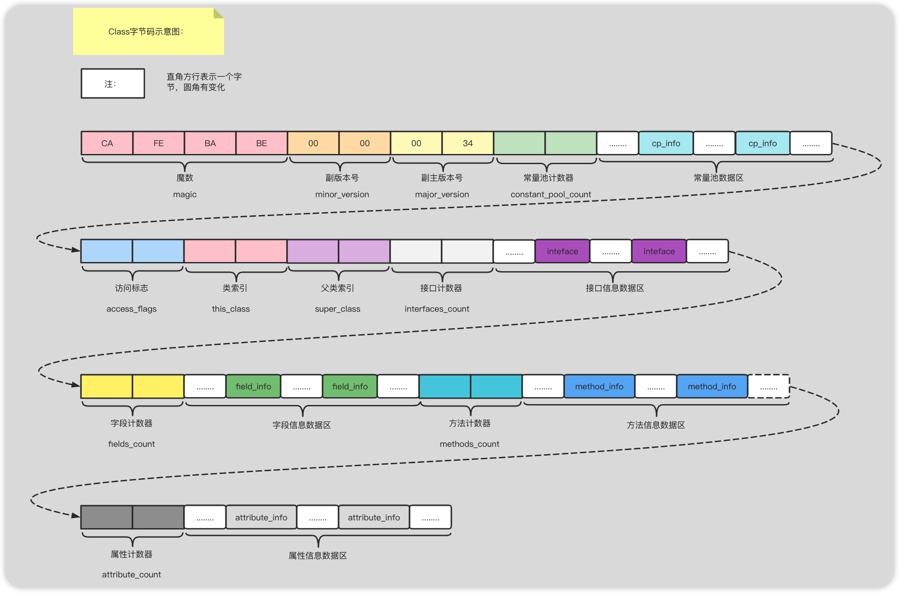

##### 魔数

> 魔数(magic)，是`JVM`用于识别是否是`JVM`认可的字节码文件。
>
> 所有由`java`编译器生成的class字节码文件的首四个字节码都是CA FE BA BE。

当`JVM`准备加载某个`class`文件到内存的时候，会首先读取该字节码文件的首四位字节码，判断是否是CA FE BA BE,如果是则JVM认可，如果不是JVM则会拒绝加载该字节码文件。

> Class文件不一定都是由`.java`文件编译而来的，`Kotlin`以及其他java虚拟机支持的都可以。

比如：

使用Kotlin写一个类：

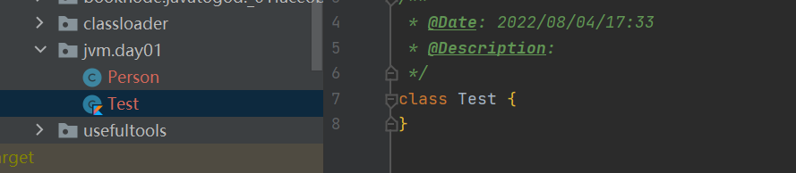

编译过后查看其字节码：

也是cafebabe开头的

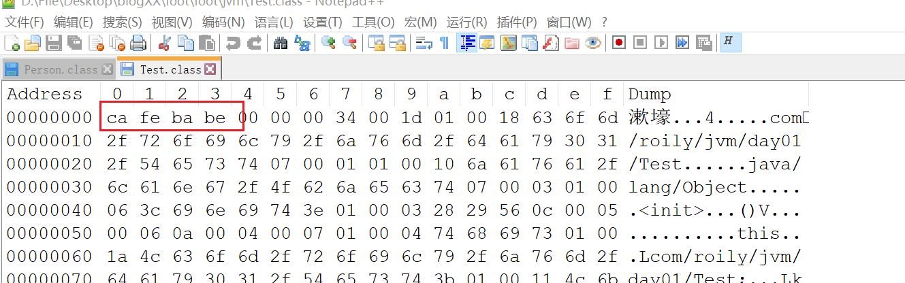


##### 版本号

> 版本号包括主版本号(major_version)和副版本号(minor_version)。
>
> 我们一般只需要关注主版本号，平常所说的java8其实是java1.8。副版本号主要是对主版本的一个优化和bug修复。目前java版本都来到了17了。
>
> 主版本号占用7、8两个字节，副版本号占用5、6两个字节。JDK1.0的主版本号为45，以后版本每升级一个版本就在此基础上加一，那么JDK1.8对应的版本号为52，对应16进制码为0x34。
>
> 一个版本的JVM只可以加载一定范围内的`Class`文件版本号，一般来说高版本的`JVM`支持加载低版本号的`Class`文件，反之不行。`JVM`在首次加载`class`文件的时候会去读取`class`文件的版本号，将读取到的版本号和`JVM`的版本号进行对比，如果`JVM`版本号低于`class`文件版本号，将会抛出`java.lang.UnsupportedClassVersionError`错误。

我们修改一下`Person.class`关于版本号的数据，提高`class`文件的版本号为0x39 ,为10进制57，jvm版本为java1.13。

通过`java <classpath>.classname`运行一下：

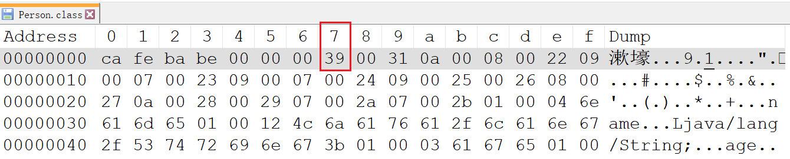

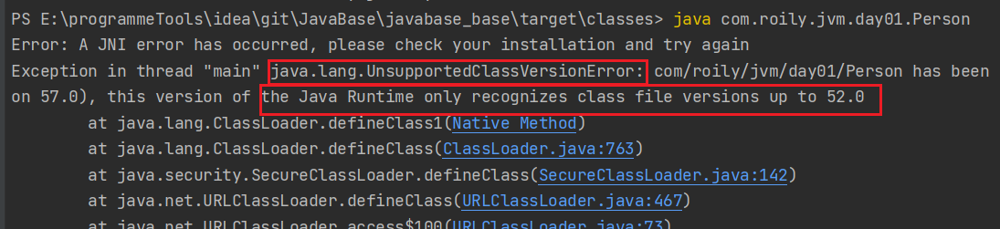

> 说我们的jvm只支持运行`java`版本最高为52的`class`文件，也就是`java1.8`。

> 同时也可以通过`javap`命令查看当前`class`文件支持的最低`jvm`版本。

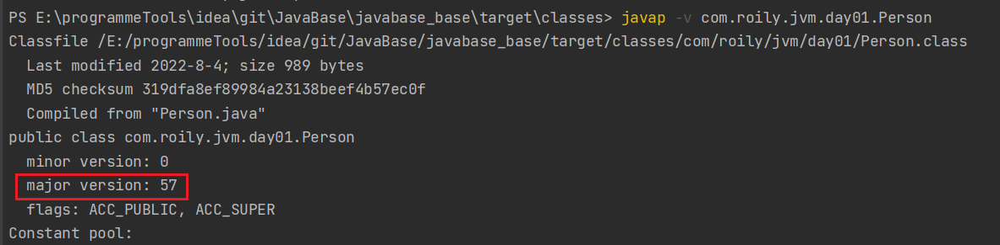


##### 常量池计数器(constant_pool_count)

> 紧跟于版本号后面的是常量池计数器占两个字节。记录整个class文件的字面量信息个数，决定常量池大小。
>
> `constant_pool_count` =  常量池元素个数 + 1。  只有索引在 （0，constant_pool_count）范围内才会有效，索引从1开始。


##### 常量池数据区(constant_pool)

> 常量池类似于一张二维表，每一个结构项代表一条记录，包含`class`文件结构及其子结构中引用的所有字符串常量、类、接口、字段和其他常量。且常量池中每一个元素都具备相似的结构特征，每一个元素的第一字节用做于识别该项是哪种数据类型的常量，称为`tag byte`。


##### 访问标志(access_flags)

> 用于表示一个类、接口、以及方法的访问权限。占用两个字节。

| 标记           | 值（0x） | 作用                                   |
| -------------- | -------- | -------------------------------------- |
| ACC_PUBLIC     | 0x0001   | 公共的                                 |
| ACC_FINAL      | 0x0010   | 不允许被继承                           |
| ACC_SUPER      | 0x0020   | 需要特殊处理父类方法                   |
| ACC_INTERFACE  | 0x0200   | 标记为接口，而不是类                   |
| ACC_ABSTRACT   | 0x0400   | 抽象的，不可被实例化                   |
| ACC_SYNTHETIC  | 0x1000   | 表示由编译器自己生成的，比如说桥接方法 |
| ACC_ANNOCATION | 0x2000   | 表示注解                               |
| ACC_ENUM       | 0x4000   | 表示枚举                               |
|                |          |                                        |

- ACC_SYNTHETIC

> 由编译器自己生成的代码，比如一些桥接方法，我们写一个类实现一个范型接口
>
> 然后使用javap -v查看字节码信息

```java
public class AboutACCSYNTHETIC implements Comparator<String> {
    @Override
    public int compare(String o1, String o2) {
        return 0;
    }
}
```

> 会发现编译器会为我们生成一个桥接方法，类型是Object的，且访问标志存在  ACC_SYNTHETIC

```bash
  public int compare(java.lang.String, java.lang.String);
    descriptor: (Ljava/lang/String;Ljava/lang/String;)I
    flags: ACC_PUBLIC
    Code:
      stack=1, locals=3, args_size=3
         0: iconst_0
         1: ireturn
      LineNumberTable:
        line 16: 0
      LocalVariableTable:
        Start  Length  Slot  Name   Signature
            0       2     0  this   Lcom/roily/jvm/day01/AboutACCSYNTHETIC;
            0       2     1    o1   Ljava/lang/String;
            0       2     2    o2   Ljava/lang/String;

  public int compare(java.lang.Object, java.lang.Object);
    descriptor: (Ljava/lang/Object;Ljava/lang/Object;)I
    flags: ACC_PUBLIC, ACC_BRIDGE, ACC_SYNTHETIC
    Code:
      stack=3, locals=3, args_size=3
         0: aload_0
         1: aload_1
         2: checkcast     #2                  // class java/lang/String
         5: aload_2
         6: checkcast     #2                  // class java/lang/String
         9: invokevirtual #3                  // Method compare:(Ljava/lang/String;Ljava/lang/String;)I
        12: ireturn
      LineNumberTable:
        line 12: 0
      LocalVariableTable:
        Start  Length  Slot  Name   Signature
            0      13     0  this   Lcom/roily/jvm/day01/AboutACCSYNTHETIC;
```


- ACC_ENUM

> 表示这个类是一个枚举类

其实可以看出枚举在编译的时候会被当做一个普通类处理，只不过会继承`Enum`

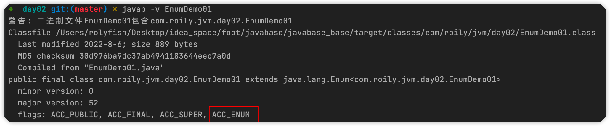


- ACC_INTERFACE

> 表示是一个接口，而不是一个类。如果一个`class`文件被标识了ACC_INTERFACE那么他一定他也是抽象的，也就是得标志上ACC_ABSTRACT。
>
> 并且一个接口拿来就是为了实现的，那么就不能被标志上ACC_FINAL。
>
> 也不可以设置为ACC_ENUM和ACC_SUPER

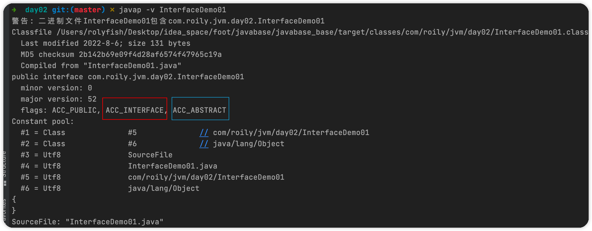


- ACC_ANNOTATION

> 表示为一个注解，被ACC_ANNOTATION标识就必须被ACC_INTERFACE标识。

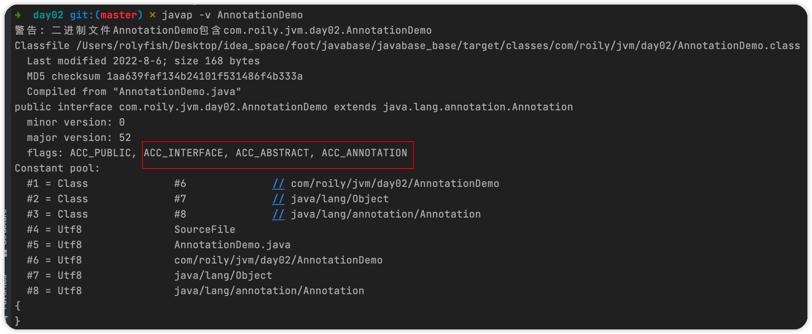

- ACC_SUPER

> 被ACC_SUPER标识的类，调用父类的方法会特殊处理。所有版本的编译器都应该设置这个标志（除了一些低版本的编译器）。jdk1.0.2及其之前版本的编译器生成的`class`文件标志位都没有ACC_SUPER标志。
>
> 目前来说我们接触到的编译器都会为我们生成ACC_SUPER标识。

特殊处理指的是什么呢？

子类在调用父类的方法的时候会使用一个叫`invokespecial`指令。

> 每一个方法都有一个`CONSTANT_Methodref_info` 结构来描述这个方法，而这个结构是编译期就决定的，如果此刻类上面没有`ACC_SUPER`标识，那么 `invokespecial`指令就会按照编译器生成的`CONSTANT_Methodref_info`结构来进行父类的调用。

举个例子：以下三个类存在如下继承关系，SonSon的`super.parentMethod();`肯定调用的`Parent`的方法，那么

`SonSon`的`CONSTANT_Methodref_info`结构内肯定存着这么一个信息。

```java
public class Parent {
    void parentMethod() {
        System.out.println("parentMethod");
    }
}
class Son extends Parent {

}
class SonSon extends Son {
    void sonSonMethod() {
        super.parentMethod();
    }
}
```

那么如果此刻如果我们对`Son`进行更新，添加一个`parentMethod`会怎么样呢？（不对SonSon进行重编译），只对Son重编译。如果没有ACC_SUPER标志那么SonSon调用的还是Parent的方法。如果存在ACC_SUPER标识则会特殊处理，去寻找最近的父类进行调用对应的方法。

```java
class Son extends Parent {
    @Override
    void parentMethod() {
        System.out.println("SonMethod");
    }
}
```

小结：

> access_flags占用两个字节也就是16位，每一位可以表示一个ACC_FLAG，一个类存在多个ACC_FLAG会通过按位与的方式进行保存。
>
> 那么以上只有8个标志，那么还剩余的是为了以后预留的。


##### 类索引(this_class)

> 类索引的值必须是constant_pool表中的一个有效索引值。constant_pool表在这个索引处的项必须是CONSTANT_CLASS_INFO类型的常量，表示这个Class文件所定义的类或接口。


##### 父类索引(super_class)

> 父类索引
>
> 对于类来说，super_class的值必须为0或者是constant_pool表中的一个有效索引值。如果super_class的值不为0，那么constant_pool表在这个索引处的项必须是CONSTANT_CLASS_INFO类型的常量，表示这个Class文件所定义的直接父类。==当前类的直接父类以及他的所有间接父类的access_flag都不可以带有ACC_FINAL标识==。
>
> 对于接口来说也是一样super_class必须为constant_pool表中的一个有效索引。且constant_pool在此索引处的项必须为代表java.lang.Object的CONSTANT_CLASS_INFO类型的常量。
>
> 如果class文件的`Super_class`的值为0，那么它只能定义为`java.lang.objec`类，只有它没有父类。


##### 接口计数器(interfaces_count)

> 标识当前类直接接口的数量


##### 接口信息数据区

> Interfaces[interface_coount]。接口信息表Interfaces[]中的每一个成员的值都必须为constant_info表中的一个有效的索引值。constant_pool在对应索引处的项必须是CONSTANT_CLASS_INFO类型的常量。
>
> 且接口信息表中的索引值是有序的，即编译器生成的class文件实现接口的顺序。


##### 字段计数器(fields_count)

> 字段计数器，表示当前类声明的类字段和实例字段（成员变量）的个数。


##### 字段信息数据区(fields[])

> 字段表，长度为fields_count。字段表fields[]中的每一个成员都是`fields_info`结构的数据项，用于描述该字段的完整信息。
>
> 字段表`fields[]`用于记录当前接口或类声明的所有字段信息，但不包括从父类或父接口中继承过来的部分。


##### 方法计数器(method_count)

> 方法计数器，表示当前类定义的方法个数。


##### 方法数据区(methods[])

> 方法表，长度为method_count。方法表methods[]中的每一个成员都是`method_info`结构的数据项，用于描述该方法的完整信息。
>
> 如果一个`method_info`结构中的`access_flags`既不包含`ACC_NATIVE`也不包含`ACC_ABSTRACT`标识。那么标识当前方法可以被`jvm`直接加载，而不需要依赖其他类。
>
> 方法表`methods[]`记录着当前接口或接口中定义的所有方法，包括静态方法、实例方法、初始化方法(init 、cinit)。不包括从父类或父接口中继承过来的方法。


##### 属性计数器

> 属性个数


##### 属性数据区

> `attributes[]`。属性表中的每一项都是一个`Attribute_info`结构


### 小结


> 根据以上总结，一个class文件可以表示为

```java
classFile{
  u4          			magic;//魔数
  u2         				minor_version;//服版本号（一般不用管）
  u2         				major_version;//主版本号  jdk1.0为45，高本版递增
  u2								constant_pool_count;//常量池计数器
  cp_info						constant_pool[constant_pool_count-1];//常量池数据区
  u2								access_flags;//访问标志
  u2								this_class;//类索引。是constant_pool中的一个有效索引
  u2								super_class;//父类索引。只有object此项为0
  u2								interfaces_count;//直接接口数量
  u2								interfaces[interfaces_count];//接口数据区
  u2								fields_count;//类的成员变量数量
  field_info				fields[fields_count];//类的成员变量数据区
  u2								methods_count;//定义方法个数
  method_info				methods[methods_count];//方法数据区
  u2 							  attributes_count;//属性数量
  attribute_info	  attributes[attributes_count]//属性数据区
}
```


<hr>

### class常量池

> class常量池是很重要的一个数据区。

#### class常量池在什么位置

> class常量池在`class`文件中的什么位置？
>
> 如下图，在主版本号之后的区域就是常量池相关的数据区了。首先是两个字节的常量池计数器，紧接着就是常量池数据区。


> 常量池计数器的数值为何比常量池项数量大一？

常量池计数器是从1开始计数的而不是0，如果常量池计数器的数值为15那么常量池中常量项(cp_info)的数量就为14。常量池项个数 = constant_count-1。

将第一位空出来是有特殊考虑的，当某些索引表示不指向常量池中任何一个常量池项的时候，可以将索引设置为0。


#### 有哪些cp_info

> 常量池项(cp_info)记录着class文件中的字面量信息。那么存在多少中cp_info，以及如何区分。

cp_info中存在着一个tag属性，jvm会根据tag值来区分不同的常量池项

| Tag  | 结构                             | 说明                     |
| ---- | -------------------------------- | ------------------------ |
| 1    | CONSTANT_Utf8_info               | 字符串常量值             |
| 3    | CONSTANT_Integer_info            | INT类型常量              |
| 4    | CONSTANT_Float_into              | FLOAT类型常量            |
| 5    | CONSTANT_Double_info             | DOUBLE类型常量           |
| 7    | CONSTANT_Class_info              | 类或接口全限定名常量     |
| 8    | CONSTANT_String_info             | String类型常量对象       |
| 9    | CONSTANT_Fieldref_info           | 类中的字段               |
| 10   | CONSTANT_Methodref_info          | 类中的方法               |
| 11   | CONSTANT_InterfaceMethodref_info | 所实现接口的方法         |
| 12   | CONSTANT_NameAndType_info        | 字段或方法的名称和类型   |
| 15   | CONSTANT_MethodHandler_info      | 方法句柄                 |
| 16   | CONSTANT_MethodType_info         | 方法类型                 |
| 18   | CONSTANT_InvokeDynamic_info      | 表示动态的对方法进行调用 |
|      |                                  |                          |


##### int和float的cp_info

> int的常量池项结构为`CONSTANT_Integer_info`。float的常量池项结构为`CONSTANT_Float_info`。且这两种数据类型所占空间都为四个字节。所对应的结构如下：


###### 例子1

> 编译过后使用`javap -v分析`

```java
public class CpInfoIntAndFloat {
    private final int i1 = 1;
    private final int i2 = 1;

    float f1 = 20f;
    Float f2 = 20f;
    Float f3 = 20f;
    float f4 = 30f;
}
```

> 确实在constant_pool中存在着我们预期的cp_info结构。且不存在重复结构。

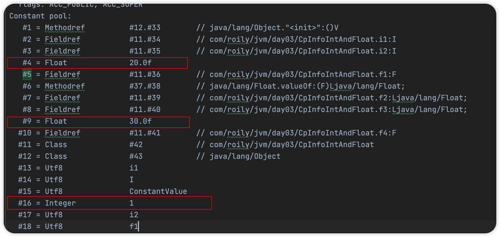

> 但是这里我们特意将int的修饰符设置为final类型的。如果不是final类型的对于int i1 = 1来说并不会在constant_pool中存入`CONSTANT_Integer_info`结构体。我们可以试一下

###### 例子2

```java
public class CpInfoIntAndFloat2 {
    private  int i1 = 0;
    private  int i2 = 5;
    private  int i3 = -127;
    private  int i4 = 128;

    private  int i5 = 32767;
    private  int i6 = -32768;

    static int i11 = 1;
}
```

使用`javap -v  CpInfoIntAndFloat2> 1.txt`命令将分解信息输出到1.txt文件方便查看：

> 发现并没有Integer相关的cp_info。且我们声明了一个 `static int i11 = 1;`静态的成员变量(类变量),编译器会为我们生成一个`cinit`方法。我们去查看一下`init`和`cinit`方法。

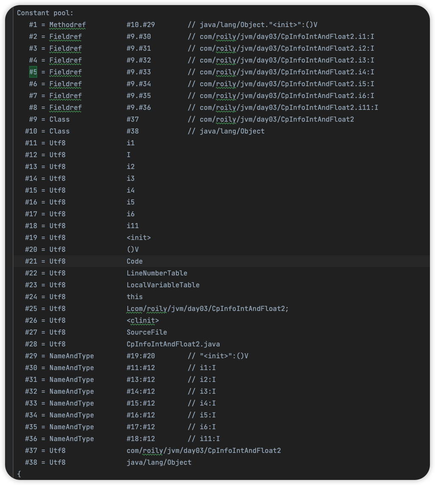

> 查看一下`init`方法。发现在实例初始化的时候会调用`init`方法，会使用`iconst_X`命令、`bipush`命令以及`sipush`为我们的int类型变量赋值。对于较小的int类型变量（小于5）会使用`iconst_X`命令，不需要参数，直接赋值。对于较大的（-128,127）使用bipush,带上数值大小参数，直接赋值，对于再大一点的数值使用`sipush`命令赋值。

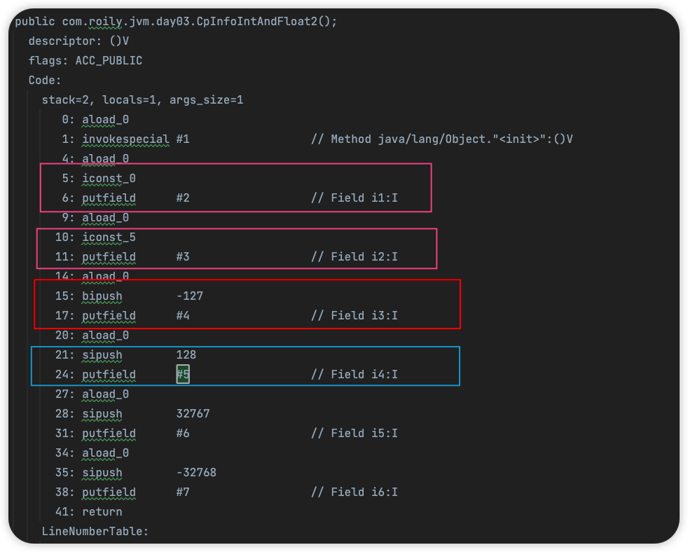

###### 例子3

> 那么对于比32767大也就是比short范围大的int类型呢？

结论是会存入constant_pool常量池的。

```java
public class CpInfoIntAndFloat3 {
    private  int i1 = 32768;
    private  int i2 = 32769;
    private  int i3 = 42768;
}
```

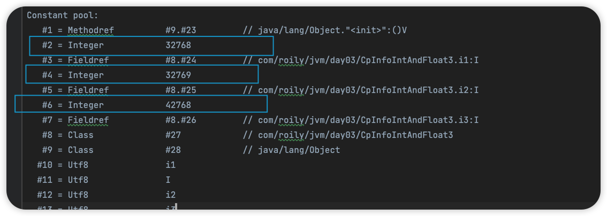

> 查看一下init方法看对于存入constant_pool常量池的项，是如何赋值的

会使用ldc命令从常量池中取，然后再赋值。

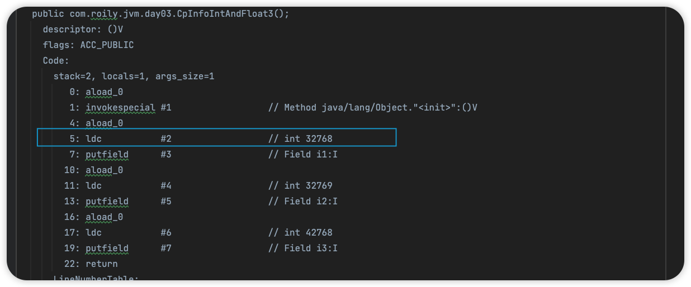

###### 结论

> 那我么就可以得出结论了：

- iconst_x命令，会对 0 - 5范围内的值进行直接赋值，且无需参数
- bipush(byteintpush)命令，会对 -128 127 范围内的值进行直接赋值，需要携带字面量参数
- sipush(shortintpush)命令，会对 -32768 32767范围内的值进行直接赋值，需要携带字面量参数
- 超过如上范围的值，会存入constan_pool常量池，使用LDC命令取值，再赋给对应字段


##### long&double

> Long的常量池项结构为`CONSTANT_Long_info`。double的常量池项结构为`CONSTANT_Double_info`。且这两种数据类型所占空间都为8个字节。所对应的结构如下：

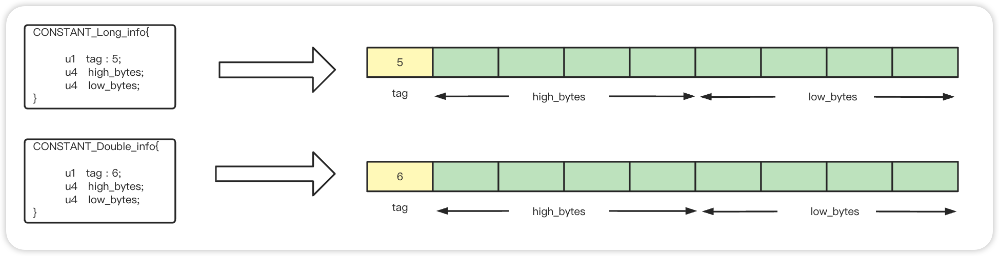

会将对应结构存入constant_pool中，且所有使用到对应结构的字段都会指向它

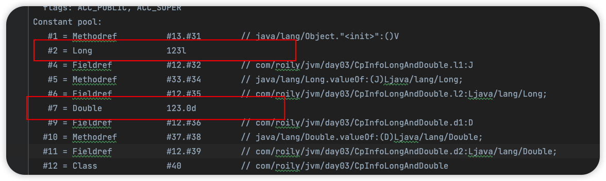

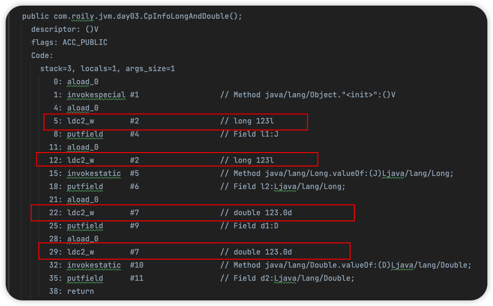

##### String的cp_info

> String的常量池项结构为`CONSTANT_String_info`。所对应的结构如下：

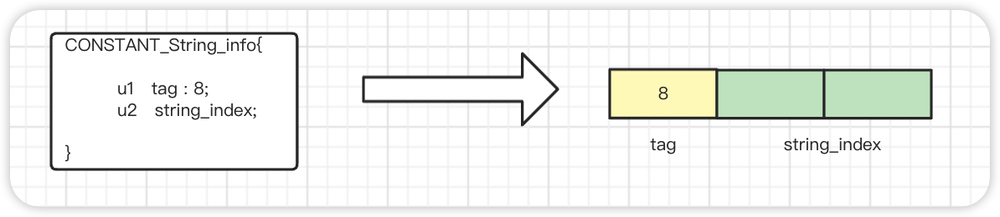

> String常量在常量池中的表示，为一个`CONSTANT_String_info`结构体，这个结构体除了一个tag外，还有一个指向`CONSTANT_Utf8_info`结构体的索引string_index。
>
> 所以说每一个字符串在编译的时候，编译器都会为其生成一个不重复的`CONSTANT_String_info`结构体，并放置于`CONSTANT_poll`class常量池中，而这个结构体内的索引string_index会指向某个`CONSTANT_Utf8_info`结构体，在`CONSTANT_Utf8_info`结构体内才正真存储着字符串的字面量信息。

`CONSTANT_Utf8_info`结构体的结构为：

其中legth为字节数组长度

bytes[length]存储着字符串字面量信息的字符数组


> 写一个类只有String类型的变量，并使用javap分析

```java
public class CpInfoStringAndUtf8 {
    String str1 = "abc";
    String str2 = "abc1";
    
    public void test() {
        String str = "abc";
        System.out.println(str == str1);
    }
}
```

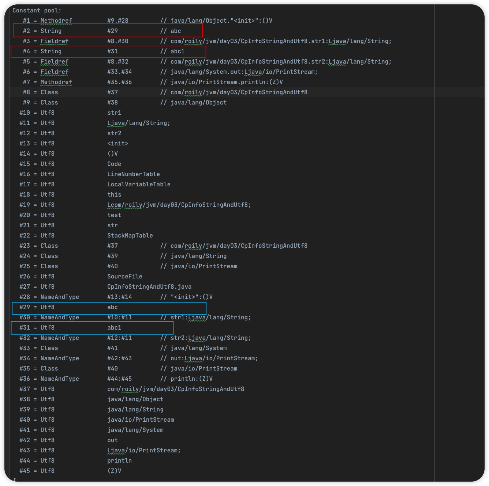

> 整合起来的结构就是这个样子的：

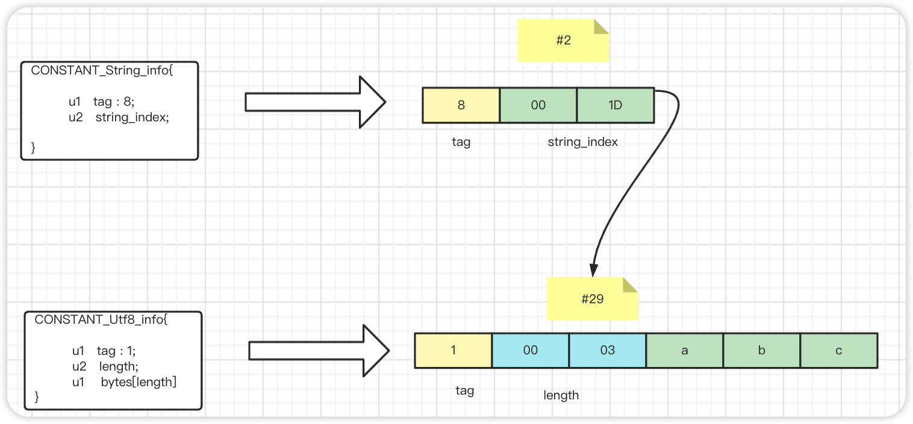


##### 类(class)的cp_info

> 定义的类和在类中引用到的类在常量池中如何组织和存储的？

> 和String类型一样涉及到两个结构体，分别是：`CONSTANT_Class_info`和`CONSTANTT_Utf8_info`。编译器会将，定义和引用到类的完全限定名称以二进制的形式封装到`CONSTANT_Class_info`中，然后放入到class常量池中。结构如下：

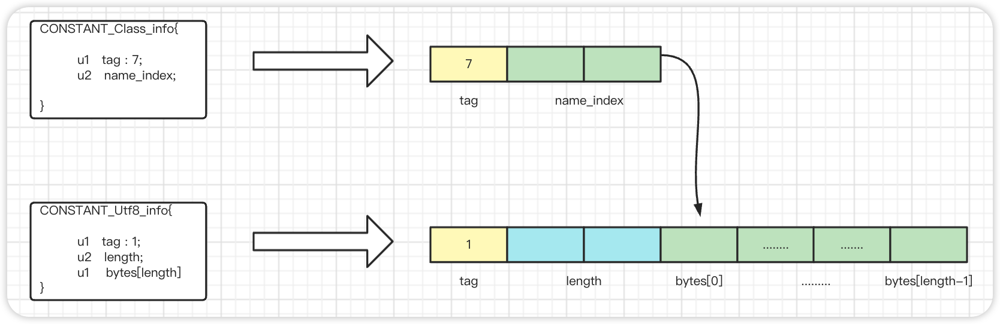

###### 类的完全限定名称和二进制形式的完全限定名称

> 类的完全限定名称：`com.roily.jvm.day03.CpInfoIntAndFloat3`,以点·分隔
>
> 二进制形式的类的完全限定名称：编译器在编译时，会将点替换为/，然后存入class文件，所以称呼`com\roily\jvm\day03\CpInfoIntAndFloat3`为二进制形式的类的完全限定名称。

###### 具体如何存储

写一个类：

```java
public class CpInfoClass {
    /**
     * new关键字,真正使用到了该类。编译器会将对应的Class_info存入class常量池
     */
    StringBuilder sb = new StringBuilder();
    /**
     * 只是单纯声明,并没有真正使用到了该类。编译器不会会将对应的Class_info存入class常量池
     */
    StringBuffer sb2;
}
```

javap -v分析：

> 存在三个`CONSTANT_Class_info`结构体
>
> `CpInfoClass`表示当前类
>
> `StringBuilder`是我们通过`new`关键字直接使用的
>
> `Object`是所有类的父类，所以即便不显示继承，也会生成一个class_info

对于StringBuffer来说，当前类并没有真正使用到它，所以编译器不会为其生成对应的class_info结构体

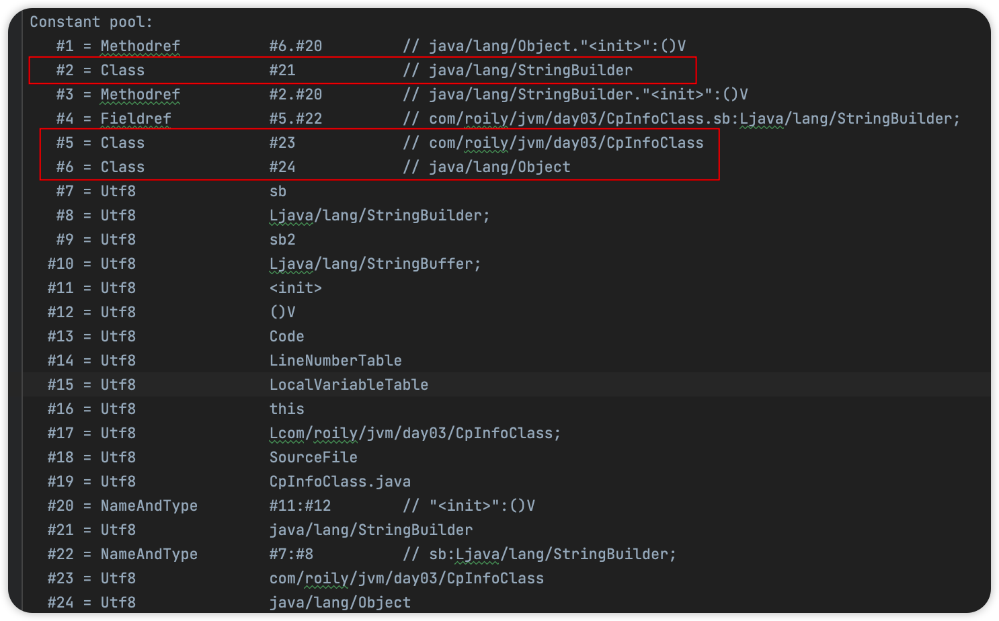

以CpInfoClass进一步分析：

CpInfoClass对应的`CONSTANT_Class_info`在常量池中的索引为#5，其内部的class名称索引指向#23，#23对应的是一个`CONSTANT_Utf8_info`的这么一个结构体，存储的是CpInfoClass的二进制形式的完全限定名称。

画个图表示：

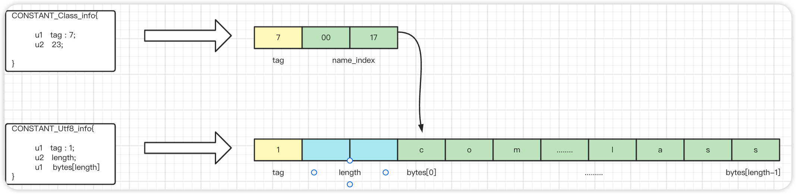


> 小结：

- 对于一个类或者接口，jvm编译器会将其自身、父类和接口的信息都各自封装到`CONSTANT_Class_info`中，并存入`CONSTANT_POO`常量池中
- 只有真正使用到的类jvm编译器才会为其生成对应的`CONSTANT_Class_info`结构体，而对于未真正使用到的类则不会生成，比如只声明一个变量`StringBuffer sb2;`


##### 字段的cp_info

> 在定义一个类的时候以及在方法体内都会定义一些字段，这些字段在常量池中是如何存储的呢？
>
> 涉及到三个结构体，分别是：`CONSTANT_Fieldref_info`、`CONSTANT_Class_info`和`        CONSTANT_NameAndType_info`

写一个类定义两个字段，并为其生成getter  and  setter方法：

```java
public class CpInfoField {
    StringBuilder sb = new StringBuilder();
    StringBuffer sb2;
		//getter  and setter
}
```

使用javap -v 分析：

> jvm在编译的时候会为每一个字段生成对应的`CONSTANT_Field_info`结构体，并且在使用到该字段的地方都会指向这个结构体。
>
> `CONSTANT_Field_info`结构体内保存着，class_index和nameAndType_index的索引，用于指向这两个结构体。

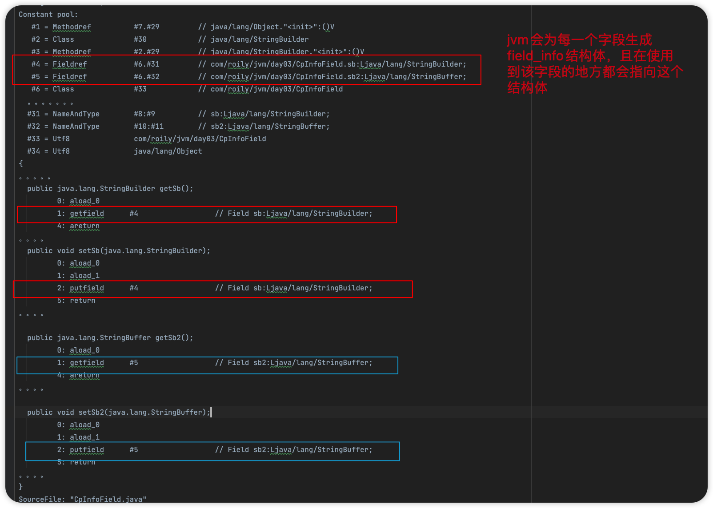

> 通过上面的分析我们可以了解到，一个`CONSTANT_Field_info`结构的大概样子。
>
> `CONSTANT_Field_info`内部包含一个类的索引和一个NameAndType的索引，而类的索引内部包含一个类名(name_index)索引，那么这个NameAndType其内部是什么样子的？
>
> `CONSTANT_NameAndIndex_info`内部包含一个 name_index索引指向程序员自定义的字段名称（比如说上面定义的sb sb2），和一个字段描述的索引`descriptor_index`指向该字段描述的索引(比如上面定义的`Ljava/lang/StringBuilder;`)


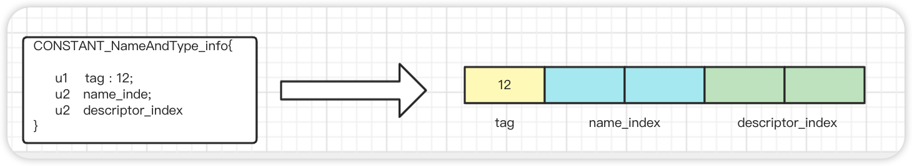

###### 那么一个字段的结构信息就可以表示为：

>  field字段描述信息 = field字段所属的类 .  field字段名称 : field字段描述


###### 一个`CONSTANT_Field_info`与其他结构体的关系可以表示为：


###### NameAndType

> `CONSTANT_NameAndType_info`结构体中关于字段的描述：

- 对于基本数据类型

| 类型    | 描述 | 说明             |
| ------- | ---- | ---------------- |
| byte    | B    | 表示一个字节整型 |
| short   | S    | 短整型           |
| int     | I    | 整型             |
| long    | J    | 长整型           |
| float   | F    | 单精度浮点数     |
| double  | D    | 双精度浮点数     |
| char    | C    | 字符             |
| boolean | Z    | 布尔类型         |
|         |      |                  |

- 对于引用类型来说

L<ClassName>。

比如StringBuilder类型的描述信息为：`Ljava/lang/StringBuilder`


- 对于数组类型来说

[<descriptor>   一个左中括号加上数组元素类型。

比如long[] ls = {1L,2L};对应描述信息为：`[J`


###### 小结

- jvm编译器会为每一个有效使用的字段生成一个对应的`CONSTANT_Field_info`结构体，该结构体内包含了一个`class_index`指向该字段所在类的结构体索引值，和一个`name_and_type_index`指向该字段名称和描述信息的结构体索引值
- 如果一个字段没有被使用到，jvm不会将其放入常量池中


##### 方法的cp_info

> 和字段的cp_info相似，jvm编译时会将每一个方法(前提是使用到)包装成一个`CONSTANT_Methodref_ingo`结构体，放入常量池，该结构体内存在两个索引值分别是`Class_index`和`name_and_type_index`。

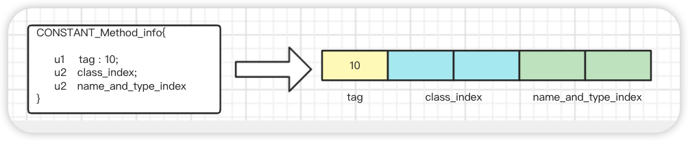

写一个类：添加一个test方法对getter setter 方法进行引用：

```java
public class CpInfoMethod {
    StringBuilder sb = new StringBuilder();
    StringBuffer sb2;
		//getter  and  setter
    public void test(){
        getSb();
        setSb(new StringBuilder("xxx"));
    }
}
```

javap -v分析：

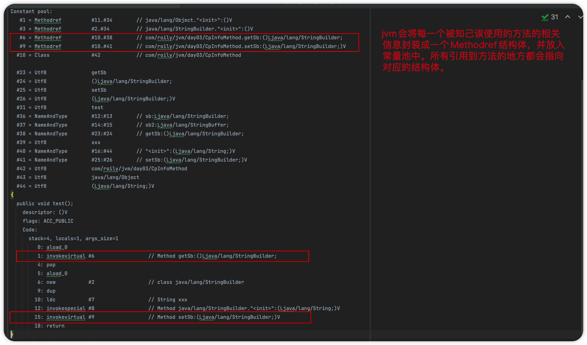

###### 一个方法的结构体信息表示：

方法结构体信息 = 方法所属的类 .   方法名称:(参数说明)返回值

【(参数说明)返回值】就是方法的描述信息。

比如我有一个方法：String getMsg();  那么描述信息就可以表示为：()Ljava/lang/String

==如果返回值是Void的话，则表示为V==


##### 接口方法的cp_info

>  类中引用到某个接口定义的方法


