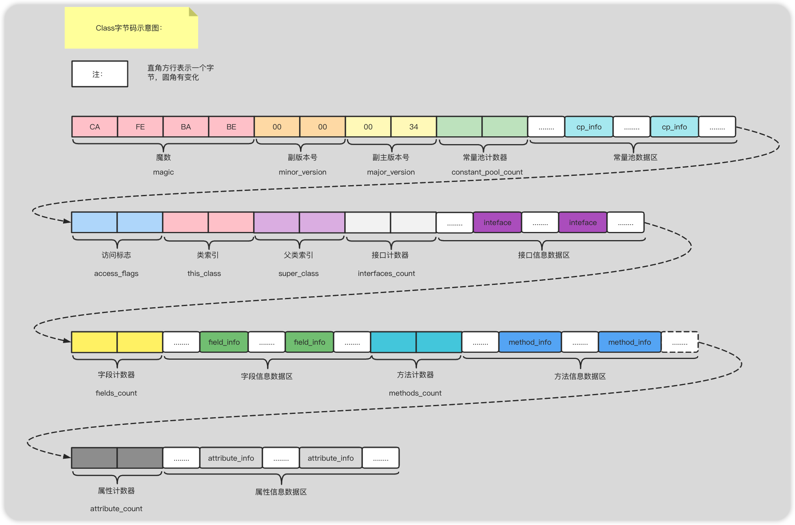

## JVM

### Java类字节码

#### 基础

- 多语言编程成字节码文件在JVM上运行

  > Java是高级语言只有人类可以理解，JVM不可直接运行，计算机也无法识别，计算机中所有操作都是一个个指令。所以Java源文件需要编程成对应的字节码文件，然后JVM转换成对于指令交由计算机运行。
  >
  > JVM不只支持Java，有许多基于JVM的编程语言，如Groovy, Scala, Koltin等等。

- 字节码文件只面向JVM，不针对任何平台

  > 针对不同的操作系统有不同的JVM版本，同样的字节码文件给不同的JVM转换，在不同平台上运行可得到相同的结果。

class文件本质上是一个以8位字节为基础单位的二进制流，各个数据项目严格按照顺序紧凑的排列在class文件中。jvm根据其特定的规则解析该二进制数据，从而得到相关信息。

Class文件采用一种伪结构来存储数据，它有两种类型：无符号数和表。


#### 如何查看字节码文件

写一个Class类：

```java
public class Person {
    private String name;
    public String getName() {
        return name;
    }
    public static void main(String[] args) {
    }
}
```

通过javac命令编程生成字节码文件：

```class
package com.roily.booknode.javatogod._13jvm;
public class Person {
    private String name;
    public Person() {
    }
    public String getName() {
        return this.name;
    }
    public static void main(String[] var0) {
    }
}
```

##### 支持16进制的文本编译器

> `.class`文件是字节码文件，一字节八位，我们采用支持16进制文本编辑器查看。使用`NotePad++`、`UltraEdit`或其他支持工具。
>
> nodepad++需要安装HEX-EDITOR插件。


##### Javap工具

> 使用JVM提供的Javap工具分析字节码：

```class
Classfile /E:/programmeTools/idea/git/JavaBase/javabase/javabase_base/src/main/java/com/roily/booknode/javatogod/_13jvm/Person.class
  Last modified 2023-2-22; size 415 bytes
  MD5 checksum 6b6c5fc0baa51da4b4d0db5bdea7b5a4
  Compiled from "Person.java"
public class com.roily.booknode.javatogod._13jvm.Person
  minor version: 0
  major version: 52
  flags: ACC_PUBLIC, ACC_SUPER
Constant pool:
   #1 = Methodref          #4.#17         // java/lang/Object."<init>":()V
   #2 = Fieldref           #3.#18         // com/roily/booknode/javatogod/_13jvm/Person.name:Ljava/lang/String;
   #3 = Class              #19            // com/roily/booknode/javatogod/_13jvm/Person
   #4 = Class              #20            // java/lang/Object
      stack=1, locals=1, args_size=1
         0: aload_0
         1: getfield      #2                  // Field name:Ljava/lang/String;
         4: areturn
      LineNumberTable:
        line 12: 0

  public static void main(java.lang.String[]);
    descriptor: ([Ljava/lang/String;)V
    flags: ACC_PUBLIC, ACC_STATIC
    Code:
      stack=0, locals=1, args_size=1
         0: return
      LineNumberTable:
        line 17: 0
}
SourceFile: "Person.java"

```


##### 使用idea字节码分析工具插件JclassLib

> 首先搜索安装此插件，view --> show ByteCode with Jclasslib


#### Class字节码结构



##### 魔数

> 占4字节
>
> 魔数(magic)，值为 CA FE BA BE  是`JVM`用于识别是否是`JVM`认可的字节码文件。
>
> 以文件后缀不可确定一个文件类型，很多文件都有魔数比如PNG，jepg在文件头都有魔数

当`JVM`准备加载某个`class`文件到内存的时候，会首先读取该字节码文件的首四位字节码，判断是否是CA FE BA BE,如果是则JVM认可，如果不是JVM则会拒绝加载该字节码文件。

> Class文件不一定都是由`.java`文件编译而来的，`Kotlin`以及其他java虚拟机支持的都可以。

##### 版本号

> 总4个字节，分别占2字节。
>
> 版本号包括主版本号(major_version)和副版本号(minor_version)。
>
> 我们一般只需要关注主版本号，平常所说的java8其实是java1.8。副版本号主要是对主版本的一个优化和bug修复。目前java版本都来到了17了。
>
> JDK1.0的主版本号为45，以后版本每升级一个版本就在此基础上加一，那么JDK1.8对应的版本号为52，对应16进制码为0x34。
>
> 一个版本的JVM只可以加载一定范围内的`Class`文件版本号，一般来说高版本的`JVM`支持加载低版本号的`Class`文件，反之不行。`JVM`在首次加载`class`文件的时候会去读取`class`文件的版本号，将读取到的版本号和`JVM`的版本号进行对比，如果`JVM`版本号低于`class`文件版本号，将会抛出`java.lang.UnsupportedClassVersionError`错误。

我们修改一下`Person.class`关于版本号的数据，提高`class`文件的版本号为0x39 ,为10进制57，jvm版本为java1.13。

通过`java <classpath>.classname`运行一下：

提示说我们的jvm只支持运行`java`版本最高为52的`class`文件，也就是`java1.8`。

```bash
PS E:\programmeTools\idea\git\JavaBase\javabase\javabase_base\target\classes>  java com.roily.booknode.javatogod._13jvm.Person
Error: A JNI error has occurred, please check your installation and try again
Exception in thread "main" java.lang.UnsupportedClassVersionError: com/roily/booknode/javatogod/_13jvm/Person has been compiled by a more recent version of the Java Runtime (class file version 57.0), this version of the Java Runtime only recogniz
es class file versions up to 52.0
        at java.lang.ClassLoader.defineClass1(Native Method)
        at java.lang.ClassLoader.defineClass(ClassLoader.java:763)
        at java.security.SecureClassLoader.defineClass(SecureClassLoader.java:142)
        at java.net.URLClassLoader.defineClass(URLClassLoader.java:467)
        at java.net.URLClassLoader.access$100(URLClassLoader.java:73)
        at java.net.URLClassLoader$1.run(URLClassLoader.java:368)
        at java.net.URLClassLoader$1.run(URLClassLoader.java:362)
        at java.security.AccessController.doPrivileged(Native Method)
        at java.net.URLClassLoader.findClass(URLClassLoader.java:361)
        at java.lang.ClassLoader.loadClass(ClassLoader.java:424)
        at sun.misc.Launcher$AppClassLoader.loadClass(Launcher.java:349)
        at java.lang.ClassLoader.loadClass(ClassLoader.java:357)
        at sun.launcher.LauncherHelper.checkAndLoadMain(LauncherHelper.java:495)
```


##### 常量池计数器(constant_pool_count)

> 2个字节。
>
> 紧跟于版本号后面的是常量池计数器占两个字节。记录整个class文件的字面量信息个数，决定常量池大小。
>
> `constant_pool_count` =  常量池元素个数 + 1。  只有索引在 （0，constant_pool_count）范围内才会有效，索引从1开始。


##### 常量池数据区(constant_pool)

> 常量池类似于一张二维表，每一个结构项代表一条记录，包含`class`文件结构及其子结构中引用的所有字符串常量、类、接口、字段和其他常量。且常量池中每一个元素都具备相似的结构特征，每一个元素的第一字节用做于识别该项是哪种数据类型的常量，称为`tag byte`。


##### 访问标志(access_flags)

> 用于表示一个类、接口、以及方法的访问权限。占用两个字节。
>
> access_flags占用两个字节也就是16位，每一位可以表示一个ACC_FLAG，一个类存在多个ACC_FLAG会通过按位与的方式进行保存。
>
> 那么以上只有8个标志，那么还剩余的是为了以后预留的。

| 标记           | 值（0x） | 作用                                   |
| -------------- | -------- | -------------------------------------- |
| ACC_PUBLIC     | 0x0001   | 公共的                                 |
| ACC_FINAL      | 0x0010   | 不允许被继承                           |
| ACC_SUPER      | 0x0020   | 需要特殊处理父类方法                   |
| ACC_INTERFACE  | 0x0200   | 标记为接口，而不是类                   |
| ACC_ABSTRACT   | 0x0400   | 抽象的，不可被实例化                   |
| ACC_SYNTHETIC  | 0x1000   | 表示由编译器自己生成的，比如说桥接方法 |
| ACC_ANNOCATION | 0x2000   | 表示注解                               |
| ACC_ENUM       | 0x4000   | 表示枚举                               |
|                |          |                                        |


##### 类索引(this_class)

> 类索引的值必须是constant_pool表中的一个有效索引值。constant_pool表在这个索引处的项必须是CONSTANT_CLASS_INFO类型的常量，表示这个Class文件所定义的类或接口。

##### 父类索引(super_class)

> 2个字节
>
> 父类索引
>
> 对于类来说，super_class的值必须为0或者是constant_pool表中的一个有效索引值。如果super_class的值不为0，那么constant_pool表在这个索引处的项必须是CONSTANT_CLASS_INFO类型的常量，表示这个Class文件所定义的直接父类。==当前类的直接父类以及他的所有间接父类的access_flag都不可以带有ACC_FINAL标识==。
>
> 对于接口来说也是一样super_class必须为constant_pool表中的一个有效索引。
>
> 如果class文件的`Super_class`的值为0，那么它只能定义为`java.lang.objec`类，只有它没有父类。

##### 接口计数器(interfaces_count)

> 标识当前类直接接口的数量

##### 接口信息数据区

> Interfaces[interface_coount]。接口信息表Interfaces[]中的每一个成员的值都必须为constant_info表中的一个有效的索引值。constant_pool在对应索引处的项必须是CONSTANT_CLASS_INFO类型的常量。
>
> 且接口信息表中的索引值是有序的，即编译器生成的class文件实现接口的顺序。

##### 字段计数器(fields_count)

> 字段计数器，表示当前类声明的类字段和实例字段（成员变量）的个数。

##### 字段信息数据区(fields[])

> 字段表，长度为fields_count。字段表fields[]中的每一个成员都是`fields_info`结构的数据项，用于描述该字段的完整信息。
>
> 字段表`fields[]`用于记录当前接口或类声明的所有字段信息，但不包括从父类或父接口中继承过来的部分。

##### 方法计数器(method_count)

> 方法计数器，表示当前类定义的方法个数。

##### 方法数据区(methods[])

> 方法表，长度为method_count。方法表methods[]中的每一个成员都是`method_info`结构的数据项，用于描述该方法的完整信息。
>
> 如果一个`method_info`结构中的`access_flags`既不包含`ACC_NATIVE`也不包含`ACC_ABSTRACT`标识。那么标识当前方法可以被`jvm`直接加载，而不需要依赖其他类。
>
> 方法表`methods[]`记录着当前接口或接口中定义的所有方法，包括静态方法、实例方法、初始化方法(init 、cinit)。不包括从父类或父接口中继承过来的方法。

##### 属性计数器

> 属性个数

##### 属性数据区

> `attributes[]`。属性表中的每一项都是一个`Attribute_info`结构。
>
> 包括  SourceFile:

##### 小结


> 根据以上总结，一个class文件可以表示为

```java
classFile{
  u4          			magic;//魔数
  u2         				minor_version;//服版本号（一般不用管）
  u2         				major_version;//主版本号  jdk1.0为45，高本版递增
  u2								constant_pool_count;//常量池计数器
  cp_info						constant_pool[constant_pool_count-1];//常量池数据区
  u2								access_flags;//访问标志
  u2								this_class;//类索引。是constant_pool中的一个有效索引
  u2								super_class;//父类索引。只有object此项为0
  u2								interfaces_count;//直接接口数量
  u2								interfaces[interfaces_count];//接口数据区
  u2								fields_count;//类的成员变量数量
  field_info				fields[fields_count];//类的成员变量数据区
  u2								methods_count;//定义方法个数
  method_info				methods[methods_count];//方法数据区
  u2 							  attributes_count;//属性数量
  attribute_info	  attributes[attributes_count]//属性数据区
}
```


<hr>

#### class常量池

> class常量池是很重要的一个数据区。

##### class常量池在什么位置

> class常量池在`class`文件中的什么位置？
>
> 如下图，在主版本号之后的区域就是常量池相关的数据区了。首先是两个字节的常量池计数器，紧接着就是常量池数据区。


> 常量池计数器的数值为何比常量池项数量大一？

常量池计数器是从1开始计数的而不是0，如果常量池计数器的数值为15那么常量池中常量项(cp_info)的数量就为14。常量池项个数 = constant_count-1。

将第一位空出来是有特殊考虑的，当某些索引表示不指向常量池中任何一个常量池项的时候，可以将索引设置为0。


##### 有哪些cp_info

> Constant_pool
>
> 常量池项(cp_info)记录着class文件中的字面量信息。那么存在多少种cp_info，以及如何区分。

cp_info中存在着一个tag属性，jvm会根据tag值来区分不同的常量池结构体

| Tag  | 结构                             | 说明                     |
| ---- | -------------------------------- | ------------------------ |
| 1    | CONSTANT_Utf8_info               | 字符串常量值             |
| 3    | CONSTANT_Integer_info            | INT类型常量              |
| 4    | CONSTANT_Float_into              | FLOAT类型常量            |
| 5    | CONSTANT_Double_info             | DOUBLE类型常量           |
| 7    | CONSTANT_Class_info              | 类或接口全限定名常量     |
| 8    | CONSTANT_String_info             | String类型常量对象       |
| 9    | CONSTANT_Fieldref_info           | 类中的字段               |
| 10   | CONSTANT_Methodref_info          | 类中的方法               |
| 11   | CONSTANT_InterfaceMethodref_info | 所实现接口的方法         |
| 12   | CONSTANT_NameAndType_info        | 字段或方法的名称和类型   |
| 15   | CONSTANT_MethodHandler_info      | 方法句柄                 |
| 16   | CONSTANT_MethodType_info         | 方法类型                 |
| 18   | CONSTANT_InvokeDynamic_info      | 表示动态的对方法进行调用 |
|      |                                  |                          |

##### int和float的cp_info

> int的常量池项结构为`CONSTANT_Integer_info`。float的常量池项结构为`CONSTANT_Float_info`。且这两种数据类型所占空间都为四个字节。所对应的结构如下：


```java
// 此字段在当前类中没有使用，不会生成对应Fieldref结构体。但会存储字段名称
private Integer age;
// 作为引用类型 Ljava/lang/Integer
private static Integer num1 = 10;
// 基本数据类型，对应类型为 I
private static int num2 = 10;
```

对应字节码表示：结构体中只有字段结构体，并没有Integer结构体，若想要存Constant_Integer_info进class常量池，需要用final修饰或者定义的大一点

例子：

```java
private final int num3 = 10;
// 大于 32767
private int num4 = 32768;
```

```bash
#3 = Integer            32768
#20 = Integer            10
```

##### long&double

> Long的常量池项结构为`CONSTANT_Long_info`。double的常量池项结构为`CONSTANT_Double_info`。且这两种数据类型所占空间都为8个字节。所对应的结构如下：


会将对应结构存入constant_pool中

```java
private long num5 = 1L;
private Long num6 = 2L;
private double num7 = 1D;
private Double num8 = 2D;
```

```bash
#6 = Long               2l
#11 = Double             2.0d
```


##### String的cp_info

> String的常量池项结构为`CONSTANT_String_info`。所对应的结构如下：


> String常量在常量池中的表示，为一个`CONSTANT_String_info`结构体，这个结构体除了一个tag外，还有一个指向`CONSTANT_Utf8_info`结构体的索引string_index。
>
> 所以说每一个字符串在编译的时候，编译器都会为其生成一个不重复的`CONSTANT_String_info`结构体，并放置于`CONSTANT_poll`class常量池中，而这个结构体内的索引string_index会指向某个`CONSTANT_Utf8_info`结构体，在`CONSTANT_Utf8_info`结构体内才正真存储着字符串的字面量信息。

`CONSTANT_Utf8_info`结构体的结构为：

其中legth为字节数组长度

bytes[length]存储着字符串字面量信息的字符数组


```java
private String str = "yuyc" ;
```

```bash
#16 = Fieldref           #21.#66        // com/roily/booknode/javatogod/_13jvm/Person.str:Ljava/lang/String;
#21 = Class              #72            // com/roily/booknode/javatogod/_13jvm/Person
#66 = NameAndType        #42:#24        // str:Ljava/lang/String;
#24 = Utf8               Ljava/lang/String;
#42 = Utf8               str
#72 = Utf8               com/roily/booknode/javatogod/_13jvm/Person
#15 = String             #65            // yuyc
#65 = Utf8               yuyc

构造方法:
取出utf结构体字面量数据，设置到str中
47: ldc           #15                 // String yuyc
49: putfield      #16                 // Field str:Ljava/lang/String;
```

整合起来的结构就是这个样子的：


##### 类(class)的cp_info

> 定义的类和在类中引用到的类在常量池中如何组织和存储的？

> 和String类型一样涉及到两个结构体，分别是：`CONSTANT_Class_info`和`CONSTANTT_Utf8_info`。编译器会将，定义和引用到类的完全限定名称以二进制的形式封装到`CONSTANT_Class_info`中，然后放入到class常量池中。结构如下：


类的完全限定名称和二进制形式的完全限定名称

> 类的完全限定名称：`com.roily.booknode.javatogod._13jvm.Person`,以点·分隔
>
> 二进制形式的类的完全限定名称：编译器在编译时，会将点替换为/，然后存入class文件，所以称呼`com/roily/booknode/javatogod/_13jvm/Person`为二进制形式的类的完全限定名称。

例子：

```bash
#21 = Class              #72            // com/roily/booknode/javatogod/_13jvm/Person
#72 = Utf8               com/roily/booknode/javatogod/_13jvm/Person
#22 = Class              #73            // java/lang/Object
#73 = Utf8               java/lang/Object
#58 = Class              #74            // java/lang/Long
#74 = Utf8               java/lang/Long
#62 = Class              #77            // java/lang/Double
#77 = Utf8               java/lang/Double
#68 = Class              #79            // java/lang/Integer
#79 = Utf8               java/lang/Integer
```

小结:

- 对于一个类或者接口，jvm编译器会将其自身、父类和接口的信息都各自封装到`CONSTANT_Class_info`中，并存入`CONSTANT_POOl`常量池中
- 只有真正使用到的类jvm编译器才会为其生成对应的`CONSTANT_Class_info`结构体，而对于未真正使用到的类则不会生成，比如只声明一个变量`StringBuffer sb2;`则不会生成对应结构体


##### 字段的cp_info

> 在定义一个类的时候以及在方法体内都会定义一些字段，这些字段在常量池中是如何存储的呢？
>
> 涉及到三个结构体，分别是：`CONSTANT_Fieldref_info`、`CONSTANT_Class_info`和`        CONSTANT_NameAndType_info`
>
> field字段描述信息 = field字段所属的类 .  field字段名称 : field字段描述;

比如上面的name字段

```bash
// 类二进制全限定名称.字段名称:类型;
#15 = Fieldref           #19.#62        // com/roily/booknode/javatogod/_13jvm/Person.name:Ljava/lang/String;
#19 = Class              #67            // com/roily/booknode/javatogod/_13jvm/Person
#67 = Utf8               com/roily/booknode/javatogod/_13jvm/Person
#62 = NameAndType        #21:#22        // name:Ljava/lang/String;
#21 = Utf8               name
#22 = Utf8               Ljava/lang/String;
```


一个`CONSTANT_Fieldref_info`与其他结构体的关系可以表示为：


###### NameAndType

> `CONSTANT_NameAndType_info`结构体中关于字段的描述：

- 对于基本数据类型

| 类型    | 描述 | 说明             |
| ------- | ---- | ---------------- |
| byte    | B    | 表示一个字节整型 |
| short   | S    | 短整型           |
| int     | I    | 整型             |
| long    | J    | 长整型           |
| float   | F    | 单精度浮点数     |
| double  | D    | 双精度浮点数     |
| char    | C    | 字符             |
| boolean | Z    | 布尔类型         |
|         |      |                  |

- 对于引用类型来说

L<ClassName>。

比如StringBuilder类型的描述信息为：`Ljava/lang/StringBuilder`


- 对于数组类型来说

[<descriptor>   一个左中括号加上数组元素类型。

比如long[] ls = {1L,2L};对应描述信息为：`[J`


###### 小结

- jvm编译器会为每一个有效使用的字段生成一个对应的`CONSTANT_Field_info`结构体，该结构体内包含了一个`class_index`指向该字段所在类的结构体索引值，和一个`name_and_type_index`指向该字段名称和描述信息的结构体索引值
- 如果一个字段没有被使用到，jvm不会将其放入常量池中


##### 方法的cp_info

> 和字段的cp_info相似，jvm编译时会将每一个方法(前提是使用到)包装成一个`CONSTANT_Methodref_ingo`结构体，放入常量池，该结构体内存在两个索引值分别是`Class_index`和`name_and_type_index`。


###### 一个方法的结构体信息表示：

方法结构体信息 = 方法所属的类 .   方法名称:(参数说明)返回值

【(参数说明)返回值】就是方法的描述信息。

比如我有一个方法：String getMsg();  那么描述信息就可以表示为：()Ljava/lang/String

==如果返回值是Void的话，则表示为V==


### JVM类加载过程

> 此处所说的类加载过程不单指类加载的某个阶段，而指类加载阶段到初始化阶段这个过程。


#### 类的生命周期

> 从一个.class文件，到被加载到虚拟机内存中，最后从虚拟机卸载出内存，称为类的生命周期。包括：加载（Loading）、验证（Verification）、准备（Preparation）、解析（Resolution）、初始化（Initialization）、使用（Using）和卸载（Uploading）7个阶段。其中验证、准备、解析3个部分统称为连接。

一个类的生命周期大致如下：


#### 类加载过程中的各个阶段

#####  加载

> 加载是类加载过程的一个阶段，在此阶段java虚拟机需要做如下事情：

- 通过一个类的全限定名来获取此类的二进制字节流
- 将字节流代表的类转化为==方法区==的运行时数据结构
- 在==堆==内存中生成唯一的Class对象，作为访问该类的入口

> 需要注意的是jvm对于第二点没有特定要求，并没有限定此二进制流是从文件中来的还是通过网络传输的

可以从

- 从压缩包中读取二进制流，zip、jar、war..
- 通过网络传输
- 运行时生成。例如：jdk动态代理，在运行期间通过ProxyGenerator.generateProxyClass来为特定接口生成形式为`$Proxy`的二进制字节流

- 从其他文件转化生成。例如：jsp文件会在首次访问的时候生成对应的servlet的java和class文件
- 数据库中读取

> 相较于类加载过程中的其他阶段，加载阶段相对可控，我们可以自定义加载器来加载我们所需要的指定类

##### 验证

> 验证是连接阶段的第一步，这一阶段的目的是为了确保 Class 文件的字节流中包含的信息符合当前虚拟机的要求，并且不会危害虚拟机自身的安全。

为何需要验证？

> 因为Class 文件来源是任意字节流，并不一定来自于 Java 源码编译，虚拟机如果不检查输入的字节流，对其完全信任的话，很可能会因为载入了有害的字节流而导致系统崩溃，所以验证是虚拟机对自身保护的一项重要工作。

验证哪些？

> 从整体上看，验证阶段大致上会完成下面4个阶段的检验动作：文件格式验证、元数据验证、字节码验证、符号引用验证。

- 文件格式验证

> 此阶段为验证阶段第一步，验证字节流格式是否符合当前版本虚拟机要求，当前阶段操作的是字节流，此阶段通过后jvm不会再去操作字节流，而是操作堆内存中代表class对象的数据结构


- 元数据验证

> 第二阶段是对字节码描述的信息进行语义分析，以保证其描述的信息符合 Java 语言规范的要求

1. 这个类是否有父类（除了`java.lang.Object`之外，所有的类都应当有父类）；

2. 这个类的父类是否有继承了不允许被继承的类（被 final 修饰的类）
3. 如果这个类不是抽象类，是否实现了其父类或接口中要求实现的所有方法；
4. 类中的字段、方法是否与父类产生矛盾（例如覆盖了父类的 fianl 字段，或者出现不符合规则的方法重载，例如方法参数都一致，但返回值类型却不同等）；

- 字节码验证

第三阶段是整个验证过程中最复杂的一个阶段，主要目的是通过数据流和控制流分析，确定程序语义是合法的、符合逻辑的。在第二阶段对元数据信息中的数据类型做完校验后，这个阶段对类的方法体进行校验分析，保证被校验的方法在运行时不会做出危害虚拟机安全的事件，例如：

1. 保证任何时刻操作数栈的数据类型与指令代码序列都能配合工作，例如不会出现类似这样的情况：在操作栈防止了一个 int 类型的数据，使用时却按 long 类型来加载如本地变量表中；
2. 保证跳转指令不会跳转到方法体以外的字节码指令上；
3. 保证方法体中的类型转换是有效地，例如可以把一个子类对象赋值给父类数据类型，这样是安全的，但是把父类对象赋值给子类数据类型，甚至把对象赋值给它毫无继承关系、毫不相关的一个数据类型，则是危险和不合法的；

如果一个类方法体的字节码没有通过字节码验证，那肯定是有问题的，但如果一个方法体通过了字节码验证，也不能说明其一定就是安全的。即使字节码验证之中进行了大量的检查，也不能保证这一点。这里设计了离散数学中一个很注明的问题“Halting Problem”：通俗一点的说法就是，通过程序去校验程序逻辑是无法做到绝对准确地 - 不能通过程序准确地检查出程序是否能在有限的时间之内结束运行。


-  符号引用验证

最后一个阶段的校验发生在虚拟机将符号引用转化为直接引用的时候，这个转化动作将在连接的第三阶段--解析阶段中发生。符号引用验证可以看做是对类自身以外（常量池中的各种符号引用）的信息进行匹配性校验，通常需要检验下列内容：

1. 符号引用中通过字符串描述的全限定名是否能找到对应的类；
2. 在指定类中是否存在符合方法的字段描述符以及简单名称所描述的方法和字段；
3. 符号引用中的类、字段、方法的访问性（private、default、protected、public）是否可被当前类访问；

符号应用验证的目的是确保解析动作能正常执行，如果无法通过符号引用验证，那么将会抛出一个`java.lang.IncompatibleClassChangeError`异常的子类，如`java.lang.IllegalAccessError`、`java.lang.NoSuchFieldError`、`java.lang.NoSuchMethodError`等。
对于虚拟机的类加载机制来说，验证阶段是一个非常重要的，但不是一定必要的（因为对程序运行期没有影响）的阶段。如果所运行的代码（包括自己编写的及第三方包中的代码）都已经被反复使用和验证过，那么在实施阶段就可以考虑使用 -Xverify:none 参数来关闭大部分的类验证措施，以缩短虚拟机类加载的时间。


##### 准备

> 准备阶段为被static修饰的成员变量在==方法区==分配内存并赋予初始值。

准备阶段是正式为类变量分配内存并设置类变量初始值的阶段，这些变量所使用的的内存都将在方法区中进行分配。这个阶段中有两个容易产生混淆的概念需要强调一下，首先，这时候进行内存分配的仅包括类变量（被 static 修饰的变量）而不包括实例变量，实例变量将在对象实例化时随着对象一起分配在 Java 堆中。其次，这里所说的初始值“通常情况”下是数据类型的零值，假设一个类变量的定义为：`public static int value = 123;`，那变量 value 在准备阶段过后的初始值为 0 而不是 123，因为这时候尚未开始执行任何 Java 方法，而把 value 赋值为 123 的 `putstatic` 指令是程序被编译后，存放于类构造器`<clinit>()`方法之中，所以把 value 赋值为 123 的动作将在初始化阶段才会执行。下表列出了 Java 中所有基本数据类型的零值：

- 基本数据类型      初始值为0
- 引用数据类型初始值为 null

##### 解析

解析阶段是虚拟机将常量池内的符号引用替换成直接引用的过程，符号引用在讲解 Class 文件格式的时候已经多次出现，在 Class 文件中它以 CONSTANT_Class_info、CONSTANT_Fieldref_info、CONSTANT_Methodref_info 等类型的常量出现，那解析阶段中所说的直接引用和符号引用又有什么关联呢？

- 符号引用（Symbolic References）：符号引用以一组符号来描述所引用的目标，符号可以使任何形式的字面量，只要使用时能无歧义地定位到目标即可。符号引用与虚拟机实现的内存布局无关，引用的目标并不一定已经加载到内存中。各种虚拟机实现的内存布局可以各不相同，但是它们能接受的符号引用必须都是一致的，因为符号引用的字面量形式明确定义在 Java 虚拟机规范的 Class 文件格式中。
- 直接引用（Direct References）：直接引用可以是直接指向目标的指针、相对偏移量或是一个能直接定位到目标的句柄。直接引用适合虚拟机实现的内存布局相关的，同一个符号引用在不同虚拟机实力上翻译出来的直接引用一般不会相同。如果有了直接引用，那引用的目标必定已经在内存中存在。


##### 初始化

> 类初始化阶段是类加载过程的最后一步，前面的类加载过程中，除了在加载阶段用户应用程序可以通过自定义类加载器参与之外，其余动作完全由虚拟机主导和控制。到了初始化阶段，才真正开始执行类中定义的 Java 程序代码（或者说字节码）。

在准备阶段类变量由虚拟机主导已经赋予过一次默认值，而在初始化阶段才会真正的按照程序员的主观意愿去给类变量设置初始值。此处涉及一个`cinit<>()`方法，可以理解为类的构造器，他会将被static修饰的变量及代码块按顺序封装起来，一起打包执行。

Code1：可以思考一下结果是多少

```java
public class StaticCodeTest {
    private static StaticCodeTest staticCodeTest = new StaticCodeTest();
    private static int a;
    private static int b = 0;
    static {
        a = 10;
        b = 9;
    }
    public StaticCodeTest() {
        a++;
        b++;
    }
    public static void main(String[] args) {
        System.out.println(a);
        System.out.println(b);
    }
}
```


编译器会按顺序收集静态代码，并打包成`cinit`方法。

> `cinit<>()`方法可以理解为类的构造器，那么它与父类的类构造器有什么关系呢？

`<clinit>()`方法与类的构造函数（或者说实例构造器`<init>()`方法）不同，它不需要显示地调用父类构造器，虚拟机会保证在子类的`<clinit>()`方法执行之前，父类的`<clinit>()`方法已经执行完毕。因此在虚拟机第一个被执行的`<clinit>()`方法的类肯定是`java.lang.Object`。

Code2:结果为2，优先触发父类的初始化

```java
public class Parent {
    static int a = 1;
    static {
        ++a;
    }
}

class Son extends Parent {
    private static int b = a;
    public static void main(String[] args) {
        System.out.println(Son.b);
    }
}
```


> `cinit<>()`不是必须的

- `<clinit>()`方法并不是必须的，如果一个类中没有静态语句块，也没有对类变量的赋值操作，那么编译器可以不为这个类生成`<clinit>()`方法
- 接口中不能使用静态语句块，但仍然有变量初始化的赋值操作，因此接口与类一样都会生成`<clinit>()`方法。但接口与类不同的是，执行接口的`<clinit>()`方法不需要先执行父接口的`<clinit>()`方法。只有当父接口中定义的变量使用时，父接口才会初始化。另外，接口的实现类在初始化时也一样不会执行接口的`<clinit>()`方法
- 虚拟机会保证一个类的`<clinit>()`在多线程环境中被正确的加锁、同步，如果多个线程同时去初始化一个类，那么只会有一个线程去执行这个类的`<clinit>()`方法，其他线程都需要阻塞等待，知道活动线程执行`<clinit>()`方法完毕。如果在一个类的`<clinit>()`方法中有耗时很长的操作，就可能造成多个线程阻塞。

第三点也是恶汉式单例可以保证线程安全的原因。


#### 何时会触发类的初始化

> 当对一个类进行直接引用的时候会触发类的初始化

##### 直接引用

> 什么情况下是对类的直接引用？

- 使用new关键字实例化对象时、读取或设置类的静态成员变量、调用静态方法
- 使用反射创建或调用对象时
- 当一个类存在父类，初始化当前类，此刻若父类没有初始化，则会先初始化父类
- 启动类所使用的main方法所在类

Code1：

```java
public class Code1 {
    static int i = 1;
    static {
        i = 10;
        System.out.println("i的值为：" + i);
    }
}
class Test{
    static{
        System.out.println("main方法所在类初始化。。。");
    }
    public static void main(String[] args) {
        final Code1 code1 = new Code1();
    }
}
```

此例说明第一点和第四点


Code2:

```java
public class Code2 {
    public static void main(String[] args) throws ClassNotFoundException {     Class.forName("com.roily.classloader.cinit.Code1",true,ClassLoader.getSystemClassLoader() );
    }
}
```

第一个参数为类的全限定名称

第二个参数为是否触发类的初始话

第三个为类加载器

此例说明反射也会触发类的初始化。


第二个参数设为false不会触发类的初始化：


##### 间接引用

> 这里列出间接引用的例子，其他情况基本上都会触发类的初始化

- 通过子类引用父类的静态字段，只会触发父类的初始化，而不会触发子类的初始化。
- 定义对象数组和集合，不会触发该类的初始化
- 类A引用类B的static final常量不会导致类B初始化（注意静态常量必须是字面值常量，否则还是会触发B的初始化）
- 通过类名获取Class对象，不会触发类的初始化。如System.out.println(Person.class);
- 通过Class.forName加载指定类时，如果指定参数initialize为false时，也不会触发类初始化。
- 通过ClassLoader默认的loadClass方法，也不会触发初始化动作


Code1：通过子类调用父类静态成员变量不会触发子类初始化

```java
public class Code1 {
    public static void main(String[] args) {
        System.out.println(Son.a);
    }
}
class Parent {
    static int a = 1;
    static {
        System.out.println("父类初始化");
    }
}
class Son extends Parent {
    static {
        System.out.println("子类初始化");
    }
}
```


Code2: 引用被final static修饰的只有字面量的变量不会触发类的初始化

```java
public class Code2 {
    
    public static void main(String[] args) {
        System.out.println(Demo.a);
        System.out.println(Demo2.str);
    }
}

class Demo {
    final static int a = 1;
    static {
        System.out.println("Demo初始化");
    }
}

class Help {
    static String a = "abc";
}

class Demo2 {
    /**
     * 不是字面量，会触发类的初始化
     */
    final static String str = Help.a;
    static {
        System.out.println("Demo2初始化");
    }
}
```


