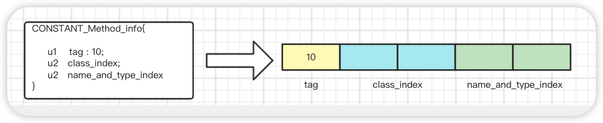
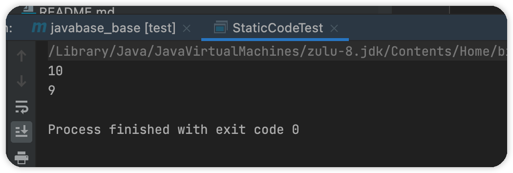
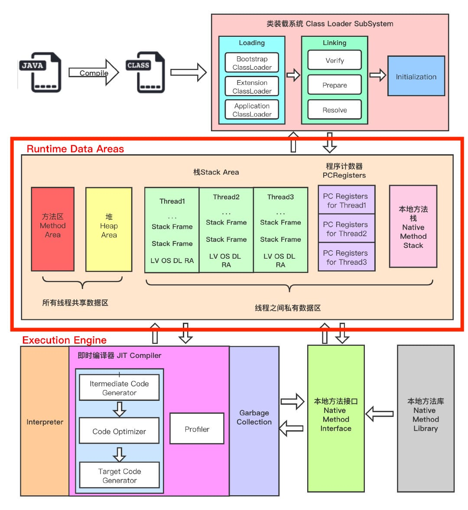

## JVM

### Java类字节码

#### 基础

- 多语言编程成字节码文件在JVM上运行

  > Java是高级语言只有人类可以理解，JVM不可直接运行，计算机也无法识别，计算机中所有操作都是一个个指令。所以Java源文件需要编程成对应的字节码文件，然后JVM转换成对于指令交由计算机运行。
  >
  > JVM不只支持Java，有许多基于JVM的编程语言，如Groovy, Scala, Koltin等等。

- 字节码文件只面向JVM，不针对任何平台

  > 针对不同的操作系统有不同的JVM版本，同样的字节码文件给不同的JVM转换，在不同平台上运行可得到相同的结果。

class文件本质上是一个以8位字节为基础单位的二进制流，各个数据项目严格按照顺序紧凑的排列在class文件中。jvm根据其特定的规则解析该二进制数据，从而得到相关信息。

Class文件采用一种伪结构来存储数据，它有两种类型：无符号数和表。


#### 如何查看字节码文件

写一个Class类：

```java
public class Person {
    private String name;
    public String getName() {
        return name;
    }
    public static void main(String[] args) {
    }
}
```

通过javac命令编程生成字节码文件：

```class
package com.roily.booknode.javatogod._13jvm;
public class Person {
    private String name;
    public Person() {
    }
    public String getName() {
        return this.name;
    }
    public static void main(String[] var0) {
    }
}
```

##### 支持16进制的文本编译器

> `.class`文件是字节码文件，一字节八位，我们采用支持16进制文本编辑器查看。使用`NotePad++`、`UltraEdit`或其他支持工具。
>
> nodepad++需要安装HEX-EDITOR插件。


##### Javap工具

> 使用JVM提供的Javap工具分析字节码：

```class
Classfile /E:/programmeTools/idea/git/JavaBase/javabase/javabase_base/src/main/java/com/roily/booknode/javatogod/_13jvm/Person.class
  Last modified 2023-2-22; size 415 bytes
  MD5 checksum 6b6c5fc0baa51da4b4d0db5bdea7b5a4
  Compiled from "Person.java"
public class com.roily.booknode.javatogod._13jvm.Person
  minor version: 0
  major version: 52
  flags: ACC_PUBLIC, ACC_SUPER
Constant pool:
   #1 = Methodref          #4.#17         // java/lang/Object."<init>":()V
   #2 = Fieldref           #3.#18         // com/roily/booknode/javatogod/_13jvm/Person.name:Ljava/lang/String;
   #3 = Class              #19            // com/roily/booknode/javatogod/_13jvm/Person
   #4 = Class              #20            // java/lang/Object
      stack=1, locals=1, args_size=1
         0: aload_0
         1: getfield      #2                  // Field name:Ljava/lang/String;
         4: areturn
      LineNumberTable:
        line 12: 0

  public static void main(java.lang.String[]);
    descriptor: ([Ljava/lang/String;)V
    flags: ACC_PUBLIC, ACC_STATIC
    Code:
      stack=0, locals=1, args_size=1
         0: return
      LineNumberTable:
        line 17: 0
}
SourceFile: "Person.java"

```


##### 使用idea字节码分析工具插件JclassLib

> 首先搜索安装此插件，view --> show ByteCode with Jclasslib


#### Class字节码结构


##### 魔数

> 占4字节
>
> 魔数(magic)，值为 CA FE BA BE  是`JVM`用于识别是否是`JVM`认可的字节码文件。
>
> 以文件后缀不可确定一个文件类型，很多文件都有魔数比如PNG，jepg在文件头都有魔数

当`JVM`准备加载某个`class`文件到内存的时候，会首先读取该字节码文件的首四位字节码，判断是否是CA FE BA BE,如果是则JVM认可，如果不是JVM则会拒绝加载该字节码文件。

> Class文件不一定都是由`.java`文件编译而来的，`Kotlin`以及其他java虚拟机支持的都可以。

##### 版本号

> 总4个字节，分别占2字节。
>
> 版本号包括主版本号(major_version)和副版本号(minor_version)。
>
> 我们一般只需要关注主版本号，平常所说的java8其实是java1.8。副版本号主要是对主版本的一个优化和bug修复。目前java版本都来到了17了。
>
> JDK1.0的主版本号为45，以后版本每升级一个版本就在此基础上加一，那么JDK1.8对应的版本号为52，对应16进制码为0x34。
>
> 一个版本的JVM只可以加载一定范围内的`Class`文件版本号，一般来说高版本的`JVM`支持加载低版本号的`Class`文件，反之不行。`JVM`在首次加载`class`文件的时候会去读取`class`文件的版本号，将读取到的版本号和`JVM`的版本号进行对比，如果`JVM`版本号低于`class`文件版本号，将会抛出`java.lang.UnsupportedClassVersionError`错误。

我们修改一下`Person.class`关于版本号的数据，提高`class`文件的版本号为0x39 ,为10进制57，jvm版本为java1.13。

通过`java <classpath>.classname`运行一下：

提示说我们的jvm只支持运行`java`版本最高为52的`class`文件，也就是`java1.8`。

```bash
PS E:\programmeTools\idea\git\JavaBase\javabase\javabase_base\target\classes>  java com.roily.booknode.javatogod._13jvm.Person
Error: A JNI error has occurred, please check your installation and try again
Exception in thread "main" java.lang.UnsupportedClassVersionError: com/roily/booknode/javatogod/_13jvm/Person has been compiled by a more recent version of the Java Runtime (class file version 57.0), this version of the Java Runtime only recogniz
es class file versions up to 52.0
        at java.lang.ClassLoader.defineClass1(Native Method)
        at java.lang.ClassLoader.defineClass(ClassLoader.java:763)
        at java.security.SecureClassLoader.defineClass(SecureClassLoader.java:142)
        at java.net.URLClassLoader.defineClass(URLClassLoader.java:467)
        at java.net.URLClassLoader.access$100(URLClassLoader.java:73)
        at java.net.URLClassLoader$1.run(URLClassLoader.java:368)
        at java.net.URLClassLoader$1.run(URLClassLoader.java:362)
        at java.security.AccessController.doPrivileged(Native Method)
        at java.net.URLClassLoader.findClass(URLClassLoader.java:361)
        at java.lang.ClassLoader.loadClass(ClassLoader.java:424)
        at sun.misc.Launcher$AppClassLoader.loadClass(Launcher.java:349)
        at java.lang.ClassLoader.loadClass(ClassLoader.java:357)
        at sun.launcher.LauncherHelper.checkAndLoadMain(LauncherHelper.java:495)
```


##### 常量池计数器(constant_pool_count)

> 2个字节。
>
> 紧跟于版本号后面的是常量池计数器占两个字节。记录整个class文件的字面量信息个数，决定常量池大小。
>
> `constant_pool_count` =  常量池元素个数 + 1。  只有索引在 （0，constant_pool_count）范围内才会有效，索引从1开始。


##### 常量池数据区(constant_pool)

> 常量池类似于一张二维表，每一个结构项代表一条记录，包含`class`文件结构及其子结构中引用的所有字符串常量、类、接口、字段和其他常量。且常量池中每一个元素都具备相似的结构特征，每一个元素的第一字节用做于识别该项是哪种数据类型的常量，称为`tag byte`。


##### 访问标志(access_flags)

> 用于表示一个类、接口、以及方法的访问权限。占用两个字节。
>
> access_flags占用两个字节也就是16位，每一位可以表示一个ACC_FLAG，一个类存在多个ACC_FLAG会通过按位与的方式进行保存。
>
> 那么以上只有8个标志，那么还剩余的是为了以后预留的。

| 标记           | 值（0x） | 作用                                   |
| -------------- | -------- | -------------------------------------- |
| ACC_PUBLIC     | 0x0001   | 公共的                                 |
| ACC_FINAL      | 0x0010   | 不允许被继承                           |
| ACC_SUPER      | 0x0020   | 需要特殊处理父类方法                   |
| ACC_INTERFACE  | 0x0200   | 标记为接口，而不是类                   |
| ACC_ABSTRACT   | 0x0400   | 抽象的，不可被实例化                   |
| ACC_SYNTHETIC  | 0x1000   | 表示由编译器自己生成的，比如说桥接方法 |
| ACC_ANNOCATION | 0x2000   | 表示注解                               |
| ACC_ENUM       | 0x4000   | 表示枚举                               |
|                |          |                                        |


##### 类索引(this_class)

> 类索引的值必须是constant_pool表中的一个有效索引值。constant_pool表在这个索引处的项必须是CONSTANT_CLASS_INFO类型的常量，表示这个Class文件所定义的类或接口。

##### 父类索引(super_class)

> 2个字节
>
> 父类索引
>
> 对于类来说，super_class的值必须为0或者是constant_pool表中的一个有效索引值。如果super_class的值不为0，那么constant_pool表在这个索引处的项必须是CONSTANT_CLASS_INFO类型的常量，表示这个Class文件所定义的直接父类。==当前类的直接父类以及他的所有间接父类的access_flag都不可以带有ACC_FINAL标识==。
>
> 对于接口来说也是一样super_class必须为constant_pool表中的一个有效索引。
>
> 如果class文件的`Super_class`的值为0，那么它只能定义为`java.lang.objec`类，只有它没有父类。

##### 接口计数器(interfaces_count)

> 标识当前类直接接口的数量

##### 接口信息数据区

> Interfaces[interface_coount]。接口信息表Interfaces[]中的每一个成员的值都必须为constant_info表中的一个有效的索引值。constant_pool在对应索引处的项必须是CONSTANT_CLASS_INFO类型的常量。
>
> 且接口信息表中的索引值是有序的，即编译器生成的class文件实现接口的顺序。

##### 字段计数器(fields_count)

> 字段计数器，表示当前类声明的类字段和实例字段（成员变量）的个数。

##### 字段信息数据区(fields[])

> 字段表，长度为fields_count。字段表fields[]中的每一个成员都是`fields_info`结构的数据项，用于描述该字段的完整信息。
>
> 字段表`fields[]`用于记录当前接口或类声明的所有字段信息，但不包括从父类或父接口中继承过来的部分。

##### 方法计数器(method_count)

> 方法计数器，表示当前类定义的方法个数。

##### 方法数据区(methods[])

> 方法表，长度为method_count。方法表methods[]中的每一个成员都是`method_info`结构的数据项，用于描述该方法的完整信息。
>
> 如果一个`method_info`结构中的`access_flags`既不包含`ACC_NATIVE`也不包含`ACC_ABSTRACT`标识。那么标识当前方法可以被`jvm`直接加载，而不需要依赖其他类。
>
> 方法表`methods[]`记录着当前接口或接口中定义的所有方法，包括静态方法、实例方法、初始化方法(init 、cinit)。不包括从父类或父接口中继承过来的方法。

##### 属性计数器

> 属性个数

##### 属性数据区

> `attributes[]`。属性表中的每一项都是一个`Attribute_info`结构。
>
> 包括  SourceFile:

##### 小结


> 根据以上总结，一个class文件可以表示为

```java
classFile{
  u4          			magic;//魔数
  u2         				minor_version;//服版本号（一般不用管）
  u2         				major_version;//主版本号  jdk1.0为45，高本版递增
  u2								constant_pool_count;//常量池计数器
  cp_info						constant_pool[constant_pool_count-1];//常量池数据区
  u2								access_flags;//访问标志
  u2								this_class;//类索引。是constant_pool中的一个有效索引
  u2								super_class;//父类索引。只有object此项为0
  u2								interfaces_count;//直接接口数量
  u2								interfaces[interfaces_count];//接口数据区
  u2								fields_count;//类的成员变量数量
  field_info				fields[fields_count];//类的成员变量数据区
  u2								methods_count;//定义方法个数
  method_info				methods[methods_count];//方法数据区
  u2 							  attributes_count;//属性数量
  attribute_info	  attributes[attributes_count]//属性数据区
}
```


<hr>

#### class常量池

> class常量池是很重要的一个数据区。

##### class常量池在什么位置

> class常量池在`class`文件中的什么位置？
>
> 如下图，在主版本号之后的区域就是常量池相关的数据区了。首先是两个字节的常量池计数器，紧接着就是常量池数据区。


> 常量池计数器的数值为何比常量池项数量大一？

常量池计数器是从1开始计数的而不是0，如果常量池计数器的数值为15那么常量池中常量项(cp_info)的数量就为14。常量池项个数 = constant_count-1。

将第一位空出来是有特殊考虑的，当某些索引表示不指向常量池中任何一个常量池项的时候，可以将索引设置为0。


##### 有哪些cp_info

> Constant_pool
>
> 常量池项(cp_info)记录着class文件中的字面量信息。那么存在多少种cp_info，以及如何区分。

cp_info中存在着一个tag属性，jvm会根据tag值来区分不同的常量池结构体


| Tag  | 结构                             | 说明                     |
| ---- | -------------------------------- | ------------------------ |
| 1    | CONSTANT_Utf8_info               | 字符串常量值             |
| 3    | CONSTANT_Integer_info            | INT类型常量              |
| 4    | CONSTANT_Float_into              | FLOAT类型常量            |
| 5    | CONSTANT_Double_info             | DOUBLE类型常量           |
| 7    | CONSTANT_Class_info              | 类或接口全限定名常量     |
| 8    | CONSTANT_String_info             | String类型常量对象       |
| 9    | CONSTANT_Fieldref_info           | 类中的字段               |
| 10   | CONSTANT_Methodref_info          | 类中的方法               |
| 11   | CONSTANT_InterfaceMethodref_info | 所实现接口的方法         |
| 12   | CONSTANT_NameAndType_info        | 字段或方法的名称和类型   |
| 15   | CONSTANT_MethodHandler_info      | 方法句柄                 |
| 16   | CONSTANT_MethodType_info         | 方法类型                 |
| 18   | CONSTANT_InvokeDynamic_info      | 表示动态的对方法进行调用 |
|      |                                  |                          |

##### int和float的cp_info

> int的常量池项结构为`CONSTANT_Integer_info`。float的常量池项结构为`CONSTANT_Float_info`。且这两种数据类型所占空间都为四个字节。所对应的结构如下：


```java
// 此字段在当前类中没有使用，不会生成对应Fieldref结构体。但会存储字段名称
private Integer age;
// 作为引用类型 Ljava/lang/Integer
private static Integer num1 = 10;
// 基本数据类型，对应类型为 I
private static int num2 = 10;
```

对应字节码表示：结构体中只有字段结构体，并没有Integer结构体，若想要存Constant_Integer_info进class常量池，需要用final修饰或者定义的大一点

例子：

```java
private final int num3 = 10;
// 大于 32767
private int num4 = 32768;
```

```bash
#3 = Integer            32768
#20 = Integer            10
```

##### long&double

> Long的常量池项结构为`CONSTANT_Long_info`。double的常量池项结构为`CONSTANT_Double_info`。且这两种数据类型所占空间都为8个字节。所对应的结构如下：


会将对应结构存入constant_pool中

```java
private long num5 = 1L;
private Long num6 = 2L;
private double num7 = 1D;
private Double num8 = 2D;
```

```bash
#6 = Long               2l
#11 = Double             2.0d
```


##### String的cp_info

> String的常量池项结构为`CONSTANT_String_info`。所对应的结构如下：


> String常量在常量池中的表示，为一个`CONSTANT_String_info`结构体，这个结构体除了一个tag外，还有一个指向`CONSTANT_Utf8_info`结构体的索引string_index。
>
> 所以说每一个字符串在编译的时候，编译器都会为其生成一个不重复的`CONSTANT_String_info`结构体，并放置于`CONSTANT_poll`class常量池中，而这个结构体内的索引string_index会指向某个`CONSTANT_Utf8_info`结构体，在`CONSTANT_Utf8_info`结构体内才正真存储着字符串的字面量信息。

`CONSTANT_Utf8_info`结构体的结构为：

其中legth为字节数组长度

bytes[length]存储着字符串字面量信息的字符数组


```java
private String str = "yuyc" ;
```

```bash
#16 = Fieldref           #21.#66        // com/roily/booknode/javatogod/_13jvm/Person.str:Ljava/lang/String;
#21 = Class              #72            // com/roily/booknode/javatogod/_13jvm/Person
#66 = NameAndType        #42:#24        // str:Ljava/lang/String;
#24 = Utf8               Ljava/lang/String;
#42 = Utf8               str
#72 = Utf8               com/roily/booknode/javatogod/_13jvm/Person
#15 = String             #65            // yuyc
#65 = Utf8               yuyc

构造方法:
取出utf结构体字面量数据，设置到str中
47: ldc           #15                 // String yuyc
49: putfield      #16                 // Field str:Ljava/lang/String;
```

整合起来的结构就是这个样子的：


##### 类(class)的cp_info

> 定义的类和在类中引用到的类在常量池中如何组织和存储的？

> 和String类型一样涉及到两个结构体，分别是：`CONSTANT_Class_info`和`CONSTANTT_Utf8_info`。编译器会将，定义和引用到类的完全限定名称以二进制的形式封装到`CONSTANT_Class_info`中，然后放入到class常量池中。结构如下：


类的完全限定名称和二进制形式的完全限定名称

> 类的完全限定名称：`com.roily.booknode.javatogod._13jvm.Person`,以点·分隔
>
> 二进制形式的类的完全限定名称：编译器在编译时，会将点替换为/，然后存入class文件，所以称呼`com/roily/booknode/javatogod/_13jvm/Person`为二进制形式的类的完全限定名称。

例子：

```bash
#21 = Class              #72            // com/roily/booknode/javatogod/_13jvm/Person
#72 = Utf8               com/roily/booknode/javatogod/_13jvm/Person
#22 = Class              #73            // java/lang/Object
#73 = Utf8               java/lang/Object
#58 = Class              #74            // java/lang/Long
#74 = Utf8               java/lang/Long
#62 = Class              #77            // java/lang/Double
#77 = Utf8               java/lang/Double
#68 = Class              #79            // java/lang/Integer
#79 = Utf8               java/lang/Integer
```

小结:

- 对于一个类或者接口，jvm编译器会将其自身、父类和接口的信息都各自封装到`CONSTANT_Class_info`中，并存入`CONSTANT_POOl`常量池中
- 只有真正使用到的类jvm编译器才会为其生成对应的`CONSTANT_Class_info`结构体，而对于未真正使用到的类则不会生成，比如只声明一个变量`StringBuffer sb2;`则不会生成对应结构体


##### 字段的cp_info

> 在定义一个类的时候以及在方法体内都会定义一些字段，这些字段在常量池中是如何存储的呢？
>
> 涉及到三个结构体，分别是：`CONSTANT_Fieldref_info`、`CONSTANT_Class_info`和`        CONSTANT_NameAndType_info`
>
> field字段描述信息 = field字段所属的类 .  field字段名称 : field字段描述;

比如上面的name字段

```bash
// 类二进制全限定名称.字段名称:类型;
#15 = Fieldref           #19.#62        // com/roily/booknode/javatogod/_13jvm/Person.name:Ljava/lang/String;
#19 = Class              #67            // com/roily/booknode/javatogod/_13jvm/Person
#67 = Utf8               com/roily/booknode/javatogod/_13jvm/Person
#62 = NameAndType        #21:#22        // name:Ljava/lang/String;
#21 = Utf8               name
#22 = Utf8               Ljava/lang/String;
```


一个`CONSTANT_Fieldref_info`与其他结构体的关系可以表示为：


###### NameAndType

> `CONSTANT_NameAndType_info`结构体中关于字段的描述：

- 对于基本数据类型

| 类型    | 描述 | 说明             |
| ------- | ---- | ---------------- |
| byte    | B    | 表示一个字节整型 |
| short   | S    | 短整型           |
| int     | I    | 整型             |
| long    | J    | 长整型           |
| float   | F    | 单精度浮点数     |
| double  | D    | 双精度浮点数     |
| char    | C    | 字符             |
| boolean | Z    | 布尔类型         |
|         |      |                  |

- 对于引用类型来说

L<ClassName>。

比如StringBuilder类型的描述信息为：`Ljava/lang/StringBuilder`


- 对于数组类型来说

[<descriptor>   一个左中括号加上数组元素类型。

比如long[] ls = {1L,2L};对应描述信息为：`[J`


###### 小结

- jvm编译器会为每一个有效使用的字段生成一个对应的`CONSTANT_Field_info`结构体，该结构体内包含了一个`class_index`指向该字段所在类的结构体索引值，和一个`name_and_type_index`指向该字段名称和描述信息的结构体索引值
- 如果一个字段没有被使用到，jvm不会将其放入常量池中


##### 方法的cp_info

> 和字段的cp_info相似，jvm编译时会将每一个方法(前提是使用到)包装成一个`CONSTANT_Methodref_ingo`结构体，放入常量池，该结构体内存在两个索引值分别是`Class_index`和`name_and_type_index`。




###### 一个方法的结构体信息表示：

方法结构体信息 = 方法所属的类 .   方法名称:(参数说明)返回值

【(参数说明)返回值】就是方法的描述信息。

比如我有一个方法：String getMsg();  那么描述信息就可以表示为：()Ljava/lang/String

==如果返回值是Void的话，则表示为V==


### JVM类加载过程

> 此处所说的类加载过程不单指类加载的某个阶段，而指类加载阶段到初始化阶段这个过程。


#### 类的生命周期

> 从一个.class文件，到被加载到虚拟机内存中，最后从虚拟机卸载出内存，称为类的生命周期。包括：加载（Loading）、验证（Verification）、准备（Preparation）、解析（Resolution）、初始化（Initialization）、使用（Using）和卸载（Uploading）7个阶段。其中验证、准备、解析3个部分统称为连接。

一个类的生命周期大致如下：


#### 类加载过程中的各个阶段

#####  加载

> 加载是类加载过程的一个阶段，在此阶段java虚拟机需要做如下事情：

- 通过一个类的全限定名来获取此类的二进制字节流
- 将字节流代表的类转化为==方法区==的运行时数据结构
- 在==堆==内存中生成唯一的Class对象，作为访问该类的入口

> 需要注意的是jvm对于第二点没有特定要求，并没有限定此二进制流是从文件中来的还是通过网络传输的

可以从

- 从压缩包中读取二进制流，zip、jar、war..
- 通过网络传输
- 运行时生成。例如：jdk动态代理，在运行期间通过ProxyGenerator.generateProxyClass来为特定接口生成形式为`$Proxy`的二进制字节流

- 从其他文件转化生成。例如：jsp文件会在首次访问的时候生成对应的servlet的java和class文件
- 数据库中读取

> 相较于类加载过程中的其他阶段，加载阶段相对可控，我们可以自定义加载器来加载我们所需要的指定类

##### 连接

###### 验证

> 验证是连接阶段的第一步，这一阶段的目的是为了确保 Class 文件的字节流中包含的信息符合当前虚拟机的要求，并且不会危害虚拟机自身的安全。
>
> 验证阶段不是必须的，对程序运行没有影响，可以使用参数关闭它以缩短虚拟机启动时间。

为何需要验证？

> 因为Class 文件来源是任意字节流，并不一定来自于 Java 源码编译，虚拟机如果不检查输入的字节流，对其完全信任的话，很可能会因为载入了有害的字节流而导致系统崩溃，所以验证是虚拟机对自身保护的一项重要工作。

验证哪些？

> 从整体上看，验证阶段大致上会完成下面4个阶段的检验动作：文件格式验证、元数据验证、字节码验证、符号引用验证。

- 文件格式验证

> 魔数和版本号验证

- 元数据验证

> 第二阶段是对字节码描述的信息进行语义分析，以保证其描述的信息符合 Java 语言规范的要求

1. 这个类是否有父类（除了`java.lang.Object`之外，所有的类都应当有父类）；

2. 这个类的父类是否有继承了不允许被继承的类（被 final 修饰的类）
3. 如果这个类不是抽象类，是否实现了其父类或接口中要求实现的所有方法；
4. 类中的字段、方法是否与父类产生矛盾（例如覆盖了父类的 fianl 字段，或者出现不符合规则的方法重载，例如方法参数都一致，但返回值类型却不同等）；

- 字节码验证

第三阶段是整个验证过程中最复杂的一个阶段，主要目的是通过数据流和控制流分析，确定程序语义是合法的、符合逻辑的。在第二阶段对元数据信息中的数据类型做完校验后，这个阶段对类的方法体进行校验分析，保证被校验的方法在运行时不会做出危害虚拟机安全的事件，例如：

1. 保证任何时刻操作数栈的数据类型与指令代码序列都能配合工作，例如不会出现类似这样的情况：在操作栈放置了一个 int 类型的数据，使用时却按 long 类型来加载如本地变量表中；
2. 保证跳转指令不会跳转到方法体以外的字节码指令上；
3. 保证方法体中的类型转换是有效地，例如可以把一个子类对象赋值给父类数据类型，这样是安全的，但是把父类对象赋值给子类数据类型，甚至把对象赋值给它毫无继承关系、毫不相关的一个数据类型，则是危险和不合法的；

如果一个类方法体的字节码没有通过字节码验证，那肯定是有问题的，但如果一个方法体通过了字节码验证，也不能说明其一定就是安全的。即使字节码验证之中进行了大量的检查，也不能保证这一点。这里设计了离散数学中一个很著名的问题“Halting Problem”：通俗一点的说法就是，通过程序去校验程序逻辑是无法做到绝对准确地 - 不能通过程序准确地检查出程序是否能在有限的时间之内结束运行。


-  符号引用验证

最后一个阶段的校验发生在虚拟机将符号引用转化为直接引用的时候，这个转化动作将在连接的第三阶段--解析阶段中发生。符号引用验证可以看做是对类自身以外（常量池中的各种符号引用）的信息进行匹配性校验，通常需要检验下列内容：

1. 符号引用中通过字符串描述的全限定名是否能找到对应的类；
2. 在指定类中是否存在符合方法的字段描述符以及简单名称所描述的方法和字段；
3. 符号引用中的类、字段、方法的访问符（private、default、protected、public）是否可被当前类访问；

符号应用验证的目的是确保解析动作能正常执行，如果无法通过符号引用验证，那么将会抛出一个`java.lang.IncompatibleClassChangeError`异常的子类，如`java.lang.IllegalAccessError`、`java.lang.NoSuchFieldError`、`java.lang.NoSuchMethodError`等。
对于虚拟机的类加载机制来说，验证阶段是一个非常重要的，但不是一定必要的（因为对程序运行期没有影响）的阶段。如果所运行的代码（包括自己编写的及第三方包中的代码）都已经被反复使用和验证过，那么在实施阶段就可以考虑使用 -Xverify:none 参数来关闭大部分的类验证措施，以缩短虚拟机类加载的时间。

###### 准备

> 准备阶段为被static修饰的成员变量在==方法区==分配内存并赋予初始值。

准备阶段是正式为类变量分配内存并设置类变量初始值的阶段，这些变量所使用的的内存都将在方法区中进行分配。这个阶段中有两个容易产生混淆的概念需要强调一下，首先，这时候进行内存分配的仅包括类变量（被 static 修饰的变量）而不包括实例变量，实例变量将在对象实例化时随着对象一起分配在 Java 堆中。其次，这里所说的初始值“通常情况”下是数据类型的零值，假设一个类变量的定义为：`public static int value = 123;`，那变量 value 在准备阶段过后的初始值为 0 而不是 123，因为这时候尚未开始执行任何 Java 方法，而把 value 赋值为 123 的 `putstatic` 指令是程序被编译后，存放于类构造器`<clinit>()`方法之中，所以把 value 赋值为 123 的动作将在初始化阶段才会执行。下表列出了 Java 中所有基本数据类型的零值：

- 基本数据类型      初始值为0
- 引用数据类型初始值为 null

值得注意的是被static final 修饰的变量会在准备阶段赋值，因为会在常量池中生成对应的结构体。

###### 解析

解析阶段是虚拟机将常量池内的符号引用替换成直接引用的过程，符号引用可以是各种字面量值，比如说类二进制全限定名称，字段名称等；直接引用就是指针。


##### 初始化

> 类初始化阶段是类加载过程的最后一步，前面的类加载过程中，除了在加载阶段用户应用程序可以通过自定义类加载器参与之外，其余动作完全由虚拟机主导和控制。到了初始化阶段，才真正开始执行类中定义的 Java 程序代码（或者说字节码）。

在准备阶段类变量由虚拟机主导已经赋予过一次默认值，而在初始化阶段才会真正的按照程序员的主观意愿去给类变量设置初始值。此处涉及一个`cinit<>()`方法，可以理解为类的构造器，他会将被static修饰的变量及代码块按顺序封装起来，一起打包执行。

Code1：可以思考一下结果是多少

```java
public class StaticCodeTest {
    private static StaticCodeTest staticCodeTest = new StaticCodeTest();
    private static int a;
    private static int b = 0;
    static {
        a = 10;
        b = 9;
    }
    public StaticCodeTest() {
        a++;
        b++;
    }
    public static void main(String[] args) {
        System.out.println(a);
        System.out.println(b);
    }
}
```



编译器会按顺序收集静态代码，并打包成`cinit`方法。

> `cinit<>()`方法可以理解为类的构造器，那么它与父类的类构造器有什么关系呢？

`<clinit>()`方法与类的构造函数（或者说实例构造器`<init>()`方法）不同，它不需要显示地调用父类构造器，虚拟机会保证在子类的`<clinit>()`方法执行之前，父类的`<clinit>()`方法已经执行完毕。因此在虚拟机第一个被执行的`<clinit>()`方法的类肯定是`java.lang.Object`。

Code2:结果为2，优先触发父类的初始化

```java
public class Parent {
    static int a = 1;
    static {
        ++a;
    }
}

class Son extends Parent {
    private static int b = a;
    public static void main(String[] args) {
        System.out.println(Son.b);
    }
}
```


> `cinit<>()`不是必须的

- `<clinit>()`方法并不是必须的，如果一个类中没有静态语句块，也没有对类变量的赋值操作，那么编译器可以不为这个类生成`<clinit>()`方法
- 接口中不能使用静态语句块，但仍然有变量初始化的赋值操作，因此接口与类一样都会生成`<clinit>()`方法。但接口与类不同的是，执行接口的`<clinit>()`方法不需要先执行父接口的`<clinit>()`方法。只有当父接口中定义的变量使用时，父接口才会初始化。另外，接口的实现类在初始化时也一样不会执行接口的`<clinit>()`方法
- 虚拟机会保证一个类的`<clinit>()`在多线程环境中被正确的加锁、同步，如果多个线程同时去初始化一个类，那么只会有一个线程去执行这个类的`<clinit>()`方法，其他线程都需要阻塞等待，知道活动线程执行`<clinit>()`方法完毕。如果在一个类的`<clinit>()`方法中有耗时很长的操作，就可能造成多个线程阻塞。

第三点也是恶汉式单例可以保证线程安全的原因。


#### 何时会触发类的初始化

> 当对一个类进行直接引用的时候会触发类的初始化

##### 直接引用

> 什么情况下是对类的直接引用？

- 使用new关键字实例化对象时、读取或设置类的静态成员变量、调用静态方法
- 使用反射创建或调用对象时
- 当一个类存在父类，初始化当前类，此刻若父类没有初始化，则会先初始化父类
- 启动类所使用的main方法所在类

Code1：

```java
public class Code1 {
    static int i = 1;
    static {
        i = 10;
        System.out.println("i的值为：" + i);
    }
}
class Test{
    static{
        System.out.println("main方法所在类初始化。。。");
    }
    public static void main(String[] args) {
        final Code1 code1 = new Code1();
    }
}
```

此例说明第一点和第四点


Code2:

```java
public class Code2 {
    public static void main(String[] args) throws ClassNotFoundException {     Class.forName("com.roily.classloader.cinit.Code1",true,ClassLoader.getSystemClassLoader() );
    }
}
```

第一个参数为类的全限定名称

第二个参数为是否触发类的初始话

第三个为类加载器

此例说明反射也会触发类的初始化。


第二个参数设为false不会触发类的初始化：


##### 间接引用

> 这里列出间接引用的例子，其他情况基本上都会触发类的初始化

- 通过子类引用父类的静态字段，只会触发父类的初始化，而不会触发子类的初始化。
- 定义对象数组和集合，不会触发该类的初始化
- 类A引用类B的static final常量不会导致类B初始化（注意静态常量必须是字面值常量，否则还是会触发B的初始化）
- 通过类名获取Class对象，不会触发类的初始化。如System.out.println(Person.class);
- 通过Class.forName加载指定类时，如果指定参数initialize为false时，也不会触发类初始化。
- 通过ClassLoader默认的loadClass方法，也不会触发初始化动作


Code1：通过子类调用父类静态成员变量不会触发子类初始化

```java
public class Code1 {
    public static void main(String[] args) {
        System.out.println(Son.a);
    }
}
class Parent {
    static int a = 1;
    static {
        System.out.println("父类初始化");
    }
}
class Son extends Parent {
    static {
        System.out.println("子类初始化");
    }
}
```


Code2: 引用被final static修饰的只有字面量的变量不会触发类的初始化

```java
public class Code2 {
    
    public static void main(String[] args) {
        System.out.println(Demo.a);
        System.out.println(Demo2.str);
    }
}

class Demo {
    final static int a = 1;
    static {
        System.out.println("Demo初始化");
    }
}

class Help {
    static String a = "abc";
}

class Demo2 {
    /**
     * 不是字面量，会触发类的初始化
     */
    final static String str = Help.a;
    static {
        System.out.println("Demo2初始化");
    }
}
```


### JVM内存结构


#### 简介

> JVM内存结构和Java内存模型不是一个概念，Java内存模型是一个规范，JVM内存结构则是Java虚拟机在运行期间对内存进行分配，不同数据存储在不同的数据区上。
>
> JVM运行时数据区主要分为：Method Area(方法区)、Heap Area(堆区)、程序计数器、虚拟机栈、本地方法栈。

下图是 JVM 整体架构，中间部分就是 Java 虚拟机定义的各种运行时数据区域。




运行时数据区分为线程共享和线程私有的，线程私有的运行时数据区会随线程的创建而创建，随线程的销毁而销毁

- 线程共享的运行时数据区：  堆、方法区、堆外内存（jdk7的永久代、jdk8的元空间）
- 线程私有的运行时数据区：  程序计数器、虚拟机栈、本地方法栈

#### 程序计数器

>  程序计数器是一块较小的内存空间，可以看作是当前线程所执行的字节码的**行号指示器**，它存储着下一条需要执行的指令的行号。

程序计数寄存器（**Program Counter Register**），Register 的命名源于 CPU 的寄存器，寄存器存储指令相关的线程信息，CPU 只有把数据装载到寄存器才能够运行。

这里，并非是广义上所指的物理寄存器，叫程序计数器（或PC计数器或指令计数器）会更加贴切，并且也不容易引起一些不必要的误会。**JVM 中的 PC 寄存器是对物理 PC 寄存器的一种抽象模拟**。

##### 用处

我们的源文件会被编译成Jvm认可的字节码文件，字节码文件会被处理器处理成一个个指令给到操作系统运行，寄存器存储着下一条待执行的指令行号

- 这样在CPU线程上下文切换的时候，切换到当前线程就可以知道下一条需要执行的指令
- CP寄存器是线程私有的，因为CPU会频繁切换线程，为每个线程分配单独的CP计数器是必须的


##### 小结

- 它是一块很小的内存空间，几乎可以忽略不计。也是运行速度最快的存储区域
- 在 JVM 规范中，每个线程都有它自己的程序计数器，是线程私有的，生命周期与线程的生命周期一致
- 任何时间一个线程都只有一个方法在执行，也就是所谓的**当前方法**。如果当前线程正在执行的是 Java 方法，程序计数器记录的是 JVM 字节码指令地址，如果是执行 native 方法，则是未指定值（undefined）
- 它是程序控制流的指示器，分支、循环、跳转、异常处理、线程恢复等基础功能都需要依赖这个计数器来完成
- 字节码解释器工作时就是通过改变这个计数器的值来选取下一条需要执行的字节码指令
- **它是唯一一个在 JVM 规范中没有规定任何 `OutOfMemoryError` 情况的区域**

#### 虚拟机栈

###### 基础


> 虚拟机栈也叫方法栈，每个线程创建的时候都会创建一个虚拟机栈，栈中的内一个元素就叫做栈帧(Stack Frame)，对应着一次次的方法调用，虚拟机栈是线程私有的，生命周期和线程一致。

- 虚拟机栈的访问速度仅次于程序计数器
- 栈不存在垃圾回收问题
- JVM对虚拟机栈的操作：压栈、弹栈，调用一个方法就会创建一个栈帧压到虚拟机栈顶部成为当前栈栈帧，对应方法叫做当前方法。每当一个方法执行结束，就会弹栈并将结果(空、异常、结果)返回。

> 栈的大小，栈的大小决定了函数调用的最大可达深度

虚拟机栈的大小可以固定也可指定动态范围

- 如果虚拟机栈是固定大小的，当栈容量不够了的时候，JVM会抛出一个StackOverflowError错误
- 如果虚拟机栈是动态指定的，当栈空间不够了的时候会尝试申请内存，如果申请不到的话，就会抛出OutOfMemoryError错误

###### 栈的运行原理

> 虚拟机栈存储着什么？-----栈帧
>
> 虚拟机栈是线程私有的，不同线程中所包含的栈帧是不允许相互引用的

以下例子使用Idea Debug调试可观察栈的入栈出栈情况，此例子最终会抛出StackOutOfFlowError错误，因为没有弹栈操作。


###### 栈帧的内部结构

> 虚拟机栈中包含着一个个栈帧，栈帧中存储着方法运行时的必要结构，包括：
>
> - 操作数栈(Operand Stack)
> - 局部变量表(Local Variables)  或称作为表达式栈
> - 动态链接(Dynamic Linking)：指向运行时常量池的方法引用
> - 方法返回地址(Return Address)：方法推出的地址
> - 一些附加信息


**一、操作数栈**

> 操作数栈也叫表达式栈
>
> 操作数栈根据字节码指令，往操作数栈中写入数据和弹出数据
>
> 是计算结果的暂存区，比如求和过程，参数一入栈、参数二入栈，求和指令：参数二和参数一弹栈并将计算结果入栈

- 操作数栈，用于保存中间过程计算结果，作为中间过程计算结果的临时存储区域
- 操作数栈的栈深度，在编译期就已经确定好了，保存在方法的code属性的stack
- 操作数栈中的元素可以是任意类型
  - 32bit的类型占用一个栈帧
  - 64bit的类型占用两个栈帧
- 如果被调用方法带有返回值的话，返回值将会被压入当前栈帧的操作数栈中，并更新程序计数器下一条需要执行的指令


**二、局部变量表**

- 局部变量表也成为局部变量表数组或本地变量表，这是一个数组结构
- 用于存储方法参数和定义在方法体内的局部变量。可以是基本数值类型，也可以是引用类型（指向对象起始地址的引用）
- 局部变量表存储在栈帧上，栈帧在虚拟机栈上，也就是线程私有，也就是不存在线程安全问题
- 局部变量表的容量是编译器确定的，存储在方法的Code属性locals=5
- 局部变量表只在当前方法中有效，当方法调用结束后，随着栈帧的销毁，局部变量表也会随之销毁
- 局部变量表参数值的存放总是在局部变量表数组的index0开始，-1结束

> 局部变量表的单位是Slot（槽）

- 在局部变量表中，32位以内类型占一个槽，64位类型占用两个槽
  - 32位： byte、short、char会转换成int、boolean也会转化为int    
  - 64位：  long和double
- 当访问局部变量表中一个64位的局部变量是，只需要使用前一个索引即可（不允许访问某一个索引）
- 构造方法和实例方法的index0处存放着当前对象的引用this，其余参数按参数列表顺序排列（索引静态方法不可访问this，因为局部变量表中没有this）
- 局部变量表的槽位是可以重用的，如果一个局部变量过了其作用周期，那么在其作用域之后声明的变量会复用过期的槽位
- 局部变量表与JVM性能调优关系密切，方法执行时，使用局部变量表完成方法传递（拷贝副本），只要被局部变量表中直接或间接引用的对象都不会被回收


###### 局部变量表和虚拟机栈的运行原理

- 局部变量表创建的时候，首先this放入0处，然后参数列表按顺序依次放入
- 指令的执行（add指令、invockvirtul），首先全部元素弹栈，并将结果加入局部变量表

例一静态方法：

- 局部变量表长度为0，也就是this都没有，静态方法为什么调用不了this


例二成员方法：

- 局部变量表长度为1，存储着一个隐式成员变量this


例三对于过了作用范围的局部变量，会重复利用Slot：

- 局部变量表的Slot可重复利用，此例槽位2处就被重复利用了，因为b作用范围过了


例四add指令：

- add指令会弹出操作数栈所有元素，执行add指令并将结果返回


例五invokevirtual指令：

- invokevirtual指令会弹出操作数栈所有元素，执行invokevirtual指令并将结果返回


###### 动态链接


一个例子：

当我们调用其他类的方法或字段时，往往需要获取方法或字段的二进制全限定的名称和方法(字段)名称。


动态链接的作用就是：

一个方法或者属性，都会以一个结构体的方式存储在class常量中放在方法区上面。调用其他方法时我们也会将该方法的全限定名称和方法名称保存下来。动态链接的作用就是将这些二进制权限定名称（也就是符号引用），所代表的直接引用。


###### 方法返回地址

用来存放调用该方法的 PC 寄存器的值。

一个方法的结束，有两种方式

- 正常执行完成
- 出现未处理的异常，非正常退出

无论通过哪种方式退出，在方法退出后都返回到该方法被调用的位置。方法正常退出时，调用者的 PC 计数器的值作为返回地址，即调用该方法的指令的下一条指令的地址。而通过异常退出的，返回地址是要通过异常表来确定的，栈帧中一般不会保存这部分信息。

当一个方法开始执行后，只有两种方式可以退出这个方法：

1. 执行引擎遇到任意一个方法返回的字节码指令，会有返回值传递给上层的方法调用者，简称**正常完成出口**

   一个方法的正常调用完成之后究竟需要使用哪一个返回指令还需要根据方法返回值的实际数据类型而定

   在字节码指令中，返回指令包含 ireturn(当返回值是 boolean、byte、char、short 和 int 类型时使用)、lreturn、freturn、dreturn 以及 areturn，另外还有一个 return 指令供声明为 void 的方法、实例初始化方法、类和接口的初始化方法使用。

2. 在方法执行的过程中遇到了异常，并且这个异常没有在方法内进行处理，也就是只要在本方法的异常表中没有搜索到匹配的异常处理器，就会导致方法退出。简称**异常完成出口**

   方法执行过程中抛出异常时的异常处理，存储在一个异常处理表，方便在发生异常的时候找到处理异常的代码。

本质上，**方法的退出就是当前栈帧出栈的过程**。此时，需要恢复上层方法的局部变量表、操作数栈、将返回值压入调用者栈帧的操作数栈、设置PC寄存器值等，让调用者方法继续执行下去。

正常完成出口和异常完成出口的区别在于：**通过异常完成出口退出的不会给他的上层调用者产生任何的返回值**

#### 堆

##### 内存划分

对于大多数应用，Java 堆是 Java 虚拟机管理的内存中最大的一块，被所有线程共享。此内存区域的唯一目的就是存放对象实例，几乎所有的对象实例以及数据都在这里分配内存。

为了进行高效的垃圾回收，虚拟机把堆内存**逻辑上**划分成三块区域（==分代的唯一理由就是优化 GC 性能==）：

- 新生带（年轻代）：新对象和没达到一定年龄的对象都在新生代。（这里的对象一定不能太大）
- 老年代（养老区）：被长时间使用的对象，老年代的内存空间应该要比年轻代更大
- 元空间（JDK1.8 之前叫永久代）：像一些方法中的操作临时对象等，JDK1.8 之前是占用 JVM 内存，JDK1.8 之后直接使用物理内

Java 虚拟机规范规定，Java 堆可以是处于物理上不连续的内存空间中，只要逻辑上是连续的即可，像磁盘空间一样。实现时，既可以是固定大小，也可以是可扩展的，主流虚拟机都是可扩展的（通过 `-Xmx` 和 `-Xms` 控制），如果堆中没有完成实例分配，并且堆无法再扩展时，就会抛出 `OutOfMemoryError` 异常

##### 年轻代

年轻代是所有新对象创建的地方。当填充年轻代时，执行垃圾收集。这种垃圾收集称为 **Minor GC**。年轻一代被分为三个部分——伊甸园（**Eden Memory**）和两个幸存区（**Survivor Memory**，被称为from/to或s0/s1），默认比例是`8:1:1`

- 大多数新创建的对象都位于 Eden 内存空间中
- 当 Eden 空间被对象填充时，执行**Minor GC**，并将所有幸存者对象移动到一个幸存者空间中
- Minor GC 检查幸存者对象，并将它们移动到另一个幸存者空间。所以每次，一个幸存者空间总是空的
- 经过多次 GC 循环后存活下来的对象被移动到老年代。通常，这是通过设置年轻一代对象的年龄阈值来实现的，然后他们才有资格提升到老一代

##### 老年代

旧的一代内存包含那些经过许多轮小型 GC 后仍然存活的对象。通常，垃圾收集是在老年代内存满时执行的。老年代垃圾收集称为 主GC（Major GC），通常需要更长的时间。

大对象直接进入老年代（大对象是指需要大量连续内存空间的对象）。这样做的目的是避免在 Eden 区和两个Survivor 区之间发生大量的内存拷


##### 小结

###### 堆内存大小

Java 堆用于存储 Java 对象实例，那么堆的大小在 JVM 启动的时候就确定了，我们可以通过 `-Xmx` 和 `-Xms` 来设定

- `-Xms` 用来表示堆的起始内存，等价于 `-XX:InitialHeapSize`
- `-Xmx` 用来表示堆的最大内存，等价于 `-XX:MaxHeapSize`

如果堆的内存大小超过 `-Xmx` 设定的最大内存， 就会抛出 `OutOfMemoryError` 异常。

我们通常会将 `-Xmx` 和 `-Xms` 两个参数配置为相同的值，其目的是为了能够在垃圾回收机制清理完堆区后不再需要重新分隔计算堆的大小，从而提高性能

- 默认情况下，初始堆内存大小为：电脑内存大小/64
- 默认情况下，最大堆内存大小为：电脑内存大小/4

###### 对象在堆中的生命周期

在 JVM 内存模型的堆中，堆被划分为新生代和老年代 

- 新生代又被进一步划分为 **Eden区** 和 **Survivor区**，Survivor 区由 **From Survivor** 和 **To Survivor** 组成

当创建一个对象时，对象会被优先分配到新生代的 Eden 区 

- 此时 JVM 会给对象定义一个**对象年轻计数器**（`-XX:MaxTenuringThreshold`）

当 Eden 空间不足时，JVM 将执行新生代的垃圾回收（Minor GC） 

- JVM 会把存活的对象转移到 Survivor 中，并且对象年龄 +1
- 对象在 Survivor 中同样也会经历 Minor GC，每经历一次 Minor GC，对象年龄都会+1

如果分配的对象超过了`-XX:PetenureSizeThreshold`，对象会**直接被分配到老年代


###### 对象分配过程

1. new 的对象先放在伊甸园区，此区有大小限制
2. 当伊甸园的空间填满时，程序又需要创建对象，JVM 的垃圾回收器将对伊甸园区进行垃圾回收（Minor GC），将伊甸园区中的不再被其他对象所引用的对象进行销毁。再加载新的对象放到伊甸园区
3. 然后将伊甸园中的剩余对象移动到幸存者 s0 区
4. 如果再次触发垃圾回收，此时上次幸存下来的放到幸存者 0 区，如果没有回收，就会放到幸存者 s1 区
5. 如果再次经历垃圾回收，此时会重新放回幸存者 s0 区，接着再去幸存者 s1 区
6. 什么时候才会去养老区呢？ 默认是 15 次回收标记
7. 在养老区，相对悠闲。当养老区内存不足时，再次触发 Major GC，进行养老区的内存清理
8. 若养老区执行了 Major GC 之后发现依然无法进行对象的保存，就会产生 OOM 异常


###### 堆不是分配内存的唯一选择

> 在堆内存分配的对象是可以共享的，但是大多数情况下，我们在方法内创建的对象是不许要共享的，及方法执行完毕，栈帧销毁，当前方法应该也销毁，但是由于方法创建在堆内存上，所以不会立刻销毁，会经历一轮GC才会清理。
>
> 所以应运而来的就是逃逸分析：逃逸分析就是分析对象的作用域
>
> - 当一个对象在方法中被定义，对象只在方法内使用，则认为没有发生逃逸
> - 当一个对象在方法中被定义，他被外部方法所引用，则认为发生逃逸，例如作为参数传递、作为返回值传递

> 缺点：
>
> 虽然逃逸分析可以节省堆内存，但是其消耗的算力可能导致JVM启动过慢，综合性能不一定是最优解。

#### 方法区

> 方法区（Method Area）与 Java 堆一样，是所有线程共享的内存区域。存放编译期间生成的各种字面量信息，比如说字符串、类结构体、方法结构体等，以及一些常量池（String常量池、Integer常量池等）
>
> 方法区用于存储已被虚拟机加载的类型信息、常量、静态变量、即时编译器编译后的代码缓存等

虽然 Java 虚拟机规范把方法区描述为堆的一个逻辑部分，但是它却有一个别名叫 Non-Heap（非堆），目的应该是与 Java 堆区分开。

运行时常量池（Runtime Constant Pool）是方法区的一部分。Class 文件中除了有类的版本/字段/方法/接口等描述信息外，还有一项信息是常量池（Constant Pool Table），用于存放编译期生成的各种字面量和符号引用，这部分内容将类在加载后进入方法区的运行时常量池中存放。运行期间也可能将新的常量放入池中，这种特性被开发人员利用得比较多的是 `String.intern()`方法。受方法区内存的限制，当常量池无法再申请到内存时会抛出 `OutOfMemoryErro`r 异常。

- **方法区（method area）\**只是 \*\*JVM 规范\*\*中定义的一个\**概念**，用于存储类信息、常量池、静态变量、JIT编译后的代码等数据，并没有规定如何去实现它，不同的厂商有不同的实现。而**永久代（PermGen）\**是 \*\*Hotspot\*\* 虚拟机特有的概念， Java8 的时候又被\**元空间**取代了，永久代和元空间都可以理解为方法区的落地实现。
- 永久代是堆的一部分，和新生代，老年代地址是连续的（受垃圾回收器管理），而元空间存在于本地内存（我们常说的堆外内存，不受垃圾回收器管理），这样就不受 JVM 限制了，也比较难发生OOM（都会有溢出异常）
- Java7 中我们通过`-XX:PermSize` 和 `-xx:MaxPermSize` 来设置永久代参数，Java8 之后，随着永久代的取消，这些参数也就随之失效了，改为通过`-XX:MetaspaceSize` 和 `-XX:MaxMetaspaceSize` 用来设置元空间参数
- ==存储内容不同，元空间存储类的元信息，静态变量和常量池等并入堆中。相当于永久代的数据被分到了堆和元空间中==
- 如果方法区域中的内存不能用于满足分配请求，则 Java 虚拟机抛出 `OutOfMemoryError`
- JVM 规范说方法区在逻辑上是堆的一部分，但目前实际上是与 Java 堆分开的（Non-Heap）

所以对于方法区，Java8 之后的变化：

- 移除了永久代（PermGen），替换为元空间（Metaspace）；
- 永久代中的 class metadata 转移到了 native memory（本地内存，而不是虚拟机）；
- 永久代中的 interned Strings 和 class static variables 转移到了 Java heap；
- 永久代参数 （PermSize MaxPermSize） -> 元空间参数（MetaspaceSize MaxMetaspaceSize）

| JDK版本      | 是否有永久代，字符串常量池放在哪里？                         | 方法区逻辑上规范，由哪些实际的部分实现的？                   |
| ------------ | ------------------------------------------------------------ | ------------------------------------------------------------ |
| jdk1.6及之前 | 有永久代，运行时常量池（包括字符串常量池），静态变量存放在永久代上 | 这个时期方法区在HotSpot中是由永久代来实现的，以至于**这个时期说方法区就是指永久代** |
| jdk1.7       | 有永久代，但已经逐步“去永久代”，字符串常量池、静态变量移除，保存在堆中； | 这个时期方法区在HotSpot中由**永久代**（类型信息、字段、方法、常量）和**堆**（字符串常量池、静态变量）共同实现 |
| jdk1.8及之后 | 取消永久代，类型信息、字段、方法、常量保存在本地内存的元空间，但字符串常量池、静态变量仍在堆中 | 这个时期方法区在HotSpot中由本地内存的**元空间**（类型信息、字段、方法、常量）和**堆**（字符串常量池、静态变量）共同实现 |

### JMM-Java内存模型

> JMM-Java内存模型，是JVM虚拟机制定的规范，是JVM给开发者的保障，目的是为了屏蔽底层内存访问，降低开发者开发难度。
>
> JMM的主要内容是，所有的对象、数组和类信息这些共享数据都在主内存中，每个线程都有自己私有的工作内存，线程通过拷贝副本的方式访问共享数据，线程与线程之间是隔离的，线程之间的通信是通过共享内存的方式实现的。
>
> 因此会造成数据的不可见性，而JMM为了解决线程数据共享问题，通过添加对象监视器和内存屏障来禁止一些重排序


#### 基础

##### 并发模型分类

> 按线程通信方式分为：共享内存型和消息传递型。
>
> Java是通过共享内存的方式来实现消息传递，进而实现隐式通信。

##### 线程通信

> Java内存模型规范线程通信是通过共享内存来实现隐式通信的，线程与线程之间是隔离的。那么两个线程想要实现通信需要经历如下步骤：

- 线程一拷贝主内存数据到其工作内存，线程一将修改过的数据，写回到主内存
- 线程二从主内存读取线程一已经修改过的共享数据

##### 重排序

> 重排序分类：

- 编译器重排序，在单线程环境下，只要不改变程序执行结果(即可见性),JVM允许编译器对语句进行重排序
- 处理器重排序，对于不存在数据依赖性的指令，处理器可对指令重排序，提高指令并行度
- 内存系统重排序

> 重排序的目的：

重排序的目的是为了提高程序性能，通过重排序提高指令执行的并行度。JVM允许不影响程序执行结果的重排序。

##### 处理器重排序和内存屏障

> 现代的处理器使用写缓冲区来临时保存向内存写入的数据。往往会造成数据不能及时刷到主存，从而导致线程之间内存不可见的问题。针对这种现象，JVM通过在指令之间加入内存屏障指令来禁止特定的处理器的指令重排序。

##### Happens-before规则

> happens-before规则是JMM对程序员的保障，通过happens-befor规则降低程序员降低对内存以及复杂的重排序规则的理解难度。happends-befor规则适用于单线程环境，同时也适用于多线程环境。A操作happends-before B操作，不代表A操作执行在B操作之间，而是指A操作对B操作内存可见。

1. 程序顺序规则：一个线程中的每个操作，happens-before于该线程中的任意后续操作。as-if-serial规则（单线程）

2. 监视器锁规则：对一个监视器的解锁，happens-before于随后对这个监视器的加锁。

   ​		也就是不同的线程获取相同的锁需要等待前一个线程释放锁。

3. volatile变量规则：对一个volatile域的写，happens-before于任意后续对这个volatile域的读。

   ​		volatile写操作之后会插入内存屏障指令，知道此屏障之前的所有指令执行结束才会继续执行

4. 传递性：如果A happens-before B，且B happens-before C，那么A happens-before C

#### 重排序


##### 数据依赖

> 两个操作访问同一个变量，且其中有一个操作是写操作，此时这两个操作存在数据依赖性。
>
> 写读、读写、读读
>
> 对于以上三种情况，单线程环境下只要重排序其执行顺序，就会改变程序运行结果，所以单线程环境下对于存在数据依赖性的操作，JVM会禁止编译器重排序。

##### as-if-serial

> as-if-serial 语义指的是：在单线程环境下，只要不改变程序执行的结果，JVM允许编译器和处理器的重排序来提高程序执行效率。
>
> as-if-serial 语义把单线程程序保护了起来，保证单线程环境下的内存可见性，在程序员看来单线程程序好像是顺序执行的(其实并不是，只是内存可见)

##### 重排序对多线程的影响

例子：


线程一执行writer()方法，线程二执行reader()方法。

线程一中的 a = 1; flag = false;没有数据依赖性，所以JVM允许重排序。

线程二中的 if(flag)和 int  i = a*a ；没有数据依赖性，也允许重排序。

此刻若不对程序做同步的话，可能会造成内存不可见：

存在的可能性有：

其中第二中可能性是控制依赖性的例子，对于流程控制语句，会影响执行并行度，为了提高并行度，JVM会猜测执行来克服控制依赖的影响。首先会在进入条件分支前就进行运算，并将结果缓存 int  temp = a *  a; 然后在进入分支后赋值  i = temp。


> 结：在单线程环境下，对于存在控制依赖性的操作不会影响程序结果。但在多线程环境下，对存在控制依赖性的操作做重排序可能会影响程序执行结果。
>
> 因为JVM保证单线程环境下的内存可见性，不保证多线程环境下的内存可见性。


#### 顺序一致性

顺序一致性内存模型是一个被计算机科学家理想化了的理论参考模型，它为程序员提供了极强的内存可见性保证。顺序一致性内存模型有两大特性：

- 顺序执行，比如一个线程中有三个操作 a1 -> a2 -> a3 ,那么其真正的执行顺序就是 a1 -> a2 -> a3,且在其他线程看来也是这个顺序
- 在顺序一致性内存模型中，每个操作都必须原子执行且立刻对所有线程可见。 

线程A的操作顺序： a1 -> a2 -> a3

线程B的操作顺序： b1 -> b2 -> b3

此刻如果使用监视器同步这两个线程的话，在线程A执行结束后释放监视器，执行线程B，那么他们的执行顺序将是：

a1 -> a2 -> a3-> b1 -> b2 -> b3

如果没有做同步

a1 -> b1 -> b2-> b3 -> a2 -> a3

整体上无序，但单个线程操作是有序的


对于上面的例子我们做同步处理后：


> 对比顺序一致性内存模型，可以得到相同的执行结果，我们将称此程序满足顺序一致性：


小结：

> JMM会将顺序一致性内存模型作为参考，使得多线程程序整体上体现顺序一致性，并保证做了同步后的多线程程序可以得到和顺序一致性内存模型的程序一样的结果。


#### 原子性 & 有序性 & 可见性

##### 原子性

> 原子性是指**一个操作是要么全部执行成功要么全部执行失败**。即便在多线程环境下，一个操作一旦开始，就不会被其他线程所干扰。
>
> 很可惜的是JVM能保证的原子操作不多，其中对基本数据类型的赋值操作具备原子性

jMM定义的8个原子操作：

1. lock(锁定)：作用于主内存中的变量，它把一个变量标识为一个线程独占的状态；
2. unlock(解锁):作用于主内存中的变量，它把一个处于锁定状态的变量释放出来，释放后的变量才可以被其他线程锁定
3. read（读取）：作用于主内存的变量，它把一个变量的值从主内存传输到线程的工作内存中，以便后面的load动作使用；
4. load（载入）：作用于工作内存中的变量，它把read操作从主内存中得到的变量值放入工作内存中的变量副本
5. use（使用）：作用于工作内存中的变量，它把工作内存中一个变量的值传递给执行引擎，每当虚拟机遇到一个需要使用到变量的值的字节码指令时将会执行这个操作；
6. assign（赋值）：作用于工作内存中的变量，它把一个从执行引擎接收到的值赋给工作内存的变量，每当虚拟机遇到一个给变量赋值的字节码指令时执行这个操作；
7. store（存储）：作用于工作内存的变量，它把工作内存中一个变量的值传送给主内存中以便随后的write操作使用；
8. write（操作）：作用于主内存的变量，它把store操作从工作内存中得到的变量的值放入主内存的变量中。

比如将主内存中的数据赋值到工作内存的副本，则会经历 read-load指令

将工作内存的数据写到主内存，会经历store-write指令


Synchronized通过获取对象监视器底层使用monitorenter和monitorexit指令，使得只有当前线程可以访问临界区代码，其他线程阻塞，从而保证临界区代码的原子性。

Volatile不具备原子性，比如说volatile的int a = 0; 执行 a++;   需要分三步，从主存读取a到工作空间，执行加一操作，将结果给a。

##### 有序性

> 多线程程序执行结果和线程一致性内存模型执行结果相等。
>
> volatile通过在写操作后读操作前，添加一条内存屏障指令，保证有序性。

##### 可见性

> 可见性是指当前线程修改临界区变量后，其他线程可以感知修改并可以获取最新的值。
>
> synchronized通过加锁之前读取主内存最新的值，释放锁将工作内存修改的数据写到主内存中。从而synchronized具备可见性。
>
> volatilo，在修改volatilo变量时通过加入内存屏障，将工作内存中的数据强行写入主内存，并且通知其他线程所拥有的该变量无效。在感知所在工作内存数据无效后会去主内存读取最新的数据。从而保证可见性。

> 但是JMM中没有这个保证，线程执行整体上是无序的，单个线程内的执行也是无序的。


