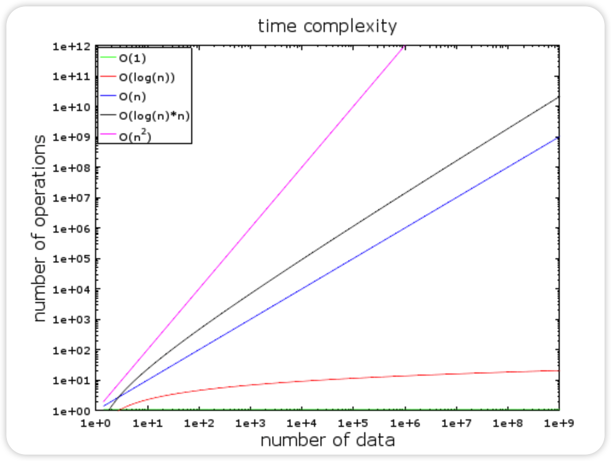

# 数据库基础与理论

## 关系型数据库

### 关系型数据库是如何工作的

#### 数据结构

##### 时间复杂度

> 时间复杂度描述某个算法在处理一定数据量的数据所要花费的时间，时间复杂度并不会给出确切的运算次数，而是一种理念。

- 绿：O(1)或者叫常数阶复杂度，保持为常数（要不人家就不会叫常数阶复杂度了）。
- 红：O(log(n))对数阶复杂度，即使在十亿级数据量时也很低。
- 粉：最糟糕的复杂度是 O(n^2)，平方阶复杂度，运算数快速膨胀。
- 黑和蓝：另外两种复杂度（的运算数也是）快速增长。

如果要处理2000条元素：

- O(1) 算法会消耗 1 次运算
- O(log(n)) 算法会消耗 7 次运算
- O(n) 算法会消耗 2000 次运算
- O(n*log(n)) 算法会消耗 14,000 次运算
- O(n^2) 算法会消耗 4,000,000 次运算

##### 归并排序

##### 二叉搜索树

##### B+树

##### 哈希表

