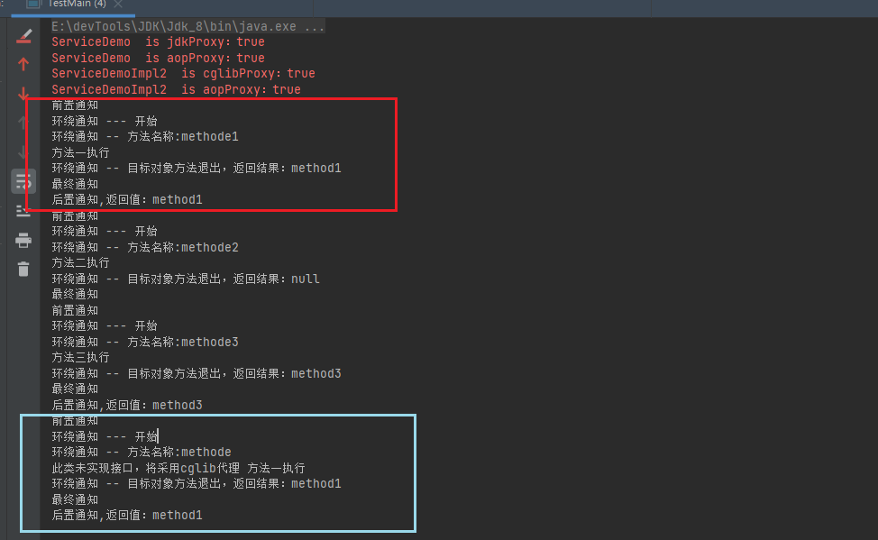
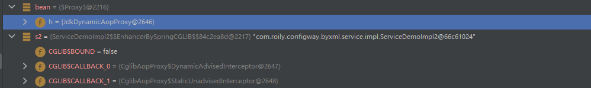
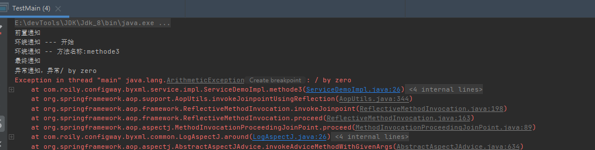
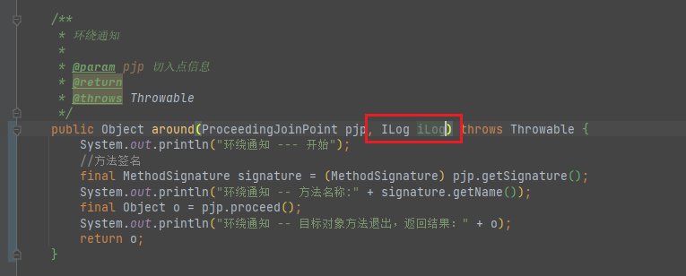
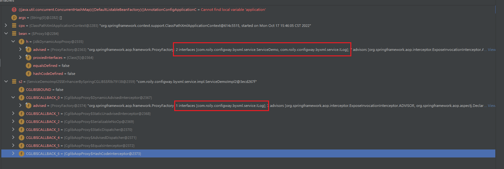
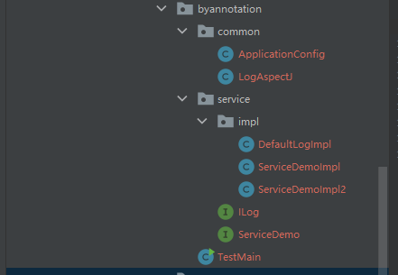
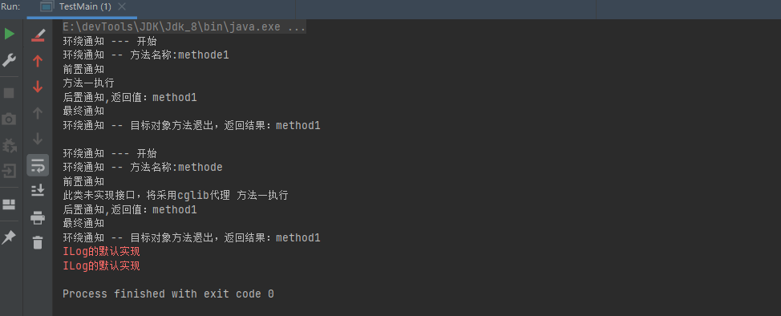
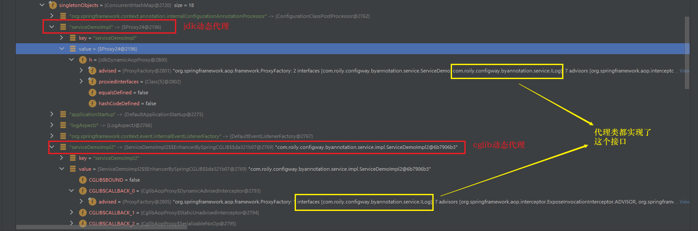
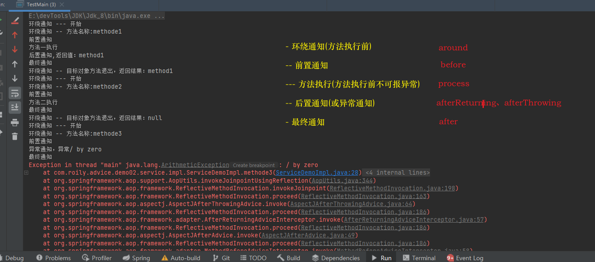
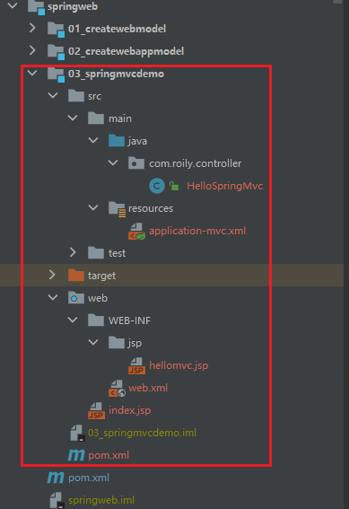

## Spring


### Spring基础


官网：

[Spring官网](https://docs.spring.io/spring-framework/docs/current/reference/html/index.html)

[Gihup源码](https://github.com/spring-projects/spring-framework)

[Spring  DOC](https://docs.spring.io/spring-framework/docs/)


#### 目的

> 此前企业会使用的技术:EJB(Enterprise Java Beans)，复杂、效率低，效率低体现在调用(涉及远程调用、使用EJB封装业务逻辑业务低)、代码重用性低。
>
> Spring的一个最大的目的就是使Java EE 开发更加容易，并且Spring是一个及易扩展的框架，可以很容易集成其他组件。

#### 特点

- 非侵入式：

  > 使用Spring开发的应用中的对象可以不依赖于Spring的Api。Spring这类的非侵入式框架都是使用反射＋代理来实现对象的创建和实例化。

- 控制反转：

  > IOC -  Inversion Of   Controller。
  >
  > 对象的创建由客户端主动New反转为由Spring创建，对象的生命周期由Spring控制。

- 依赖注入：

  > DI  -  Dependency Injection
  >
  > 某个Bean所依赖的对象(组合进来的对象)，无需手动setXXX()，而是由Spring配置自动注入。

- 面向切面编程：

  > AOP - Aspect Oriented Programming
  >
  > 可降低耦合，核心1就是反射＋代理

- 容器思想：

  > Spring就是一个Bean容器，负责Bean的创建和生命周期的管理。
  >
  > 将用得到的Bean放入容器，在需要使用的时候往Spring容器中去取。

- 组件：

  > Spring的扩展性很好，只需要简单配置就可以以组件的形式将组件整合进来。

- 一站式：

  > Spring生态完备，同时在IOC、AOP的基础上可整合任意企业级组件和第三方类库，可一站式开发应用

  

#### 优点

- 按需注册，Spring只会安需组测需要的Bean对象到SpringIOC容器中，而忽略不需要的Bean。
- 生态完备，且扩展性优秀。Spring可完美整合优秀框架，比如ORM框架、日志框架等
- 测试简单，只需简单注解即可完成测试
- Spring除了IOC、AOP技术外，还提供一套模式思想，即MVC模式，使得代码可实现松耦合、高内聚。
- 对于一些复杂且逻辑相似的操作提供封装API，使得开发者使用起来非常容易。比如JavaMail、JDBC、远程调用等。
- 轻量级、高效。更加高效利用CPU和内存资源。与EJB对比更能体现


### Spring各个模块

> Spring生态体系非常完善，由许多模块组成。

#### Core

> Core包含了Spring框架的基础部分。

包括：

- Beans 模块  包括IOC 和DI
- Core   核心模块，封装Spring底层实现，包括资源访问、类型转化以及一些常用工具类
- Context  上下文模块
- SPEL    支持强大的表达式语言

#### Data  Access

> 数据访问集成。

- Transaction   事务管理：支持编程式事务和响应式事务
- JDBC：提供统一数据库连接规范，并且易于Spring接管事务
- ORM，Object Relation Mapper，自动关系映射，可无缝集成市面上主流ORM框架
- OXM：提供Object/XML映射实现
- JMS：java消息服务

#### Web

- Web
- Servlet    
- WebSocket   通讯
- Webflux   新型响应式web框架

#### Test

> 测试模块。
>
> 支持Junit和TestNG，方便测试。

### Spring  HelloWorld

> Spring框架简单使用

#### HelloWorld

- 创建一个maven模块

- 引入Spring依赖

  > Spring-context 依赖Spring-beans、Spring-core、Spring-aop，此demo只引入Spring-context足矣。

  ```xml
  <!-- spring-context -->
  <dependency>
      <groupId>org.springframework</groupId>
      <artifactId>spring-context</artifactId>
      <version>${spring.context.version}</version>
  </dependency>
  <spring.context.version>5.3.23</spring.context.version>
  ```

- 实体类User

  > 需要引入Lombok

  ```java
  @Data
  @AllArgsConstructor
  public class User {
      String name;
      String email;
  }
  ```

- 配置Spring配置文件

  > Spring配置文件模板可从网上拷贝，[官网也有模板](https://docs.spring.io/spring-framework/docs/current/reference/html/core.html#spring-core)。
  >
  > 根标签是一个`<Beans>`可见这就是一个Bean容器，文件由命名空间和具体Bean组成

  ```xml
  <?xml version="1.0" encoding="UTF-8"?>
  <beans xmlns="http://www.springframework.org/schema/beans"
         xmlns:xsi="http://www.w3.org/2001/XMLSchema-instance"
         xsi:schemaLocation="http://www.springframework.org/schema/beans http://www.springframework.org/schema/beans/spring-beans.xsd">
      <bean id="user" class="com.roily.entity.User" scope="singleton">
          <constructor-arg type="java.lang.String" name="name" value="yuyuc"/>
          <constructor-arg type="java.lang.String" name="email" value="emali"/>
      </bean>
  </beans>
  ```
  
- 测试

  > 这里使用配置文件的方式配置Spring，通过BeanFactory的子类之一ClassPatchXmlApplicationContext加载Spring配置文件，将Bean注册到Spring容器中。

  

  ```java
  public class demo {
      public static void main(String[] args) {
          final ApplicationContext classPathXmlApplicationContext = new ClassPathXmlApplicationContext("application.xml");
          final User user = classPathXmlApplicationContext.getBean("user", User.class);
          System.out.println(user);
      }
  }
  ```

   

#### 加入mybatis和AOP

> 在以上基础上加入mybatis和AOP。
>
> Spring是一个容器，需要任何组件(组件用于实现某种功能)，直接往容器中注册即可。

##### 依赖

```xml
<!--  mysql      -->
<dependency>
    <groupId>mysql</groupId>
    <artifactId>mysql-connector-java</artifactId>
</dependency>
<!--   mybatis  -->
<dependency>
    <groupId>org.mybatis</groupId>
    <artifactId>mybatis</artifactId>
</dependency>

<dependency>
    <groupId>org.mybatis</groupId>
    <artifactId>mybatis-spring</artifactId>
    <version>2.0.6</version>
</dependency>
<dependency>
    <groupId>org.springframework</groupId>
    <artifactId>spring-jdbc</artifactId>
    <version>5.3.12</version>
</dependency>
<dependency>
    <groupId>org.aspectj</groupId>
    <artifactId>aspectjweaver</artifactId>
</dependency>
```

##### 配置

- 数据库配置db.properties

  ```properties
  driver=com.mysql.cj.jdbc.Driver
  url=jdbc:mysql://localhost:3306/mybatis?useUnicode=true;characterEncoding=utf8;useSSL=true
  user=root
  password=123456
  ```

- mybatis配置

  > 配置日志和别名即可，其他放入spring中配置。
  >
  > [mybatis配置文件模板](https://mybatis.org/mybatis-3/zh/getting-started.html)

  ```xml
  <?xml version="1.0" encoding="UTF-8" ?>
  <!DOCTYPE configuration
          PUBLIC "-//mybatis.org//DTD Config 3.0//EN"
          "http://mybatis.org/dtd/mybatis-3-config.dtd">
  <configuration>
      <!--  日志配置和二级缓存  -->
      <settings>
          <setting name="logImpl" value="STDOUT_LOGGING"/>
          <setting name="cacheEnabled" value="true"/>
      </settings>
      <!--  别名配置，默认类名小写  -->
      <typeAliases>
          <package name="com.roily.entity"/>
      </typeAliases>
  </configuration>
  ```

- Spring-dao配置

  > 包括数据源、Sqlsessionfactory和Sqlsession、mapper等

  ```xml
  <!--  引入外部配置文件  -->
  <context:property-placeholder location="db.properties"/>
  <!--    &lt;!&ndash;  注册数据源  &ndash;&gt;-->
  <bean id="dataSource" class="org.springframework.jdbc.datasource.DriverManagerDataSource">
  	   <property name="driverClassName" value="${driver}"/>
          <property name="url" value="${url}"/>
          <property name="username" value="${user}"/>
          <property name="password" value="${password}"/>
  </bean>
  
  <!--  注册SqlSessionFactory,指定mybatis配置和mapper路径  -->
  <bean id="sqlSessionFactory" class="org.mybatis.spring.SqlSessionFactoryBean">
      <property name="dataSource" ref="dataSource"/>
      <property name="configLocation" value="classpath:mybatis-config.xml"/>
      <property name="mapperLocations" value="classpath:mapper/UserMapper.xml"/>
  </bean>
  
  <!--  组测sqlSession,构造器注入,注意必须构造器注入，没有set注入-->
  <bean id="sqlSession" class="org.mybatis.spring.SqlSessionTemplate">
      <constructor-arg name="sqlSessionFactory" ref="sqlSessionFactory"/>
  </bean>
  
  <!--    扫描mapper -->
  <bean class="org.mybatis.spring.mapper.MapperScannerConfigurer">
      <property name="sqlSessionFactoryBeanName" value="sqlSessionFactory"/>
      <property name="basePackage" value="com.roily.mapper"/>
  </bean>
  ```
  
- Application。xml

  > Spring整合配置

  ```xml
  <aop:aspectj-autoproxy/>
  <!--    引入外部配置  -->
  <import resource="classpath:spring-dao.xml"/>
  <bean id="userServiceImpl" class="com.roily.service.impl.UserServiceImpl">
      <property name="userMapper" ref="userMapper"/>
  </bean>
  <bean id="logAspectj" class="com.roily.common.aop.LogAspect">
  </bean>
  ```

##### dao & service

> 类

UserMapper  &  UserService  & Mapper  Xml

```java
public interface UserMapper {
    List<User> getAll();
}
```

```xml
<?xml version="1.0" encoding="UTF-8"?>
<!DOCTYPE mapper
        PUBLIC "-//mybatis.org//DTD Mapper 3.0//EN"
        "http://mybatis.org/dtd/mybatis-3-mapper.dtd">
<mapper namespace="com.roily.mapper.UserMapper">
    <select id="getAll" resultType="user">
        select name, email
        from user
    </select>

</mapper>
```

> 注意Lombok会为我们自动加上setter方法

```java
public interface UserService {
    List<User> getAll();
}
@Data
public class UserServiceImpl  implements UserService {
    private UserMapper userMapper;
    @Override
    public List<User> getAll() {
        return userMapper.getAll();
    }
}
```

##### Aspect

> 定义切面和切入点

```java
@Aspect
public class LogAspect {
    /**
     * 任意返回值
     * com.roily.service包下任意方法  （。。）代表任意参数的方法
     */
    @Pointcut("execution(* com.roily.service.*.*(..))")
    public void pointCut() {
    }
    @Around("pointCut()")
    public Object logAspect(ProceedingJoinPoint proceedingJoinPoint) throws Throwable {
        final MethodSignature signature = (MethodSignature)proceedingJoinPoint.getSignature();
        final Method method = signature.getMethod();
        System.out.println("===================================");
        System.out.println("方法名=>"+method.getName());
        System.out.println("方法参数=>");
        Arrays.asList(method.getParameters()).forEach(System.out::print);
        System.out.println("执行中。。。。。");
        final Object proceed = proceedingJoinPoint.proceed();
        System.out.println("执行结束。。。。。");
        System.out.println("===================================");
        return proceed;
    }
}
```

##### 测试

> 可顺利执行，且切面起了作用

```java
public static void main(String[] args) {
    final ApplicationContext applicationContext = new ClassPathXmlApplicationContext("applicationContext.xml");
    final UserService userService = applicationContext.getBean("userServiceImpl", UserService.class);
    final List<User> all = userService.getAll();
    System.out.println(all);
}
```


##### 整体结构


#### 结

> 以上例子做小结。Spring的作用。

##### IOC

> 控制反转。
>
> 没有Spring框架，我们需要手动new对象来使用，对象的创建和使用强依赖。现在有了Spring框架，对象的创建交由Spring管理，当我们需要使用某个类时，则去容器中拿取即可。如此简化开发，对象的创建和使用也分离开来。

- 控制反转-控制什么？控制Bean的创建和使用。什么反转了？Bean的创建由用户反转为Spring。这就是IOC(Inversion of controler)
- Spring创建的bean放在哪里？  IOC  Container
- 配置Spring有哪些方式？ xml配置文件、javaConfig和注解配置
- bean从Spring  IOC  Container  中获取依赖，注入到当前bean中，此过程叫做依赖注入-DI(Dependency  injection )
- 依赖注入的方式（构造器注入、Set注入）
- @Autowrite  @Resource  @inject

##### AOP

> 在以上例子中我们定义了一个切面LogAspect，切入点设置为所有的service下的方法，以此我们避免在每一个Service中都打印日志的操作，本质上是一个解耦的操作。
>
> Spring的Aop模块使用的是动态代理，通过代理对象对原方法进行增强，使用Aop可避免大量侵入式扩展操作。 

- AOP(Aspect Oriented Programming)，Spring可将重复业务抽象出来定义为切面，实现程序的解耦，提高代码复用

- @Aspect是aspectj下的注解，Spring认可并为其提供兼容方案
- 丰富的拦截方式，@around  @before  @after @afterThrowing @afterReturing等
- Aop使用的是代理技术

#### JavaConfig

> Spring的配置方式除了xml配置文件之外，还有JavaConfig方式。
>
> xml配置文件配置过于繁琐，以上例子就有感觉，如果项目较大，配置繁琐。JavaConfig使用对程序员友好的方式来简化配置，但是大量使用JavaConfig也会使得代码可读性较差。

以上例子bean、service、mapper和aspct不用动，只使用JavaConfig来代替application.xml。

- 数据库配置，使用Properties工具，需要注意的是DriverManagerDataSource对于Properties的键值有一定要求。分别是url、username、password。或者使用DriverManagerDataSource(String,String,String)这个重载构造函数
- 注册DriverManagerDataSource
- 注册SqlsessionFactoryBean
- 注册SqlSessionTemplate
- 注册UserMapper、UserService以及LogAspect

```java
@EnableAspectJAutoProxy//aop,支持代理类
@Configuration//声明此类为配置类
public class ApplicationConfig {
    
    /**
     * 数据库配置
     *
     * @return
     */
    @Bean("jdbcProperties")
    public Properties jdbcProperties() {
        final InputStream in = ApplicationConfig.class.getClassLoader().getResourceAsStream("db.properties");
        final Properties properties = new Properties();
        try {
            properties.load(in);
        } catch (IOException e) {
            e.printStackTrace();
        }
        return properties;
    }

    @Bean("dataSource")
    public DataSource driverManagerDataSource(Properties jdbcProperties) {
        return new DriverManagerDataSource(jdbcProperties.getProperty("url"), jdbcProperties);
    }

    @Bean("sqlSessionFactory")
    public SqlSessionFactoryBean sqlSessionFactory(DataSource dataSource) throws IOException {
        final SqlSessionFactoryBean sqlSessionFactoryBean = new SqlSessionFactoryBean();
        PathMatchingResourcePatternResolver resolver = new PathMatchingResourcePatternResolver();
        sqlSessionFactoryBean.setDataSource(dataSource);
        sqlSessionFactoryBean.setConfigLocation(resolver.getResource("classpath:mybatis-config.xml"));
        sqlSessionFactoryBean.setMapperLocations(resolver.getResources("classpath:mapper/*.xml"));
        return sqlSessionFactoryBean;
    }

    @Bean("sqlSession")
    public SqlSession sqlSession(SqlSessionFactory sqlSessionFactory) {
        return new SqlSessionTemplate(sqlSessionFactory);
    }

    @Bean("userMapper")
    public UserMapper userMapper(SqlSession sqlSession) {
        return sqlSession.getMapper(UserMapper.class);
    }

    @Bean("userService")
    public UserService userService(UserMapper userMapper) {
        final UserServiceImpl userService = new UserServiceImpl();
        userService.setUserMapper(userMapper);
        return userService;
    }

    @Bean("logAspect")
    public LogAspect logAspect() {
        return new LogAspect();
    }
}
```

测试：

> 也可以达到同样的效果

```java
final AnnotationConfigApplicationContext ac = new AnnotationConfigApplicationContext(ApplicationConfig.class);
final UserService userService = ac.getBean("userService", UserService.class);
final List<User> all = userService.getAll();
System.out.println(all);
```

#### 注解+扫描

> 通过注解加扫描的机制改进以上代码

对ApplicationConfig稍作修改，数据源、sqlSession等不做改动，修改Mapper、service、Aspect：

- 给UserMapper加上@Mapper注解

  ```java
  @Mapper
  public interface UserMapper {
      List<User> getAll();
  }
  ```

- 给UserServiceImpl加上@service注解，并且在usermapper上加上@Autowrite注入注解

  ```java
  @Service
  @Data
  public class UserServiceImpl  implements UserService {
      @Autowired
      private UserMapper userMapper;
      @Override
      public List<User> getAll() {
          return userMapper.getAll();
      }
  }
  ```

- 给LogAspect加上@Component注解

  ```java
  @Aspect
  @Component
  public class LogAspect {}
  ```

- javaconfig配置，保留数据源等配置，添加组件扫描和mapper扫描注解

  ```java
  @EnableAspectJAutoProxy//aop,支持代理类
  @Configuration//声明此类为配置类
  @ComponentScan(basePackages = "com.roily")
  @MapperScan(basePackages = "com.roily.mapper")
  public class ApplicationASConfig {
  
      /**
       * 数据库配置
       *
       * @return
       */
      @Bean("jdbcProperties")
      public Properties jdbcProperties() {
          final InputStream in = ApplicationASConfig.class.getClassLoader().getResourceAsStream("db.properties");
          final Properties properties = new Properties();
          try {
              properties.load(in);
          } catch (IOException e) {
              e.printStackTrace();
          }
          return properties;
      }
  
      @Bean("dataSource")
      public DataSource driverManagerDataSource(Properties jdbcProperties) {
          return new DriverManagerDataSource(jdbcProperties.getProperty("url"), jdbcProperties);
      }
  
      @Bean("sqlSessionFactory")
      public SqlSessionFactoryBean sqlSessionFactory(DataSource dataSource) throws IOException {
  
          final SqlSessionFactoryBean sqlSessionFactoryBean = new SqlSessionFactoryBean();
          PathMatchingResourcePatternResolver resolver = new PathMatchingResourcePatternResolver();
          sqlSessionFactoryBean.setDataSource(dataSource);
          sqlSessionFactoryBean.setConfigLocation(resolver.getResource("classpath:mybatis-config.xml"));
          sqlSessionFactoryBean.setMapperLocations(resolver.getResources("classpath:mapper/*.xml"));
          return sqlSessionFactoryBean;
      }
  
      @Bean("sqlSession")
      public SqlSession sqlSession(SqlSessionFactory sqlSessionFactory) {
          return new SqlSessionTemplate(sqlSessionFactory);
      }
     
  }
  ```

### IOC容器配置方式

> IOC容器配置的三种方式及优缺点

- XML文件配置，通过命名空间和`<bean>`标签配置bean

  > 适用于任何场景，易于理解
  >
  > 项目大的话，配置非常繁琐

- JavaConfig

  > 使用JavaConfig代替xml，使用@Bean代替`<bean>`标签
  >
  > 存java代码配置，扩展性好，易于理解
  >
  > 配置多的话，可读性较差

- 注解+扫描

  > 这是目前常用的方式
  >
  > 简洁、易懂，按约定配置后期项目易于维护
  >
  > 存在局限性，对于不兼容组件，需要配合xml配置


### 为何推荐构造器注入？

> 这里推荐使用构造器注入，为何？

构造器注入能够保证所注入的组件不可变，并确保需要的依赖不为空，并且注册进IOC容器的时候保证完全初始化状态。

- 所注入组件不可变：使用final修饰构造器中的参数
- 依赖不为空：使用构造器注入，避免无参构造，构造方法参数从IOC容器中取。取得到ok，取不到报错
- 完全初始化状态：使用构造器注入，能够保证，父类、成员变量等都已经初始化过了，最后才执行对应构造方法


依赖不为空：

> set注入在编译的时候并不会检查，即便依赖项为空，也只能在真正使用的时候才会暴露出来。
>
> 如下依赖项为空在调用的时候，会报空指针

```java
<!--    <bean id="userDao" class="com.roily.dao.UserDao"/>-->
<bean id="userService" class="com.roily.service.UserService" autowire="byName">
</bean>
```


循环依赖问题：

> set注入会导致循环依赖问题：

```java
public class Component1 {
    @Autowired
    Component2 component2;
    public void method() {
        component2.method();
    }
    setter
}
public class Component2 {
    @Autowired
    Component1 component1;
    public void method() {
        component1.method();
    }
    setter（）
}
```

```xml
<bean id="component1" class="com.roily.entity.Component1">
    <property name="component2" ref="component2"/>
</bean>
<bean id="component2" class="com.roily.entity.Component2">
    <property name="component1" ref="component1"/>
</bean>
```

测试：会报错，java.lang.StackOverflowError

```JAVA
@Test
public void testAutoWritexx() {

    final ApplicationContext cpx = new ClassPathXmlApplicationContext("application.xml");
    final Component1 bean1 = cpx
            .getBean(Component1.class);
    bean1.method();

}
```

> 采用构造器注入的话，会立刻会报错，提示出来  org.springframework.beans.factory.BeanCurrentlyInCreationException

```java
public class Component1 {
    Component2 component2;
    @Autowired
    public Component1(final Component2 component2) {
        this.component2 = component2;
    }
    public void method() {
        component2.method();
    }
}
。。。。Component2同
```

### 控制反转(IOC)

- 控制反转-控制什么？控制Bean的创建和使用。什么反转了？Bean的创建由用户反转为Spring。这就是IOC(Inversion of controler)
- Spring创建的bean放在哪里？  IOC  Container
- 配置Spring有哪些方式？ xml配置文件、javaConfig和注解配置
- bean从Spring  IOC  Container  中获取依赖，注入到当前bean中，此过程叫做依赖注入-DI(Dependency  injection )
- 依赖注入的方式（构造器注入、Set注入）
- @Autowrite  @Resource  @inject

#### IOC理解

##### Spring Bean是什么？

> Spring的Bean可以认为就是组件，这个组件用于实现某个功能，需要某个功能就注册某个组件。
>
> Spring为我们提供了简洁方法来调用组件。


##### ioc & Di关系

> ioc（控制反转）是一种程序设计思想，指导程序设计，DI(依赖注入)是ioc实现方式。
>
> bean从Spring  IOC  Container  中获取依赖，注入到当前bean中，此过程叫做依赖注入-DI(Dependency  injection )。


#### IOC

> Inversion Of  Control，控制反转，不是技术，而是一种设计思想。在Spring中IOC体现于，对象的创建和管理交由IOC  Contailer，而不是传统的由程序控制。IOC也遵循面向对象法则，可以指导我们设计出松耦合的程序。

##### 控制反转

- 控制什么？

  > 控制Bean的创建和生命周期的管理

- 反转？

  > 一开始Bean的创建由程序控制，现有Spring框架，对象的创建和控制权反转到IOC容器

- 依赖注入？

  > IOC是一种设计思想，指导我们设计程序，依赖注入(DI)就是IOC的具体实现方式。
  >
  > 依赖注入指的是某个Bean的创建可从Spring容器中获取依赖的其他Bean，此过程称为依赖注入。依赖注入的方式：构造器注入、setter注入。

##### 配置Spring的三种方式

> Spring的配置方式有三种：①xml  ②javaconfig   ③注解配置

###### xml配置

- 结构：


- 代码：

```java
public class DaoComponent {
    String value;
}
public class ServiceComponent {
    DaoComponent daoComponent;
    //setter注入必须存在对应setter方法
    public void setDaoComponent(DaoComponent daoComponent) {
        this.daoComponent = daoComponent;
    }
}
public class ServiceComponent2 {
    DaoComponent daoComponent;
    //构造器注入必须存在参数一致的构造方法
    public ServiceComponent2(DaoComponent daoComponent) {
        this.daoComponent = daoComponent;
    }
}
```

- xml配置：

引入Beans命名空间即可

```xml
<?xml version="1.0" encoding="UTF-8"?>
<beans xmlns="http://www.springframework.org/schema/beans"
       xmlns:xsi="http://www.w3.org/2001/XMLSchema-instance"
       xmlns:context="http://www.springframework.org/schema/context"
       xsi:schemaLocation="http://www.springframework.org/schema/beans
    http://www.springframework.org/schema/beans/spring-beans.xsd
    http://www.springframework.org/schema/context
    https://www.springframework.org/schema/context/spring-context.xsd">

    <bean id="daoDemo01" class="com.roily.springioc.xmlconfig.DaoComponent"/>

    <bean id="daoDemo02" class="com.roily.springioc.xmlconfig.DaoComponent"/>

    <bean id="serviceDemo01" class="com.roily.springioc.xmlconfig.ServiceComponent">
        <!--    setter注入，属性必须存在对应setter方法    -->
        <property name="daoComponent" ref="daoDemo01"/>
    </bean>

    <bean id="serviceDemo2" class="com.roily.springioc.xmlconfig.ServiceComponent2">
        <!--   构造器注入必须存在符合参数参数数量的构造器   -->
        <constructor-arg name="daoComponent" ref="daoDemo01"/>
    </bean>

</beans>
```

- 测试：

debug查看ClassPathXmlApplicationContext的BeanFactory的  singletonObjects属性(IOC Container 中的Bean默认都是单例的)

```java
final ApplicationContext cpx = new ClassPathXmlApplicationContext("classpath:application_xml_config.xml");
```


###### JavaConfig配置

> JavaConfig配置，用JavaConfig代替Xml配置文件

- 结构：


- 代码：

用JavaConfig代替Xml

```java
public class JavaConfig {

    @Bean("daoComponent1")
    public DaoComponent daoComponent() {
        return new DaoComponent();
    }

    @Bean("daoComponent2")
    public DaoComponent daoComponentX() {
        return new DaoComponent();
    }

    @Bean("serviceComponent")
    public ServiceComponent serviceComponent(@Autowired @Qualifier("daoComponent1") DaoComponent daoComponent) {
        final ServiceComponent serviceComponent = new ServiceComponent();
        serviceComponent.setDaoComponent(daoComponent);
        return serviceComponent;
    }
}
```

- 测试:

debug查看

```java
@Test
public void test01(){
    final ApplicationContext ac = new AnnotationConfigApplicationContext(JavaConfig.class);
    System.out.println();
}
```


###### 注解自动配置

结构：


代码：添加注解

```java
@Component
public class DaoComponent {
    String value;
}
@Service(value = "xxxx")//可自定义组件名称
public class ServiceComponent {
    DaoComponent daoComponent;
    @Autowired
    @Qualifier("daoComponent")
    public void setDaoComponent(DaoComponent daoComponent) {
        this.daoComponent = daoComponent;
    }
}
@Service
public class ServiceComponent2 {
    DaoComponent daoComponent;
    //注解配置，构造器注入，无需显示注入
    //注入过程：首先通过type，如果找到多个则按参数名注入
    /*@Autowired*/
    public ServiceComponent2(/*@Autowired*/ DaoComponent daoComponent0x) {
        this.daoComponent = daoComponent0x;
    }
}
```

javaconfig：

```java
@Configuration
@ComponentScan(basePackages = "com.roily.springioc.annotationconfig")
public class JavaConfig {
    @Bean(value = "daoComponent0x")
    DaoComponent daoComponent(){
        return new DaoComponent();
    }
}
```

测试：

debug查看

```java
@Test
public void test1() {
    final ApplicationContext ac = new AnnotationConfigApplicationContext(JavaConfig.class);
    System.out.println();
}
```


##### 依赖注入的三种方式

> 依赖注入的三种方式。

- Setter注入
- 构造器注入（Construct）
- 基于注解自动注入

###### Setter注入

> xml配置方式，属性中使用`<property>`标签初始化属性的都是Setter注入。

setter注入本质上是会首先调用无参构造方法生产一个Bean，再通过set方法将属性注入。

所以使用set注入的Bean必须拥有无参构造方法，属性必须存在对应setter方法。

例：

```java
public class User {

    String name;

    public User() {
        System.out.println("User   init");
    }

    public void setName(String name) {
        this.name = name;
        System.out.println("seName");
    }

    @Override
    public String toString() {
        return "User{" +
                "name='" + name + '\'' +
                '}';
    }
}
```

```xml
<bean id="user" name="userAlias" class="com.roily.entity.User">
    <property name="name" value="yuyc"/>
</bean>
```

> 对应的Java Config配置方式为：

实体类添加@AutoWrited

```java
public class User {
    String name;
    public User() {
        System.out.println("User   init");
    }

    @Autowired
    public void setName(String name) {
        this.name = name;
        System.out.println("seName");
    }
}
```

注入bean

```java
public class SetterConfig {

    @Bean
    String name(){
        return "name";
    }

    @Bean
    User user(){
        return new User();
    }

}
```


###### 构造器注入

> 使用`constructor-arg`标签的都是构造器注入。

使用`<constructor-arg>`本质上是调用Person(String name, String age, String email)构造器，构造方法参数数量必须匹配。

例：

```java
public class Person {

    String name;
    String age;
    String email;

    public Person(String name, String age, String email) {
        this.name = name;
        this.age = age;
        this.email = email;
    }

    @Override
    public String toString() {
        return "Person{" +
                "name='" + name + '\'' +
                ", age='" + age + '\'' +
                ", email='" + email + '\'' +
                '}';
    }
}
```

```xml
<bean id="person" class="com.roily.entity.Person">
    <constructor-arg name="age" value="1"/>
    <constructor-arg name="name" value="1"/>
    <constructor-arg name="email" value="1"/>
</bean>
```

> 对应的javaConfig

```java
public class ConstructorConfig {
    @Bean
    String name(){
        return "name";
    }
    @Bean
    String age(){
        return "age";
    }
    @Bean
    String email(){
        return "email";
    }
    @Bean
    Person person(String name, String age, String email){
        return new Person(name,age,email);
    }
}
```


###### 注解注入

> 使用注解注入。xml+注解或JavaConfig+注解

**Xml+ 注解**

以下演示的是setter方式，构造器方式同理

```java
public class DaoDemo {
    String value;
    public void setValue(String value) {
        this.value = value;
    }
}
public class ServiceDemo {
    DaoDemo daoDemo;
    @Autowired
    public void setDaoDemo(DaoDemo daoDemo) {
        this.daoDemo = daoDemo;
    }
}
```

xml配置文件：

```xml
<!--  如果想要注解生效必须设置此标签，并在此之前引入对应的命名空间  -->
<context:component-scan base-package="com.roily.injectway.annotation.xmlannotation"/>
<bean id="daoDemo" class="com.roily.injectway.annotation.xmlannotation.DaoDemo">
    <property name="value" value="123"/>
</bean>
<!--  此处设置autowire service不用添加注解 -->
<bean id="serviceDemo" class="com.roily.injectway.annotation.xmlannotation.ServiceDemo">
</bean>
```

*还有一种配置方式是这样的：不用扫描注解在组件标签内设置autowire属性即可*

```java
public class DaoDemo {
    String value;
    public void setValue(String value) {
        this.value = value;
    }
}
public class ServiceDemo {
    DaoDemo daoDemo;
    public void setDaoDemo(DaoDemo daoDemo) {
        this.daoDemo = daoDemo;
    }
}
```

```xml
<bean id="daoDemo" class="com.roily.injectway.annotation.xmlannotation.DaoDemo">
    <property name="value" value="123"/>
</bean>
<!--  此处设置autowire service不用添加注解 -->
<bean id="serviceDemo" class="com.roily.injectway.annotation.xmlannotation.ServiceDemo" autowire="byType">

</bean>
```


**JavaConfig + 注解**

```java
@Component
public class DaoDemo2 {
    String value;
    @Autowired
    public void setValue(String value) {
        this.value = value;
    }
}
@Component
public class ServiceDemo2 {
    DaoDemo2 daoDemo;
    @Autowired
    public void setDaoDemo(DaoDemo2 daoDemo) {
        this.daoDemo = daoDemo;
    }
}
```

```java
@ComponentScan(basePackages = "com.roily.injectway.annotation.javaconfigannotation.p3")
public class JavaConfig2 {
    @Bean
    String value() {
        return "value";
    }
}
```

**当然也可以去掉ComponentScan**

```java
public class DaoDemo2 {
    String value;
    @Autowired
    public void setValue(String value) {
        this.value = value;
    }
}
public class ServiceDemo2 {
    DaoDemo2 daoDemo;
    @Autowired
    public void setDaoDemo(DaoDemo2 daoDemo) {
        this.daoDemo = daoDemo;
    }
}
```

```java
public class JavaConfig2 {
    @Bean
    String value() {
        return "value";
    }
    @Bean
    DaoDemo2 daoDemo() {
        return new DaoDemo2();
    }
    @Bean
    ServiceDemo2 serviceDemo() {
        return new ServiceDemo2();
    }
}
```


##### @Autowire&@Resource@inject


###### @Autowrite

- @AutoWired为SpringFrameWork包下的注解

- @Autowrite可以放在，构造器、方法·、参数、属性、接口

  ElementType.CONSTRUCTOR, ElementType.METHOD, ElementType.PARAMETER, ElementType.FIELD, ElementType.ANNOTATION_TYPE

- 有一个require属性

  require默认为true，当待注入组件为空时报错

- @AutoWired默认按照类型注入，如果存在多个同类型不同名称的bean，则会报错

- 如果需要指定Bean则需要配合@Qulifile注解


例一：demo搭建

```java
@Component
public class DaoComponent {
    String value;
    @Autowired
    public DaoComponent(String value) {
        this.value = value;
    }
}
@Component
public class ServiceComponent {
    DaoComponent daoComponent;
    //@Autowired可以省略
    public ServiceComponent(DaoComponent daoComponent) {
        this.daoComponent = daoComponent;
    }
}
@ComponentScan(value = "com.roily.autowriteresourceinject.autowrite.bytype")
public class JavaConfig {
    @Bean("value")
    String value(){
        return "value";
    }
}
//debug  测试
public class TestMain {
    public static void main(String[] args) {
        final ApplicationContext acp = new AnnotationConfigApplicationContext(JavaConfig.class);
        System.out.println();
    }
}
```


例二：require属性测试

将JavaConfig的@Bean("value")注释掉，因为@Autowired的reauire属性默认为true，所以会报错


将@Autowrite(require = false)，则不会报错。一般来说不会设置此参数，会有空指针异常风险

```java
public DaoComponent(@Autowired(required = false) String value) {
    this.value = value;
}
```


例三：@Autowired通过类型注入

我们只需简单修改JavaConfig即可：

```java
@Bean("value1")
String value1(){
    return "value1";
}
@Bean("value2")
String value2(){
    return "value2";
}
```

会报错：


注：@Autowired首先通过类型注入，存在多个同名bean，则会匹配字段名对应的那个bean，匹配不到则报错。   通过JavaConfig注入的Bean名称默认就是方法名称，这也是为什么JavaConfig中方法名尽量和bean名称一样。


例四：指定注入Bean，@Qulifile

只需配合@Qulifile注解指定注入bean名称即可

```java
public DaoComponent(@Autowired(required = false) @Qualifier("value1") String value) {
    this.value = value;
}
```

###### @Resource

- `javax.annotation.Resource`,它属于**JSR-250**规范的一个注解，Spring提供了对该注解的支持。
- 可放在属性和方法上
- 属性注入过程
  - 设置了name属性，优先通过byname的方式去找bean，没有找到则使用bytype的方式去找bean
  - 没有设置name属性，优先通过byname的方式去找bean，此时nam属性为字段名称或setter方法名称，没有找到则使用bytype的方式去找bean

@resource源码

```java
@Target({TYPE, FIELD, METHOD})
@Retention(RUNTIME)
public @interface Resource 
String name() default "";
```

例一：

这里会根据字段名daoComponent1去找bean

```java
public class DaoComponent1 {
}
@Component
public class ServiceComponent {
    private DaoComponent1 daoComponent1;
    @Resource
    public void setDaoComponent1(DaoComponent1 daoComponent1) {
        this.daoComponent1 = daoComponent1;
    }
}
@ComponentScan(value = "com.roily.autowriteresourceinject.resource")
public class JavaConfig {
    @Bean
    DaoComponent1 daoComponent1() {
        return new DaoComponent1();
    }
}
```

例二：测试@Resource会根据字段名找bean

```java
public class DaoComponent1 {
}
public class DaoComponent2 {
}
@Component
public class ServiceComponent {
    private com.roily.autowriteresourceinject.resource.DaoComponent1 daoComponent1;
    @Resource
    public void setDaoComponent1(DaoComponent1 daoComponent1) {
        this.daoComponent1 = daoComponent1;
    }
}
@ComponentScan(value = "com.roily.autowriteresourceinject.resource.byfieldname")
public class JavaConfig2 {
    @Bean("daoComponent1alias")
    DaoComponent1 daoComponent1() {
        return new DaoComponent1();
    }
    @Bean("daoComponent1")
    DaoComponent2 daoComponent2() {
        return new DaoComponent2();
    }
}
public static void main(String[] args) {
    final ApplicationContext acp = new AnnotationConfigApplicationContext(JavaConfig2.class);
    System.out.println();
}
```


例三：上例若想不报错，只需注掉被匹配的bean即可。也就是若匹配不到则会通过类型去匹配

```java
//优先通过fieldname匹配，匹配到发现类型不对，如果将此处注掉则不会报错
// @Bean("daoComponent1")
DaoComponent2 daoComponent2() {
    return new DaoComponent2();
}
```


###### @Inject

- 从**Spring 3.0**开始，**Spring**提供对**JSR-330**标准注解（依赖注入）的支持。@Inject可以完全被@Autowrite平替，所以没什么用
- 比@Autowrite少了require属性，其他没区别

需要引入依赖：

```xml
<!--   inject     -->
<dependency>
    <groupId>javax.inject</groupId>
    <artifactId>javax.inject</artifactId>
    <version>1</version>
</dependency>
```

例一：

```java
public class DaoComponent1 {
}
@Component
public class ServiceComponent {
    private DaoComponent1 daoComponent1;
    @Inject
    public void setDaoComponent1(DaoComponent1 daoComponent1) {
        this.daoComponent1 = daoComponent1;
    }
}
@ComponentScan(value = "com.roily.autowriteresourceinject.inject.bytype")
public class JavaConfig {
    @Bean
    DaoComponent1 daoComponent1() {
        return new DaoComponent1();
    }
}
public static void main(String[] args) {
    final ApplicationContext acp = new AnnotationConfigApplicationContext(JavaConfig.class);
    System.out.println();
}
```


例二：byname

```java
public class DaoComponent1 {
}
@Component
public class ServiceComponent {
    private DaoComponent1 daoComponent;
    @Inject
    @Named(value = "daoComponent2")
    public void setDaoComponent1(DaoComponent1 daoComponent1) {
        this.daoComponent = daoComponent1;
    }
}

@ComponentScan(value = "com.roily.autowriteresourceinject.inject.byname")
public class JavaConfig {
    @Bean
    DaoComponent1 daoComponent1() {
        return new DaoComponent1();
    }
    @Bean
    DaoComponent1 daoComponent2() {
        return new DaoComponent1();
    }
}
public static void main(String[] args) {
    final ApplicationContext acp = new AnnotationConfigApplicationContext(JavaConfig.class);
    System.out.println();
}
```


##### 注入方式

> byname，bytype，constructor

###### bytype

- 整体结构：


- javaconfig：

```java
@Configuration
@ComponentScan("com.roily.bytype")
public class InjectByTypeConfig {
    //注入名称默认component01
    @Bean
    public Component01 component01(){
        return new Component01();
    }
}
```

- java类：

```java
public class Component01 {
}
@Component
public class Component02 {
    //默认按照类型注入,如果存在多个同类型不同名bean，则会报错
    @Autowired
    Component01 component01;
    /**
     * 通过构造器注入，可以省略@AutoWrite
     * @param component01
     */
    // public Component02(Component01 component01) {
    //     this.component01 = component01;
    // }
}
```

- 测试：

```java
public class DemoMain {

    public static void main(String[] args) {
        final ApplicationContext apc = new AnnotationConfigApplicationContext(InjectByTypeConfig.class);
        System.out.println();
    }

}
```

- 结果：

debug查看：AnnotationConfigApplicationContext ->beanFactory -> singletonObjects


如果存在多个同名bean则会报错：

注：如果存在名为component01的组件则不会报错

```java
@Configuration
@ComponentScan("com.roily.bytype")
public class InjectByTypeConfig {
    //注入名称默认component01
    @Bean("component01aliasX")
    public Component01 component01(){
        return new Component01();
    }
    //注入名称默认component01
    @Bean("component01alias")
    public Component01 component02(){
        return new Component01();
    }
}
```


使用@resource也是一样：

```java
@Component
public class Component03 {
    //默认按照类型注入
    @Resource
    Component01 component01;

    /**
     * 通过构造器注入，可以省略@AutoWrite
     * @param component01
     */
    // public Component02(Component01 component01) {
    //     this.component01 = component01;
    // }
}
```

###### byName

> 如何避免以上情况呢？那就指定组件名称即可

结构：


javaconfig：

```java
@Configuration
@ComponentScan("com.roily.byname")
public class InjectByNameConfig {
    //注入名称默认component01
    @Bean("component01aliasX")
    public Component01 component01(){
        return new Component01();
    }
    //注入名称默认component01
    @Bean("component01alias")
    public Component01 component02(){
        return new Component01();
    }
}
```

java类：

```java
public class Component01 {
}
@Component
public class Component02 {

    //默认按照类型注入,如果存在多个同类型不同名bean，需要配合@Qualifier使用
    @Autowired
    @Qualifier("component01alias")
    Component01 component01;

    /**
     * 通过构造器注入，可以省略@AutoWrite
     * @param component01
     */
    // public Component02(Component01 component01) {
    //     this.component01 = component01;
    // }

}
```

测试：

```java
public static void main(String[] args) {
    final ApplicationContext apc = new AnnotationConfigApplicationContext(InjectByNameConfig.class);
    System.out.println();
}
```

debug查看：


@Resources也是一样：

```java
@Component
public class Component03 {

    //默认按照类型注入,需要指定组件名称则需要配置属性
    @Resource(name = "component01alias")
    Component01 component01;
    /**
     * 通过构造器注入，可以省略@AutoWrite
     * @param component01
     */
    // public Component02(Component01 component01) {
    //     this.component01 = component01;
    // }
}
```

###### constructor

结构：


javaConfig：

```java
@Configuration
@ComponentScan("com.roily.constructor")
public class InjectConstructorConfig {
    //注入名称默认component01
    @Bean("component01aliasX")
    public Component01 component01(){
        return new Component01();
    }
}
```

java类：

```java
@Component
public class Component02 {
    Component01 component01;
    /**
     * 通过构造器注入，可以省略@AutoWrite
     *
     * @param component01
     */
    public Component02(/*@Autowired @Qualifier("component01alias")*/ Component01 component01) {
        this.component01 = component01;
    }
}
```

测试：。。。。

如果存在多个同类型不同名bean则需要指定：也就是上面注掉的部分

```java
@Configuration
@ComponentScan("com.roily.constructor")
public class InjectConstructorConfig {
    //注入名称默认component01
    @Bean("component01aliasX")
    public Component01 component01() {
        return new Component01();
    }
    // 注入名称默认component01
    @Bean("component01alias")
    public Component01 component02() {
        return new Component01();
    }
}

@Component
public class Component02 {
    Component01 component01;
    /**
     * 通过构造器注入，可以省略@AutoWrite
     * @param component01
     */
    public Component02(@Autowired @Qualifier("component01alias") Component01 component01) {
        this.component01 = component01;
    }
}
```


### AOP

> 面向切面编程----Aspect  Oriented Programming。

#### 基础

- aop定义切面，通过拦截切点实现代码复用和业务解耦，也是一种设计思想

- aspect和Spring AOP关系

  > 我们使用的大多是Aspect的jar包

- 丰富的拦截方式，@Around、@Before等

- Spring框架实现Aop的方式：代理+反射

  > 反射定义切点，通过预编译和运行时动态代理生成代理对象

##### 术语

- 连接点(JointPoint)：表示需要在程序中插入横切关注点的扩展点，连接点可以是类的初始化、方法调用、字段调用或异常处理等。在Spring中只支持方法执行连接点，在AOP中表示为在哪干。
- 切入点(PointCut)：选择一组相关连接点的模式，连接点的集合。在AOP中表示为在哪干的集合。
- 通知(Advice):在连接点上执行的行为，即原对象方法的增强。包括前置通知(@Before)、后置通知(@After)、环绕通知(@Around)、以及一些正常返回和异常返回的通知(@AfterReturning、@AfterThrowing)。在AOP中表示为干什么。
- 切面(Aspect)：通知和切入点的组合。可以使用xml和@Aspect注解实现
- 引入
- 目标对象(Target Object):需要织入切面的对象、需要被通知的对象、被切入点选择的对象、被代理(被增强)的对象。在AOP中表示为对谁干。
- 织入(Weaving): 将切面连接到目标对象上，并创建一个被通知对象，此过程叫做织入。此过程可以发生在编译期间(例如Aspect编译器)、类加载时和运行时。Spring Aop在运行时完成织入。
- Aop代理( Aop Proxy): Aop框架使用代理模式创建对象，即通过代理模式应用切面，即通过代理模式完成织入过程。两种代理模式：Jdk动态代理、Cglib代理。

##### 通知类型

- 前置通知(@Before): 在连接点之前执行通知
- 后置通知(@AfterAfterReturning): 在连接点正常执行后通知，正常执行指的是没有异常
- 异常通知(@Afterthrowing): 在连接点抛出异常退出时执行的通知
- 最终通知(@After):当连接点退出时执行的通知，无论是正常退出还是异常退出
- 环绕通知(@Around): 环绕通知，这是最强大的一种通知类型。环绕通知可以在方法调用前后完成自定义行为，也可以选择是否继续执行连接点或结束执行。

> 环绕通知是最强大的一种通知类型，也是最常用的。但我们尽可能的使用简单的通知类型来实现需要的功能。用合适的通知类型可以使得编码简单，同时也可以避免不必要的潜在问题。例如，不需要在切入点上调用用于环绕通知的方法proceed()方法·，就不会有方法调用问题。


##### Spring Aop & AspectJ

> SpringAop和AspectJ的关系。

- Aspectj是什么？

AspectJ是一个Java实现的AOP框架，它能够对Java代码进行AOP编译(一般在编译期间)。

AspectJ是目前AOP框架中最成熟，功能最丰富的Aop框架，并且AspectJ与Java无缝兼容。

- 为什么需要了解SpringAop 和 Aspect关系？

在Spring中使用AOP下图的几个注解，并不是来自于Spring而是来自于AspectJ。


- SpringAop 和 Aspect关系

1. AspectJ是功能完善且成熟的Aop框架，并且和Java程序可以无缝兼容
2. Spring为何不出一个类似于AspectJ的框架？Spring不想与AspectJ形成竞争关系，应该形成互补关系
3. AspectJ的注解风格很好，相比于Spring的Xml配置，简洁、好用，所以Spring采用AspectJ的注解。但在AOP运行时人就是存粹的SpringAop，并不依赖于AspectJ的编译器或织入器(weaver)。
4. 动态织入or静态织入？SpringAop采用的动态织入，借助于动态代理完成。AspectJ采用的静态织入，在编译期织入，需借助特殊编译器。

#### aop的配置

> Spring AOP 支持Xml配置和@AspctJ注解配置

##### xml配置

###### 例子

- 依赖

> 引入context和aspectj依赖。
>
> aspectj依赖可以替换为

```xml
<!-- spring -->
<dependency>
    <groupId>org.springframework</groupId>
    <artifactId>spring-context</artifactId>
</dependency>
<dependency>
    <groupId>org.aspectj</groupId>
    <artifactId>aspectjweaver</artifactId>
</dependency>
<dependency>
    <groupId>org.springframework</groupId>
    <artifactId>spring-aspects</artifactId>
    <version>5.3.23</version>
</dependency>
```

- 目标类

> 定义接口和实现类，默认使用Jdk动态代理，需要使用Cglib得引入jar包

```java
public interface ServiceDemo {
    String methode1();
    void methode2();
    String methode3();
}
public class ServiceDemoImpl implements ServiceDemo {
    @Override
    public String methode1() {
        System.out.println("方法一执行");
        return "method1";
    }
    @Override
    public void methode2() {
        System.out.println("方法二执行");
    }
    @Override
    public String methode3() {
        int i = 1 / 0;
        System.out.println("方法三执行");
        return "method3";
    }
}
//定义一个为实现接口的类，aop代理默认使用dk动态代理，如果代理不了，则使用cglib代理
public class ServiceDemoImpl2 {
    public String methode() {
        System.out.println("此类未实现接口，将采用cglib代理 方法一执行");
        return "method1";
    }
}
```

- 定义通知

```java
public class LogAspectJ {
    /**
     * 环绕通知
     *
     * @param pjp 切入点信息
     * @return
     * @throws Throwable
     */
    public Object around(ProceedingJoinPoint pjp) throws Throwable {
        System.out.println("环绕通知 --- 开始");
        //方法签名
        final MethodSignature signature = (MethodSignature) pjp.getSignature();
        System.out.println("环绕通知 -- 方法名称:" + signature.getName());
        final Object o = pjp.proceed();
        System.out.println("环绕通知 -- 目标对象方法退出，返回结果：" + o);
        return o;
    }
    /**
     * 前置通知
     *
     * @return
     */
    public void before() {
        System.out.println("前置通知");
    }

    /**
     * 最终通知
     *
     * @return
     */
    public void after() {
        System.out.println("最终通知");
    }
    /**
     * 后置通知
     *
     * @return
     */
    public void afterReturning(String result) {
        System.out.println("后置通知,返回值：" + result);

    }
    /**
     * 异常通知
     *
     * @return
     */
    public void afterThrowing(Exception e) {
        System.out.println("异常通知，异常" + e.getMessage());
    }
}
```

- 配置Aop

> 注意引入aop的命名空间。
>
> 此处的expression表达式的含义是，impl包下的任意类的任意方法（任意返回值、任意参数）

```xml
<?xml version="1.0" encoding="UTF-8"?>
<beans xmlns="http://www.springframework.org/schema/beans"
       xmlns:xsi="http://www.w3.org/2001/XMLSchema-instance"
       xmlns:aop="http://www.springframework.org/schema/aop"
       xmlns:context="http://www.springframework.org/schema/context"
       xsi:schemaLocation="http://www.springframework.org/schema/beans
       http://www.springframework.org/schema/beans/spring-beans.xsd
       http://www.springframework.org/schema/aop
       http://www.springframework.org/schema/aop/spring-aop.xsd
       http://www.springframework.org/schema/context
       http://www.springframework.org/schema/context/spring-context.xsd">
<!--    <context:component-scan base-package="com.roily.configway.byxml"/>-->
    <aop:aspectj-autoproxy/>
    <!--    注入目标类    -->
    <bean id="serviceDemo" class="com.roily.configway.byxml.service.impl.ServiceDemoImpl"/>
    <bean id="serviceDemoImpl2" class="com.roily.configway.byxml.service.impl.ServiceDemoImpl2"/>
    <!--  注入通知  -->
    <bean id="logAspect" class="com.roily.configway.byxml.common.LogAspectJ"/>
    <aop:config>
        <!--  配置切面  -->
        <aop:aspect ref="logAspect">
            <!--     配置切入点       -->
            <aop:pointcut id="pointCut" expression="execution(* com.roily.configway.byxml.service.impl.*.*(..))"/>
            <!--     前置通知       -->
            <aop:before method="before" pointcut-ref="pointCut"/>
            <!--     后置通知       -->
            <aop:after-returning method="afterReturning" pointcut-ref="pointCut" returning="result"/>
            <!--     异常通知       -->
            <aop:after-throwing method="afterThrowing" pointcut-ref="pointCut" throwing="e"/>
            <!--     最终通知       -->
            <aop:after method="after" pointcut-ref="pointCut"/>
            <!--     环绕通知       -->
            <aop:around method="around" pointcut-ref="pointCut"/>
        </aop:aspect>
    </aop:config>

</beans>
```

- 测试

> 此处的AopUtil可以判断对象是否是Aop代理对象、是否是jdk动态代理、是否是cglib代理。
>
> 先将by  zero异常注掉，测试

```java
public static void main(String[] args) {

    final ApplicationContext cpx = new ClassPathXmlApplicationContext("classpath:ApplicationConfigAopByXml.xml");
    final ServiceDemo bean = cpx.getBean(ServiceDemo.class);
    System.err.println(AopUtils.isJdkDynamicProxy(bean));
    System.err.println(AopUtils.isAopProxy(bean));
    bean.methode1();
    bean.methode2();
    bean.methode3();

    final ServiceDemoImpl2 s2 = cpx.getBean(ServiceDemoImpl2.class);
    System.err.println(AopUtils.isCglibProxy(s2));
    System.err.println(AopUtils.isAopProxy(s2));
    s2.methode();
}
```



> 也可以debug查看对应代理类.



> 进行异常通知测试




###### declare-parents

> 这个标签很牛，也是增强的一种。让指定的类实现接口，并指定默认实现，在通知中以参数的形式可以使用

在以上例子中做简单修改

- 接口  +  默认实现

```java
public interface ILog {
    void log();
}
public class DefaultLogImpl implements ILog {
    @Override
    public void log() {
        System.err.println("ILog的默认实现");
    }
}
```

- 通知修改

只需在通知方法内添加参数即可



- 修改aop配置

切入点表达式修改，添加`<aop:declare-parents/>`标签

属性说明：

`types-matching` :类似于切入点表达式

`implement-interface`：待实现接口

·default-impl·:默认实现

```xml
<aop:config>
    <!--  配置切面  -->
    <aop:aspect ref="logAspect">
        <!--     配置切入点       -->
        <aop:pointcut id="pointCut"
                      expression="execution(* com.roily.configway.byxml.service.impl.*.*(..)) &amp;&amp; this(iLog)"/>
        <!--            <aop:pointcut id="pointCut" expression="execution(* com.roily.configway.byxml.service.impl.ServiceDemoImpl2.*(..))"/>-->
        <!--     前置通知       -->
        <aop:before method="before" pointcut-ref="pointCut"/>
        <!--     后置通知       -->
        <aop:after-returning method="afterReturning" pointcut-ref="pointCut" returning="result"/>
        <!--     异常通知       -->
        <aop:after-throwing method="afterThrowing" pointcut-ref="pointCut" throwing="e"/>
        <!--     最终通知       -->
        <aop:after method="after" pointcut-ref="pointCut"/>
        <!--     环绕通知       -->
        <aop:around method="around" pointcut-ref="pointCut"/>
        <aop:declare-parents types-matching="com.roily.configway.byxml.service.impl.*"
                             implement-interface="com.roily.configway.byxml.service.ILog"
                             default-impl="com.roily.configway.byxml.service.impl.DefaultLogImpl"/>
    </aop:aspect>
</aop:config>
```

- 测试

我们debug测试一下：




##### 注解配置

>  使用xml配置aop的方式存在着不够简洁的问题，为了解决这个问题，Spring使用AspectJ提供的一套注解来实现Aop。
>
> 这些注解都来自于AspectJ，Spring做的兼容。

###### 注解

| 注解            | 简介                                                         |                                                     |
| --------------- | ------------------------------------------------------------ | :-------------------------------------------------- |
| @Aspect         | 定义切面                                                     | 以上例子定义的一个通知，配合xml配置信息构成一个切面 |
| @Pointcut       | 定义切入点，有一个value属性为expression表达式使用时放在一个返回值为void的方法上 | 即以上例子的`<aop:pointcut/>`标签                   |
| @Before         | 前置通知，有一个value属性可以为expression表达式或切点方法签名 | 即`<aop:before/>`                                   |
| @AfterReturning | 带返回结果的后置通知，value属性同上，returning属性接收返回结果 | 即`<aop:after-returning />`                         |
| @Around         | 环绕通知，value属性同上                                      | 即`<aop:around/>`                                   |
| @AfterThrowing  | 异常后置通知，value属性同上，throwing接收异常信息            | 即`<aop:after-throwing/>`                           |
| @After          | 最终通知，value属性同上。此通知无论如何都会执行，无论是否异常 | 即`<aop:after/>`                                    |
| @DeclareParents | 匹配类，使其代理类实现指定接口，并可以设置默认实现，也是增强的一种方式 | 即`<aop:declare-parents/>`                          |
|                 |                                                              |                                                     |


######  例子


- 结构



- 业务组件

> 没有区别，添加对应注解就行

```java
public interface ServiceDemo {
    String methode1();
    void methode2();
    String methode3();
}
@Service
public class ServiceDemoImpl implements ServiceDemo {
    @Override
    public String methode1() {
        System.out.println("方法一执行");
        return "method1";
    }
    @Override
    public void methode2() {
        System.out.println("方法二执行");
    }
    @Override
    public String methode3() {
        int i = 1 / 0;
        System.out.println("方法三执行");
        return "method3";
    }
}
@Service
public class ServiceDemoImpl2 {
    public String methode() {
        System.out.println("此类未实现接口，将采用cglib代理 方法一执行");
        return "method1";
    }
}
public interface ILog {
    void log();
}
public class DefaultLogImpl implements ILog {
    @Override
    public void log() {
        System.err.println("ILog的默认实现");
    }
}
```

- 切面定义

```java
@Component
@Aspect
public class LogAspectJ {

    @DeclareParents(value = "com.roily.configway.byannotation.service.impl.*", defaultImpl = com.roily.configway.byannotation.service.impl.DefaultLogImpl.class)
    private ILog iLog;

    @Pointcut(value = "execution(* com.roily.configway.byannotation.service.impl.*.*(..))")
    private void pointCut() {
    }

    @Around("pointCut()  && this(iLog)")
    public Object around(ProceedingJoinPoint pjp, ILog iLog) throws Throwable {
        System.out.println("环绕通知 --- 开始");
        //方法签名
        final MethodSignature signature = (MethodSignature) pjp.getSignature();
        System.out.println("环绕通知 -- 方法名称:" + signature.getName());
        final Object o = pjp.proceed();
        System.out.println("环绕通知 -- 目标对象方法退出，返回结果：" + o);
        return o;
    }

    @Before("pointCut() && this(iLog)")
    public void before(ILog iLog) {
        iLog.log();
        System.out.println("前置通知");
    }

    @After("pointCut() && this(iLog)")
    public void after(ILog iLog) {
        System.out.println("最终通知");
    }

    @AfterReturning(value = "pointCut() && this(iLog)", returning = "result")
    public void afterReturning(String result, ILog iLog) {
        System.out.println("后置通知,返回值：" + result);
    }

    @AfterThrowing(value = "pointCut() && this(iLog)", throwing = "e")
    public void afterThrowing(Exception e, ILog iLog) {
        System.out.println("异常通知，异常" + e.getMessage());
    }

}
```

- 配置类

```java
//声明此类为配置类
@Configuration
//开启代理
@EnableAspectJAutoProxy
@ComponentScan(basePackages = "com.roily.configway.byannotation")
public class ApplicationConfig {

}
```

- 测试

```java
public static void main(String[] args) {

    final ApplicationContext acc = new AnnotationConfigApplicationContext(ApplicationConfig.class);
    final ServiceDemo bean = acc.getBean(ServiceDemo.class);
    bean.methode1();
    System.out.println();

    final ServiceDemoImpl2 serviceDemoImpl2 = acc.getBean(ServiceDemoImpl2.class);
    serviceDemoImpl2.methode();
}
```



> debug查看代理方式



#### 注意点

> Aop使用注意点。

##### 切点表达式

> 切点表达式声明规则。
>
> 切点表达式即匹配指定类下的指定方法模式。主要由：designators（指示器）、wildcards（通配符）、operators（操作运算符）组成。

###### 指示器

> 分类

- 用于匹配方法：（execution()）
- 用于匹配注解(@within、@target、@args、@annotation)
- 用于匹配指定包或指定类型（within（））
- 用于匹配对象（target、this）
- 匹配参数（args）

> 详细说明

| 指示器      | 描述                                                   | 例子                                                      | 说明 |
| ----------- | ------------------------------------------------------ | --------------------------------------------------------- | ---- |
| execution() | 匹配方法执行的连接点                                   | execution(* com.roily.service.`*`.`*`(..))                |      |
| within()    | 匹配指定类及其子类中的所有方法                         | within(com.roily.service.impl.*)                          |      |
| this()      | 匹配可以向上转型为this指定类型的目标对象中的所有方法   | this(com.roily.advice.demo01.service.ServiceDemo)         |      |
| target()    | 匹配可以向上转型为target指定的类型的目标对象的所有方法 | target(com.roily.advice.demo01.service.ServiceDemo)       |      |
| args()      | 匹配指定参数列表的方法                                 | args(String,*)                                            |      |
| @within()   | 匹配被标注了指定注解的类的所有方法                     | @within(com.roily.advice.demo01.common.LogAnnotation)     |      |
| @target     |                                                        |                                                           |      |
| @args       | 匹配方法：参数列表类型持有指定注解                     | @args(com.roily.advice.demo01.common.LogAnnotation, *)    |      |
| @annotation | 匹配方法：指定注解                                     | @annotation(com.roily.advice.demo01.common.LogAnnotation) |      |
| bean        | 匹配对象，指定bean id                                  | bean(serviceMethodArgs)                                   |      |
|             |                                                        |                                                           |      |


###### 通配符

| 通配符 | 说明                                                         |      |
| ------ | ------------------------------------------------------------ | ---- |
| `*`    | 匹配任意数量的字符                                           |      |
| `..`   | 匹配任意数量重复字符，一般用于方法参数模式中匹配任意数量参数 |      |
| `+`    | 匹配指定类型的子类型，放在类型模式后面                       |      |


###### 操作运算符

> Aspect使用的 `&&  ||  !`，在xml中需要转译，所有spring aop  提供  `and  or  not `用于替代。

| 操作符              | 说明 |      |
| ------------------- | ---- | ---- |
| `&&`   或     `and` | 且   |      |
| `||` 或  `or`       | 或   |      |
| `!` 或  `not`       | 非   |      |


###### 指示器语法


**execution**

> 方法级别
>
> 横切面粒度最小的级别是方法级别，execution指示器可明确指定方法的访问级别、返回类型、类名、方法名和参数列表。并且在大多数的使用场景中需要达到方法级别。因此execution也是使用最为广泛的。

语法格式

> 其中中括号中包裹的模式是可选的，非中括号包裹的是必须的。

```java
execution([方法的访问级别] 返回类型 [方法所在类的全路径名] 方法名(参数列表) [方法抛出异常类型])
```

例子：

```java
//任意返回类型  com.roily.advice.demo01.service.impl包下，任意类的任意参数列表的方法
execution(* com.roily.advice.demo01.service.impl.*.*(..))
//访问级别为public   任意返回类型  方法名称为methodeArgs且任意参数列表的方法
execution(public * methodeArgs(..) throws RuntimeException)
//访问级别为public  任意返回类型 任意方法 任意参数列表。 第一个*为返回类型，第二个*为方法名
execution(public * *(..))
```


**args**

> 方法级别。
>
> 匹配指定参数列表的方法

语法格式：

```java
args(参数列表)
```

例子：

```java
//匹配任意参数列表的方法
args(..)
//匹配第一个参数类型为String  第二个参数类型为Comparable子类型，其余随意的方法
args(String, Comparable+, ..)
```


**@Args**

> 参数列表持有指定注解类型

语法格式：

```java
@args(参数列表)
```

例子：

```java
//任意参数类型
@args(..)
//第一个参数对应类实现指定接口，第二个参数存在即可，其他随意
@args(com.roily.advice.demo01.common.LogAnnotation, *, ..)
```

demo：

```java
@Target({ElementType.TYPE, ElementType.METHOD})
@Retention(RetentionPolicy.RUNTIME)
@Documented
public @interface LogAnnotation {
    /**
     * 简介
     */
    String des() default "";
}
@Service
@LogAnnotation
public class T0 {

}
@Service
public class T1 {
    @LogAnnotation
    public void method(T0 t0, String s) {
        System.out.println("参数列表，持有指定注解");
    }
}

@Pointcut(value = "@args(com.roily.advice.demo01.common.LogAnnotation, *, ..)")
private void pointCut() {
}
@Around("pointCut()")
public Object around(ProceedingJoinPoint pjp) throws Throwable {
    System.out.println("环绕通知 --- 开始");
    //方法签名
    final MethodSignature signature = (MethodSignature) pjp.getSignature();
    System.out.println("环绕通知 -- 方法名称:" + signature.getName());
    final Object o = pjp.proceed();
    System.out.println("环绕通知 -- 目标对象方法退出，返回结果：" + o);
    return o;
}
```


**@annotation**

> 方法级别。
>
> 匹配被标注了指定注解的方法。也很常用

语法格式：

```java
@annotation(注解全限定名)
```

例子：

```java
//标注了此注解的方法
@annotation(com.roily.advice.demo01.common.LogAnnotation)
```

如何获取注解信息：

```java
//此处pointCut()可省略
@Around("pointCut() && @annotation(logAnnotation)")
public Object around(ProceedingJoinPoint pjp, LogAnnotation logAnnotation) throws Throwable {
    sout（logAnnotation.des()）
    。。。
}
```


**within**

> 匹配指定包下类及其子类的所有方法


**this**

> 匹配可以向上转型为this指定的类型的代理对象的所有方法
>
> 这里是代理对象，有些代理对象需要动态实现接口，这种情况必须使用this指定，这也是区分target的点

```java
this(com.roily.advice.demo01.service.ServiceDemo)
```


**target**

> \匹配可以向上转型为target指定的类型的目标对象的所有方法
>
> 这里是目标对象，区别于this

```java
target(com.roily.advice.demo01.service.ServiceDemo+)
```


**@within**

> 匹配被标注了指定注解的类的所有方法

```java
@within(com.roily.advice.demo01.common.LogAnnotation)
```


**bean**

> 匹配对象，指定bean id

```java
bean(serviceMethodArgs)
```


###### 常用例子

```java
//任意public方法， 第一个*代表返回类型，第二个*代表方法名称
@Pointcut(value = "execution(public * * (..))")

//任意以`met`开头的方法
@Pointcut(value = "execution(public * met* (..))")

// com.roily.advice.demo01.service.ServiceDemo接口下的任意方法
@Pointcut(value = "execution(public * com.roily.advice.demo01.service.ServiceDemo.*(..))")

// com.roily.advice.demo01.service 包下的任意方法
@Pointcut(value = "execution(public * com.roily.advice.demo01.service.*.*(..))")

// com.roily.advice.demo01.service 包下及其子包的任意方法
@Pointcut(value = "execution(public * com.roily.advice.demo01.service..*.*(..))")

// within同理
@Pointcut(value = "within(com.roily.advice.demo01.service.*)")
@Pointcut(value = "within(com.roily.advice.demo01.service..*)")

// 代理对象，可以向上转型为com.roily.advice.demo01.service.ServiceDemo任意连接点，及实现此接口的类的任意方法
@Pointcut(value = "this(com.roily.advice.demo01.service.ServiceDemo)")

// 目标对象，可以向上转型为com.roily.advice.demo01.service.ServiceDemo任意连接点，及实现此接口的类的任意方法
@Pointcut(value = "target(com.roily.advice.demo01.service.ServiceDemo)")

// 参数列表对应的方法，第一个参数为Comparable的子类，第二个参数为Integer
@Pointcut(value = "args(Comparable+,Integer)")

//目标对象被LogAnnotation注解标注
// @Pointcut(value = "@target(com.roily.advice.demo01.common.LogAnnotation)")
@Pointcut(value = "@within(com.roily.advice.demo01.common.LogAnnotation)")

//任意被LogAnnotation注解标注的方法
@Pointcut(value = "@annotation(com.roily.advice.demo01.common.LogAnnotation)")

//只接受一个参数，且参数类型对应类被LogAnnotation注解标注的方法
@Pointcut(value = "@args(com.roily.advice.demo01.common.LogAnnotation)")

//匹配id后缀为Service的bean
@Pointcut(value = "bean(*Service)")
```


##### 通知顺序

> 如果存在多个通知在同一个连接点处运行，Spring AOP会遵循一定的优先规则来决定通知顺序。
>
> 通知顺序：在进入连接点时，高优先级的通知会优先执行，在退出连接点的时候，高优先级的通知会后执行

如下可知通知顺序：

方法执行前通知优先级：

环绕通知 > 前置通知

方法执行后通知优先及：

环绕通知 > 最终通知(after) > 异常通知(afterThrowinf)或后置通知(afterReturning)




> 定义在不同切面里的两个通知顺序是未知的，可以通过`org.springframework.core.annotation.Order`注解声明顺序value值越小优先级越高

```java
@Retention(RetentionPolicy.RUNTIME)
@Target({ElementType.TYPE, ElementType.METHOD, ElementType.FIELD})
@Documented
public @interface Order {
    int value() default 2147483647;
}
```


### MVC

> IOC和AOP是Spring框架中两个重要知识点，可以实现代码解耦、提高代码复用、可以很容易的进行代码扩展，同时也是构建上层应用的基础。MVC是一种软件架构、是一种设计规范，Spring MVC是MVC的一种实现，基于IOC和AOP实现。使用MVC可以很容易进行上层web应用的构建。

#### 基础

##### 什么是MVC

> MVC（Model  View  Controller），分别对应模型、视图、控制器。是一种软件设计规范，通过业务逻辑、数据、界面显示分离的方式，可实现代码解耦、提高代码可扩展性。

- model   模型，将程序中的逻辑实体抽象，模型对象一般负责数据库中存储数据，同时也负责对于这些对象业务逻辑的处理
- View    视图：视图对象为程序和界面交互部分，一般依赖于数据库实体而创建。
- Controller: 控制器，负责与用户交互，从视图读取数据，进行处理，最后将结果返回给视图


##### 什么是Spring MVC

> Spring MVC 是在Spring IOC 和AOP的基础上，遵循MVC架构模式规推出的web开发框架，目的是为了简化web开发。

特点：

- 轻量级 （干净、规范、简化开发）
- 无缝集成Spring框架
- 契约式编程，约定大于配置
- 非常容易兼容视图技术（控制层与视图交互的数据存放于Model中，这是一个Map数据库结构，因此很容易被视图技术所实现）
- 灵活的数据验证(Spring 提供的Volid 和 Validate)，灵活的异常处理
- 支持Restful风格


##### SpringMVC请求流程


#### 没有Spring MVC 我们如何构建web应用

> 在没有Spring MVC之前我们如何构建一个web应用呢？

[servlet + jsp]()


#### Spring MVC例子

> 一个SpringMVC例子

##### 整体目录

> 同样作为Springweb的子模块。



##### 依赖

```xml
<dependency>
    <groupId>junit</groupId>
    <artifactId>junit</artifactId>
</dependency>

<dependency>
    <groupId>org.springframework</groupId>
    <artifactId>spring-webmvc</artifactId>
</dependency>
<dependency>
    <groupId>javax.servlet</groupId>
    <artifactId>servlet-api</artifactId>
</dependency>
<dependency>
    <groupId>javax.servlet.jsp</groupId>
    <artifactId>jsp-api</artifactId>
</dependency>
<dependency>
    <groupId>javax.servlet</groupId>
    <artifactId>jstl</artifactId>
</dependency>
```


##### web.xml 核心配置文件

> 注册DispatcherServlet和CharacterEncodingFilter。

```xml
<?xml version="1.0" encoding="UTF-8"?>
<web-app xmlns="http://xmlns.jcp.org/xml/ns/javaee"
         xmlns:xsi="http://www.w3.org/2001/XMLSchema-instance"
         xsi:schemaLocation="http://xmlns.jcp.org/xml/ns/javaee http://xmlns.jcp.org/xml/ns/javaee/web-app_4_0.xsd"
         version="4.0">
    <description> hello-springmvc </description>
    <servlet>
        <servlet-name>hello-springmvc</servlet-name>
        <servlet-class>org.springframework.web.servlet.DispatcherServlet</servlet-class>
        <init-param>
            <param-name>contextConfigLocation</param-name>
            <param-value>classpath:application-mvc.xml</param-value>
        </init-param>
        <!--   为负数或不写则在首次访问时此servlet触发初始化，为正数web容器启动时触发servlet初始化，且越小优先级越高     -->
        <load-on-startup>1</load-on-startup>
    </servlet>

    <servlet-mapping>
        <servlet-name>hello-springmvc</servlet-name>
        <!--   拦截所有请求，不包括.jsp     -->
        <url-pattern>/</url-pattern>
    </servlet-mapping>

    <filter>
        <filter-name>encoding</filter-name>
        <filter-class>org.springframework.web.filter.CharacterEncodingFilter</filter-class>
        <init-param>
            <param-name>encoding</param-name>
            <param-value>UTF-8</param-value>
        </init-param>
        <init-param>
            <param-name>forceEncoding</param-name>
            <param-value>true</param-value>
        </init-param>
    </filter>
    <filter-mapping>
        <filter-name>encoding</filter-name>
        <url-pattern>/*</url-pattern>
    </filter-mapping>
</web-app>
```


##### spring-mvc核心配置文件

> 这里依次配置  
>
> 添加扫描支持、静态资源处理、注解支持、视图解析器

```xml
<?xml version="1.0" encoding="UTF-8"?>
<beans xmlns="http://www.springframework.org/schema/beans"
       xmlns:xsi="http://www.w3.org/2001/XMLSchema-instance"
       xmlns:context="http://www.springframework.org/schema/context"
       xmlns:mvc="http://www.springframework.org/schema/mvc"
       xmlns:tx="http://www.springframework.org/schema/tx"
       xsi:schemaLocation="http://www.springframework.org/schema/beans http://www.springframework.org/schema/beans/spring-beans.xsd
       http://www.springframework.org/schema/context http://www.springframework.org/schema/context/spring-context.xsd
       http://www.springframework.org/schema/mvc http://www.springframework.org/schema/mvc/spring-mvc.xsd
       http://www.springframework.org/schema/tx http://www.springframework.org/schema/tx/spring-tx.xsd">

    <!-- 扫描注解 -->
    <context:component-scan base-package="com.roily"/>

    <!-- 静态资源处理 -->
    <mvc:default-servlet-handler/>

    <!-- 开启注解 -->
    <mvc:annotation-driven/>

    <!-- 视图解析器 -->
    <bean id="jspViewResolver" class="org.springframework.web.servlet.view.InternalResourceViewResolver">
        <property name="viewClass" value="org.springframework.web.servlet.view.JstlView"/>
        <property name="prefix" value="/WEB-INF/jsp/"/>
        <property name="suffix" value=".jsp"/>
    </bean>
</beans>
```


##### 一个Controller

```java
@Controller
public class HelloSpringMvc {
    @RequestMapping(path = "/h")
    ModelAndView helloSpringMvc() {
        final ModelAndView modelAndView = new ModelAndView();
        modelAndView.setViewName("hellomvc");
        modelAndView.addObject("msg", "helloSpringMvc");
        return modelAndView;
    }
}
```


