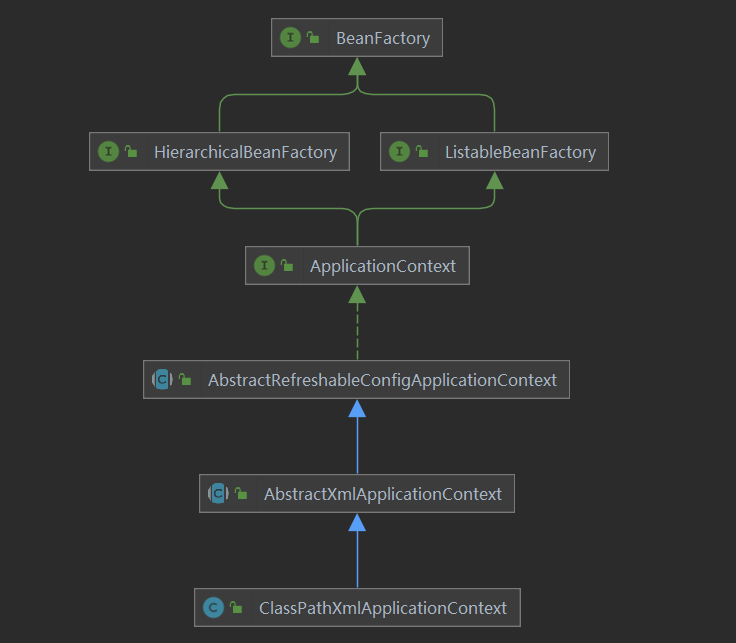
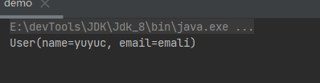
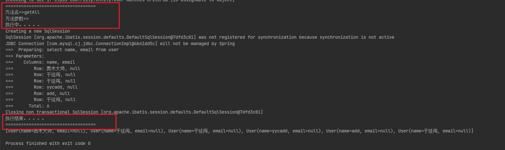

## Spring


### Spring基础


官网：

[Spring官网](https://docs.spring.io/spring-framework/docs/current/reference/html/index.html)

[Gihup源码](https://github.com/spring-projects/spring-framework)

[Spring  DOC](https://docs.spring.io/spring-framework/docs/)


#### 目的

> 此前企业会使用的技术:EJB(Enterprise Java Beans)，复杂、效率低，效率低体现在调用(涉及远程调用、使用EJB封装业务逻辑业务低)、代码重用性低。
>
> Spring的一个最大的目的就是使Java EE 开发更加容易，并且Spring是一个及易扩展的框架，可以很容易集成其他组件。

#### 特点

- 非侵入式：

  > 使用Spring开发的应用中的对象可以不依赖于Spring的Api。Spring这类的非侵入式框架都是使用反射＋代理来实现对象的创建和实例化。

- 控制反转：

  > IOC -  Inversion Of   Controller。
  >
  > 对象的创建由客户端主动New反转为由Spring创建，对象的生命周期由Spring控制。

- 依赖注入：

  > DI  -  Dependency Injection
  >
  > 某个Bean所依赖的对象(组合进来的对象)，无需手动setXXX()，而是由Spring配置自动注入。

- 面向切面编程：

  > AOP - Aspect Oriented Programming
  >
  > 可降低耦合，核心1就是反射＋代理

- 容器思想：

  > Spring就是一个Bean容器，负责Bean的创建和生命周期的管理。
  >
  > 将用得到的Bean放入容器，在需要使用的时候往Spring容器中去取。

- 组件：

  > Spring的扩展性很好，只需要简单配置就可以以组件的形式将组件整合进来。

- 一站式：

  > Spring生态完备，同时在IOC、AOP的基础上可整合任意企业级组件和第三方类库，可一站式开发应用

  

#### 优点

- 按需注册，Spring只会安需组测需要的Bean对象到SpringIOC容器中，而忽略不需要的Bean。
- 生态完备，且扩展性优秀。Spring可完美整合优秀框架，比如ORM框架、日志框架等
- 测试简单，只需简单注解即可完成测试
- Spring除了IOC、AOP技术外，还提供一套模式思想，即MVC模式，使得代码可实现松耦合、高内聚。
- 对于一些复杂且逻辑相似的操作提供封装API，使得开发者使用起来非常容易。比如JavaMail、JDBC、远程调用等。
- 轻量级、高效。更加高效利用CPU和内存资源。与EJB对比更能体现


#### Spring各个模块

> Spring生态体系非常完善，由许多模块组成。

##### Core

> Core包含了Spring框架的基础部分。

包括：

- Beans 模块  包括IOC 和DI
- Core   核心模块，封装Spring底层实现，包括资源访问、类型转化以及一些常用工具类
- Context  上下文模块
- SPEL    支持强大的表达式语言


##### Data  Access

> 数据访问集成。

- Transaction   事务管理：支持编程式事务和响应式事务
- JDBC：提供统一数据库连接规范，并且易于Spring接管事务
- ORM，Object Relation Mapper，自动关系映射，可无缝集成市面上主流ORM框架
- OXM：提供Object/XML映射实现
- JMS：java消息服务


##### Web

- Web
- Servlet    
- WebSocket   通讯
- Webflux   新型响应式web框架


#### Test

> 测试模块。
>
> 支持Junit和TestNG，方便测试。


#### Spring  HelloWorld

> Spring框架简单使用

##### HelloWorld

- 创建一个maven模块

- 引入Spring依赖

  > Spring-context 依赖Spring-beans、Spring-core、Spring-aop，此demo只引入Spring-context足矣。

  ```xml
  <!-- spring-context -->
  <dependency>
      <groupId>org.springframework</groupId>
      <artifactId>spring-context</artifactId>
      <version>${spring.context.version}</version>
  </dependency>
  <spring.context.version>5.3.23</spring.context.version>
  ```

- 实体类User

  > 需要引入Lombok

  ```java
  @Data
  @AllArgsConstructor
  public class User {
      String name;
      String email;
  }
  ```

- 配置Spring配置文件

  > Spring配置文件模板可从网上拷贝，[官网也有模板](https://docs.spring.io/spring-framework/docs/current/reference/html/core.html#spring-core)。
  >
  > 根标签是一个`<Beans>`可见这就是一个Bean容器，按需往里面注册bean即可。

  ```xml
  <?xml version="1.0" encoding="UTF-8"?>
  <beans xmlns="http://www.springframework.org/schema/beans"
         xmlns:xsi="http://www.w3.org/2001/XMLSchema-instance"
         xsi:schemaLocation="http://www.springframework.org/schema/beans http://www.springframework.org/schema/beans/spring-beans.xsd">
      <bean id="user" class="com.roily.entity.User" scope="singleton">
          <constructor-arg type="java.lang.String" name="name" value="yuyuc"/>
          <constructor-arg type="java.lang.String" name="email" value="emali"/>
      </bean>
  
  </beans>
  ```

- 测试

  > 这里使用配置文件的方式配置Spring，通过BeanFactory的子类之一ClassPatchXmlApplicationContext加载Spring配置文件，将Bean注册到Spring容器中。

  

  ```java
  public class demo {
      public static void main(String[] args) {
          final ApplicationContext classPathXmlApplicationContext = new ClassPathXmlApplicationContext("application.xml");
          final User user = classPathXmlApplicationContext.getBean("user", User.class);
          System.out.println(user);
      }
  }
  ```

   


##### 加入mybatis和AOP

> 在以上基础上加入mybatis和AOP

######  依赖

```xml
<!--  mysql      -->
<dependency>
    <groupId>mysql</groupId>
    <artifactId>mysql-connector-java</artifactId>
</dependency>
<!--   mybatis  -->
<dependency>
    <groupId>org.mybatis</groupId>
    <artifactId>mybatis</artifactId>
</dependency>

<dependency>
    <groupId>org.mybatis</groupId>
    <artifactId>mybatis-spring</artifactId>
    <version>2.0.6</version>
</dependency>
<dependency>
    <groupId>org.springframework</groupId>
    <artifactId>spring-jdbc</artifactId>
    <version>5.3.12</version>
</dependency>
<dependency>
    <groupId>org.aspectj</groupId>
    <artifactId>aspectjweaver</artifactId>
</dependency>
```

###### 配置

- mybatis配置

  > 配置日志和别名即可，其他放入spring中配置

  ```xml
  <?xml version="1.0" encoding="UTF-8" ?>
  <!DOCTYPE configuration
          PUBLIC "-//mybatis.org//DTD Config 3.0//EN"
          "http://mybatis.org/dtd/mybatis-3-config.dtd">
  <configuration>
      <!--  日志配置和二级缓存  -->
      <settings>
          <setting name="logImpl" value="STDOUT_LOGGING"/>
          <setting name="cacheEnabled" value="true"/>
      </settings>
      <!--  别名配置，默认类名小写  -->
      <typeAliases>
          <package name="com.roily.entity"/>
      </typeAliases>
  </configuration>
  ```

- Spring-dao配置

  > 包括数据源、Sqlsessionfactory和Sqlsession、mapper等

  ```xml
  <!--  引入外部配置文件  -->
  <context:property-placeholder location="db.properties"/>
  <!--    &lt;!&ndash;  注册数据源  &ndash;&gt;-->
  <bean id="dataSource" class="org.springframework.jdbc.datasource.DriverManagerDataSource">
      <!--        <property name="driverClassName" value="${driver}"/>-->
      <!--        <property name="url" value="${url}"/>-->
      <!--        <property name="username" value="${username}"/>-->
      <!--        <property name="password" value="${passwd}"/>-->
      <property name="driverClassName" value="com.mysql.jdbc.Driver"/>
      <property name="url"
                value="jdbc:mysql://localhost:3306/mybatis?useUnicode=true&amp;charactEncoding=utf8&amp;useSSL=true"/>
      <property name="username" value="root"/>
      <property name="password" value="123456"/>
  </bean>
  
  <!--  注册SqlSessionFactory,指定mybatis配置和mapper路径  -->
  <bean id="sqlSessionFactory" class="org.mybatis.spring.SqlSessionFactoryBean">
      <property name="dataSource" ref="dataSource"/>
      <property name="configLocation" value="classpath:mybatis-config.xml"/>
      <property name="mapperLocations" value="classpath:mapper/UserMapper.xml"/>
  </bean>
  
  <!--  组测sqlSession,构造器注入,注意必须构造器注入，没有set注入-->
  <bean id="sqlSession" class="org.mybatis.spring.SqlSessionTemplate">
      <constructor-arg name="sqlSessionFactory" ref="sqlSessionFactory"/>
  </bean>
  
  <!--    扫描mapper -->
  <bean class="org.mybatis.spring.mapper.MapperScannerConfigurer">
      <property name="sqlSessionFactoryBeanName" value="sqlSessionFactory"/>
      <property name="basePackage" value="com.roily.mapper"/>
  </bean>
  ```

- Application。xml

  > Spring整合配置

  ```xml
  <aop:aspectj-autoproxy/>
  <!--    引入外部配置  -->
  <import resource="classpath:spring-dao.xml"/>
  <bean id="userServiceImpl" class="com.roily.service.impl.UserServiceImpl">
      <property name="userMapper" ref="userMapper"/>
  </bean>
  <bean id="logAspectj" class="com.roily.common.aop.LogAspect">
  </bean>
  ```


######  dao & service

> 类

UserMapper  &  UserService  & Mapper  Xml

```java
public interface UserMapper {
    List<User> getAll();
}
```

```xml
<?xml version="1.0" encoding="UTF-8"?>
<!DOCTYPE mapper
        PUBLIC "-//mybatis.org//DTD Mapper 3.0//EN"
        "http://mybatis.org/dtd/mybatis-3-mapper.dtd">
<mapper namespace="com.roily.mapper.UserMapper">
    <select id="getAll" resultType="user">
        select name, email
        from user
    </select>

</mapper>
```

> 注意Lombok会为我们自动加上setter方法

```java
public interface UserService {
    List<User> getAll();
}
@Data
public class UserServiceImpl  implements UserService {
    private UserMapper userMapper;
    @Override
    public List<User> getAll() {
        return userMapper.getAll();
    }
}
```


###### Aspect

> 定义切面和切点

```java
@Aspect
public class LogAspect {
    /**
     * 任意返回值
     * com.roily.service包下任意方法  （。。）代表任意参数的方法
     */
    @Pointcut("execution(* com.roily.service.*.*(..))")
    public void pointCut() {
    }
    @Around("pointCut()")
    public Object logAspect(ProceedingJoinPoint proceedingJoinPoint) throws Throwable {
        final MethodSignature signature = (MethodSignature)proceedingJoinPoint.getSignature();
        final Method method = signature.getMethod();
        System.out.println("===================================");
        System.out.println("方法名=>"+method.getName());
        System.out.println("方法参数=>");
        Arrays.asList(method.getParameters()).forEach(System.out::print);
        System.out.println("执行中。。。。。");
        final Object proceed = proceedingJoinPoint.proceed();
        System.out.println("执行结束。。。。。");
        System.out.println("===================================");
        return proceed;
    }
}
```


###### 测试

> 可顺利执行，且切面起了作用

```java
public static void main(String[] args) {
    final ApplicationContext applicationContext = new ClassPathXmlApplicationContext("applicationContext.xml");
    final UserService userService = applicationContext.getBean("userServiceImpl", UserService.class);
    final List<User> all = userService.getAll();
    System.out.println(all);
}
```




##### 结

> 以上例子做小结。Spring的作用。

###### IOC

> 控制反转。
>
> 没有Spring框架，我们需要手动new对象来使用，对象的创建和使用强依赖。现在有了Spring框架，对象的创建交由Spring管理，当我们需要使用某个类时，则去容器中拿取即可。如此简化开发，对象的创建和使用也分离开来。

- 控制反转-控制什么？控制Bean的创建和使用。什么反转了？Bean的创建由用户反转为Spring。这就是IOC(Inversion of controler)
- Spring创建的bean放在哪里？  IOC  Container
- 配置Spring有哪些方式？ xml配置文件、javaConfig和注解配置
- bean从Spring  IOC  Container  中获取依赖，注入到当前bean中，此过程叫做依赖注入-DI(Dependency  injection )
- 依赖注入的方式（构造器注入、Set注入）
- @Autowrite  @Resource  @inject


