## Spring


### Spring基础


官网：

[Spring官网](https://docs.spring.io/spring-framework/docs/current/reference/html/index.html)

[Gihup源码](https://github.com/spring-projects/spring-framework)

[Spring  DOC](https://docs.spring.io/spring-framework/docs/)


#### 目的

> 此前企业会使用的技术:EJB(Enterprise Java Beans)，复杂、效率低，效率低体现在调用(涉及远程调用、使用EJB封装业务逻辑业务低)、代码重用性低。
>
> Spring的一个最大的目的就是使Java EE 开发更加容易，并且Spring是一个及易扩展的框架，可以很容易集成其他组件。

#### 特点

- 非侵入式：

  > 使用Spring开发的应用中的对象可以不依赖于Spring的Api。Spring这类的非侵入式框架都是使用反射＋代理来实现对象的创建和实例化。

- 控制反转：

  > IOC -  Inversion Of   Controller。
  >
  > 对象的创建由客户端主动New反转为由Spring创建，对象的生命周期由Spring控制。

- 依赖注入：

  > DI  -  Dependency Injection
  >
  > 某个Bean所依赖的对象(组合进来的对象)，无需手动setXXX()，而是由Spring配置自动注入。

- 面向切面编程：

  > AOP - Aspect Oriented Programming
  >
  > 可降低耦合，核心1就是反射＋代理

- 容器思想：

  > Spring就是一个Bean容器，负责Bean的创建和生命周期的管理。
  >
  > 将用得到的Bean放入容器，在需要使用的时候往Spring容器中去取。

- 组件：

  > Spring的扩展性很好，只需要简单配置就可以以组件的形式将组件整合进来。

- 一站式：

  > Spring生态完备，同时在IOC、AOP的基础上可整合任意企业级组件和第三方类库，可一站式开发应用

  

#### 优点

- 按需注册，Spring只会安需组测需要的Bean对象到SpringIOC容器中，而忽略不需要的Bean。
- 生态完备，且扩展性优秀。Spring可完美整合优秀框架，比如ORM框架、日志框架等
- 测试简单，只需简单注解即可完成测试
- Spring除了IOC、AOP技术外，还提供一套模式思想，即MVC模式，使得代码可实现松耦合、高内聚。
- 对于一些复杂且逻辑相似的操作提供封装API，使得开发者使用起来非常容易。比如JavaMail、JDBC、远程调用等。
- 轻量级、高效。更加高效利用CPU和内存资源。与EJB对比更能体现


### Spring各个模块

> Spring生态体系非常完善，由许多模块组成。

#### Core

> Core包含了Spring框架的基础部分。

包括：

- Beans 模块  包括IOC 和DI
- Core   核心模块，封装Spring底层实现，包括资源访问、类型转化以及一些常用工具类
- Context  上下文模块
- SPEL    支持强大的表达式语言

#### Data  Access

> 数据访问集成。

- Transaction   事务管理：支持编程式事务和响应式事务
- JDBC：提供统一数据库连接规范，并且易于Spring接管事务
- ORM，Object Relation Mapper，自动关系映射，可无缝集成市面上主流ORM框架
- OXM：提供Object/XML映射实现
- JMS：java消息服务

#### Web

- Web
- Servlet    
- WebSocket   通讯
- Webflux   新型响应式web框架

#### Test

> 测试模块。
>
> 支持Junit和TestNG，方便测试。

### Spring  HelloWorld

> Spring框架简单使用

#### HelloWorld

- 创建一个maven模块

- 引入Spring依赖

  > Spring-context 依赖Spring-beans、Spring-core、Spring-aop，此demo只引入Spring-context足矣。

  ```xml
  <!-- spring-context -->
  <dependency>
      <groupId>org.springframework</groupId>
      <artifactId>spring-context</artifactId>
      <version>${spring.context.version}</version>
  </dependency>
  <spring.context.version>5.3.23</spring.context.version>
  ```

- 实体类User

  > 需要引入Lombok

  ```java
  @Data
  @AllArgsConstructor
  public class User {
      String name;
      String email;
  }
  ```

- 配置Spring配置文件

  > Spring配置文件模板可从网上拷贝，[官网也有模板](https://docs.spring.io/spring-framework/docs/current/reference/html/core.html#spring-core)。
  >
  > 根标签是一个`<Beans>`可见这就是一个Bean容器，文件由命名空间和具体Bean组成

  ```xml
  <?xml version="1.0" encoding="UTF-8"?>
  <beans xmlns="http://www.springframework.org/schema/beans"
         xmlns:xsi="http://www.w3.org/2001/XMLSchema-instance"
         xsi:schemaLocation="http://www.springframework.org/schema/beans http://www.springframework.org/schema/beans/spring-beans.xsd">
      <bean id="user" class="com.roily.entity.User" scope="singleton">
          <constructor-arg type="java.lang.String" name="name" value="yuyuc"/>
          <constructor-arg type="java.lang.String" name="email" value="emali"/>
      </bean>
  </beans>
  ```
  
- 测试

  > 这里使用配置文件的方式配置Spring，通过BeanFactory的子类之一ClassPatchXmlApplicationContext加载Spring配置文件，将Bean注册到Spring容器中。

  

  ```java
  public class demo {
      public static void main(String[] args) {
          final ApplicationContext classPathXmlApplicationContext = new ClassPathXmlApplicationContext("application.xml");
          final User user = classPathXmlApplicationContext.getBean("user", User.class);
          System.out.println(user);
      }
  }
  ```

   

#### 加入mybatis和AOP

> 在以上基础上加入mybatis和AOP。
>
> Spring是一个容器，需要任何组件(组件用于实现某种功能)，直接往容器中注册即可。

##### 依赖

```xml
<!--  mysql      -->
<dependency>
    <groupId>mysql</groupId>
    <artifactId>mysql-connector-java</artifactId>
</dependency>
<!--   mybatis  -->
<dependency>
    <groupId>org.mybatis</groupId>
    <artifactId>mybatis</artifactId>
</dependency>

<dependency>
    <groupId>org.mybatis</groupId>
    <artifactId>mybatis-spring</artifactId>
    <version>2.0.6</version>
</dependency>
<dependency>
    <groupId>org.springframework</groupId>
    <artifactId>spring-jdbc</artifactId>
    <version>5.3.12</version>
</dependency>
<dependency>
    <groupId>org.aspectj</groupId>
    <artifactId>aspectjweaver</artifactId>
</dependency>
```

##### 配置

- 数据库配置db.properties

  ```properties
  driver=com.mysql.cj.jdbc.Driver
  url=jdbc:mysql://localhost:3306/mybatis?useUnicode=true;characterEncoding=utf8;useSSL=true
  user=root
  password=123456
  ```

- mybatis配置

  > 配置日志和别名即可，其他放入spring中配置。
  >
  > [mybatis配置文件模板](https://mybatis.org/mybatis-3/zh/getting-started.html)

  ```xml
  <?xml version="1.0" encoding="UTF-8" ?>
  <!DOCTYPE configuration
          PUBLIC "-//mybatis.org//DTD Config 3.0//EN"
          "http://mybatis.org/dtd/mybatis-3-config.dtd">
  <configuration>
      <!--  日志配置和二级缓存  -->
      <settings>
          <setting name="logImpl" value="STDOUT_LOGGING"/>
          <setting name="cacheEnabled" value="true"/>
      </settings>
      <!--  别名配置，默认类名小写  -->
      <typeAliases>
          <package name="com.roily.entity"/>
      </typeAliases>
  </configuration>
  ```

- Spring-dao配置

  > 包括数据源、Sqlsessionfactory和Sqlsession、mapper等

  ```xml
  <!--  引入外部配置文件  -->
  <context:property-placeholder location="db.properties"/>
  <!--    &lt;!&ndash;  注册数据源  &ndash;&gt;-->
  <bean id="dataSource" class="org.springframework.jdbc.datasource.DriverManagerDataSource">
  	   <property name="driverClassName" value="${driver}"/>
          <property name="url" value="${url}"/>
          <property name="username" value="${user}"/>
          <property name="password" value="${password}"/>
  </bean>
  
  <!--  注册SqlSessionFactory,指定mybatis配置和mapper路径  -->
  <bean id="sqlSessionFactory" class="org.mybatis.spring.SqlSessionFactoryBean">
      <property name="dataSource" ref="dataSource"/>
      <property name="configLocation" value="classpath:mybatis-config.xml"/>
      <property name="mapperLocations" value="classpath:mapper/UserMapper.xml"/>
  </bean>
  
  <!--  组测sqlSession,构造器注入,注意必须构造器注入，没有set注入-->
  <bean id="sqlSession" class="org.mybatis.spring.SqlSessionTemplate">
      <constructor-arg name="sqlSessionFactory" ref="sqlSessionFactory"/>
  </bean>
  
  <!--    扫描mapper -->
  <bean class="org.mybatis.spring.mapper.MapperScannerConfigurer">
      <property name="sqlSessionFactoryBeanName" value="sqlSessionFactory"/>
      <property name="basePackage" value="com.roily.mapper"/>
  </bean>
  ```
  
- Application。xml

  > Spring整合配置

  ```xml
  <aop:aspectj-autoproxy/>
  <!--    引入外部配置  -->
  <import resource="classpath:spring-dao.xml"/>
  <bean id="userServiceImpl" class="com.roily.service.impl.UserServiceImpl">
      <property name="userMapper" ref="userMapper"/>
  </bean>
  <bean id="logAspectj" class="com.roily.common.aop.LogAspect">
  </bean>
  ```

##### dao & service

> 类

UserMapper  &  UserService  & Mapper  Xml

```java
public interface UserMapper {
    List<User> getAll();
}
```

```xml
<?xml version="1.0" encoding="UTF-8"?>
<!DOCTYPE mapper
        PUBLIC "-//mybatis.org//DTD Mapper 3.0//EN"
        "http://mybatis.org/dtd/mybatis-3-mapper.dtd">
<mapper namespace="com.roily.mapper.UserMapper">
    <select id="getAll" resultType="user">
        select name, email
        from user
    </select>

</mapper>
```

> 注意Lombok会为我们自动加上setter方法

```java
public interface UserService {
    List<User> getAll();
}
@Data
public class UserServiceImpl  implements UserService {
    private UserMapper userMapper;
    @Override
    public List<User> getAll() {
        return userMapper.getAll();
    }
}
```

##### Aspect

> 定义切面和切入点

```java
@Aspect
public class LogAspect {
    /**
     * 任意返回值
     * com.roily.service包下任意方法  （。。）代表任意参数的方法
     */
    @Pointcut("execution(* com.roily.service.*.*(..))")
    public void pointCut() {
    }
    @Around("pointCut()")
    public Object logAspect(ProceedingJoinPoint proceedingJoinPoint) throws Throwable {
        final MethodSignature signature = (MethodSignature)proceedingJoinPoint.getSignature();
        final Method method = signature.getMethod();
        System.out.println("===================================");
        System.out.println("方法名=>"+method.getName());
        System.out.println("方法参数=>");
        Arrays.asList(method.getParameters()).forEach(System.out::print);
        System.out.println("执行中。。。。。");
        final Object proceed = proceedingJoinPoint.proceed();
        System.out.println("执行结束。。。。。");
        System.out.println("===================================");
        return proceed;
    }
}
```

##### 测试

> 可顺利执行，且切面起了作用

```java
public static void main(String[] args) {
    final ApplicationContext applicationContext = new ClassPathXmlApplicationContext("applicationContext.xml");
    final UserService userService = applicationContext.getBean("userServiceImpl", UserService.class);
    final List<User> all = userService.getAll();
    System.out.println(all);
}
```


##### 整体结构


#### 结

> 以上例子做小结。Spring的作用。

##### IOC

> 控制反转。
>
> 没有Spring框架，我们需要手动new对象来使用，对象的创建和使用强依赖。现在有了Spring框架，对象的创建交由Spring管理，当我们需要使用某个类时，则去容器中拿取即可。如此简化开发，对象的创建和使用也分离开来。

- 控制反转-控制什么？控制Bean的创建和使用。什么反转了？Bean的创建由用户反转为Spring。这就是IOC(Inversion of controler)
- Spring创建的bean放在哪里？  IOC  Container
- 配置Spring有哪些方式？ xml配置文件、javaConfig和注解配置
- bean从Spring  IOC  Container  中获取依赖，注入到当前bean中，此过程叫做依赖注入-DI(Dependency  injection )
- 依赖注入的方式（构造器注入、Set注入）
- @Autowrite  @Resource  @inject

##### AOP

> 在以上例子中我们定义了一个切面LogAspect，切入点设置为所有的service下的方法，以此我们避免在每一个Service中都打印日志的操作，本质上是一个解耦的操作。
>
> Spring的Aop模块使用的是动态代理，通过代理对象对原方法进行增强，使用Aop可避免大量侵入式扩展操作。 

- AOP(Aspect Oriented Programming)，Spring可将重复业务抽象出来定义为切面，实现程序的解耦，提高代码复用

- @Aspect是aspectj下的注解，Spring认可并为其提供兼容方案
- 丰富的拦截方式，@around  @before  @after @afterThrowing @afterReturing等
- Aop使用的是代理技术

#### JavaConfig

> Spring的配置方式除了xml配置文件之外，还有JavaConfig方式。
>
> xml配置文件配置过于繁琐，以上例子就有感觉，如果项目较大，配置繁琐。JavaConfig使用对程序员友好的方式来简化配置，但是大量使用JavaConfig也会使得代码可读性较差。

以上例子bean、service、mapper和aspct不用动，只使用JavaConfig来代替application.xml。

- 数据库配置，使用Properties工具，需要注意的是DriverManagerDataSource对于Properties的键值有一定要求。分别是url、username、password。或者使用DriverManagerDataSource(String,String,String)这个重载构造函数
- 注册DriverManagerDataSource
- 注册SqlsessionFactoryBean
- 注册SqlSessionTemplate
- 注册UserMapper、UserService以及LogAspect

```java
@EnableAspectJAutoProxy//aop,支持代理类
@Configuration//声明此类为配置类
public class ApplicationConfig {
    
    /**
     * 数据库配置
     *
     * @return
     */
    @Bean("jdbcProperties")
    public Properties jdbcProperties() {
        final InputStream in = ApplicationConfig.class.getClassLoader().getResourceAsStream("db.properties");
        final Properties properties = new Properties();
        try {
            properties.load(in);
        } catch (IOException e) {
            e.printStackTrace();
        }
        return properties;
    }

    @Bean("dataSource")
    public DataSource driverManagerDataSource(Properties jdbcProperties) {
        return new DriverManagerDataSource(jdbcProperties.getProperty("url"), jdbcProperties);
    }

    @Bean("sqlSessionFactory")
    public SqlSessionFactoryBean sqlSessionFactory(DataSource dataSource) throws IOException {
        final SqlSessionFactoryBean sqlSessionFactoryBean = new SqlSessionFactoryBean();
        PathMatchingResourcePatternResolver resolver = new PathMatchingResourcePatternResolver();
        sqlSessionFactoryBean.setDataSource(dataSource);
        sqlSessionFactoryBean.setConfigLocation(resolver.getResource("classpath:mybatis-config.xml"));
        sqlSessionFactoryBean.setMapperLocations(resolver.getResources("classpath:mapper/*.xml"));
        return sqlSessionFactoryBean;
    }

    @Bean("sqlSession")
    public SqlSession sqlSession(SqlSessionFactory sqlSessionFactory) {
        return new SqlSessionTemplate(sqlSessionFactory);
    }

    @Bean("userMapper")
    public UserMapper userMapper(SqlSession sqlSession) {
        return sqlSession.getMapper(UserMapper.class);
    }

    @Bean("userService")
    public UserService userService(UserMapper userMapper) {
        final UserServiceImpl userService = new UserServiceImpl();
        userService.setUserMapper(userMapper);
        return userService;
    }

    @Bean("logAspect")
    public LogAspect logAspect() {
        return new LogAspect();
    }
}
```

测试：

> 也可以达到同样的效果

```java
final AnnotationConfigApplicationContext ac = new AnnotationConfigApplicationContext(ApplicationConfig.class);
final UserService userService = ac.getBean("userService", UserService.class);
final List<User> all = userService.getAll();
System.out.println(all);
```

#### 注解+扫描

> 通过注解加扫描的机制改进以上代码

对ApplicationConfig稍作修改，数据源、sqlSession等不做改动，修改Mapper、service、Aspect：

- 给UserMapper加上@Mapper注解

  ```java
  @Mapper
  public interface UserMapper {
      List<User> getAll();
  }
  ```

- 给UserServiceImpl加上@service注解，并且在usermapper上加上@Autowrite注入注解

  ```java
  @Service
  @Data
  public class UserServiceImpl  implements UserService {
      @Autowired
      private UserMapper userMapper;
      @Override
      public List<User> getAll() {
          return userMapper.getAll();
      }
  }
  ```

- 给LogAspect加上@Component注解

  ```java
  @Aspect
  @Component
  public class LogAspect {}
  ```

- javaconfig配置，保留数据源等配置，添加组件扫描和mapper扫描注解

  ```java
  @EnableAspectJAutoProxy//aop,支持代理类
  @Configuration//声明此类为配置类
  @ComponentScan(basePackages = "com.roily")
  @MapperScan(basePackages = "com.roily.mapper")
  public class ApplicationASConfig {
  
      /**
       * 数据库配置
       *
       * @return
       */
      @Bean("jdbcProperties")
      public Properties jdbcProperties() {
          final InputStream in = ApplicationASConfig.class.getClassLoader().getResourceAsStream("db.properties");
          final Properties properties = new Properties();
          try {
              properties.load(in);
          } catch (IOException e) {
              e.printStackTrace();
          }
          return properties;
      }
  
      @Bean("dataSource")
      public DataSource driverManagerDataSource(Properties jdbcProperties) {
          return new DriverManagerDataSource(jdbcProperties.getProperty("url"), jdbcProperties);
      }
  
      @Bean("sqlSessionFactory")
      public SqlSessionFactoryBean sqlSessionFactory(DataSource dataSource) throws IOException {
  
          final SqlSessionFactoryBean sqlSessionFactoryBean = new SqlSessionFactoryBean();
          PathMatchingResourcePatternResolver resolver = new PathMatchingResourcePatternResolver();
          sqlSessionFactoryBean.setDataSource(dataSource);
          sqlSessionFactoryBean.setConfigLocation(resolver.getResource("classpath:mybatis-config.xml"));
          sqlSessionFactoryBean.setMapperLocations(resolver.getResources("classpath:mapper/*.xml"));
          return sqlSessionFactoryBean;
      }
  
      @Bean("sqlSession")
      public SqlSession sqlSession(SqlSessionFactory sqlSessionFactory) {
          return new SqlSessionTemplate(sqlSessionFactory);
      }
     
  }
  ```

### IOC容器配置方式

> IOC容器配置的三种方式及优缺点

- XML文件配置，通过命名空间和`<bean>`标签配置bean

  > 适用于任何场景，易于理解
  >
  > 项目大的话，配置非常繁琐

- JavaConfig

  > 使用JavaConfig代替xml，使用@Bean代替`<bean>`标签
  >
  > 存java代码配置，扩展性好，易于理解
  >
  > 配置多的话，可读性较差

- 注解+扫描

  > 这是目前常用的方式
  >
  > 简洁、易懂，按约定配置后期项目易于维护
  >
  > 存在局限性，对于不兼容组件，需要配合xml配置


### 依赖注入的三种方式

> 依赖注入的三种方式。

- Setter注入
- 构造器注入（Construct）
- 基于注解自动注入

#### Setter注入

> 属性中使用`<property>`标签初始化属性的都是Setter注入。

setter注入本质上是会首先调用无参构造方法生产一个Bean，再通过set方法将属性注入。

所以使用set注入的Bean必须拥有无参构造方法，属性必须存在对应setter方法。

例：

```java
public class User {

    String name;

    public User() {
        System.out.println("User   init");
    }

    public void setName(String name) {
        this.name = name;
        System.out.println("seName");
    }

    @Override
    public String toString() {
        return "User{" +
                "name='" + name + '\'' +
                '}';
    }
}
```

```java
<bean id="user" name="userAlias" class="com.roily.entity.User">
    <property name="name" value="yuyc"/>
</bean>
```

#### 构造器注入

> 使用`constructor-arg`标签的都是构造器注入。

使用`<constructor-arg>`本质上是调用Person(String name, String age, String email)构造器，构造方法参数数量必须匹配。

例：

```java
public class Person {

    String name;
    String age;
    String email;

    public Person(String name, String age, String email) {
        this.name = name;
        this.age = age;
        this.email = email;
    }

    @Override
    public String toString() {
        return "Person{" +
                "name='" + name + '\'' +
                ", age='" + age + '\'' +
                ", email='" + email + '\'' +
                '}';
    }
}
```

```xml
<bean id="person" class="com.roily.entity.Person">
    <constructor-arg name="age" value="1"/>
    <constructor-arg name="name" value="1"/>
    <constructor-arg name="email" value="1"/>
</bean>
```

#### 注解注入

> 使用注解注入。xml+注解或JavaConfig+注解

Xml+ 注解

```java
public class UserDao {
}
public class UserService {
    private UserDao userDao;
    @Autowired//可以省略
    public void setUserDao(（ @Autowired/*可以放也可以不放*/ ）UserDao userDao) {
        this.userDao = userDao;
    }
    @Override
    public String toString() {
        return "UserService{" +
                "userDao=" + userDao +
                '}';
    }
}
```

xml配置文件：

```xml
<bean id="userDao" class="com.roily.dao.UserDao"/>
<bean id="userService" class="com.roily.service.UserService" autowire="byType">
</bean>
```


JavaConfig + 注解

```java
@Configuration
public class ApplicationConfig {
    @Bean
    UserDao userDao(){
        return new UserDao();
    }
    @Bean
    UserService userService(){
        return new UserService();
    }
}
```

###### @Autowrite

> @AutoWrite，有ByType   byName 方式，还有一个require属性。
>
> SpringFrameWork包下的注解

@Autowrite可以放在，构造器、方法·、参数、属性、接口

ElementType.CONSTRUCTOR, ElementType.METHOD, ElementType.PARAMETER, ElementType.FIELD, ElementType.ANNOTATION_TYPE

环境搭建：

```java
@Component
public class DaoDemo {
}
@Component
public class ServiceDemo {
    @Autowired(require = true)
    private DaoDemo daoDemo;
}
@ComponentScan(basePackages = "com.roily")
@Configuration
public class ConfigDemo {
}
```

- require属性测试

将DaoDemo上的@Component注解注掉，测试：

提示没有Bean

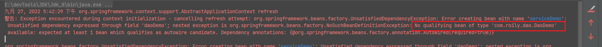

将@Autowrite(require = false)，则不会报错

- byType

默认就是bytype的，通过类型查找Bean，如果存在多个候选者则优先选择 类名首字母小写的组件

- byName

想要通过beanName注入依赖，则需要配合@Qualified注解。当存在多个候选者的时候可以配合@Qualified指定


###### @Resource

> @Resource，首先通过类型查找，存在多个则通过name查找。有一个name属性，注入的组件名称
>
> javaax包下的注解是JSR250规范

```java
@Target({TYPE, FIELD, METHOD})
@Retention(RUNTIME)
public @interface Resource 
String name() default "";
```

可放在属性和方法上。


### 为何推荐构造器注入？

> 这里推荐使用构造器注入，为何？

构造器注入能够保证所注入的组件不可变，并确保需要的依赖不为空，并且注册进IOC容器的时候保证完全初始化状态。

- 所注入组件不可变：使用final修饰构造器中的参数
- 依赖不为空：使用构造器注入，避免无参构造，构造方法参数从IOC容器中取。取得到ok，取不到报错
- 完全初始化状态：使用构造器注入，能够保证，父类、成员变量等都已经初始化过了，最后才执行对应构造方法


依赖不为空：

> set注入在编译的时候并不会检查，即便依赖项为空，也只能在真正使用的时候才会暴露出来。
>
> 如下依赖项为空在调用的时候，会报空指针

```java
<!--    <bean id="userDao" class="com.roily.dao.UserDao"/>-->
<bean id="userService" class="com.roily.service.UserService" autowire="byName">
</bean>
```


循环依赖问题：

> set注入会导致循环依赖问题：

```java
public class Component1 {
    @Autowired
    Component2 component2;
    public void method() {
        component2.method();
    }
    setter
}
public class Component2 {
    @Autowired
    Component1 component1;
    public void method() {
        component1.method();
    }
    setter（）
}
```

```xml
<bean id="component1" class="com.roily.entity.Component1">
    <property name="component2" ref="component2"/>
</bean>
<bean id="component2" class="com.roily.entity.Component2">
    <property name="component1" ref="component1"/>
</bean>
```

测试：会报错，java.lang.StackOverflowError

```JAVA
@Test
public void testAutoWritexx() {

    final ApplicationContext cpx = new ClassPathXmlApplicationContext("application.xml");
    final Component1 bean1 = cpx
            .getBean(Component1.class);
    bean1.method();

}
```

> 采用构造器注入的话，会立刻会报错，提示出来  org.springframework.beans.factory.BeanCurrentlyInCreationException

```java
public class Component1 {
    Component2 component2;
    @Autowired
    public Component1(final Component2 component2) {
        this.component2 = component2;
    }
    public void method() {
        component2.method();
    }
}
。。。。Component2同
```

### 控制反转(IOC)

- 控制反转-控制什么？控制Bean的创建和使用。什么反转了？Bean的创建由用户反转为Spring。这就是IOC(Inversion of controler)
- Spring创建的bean放在哪里？  IOC  Container
- 配置Spring有哪些方式？ xml配置文件、javaConfig和注解配置
- bean从Spring  IOC  Container  中获取依赖，注入到当前bean中，此过程叫做依赖注入-DI(Dependency  injection )
- 依赖注入的方式（构造器注入、Set注入）
- @Autowrite  @Resource  @inject

#### Spring Bean是什么？

> Spring的Bean可以认为就是组件，这个组件用于实现某个功能，需要某个功能就注册某个组件。
>
> Spring为我们提供了简洁方法来调用组件。

#### IOC

> Inversion Of  Control，控制反转，不是技术，而是一种设计思想。在Spring中IOC体现于，对象的创建和管理交由IOC  Contailer，而不是传统的由程序控制。IOC也遵循面向对象法则，可以指导我们设计出松耦合的程序。

##### 控制反转

- 控制什么？

  > 控制Bean的创建和生命周期的管理

- 反转？

  > 一开始Bean的创建由程序控制，现有Spring框架，对象的创建和控制权反转到IOC容器

- 依赖注入？

  > IOC是一种设计思想，指导我们设计程序，依赖注入(DI)就是IOC的具体实现方式。
  >
  > 依赖注入指的是某个Bean的创建可从Spring容器中获取依赖的其他Bean，此过程称为依赖注入。依赖注入的方式：构造器注入、setter注入。

##### 配置Spring

> Spring的配置方式有三种：①xml  ②javaconfig   ③注解配置

###### xml配置

- 结构：

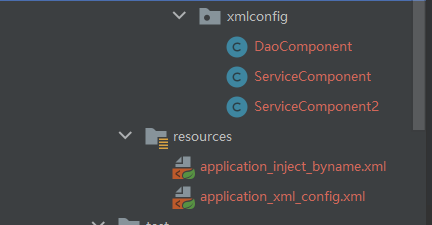

- 代码：

```java
public class DaoComponent {
    String value;
}
public class ServiceComponent {
    DaoComponent daoComponent;
    //setter注入必须存在对应setter方法
    public void setDaoComponent(DaoComponent daoComponent) {
        this.daoComponent = daoComponent;
    }
}
public class ServiceComponent2 {
    DaoComponent daoComponent;
    //构造器注入必须存在参数一致的构造方法
    public ServiceComponent2(DaoComponent daoComponent) {
        this.daoComponent = daoComponent;
    }
}
```

- xml配置：

引入Beans命名空间即可

```xml
<?xml version="1.0" encoding="UTF-8"?>
<beans xmlns="http://www.springframework.org/schema/beans"
       xmlns:xsi="http://www.w3.org/2001/XMLSchema-instance"
       xmlns:context="http://www.springframework.org/schema/context"
       xsi:schemaLocation="http://www.springframework.org/schema/beans
    http://www.springframework.org/schema/beans/spring-beans.xsd
    http://www.springframework.org/schema/context
    https://www.springframework.org/schema/context/spring-context.xsd">

    <bean id="daoDemo01" class="com.roily.springioc.xmlconfig.DaoComponent"/>

    <bean id="daoDemo02" class="com.roily.springioc.xmlconfig.DaoComponent"/>

    <bean id="serviceDemo01" class="com.roily.springioc.xmlconfig.ServiceComponent">
        <!--    setter注入，属性必须存在对应setter方法    -->
        <property name="daoComponent" ref="daoDemo01"/>
    </bean>

    <bean id="serviceDemo2" class="com.roily.springioc.xmlconfig.ServiceComponent2">
        <!--   构造器注入必须存在符合参数参数数量的构造器   -->
        <constructor-arg name="daoComponent" ref="daoDemo01"/>
    </bean>

</beans>
```

- 测试：

debug查看ClassPathXmlApplicationContext的BeanFactory的  singletonObjects属性(IOC Container 中的Bean默认都是单例的)

```java
final ApplicationContext cpx = new ClassPathXmlApplicationContext("classpath:application_xml_config.xml");
```

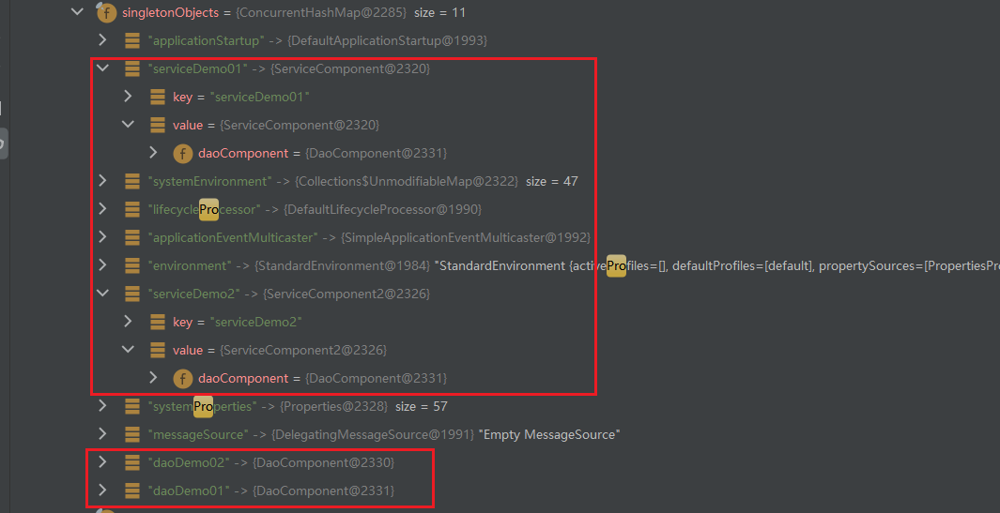

###### JavaConfig配置

> JavaConfig配置，用JavaConfig代替Xml配置文件

- 结构：

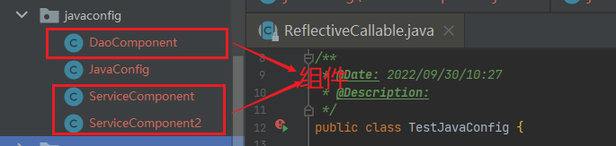

- 代码：

用JavaConfig代替Xml

```java
public class JavaConfig {

    @Bean("daoComponent1")
    public DaoComponent daoComponent() {
        return new DaoComponent();
    }

    @Bean("daoComponent2")
    public DaoComponent daoComponentX() {
        return new DaoComponent();
    }

    @Bean("serviceComponent")
    public ServiceComponent serviceComponent(@Autowired @Qualifier("daoComponent1") DaoComponent daoComponent) {
        final ServiceComponent serviceComponent = new ServiceComponent();
        serviceComponent.setDaoComponent(daoComponent);
        return serviceComponent;
    }
}
```

- 测试:

debug查看

```java
@Test
public void test01(){
    final ApplicationContext ac = new AnnotationConfigApplicationContext(JavaConfig.class);
    System.out.println();
}
```

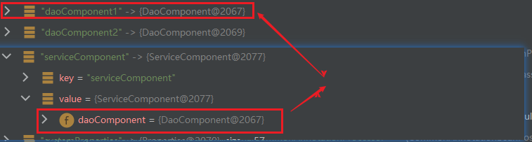

###### 注解自动配置

结构：

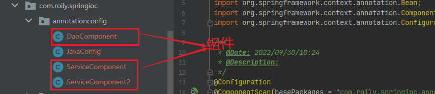

代码：添加注解

```java
@Component
public class DaoComponent {
    String value;
}
@Service(value = "xxxx")//可自定义组件名称
public class ServiceComponent {
    DaoComponent daoComponent;
    @Autowired
    @Qualifier("daoComponent")
    public void setDaoComponent(DaoComponent daoComponent) {
        this.daoComponent = daoComponent;
    }
}
@Service
public class ServiceComponent2 {
    DaoComponent daoComponent;
    //注解配置，构造器注入，无需显示注入
    //注入过程：首先通过type，如果找到多个则按参数名注入
    /*@Autowired*/
    public ServiceComponent2(/*@Autowired*/ DaoComponent daoComponent0x) {
        this.daoComponent = daoComponent0x;
    }
}
```

javaconfig：

```java
@Configuration
@ComponentScan(basePackages = "com.roily.springioc.annotationconfig")
public class JavaConfig {
    @Bean(value = "daoComponent0x")
    DaoComponent daoComponent(){
        return new DaoComponent();
    }
}
```

测试：

debug查看

```java
@Test
public void test1() {
    final ApplicationContext ac = new AnnotationConfigApplicationContext(JavaConfig.class);
    System.out.println();
}
```

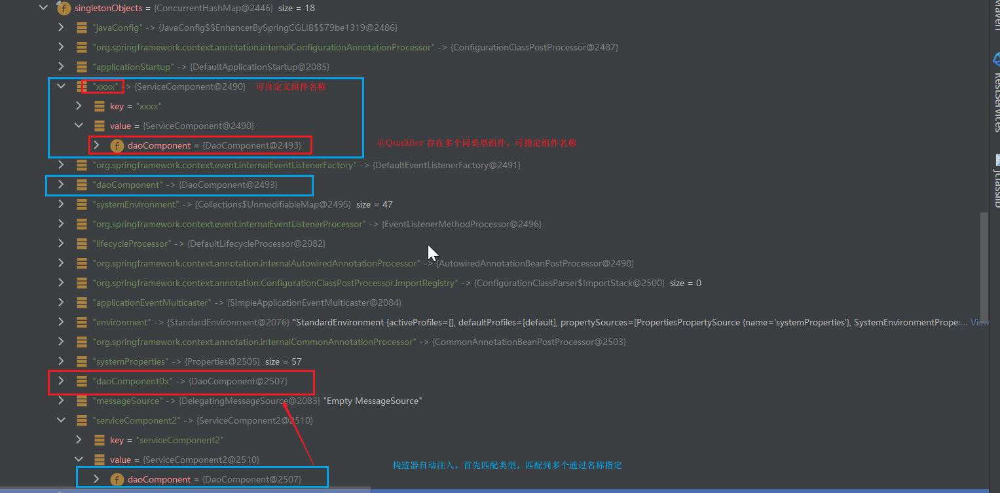

##### 注入方式

> byname，bytype，constructor

###### bytype

- 整体结构：

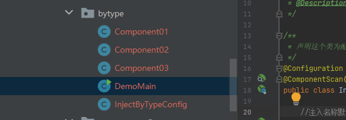

- javaconfig：

```
@Configuration
@ComponentScan("com.roily.bytype")
public class InjectByTypeConfig {
    //注入名称默认component01
    @Bean
    public Component01 component01(){
        return new Component01();
    }
}
```

- java类：

```java
public class Component01 {
}
@Component
public class Component02 {
    //默认按照类型注入,如果存在多个同类型不同名bean，则会报错
    @Autowired
    Component01 component01;
    /**
     * 通过构造器注入，可以省略@AutoWrite
     * @param component01
     */
    // public Component02(Component01 component01) {
    //     this.component01 = component01;
    // }
}
```

- 测试：

```java
public class DemoMain {

    public static void main(String[] args) {
        final ApplicationContext apc = new AnnotationConfigApplicationContext(InjectByTypeConfig.class);
        System.out.println();
    }

}
```

- 结果：

debug查看：AnnotationConfigApplicationContext ->beanFactory -> singletonObjects

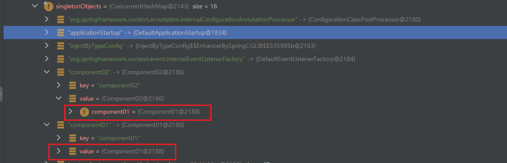

如果存在多个同名bean则会报错：

注：如果存在名为component01的组件则不会报错

```java
@Configuration
@ComponentScan("com.roily.bytype")
public class InjectByTypeConfig {
    //注入名称默认component01
    @Bean("component01aliasX")
    public Component01 component01(){
        return new Component01();
    }
    //注入名称默认component01
    @Bean("component01alias")
    public Component01 component02(){
        return new Component01();
    }
}
```

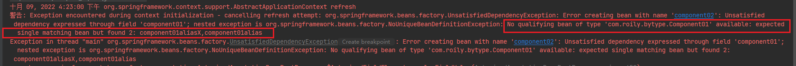


使用@resource也是一样：

```java
@Component
public class Component03 {
    //默认按照类型注入
    @Resource
    Component01 component01;

    /**
     * 通过构造器注入，可以省略@AutoWrite
     * @param component01
     */
    // public Component02(Component01 component01) {
    //     this.component01 = component01;
    // }
}
```

###### byName

> 任何避免以上情况呢？那就指定组件名称即可

结构：

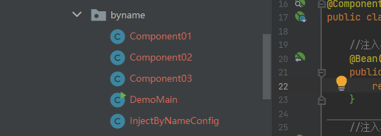

javaconfig：

```java
@Configuration
@ComponentScan("com.roily.byname")
public class InjectByNameConfig {
    //注入名称默认component01
    @Bean("component01aliasX")
    public Component01 component01(){
        return new Component01();
    }
    //注入名称默认component01
    @Bean("component01alias")
    public Component01 component02(){
        return new Component01();
    }
}
```

java类：

```java
public class Component01 {
}
@Component
public class Component02 {

    //默认按照类型注入,如果存在多个同类型不同名bean，需要配合@Qualifier使用
    @Autowired
    @Qualifier("component01alias")
    Component01 component01;

    /**
     * 通过构造器注入，可以省略@AutoWrite
     * @param component01
     */
    // public Component02(Component01 component01) {
    //     this.component01 = component01;
    // }

}
```

测试：

```java
public static void main(String[] args) {
    final ApplicationContext apc = new AnnotationConfigApplicationContext(InjectByNameConfig.class);
    System.out.println();
}
```

debug查看：

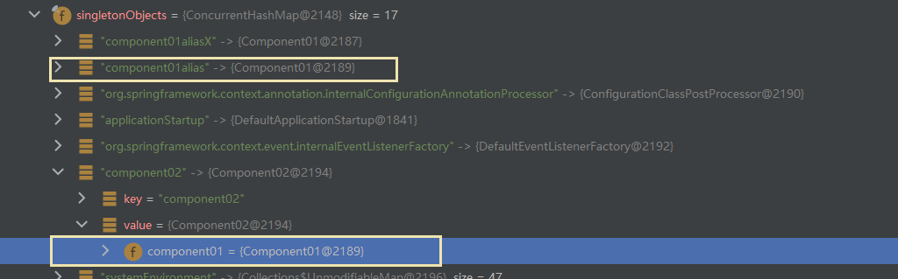

@Resources也是一样：

```java
@Component
public class Component03 {

    //默认按照类型注入,需要指定组件名称则需要配置属性
    @Resource(name = "component01alias")
    Component01 component01;
    /**
     * 通过构造器注入，可以省略@AutoWrite
     * @param component01
     */
    // public Component02(Component01 component01) {
    //     this.component01 = component01;
    // }
}
```

###### constructor

结构：

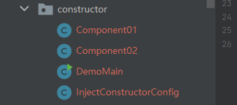


javaConfig：

```java
@Configuration
@ComponentScan("com.roily.constructor")
public class InjectConstructorConfig {
    //注入名称默认component01
    @Bean("component01aliasX")
    public Component01 component01(){
        return new Component01();
    }
}
```

java类：

```java
@Component
public class Component02 {
    Component01 component01;
    /**
     * 通过构造器注入，可以省略@AutoWrite
     *
     * @param component01
     */
    public Component02(/*@Autowired @Qualifier("component01alias")*/ Component01 component01) {
        this.component01 = component01;
    }
}
```

测试：。。。。

如果存在多个同类型不同名bean则需要指定：也就是上面注掉的部分

```java
@Configuration
@ComponentScan("com.roily.constructor")
public class InjectConstructorConfig {
    //注入名称默认component01
    @Bean("component01aliasX")
    public Component01 component01() {
        return new Component01();
    }
    // 注入名称默认component01
    @Bean("component01alias")
    public Component01 component02() {
        return new Component01();
    }
}

@Component
public class Component02 {
    Component01 component01;
    /**
     * 通过构造器注入，可以省略@AutoWrite
     * @param component01
     */
    public Component02(@Autowired @Qualifier("component01alias") Component01 component01) {
        this.component01 = component01;
    }
}
```


### AOP

> 面向切面编程----Aspect  Oriented Programming。

##### 术语

- 连接点(JointPoint)：表示需要在程序中插入横切关注点的扩展点，连接点可以是类的初始化、方法调用、字段调用或异常处理等。在Spring中只支持方法执行连接点，在AOP中表示为在哪干。
- 切入点(PointCut)：选择一组相关连接点的模式


