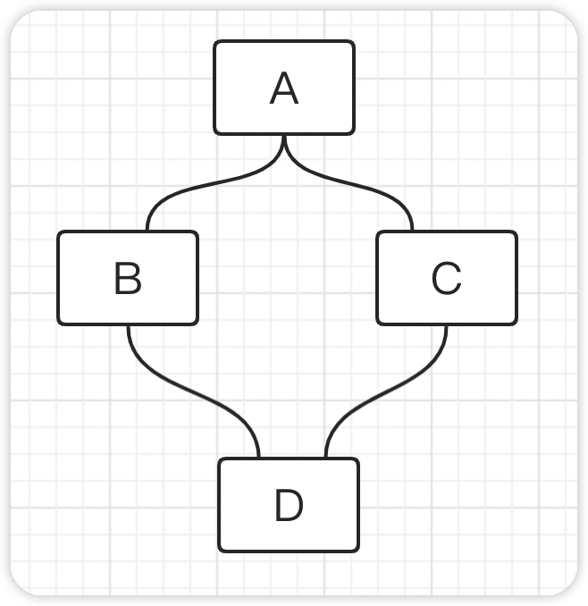
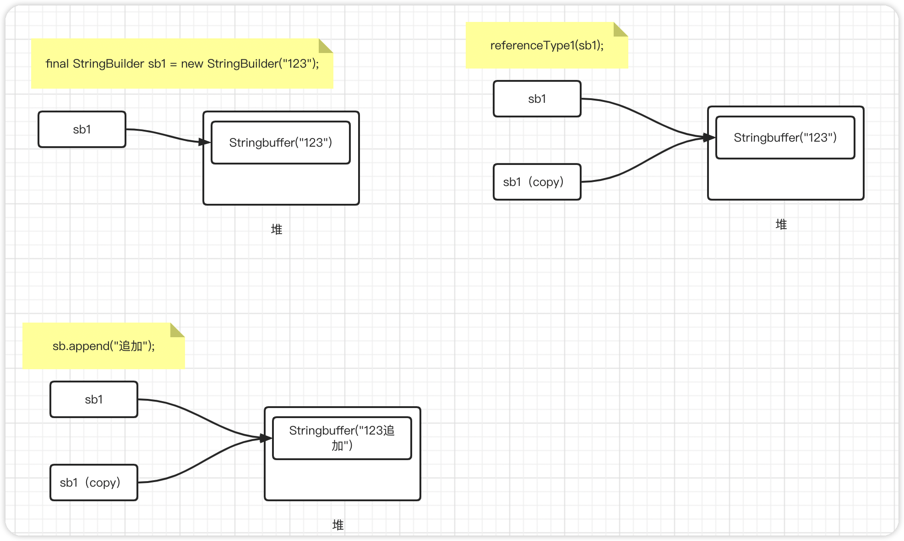
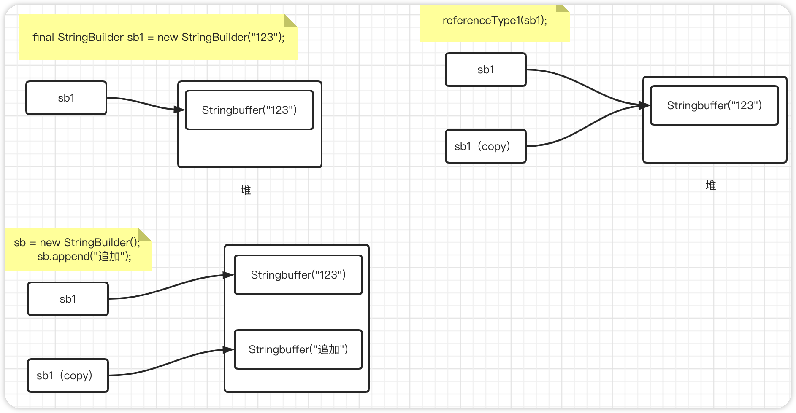
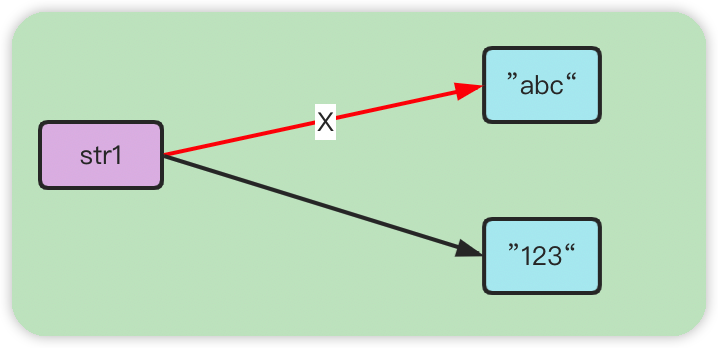
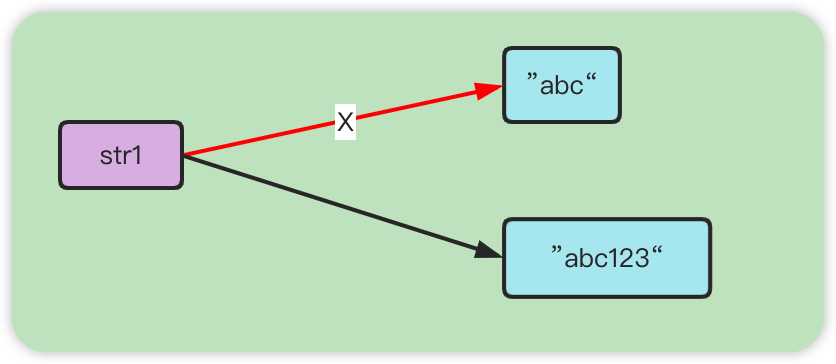

## java成神之路读书笔记

> 借鉴地址Gitee Pages 完整阅读:http://hollischuang.gitee.io/tobetopjavaer
>
> 作者：Hollis ，阿里巴巴技术专家，51CTO 专栏作家，CSDN 博客专家，掘金优秀作者， 《程序员的三门课》联合作者，《Java 工程师成神之路》系列文章作者;热衷于分享计算 机编程相关技术，博文全网阅读量数千万。


### 面向对象

> java是一种面向对象的编程语言

#### 面向过程

> 什么是面向过程？

面向过程(Procedure Oriented)是一种以过程为中心的编程思想，是一种自顶而下的编程模式。简单来说，面向过程的开发范式中，程序员需要把问题分解成一个一个步骤，每个步骤用函数实现，依次调用即可。

面向过程的编程语言以诸多流程控制语句来实现一个功能，整体表现为流程化。

**优缺点**

> 优点

流程化，执行效率高

> 缺点

维护困难，复用性差


#### 面向对象

面向对象（Object Oriented），java是一种面向对象的编程语言。在面向对象的开发过程中，回将某件事情进行抽象，将一件事物的方法属性封装到一个类中，通过多个类之间的组合调用来实现某种功能。


#### 面向对象三大基本特征

> 封装、继承、多态

##### 封装

> 如果一个类希望其他类访问其内部属性存在不同限制，那么我们可以将其方法和属性设置不同的访问权限，这就是封装。

访问级别有以下几种

- public    所有类都可以访问
- protected   受保护的，默认访问级别，同级别包下的类可以访问
- private  私有的，任何其他类都不可以访问，只供其内部访问

> 一般来说如果不是清楚的知道一个类的属性或方法需要被其他类访问，我们会将其设置为私有属性，不对外暴露。


##### 继承

> 继承是java为我们提供的可以实现代码复用的一种能力。可以拥有现有类的所有属性和功能（包括私有属性和私有方法），并且可以在此基础上进行扩展。


##### 多态

> ​	java中的多态指的是同一种操作，作用于不同的实例可以有不同的结果。是一种运行时状态，只有在运行期间才会直到调用的具体方法是什么。
>
> ​	具体表现形式为父类或接口的引用指向子类或实现类的实例。调用父类或接口中定义或声明的方法，会根据传入的不同的子类或实现类来表现不同的逻辑。

多态机制使具有不同内部结构的对象可以共享相同的外部接口。


> 编译期&运行期

编译期指的是，将源代码编译成另一个中间语言，在此期间会做一些代码规范检查，以及编译期间代码优化。

运行期，指的是程序运行在内存中，进行交互。

###### 编译期间多态

> 在编译期间已经明确知道，具体类型，知道调用什么方法。

比如说方法重载、可以通过参数列表的不同确定调用的具体方法。

###### 运行期多态

> 指的是在运行期间才会确认具体类型，才会知道调用的方法，需要`extends``implament`关键字一层一层去找。

比如说使用父类或接口的引用，指向子类或实现类的实例。

```java
public class Demo {
    public static void main(String[] args) throws ClassNotFoundException, InstantiationException, IllegalAccessException {
        Class<?> sonClass = Class.forName("com.roily.booknode.javatogod._01faceobj.extendsiscompile.Son");
        Person son = (Person) sonClass.newInstance();
        son.method1();
        Class<?> daughterClass = Class.forName("com.roily.booknode.javatogod._01faceobj.extendsiscompile.Daughter");
        Person daughter = (Person) daughterClass.newInstance();
        daughter.method1();
    }
}

class Person {
    void method1() {
        System.out.println("method1");
    }
}

class Son extends Person {
    @Override
    void method1() {
        System.out.println("son method01");
    }
}
class Daughter extends Person {
    @Override
    void method1() {
        System.out.println("Daughter method01");
    }
}
```

.assets/image-20220729135114407.png)


#### 重写和重载

> 重写（Overriding）和重载（Overloading）是两个比较重要的概念。

##### 重载

> 指的是在同一个类中，多个方法的方法名称相同而方法签名不同的现象称为重载，这些方法互称为重载方法。

方法签名：方法名+参数列表。（也就是方法名相同，参数列表不同才会构成重载）

返回类型不同不会构成重载。

- 方法名相同，参数列表不同
- 可以改变返回类型
- 可以修改访问修饰符
- 可以声明新的检查异常
- 重载可以发生在一个类中，或在子类和父类中


##### 重写

> 严格意义上指的是子类中定义了和父类相同方法签名，且符合重写要求的方法，那么称子类重写了父类的方法。
>
> 接口声明抽象方法，其实现类实现抽象方法，对应方法上可以加上@OverWriting注解，也可以称为重写，更多的称为实现。

```java
public class OverWriting {
    public static void main(String[] args) {
        final Animal dog = new Dog();
        dog.bark();
    }
}
class Animal {
    void bark() {
        System.out.println("动物叫");
    }
}
class Dog extends Animal {
    @Override
    void bark() {
        System.out.println("狗叫");
    }
}
```

`输出：狗叫`

> 这里子类实例指向父类引用，是多态的表现行式，编译期间会去检查父类中是否存在对应调用方法。而运行期间具体需要调用哪个方法，需要根据具体指向的实例来决定


方法重写的条件需要具备以下条件和要求：

> 两同两小一大

- 两同（方法签名相同）
  - 方法名相同
  - 参数列表相同

- 两小
  - 返回类型的范围需要相等或更小（比如父类返回ArrayList子类就不能返回list）
  - 抛出的检查异常范围要比父类被重写方法要小
- 一大
  - 访问级别限制，比被重写方法访问范围要大(即父类是protected的那么子类重写的方法不能申明为private)

> 其他

- 不能重写被final标识的方法
- 重写的前提是继承

```java
class Person {
    void method1(int a, int b) {
        System.out.println("XX");
    }
    ArrayList<Integer> method2() {
        return null;
    }
}
class Student extends Person {
    /**
     * 两同
     * - 方法名和参数列表相同
     */
    @Override
    void method1(int a, int b) {
        System.out.println("XX");
    }
    /**
     * 两小
     * - 返回参数要比被重写方法要小（范围）
     */
    //@Override
    //List<Integer> method2() {
    //    //通过不了编译
    //    return null;
    //}
}
```

> 子类的返回范围比父类的大，通过不了编译，反过来就行


#### 继承&实现

> 继承的关键字`extends`，实现关键字`implements`。


##### 继承

> 通过继承可以拥有父类的所有属性和方法，实现代码的重用。继承可以发生在类与类之间，这个类可以是具体的也可以是抽象的，同时继承也可以发生在接口与接口之间。

> 如果说可以从某个类中抽出来可以供于公共使用的功能，那么就可以抽出一个父类出来，其他类去继承这个父类，以继承的方式来实现对代码的重用。但前提是这个抽出来的这个父类得保持稳定，也就是少量修改，且这个父类得对其他类都得适用。

一般来说不会使用继承来实现重用，特别是继承至具体的类，如果说非得继承可以继承至抽象类。


##### 实现

> 实现发生在类与接口或抽象类之间，如果说一组业务的处理方式是一样的那么就可以制定抽象（制定标准），具体业务去实现定义的抽象

```java
/**
 * 可以实现一个接口
 */
interface IPerson{
    /**
     * 抽象方法
     */
    void method();
}
class Teacher implements IPerson{

    @Override
    public void method() {
        
    }
}

/**
 * 可以是类实现抽象类的抽象方法
 */
abstract class AbstractPerson{
    
    abstract void method();
    
}
class StudentImpl extends AbstractPerson{
    
    @Override
    void method() {
        
    }
}

/**
 * 可以是抽象类实现接口
 */
abstract class AbstractPersonX implements IPerson{
    @Override
    public void method() {

    }
}
```


#### java单继承

> `java`通过`extends`关键字实现继承，且不支持多继承。

##### 为什么

> 菱形问题：假设B和C都继承自A，B和C都继承了父类A的所有属性和方法，如果java支持多继承的话，此刻有一个D继承自B和C，那么类D就同时拥有类B和类C的所有属性和方法，并且类D继承了两份来自于A的属性和方法，拥有同名属性和相同方法签名的方法是通过不了编译的，且如果通过编译，在调用的时候也会产生歧义。



##### java可以多实现

> java不支持多继承但是支持多实现

如下例子，我们在InterfaceA和InterfaceB中定义了两个同名的方法，然后使用ClassC实现它们，发现实现类对于相同方法只实现了一次。

```java
/**
 * 但是java可以多实现，且java8之后接口中可以定义default方法
 */
interface InterfaceA {
    void method1();
}
interface InterfaceB {
    void method1();
    
    void method2();
}
class ClassC implements InterfaceA, InterfaceB {
    @Override
    public void method1() {
        System.out.println("method1");
    }
    @Override
    public void method2() {
        System.out.println("method2");
    }
}
```

> 对于接口而言它只是一个标准、抽象，实现类按照约定实现标准。方然也可以指定标准，使用某个接口的引用指向实现类的实例。

```java
@Test
public void test1() {
    InterfaceB classC1 = new ClassC();
    InterfaceA classC2 = new ClassC();
}
```

> 接口中可以定义default方法，且我们可以使用Implement从多个接口中继承得到多个默认方法，特别的如果说两个接口存在相同方法签名的方法，实现类会被要求强制重写同名方法签名的方法来解决菱形问题。

```java
interface InterfaceC {
    default void method1() {
        System.out.println("InterfaceC default1方法");
    }
}
interface InterfaceD  {
    default void method1() {
        System.out.println("InterfaceD default1方法");
    }
}
/**
 * 可以使用implement从多个接口中得到多个default方法，
 * 如果存在菱形问题，会强制要求实现类重写同名方法
 */
class ClassD implements InterfaceC, InterfaceD {
    @Override
    public void method1() {
        InterfaceC.super.method1();
    }
}
```


#### 五大基本原则

> ​	面向对象五大基本原则，指导程序员编码，符合五大基本原则的程序，健壮性、可维护性和可扩展性都大大提高。

##### 五大基本原则，都旨在：

- 高内聚、低耦合
- 面向抽象、接口，而不是面向具体、实现

##### 单一职责

> 适用于方法、接口和类。一个类的职责尽量单一，只有一个引起它的变化。

对于方法而言，我们一般都遵守其单一职责原则

对于接口而言，抽象方法尽量要求要少，如果方法太多可以进行接口拆分

对于类而言，一般来说都不会严格遵守单一职责，比如说有一个类UserService，进行堆用户的增删改查，那么这个类想要严格遵守大一职责，完全可以拆分为四个类。

所以说，单一职责尽量遵守，类、接口、方法不要过于臃肿。在业务要求基础之上，合理遵守。


##### 开闭原则

> 对扩展开放、对修改关闭。

1、对扩展开放，意味着有新的需求时，可以在现有代码上进行扩展，以适应新的变化。

2、对修改关闭，当软件或系统一旦设计完成，可以独立完成工作，而不要其进行任何修改的尝试

> 开闭原则的重点在于，面向接口、抽象编程而不是面向实现、具体编程。
>
> 因为抽象也就是接口相对稳定，接口定义了一套标准，如果说接口添加新的抽象方法，那么就必须修改其实现类，所以说对于修改是关闭的。
>
> 而如果说现在有了一个新的需求，可以通过实现现有接口定义一个新的类，配合多态可以对当前系统功能进行扩展，所以说对扩展开放。

> 而不能面向具体，一般来说会以继承或组合的方式实现具体类的复用。具体并没有一套标准，也就是说父类修改对应逻辑，并不会要求子类修改，也就是对修改开放，违背开闭原则。

##### 里氏替换原则

> 里氏替换原则知道我们如何使用继承，是一种编程思想。
>
> 要求软件实体：子类必须能够替换其基类，并且不改变业务逻辑。


###### 里氏替换原则和继承的关系

- 继承

  > 继承是java提供的一种可以实现代码复用的语法，但是继承是侵入式的，如果在继承的过程中子类重写了父类的方法，那么说明父类的方法并不通用。

- 里氏替换原则

  > 里氏替换原则是一种编程思想，用于在指导我们合理使用继承。只有遵守了里氏替换原则，才可以实现继承复用。


##### 依赖倒置原则

> 面向接口编程，依赖于抽象。
>
> 具体定义：高层模块不依赖于底层模块，二者都依赖于抽象；抽象不依赖于具体，具体依赖于抽象。


##### 接口隔离原则

> 将臃肿的大接口拆分为一个个小接口，可以使用接口继承或实现多个接口的方式来实现多个接口定义的抽象方法。
>
> 如果一个接口过于庞大，或存在一些不必要实现的方法时，这是一种接口污染。


#### 继承和组合

> 继承和组合都是java用于实现代码复用的技术之二。优先考虑组合，尽量避免使用继承。

继承

> 继承(Inheritance)是一种联结类与类的层次模型。指的是一个类(子类、子接口)继承另外一个类(父类、父接口)的功能。并且可以增加自己新的功能的能力。继承是一种`AS-a`的关系。

.assets/image-20220729130759731.png)

组合

> 组合(Composition)体现的是整体与部分、拥有的关系，即`has-a`关系。

.assets/image-20220729131252923.png)


##### 组合&继承关系

继承是一种侵入式的代码结构，在继承关系中，父类的内部细节对于子类是可见的（继承是一种白盒式代码复用），如果父类的代码逻辑发生改变，那么如果子类调用了父类的类方法，子类的逻辑也会随之修改，甚至出错。（继承是一种编译期概念，在编译器就确认了类与类的关系）

组合是将现有对象进行拼装组合来实现较复杂的业务逻辑，将对象作为内部的一个属性，组合进来的对象其内部实现细节是不可见的（黑盒式代码复用）。（如果说组合进来的是一个接口或抽象类型，那么在编译期无法确认其具体类型，只有在运行期间才会确认，所以一定程度上复用性更高）


###### 对比

|                             组合                             |                         继承                         |
| :----------------------------------------------------------: | :--------------------------------------------------: |
|            不会破坏封装，整体类与局部类之间松耦合            | 破坏封装，子类依赖于父类，表现为父类与父类之间前耦合 |
|         组合进来的可以是一个抽象，因此具有一定扩展性         |                   可通过定义新方法                   |
| 整体类对组合进来的类进行包装，并可以做一些拓展，就是装饰器模式和代理模式 |                                                      |
|             创建整体对象的时候，必须创建局部对象             |           创建子类对象，会自动创建父类对象           |
|                                                              |                                                      |


##### 如何选择

> 多用组合、少用继承。

- 在同等情况下优先选择组合，利于扩展
- 继承也有用处，如果当前类必须要向基类进行向上转型，则可以考虑使用继承


#### 构造函数和默认构造函数

> 构造函数配合`new`关键字，用于创建实例对象和给成员变量赋值。

> 构造函数长什么样子？

构造函数和普通方法很相似，①构造函数名为类名②构造函数不声明返回类型，返回当前类对象

> 构造函数的重载

构造函数根据参数列表的不同可以实现重载。并且可以为特殊属性给与默认值。

```java
class Person{
    int age;
    String name;
    String address;
    Boolean sex;
    
    private Person(int age, String name, String address, Boolean sex){
        this.age = age;
        this.name = name;
        this.address = address;
        this.sex = sex;
    }
    public Person(int age, String name, String address){
        return Person(age,name,address,false);
    }
}
```


> 如果当前类没有构造函数，编译器会自动生成一个无参构造函数。其成员变量会被赋予默认值。

##### 如果没有构造函数

> 会生成默认构造函数

```java
public class ConstructorTest {
    int i;
    String str;
}
```

反编译后：

```java
public class ConstructorTest{
    public ConstructorTest(){
    }
    int i;
    String str;
}
```

##### 如果存在构造函数

> 会使用定义的构造函数，此刻空参构造函数不可用。

```java
class ConstructorTest2 {
    int i;
    String str;
    public ConstructorTest2(int i) {
        this.i = i;
    }
}
```

反编译后：

```java
class ConstructorTest2{
    public ConstructorTest2(int i){
        this.i = i;
    }
    int i;
    String str;
}
```


#### 类变量、成员变量和局部变量

> `java`中如果从，生命周期，作用域和内存角度去看，`java`的变量分为，类变量、成员变量和局部变量。

##### 类变量

> 类变量被`static`修饰，属于类，生命周期等同于类的生命周期，当一个类被类加载器成功加载到方法区，其就已经存在与方法区。当类被卸载的时候也跟着消失。

##### 成员变量

> 成员变量属于实例，生命周期等同于实例，当一个实例被new出来(或反射等其他方式)，会为其赋值，跟随实例存在于堆内存中。当实例对象被回收时，他也跟着消失。

##### 局部变量

> 局部变量存在于栈内存，一般存在于方法参数，循环体或方法中。

```java
public class Demo2 {
    //类变量
    final static String str1 = "abc";
    static String str2 = "abc";
 
    //成员变量
    String str3 = "abc";

    //局部变量
    void method01(String str1) {
        String str2 = "abc";
        for (StringBuilder str = new StringBuilder("abc"); str.toString().equals("abc"); ) {
        }
    }
}
```


#### 访问修饰符

- public  

> 公开的，被public修饰的成员变量和方法对所有类都是可见的，所有类和对象都可以直接访问

- private

> 私有的，被private修饰的成员变量和方法是私有的，只有当前类有访问权限。即便是子类也不可以访问

- protected

> 受保护的，被protected修饰的成员变量和方法是受保护的的，只有当前类和与其处于同一包下的类有访问权限。除非是子类

- default

> 默认的，被default修饰的成员变量和方法是受保护的的，只有当前类和与其处于同一包下的类有访问权限。即便是子类

```java
package com.roily.booknode.javatogod._01faceobj.extendsiscompile;

public class Demo3 {
    public String str1;
    String str2;
    private String str3;
    protected String str4;
}
```

子类不在同一个包下：

```java
package com.roily.booknode.javatogod._01faceobj;

import com.roily.booknode.javatogod._01faceobj.extendsiscompile.Demo3;
public class TestDemo extends Demo3{
    void method1(){
        System.out.println(str1);
        System.out.println(str4);
    }
}
```

> 可见如果不指定属性和方法的访问级别的话，默认为default。


#### java的值传递

> `java`关于关于参数的传递只有值传递，在传递参数的时候会将参数进行拷贝，在方法体中操作的都是拷贝的参数。

##### 形参、实参

> 形参：在定义方法的时候使用的参数，[参数类型+形参名称]，目的是为了接收参数
>
> 实参：在抵用方法的时候，被调方法会被传入一个参数 [参数名]，这个参数就叫实参

```java
/**
 * @param str 形参
 */
void method(String str) {
}
void method2() {
    /**
     * 123  实参
     * str  实参
     */
    method("123");
    String str = "123";
    method(str);
}
```


##### 为什么说java只有值传递

> 对于基本数据类型来说，它只有值的概念，所以对于基本数据类型的值传递没有任何异议。
>
> 对于引用数据类型来说，在对引用类型的参数进行传递的时候，会将参数进行拷贝，在方法体内实际操作的是拷贝的副本，如果我们没有改变引用关系而直接操作属性，是会对原对象有影响的，应为两个引用指向的是同一个对象。

例：

```java
/**
 * 基本数据类型，只有值的概念
 *
 * @param i
 */
void simpType(int i) {
    i = 999;
}

void referenceType1(StringBuilder sb) {
    sb.append("追加");
}

void referenceType2(StringBuilder sb) {
    sb = new StringBuilder();
    sb.append("追加");
}

@Test
public void test1() {
    System.out.println("基本数据类型");
    int i = 1;
    System.out.println("原值：" + i);
    simpType(i);
    System.out.println("修改后：" + i);

    System.out.println("引用数据类型，未修改引用");
    final StringBuilder sb1 = new StringBuilder("123");
    System.out.println("原值：" + sb1.toString());
    referenceType1(sb1);
    System.out.println("修改后：" + sb1.toString());

    System.out.println("引用数据类型，修改引用");
    final StringBuilder sb2= new StringBuilder("123");
    System.out.println("原值：" + sb2.toString());
    referenceType2(sb2);
    System.out.println("修改后：" + sb2.toString());
}
```

.assets/image-20220730124812628.png)

- 对于基本数据类型来说，值传递没有异议

原始参数通过值传递给方法。这意味着对参数值的任何更改都只存在于方法的范围内。当方法返回时，参数将消失，对它们的任何更改都将丢失

- 对于引用数据类型来说

也就是说，引用数据类型参数(如对象)也按值传递给方法。这意味着，当方法返回时，传入的引用仍然引用与以前相同的对象。但是，如果对象字段具有适当的访问级别，则可以在方法中更改这些字段的值

> 引用类型传递的时候发生了什么？

void referenceType1(StringBuilder sb)方法



void referenceType2(StringBuilder sb)方法




<hr>


### java基础

#### 8大基本数据类型

> Java中有8种基本数据类型分为三大类。

- 字符型

char

- 布尔型

boolean

- 数值型

1.整型：byte、short、int、long

2.浮点型：float、double


##### 取值范围

> 在`java`中整数类型属于有符号类型，第一位用来表示符号0代表整数1代表负数。

比如说byte类型，占1字节8位，那么他的表示范围为：

最大值：0111 1111  (2^7^-1)

最小值：1000 0000  (-2^7^)

> 这里会有一个疑问？ 1000 0000 为什么 表示-2^7^呢？不是 -0么？

第一点：在计算机中，数据的运算是以补码进行的[源码反码补码](https://juejin.cn/post/7092566574816559111)

第二点：为了防止 +0 和-0的出现，约定了 补码 1000 0000代表 -128 且移除 -0概念

以一个找规律的方式解释：

| 原码      | 反码      | 补码         | 值（10进制） |
| --------- | --------- | ------------ | ------------ |
| 0111 1111 | 0111 1111 | 0111 1111    | 127          |
| 0000 0000 | 0000 0000 | 0000 0000    | 0            |
| ......    | ......    | ......       | ......       |
| 1000 0001 | 1111 1110 | 1111 1111    | -1           |
| 1000 0010 | 1111 1101 | 1111 1110    | -2           |
| 1000 0011 | 1111 1100 | 1111 1101    | -3           |
|           |           | 补码不断减一 |              |
| 1111 1111 | 1000 0000 | 1000 0001    | -127         |
| 无法表示  | 无法表示  | 1000 0000    | -128         |

###### 整型

> 取值范围

| 数据类型 | 字节数、位数 | 范围                  |
| -------- | ------------ | --------------------- |
| byte     | 1字节、8位   | 【-128，127】         |
| short    | 2字节、16位  | 【-2^15^, 2^15^-1】   |
| Int      | 4字节、32位  | 【-2^31^  , 2^31^-1】 |
| long     | 8字节、64位  | 【-2^63^,  2^63^-1】  |
|          |              |                       |

> 溢出问题

由于整型的存储空间是有限的，那么就会存在溢出问题

这是因为int只占32位

0111 1111

0111 1111   +

-------------------------

1111 1110（补）=》 1111 1101(反) =》1000 0010(原)   =  -2

```java
/**
 * 溢出问题
 */
@Test
public void test2() {
    final int value = Integer.MAX_VALUE + Integer.MAX_VALUE;
    System.out.println(value);
}
```

.assets/image-20220730161454604.png)

###### 浮点数

[定点数&浮点数](https://juejin.cn/post/7126230681465651230/)

java为我们提供了float和double两个浮点数数据类型，分别占4字节32位和8字节64位。

相较于float(单精度),double(双精度)其表示的范围更大，且精度更高。

> 存储结构

float:        1位符号位，8位指数位，23位尾数位

double： 1位符号位，11位指数位，52位尾数位

> 浮点数存在精度问题，对于金额有严格精度要求的业务，不可使用浮点数来表示金额。


##### 自动装箱与拆箱

> 八大基本数据类型自动装箱与自动拆箱。八大基本数据类型都有对应的对象类型，自动装箱拆箱的意思就是在需要基本数据类型需要转化为对应的包装类型的时候不需要程序员主动的去操作，而是编译器会自动帮我们去做。

除了`int`对应的包装类型为`Integer`，``char`对应包装类型为`Character`外其他基本数据类型对应的包装类型都为对应基本数据类型首字母大写。

> `Java`是一种面向对象的编程语言，一切皆对象，为何需要基本数据类型？

基本数据类型，相较于对象类型运算简单。

> 包装类型存在的意义？

基本数据类型的包装类型，不仅仅只有值的概念，其扩展了额外的方法(比如equals)。且对于集合框架来说，需要的是对象类型，我们无法将基本数据类型放进去。


###### 装箱&拆箱

> 装箱

```java
int i = 10;
Integer i2 = new Integer(i);
或
Integer i2 = Integer.valueOf(i);
```

> 拆箱

```java
Integer i = new Integer(10);
int i2 = i.intValue();
```


###### 自动装箱拆箱

> 基本数据类型在需要转化为对应包装类型的时候，无需程序员手动操作

```java
Integer i = 10;
int i2 = i;
```

对其进行反编译可以发现确实自动帮我们转化了：

.assets/image-20220731161053533.png)

> 还有就是集合的泛型是一个对象类型，但是我们在编码的时候可以直接将基本数据类型放入，因为编译器会帮我们自动装箱。

```java
List<Integer> ints = new ArrayList<>();
ints.add(10);
```

反编译看：

.assets/image-20220731161803912.png)

###### 问题

> 自动装箱与拆箱虽然给我们编码带来了方便，但也会有一些问题。

- 对于基本数据类型来说，我们只关心其数值，在自动装箱过后，超过缓存范围的包装类型，必须使用equals判等。不可使用 `==`
- 将包装类型拆箱的过程中，可能胡出现空指针异常(NPE)

```java
Integer methodRe(){
    return null;
}
@Test
public void testRe(){
    int i = methodRe();
}
```


##### 基本数据类型的池化技术

> 基本数据类型（除了double、float）都有缓存技术，会缓存一定范围内的对象，原因就是`jvm`认为在此范围内的对象很常用，在需要使用的时候直接去池中拿取，而无需重新创建。


###### 缓存范围

除了`Character`没有负数概念，其缓存范围为：【0,127】,Boolean缓存范围 {true,false}

其他都是：【-128,127】

> 需要注意的是Integer的缓存范围是可配置的，其他的是固定的。

```java
@Test
public void testCache() {

    System.out.println("========char==========");
    Character c1 = 127;
    Character c2 = 127;
    Character c3 = 128;
    Character c4 = 128;
    System.out.println(c1 == c2);
    System.out.println(c3 == c4);

    System.out.println("========byte==========");
    Byte b1 = 127;
    Byte b2 = 127;
    Byte b3 = -128;
    Byte b4 = -128;
    System.out.println(b1 == b2);
    System.out.println(b3 == b4);

    System.out.println("========short==========");
    Short s1 = 127;
    Short s2 = 127;
    Short s3 = -129;
    Short s4 = -129;
    System.out.println(s1 == s2);
    System.out.println(s3 == s4);

    System.out.println("========int==========");
    Integer i1 = 127;
    Integer i2 = 127;
    Integer i3 = -129;
    Integer i4 = -129;
    System.out.println(i1 == i2);
    System.out.println(i3 == i4);

    System.out.println("========long==========");
    Long l1 = 127L;
    Long l2 = 127L;
    Long l3 = -129L;
    Long l4 = -129L;
    System.out.println(l1 == l2);
    System.out.println(l3 == l4);
  
    System.out.println("========Boolean==========");
    Boolean bb1 = false;
    Boolean bb2 = false;
    System.out.println(bb1 == bb2);
}
```

.assets/image-20220731163829088.png)


###### new关键字

> 特别的，如果使用`new`关键字创建包装类型，其不会存放于缓存池中，而是存放于堆内存中

```java
@Test
public void testCache2() {
    Integer i1 = new Integer(128);
    Integer i2 = 128;
    System.out.println(i1 == i2);
    System.out.println("equals方法：" + i1.equals(i2));
}
```

.assets/image-20220731163644314.png)


###### 问题

> 池化技术可有效的节省内存空间，但是也会给我们带来一些问题。对于基本数据类型我们一般来说只关心其数值的大小，并不会去关心其对象具体。所以说对于基本数据类型的判等一般采用equals方法，这样即便数据超过缓存范围也可以准确判断。


###### 谁负责缓存

> java中会有专门的类负责缓存

有ByteCache用于缓存Byte对象

有ShortCache用于缓存Short对象

有LongCache用于缓存Long对象

有CharacterCache用于缓存Character对象

有IntegerCache用于缓存Integer对象


##### 对于boolean属性如何命名及返回值如何定义

> `Boolean`作为实体类的属性的时候如何命名？`success`or `isSuccess`?，`Boolean`作为方法返回参数的时候使用基本类型还是包装类型？


###### boolean作为属性

> 我们测试`Boolean`作为属性？其生成的`getter`和`setter`方法是什么样子的，对RPC框架有什么影响。

存在四种情况：

```java
Boolean success;
Boolean isSuccess;
boolean success;
boolean isSuccess;
```

分别举例：

> 使用Lombok自动生成getter和setter方法，编译查看对应代码

```java
@Data
class BooleanType1{
    boolean success;
}
@Data
class BooleanType2{
    boolean isSuccess;
}
@Data
class BooleanType3{
    Boolean success;
}
@Data
class BooleanType4{
    Boolean isSuccess;
}
```

> 编译后查看：

```java
class BooleanType1 {
    boolean success;
    public boolean isSuccess() {
        return this.success;
    }
    public void setSuccess(boolean success) {
        this.success = success;
    }
}
class BooleanType2 {
    boolean isSuccess;
    public boolean isSuccess() {
        return this.isSuccess;
    }
    public void setSuccess(boolean isSuccess) {
        this.isSuccess = isSuccess;
    }
}
class BooleanType3 {
    Boolean success;
    public Boolean getSuccess() {
        return this.success;
    }
    public void setSuccess(Boolean success) {
        this.success = success;
    }
}
class BooleanType4 {
    Boolean isSuccess;
    public Boolean getIsSuccess() {
        return this.isSuccess;
    }
    public void setIsSuccess(Boolean isSuccess) {
        this.isSuccess = isSuccess;
    }
}
```

这里可以发现如果属性是基本数据类型的`boolean`生成的getter和setter方法是:isXXXX()和setXXX();

如果是包装类型生成的getter和setter方法是getXXX()和setXXX()

这里可以发现，如果是基本数据类型`boolean`作为属性的话，属性名success和isSuccess其对应的getter和setter方法是相同的。那么如果我们的属性名是isSuccess的话，在部分RPC框架中，得到的getter方法是isSuccess()，会误认为对应的属性名称是success，会导致获取不到属性，从而报出异常。

> 所以说对于实体类如果存在Boolean数据类型的属性，使用包装类型。

###### boolean对序列化的影响

> 使用FastJson  JACKSON、GSON这几个常见JSON序列话对比区别。

> 同样的对于基本数据类型的boolean，对不同的序列话工具会有不同的结果。而对于包装类型则没有影响。

fastjson和jackson是通过反射得到所有的getter方法（getXXX或isXXXX），然后认为 XXXX就是字段名称，并得到对应的值，直接序列化成对应JSON字符串。

Gson则是通过反射，遍历对象对应类的属性，再序列话成json字符串。

```java
@Test
public void test() throws JsonProcessingException {

    Gson gson = new Gson();
    ObjectMapper om = new ObjectMapper();

    BooleanType1 booleanType1 = new BooleanType1(true);
    System.out.println("booleanType1");
    System.out.println("FastJson:boolean success: => " + JSON.toJSON(booleanType1));
    System.out.println("Gson:boolean success: => " + gson.toJson(booleanType1));
    System.out.println("JackSon:boolean success: => " + om.writeValueAsString(booleanType1));

    BooleanType2 booleanType2 = new BooleanType2(true);
    System.out.println("booleanType2");
    System.out.println("FastJson:boolean isSuccess: => " + JSON.toJSON(booleanType2));
    System.out.println("Gson:boolean isSuccess: => " + gson.toJson(booleanType2));
    System.out.println("JackSon:boolean isSuccess: => " + om.writeValueAsString(booleanType2));

    BooleanType3 booleanType3 = new BooleanType3(true);
    System.out.println("booleanType3");
    System.out.println("FastJson:Boolean success: => " + JSON.toJSON(booleanType3));
    System.out.println("Gson:Boolean success: => " + gson.toJson(booleanType3));
    System.out.println("JackSon:Boolean success: => " + om.writeValueAsString(booleanType3));

    BooleanType4 booleanType4 = new BooleanType4(true);
    System.out.println("booleanType4");
    System.out.println("FastJson:Boolean isSuccess: => " + JSON.toJSON(booleanType4));
    System.out.println("Gson:Boolean isSuccess: => " + gson.toJson(booleanType4));
    System.out.println("JackSon:Boolean isSuccess: => " + om.writeValueAsString(booleanType4));
}
```

.assets/image-20220801145946307.png)

> 对于boolean isSuccess 不同的JSON序列化工具，生成的JSON字符串并不是一样的。那么如果对于同一对象使用不同序列化工具序列化和反序列化会产生什么结果？

```java
@Test
public void testSer() throws IOException {

    BooleanType2 booleanType2 = new BooleanType2(true);
    //使用fastjson序列话
    String jsonStr = JSON.toJSONString(booleanType2);
    System.out.println("json字符串：=》" + jsonStr);
    //分别使用 fastJson 、 GSON  、 JackSon反序列化
    BooleanType2 t1 = JSON.toJavaObject(JSON.parseObject(jsonStr), BooleanType2.class);
    System.out.println("FastJson反序列化后=》" + t1);

    ObjectMapper om = new ObjectMapper();
    BooleanType2 t2 = om.readValue(jsonStr, BooleanType2.class);
    System.out.println("Jackson反序列化后=》" + t2);

    Gson gson = new Gson();
    BooleanType2 t3 = gson.fromJson(jsonStr, BooleanType2.class);
    System.out.println("Gson反序列化后=》" + t3);
}
```

.assets/image-20220801152221308.png)

> 还是Gson出现的问题，对于同一个类，使用不同的序列化工具进行，序列话和反序列化，对象会产生前后不一致问题。

同样的对于fastjson和jackson来说，会根据success通过反射来找对应得setter方法，将属性set进去。而Gson会通过反射去找success属性，发现没找打，那么就只能赋予默认值false。

> 又一次证明了只能使用success而不可以使用isSuccess

###### Boolean  or   boolean

> 编码得时候使用Boolean  还是 boolean

- 对于实体类的属性，一律使用包装类型
- 对于远程调用的接口来说，必须使用包装类型。避免默认值的出现
- 对于局部变量来说使用基本数据类型

###### 小结

> 对于布尔值如何命名和使用success还是isSuccess。

第一：布尔值命名必须去掉 is

第二：除了局部变量，其他地方一律使用包装类型

#### String

> `String`在`java`中很常用，看似简单，也有很多知识点。

##### 不可变性

对象的不可变性指的是什么？

对象的不可变性指的是在对象创建完成，我们不可以调用方法来修改其属性。


######  现象

> 在编程中我们常常通过等号和加号来"修改"字符串的值，为什么还是不可变得呢？

比如：

```java
String str1 = "abc";
str1 = "123";
//
String str1 = "abc";
str1 += "123"; 
```

这不是修改了么？

> 这里两种方式好像都修改了str1的值，其实是修改了str1的引用，将str1指向了一个新的字符串对象。
>
> 对于字符串相加，回收先得到相加后的结果，创建对应字符串，然后赋予引用。

图示：






###### String为什么是不可变的

> 简单理解一下为什么String不可变

打开`String`类的源码，可以发现`String`底层是一个字符数组，且该属性被`final`修饰：

```java
private final char value[];
```

那么此刻自然就想到被`final`修饰的对象不可变。

> 其实被`final`修饰的对象不可变指的是，不可以修改其引用，如果说我可以通过调用对象提供的修改方法那么完全是可以修改的。


那么String类不可变的真正原因是什么呢？

- 首相String类被final修饰，也就是不可以被继承，我们知道继承及侵入式的，不可以继承那么就没有子类可以破坏其不可变性。（不仅仅是String八大基本数据类型的包装类型都是fianl的）
- String类底层是一个字符数组，其作为String的属性，被private修饰，也就是不提供外部访问
- String类底层是一个字符数组，其作为String的属性，被final修饰，不可修改字符数组引用
- 最后一点也是最重要的，String类中未提供任何修改其字符数组的方法（无论是私有的还是公开的），其内部方法返回的都是一个String


###### String真的不可变吗

> 我们直到`Java`提供了一个很强大的机制，就是反射，那么我们是否可以通过反射来破坏String底层数组的private和final呢？

写一个测试案例：可以通过反射来修改被fianl修饰的属性

```java
@Test
public void testFinal() throws NoSuchFieldException, IllegalAccessException {
  TestFinal testFinal = new TestFinal();
  System.out.println(testFinal.sb + ":" + VM.current().addressOf(testFinal.sb));
  final Field sb = testFinal.getClass().getDeclaredField("sb");
  final StringBuilder abc = new StringBuilder("abc");
  //反射破坏不可修改
  sb.setAccessible(true);
  sb.set(testFinal, abc);
  System.out.println(testFinal.sb + ":" + VM.current().addressOf(testFinal.sb));
}
class TestFinal {
    final StringBuilder sb = new StringBuilder("123");
}
```

结果很意外，被final修饰的属性其值可以被改变，且其内存地址也发生了改变，也就是sb的引用也别修改了

.assets/image-20220731214248215.png)

同理我们尝试修改String的字符数组：

```java
/**
 * 我们都知道String其内部是字符数组，且是私有的，那么我们是否可以通过反射修改其私有属性
 */
@Test
public void test3() throws NoSuchFieldException, IllegalAccessException {
    String str = "123";
    System.out.println(str + ":" + VM.current().addressOf(str));

    final Field value = str.getClass().getDeclaredField("value");
    value.setAccessible(true);
    value.set(str, "abc".toCharArray());
    System.out.println(str + ":" + VM.current().addressOf(str));

    String str2 = "123";
    System.out.println(str2 + ":" + VM.current().addressOf(str2));

    String str3 = "abc";
    System.out.println(str3 + ":" + VM.current().addressOf(str3));
}
```

> 结果有令人很惊讶

- 可以修改String的属性字符数组的值，且不会修改其引用
- String str2 = "123";为何值为”abc“，这里我只能猜测，String的缓存池中记录着这么一个 ”123“字符串，但是其内部的字符数组指向的是['a','b','c']

.assets/image-20220731215113520.png)


###### String为什么设计成不可变的

> 


- 缓存池

  > String是很常用的，为了避免频繁创建相同的字符串，JVM特地在堆内存中开辟了一块空间叫字符串缓存池，专门用于缓存已创建的字符串。

  如果说需要的字符串在缓存池中存在，那么直接去缓存池中取即可，不用再去创建。

- 安全

  > 字符串用于存储的内容还是很广泛的，密码、url、账号信息等等，如果说String可以很容易的被改变，那么整个系统奖没有可信度可言了。

- 线程安全

  > 线程安全性问题，只出现在可修改的数据上，String不可变那么自动保证线程安全。

- 拷贝安全

  > 我们知道在深拷贝的时候，需要考虑对象属性的拷贝，以不影响原型对象，而String不可变在拷贝的时候无需考虑他的拷贝。

- hash缓存

  > 当字符串作为哈希实现的key值的时候。在对这些散列实现进行操作时，经常调用hashCode()方法。
  >
  > 不可变性保证了字符串的值不会改变，其哈希值也不会变，只有在首次哈希的时候会计算哈希值，之后会直接去取已计算的哈希值。

  ```java
  /** Cache the hash code for the string */
  private int hash; // Default to 0
  public int hashCode() {
      int h = hash;
      if (h == 0 && value.length > 0) {
          char val[] = value;
          for (int i = 0; i < value.length; i++) {
              h = 31 * h + val[i];
          }
          hash = h;
      }
      return h;
  }
  ```

###### 小结

> 以上提到的String的缓存池技术，hashCode()缓存技术，都旨在与提高性能，因为String是非常常用的数据类型，对于它的性能即便是小小的提升，映射到整个java生态中，也是庞大的提升。


##### substring

> 介绍subString方法的原理，以及在jdk6和jdk6之后版本中的不同之处，jdk6中的substring方法的问题


###### JDK6中substring的实现原理

> String底层是一个字符数组，在jdk6中String有三个成员变量：`char value[]` `int offset` `int count`。分别表示字符数组、起始下标、字符个数。

```java
String(int offset, int count, char value[]) {
    this.value = value;
    this.offset = offset;
    this.count = count;
}

public String substring(int beginIndex, int endIndex) {
    //check boundary
    return  new String(offset + beginIndex, endIndex - beginIndex, value);
}
```

在调用substring方法的时候会返回一个新的string对象，但其内部的字符数组引用任然指向原堆中的字符数组，只不过其实下标和字符数量不同。

图示：

.assets/image-20220731235844909.png)


###### JDK6中substring存在的问题

> 由于截取的字符串和原字符串引用的是同一个字符数组，如果原字符串很大，但是截取的部分很小，那么就会导致，原来很长的字符串所指向的字符数组即便不会使用也一直会被引用，就会无法回收，导致内存泄漏。 还有就是效率问题，我只需要截取一小段，却引用了整个字符数组。
>
> 解决方式是截取后的字符串重新创建一个字符串。

```java
x = x.substring(x, y) + ""
```


###### jdk7对于sbustring的优化

> 优化方式是调用sbustring方法生成的字符串其内部字符数组的引用，指向一个新创建的字符数组。

```java
//JDK 7
public String(char value[], int offset, int count) {
    //check boundary
    this.value = Arrays.copyOfRange(value, offset, offset + count);
}

public String substring(int beginIndex, int endIndex) {
    //check boundary
    int subLen = endIndex - beginIndex;
    return new String(value, beginIndex, subLen);
}
```

.assets/image-20220801000754715.png)


##### replcae

```java
//将所有的replacement字符替换为target字符
public String replace(CharSequence target字符, CharSequence replacement) {
    return Pattern.compile(target.toString(), Pattern.LITERAL).matcher(
            this).replaceAll(Matcher.quoteReplacement(replacement.toString()));
}
//将所有的replacement字符串替换为target字符串
public String replaceAll(String regex, String replacement) {
    return Pattern.compile(regex).matcher(this).replaceAll(replacement);
}
//将首个replacement字符串替换为target字符串
public String replaceFirst(String regex, String replacement) {
    return Pattern.compile(regex).matcher(this).replaceFirst(replacement);
}
```


##### 字符串拼接


###### 通过+拼接

> 字符串通过`+`拼接的原理

```java
public void test1() {
  String str1 = "abc" + "123";
  System.out.println(str1);
}

void method(String str1, String str2) {
  final String strX = str1 + "," + str2;
}
```

反编译后：

```java
public void test1() {
  String str1 = "abc123";
  System.out.println(str1);
}

void method(String str1, String str2) {
  (new StringBuilder()).append(str1).append(",").append(str2).toString();
}
```

- 对于编译时期就知道字面量的字符串，进行常量折叠
- 对于编译器不确定的变量，会使用StringBuilder.append拼接


###### 通过concat拼接

> 会重新生成一个字符串对象，其内部的字符数组也是通过ArrayCopy新拷贝出来的。

```java
public String concat(String str) {
    int otherLen = str.length();
    if (otherLen == 0) {
        return this;
    }
    int len = value.length;
    char buf[] = Arrays.copyOf(value, len + otherLen);
    str.getChars(buf, len);
    return new String(buf, true);
}
```


###### StringBuffer&StringBuilder

> 可以使用在这两类对字符串进行拼接，最后toString返回即可

###### 第三方工具类

> StringUtils，可以使用Spring提供的也可以是apache提供的，都是一个用法，将一个String数组或集合，以某个字符分割拼接

```java
@Test
public void testAppendByUtil(){
    String[] value = {"hello", "你好", "hello"};
    String result = StringUtils.join(value, ",");
    System.out.println(result);
}
```

hello,你好,hello


###### String的join方法


```java
@Test
public void testAppendByStr(){
    String join = String.join(",", "hello", "你好", "hello", "4");
    System.out.println(join);
}
```

hello,你好,hello,4


###### 性能对比

```java
@Test
public void testAppend() {
    StopWatch stopWatch = new StopWatch();
    stopWatch.start("使用+拼接字符串");//任务说明
    String str1 = "";
    for (int i = 0; i < 50000; i++) {
        //str1 += "a";  拼接代码
    }
    stopWatch.stop();
    System.out.println(stopWatch.getLastTaskName() +"消耗时长："+stopWatch.getTotalTimeNanos());
}
```

```java
使用+拼接字符串消耗时长：1942387300
使用StringBuilder拼接字符串消耗时长：2846001
使用StringBuffer拼接字符串消耗时长：4217800
使用concat拼接字符串消耗时长：5055200
使用StringUtils  join拼接字符串消耗时长：39924299
```

结果是：StringBuilder > StringBuffer  >  concat> StringUtils > `+`

> StringBuffer  append方法基于StringBuilder实现，同时也是同步的，性能差一点点。

> concat每次循环，都会进行数组拷贝，创建新字符串，性能差点。但也是为了保证字符串的不可变性

> StringUtils底层使用的StringBuilder实现，拼接过程存在很多其他操作，回去判断对象是否为空等，性能也差点

> `+`号是我们很常用的，性能却最差，这是为什么呢？

查看使用`+`拼接字符串的反编译后的代码：

> 发现每次循环都会new一个StringBuilder出来，再进行append，性能自然不会很高了。频繁的创建对象，也是对内存资源的浪费。

```java
void append1() {
    StopWatch stopWatch = new StopWatch();
    stopWatch.start("使用+拼接字符串");
    String str1 = "";
    for (int i = 0; i < 50000; i++) {
        str1 += "a";
    }
    stopWatch.stop();
    System.out.println(stopWatch.getLastTaskName() + "消耗时长：" + stopWatch.getTotalTimeNanos());
}
```

```java
void append1()
{
    StopWatch stopWatch = new StopWatch();
    stopWatch.start("\u4F7F\u7528+\u62FC\u63A5\u5B57\u7B26\u4E32");
    String str1 = "";
    for(int i = 0; i < 50000; i++)
        str1 = (new StringBuilder()).append(str1).append("a").toString();

    stopWatch.stop();
    System.out.println((new StringBuilder()).append(stopWatch.getLastTaskName()).append("\u6D88\u8017\u65F6\u957F\uFF1A").append(stopWatch.getTotalTimeNanos()).toString());
}
```

###### 小结

> 对于循环体内字符串的拼接禁止使用`+`，采用`StringBuilder`的`append`的方式进行字符串拼接。有并发需求时，使用`StringBuffer`代替`StringBuilder`。


##### StringBuffer & StringBuilder

> String是不可变的，java还为我们提供了两个可变的用于操作字符串的类，StringBuffer  & StringBuilder

StringBuilder和StringBuilder都是AbstractStringBuilder的子类。底层也是字符数组，使用一个成员变量count来表示字符数组已使用的字符数。

```java
char[] value;

int count;
```

> StringBuilder是非线程安全的，StringBuffer是线程安全的（使用Synchronized保证）。


##### String.valueOf  & Intege.toString

> 将一个`Integer`转化为`String`有几种方式？

```java
@Test
public void test(){
    int i = 10;
    String str1 = i + "";
    String str2 = Integer.valueOf(i).toString();
    String str3 = String.valueOf(10);
}
```

> 第一种方式使用`StringBuilder`

```java
String str1 = (new StringBuilder()).append(i).append("").toString();
```

> 第二种和第三种都是使用`Integer.toString()`


##### switch支持String

> jdk7之后`switch`添加了对`String`的支持。
>
> `switch`目前支持的类型有Character, Byte, Short, Integer, String, or an enum，`switch`真正意义上只支持整型，对于`Character`会转化成ASCII码，ASCII是一个`int`类型的数据。`String`会优先通过`hashCode`判断，然后再通过`equals`进行安全检查，`hashCode`也是`int`类型的

###### int&short&byte

代码：

```java
@Test
public void testInt() {
    int i = 10;
    switch (i) {
        case 1:
            System.out.println(1);
            break;
        case 2:
            System.out.println(2);
            break;
        case 3:
            System.out.println(3);
            break;
        default:
            System.out.println(i);
    }
}
```

反编译查看：

> 没什么特别的，switch对int支持很好。对Short和byte也是一样的，不支持long

```java
public void testInt()
{
    int i = 10;
    switch(i)
    {
    case 1: // '\001'
        System.out.println(1);
        break;

    case 2: // '\002'
        System.out.println(2);
        break;

    case 3: // '\003'
        System.out.println(3);
        break;

    default:
        System.out.println(i);
        break;
    }
}
```


###### char

代码：

```java
@Test
public void testChar() {
    char c = 'a';
    switch (c) {
        case 'a':
            System.out.println('a');
            break;
        case 'b':
            System.out.println('b');
            break;
        case 'c':
            System.out.println('c');
            break;
        default:
            System.out.println(c);
    }
}
```

反编译查看：

> 会将char转化成对应的ascii码值，再通过整型switch

```java
public void testChar()
{
    char c = 'a';
    switch(c)
    {
    case 97: // 'a'
        System.out.println('a');
        break;
    case 98: // 'b'
        System.out.println('b');
        break;
    case 99: // 'c'
        System.out.println('c');
        break;
    default:
        System.out.println(c);
        break;
    }
}
```


###### string

代码：

```java
@Test
public void testString() {
    String str = "abc";
    switch (str) {
        case "abc":
            System.out.println("a");
            break;
        case "bac":
            System.out.println("b");
            break;
        case "cab":
            System.out.println("c");
            break;
        default:
            System.out.println(str);
    }
}
```

反编译查看：

> 发现首先获取哈希值，哈希值是整型，然后进行switch，最后使用equals进行安全判断。

```java
public void testString()
{
    String str = "abc";
    String s = str;
    byte byte0 = -1;
    switch(s.hashCode())
    {
    case 96354: 
        if(s.equals("abc"))
            byte0 = 0;
        break;

    case 97284: 
        if(s.equals("bac"))
            byte0 = 1;
        break;

    case 98244: 
        if(s.equals("cab"))
            byte0 = 2;
        break;
    }
    switch(byte0)
    {
    case 0: // '\0'
        System.out.println("a");
        break;

    case 1: // '\001'
        System.out.println("b");
        break;

    case 2: // '\002'
        System.out.println("c");
        break;

    default:
        System.out.println(str);
        break;
    }
}
```


##### 字符串缓存池

> 创建字符串的方式有以下两种方式:

```java
@Test
public void testStrCache(){
    String str1 = "abc";
    String str2 = new String("abc");
}
```

- 第一种方式通过"字面量"的形式赋值，字符串如果在缓存池中不存在，则会创建并放入缓存池
- 第二种方式会将字符串对象当作一个普通的对象类型，放在堆内存中

> 当我们使用字面量创建字符串的时候，jvm会对此字符串进行检查，如果该字符串在缓存池中不存在，则会创建该字符串，并将其放入字符串缓存池；如果该字符串存在，那么直接将缓存池中的字符串对象的引用返回。

```java
@Test
public void testStrCache2(){
    String str1 = "abc";
    String str2 = String.valueOf("abc");//String.valueOf也是字面量，调用toString方法直接返回
    String str3 = "abc";
    System.out.println(str1 == str2);//true
    System.out.println(str2 == str3);//true
    System.out.println(str1 == str3);//true
}
```


> 字符串缓存池在内存中的哪个位置

jdk7之前，字符串缓存池在永久代中。

jdk7中，由于后续版本计划通过元空间代替永久代，所以先将字符串缓存池从永久代移出，暂时放入堆内存。

jdk8中，彻底废除了永久代，使用元空间代替永久代，字符串常量池从堆内存，移动到永久代。

##### String长度限制？

> `String`存不存在长度限制呢？

- 在编译期间不可以超过 2^16^-1 = 65535

  也就是我们在使用字面量对字符串赋值的时候如果字符串长度大于等于65535，就通过不了编译

- 运行期间限制：不能超过int的范围


#### java中的各种关键字


##### transient

> 短暂瞬时的意思，java提供的关键字，用于修饰成员变量。如果一个变量被`transient`修饰，当对象需要序列化传输、或存储时，会忽略该变量。
>
> 当我们不希望对象的某个变量需要被序列化的时候，比如我们定义一个变量，该变量我们只希望它在当前系统中使用，而不希望他在上下游系统传输，可以使用`transient`修饰。

被transient修饰的引用类型也就是对象类型，在被反序列化的时候初始化为null，基本数据类型为默认值int就是0。

> 创建一个对象，注意需要实现序列化接口支持序列化操作。如果存在特殊需求可以重写writeObjec方法和readObject方法。

```java
@Data
class TransientTestClass implements Serializable {
    private static final long serialVersionUID = 9167810647635375505L;
  
    private String str;
    private Integer value;
    private transient String name;
    private transient int age;
}
```

> 将对象序列化持久化到本地

```java
String filePath = "/Users/rolyfish/Desktop/MyFoot/myfoot/foot/testfile";

@Test
public void test1() throws IOException {
    final TransientTestClass transientTestClass = new TransientTestClass();
    transientTestClass.setName("element");
    transientTestClass.setStr("element");
    transientTestClass.setValue(123);
    //序列化到文件
    final ObjectOutputStream objectOutputStream = new ObjectOutputStream(
            new FileOutputStream(new File(filePath, transientTestClass.getClass().getName())));
    objectOutputStream.writeObject(transientTestClass);
    objectOutputStream.flush();
    objectOutputStream.close();
}
```

> 再通过反序列化将文件中的对象读出来，查看其属性值

```java
/**
 * 读出来，使用对象接收看看
 */
@Test
public void test2() throws IOException, ClassNotFoundException {
    final ObjectInputStream objectInputStream = new ObjectInputStream(
            new FileInputStream(new File(filePath, TransientTestClass.class.getName())));
    TransientTestClass transientTestClass = (TransientTestClass) objectInputStream.readObject();
    System.out.println(transientTestClass);
}
```

> 结果也如我们说的一样

.assets/image-20220801235653264.png)


##### instanceof

> java关键字，类似于一个二元操作符，用于判断`instanceOf`左右两边对象类型是否一致。

```java
@Test
public void test() {
    System.out.println(InstanceofTest.class instanceof Object);
    System.out.println("InstanceofTest.class" instanceof String);
    System.out.println(Integer.valueOf(10) instanceof Integer);

    Object o = Integer.valueOf(10);
    System.out.println(o instanceof String);
}
```

.assets/image-20220802000331345.png)


##### volatile


#### 枚举

> 枚举类型是java5引入的，由一组固定常量组成的合法类型。

##### 在枚举引入之前如何定义一组常量

> java在枚举引入之前，我们一般会用一组int常量值，来表示一组固定的数据。比如使用1、2、3、4来表示春、夏、秋、冬。

```java
/**
 * 枚举类型一般会被系统共享，所以其访问修饰符一般为public
 */
class Season {
    public static final int SPRING = 1;
    public static final int SUMMER = 2;
    public static final int AUTUMN = 3;
    public static final int WINTER = 4;
}
```

> 可以根据传入的int值来判断对应季节

```java
@Test
public void test1() {
    final int spring = Season.SPRING;
    season(spring);
}
public void season(int value) {
    switch (value) {
        case 1:
            System.out.println("春天");
            break;
        case 2:
            System.out.println("夏天");
            break;
        case 3:
            System.out.println("秋天");
            break;
        case 4:
            System.out.println("冬天");
            break;
        default:
            System.out.println("输入不合法");
            break;
    }
}
```

这种方法称作int枚举模式。存在一些安全问题，就如上面判断季节的方法，default分支是我们不愿意看到的场景，如果说我们不加校验可能会产生问题。并且Season这个类打印出来的也只是一个int值1、2、3、4，表面并不能看出任何的意思。所以说int枚举模式他的安全性和可读性是不可观的。

> 当然了我们也可以使用字符串作为枚举值，但是字符串的比较算法相对来说比较浪费性能，也是不可取的。


##### 定义枚举

> 由于int枚举和字符串枚举存在着缺陷，java5引入了枚举类型`enum type`，接下来我们看如何定义一个枚举。

使用enum声明一个枚举，在枚举类中列举枚举值，使用逗号隔开，尾部使用分号结尾。

```java
enum Season2 {
    SPRING, SUMMER, AUTUMN, WINTER;  
}
```

并且我们还可以为枚举定义属性：

```java
@AllArgsConstructor
enum Season3 {
    SPRING(1, "春天"),
    SUMMER(1, "春天"),
    AUTUMN(1, "春天"),
    WINTER(1, "春天");
    int code;
    String msg;
}
```

##### 特点

- 简约
- 和普通class类一样，枚举类可以单独存在，也可以存在于其他java类中
- 枚举类可以实现接口
- 也可以定义新的属性和方法


##### switch对于枚举的支持

> 使用枚举改造上面代码

```java
public void seasonUseEnum(Season2 season) {
    System.out.println(Season2.SPRING);
    switch (season) {
        case SPRING:
            System.out.println("春天");
            break;
        case SUMMER:
            System.out.println("夏天");
            break;
        case AUTUMN:
            System.out.println("秋天");
            break;
        case WINTER:
            System.out.println("冬天");
            break;
        default:
            System.out.println("输入不合法");
            break;
    }
}

@Test
public void test2() {
    seasonUseEnum(Season2.SPRING);
}
```

> 如此判断季节的方法对于传入参数存在类型限制，不会再有不合法参数的出现。一般来说我们会对枚举添加表示域的属性和对应的描述，方便统一管理。

```java
public void seasonUseEnum(Season3 season) {
    System.out.println(Season2.SPRING);
    final StringBuilder sb = new StringBuilder();
    switch (season) {
        case SPRING:
        case WINTER:
        case AUTUMN:
        case SUMMER:
            sb.append(season.msg);
            break;
        default:
            System.out.println("输入不合法");
            break;
    }
    System.out.println(sb.toString());
}
@Test
public void test3() {
    seasonUseEnum(Season3.SPRING);
}
```


