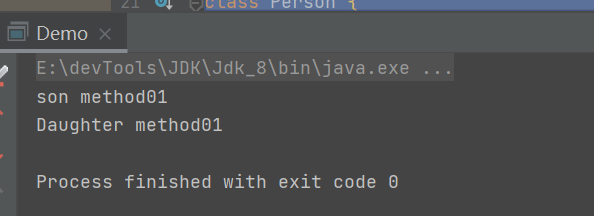
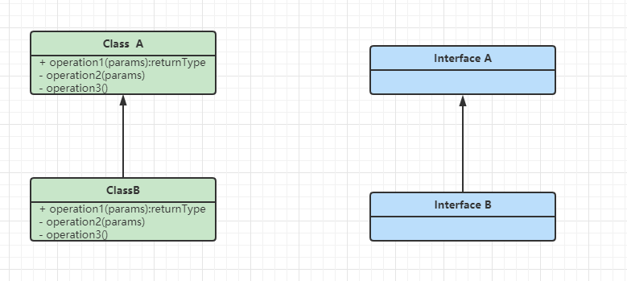
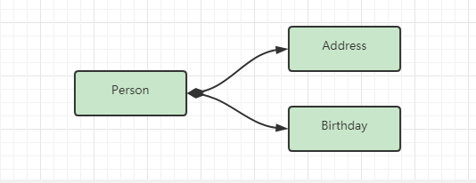

## java成神之路读书笔记

> 借鉴地址G：itee Pages 完整阅读:http://hollischuang.gitee.io/tobetopjavaer
>
> 作者：Hollis ，阿里巴巴技术专家，51CTO 专栏作家，CSDN 博客专家，掘金优秀作者， 《程序员的三门课》联合作者，《Java 工程师成神之路》系列文章作者;热衷于分享计算 机编程相关技术，博文全网阅读量数千万。


### 面向对象

> java是一种面向对象的编程语言

#### 面向过程

> 什么是面向过程？

面向过程(Procedure Oriented)是一种以过程为中心的编程思想，是一种自顶而下的编程模式。简单来说，面向过程的开发范式中，程序员需要把问题分解成一个一个步骤，每个步骤用函数实现，依次调用即可。

面向过程的编程语言以诸多流程控制语句来实现一个功能，整体表现为流程化。

**优缺点**

> 优点

流程化，执行效率高

> 缺点

维护困难，复用性差


#### 面向对象

面向对象（Object Oriented），java是一种面向对象的编程语言。在面向对象的开发过程中，回将某件事情进行抽象，将一件事物的方法属性封装到一个类中，通过多个类之间的组合调用来实现某种功能。


#### 面向对象三大基本特征

> 封装、继承、多态

##### 封装

> 如果一个类希望其他类访问其内部属性存在不同限制，那么我们可以将其方法和属性设置不同的访问权限，这就是封装。

访问级别有以下几种

- public    所有类都可以访问
- protected   受保护的，默认访问级别，同级别包下的类可以访问
- private  私有的，任何其他类都不可以访问，只供其内部访问

> 一般来说如果不是清楚的知道一个类的属性或方法需要被其他类访问，我们会将其设置为私有属性，不对外暴露。


##### 继承

> 继承是java为我们提供的可以实现代码复用的一种能力。可以拥有现有类的所有属性和功能（包括私有属性和私有方法），并且可以在此基础上进行扩展。


##### 多态

> ​	java中的多态指的是同一种操作，作用于不同的实例可以有不同的结果。是一种运行时状态，只有在运行期间才会直到调用的具体方法是什么。
>
> ​	具体表现形式为父类或接口的引用指向子类或实现类的实例。调用父类或接口中定义或声明的方法，会根据传入的不同的子类或实现类来表现不同的逻辑。

多态机制使具有不同内部结构的对象可以共享相同的外部接口。


> 编译期&运行期

编译期指的是，将源代码编译成另一个中间语言，在此期间会做一些代码规范检查，以及编译期间代码优化。

运行期，指的是程序运行在内存中，进行交互。

###### 编译期间多态

> 在编译期间已经明确知道，具体类型，知道调用什么方法。

比如说方法重载、可以通过参数列表的不同确定调用的具体方法。

###### 运行期多态

> 指的是在运行期间才会确认具体类型，才会知道调用的方法，需要`extends``implament`关键字一层一层去找。

比如说使用父类或接口的引用，指向子类或实现类的实例。

```java
public class Demo {
    public static void main(String[] args) throws ClassNotFoundException, InstantiationException, IllegalAccessException {
        Class<?> sonClass = Class.forName("com.roily.booknode.javatogod._01faceobj.extendsiscompile.Son");
        Person son = (Person) sonClass.newInstance();
        son.method1();
        Class<?> daughterClass = Class.forName("com.roily.booknode.javatogod._01faceobj.extendsiscompile.Daughter");
        Person daughter = (Person) daughterClass.newInstance();
        daughter.method1();
    }
}

class Person {
    void method1() {
        System.out.println("method1");
    }
}

class Son extends Person {
    @Override
    void method1() {
        System.out.println("son method01");
    }
}
class Daughter extends Person {
    @Override
    void method1() {
        System.out.println("Daughter method01");
    }
}
```




#### 重写和重载

> 重写（Overriding）和重载（Overloading）是两个比较重要的概念。

##### 重载

> 指的是在同一个类中，多个方法的方法名称相同而方法签名不同的现象称为重载，这些方法互称为重载方法。

方法签名：方法名+参数列表。（也就是方法名相同，参数列表不同才会构成重载）

返回类型不同不会构成重载。

- 方法名相同，参数列表不同
- 可以改变返回类型
- 可以修改访问修饰符
- 可以声明新的检查异常
- 重载可以发生在一个类中，或在子类和父类中


##### 重写

> 

#### 五大基本原则

> ​	面向对象五大基本原则，指导程序员编码，符合五大基本原则的程序，健壮性、可维护性和可扩展性都大大提高。

##### 五大基本原则，都旨在：

- 高内聚、低耦合
- 面向抽象、接口，而不是面向具体、实现

##### 单一职责

> 适用于方法、接口和类。一个类的职责尽量单一，只有一个引起它的变化。

对于方法而言，我们一般都遵守其单一职责原则

对于接口而言，抽象方法尽量要求要少，如果方法太多可以进行接口拆分

对于类而言，一般来说都不会严格遵守单一职责，比如说有一个类UserService，进行堆用户的增删改查，那么这个类想要严格遵守大一职责，完全可以拆分为四个类。

所以说，单一职责尽量遵守，类、接口、方法不要过于臃肿。在业务要求基础之上，合理遵守。


##### 开闭原则

> 对扩展开放、对修改关闭。

1、对扩展开放，意味着有新的需求时，可以在现有代码上进行扩展，以适应新的变化。

2、对修改关闭，当软件或系统一旦设计完成，可以独立完成工作，而不要其进行任何修改的尝试

> 开闭原则的重点在于，面向接口、抽象编程而不是面向实现、具体编程。
>
> 因为抽象也就是接口相对稳定，接口定义了一套标准，如果说接口添加新的抽象方法，那么就必须修改其实现类，所以说对于修改是关闭的。
>
> 而如果说现在有了一个新的需求，可以通过实现现有接口定义一个新的类，配合多态可以对当前系统功能进行扩展，所以说对扩展开放。

> 而不能面向具体，一般来说会以继承或组合的方式实现具体类的复用。具体并没有一套标准，也就是说父类修改对应逻辑，并不会要求子类修改，也就是对修改开放，违背开闭原则。

##### 里氏替换原则

> 里氏替换原则知道我们如何使用继承，是一种编程思想。
>
> 要求软件实体：子类必须能够替换其基类，并且不改变业务逻辑。


###### 里氏替换原则和继承的关系

- 继承

  > 继承是java提供的一种可以实现代码复用的语法，但是继承是侵入式的，如果在继承的过程中子类重写了父类的方法，那么说明父类的方法并不通用。

- 里氏替换原则

  > 里氏替换原则是一种编程思想，用于在指导我们合理使用继承。只有遵守了里氏替换原则，才可以实现继承复用。


##### 依赖倒置原则

> 面向接口编程，依赖于抽象。
>
> 具体定义：高层模块不依赖于底层模块，二者都依赖于抽象；抽象不依赖于具体，具体依赖于抽象。


##### 接口隔离原则

> 将臃肿的大接口拆分为一个个小接口，可以使用接口继承或实现多个接口的方式来实现多个接口定义的抽象方法。
>
> 如果一个接口过于庞大，或存在一些不必要实现的方法时，这是一种接口污染。


#### 继承和组合

> 继承和组合都是java用于实现代码复用的技术之二。优先考虑组合，尽量避免使用继承。

继承

> 继承(Inheritance)是一种联结类与类的层次模型。指的是一个类(子类、子接口)继承另外一个类(父类、父接口)的功能。并且可以增加自己新的功能的能力。继承是一种`AS-a`的关系。



组合

> 组合(Composition)体现的是整体与部分、拥有的关系，即`has-a`关系。




##### 组合&继承关系

继承是一种侵入式的代码结构，在继承关系中，父类的内部细节对于子类是可见的（继承是一种白盒式代码复用），如果父类的代码逻辑发生改变，那么如果子类调用了父类的类方法，子类的逻辑也会随之修改，甚至出错。（继承是一种编译期概念，在编译器就确认了类与类的关系）

组合是将现有对象进行拼装组合来实现较复杂的业务逻辑，将对象作为内部的一个属性，组合进来的对象其内部实现细节是不可见的（黑盒式代码复用）。（如果说组合进来的是一个接口或抽象类型，那么在编译期无法确认其具体类型，只有在运行期间才会确认，所以一定程度上复用性更高）


###### 对比

|                             组合                             |                         继承                         |
| :----------------------------------------------------------: | :--------------------------------------------------: |
|            不会破坏封装，整体类与局部类之间松耦合            | 破坏封装，子类依赖于父类，表现为父类与父类之间前耦合 |
|         组合进来的可以是一个抽象，因此具有一定扩展性         |                   可通过定义新方法                   |
| 整体类对组合进来的类进行包装，并可以做一些拓展，就是装饰器模式和代理模式 |                                                      |
|             创建整体对象的时候，必须创建局部对象             |           创建子类对象，会自动创建父类对象           |
|                                                              |                                                      |


##### 如何选择

> 多用组合、少用继承。

- 在同等情况下优先选择组合，利于扩展
- 继承也有用处，如果当前类必须要向基类进行向上转型，则可以考虑使用继承


#### 构造函数和默认构造函数

> 构造函数配合`new`关键字，用于创建实例对象和给成员变量赋值。

> 构造函数长什么样子？

构造函数和普通方法很相似，①构造函数名为类名②构造函数不声明返回类型，返回当前类对象

> 构造函数的重载

构造函数根据参数列表的不同可以实现重载。并且可以为特殊属性给与默认值。

```java
class Person{
    int age;
    String name;
    String address;
    Boolean sex;
    
    private Person(int age, String name, String address, Boolean sex){
        this.age = age;
        this.name = name;
        this.address = address;
        this.sex = sex;
    }
    public Person(int age, String name, String address){
        return Person(age,name,address,false);
    }
}
```


> 如果当前类没有构造函数，编译器会自动生成一个无参构造函数。其成员变量会被赋予默认值。

##### 如果没有构造函数

> 会生成默认构造函数

```java
public class ConstructorTest {
    int i;
    String str;
}
```

反编译后：

```java
public class ConstructorTest{
    public ConstructorTest(){
    }
    int i;
    String str;
}
```

##### 如果存在构造函数

> 会使用定义的构造函数，此刻空参构造函数不可用。

```java
class ConstructorTest2 {
    int i;
    String str;
    public ConstructorTest2(int i) {
        this.i = i;
    }
}
```

反编译后：

```java
class ConstructorTest2{
    public ConstructorTest2(int i){
        this.i = i;
    }
    int i;
    String str;
}
```


#### 类变量、成员变量和局部变量

> `java`中如果从，生命周期，作用域和内存角度去看，`java`的变量分为，类变量、成员变量和局部变量。

##### 类变量

> 类变量被`static`修饰，属于类，生命周期等同于类的生命周期，当一个类被类加载器成功加载到方法区，其就已经存在与方法区。当类被卸载的时候也跟着消失。

##### 成员变量

> 成员变量属于实例，生命周期等同于实例，当一个实例被new出来(或反射等其他方式)，会为其赋值，跟随实例存在于堆内存中。当实例对象被回收时，他也跟着消失。

##### 局部变量

> 局部变量存在于栈内存，一般存在于方法参数，循环体或方法中。

```java
public class Demo2 {
    //类变量
    final static String str1 = "abc";
    static String str2 = "abc";
 
    //成员变量
    String str3 = "abc";

    //局部变量
    void method01(String str1) {
        String str2 = "abc";
        for (StringBuilder str = new StringBuilder("abc"); str.toString().equals("abc"); ) {
        }
    }
}
```


#### 访问修饰符

- public  

> 公开的，被public修饰的成员变量和方法对所有类都是可见的，所有类和对象都可以直接访问

- private

> 私有的，被private修饰的成员变量和方法是私有的，只有当前类有访问权限。即便是子类也不可以访问

- protected

> 受保护的，被protected修饰的成员变量和方法是受保护的的，只有当前类和与其处于同一包下的类有访问权限。除非是子类

- default

> 默认的，被default修饰的成员变量和方法是受保护的的，只有当前类和与其处于同一包下的类有访问权限。即便是子类

```java
package com.roily.booknode.javatogod._01faceobj.extendsiscompile;

public class Demo3 {
    public String str1;
    String str2;
    private String str3;
    protected String str4;
}
```

子类不在同一个包下：

```java
package com.roily.booknode.javatogod._01faceobj;

import com.roily.booknode.javatogod._01faceobj.extendsiscompile.Demo3;
public class TestDemo extends Demo3{
    void method1(){
        System.out.println(str1);
        System.out.println(str4);
    }
}
```

> 可见如果不指定属性和方法的访问级别的话，默认为default。


