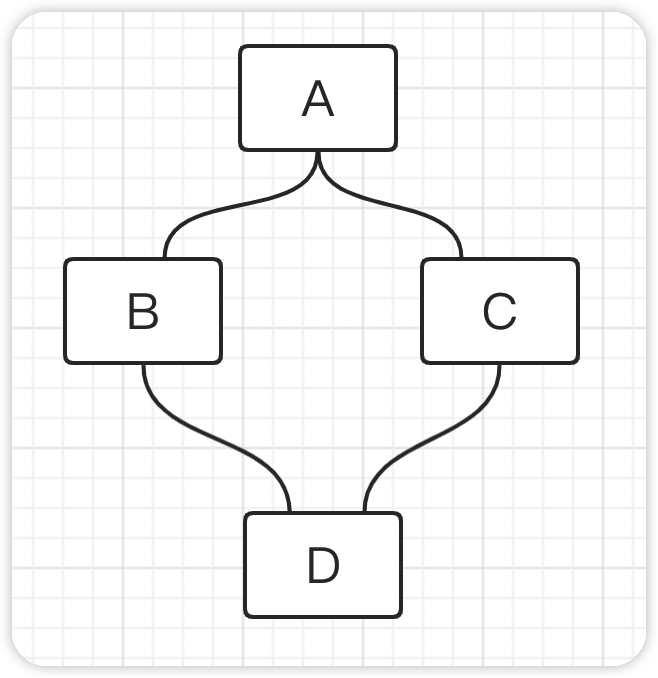

## java成神之路读书笔记

> 借鉴地址G：itee Pages 完整阅读:http://hollischuang.gitee.io/tobetopjavaer
>
> 作者：Hollis ，阿里巴巴技术专家，51CTO 专栏作家，CSDN 博客专家，掘金优秀作者， 《程序员的三门课》联合作者，《Java 工程师成神之路》系列文章作者;热衷于分享计算 机编程相关技术，博文全网阅读量数千万。


### 面向对象

> java是一种面向对象的编程语言

#### 面向过程

> 什么是面向过程？

面向过程(Procedure Oriented)是一种以过程为中心的编程思想，是一种自顶而下的编程模式。简单来说，面向过程的开发范式中，程序员需要把问题分解成一个一个步骤，每个步骤用函数实现，依次调用即可。

面向过程的编程语言以诸多流程控制语句来实现一个功能，整体表现为流程化。

**优缺点**

> 优点

流程化，执行效率高

> 缺点

维护困难，复用性差


#### 面向对象

面向对象（Object Oriented），java是一种面向对象的编程语言。在面向对象的开发过程中，回将某件事情进行抽象，将一件事物的方法属性封装到一个类中，通过多个类之间的组合调用来实现某种功能。


#### 面向对象三大基本特征

> 封装、继承、多态

##### 封装

> 如果一个类希望其他类访问其内部属性存在不同限制，那么我们可以将其方法和属性设置不同的访问权限，这就是封装。

访问级别有以下几种

- public    所有类都可以访问
- protected   受保护的，默认访问级别，同级别包下的类可以访问
- private  私有的，任何其他类都不可以访问，只供其内部访问

> 一般来说如果不是清楚的知道一个类的属性或方法需要被其他类访问，我们会将其设置为私有属性，不对外暴露。


##### 继承

> 继承是java为我们提供的可以实现代码复用的一种能力。可以拥有现有类的所有属性和功能（包括私有属性和私有方法），并且可以在此基础上进行扩展。


##### 多态

> ​	java中的多态指的是同一种操作，作用于不同的实例可以有不同的结果。是一种运行时状态，只有在运行期间才会直到调用的具体方法是什么。
>
> ​	具体表现形式为父类或接口的引用指向子类或实现类的实例。调用父类或接口中定义或声明的方法，会根据传入的不同的子类或实现类来表现不同的逻辑。

多态机制使具有不同内部结构的对象可以共享相同的外部接口。


#### 重写和重载

> 重写（Overriding）和重载（Overloading）是两个比较重要的概念。

##### 重载

> 指的是在同一个类中，多个方法的方法名称相同而方法签名不同的现象称为重载，这些方法互称为重载方法。

方法签名：方法名+参数列表。（也就是方法名相同，参数列表不同才会构成重载）

返回类型不同不会构成重载。

- 方法名相同，参数列表不同
- 可以改变返回类型
- 可以修改访问修饰符
- 可以声明新的检查异常
- 重载可以发生在一个类中，或在子类和父类中


##### 重写

> 严格意义上指的是子类中定义了和父类相同方法签名，且符合重写要求的方法，那么称子类重写了父类的方法。
>
> 接口声明抽象方法，其实现类实现抽象方法，对应方法上可以加上@OverWriting注解，也可以称为重写，更多的称为实现。

```java
public class OverWriting {
    public static void main(String[] args) {
        final Animal dog = new Dog();
        dog.bark();
    }
}
class Animal {
    void bark() {
        System.out.println("动物叫");
    }
}
class Dog extends Animal {
    @Override
    void bark() {
        System.out.println("狗叫");
    }
}
```

`输出：狗叫`

> 这里子类实例指向父类引用，是多态的表现行式，编译期间会去检查父类中是否存在对应调用方法。而运行期间具体需要调用哪个方法，需要根据具体指向的实例来决定


方法重写的条件需要具备以下条件和要求：

> 两同两小一大

- 两同（方法签名相同）
  - 方法名相同
  - 参数列表相同

- 两小
  - 返回类型的范围需要相等或更小（比如父类返回ArrayList子类就不能返回list）
  - 抛出的检查异常范围要比父类被重写方法要小
- 一大
  - 访问级别限制，比被重写方法访问范围要大(即父类是protected的那么子类重写的方法不能申明为private)

> 其他

- 不能重写被final标识的方法
- 重写的前提是继承

```java
class Person {
    void method1(int a, int b) {
        System.out.println("XX");
    }
    ArrayList<Integer> method2() {
        return null;
    }
}
class Student extends Person {
    /**
     * 两同
     * - 方法名和参数列表相同
     */
    @Override
    void method1(int a, int b) {
        System.out.println("XX");
    }
    /**
     * 两小
     * - 返回参数要比被重写方法要小（范围）
     */
    //@Override
    //List<Integer> method2() {
    //    //通过不了编译
    //    return null;
    //}
}
```

> 子类的返回范围比父类的大，通过不了编译，反过来就行


#### 继承&实现

> 继承的关键字`extends`，实现关键字`implements`。


##### 继承

> 通过继承可以拥有父类的所有属性和方法，实现代码的重用。继承可以发生在类与类之间，这个类可以是具体的也可以是抽象的，同时继承也可以发生在接口与接口之间。

> 如果说可以从某个类中抽出来可以供于公共使用的功能，那么就可以抽出一个父类出来，其他类去继承这个父类，以继承的方式来实现对代码的重用。但前提是这个抽出来的这个父类得保持稳定，也就是少量修改，且这个父类得对其他类都得适用。

一般来说不会使用继承来实现重用，特别是继承至具体的类，如果说非得继承可以继承至抽象类。


##### 实现

> 实现发生在类与接口或抽象类之间，如果说一组业务的处理方式是一样的那么就可以制定抽象（制定标准），具体业务去实现定义的抽象

```java
/**
 * 可以实现一个接口
 */
interface IPerson{
    /**
     * 抽象方法
     */
    void method();
}
class Teacher implements IPerson{

    @Override
    public void method() {
        
    }
}

/**
 * 可以是类实现抽象类的抽象方法
 */
abstract class AbstractPerson{
    
    abstract void method();
    
}
class StudentImpl extends AbstractPerson{
    
    @Override
    void method() {
        
    }
}

/**
 * 可以是抽象类实现接口
 */
abstract class AbstractPersonX implements IPerson{
    @Override
    public void method() {

    }
}
```


#### java单继承

> `java`通过`extends`关键字实现继承，且不支持多继承。

##### 为什么

> 菱形问题：假设B和C都继承自A，B和C都继承了父类A的所有属性和方法，如果java支持多继承的话，此刻有一个D继承自B和C，那么类D就同时拥有类B和类C的所有属性和方法，并且类D继承了两份来自于A的属性和方法，拥有同名属性和相同方法签名的方法是通过不了编译的，且如果通过编译，在调用的时候也会产生歧义。



##### java可以多实现

> java不支持多继承但是支持多实现

如下例子，我们在InterfaceA和InterfaceB中定义了两个同名的方法，然后使用ClassC实现它们，发现实现类对于相同方法只实现了一次。

```java
/**
 * 但是java可以多实现，且java8之后接口中可以定义default方法
 */
interface InterfaceA {
    void method1();
}
interface InterfaceB {
    void method1();
    
    void method2();
}
class ClassC implements InterfaceA, InterfaceB {
    @Override
    public void method1() {
        System.out.println("method1");
    }
    @Override
    public void method2() {
        System.out.println("method2");
    }
}
```

> 对于接口而言它只是一个标准、抽象，实现类按照约定实现标准。方然也可以指定标准，使用某个接口的引用指向实现类的实例。

```java
@Test
public void test1() {
    InterfaceB classC1 = new ClassC();
    InterfaceA classC2 = new ClassC();
}
```

> 接口中可以定义default方法，且我们可以使用Implement从多个接口中继承得到多个默认方法，特别的如果说两个接口存在相同方法签名的方法，实现类会被要求强制重写同名方法签名的方法来解决菱形问题。

```java
interface InterfaceC {
    default void method1() {
        System.out.println("InterfaceC default1方法");
    }
}
interface InterfaceD  {
    default void method1() {
        System.out.println("InterfaceD default1方法");
    }
}
/**
 * 可以使用implement从多个接口中得到多个default方法，
 * 如果存在菱形问题，会强制要求实现类重写同名方法
 */
class ClassD implements InterfaceC, InterfaceD {
    @Override
    public void method1() {
        InterfaceC.super.method1();
    }
}
```