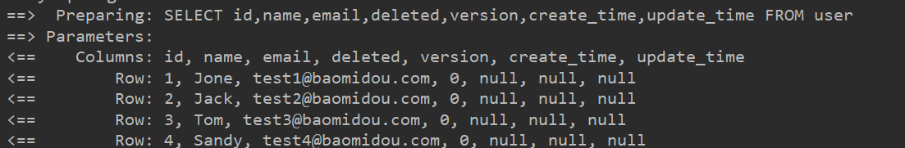

本文初步了解MybatisPlus。

呃~ ~ ~ ~ 官网讲很全 传输们[mp官网](https://baomidou.com/pages/24112f)


#### 简介

- **无侵入**mp对Mybatis只做增强不做修改
- **强大的 CRUD 操作**：简单配置即可实现单表大部分 CRUD 操作

- **支持主键自动生成**：支持多达 4 种主键策略（内含分布式唯一 ID 生成器 - Sequence），可自由配置，完美解决主键问题
- **内置代码生成器**：采用代码或者 Maven 插件可快速生成 Mapper 、 Model 、 Service 、 Controller 层代码，支持模板引擎，更有超多自定义配置等您来使用
- **内置性能分析插件**：可输出 SQL 语句以及其执行时间，建议开发测试时启用该功能，能快速揪出慢查询
- **内置全局拦截插件**：提供全表 delete 、 update 操作智能分析阻断，也可自定义拦截规则，预防误操作


#### 基本使用

[跟着官网走一遍](https://baomidou.com/pages/226c21/#初始化工程)

##### 数据库搭建

```java
CREATE TABLE `user` (
  `id` BIGINT(20) NOT NULL AUTO_INCREMENT COMMENT '主键ID',
  `name` VARCHAR(30) DEFAULT NULL COMMENT '姓名',
  `email` VARCHAR(50) DEFAULT NULL COMMENT '邮箱',
  `deleted` INT(11) DEFAULT NULL COMMENT '逻辑删除',
  `version` INT(11) DEFAULT NULL COMMENT '乐观锁',
  `create_time` DATETIME DEFAULT NULL COMMENT '插入时间',
  `update_time` DATETIME DEFAULT NULL COMMENT '修改时间',
  PRIMARY KEY (`id`)
) ENGINE=INNODB AUTO_INCREMENT=7 DEFAULT CHARSET=utf8  
    
INSERT INTO user (id, name, age, email) VALUES
(1, 'Jone', 18, 'test1@baomidou.com'),
(2, 'Jack', 20, 'test2@baomidou.com'),
(3, 'Tom', 28, 'test3@baomidou.com'),
(4, 'Sandy', 21, 'test4@baomidou.com'),
(5, 'Billie', 24, 'test5@baomidou.com');
```


##### 创建SpringBoot工程

###### 依赖

这里使用mysql

```xml
    <dependency>
        <groupId>mysql</groupId>
        <artifactId>mysql-connector-java</artifactId>
        <version>5.1.37</version>
    </dependency>
    <dependency>
        <groupId>org.projectlombok</groupId>
        <artifactId>lombok</artifactId>
        <optional>true</optional>
    </dependency>
    <dependency>
        <groupId>org.springframework.boot</groupId>
        <artifactId>spring-boot-starter-test</artifactId>
        <scope>test</scope>
    </dependency>
    <dependency>
        <groupId>com.baomidou</groupId>
        <artifactId>mybatis-plus-boot-starter</artifactId>
        <version>3.0.5</version>
    </dependency>
```
###### 配置

具体配置看注释

```yml
#mybatisplus 日志配置
mybatis-plus:
  configuration:
    log-impl: org.apache.ibatis.logging.stdout.StdOutImpl
  global-config:
    db-config:
      #logic-delete-field: flag # 全局逻辑删除的实体字段名(since 3.3.0,配置后可以忽略不配置步骤2)
      logic-delete-value: 1 # 逻辑已删除值(默认为 1)
      logic-not-delete-value: 0 # 逻辑未删除值(默认为 0)
      db-type: mysql
  ##mapper配置文件路径
  mapper-locations: mapper/*.xml
  ##实体别名路径
  type-aliases-package: com.roily.entity
#      table-prefix: u
spring:
  datasource:
    driver-class-name: com.mysql.cj.jdbc.Driver
    url: jdbc:mysql://localhost:3306/mybatis_plus?useUnicode=true&charactEncoding=utf8&useSSL=true&serverTimezone=GMT%2B8
    password: 123456
    username: root
```

启动类添加Mapper接口扫描

可以配置多个路径

```java
@MapperScan({"com.roily.mapper","com.roily.dao"})
```

```java
//点进去会发现这里有一个mapper的注册中心，所有的mapper会注册进这里
@Import(MapperScannerRegistrar.class)
```


###### 实体

```java
@Data
@NoArgsConstructor
@Builder
public class User {
    private Long id;
    private String name;
    private String email;
    private long deleted;
    private long version;
    private Date createTime;
    private Date updateTime;
}
```

###### mapper接口

```java
@Repository
public interface UserMapper extends BaseMapper<User> {
}
```

##### 测试

null  是queryWrapper 查询条件构造器，表示select *没有条件。

注意使用Lombok的话需要加无参构造注解，否则会报找不到构造器异常。 

```java
@Autowired
UserMapper userMapper;
@Test
void test01(){
    List<User> users = userMapper.selectList(null);
    System.out.println(users);
}
```

结果：




#### mp注解

##### @TableName

```java
@Documented
@Retention(RetentionPolicy.RUNTIME)
@Target(ElementType.TYPE)
public @interface TableName {
    /**
     * 实体对应的表名
     */
    String value() default "";
    /**
     * 实体映射结果集
     */
    String resultMap() default "";

}
```

这里有两个属性：

- 表名
- 结果集映射

**这个结果集映射怎么用呢？**

我们创建一个UserMapper.xml，yml中记得扫描

这个mapper中我们只定义一个resultMap用来映射结果集，将name和email调换。

```java
<?xml version="1.0" encoding="UTF-8"?>
<!DOCTYPE mapper
        PUBLIC "-//mybatis.org//DTD Mapper 3.0//EN"
        "http://mybatis.org/dtd/mybatis-3-mapper.dtd">
<mapper namespace="com.roily.mapper.UserMapper">
    <resultMap id="myResultMap" type="com.roily.entity.User2">
        <result column="name" property="email"/>
	    <result column="email" property="name"/>
    </resultMap> 
</mapper>
```

结果集配置

```java
@TableName(value = "user",resultMap = "myResultMap")
```

测试：

发现name和email确实调换了。


##### @TableId

```java
@Documented
@Retention(RetentionPolicy.RUNTIME)
//作用于属性
@Target(ElementType.FIELD)
public @interface TableId {
    /**
     * 字段值（驼峰命名方式，该值可无）
     */
    String value() default "";
    /**
     * 主键ID
     */
    IdType type() default IdType.NONE;
}
```

- value为表主键字段，默认支持驼峰命名，也可手动开启。


- type 主键生成策略


**使用：**

```java
@TableId(value = "id",type = IdType.AUTO)
```


##### @TableField

```java
@Documented
@Retention(RetentionPolicy.RUNTIME)
@Target(ElementType.FIELD)
public @interface TableField {
    String value() default "";
    String el() default "";
    boolean exist() default true;
    String condition() default "";
    String update() default "";
    FieldStrategy strategy() default FieldStrategy.DEFAULT;
    FieldFill fill() default FieldFill.DEFAULT;
    boolean select() default true;

}
```

- value 表字段名

如果在开发时自动生成的实体属性和表字段驼峰命名不一致就需要修改属性或手动配置字段名。

```java
@TableField("update_time")
private Date updateTimexxx;
```

- exist   默认true

如果实体属性和表字段对应不上，就会报`Unknown column 'test' in 'field list'`

```java
public class User {
    private String test;
}
```

此刻就需要加如下配置，mybatis就不会映射这个属性

```java
@TableField(exist = false)
private String test;
```

- condition

实体查询比较条件，默认是"="号，可以使用SqlCondition设置。%是转义、#号是占位。

```java
//public static final String LIKE = "%s LIKE CONCAT('%%',#{%s},'%%')";
@TableField(condition = SqlCondition.LIKE)
private String name;
```

也可以自定义。

```java
@TableField(condition = " %s&gt;0")
```

一般用不到

- whereStrategy

实体查询比较策略，通常我们对查询条件会有一个非空或非null判断，这里就可以帮我们做。

**！注意：这个也只对实体查询有效。**

举例：NOT_EMPTY 
`where <if test="columnProperty != null and columnProperty!=''">column=#{columnProperty}</if>`

- fill

字段自动填充策略，一般用于插入和更新时填充。

- typeHandler

类型处理器，包括statement设置值和resultSet返回值，注意必须开启AutoResultMap，不然不会生效，如果自定义resultMap，注解形式的设置也不会生效，换句话说自定义的Mapper.xml优先级最高。

- insertStrategy
- updateStrategy
- update 

官网的解释，下面测试。

字段 `update set` 部分注入，例如：当在version字段上注解`update="%s+1"` 表示更新时会 `set version=version+1` （该属性优先级高于 `el` 属性）


##### @EnumValue

普通枚举类注解(注解在枚举字段上）

比如说数据类的deleted 0 -未删除  1-删除。我们就可以定义枚举类。

```java
private IsDeleted deleted;
```

也可以实现Ienum接口。

```java
public enum IsDeleted{
    IS_DELETED(1, "已删除"),
    NOT_DELETED(0,"未删除");
    
    @EnumValue
    private final Integer deleted;
    private final String descp;
    IsDeleted(final Integer deleted, final String descp) {
        this.deleted = deleted;
        this.descp = descp;
    }
}
```


##### @TableLogic

value-默认逻辑未删除值

delval - 默认逻辑删除值

比如说：

```java
@TableLogic(value = "0", delval = "1")
private IsDeleted deleted;
```

也可以全局配置：

```yml
global-config:
  db-config:
    logic-delete-value: 1 # 逻辑已删除值(默认为 1)
    logic-not-delete-value: 0 # 逻辑未删除值(默认为 0)
```

执行删除时会修改逻辑删除字段

且查询时会默认添加条件deleted=0

`SELECT id,name,email,deleted,version,create_time,update_time FROM user WHERE deleted=0`


##### @OrderBy

```java
@OrderBy(asc = true)
```

优先级低于一切（wrapper、mapper.xml）

默认倒序，设置true顺序。


##### @Version

mp使用的是乐观锁，即当version字段被修改则修改失败。


##### 小结

这么多其实不怎么用

常用的：

1. TableName

描述数据库表名称。

2. TableId   

设置主键对应，并且可设置主键生成策略。

3. TableField

value属性：在数据库字段和实体在驼峰规则下也不匹配时，需要手动映射。

exist属性：添加冗余字段的，其实也可以手动映射。

condition和whereStrategy一般用不到。用于实体查询比较。

fill属性：一般用于插入数据自动填充，比如说create_time&modify_Time

typeHandler属性：一般也用不到，需要用的话我们在Mapper.xml文件去用，而且Mybatis提供的处理器够用了。除非你想让你同事看不懂你代码。

4. EnumValue

枚举类型，作用于枚举枚举字段上，也是很常用，自动映射就无需我们自己处理。

- TableLogic

也很常用，用于逻辑删除，一般配置全局逻辑删除。

- orderBy

不是很常用，优先级很低。


<hr>


#### 增删改查

##### 环境

```java
@Data
@AllArgsConstructor
@NoArgsConstructor
@Builder
@TableName(value = "user")
public class User2 {

    @TableId(value = "id", type = IdType.AUTO)
    @OrderBy(asc = true)
    private Long id;
    private String name;
    private String email;
    @TableLogic
    private IsDeleted deleted;
    @Version
    @TableField(fill = FieldFill.INSERT)
    private long version;
    @TableField(value = "create_time", fill = FieldFill.INSERT)
    private Date createTime;
    @TableField(value = "update_time", fill = FieldFill.INSERT_UPDATE)
    private Date updateTime;

    @TableField(exist = false)
    private String test;
}
```

```yml
#mybatisplus 日志配置
mybatis-plus:
  configuration:
    log-impl: org.apache.ibatis.logging.stdout.StdOutImpl
  global-config:
    db-config:
      logic-delete-value: 1 # 逻辑已删除值(默认为 1)
      logic-not-delete-value: 0 # 逻辑未删除值(默认为 0)
      db-type: mysql
  mapper-locations: mapper/*.xml
  type-aliases-package: com.roily.entity
  type-handlers-package: com.roily.typeHandler
  type-enums-package: com.roily.enums
#      table-prefix: u
spring:
  datasource:
    driver-class-name: com.mysql.cj.jdbc.Driver
    url: jdbc:mysql://localhost:3306/mybatis_plus?useUnicode=true&charactEncoding=utf8&useSSL=true&serverTimezone=GMT%2B8
    password: 123456
    username: root
```

##### 增加

这边主键自增自动生成，不用管，那么关于自动填充字段呢？

方法一：数据库级别设置DEFAULT  这个不太好，数据库比较底层，约束尽量要少，逻辑层面的东西都在代码级别做。

方法二：是不是可以使用handler？ 

我们第一时间想到的肯定是typeHandler吧，我们重写DateTypeHandler，但是mp在拼接sql时会直接忽略为null的属性，也就是这个处理器根本起不了作用。

```java
@Component
public class MyDateHandler extends DateTypeHandler {
    @Override
    public void setNonNullParameter(PreparedStatement ps, int i, Date parameter, JdbcType jdbcType) throws SQLException {
        if (parameter == null){
            parameter = new Date(System.currentTimeMillis());
        }
        super.setNonNullParameter(ps, i, parameter, jdbcType);
    }
}
```

所以得用他给的：

元数据对象处理器。

```java
@Component
public class MyFieldAutoFillHandler implements MetaObjectHandler {
    @Override
    public void insertFill(MetaObject metaObject) {
        setFieldValByName("updateTime", new Date(System.currentTimeMillis()), metaObject);
        setFieldValByName("createTime", new Date(System.currentTimeMillis()), metaObject);
        setFieldValByName("version", 0, metaObject);
    }
    @Override
    public void updateFill(MetaObject metaObject) {
        setFieldValByName("updateTime", new Date(System.currentTimeMillis()), metaObject);
    }
}
```

测试：

```java
@Test
public void insert(){
     User2 user = User2.builder()
             .name("于延闯")
             .email("10568192255@QQ.com")
             .build();
     int insert = userMapper.insert(user);
 }
```

主键会自动生成，不管。


##### 更新：

api：

```java
int updateById(@Param("et") T entity);//根据主键更新
int update(@Param("et") T entity, @Param("ew") Wrapper<T> updateWrapper);//条件更新
```

mp使用的乐观锁策略，更新时会去检查version，更新成功version加一。

```java
@Test
public void update() {
    User2 user2 = userMapper.selectById(18L);
    user2.setName("于延闯XXXXXXXXXX");
    userMapper.updateById(user2);
}
```

mp乐观锁使用：

```java
@Test
public void xxx() throws InterruptedException {
   Long id = 16L;
    new Thread(()->{

        User2 user1 = userMapper.selectById(id);
        System.out.println(Thread.currentThread().getName()+"获取对象：=》"+user1);
        user1.setName("乐观锁111");
        userMapper.updateById(user1);
        System.out.println(Thread.currentThread().getName()+"更新了对象：=》"+user1);

    }).start();

    new Thread(()->{

        User2 user1 = userMapper.selectById(id);
        System.out.println(Thread.currentThread().getName()+"获取对象：=》"+user1);
        user1.setName("乐观锁222");
        userMapper.updateById(user1);
        System.out.println(Thread.currentThread().getName()+"更新了对象：=》"+user1);

    }).start();

    //保证上面两个线程启动
    Thread.sleep(1000);
}
```

我们启动两个线程，都去修改id为18的行，结果将会是必有其中一个会修改失败，首先mysql是锁行的，其次在修改时会去匹配version字段，在第二个线程修改时version以及被修改过了，所以修改失败（条件不满足）。

解决：这类似于cas操作，我们可以利用自旋来解决。

```java
@Test
public void xxxx() throws InterruptedException {
    Long id = 16L;
    new Thread(() -> {
        int row = 0;
        do {
            User2 user1 = userMapper.selectById(id);
            System.out.println(Thread.currentThread().getName() + "获取对象：=》" + user1);
            user1.setName("乐观锁111");
            row = userMapper.updateById(user1);
            System.out.println(Thread.currentThread().getName() + "更新了对象：=》" + user1);
        } while (row == 0);
    }).start();

    new Thread(() -> {
        int row = 0;
        do {
            User2 user1 = userMapper.selectById(id);
            System.out.println(Thread.currentThread().getName() + "获取对象：=》" + user1);
            user1.setName("乐观锁222");
            row = userMapper.updateById(user1);
            System.out.println(Thread.currentThread().getName() + "更新了对象：=》" + user1);
        } while (row == 0);
    }).start();

    Thread.sleep(1000);
}
```

##### 删除

删除操作就很简单了，只需修改逻辑删除字段就行，关键在于配置逻辑删除字段

可以为特定属性设置

```java
@TableLogic(value = "0",delval = "1")
private IsDeleted deleted;
```

也可以全局配置

```java
logic-delete-value: 1 # 逻辑已删除值(默认为 1)
logic-not-delete-value: 0 # 逻辑未删除值(默认为 0)
```

同时逻辑删除字段在查询时也会起作用。


##### 查

api

```java
T selectById(Serializable id);//根据id查
List<T> selectByMap(@Param("cm") Map<String, Object> columnMap);///以map作为查询条件
List<T> selectList(@Param("ew") Wrapper<T> queryWrapper);//根据条件构造器查
default T selectOne(@Param("ew") Wrapper<T> queryWrapper);//基于selectList  如果集合size大于1，报异常
List<T> selectBatchIds(@Param("coll") Collection<? extends Serializable> idList);//通过id批量查询
Long selectCount(@Param("ew") Wrapper<T> queryWrapper);//条件构造器查询数量
List<Map<String, Object>> selectMaps(@Param("ew") Wrapper<T> queryWrapper);//条件构造器查询以map返回，也就是resultType = map
List<Object> selectObjs(@Param("ew") Wrapper<T> queryWrapper);//条件构造器查，自动映射为Object
<P extends IPage<T>> P selectPage(P page, @Param("ew") Wrapper<T> queryWrapper);//分页查询
```

这里只使用不了解原理，没必要，想要了解原理，得使用sql注入器。

这里重要的是Wrapper构造器的使用，newc出来点点。


