本文是`Mybatis`配置的详细说明。

> `Mybatis`是为数不多的跟着官网学习，就能学明白的，建议多看看官方文档。
>
> 传送门:[Mybatis官网](https://mybatis.org/mybatis-3/zh/index.html)
>
> [<上一章]()   ||   [下一章>]()

#### 官网提供：

MyBatis 的配置文件包含了会深深影响 MyBatis 行为的设置和属性信息。 配置文档的顶层结构如下：

- configuration（配置）
  - [properties（属性）](https://mybatis.org/mybatis-3/zh/configuration.html#properties)
  - [settings（设置）](https://mybatis.org/mybatis-3/zh/configuration.html#settings)
  - [typeAliases（类型别名）](https://mybatis.org/mybatis-3/zh/configuration.html#typeAliases)
  - [typeHandlers（类型处理器）](https://mybatis.org/mybatis-3/zh/configuration.html#typeHandlers)
  - [objectFactory（对象工厂）](https://mybatis.org/mybatis-3/zh/configuration.html#objectFactory)
  - [plugins（插件）](https://mybatis.org/mybatis-3/zh/configuration.html#plugins)
  - [environments（环境配置）](https://mybatis.org/mybatis-3/zh/configuration.html#environments)
    - environment（环境变量）
      - transactionManager（事务管理器）
      - dataSource（数据源）
  - [databaseIdProvider（数据库厂商标识）](https://mybatis.org/mybatis-3/zh/configuration.html#databaseIdProvider)
  - [mappers（映射器）](https://mybatis.org/mybatis-3/zh/configuration.html#mappers)


##### 属性（properties）

1、可以通过`properties`标签的`resource`或者`url`属性来引入外部配置文件。

2、也可以使用他的子标签`property`来配置具体属性。

3、也可以在代码中显示的引入`Properties`对象

> 以上有三个配置属性的地方，聊一聊优先级。

先说结论：

​	加载顺序： 2  -> 1-> 3

​	优先级：     3  ->1  -> 2

`mybatis`会层层覆盖之前的属性。


源码说明：源码路径：`org.apache.ibatis.builder.xml.XMLConfigBuilder`

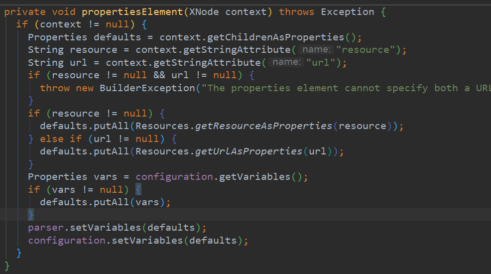

这个`XNode context`节点对象，就代表`<properties></>`节点。

- `defaults`就是将`<Properties></>`标签内的子节点封装成，`Properties`对象。  ==也就是说先读取mybatis配置文件内的配置。==

- `resource `和`url`分别是引入配置的两种方式（一般用`resource`），两种方式不能同时使用。

  以`resource`方式说明：当`resource！=null`时，也就是配置了外部配置文件，就会`defaults.putAll`,如果有重复的配置，就会覆盖。

- 最后`Properties vars = configuration.getVariables();`就是将代码形式传入的`props`对象读取出来，并覆盖之前的配置。（`Variables`会在实例化`XmlConfigration`时赋值[就是一个`props`]）


###### 测试说明配置生效顺序


> **`db.properties`和`mybatis-config.xml`结合配置：**

- 把`db.properties`里的`username`注释掉

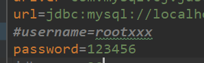

- `mybatis`配置文件

```xml
<properties  resource="db.properties">
    <property name="username" value="root"/>
</properties>
```

- 测试

```java
@Test
public void testConn2() throws IOException {
    SqlSession sqlSession = mybatisUtil.OpenSqlSession();
    System.out.println(sqlSession);
    System.out.println(sqlSession.getConnection());
}
```

- 结果：可以获取连接。

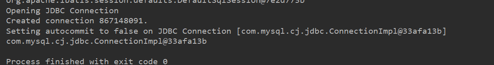


> **`db.properties`覆盖`mybatis-config.xml`配置：**

稍作修改：给一个错误的用户名

```properties
username=rootxxx
```

测试：和上面一样，只做获取连接操作。

结果：

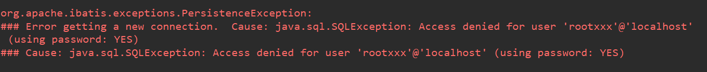

报错信息：本地用户`rootxxx`用户名和密码不匹配，也就是`db.properties`的配置覆盖了`mybatis.xml`的配置且奏效了。

如果修改为正确的用户名是没有问题的`username=root`。


> 使用代码传参的方式覆盖配置


我们`SqlSessionFactoryBuilder`的`build()`方法构建`sqlsessionFactory`对象，`build()`方法是有重载的，其中一个重载就是：


也就是说可以这样操作：

```java
mybatisUtil:

Properties properties = new Properties();
properties.setProperty("username","rootxx");
sqlSessionFactory = new SqlSessionFactoryBuilder().build(in,properties);
```

将`db.properties`和`mybatis-config.xml`配置都搞好，不报错。

测试：

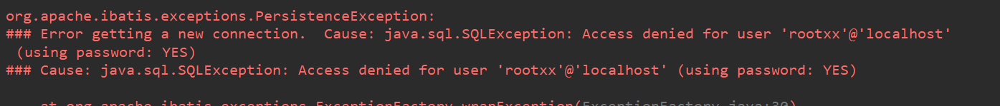

说明配置还是被我们传入的`props`属性覆盖了。


##### 设置（setting）

[`mybatis`官网]：一个完整的`setting`

```xml
<settings>
  <-- mybatis一级缓存      默认开启动 !-->
  <setting name="cacheEnabled" value="true"/>
  <setting name="lazyLoadingEnabled" value="true"/>
  <setting name="multipleResultSetsEnabled" value="true"/>
  <setting name="useColumnLabel" value="true"/>
  <setting name="useGeneratedKeys" value="false"/>
  <setting name="autoMappingBehavior" value="PARTIAL"/>
  <setting name="autoMappingUnknownColumnBehavior" value="WARNING"/>
  <setting name="defaultExecutorType" value="SIMPLE"/>
  <setting name="defaultStatementTimeout" value="25"/>
  <setting name="defaultFetchSize" value="100"/>
  <setting name="safeRowBoundsEnabled" value="false"/>
  <setting name="mapUnderscoreToCamelCase" value="false"/>
  <setting name="localCacheScope" value="SESSION"/>
  <setting name="jdbcTypeForNull" value="OTHER"/>
  <setting name="lazyLoadTriggerMethods" value="equals,clone,hashCode,toString"/>
  <setting name="logImpl" value="STDOUT_LOGGING"/>
</settings>
```

一般来说配驼峰命名和日志就行，其他使用默认。


##### 别名(TypeAlias)

两种配置方式

1、配置包

```xml
<typeAliases>
    <package name="com.roily.entity"/>
</typeAliases>
```

2、配置具体类

```xml
<typeAliases>
    <typeAlias type="com.roily.entity.Department" alias="dept"/>
</typeAliases>
```

> 说明：两种配置方式不能同时存在


最终别名和类的映射关系还是会放入`typeAliasRegistry`中。

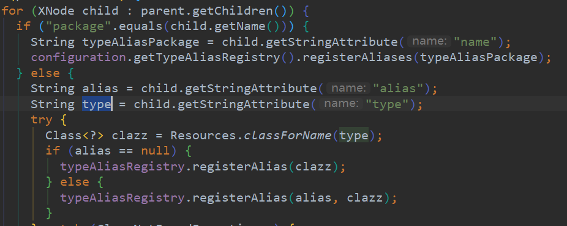

注解配置别名：

1、扫描包加注解

配置：

```xml
<typeAliases>
    <package name="com.roily.entity"/>
</typeAliases>

<select id="queryBatchAliasTest" resultType="ddd">
    select * from department
</select>
```

实体类加注解：`@Alias("ddd")`

接口：

```java
//查询所有记录
List<Department> queryBatchAliasTest();
```

> 也是可以的

2、第二种方式加注解

配置：

```xml
<typeAlias type="com.roily.entity.Department" alias="deptAlias"/>

<select id="queryBatchAliasTest2" resultType="ddd">
    select * from department
</select>
```

实体类加注解：`@Alias("ddd")`

接口：

```java
//查询所有记录
List<Department> queryBatchAliasTest();
```

报错：

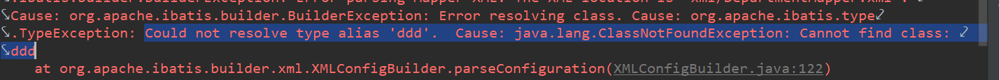

修改配置`mapper.xml`：

```xml
<select id="queryBatchAliasTest2" resultType="deptAlias">
    select * from department
</select>
```

可以的


总结：建议直接使用扫描包以类名首字母小写为类别名。

是在想使用注解的，还是基于扫描包配置，给特定的实体添加特定别名，此配置会覆盖类名首字母小写别名的配置。


##### typeHandlers（类型处理器）

> 这个是一个很重要的配置，之前我们遇到过，`java`的`util.date`类型可以直接转化为`timeStamp`类型存到数据库中，就是因为`DateTypeHandler`这个处理器。
>
> 但是一般我们不去配这个，`mybatis`提供的已经够用了。

[mybatis提供的默认的类型处理器](https://mybatis.org/mybatis-3/zh/configuration.html#typeHandlers)

跟着官网自己写一个类型处理器：

第一步：创建一个类实现`BaseTypeHandler`接口

`myCustomTypeHandler`自定义的类型处理器，泛型接口，让这个处理器只处理`VARCHAR`类型数据

```java
@MappedJdbcTypes(JdbcType.VARCHAR)
public class myCustomTypeHandler extends BaseTypeHandler<String> {

    public void setNonNullParameter(PreparedStatement ps, int i, String parameter, JdbcType jdbcType) throws SQLException {
        System.out.println("==========================");
        ps.setString(i,parameter+"XXX");
    }
    public String getNullableResult(ResultSet rs, String columnName) throws SQLException {
        String string = rs.getString(columnName);
        return string+"拿取数据1";
    }
    public String getNullableResult(ResultSet rs, int columnIndex) throws SQLException {
        String string = rs.getString(columnIndex);
        return string+"拿取数据2";
    }
    public String getNullableResult(CallableStatement cs, int columnIndex) throws SQLException {
        String string = cs.getString(columnIndex);
        return string+"拿取数据2";
    }
}
```

配置`mybatis.xml`

```xml
<typeHandlers>
    <typeHandler handler="com.roily.typeHandler.myCustomTypeHandler"/>
</typeHandlers>
```

测试：

1、取数据

```java
 @Test
public void test01(){
    SqlSession sqlSession = mybatisUtil.OpenSqlSession();
    DepartmentMapper mapper = sqlSession.getMapper(DepartmentMapper.class);
    List<Department> departments = mapper.queryBatch();
    for (Department department : departments) {
        System.out.println(department);
    }
}
```

结果：


结论：查询语句还是那样没变，会对查询结果进行处理，这里只有`department`字段是`varchar`类型，所以根据自定义的类型处理器做了相应的处理。


2、插入数据

> 同样的没有开启`sqlsession`自动提交的话，需要手动提交事务

```java
@Test
public void test02() {
    SqlSession sqlSession = mybatisUtil.OpenSqlSession();
    DepartmentMapper mapper = sqlSession.getMapper(DepartmentMapper.class);
    Department dept = Department.builder()
            .deptName("handler")
            .delete(0)
            .modifyTime(new Date())
            .createTime(new Date())
            .build();
    int i = mapper.insertIntoDept(dept);
    sqlSession.commit();
    System.out.println(i);
}
```

结果：

没有触发`处理器`

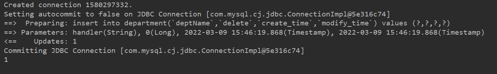

原因：没有设置`jdbcType`

```xml
<insert id="insertIntoDept">
    insert into department(`deptName`,`delete`,`create_time`,`modify_time`)
    values (#{deptName,jdbcType=VARCHAR},#{delete},#{createTime},#{modifyTime})
</insert>
```

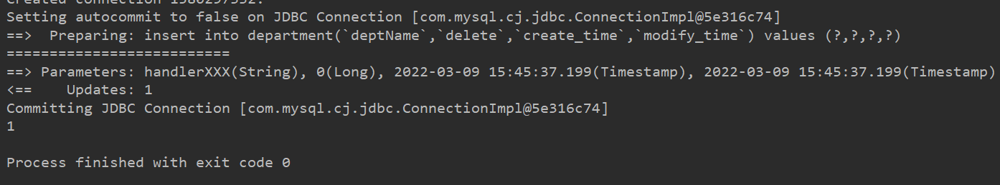


##### 环境配置（environments）

environment（环境变量）

- transactionManager（事务管理器）
- dataSource（数据源）

```xml
<environments default="dev1">
    <environment id="dev1">
        <transactionManager type="JDBC"/>
        <dataSource type="POOLED">
            <property name="driver" value="${driver}"/>
           .....
        </dataSource>
    </environment>
    <environment id="dev2">
        <transactionManager type="JDBC"/>
        <dataSource type="POOLED">
            <property name="driver" value="com.mysql.cj.jdbc.Driver"/>
            .......
        </dataSource>
    </environment>
</environments>
```

> 环境可以配置多个，但需要指定默认的环境`default`

> 事务处理器为`JDBC`。用`jdbc`的，契合容器框架。代码出自：`org.apache.ibatis.session.Configration`

```java
typeAliasRegistry.registerAlias("JDBC", JdbcTransactionFactory.class);
typeAliasRegistry.registerAlias("MANAGED", ManagedTransactionFactory.class);
```

>数据源

```java
typeAliasRegistry.registerAlias("JNDI", JndiDataSourceFactory.class);
typeAliasRegistry.registerAlias("POOLED", PooledDataSourceFactory.class);
typeAliasRegistry.registerAlias("UNPOOLED", UnpooledDataSourceFactory.class);
```

> `pooled& unpooled`就是池化技术与非池化技术，池化技术的数据源基于非池化实现。
>
> `JNDI`个人不理解，欢迎讨论。


###### 换源

> 使用`Druid`作为`mybatis`的数据源

依赖：

```xml
<dependency>
    <groupId>com.alibaba</groupId>
    <artifactId>druid</artifactId>
    <version>1.2.8</version>
</dependency>
```

自己写一个`DruidDataSourceFactory`

```java
public class DruidDataSourceFactory extends PooledDataSourceFactory {
    public DruidDataSourceFactory(){
        this.dataSource = new DruidDataSource();
    }
    @Override
    public DataSource getDataSource() {
        try {
            ((DruidDataSource)this.dataSource).init(); //初始化Druid数据源
        } catch (SQLException throwables) {
            throw new RuntimeException(throwables);
        }
        return this.dataSource;
    }
}
```

配置(`mybatis-config.xml`)：

```xml
<environment id="druid">
    <transactionManager type="JDBC"/>
    <dataSource type="com.roily.util.DruidDataSourceFactory">
        <property name="driverClassName" value="${driver}"/>
        <property name="url" value="${url}"/>
        <property name="username" value="${username}"/>
        <property name="password" value="${password}"/>
    </dataSource>
</environment>
```

测试：

```java
@Test
public void test01() {
    SqlSession sqlSession = mybatisUtil.OpenSqlSession();
    DepartmentMapper mapper = sqlSession.getMapper(DepartmentMapper.class);
    List<Department> departments = mapper.queryBatch();
    for (Department department : departments) {
        System.out.println(department);
    }
}
```

结果：使用`Druid`作为数据源，且成功获取连接。

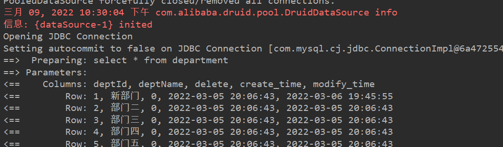


为什么需要自己定义？

`Druid`提供了两个数据源工厂，但都不是`mybatis`想要的，[那么又是为什么？`mybatis源码解析`]()

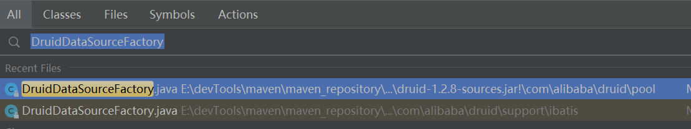

`mybatis`想要的：通过反射创建对象。

```java
DataSourceFactory factory = (DataSourceFactory) resolveClass(type).getDeclaredConstructor().newInstance();
```

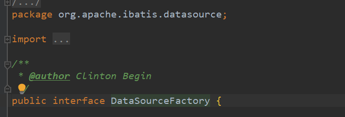

 

这里还有一个有意思的事情，`druid`数据源短语`Driver`驱动的配置，对于名字也是有要求的。

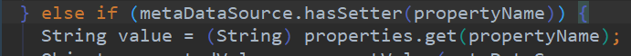

如果有兴趣可以`debug`一下，`propertyName的值为driverClassName`结果是。[后期有时间我也可以分析一下]()。

这是因为`DruidDateSource`的父类`DruidAbstractDataSource`的`set`方法：

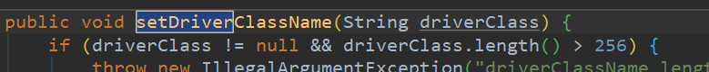


##### mapper配置

- `resource`方式 ， 也是最常用的方式

```xml
<mappers>
    <mapper resource="xml/DepartmentMapper.xml"/>
</mappers>
```

- `URl`方式  绝对路径（唯一资源定位）

```xml
<mapper url="file:E:/programmeTools/idea/git/JavaBase/Mybatis-02/src/main/resources/xml/DepartmentMapper.xml"/>
```

- `class`方式。

```xml
<mapper class="com.roily.mapper.DepartmentMapper"/>
```

1. `mapper.xml`和`mapper`结构名字一样
2. 在同一目录下
3. 配置`maven`静态资源过滤


#### 总结：

配置按规矩配，避免不必要麻烦。

`mybatis`配置总结：


`db.properties`数据库配置文件

```properties
driver=com.mysql.cj.jdbc.Driver
url=jdbc:mysql://localhost:3306/mybatis_plus?useUnicode=true&charactEncoding=utf8&useSSL=true
username=root
password=123456
```

`mybatis-config.xml`      `mybatis`核心配置文件：

```xml
<?xml version="1.0" encoding="UTF-8" ?>
<!DOCTYPE configuration
        PUBLIC "-//mybatis.org//DTD Config 3.0//EN"
        "http://mybatis.org/dtd/mybatis-3-config.dtd">
<configuration>
    <!--  映入配偶之文件  -->
    <properties resource="db.properties">
    </properties>
    <settings>
        <setting name="mapUnderscoreToCamelCase" value="true"/>
        <setting name="logImpl" value="STDOUT_LOGGING"/>
    </settings>

    <typeAliases>
        <package name="com.roily.entity"/>
    </typeAliases>
    <typeHandlers>
        <!--处理器，没啥用-->
        <typeHandler handler="com.roily.typeHandler.myCustomTypeHandler" javaType="String" jdbcType="VARCHAR"/>
    </typeHandlers>
    
    <environments default="druid">
        <environment id="druid">
            <transactionManager type="JDBC"/>
            <dataSource type="com.roily.util.DruidDataSourceFactory">
                <property name="driverClassName" value="${driver}"/>
                <property name="url" value="${url}"/>
                <property name="username" value="${username}"/>
                <property name="password" value="${password}"/>
            </dataSource>
        </environment>
        <environment id="test1">
            <transactionManager type="JDBC"/>
            <dataSource type="POOLED">
                <property name="driver" value="${driver}"/>
                <property name="url" value="${url}"/>
                <property name="username" value="${username}"/>
                <property name="password" value="${passwd}"/>
            </dataSource>
        </environment>
    </environments>
    <mappers>
        <mapper resource="xml/DepartmentMapper.xml"/>
        <mapper resource="xml/DepartmentMapper.xml"/>
    </mappers>
</configuration>
```


后期添加：[mybatis源码分析]()


