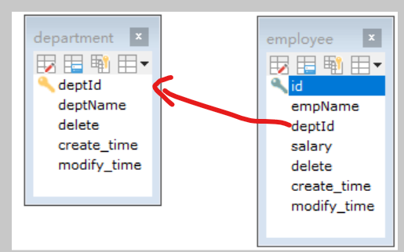
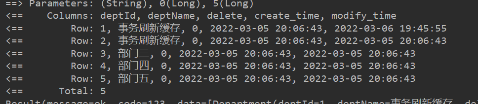

本文学习mybatis对于多参数的处理。


我们知道mybatis作为一个强大的ORM自动映射框架，对于查询参数也可以自动映射，对于简单查询我们只需传入keyWord即可，条件多的我们可以封装成一个对象，将对象作为参数传入，但在实际应用中往往需要传入多个参数，比如将查询条件和分页排序规则分开，结下来我们就聊聊这种情况。


> xxx


#### 环境搭建

两张表Department和Employee表。

```sql
CREATE TABLE `department` (
  `deptId` int(10) NOT NULL AUTO_INCREMENT COMMENT '部门id',
  `deptName` varchar(10) NOT NULL COMMENT '部门名称',
  `delete` tinyint(4) NOT NULL DEFAULT '0' COMMENT '逻辑删除字段',
  `create_time` datetime NOT NULL DEFAULT CURRENT_TIMESTAMP COMMENT '插入时间',
  `modify_time` datetime NOT NULL DEFAULT CURRENT_TIMESTAMP COMMENT '修改时间',
  PRIMARY KEY (`deptId`)
) ENGINE=InnoDB AUTO_INCREMENT=61 DEFAULT CHARSET=utf8
CREATE TABLE `employee` (
  `id` int(10) NOT NULL COMMENT '员工id',
  `empName` varchar(10) NOT NULL COMMENT '员工名称',
  `deptId` int(10) DEFAULT NULL COMMENT '部门id',
  `salary` int(10) DEFAULT '1000' COMMENT '员工工资',
  `delete` tinyint(4) NOT NULL DEFAULT '0' COMMENT '逻辑删除字段',
  `create_time` datetime NOT NULL DEFAULT CURRENT_TIMESTAMP COMMENT '插入时间',
  `modify_time` datetime NOT NULL DEFAULT CURRENT_TIMESTAMP COMMENT '修改时间',
  PRIMARY KEY (`id`)
) ENGINE=InnoDB DEFAULT CHARSET=utf8
插入相应数据~~~~~~~~~~
```

我这里没设外键，只有逻辑外键，关系如下



[mybatis的配置略过](https://juejin.cn/post/7073120041381658632#heading-2)

<hr>


####  测试

##### 第一种：

查询参数分为：查询维度和分页信息。

queryParam

```java
@Data
@Builder
public class QueryParam {
    private String keyWord;
}
```

pageUtil：

```java
@Data
public class PageUtil {

    public Long currentPage;
    public Long limit;

    public Long getStart() {
        return (currentPage-1)*limit;
    }
}
```

定义maper接口：对于多参数如果不加@Param会报空异常。

```java
public interface DepartmentMapper {
    List<Department> getAll(@Param("queryParam") QueryParam queryParam, @Param("pageUtil") PageUtil pageUtil);
}
```

mapper.xml

```xml
<mapper namespace="com.roily.mapper.DepartmentMapper">
    <select id="getAll" resultType="department">
        select * from department
        where deptName like concat('%',#{queryParam.keyWord},'%')
        limit #{pageUtil.start},#{pageUtil.limit}
    </select>
</mapper>
```

测试就对了


##### 第二种

对于这种pageUtil工具类是可复用的。我们可以继承它，甚至我们可以添加排序条件的数组。

```java
@Data
@Builder
@AllArgsConstructor
@NoArgsConstructor
public class QueryParam2 extends PageUtil{
    public String keyWord;
    
}
```

使用：

```java
List<Department> getAll4(@Param("queryParam") QueryParam2 queryParam);
```

```xml
<select id="getAll4" resultType="department">
    select * from department

    where deptName like concat('%',#{queryParam.keyWord},'%')

    limit #{queryParam.start},#{queryParam.limit}

</select>
```



测试结果都是一样的。