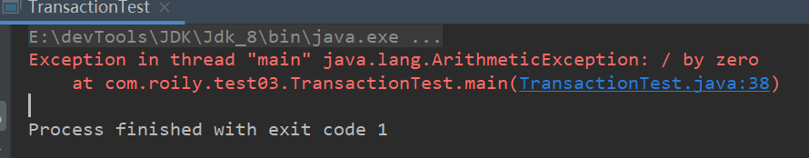
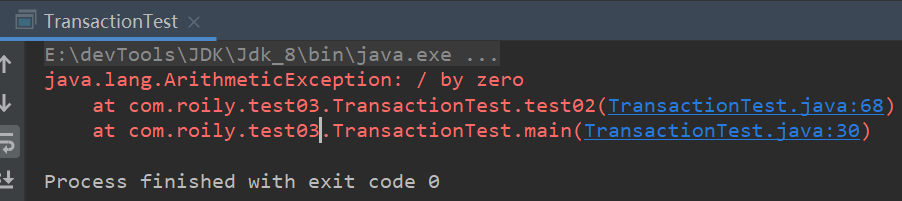
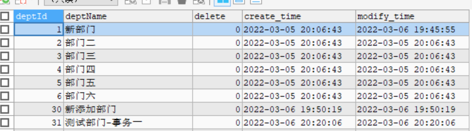

Mysql从0到0.9

此章节总结一下原生`jdbc`事务操作。

工具：`idea`  `maven` `mysql`

> [上一篇、Mysql基础]()||[下一篇]()
>
> 代码资源：[源码]()


#### 事务

acid：原子性  一致性  隔离性  持久性

假设有两条`sql`：`sql1`和`sql2`，业务要求两条`sql`是一个业务，保证原子性。

如果不加事务操作，出现`sql1`执行`sql2`执行出错（抛出异常）,不符合要求。

测试：

```java
public class TransactionTest {
    private static Connection conn;
    private static PreparedStatement prep;
    private static ResultSet resultSet;
    static {
        conn = JdbcConnectionUtil.getConn();
    }
    public static void main(String[] args) throws SQLException {
        test01();
    }
    static void test01() throws SQLException {
        String sql1 = "insert into department(deptName) values(?)";
        String sql2 = "insert into department(deptName) values(?)";
        prep = conn.prepareStatement(sql1);
        prep.setObject(1,"测试部门-事务一");
        prep.execute();

        double d = 1/0;
        prep = conn.prepareStatement(sql2);
        prep.setObject(1,"测试部门-事务二");
        prep.execute();
        
        prep.close();
        conn.close();
    }
}
```

结果：



数据库：


确实提交了一个`sql`。

添加事务操作：

```java
static void test02() throws SQLException {
    String sql1 = "insert into department(deptName) values(?)";
    String sql2 = "insert into department(deptName) values(?)";
    //关闭自动提交  并开启事务
    conn.setAutoCommit(false);
    try {
        prep = conn.prepareStatement(sql1);
        prep.setObject(1, "测试部门-事务操作一");
        prep.execute();
        double d = 1 / 0;
        prep = conn.prepareStatement(sql2);
        prep.setObject(1, "测试部门-事务操作二");
        prep.execute();
        conn.commit();
    } catch (Exception e) {
        e.printStackTrace();
        conn.rollback();
    } finally {
        prep.close();
        conn.close();
    }
}
```






> 数据回滚，保证操作原子性。